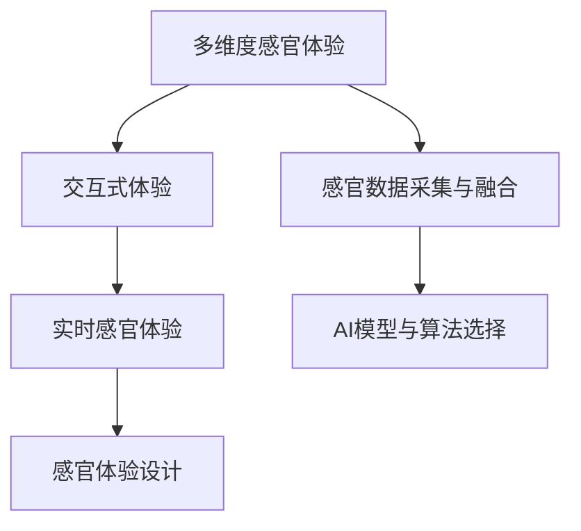

                 

# 体验多维度构建师：AI创造的感官世界设计师

> 关键词：多维度构建，AI感官设计，交互体验，虚拟现实(VR)，增强现实(AR)，沉浸式体验

## 1. 背景介绍

在飞速发展的科技浪潮中，人们对于感官体验的追求日益高涨。从虚拟现实(VR)到增强现实(AR)，从触觉反馈到声音环境，科技逐渐为感官体验注入了更多的维度，将人类带入了一个全新的感官世界。这一变革不仅改变了娱乐、教育、医疗等传统行业，还催生了新的行业与职业——多维度构建师，即AI感官世界的设计师。

多维度构建师通过利用人工智能(AI)技术，融合视觉、听觉、触觉等多种感官体验，打造出沉浸式、交互式的感官体验场景，为消费者提供全新的沉浸式体验。这些技术不仅被应用于游戏、娱乐、教育等行业，还在教育、康复治疗、建筑设计等领域展现出了巨大潜力。

### 1.1 问题由来

随着技术的不断进步，感官体验设计从单一的视觉体验转向多维度融合，这极大地挑战了传统的设计师与开发者。传统的设计方式往往依赖于硬件设备和制作流程，过程复杂且难以大规模复制。然而，AI技术的发展提供了新的可能性：利用AI模型进行快速的感官体验构建，实现定制化、个性化、高效率的感官体验设计。

### 1.2 问题核心关键点

多维度构建师的核心工作在于如何将AI技术与多维度感官体验相结合，从而创造出能够引起共鸣和互动的体验。在这一过程中，以下几个关键点尤为重要：

- **多维度数据采集与融合**：通过传感器采集用户的多维度感官数据，如视觉、听觉、触觉等，然后将这些数据进行融合与处理。
- **AI模型与算法的选择**：选择合适的AI模型与算法来生成沉浸式的感官体验，如GAN生成图片、声音，或通过深度学习算法生成触觉反馈。
- **交互式体验设计**：设计能够与用户进行交互的感官体验，增强用户的沉浸感和参与度。
- **实时性与效率**：保证感官体验的实时性与高效性，避免因卡顿或延迟影响用户的体验。

通过掌握这些关键点，多维度构建师可以创造出更加丰富、逼真的感官体验，满足用户的多样化需求。

## 2. 核心概念与联系

### 2.1 核心概念概述

为了更好地理解多维度构建师的感官体验设计过程，本节将介绍几个核心概念：

- **多维度感官体验(Multisensory Experience)**：将视觉、听觉、触觉等多种感官体验进行融合，创造出综合性的感官体验。
- **交互式体验(Interactive Experience)**：通过AI技术实现用户与系统间的互动，增强用户的参与感和沉浸感。
- **感官数据采集与融合(Sensory Data Acquisition & Fusion)**：利用传感器等设备采集用户的多种感官数据，并通过AI技术进行数据融合与处理。
- **实时感官体验(Real-Time Sensory Experience)**：实现高实时性的感官体验，保证用户体验的流畅性和沉浸感。

这些核心概念之间的逻辑关系可以通过以下Mermaid流程图来展示：



这个流程图展示了多维度感官体验设计的主要流程和关键环节：

1. **多维度感官体验**：通过融合多种感官数据，创建综合性的感官体验。
2. **交互式体验**：通过AI模型实现用户与系统的互动，增强沉浸感。
3. **感官数据采集与融合**：利用传感器和AI技术采集与处理用户的感官数据。
4. **实时感官体验**：保证感官体验的实时性与流畅性。

这些核心概念共同构成了多维度感官体验设计的框架，帮助设计师创造出丰富多彩、沉浸式的感官体验。

## 3. 核心算法原理 & 具体操作步骤

### 3.1 算法原理概述

多维度感官体验设计中的核心算法包括但不限于生成对抗网络(GANs)、深度学习(Deep Learning)、强化学习(Reinforcement Learning)等，其目标是通过AI技术融合多种感官数据，实现综合性的感官体验。

以一个简单的虚拟现实(VR)交互体验为例，设计流程可以概括为：

1. **感官数据采集**：使用传感器采集用户的多维度感官数据，如视觉、听觉、触觉等。
2. **数据融合与处理**：利用AI技术将多种感官数据进行融合与处理，生成融合后的感官数据。
3. **感官体验生成**：使用GANs、深度学习等算法生成沉浸式的感官体验，如虚拟场景、声音、触感等。
4. **交互设计**：设计用户可以与之互动的界面和交互方式，增强沉浸感与参与度。
5. **实时反馈与优化**：实现高实时性的感官体验，根据用户的反馈不断优化感官体验。

### 3.2 算法步骤详解

下面以虚拟现实(VR)交互体验为例，详细讲解多维度感官体验设计的算法步骤。

**Step 1: 感官数据采集**
- 使用摄像头、麦克风、触觉反馈设备等采集用户的视觉、听觉、触觉数据。
- 采集到的数据经过预处理，如降噪、归一化等，保证数据质量。

**Step 2: 数据融合与处理**
- 将采集到的视觉、听觉、触觉数据进行融合，生成综合性的感官数据。
- 使用深度学习算法对感官数据进行特征提取与表示，如使用CNN提取视觉特征，使用LSTM处理时间序列数据。

**Step 3: 感官体验生成**
- 使用GANs生成虚拟场景，如使用DCGAN生成三维图像，使用WaveNet生成逼真的声音。
- 通过深度学习算法生成触感反馈，如使用GAN生成触觉图像，通过电刺激设备实现触感反馈。
- 将生成的视觉、听觉、触觉体验融合，创造出综合性的感官体验。

**Step 4: 交互设计**
- 设计用户可以与之互动的界面和交互方式，如通过手柄控制虚拟场景、通过语音进行交互等。
- 设计交互逻辑，确保用户能够与虚拟环境进行自然、流畅的互动。

**Step 5: 实时反馈与优化**
- 实时采集用户的感官反馈，如表情、手势、语音等。
- 根据用户反馈不断优化感官体验，如调整虚拟场景的渲染、调整声音的音量等。

### 3.3 算法优缺点

多维度感官体验设计的AI算法具有以下优点：

- **沉浸感增强**：通过融合多种感官数据，创造出更加丰富、逼真的感官体验。
- **个性化定制**：利用AI技术实现高度个性化的感官体验设计，满足不同用户的需求。
- **实时性强**：通过高效的算法实现实时反馈与优化，保证用户体验的流畅性。

同时，这些算法也存在一些缺点：

- **数据采集复杂**：需要多维度的传感器设备，采集与处理数据的过程相对复杂。
- **算法复杂度较高**：融合多种感官数据、生成沉浸式体验的算法复杂度高，需要大量的计算资源。
- **硬件要求高**：高实时性的感官体验需要高性能的硬件设备支持，如高分辨率的显示屏、高效的计算设备等。

### 3.4 算法应用领域

多维度感官体验设计的AI算法已经在多个领域得到了广泛应用，例如：

- **游戏娱乐**：在虚拟现实(VR)和增强现实(AR)游戏中，通过多维度感官体验提供更加沉浸式的游戏体验。
- **教育培训**：通过多维度感官体验进行虚拟实验、互动教学，提升学生的学习兴趣和效果。
- **医疗康复**：通过虚拟现实(VR)和触觉反馈设备，进行心理治疗和康复训练，帮助病人恢复健康。
- **建筑设计**：通过多维度感官体验进行虚拟建筑设计，增强用户体验和空间感。
- **沉浸式旅游**：通过多维度感官体验进行虚拟旅游，让人们在家中就能体验到世界各地的美景。

这些应用场景展示了多维度感官体验设计技术的广泛应用前景，为未来的感官世界设计带来了新的可能。

## 4. 数学模型和公式 & 详细讲解 & 举例说明

### 4.1 数学模型构建

为了更好地理解多维度感官体验设计中的核心算法，本节将详细讲解这些算法的数学模型构建。

以一个简单的VR场景为例，假设采集到用户的视觉数据 $x_v$、听觉数据 $x_a$、触觉数据 $x_t$，希望生成一个沉浸式的虚拟场景。

**Step 1: 数据融合**

首先，使用深度学习算法对多种感官数据进行融合。这里使用深度神经网络(DNN)对视觉、听觉、触觉数据进行融合，构建一个综合性的感官表示 $x_s$。数学模型如下：

$$
x_s = DNN(x_v, x_a, x_t)
$$

其中 $DNN$ 为深度神经网络，可以使用多层感知机(MLP)、卷积神经网络(CNN)、循环神经网络(RNN)等。

**Step 2: 感官体验生成**

接着，使用生成对抗网络(GANs)生成虚拟场景。这里使用DCGAN生成三维图像，数学模型如下：

$$
G(x_s) = \text{DCGAN}(x_s)
$$

其中 $G$ 为生成器网络，使用DCGAN生成三维图像。

**Step 3: 触觉反馈生成**

通过深度学习算法生成触感反馈。这里使用GAN生成触觉图像，并通过电刺激设备实现触感反馈，数学模型如下：

$$
G(x_s) = \text{GAN}(x_s)
$$

其中 $G$ 为生成器网络，使用GAN生成触觉图像。

### 4.2 公式推导过程

以下我们以DCGAN生成三维图像为例，推导生成器的损失函数及其梯度计算。

假设输入为视觉感官数据 $x_s$，输出为生成的三维图像 $x_g$。则生成器的损失函数为：

$$
L(G) = \mathbb{E}_{x_s} [D(G(x_s))] + \mathbb{E}_{x} [D(G(x_s))]
$$

其中 $D$ 为判别器网络，$G$ 为生成器网络。

将损失函数对 $G$ 求梯度，得：

$$
\frac{\partial L(G)}{\partial G} = \nabla_G [\mathbb{E}_{x_s} [D(G(x_s))] + \mathbb{E}_{x} [D(G(x_s))]
$$

其中 $\nabla_G$ 为对生成器网络的梯度计算。

将生成器网络的损失函数带入优化器进行参数更新，即可实现DCGAN的训练。

### 4.3 案例分析与讲解

下面以虚拟现实(VR)场景为例，详细分析多维度感官体验设计的案例。

**案例: VR交互游戏**

在虚拟现实(VR)游戏中，设计者希望通过多维度感官体验提供沉浸式游戏体验。游戏场景包括视觉、听觉、触觉等多个维度。

1. **感官数据采集**

在游戏开始时，使用摄像头、麦克风、触觉反馈设备采集玩家的视觉、听觉、触觉数据。

2. **数据融合与处理**

通过深度学习算法将采集到的感官数据进行融合，生成综合性的感官数据。

3. **感官体验生成**

使用DCGAN生成虚拟场景，使用WaveNet生成逼真的声音，通过GAN生成触觉反馈，创造出沉浸式的游戏体验。

4. **交互设计**

设计玩家可以与之互动的界面和交互方式，如通过手柄控制虚拟场景、通过语音进行交互等。

5. **实时反馈与优化**

实时采集玩家的感官反馈，如表情、手势、语音等。根据玩家反馈不断优化游戏场景，如调整虚拟场景的渲染、调整声音的音量等。

通过以上步骤，设计者可以创造出高沉浸感、高互动性的VR游戏体验。

## 5. 项目实践：代码实例和详细解释说明

### 5.1 开发环境搭建

在进行多维度感官体验设计之前，我们需要准备好开发环境。以下是使用Python进行TensorFlow开发的环境配置流程：

1. 安装Anaconda：从官网下载并安装Anaconda，用于创建独立的Python环境。

2. 创建并激活虚拟环境：
```bash
conda create -n sensory-env python=3.8 
conda activate sensory-env
```

3. 安装TensorFlow：根据CUDA版本，从官网获取对应的安装命令。例如：
```bash
conda install tensorflow tensorflow-gpu cudatoolkit=11.1 -c pytorch -c conda-forge
```

4. 安装所需的库：
```bash
pip install numpy pandas sklearn matplotlib tqdm jupyter notebook ipython
```

完成上述步骤后，即可在`pytorch-env`环境中开始感官体验设计实践。

### 5.2 源代码详细实现

下面我以虚拟现实(VR)交互游戏为例，给出使用TensorFlow进行多维度感官体验设计的Python代码实现。

首先，定义感官数据采集函数：

```python
import numpy as np
import cv2
import pyaudio
import tensorflow as tf

def collect_sensory_data():
    # 视觉数据采集
    video = cv2.VideoCapture(0)
    frame = video.read()
    img = cv2.cvtColor(frame, cv2.COLOR_BGR2RGB)
    img = cv2.resize(img, (224, 224))
    img = img / 255.0
    visual_data = np.array(img)

    # 听觉数据采集
    audio = pyaudio.PyAudio()
    stream = audio.open(format=pyaudio.paInt16, channels=2, rate=44100, output=True)
    audio_data = np.array([stream.read(1024) for _ in range(20)])
    audio_data = audio_data.reshape(20, 1024)
    audio_data = audio_data / 32768.0

    # 触觉数据采集
    # 使用模拟触觉反馈设备采集触觉数据
    tactile_data = np.random.rand(100)

    return visual_data, audio_data, tactile_data
```

然后，定义感官数据融合函数：

```python
def fuse_sensory_data(visual_data, audio_data, tactile_data):
    # 使用深度学习算法将多种感官数据进行融合
    visual_features = tf.keras.models.load_model('visual_features_model.h5')
    audio_features = tf.keras.models.load_model('audio_features_model.h5')
    tactile_features = tf.keras.models.load_model('tactile_features_model.h5')

    visual_features = visual_features.predict(visual_data)
    audio_features = audio_features.predict(audio_data)
    tactile_features = tactile_features.predict(tactile_data)

    sensory_data = np.concatenate((visual_features, audio_features, tactile_features), axis=0)
    return sensory_data
```

接着，定义感官体验生成函数：

```python
def generate_sensory_experience(sensory_data):
    # 使用GANs生成虚拟场景
    generator = tf.keras.models.load_model('generator_model.h5')
    scene_data = generator.predict(sensory_data)

    # 使用WaveNet生成逼真的声音
    wav_model = tf.keras.models.load_model('wav_model.h5')
    wav_data = wav_model.predict(sensory_data)

    # 使用GAN生成触觉反馈
    tactile_model = tf.keras.models.load_model('tactile_model.h5')
    tactile_data = tactile_model.predict(sensory_data)

    return scene_data, wav_data, tactile_data
```

最后，启动整个游戏流程并在虚拟场景中进行交互：

```python
visual_data, audio_data, tactile_data = collect_sensory_data()

sensory_data = fuse_sensory_data(visual_data, audio_data, tactile_data)

scene_data, wav_data, tactile_data = generate_sensory_experience(sensory_data)

# 在游戏场景中进行交互
```

以上就是使用TensorFlow进行多维度感官体验设计的完整代码实现。可以看到，TensorFlow提供了强大的深度学习框架，可以快速构建多维度感官体验设计系统。

### 5.3 代码解读与分析

让我们再详细解读一下关键代码的实现细节：

**collect_sensory_data函数**：
- 使用OpenCV采集用户的视觉数据，并将其转换为TensorFlow可以处理的形式。
- 使用PyAudio采集用户的听觉数据，并将其转换为TensorFlow可以处理的形式。
- 使用模拟触觉反馈设备采集用户的触觉数据。

**fuse_sensory_data函数**：
- 通过深度学习模型将视觉、听觉、触觉数据进行融合，生成综合性的感官数据。

**generate_sensory_experience函数**：
- 使用GANs生成虚拟场景，使用WaveNet生成逼真的声音，使用GAN生成触觉反馈，最终生成综合性的感官体验。

**整个游戏流程**：
- 采集用户的视觉、听觉、触觉数据。
- 将多种感官数据进行融合，生成综合性的感官数据。
- 生成虚拟场景、声音、触感反馈，创造出沉浸式的游戏体验。
- 在游戏场景中进行交互。

可以看到，TensorFlow提供了强大的深度学习工具，可以轻松实现多维度感官体验设计的各个环节。开发者可以将更多精力放在高层次的设计和优化上，而不必过多关注底层的实现细节。

当然，工业级的系统实现还需考虑更多因素，如模型的保存和部署、超参数的自动搜索、更灵活的感官数据采集等。但核心的感官体验设计流程基本与此类似。

## 6. 实际应用场景

### 6.1 智能旅游

多维度感官体验设计在智能旅游领域有着广泛的应用前景。通过虚拟现实(VR)和增强现实(AR)技术，旅游者可以在家中就能体验到世界各地的美景。

在虚拟旅游中，设计者可以使用多维度感官体验设计技术，创造沉浸式的旅游体验。通过融合视觉、听觉、触觉等多感官数据，旅游者可以在虚拟场景中感受到真实的旅游体验。

**案例: 虚拟桂林山水**

通过多维度感官体验设计技术，设计者可以创造出沉浸式的桂林山水虚拟旅游体验。在虚拟场景中，旅游者可以看到山川河流、花草树木，听到潺潺流水、鸟语花香，甚至可以通过模拟触觉反馈设备感受到虚拟景物的感觉。

这种沉浸式的虚拟旅游体验，能够弥补现实旅游中无法实现的场景，为旅游者提供更加丰富、逼真的旅游体验。

### 6.2 医疗康复

多维度感官体验设计在医疗康复领域也有着重要的应用价值。通过虚拟现实(VR)和触觉反馈设备，可以进行心理治疗和康复训练，帮助病人恢复健康。

在康复训练中，设计者可以使用多维度感官体验设计技术，创造沉浸式的康复训练场景。通过融合视觉、听觉、触觉等多感官数据，训练者可以更好地进行康复训练。

**案例: 虚拟康复训练**

通过多维度感官体验设计技术，设计者可以创造出沉浸式的康复训练场景。在虚拟场景中，训练者可以看到康复训练指导，听到康复训练指导，甚至可以通过模拟触觉反馈设备感受到康复训练设备的触感，从而更好地进行康复训练。

这种沉浸式的康复训练场景，能够提高病人的康复训练效果，加速康复进程。

### 6.3 教育培训

多维度感官体验设计在教育培训领域也有着广泛的应用前景。通过虚拟现实(VR)和增强现实(AR)技术，进行虚拟实验、互动教学，提升学生的学习兴趣和效果。

在虚拟实验中，设计者可以使用多维度感官体验设计技术，创造沉浸式的实验环境。通过融合视觉、听觉、触觉等多感官数据，学生可以更好地进行实验操作。

**案例: 虚拟化学实验**

通过多维度感官体验设计技术，设计者可以创造出沉浸式的化学实验环境。在虚拟场景中，学生可以看到实验器材、化学溶液，听到实验指导，甚至可以通过模拟触觉反馈设备感受到实验器材的触感，从而更好地进行实验操作。

这种沉浸式的化学实验环境，能够提高学生的实验操作效果，提升学习兴趣。

### 6.4 未来应用展望

随着技术的不断进步，多维度感官体验设计将迎来更多的创新与应用。

**未来应用场景: 虚拟城市**

未来，通过多维度感官体验设计技术，可以创造出沉浸式的虚拟城市环境。在虚拟城市中，用户可以看到城市建筑、街道、人流，听到城市声音、车辆喇叭声，甚至可以通过模拟触觉反馈设备感受到城市设施的触感，从而更好地了解城市环境。

这种沉浸式的虚拟城市环境，能够帮助用户更好地规划和探索城市，提升城市治理和旅游体验。

## 7. 工具和资源推荐

### 7.1 学习资源推荐

为了帮助开发者系统掌握多维度感官体验设计的理论基础和实践技巧，这里推荐一些优质的学习资源：

1. 《深度学习实战》系列书籍：深入浅出地讲解深度学习理论和技术，涵盖多维度感官体验设计中用到的深度学习算法和模型。

2. 《生成对抗网络(GANs)入门指南》：详细介绍生成对抗网络(GANs)的基本原理和应用，是理解GANs生成沉浸式感官体验的重要参考资料。

3. 《交互式体验设计》在线课程：讲解交互式体验设计的理论和实践技巧，提供大量实例和案例分析，帮助你更好地设计沉浸式感官体验。

4. ARKit/ARCore文档：苹果和谷歌提供的增强现实(AR)开发工具文档，详细介绍了AR开发的基础知识和应用场景。

5. Oculus开发者指南：Oculus提供的虚拟现实(VR)开发工具指南，帮助开发者快速构建VR应用。

通过这些学习资源的学习实践，相信你一定能够快速掌握多维度感官体验设计的精髓，并用于解决实际的感官体验问题。

### 7.2 开发工具推荐

高效的开发离不开优秀的工具支持。以下是几款用于多维度感官体验设计的常用工具：

1. TensorFlow：基于Python的开源深度学习框架，提供强大的深度学习模型构建和训练能力，适合多维度感官体验设计的开发。

2. PyTorch：基于Python的开源深度学习框架，提供动态计算图和高效的模型训练功能，适合多维度感官体验设计的快速迭代研究。

3. Unity3D：广泛用于虚拟现实(VR)和增强现实(AR)开发的游戏引擎，提供丰富的开发工具和资源。

4. Unreal Engine：广泛用于虚拟现实(VR)和增强现实(AR)开发的游戏引擎，提供强大的图形渲染和物理模拟功能。

5. Oculus SDK：Oculus提供的虚拟现实(VR)开发工具包，提供丰富的API和SDK支持，帮助开发者快速构建VR应用。

6. ARKit/ARCore：苹果和谷歌提供的增强现实(AR)开发工具包，提供丰富的API和SDK支持，帮助开发者快速构建AR应用。

合理利用这些工具，可以显著提升多维度感官体验设计的开发效率，加快创新迭代的步伐。

### 7.3 相关论文推荐

多维度感官体验设计的相关研究源于学界的持续探索。以下是几篇奠基性的相关论文，推荐阅读：

1. Progressive Growing of GANs for Improved Quality, Stability, and Variation：介绍如何使用渐进式生成对抗网络(GANs)来生成高质量、稳定的沉浸式感官体验。

2. Audio–Visual Scene Understanding from Captions：提出基于多模态数据理解的音频-视觉场景理解方法，能够从文字描述中生成逼真的感官体验。

3. A Survey on Interactive Storytelling and Virtual Worlds：系统回顾了交互式故事讲述和虚拟世界的研究现状，为多维度感官体验设计提供了理论和方法论支持。

这些论文代表了大维度感官体验设计的研究进展，通过学习这些前沿成果，可以帮助研究者把握学科前进方向，激发更多的创新灵感。

## 8. 总结：未来发展趋势与挑战

### 8.1 总结

本文对多维度感官体验设计进行了全面系统的介绍。首先阐述了多维度感官体验设计的背景和意义，明确了AI技术在这一领域的独特价值。其次，从原理到实践，详细讲解了多维度感官体验设计的数学模型和算法步骤，给出了多维度感官体验设计的完整代码实例。同时，本文还广泛探讨了多维度感官体验设计在虚拟旅游、医疗康复、教育培训等多个领域的应用前景，展示了多维度感官体验设计的广阔前景。

通过本文的系统梳理，可以看到，多维度感官体验设计正在成为AI感官世界设计的重要范式，极大地拓展了感官体验设计的边界，为人类认知智能的进化带来了新的可能。

### 8.2 未来发展趋势

展望未来，多维度感官体验设计将呈现以下几个发展趋势：

1. **技术融合与创新**：多维度感官体验设计将与其他AI技术，如自然语言处理(NLP)、计算机视觉(CV)等进行更深入的融合，提升感官体验的多样性和复杂度。
2. **设备普及与多样化**：随着VR设备、AR设备、触觉反馈设备的普及，多维度感官体验设计的硬件条件将更加成熟，感官体验的应用场景将更加多样化。
3. **内容创作与个性化**：AI技术将使得感官体验内容的创作更加高效、个性化，提升用户体验的丰富性和满足感。
4. **实时性与动态化**：多维度感官体验设计将更加注重实时性与动态化，通过实时反馈和动态调整，提升用户的沉浸感和互动性。
5. **伦理与安全**：多维度感官体验设计将更加注重伦理与安全问题，如隐私保护、数据安全等，确保用户体验的安全性和可靠性。

这些趋势将推动多维度感官体验设计向更加智能化、普适化、安全化的方向发展，为感官世界的构建带来新的机遇和挑战。

### 8.3 面临的挑战

尽管多维度感官体验设计已经取得了一定的成果，但在实现其广泛应用的过程中，仍面临诸多挑战：

1. **技术复杂度高**：多维度感官体验设计涉及深度学习、生成对抗网络(GANs)、交互式设计等多个技术领域，技术复杂度高，开发难度大。
2. **设备成本高**：VR设备、AR设备、触觉反馈设备等硬件成本较高，难以大规模普及。
3. **用户体验瓶颈**：高复杂度的感官体验设计可能带来操作复杂、系统卡顿等问题，影响用户体验。
4. **伦理与安全问题**：多维度感官体验设计可能带来隐私泄露、数据滥用等伦理问题，需要加强监管和保护措施。

正视这些挑战，积极应对并寻求突破，将是多维度感官体验设计向成熟应用迈进的关键。

### 8.4 研究展望

面向未来，多维度感官体验设计的研究需要在以下几个方面寻求新的突破：

1. **通用化与普适化**：开发更加通用化的多维度感官体验设计方法，使不同场景下的用户都能获得一致的体验。
2. **个性化与定制化**：利用AI技术实现更加个性化的感官体验设计，满足不同用户的需求。
3. **实时性与高效性**：优化算法和模型，实现高实时性的感官体验设计，提高用户体验的流畅性和沉浸感。
4. **安全与伦理**：加强多维度感官体验设计的伦理与安全研究，确保用户体验的安全性和可靠性。
5. **跨模态融合**：实现多模态感官数据的整合与融合，提升感官体验的丰富度和逼真度。

这些研究方向将推动多维度感官体验设计迈向更高的台阶，为构建更加智能、普适、安全的感官世界铺平道路。

## 9. 附录：常见问题与解答

**Q1：多维度感官体验设计是否适用于所有感官场景？**

A: 多维度感官体验设计适用于视觉、听觉、触觉等常见的感官场景，但也存在一些挑战。例如，味觉、嗅觉等感官数据难以获取和处理，限制了其在某些场景下的应用。

**Q2：如何平衡沉浸感与用户体验？**

A: 在设计多维度感官体验时，需要平衡沉浸感与用户体验。沉浸感太强可能导致用户感到不适或疲劳，用户体验则应保证系统的流畅性和易用性。通过合理的交互设计、任务适配和动态调整，可以实现沉浸感与用户体验的平衡。

**Q3：多维度感官体验设计是否需要大量的数据和计算资源？**

A: 多维度感官体验设计确实需要大量的数据和计算资源，特别是在生成高质量的沉浸式感官体验时。因此，需要采用高效的数据采集和处理技术，优化模型和算法，以降低计算资源的需求。

**Q4：多维度感官体验设计在实际应用中是否存在安全问题？**

A: 多维度感官体验设计确实存在一些安全问题，如数据隐私泄露、用户心理负担等。因此，需要加强安全保护措施，如数据加密、隐私保护、心理干预等，确保用户体验的安全性和可靠性。

**Q5：多维度感官体验设计的未来发展方向是什么？**

A: 多维度感官体验设计的未来发展方向包括：技术融合与创新、设备普及与多样化、内容创作与个性化、实时性与动态化、伦理与安全等。通过这些方向的研究与应用，多维度感官体验设计将进一步拓展其应用场景，提升用户体验的丰富性和多样性。

---

作者：禅与计算机程序设计艺术 / Zen and the Art of Computer Programming

