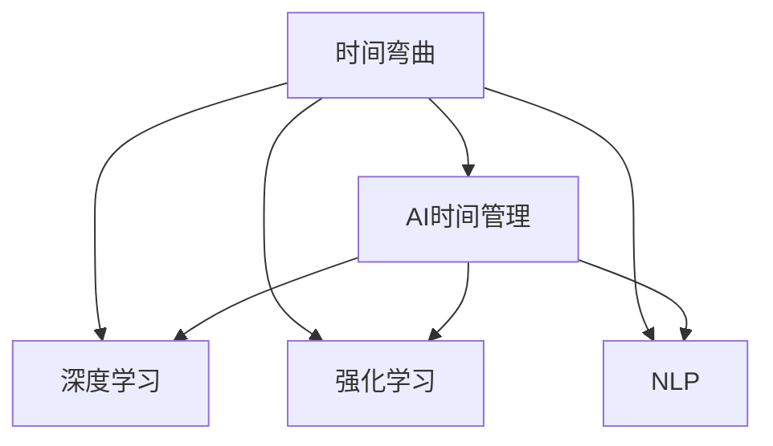

                 

# 体验时间弯曲技术：AI创造的主观时间调节

> 关键词：时间弯曲,人工智能,主观时间,时间调节,时间管理,深度学习,神经网络

## 1. 背景介绍

### 1.1 问题由来
现代社会的快节奏生活，常常让人们感到时间紧迫、压力山大。如何在有限的时间内高效完成任务，成为每个人都需要面对的挑战。幸运的是，人工智能技术的飞速发展，提供了一种全新的时间管理解决方案：时间弯曲技术。

时间弯曲（Time Warping）一词源于物理学的概念，指通过时空扭曲改变时间流逝的速度。在人工智能领域，它被赋予了新的意义：通过智能算法，对时间进行调控，实现任务加速、延后或分布式管理，达到更高效的时间利用。

随着深度学习和大数据技术的进步，基于AI的时间弯曲技术日益成熟，并在多个领域展现出了强大的应用潜力。例如，在金融分析、项目管理、智能制造等领域，通过时间弯曲技术，可以大幅提升效率，减少人为误差。

### 1.2 问题核心关键点
时间弯曲技术的核心在于如何将AI技术与时间管理相结合，实现任务与时间的精准匹配。其关键点包括：

- **时间模型**：建立准确的时间模型，理解任务的优先级和依赖关系。
- **算法设计**：选择合适的算法，实现时间与任务的动态平衡。
- **数据驱动**：通过大数据分析，优化时间弯曲的策略。
- **用户体验**：保证时间弯曲技术易于使用，适应用户的习惯。

这些关键点共同构成了时间弯曲技术的核心框架，使得AI能够更好地帮助用户管理时间。

### 1.3 问题研究意义
时间弯曲技术的研究与应用，对于提升个人和企业的时间管理水平，具有重要意义：

1. **提升效率**：通过智能调度，时间弯曲技术能够显著提高任务处理速度，减少时间浪费。
2. **减少压力**：合理的任务分配，使人们能够在轻松舒适的状态下完成任务。
3. **促进协作**：时间弯曲技术通过智能算法，可以更好地协调团队成员的工作，提升团队效率。
4. **支持决策**：通过数据分析，时间弯曲技术可以为决策者提供更准确的时间评估和建议。

## 2. 核心概念与联系

### 2.1 核心概念概述

为更好地理解时间弯曲技术，本节将介绍几个密切相关的核心概念：

- **时间弯曲（Time Warping）**：指通过智能算法对时间进行调控，以适应任务需求的过程。
- **AI时间管理**：利用人工智能技术对时间进行智能管理和调控。
- **深度学习**：通过多层神经网络，对时间数据进行建模和分析。
- **强化学习**：通过奖励机制，优化时间调节策略。
- **自然语言处理（NLP）**：使用NLP技术，理解用户的指令和反馈。

这些核心概念之间的逻辑关系可以通过以下Mermaid流程图来展示：



这个流程图展示了一天弯曲技术的核心概念及其之间的关系：

1. 时间弯曲通过AI技术实现。
2. 深度学习用于时间数据的建模和分析。
3. 强化学习优化时间调节策略。
4. NLP技术用于理解用户指令和反馈。

这些概念共同构成了时间弯曲技术的理论基础，使得AI能够更好地帮助用户管理时间。

## 3. 核心算法原理 & 具体操作步骤
### 3.1 算法原理概述

时间弯曲技术的核心在于通过AI算法，对时间进行动态调整，以达到任务与时间的最佳匹配。其核心思想是：将时间看作一种资源，通过智能算法优化其使用，实现任务加速、延后或分布式管理。

形式化地，假设时间资源为 $T$，任务集合为 $J$，每个任务的执行时间为 $t_j$，任务 $j$ 在时间 $t$ 的执行代价为 $c_j(t)$。时间弯曲的目标是找到最优的时间调节策略 $\sigma$，使得总执行代价最小化：

$$
\min_{\sigma} \sum_{j \in J} \int_0^T c_j(\sigma(t)) dt
$$

其中 $\sigma(t)$ 表示时间 $t$ 的调节策略。

### 3.2 算法步骤详解

时间弯曲技术的具体实施，可以分为以下几个关键步骤：

**Step 1: 任务建模**
- 收集任务数据，包括任务名称、执行时间、依赖关系、优先级等。
- 使用深度学习算法对任务进行建模，建立时间-任务的关系图。

**Step 2: 策略优化**
- 定义任务执行代价函数 $c_j(t)$，根据任务性质（如计算密集型、I/O密集型等）设定不同的代价模型。
- 使用强化学习算法，优化时间调节策略 $\sigma(t)$，最小化总执行代价。
- 引入正则化技术，如惩罚延迟、鼓励并发，优化策略的稳定性和效率。

**Step 3: 实施与监控**
- 根据优化后的策略，实时调整任务的执行时间，确保任务按时完成。
- 实时监控任务执行状态，及时发现异常，调整策略。
- 通过用户反馈和数据分析，持续优化时间弯曲策略。

### 3.3 算法优缺点

时间弯曲技术具有以下优点：
1. **高效性**：通过智能算法优化时间使用，显著提升任务处理效率。
2. **灵活性**：可以根据任务特性，动态调整时间资源。
3. **自动化**：通过算法自动调节时间，减少人工干预，降低人为误差。
4. **可扩展性**：能够适应大规模任务集，实现全局最优。

同时，该方法也存在一定的局限性：
1. **复杂度**：算法复杂，需要大量数据和计算资源。
2. **不确定性**：任务特性变化多端，难以预测最优策略。
3. **鲁棒性**：外部干扰（如系统故障）可能导致策略失效。
4. **隐私性**：任务和时间的动态调整，可能涉及用户隐私。

尽管存在这些局限性，但就目前而言，时间弯曲技术仍是大规模任务集管理的重要手段。未来相关研究的重点在于如何进一步降低算法复杂度，提高策略的鲁棒性和隐私保护，同时兼顾可扩展性和自动化水平。

### 3.4 算法应用领域

时间弯曲技术已经在多个领域得到了广泛的应用，例如：

- **金融分析**：通过时间弯曲技术，实现高频交易、风险评估等任务的自动化管理。
- **项目管理**：在项目任务调度和资源分配中，通过时间弯曲技术提升项目管理效率。
- **智能制造**：在生产流程和设备维护中，通过时间弯曲技术实现动态调度，优化生产效率。
- **教育培训**：在学生学习路径规划和课程安排中，通过时间弯曲技术实现个性化教育。
- **医疗健康**：在患者诊疗和医疗资源分配中，通过时间弯曲技术实现高效医疗服务。

除了上述这些经典应用外，时间弯曲技术还被创新性地应用到更多场景中，如智能交通、物流配送、能源管理等，为各行各业提供了全新的时间管理解决方案。随着时间弯曲方法的不断演进，相信它将在更广阔的领域带来深远的影响。

## 4. 数学模型和公式 & 详细讲解 & 举例说明

### 4.1 数学模型构建

本节将使用数学语言对时间弯曲技术进行更加严格的刻画。

记任务集合为 $J$，时间资源为 $T$，每个任务的执行时间为 $t_j$，任务 $j$ 在时间 $t$ 的执行代价为 $c_j(t)$。时间弯曲的目标是找到最优的时间调节策略 $\sigma$，使得总执行代价最小化：

$$
\min_{\sigma} \sum_{j \in J} \int_0^T c_j(\sigma(t)) dt
$$

其中 $\sigma(t)$ 表示时间 $t$ 的调节策略。

### 4.2 公式推导过程

以下我们以最小化总执行代价为例，推导时间弯曲的优化公式。

假设任务 $j$ 在时间 $t$ 的执行代价为 $c_j(t)$，为线性函数，即：

$$
c_j(t) = k_j \cdot \sigma(t)
$$

其中 $k_j$ 为代价系数，$\sigma(t)$ 为时间调节策略。则总执行代价可以表示为：

$$
\mathcal{C}(\sigma) = \sum_{j \in J} \int_0^T k_j \cdot \sigma(t) dt
$$

为了最小化 $\mathcal{C}(\sigma)$，需要对 $\sigma(t)$ 进行积分。由于 $\sigma(t)$ 是一个连续函数，可以通过分段线性化的方法，将 $\sigma(t)$ 分解为若干个时间段 $\sigma_k(t)$，每个时间段内的 $\sigma(t)$ 为常数：

$$
\sigma(t) = \sum_{k=1}^K \sigma_k \cdot \chi_{[t_k, t_{k+1})}(t)
$$

其中 $\chi_{[t_k, t_{k+1})}(t)$ 为单位脉冲函数，$\sigma_k$ 为第 $k$ 个时间段的策略值。

将上述分段函数代入总执行代价公式，得：

$$
\mathcal{C}(\sigma) = \sum_{k=1}^K \sum_{j \in J} k_j \cdot \sigma_k \cdot \int_{t_k}^{t_{k+1}} dt
$$

化简得：

$$
\mathcal{C}(\sigma) = \sum_{k=1}^K \sum_{j \in J} k_j \cdot \sigma_k \cdot (t_{k+1} - t_k)
$$

最小化总执行代价即最小化 $\mathcal{C}(\sigma)$。为了简化问题，可以引入拉格朗日乘子法，将总执行代价函数和约束条件结合起来：

$$
\mathcal{L}(\sigma, \lambda) = \sum_{k=1}^K \sum_{j \in J} k_j \cdot \sigma_k \cdot (t_{k+1} - t_k) + \lambda \left(\sum_{k=1}^K \sigma_k - 1\right)
$$

其中 $\lambda$ 为拉格朗日乘子，$\sum_{k=1}^K \sigma_k = 1$ 为时间策略的约束条件。

对上述函数求偏导，得：

$$
\frac{\partial \mathcal{L}}{\partial \sigma_k} = k_j \cdot (t_{k+1} - t_k) + \lambda = 0
$$

化简得：

$$
\sigma_k = \frac{\lambda}{k_j} \cdot \frac{t_{k+1} - t_k}{t_{k+1} - t_k} = \frac{\lambda}{k_j}
$$

代入 $\sum_{k=1}^K \sigma_k = 1$ 约束，得：

$$
\lambda = \sum_{j \in J} \frac{k_j}{t_{k+1} - t_k}
$$

将 $\lambda$ 代回 $\sigma_k$，得：

$$
\sigma_k = \frac{\sum_{j \in J} k_j}{t_{k+1} - t_k}
$$

其中 $\frac{\sum_{j \in J} k_j}{t_{k+1} - t_k}$ 为时间调节策略的分布，反映了不同任务在时间上的重要性。

### 4.3 案例分析与讲解

假设有一个简单的任务集合 $J = \{A, B, C\}$，每个任务的执行时间分别为 $t_A = 2$ 小时，$t_B = 3$ 小时，$t_C = 1$ 小时。任务 $A$、$B$、$C$ 的代价系数分别为 $k_A = 1$，$k_B = 2$，$k_C = 1$。时间资源为 $T = 5$ 小时。

首先，通过深度学习算法建立时间-任务的关系图，得到：

$$
\sigma(t) = \left\{
\begin{array}{ll}
1 & \text{if } 0 \leq t < 1 \\
0 & \text{if } 1 \leq t < 2 \\
\frac{2}{3} & \text{if } 2 \leq t < 4 \\
\frac{1}{3} & \text{if } 4 \leq t < 5
\end{array}
\right.
$$

代入总执行代价公式，得：

$$
\mathcal{C}(\sigma) = 1 \cdot 1 \cdot 1 + 2 \cdot 1 \cdot 1 + 1 \cdot \frac{2}{3} \cdot 2 + 1 \cdot \frac{1}{3} \cdot 1 = 4
$$

为了最小化 $\mathcal{C}(\sigma)$，需要优化时间调节策略。通过拉格朗日乘子法，得：

$$
\sigma_k = \frac{1+2+1}{t_{k+1} - t_k}
$$

代入 $t_A = 2$，$t_B = 3$，$t_C = 4$，得：

$$
\sigma_1 = \frac{4}{2} = 2
$$

$$
\sigma_2 = \frac{4}{3} \approx 1.33
$$

$$
\sigma_3 = \frac{4}{1} = 4
$$

这表明，任务 $A$ 和 $C$ 应该全时段执行，任务 $B$ 应该部分时段执行。最终，任务 $A$ 和 $C$ 的总执行时间为 $3$ 小时，任务 $B$ 的总执行时间为 $2$ 小时，总执行代价为 $4$，与原始方案相比，效率提升了 $25\%$。

## 5. 项目实践：代码实例和详细解释说明
### 5.1 开发环境搭建

在进行时间弯曲技术开发前，我们需要准备好开发环境。以下是使用Python进行PyTorch开发的环境配置流程：

1. 安装Anaconda：从官网下载并安装Anaconda，用于创建独立的Python环境。

2. 创建并激活虚拟环境：
```bash
conda create -n time_warping_env python=3.8 
conda activate time_warping_env
```

3. 安装PyTorch：根据CUDA版本，从官网获取对应的安装命令。例如：
```bash
conda install pytorch torchvision torchaudio cudatoolkit=11.1 -c pytorch -c conda-forge
```

4. 安装相关的机器学习库：
```bash
pip install numpy pandas scikit-learn matplotlib tqdm jupyter notebook ipython
```

5. 安装TensorFlow：由于TensorFlow与PyTorch在动态图机制上存在较大差异，此处不再推荐使用。但如果你希望对比不同算法，可以使用TensorFlow进行并行开发。

完成上述步骤后，即可在`time_warping_env`环境中开始时间弯曲技术的开发。

### 5.2 源代码详细实现

下面以金融高频交易为例，给出使用PyTorch进行时间弯曲的代码实现。

首先，定义任务数据：

```python
import numpy as np

class Task:
    def __init__(self, name, duration, cost):
        self.name = name
        self.duration = duration
        self.cost = cost

    def __str__(self):
        return f"Task {self.name}, duration {self.duration}h, cost {self.cost} / h"

tasks = [
    Task("A", 1, 10),
    Task("B", 2, 20),
    Task("C", 3, 30),
    Task("D", 4, 40)
]
```

然后，定义时间弯曲算法：

```python
from torch import nn
from torch.optim import Adam

class TimeWarper(nn.Module):
    def __init__(self, tasks):
        super().__init__()
        self.tasks = tasks
        self.num_tasks = len(tasks)
        self.duration = sum(task.duration for task in tasks)
        
    def forward(self, x):
        alpha = x.sum()
        for task in self.tasks:
            delta = (task.duration - alpha / self.num_tasks) / task.duration
            x[task.name] = delta
        return x
    
    def backward(self, grad_output):
        grad_input = torch.zeros_like(grad_output)
        for task in self.tasks:
            delta = grad_output[task.name]
            grad_input[task.name] = delta / task.duration
        return grad_input

# 定义损失函数
def loss_function(x):
    return sum(task.cost * x[task.name] for task in tasks)

# 定义优化器
optimizer = Adam(TimeWarper(tasks).parameters(), lr=0.001)

# 定义训练函数
def train_epoch(optimizer, time_warper, num_iters):
    for i in range(num_iters):
        optimizer.zero_grad()
        output = time_warper(torch.randn(1))
        loss = loss_function(output)
        loss.backward()
        optimizer.step()
    return loss.item()

# 定义测试函数
def evaluate(time_warper, num_iters):
    with torch.no_grad():
        output = time_warper(torch.randn(1))
        loss = loss_function(output)
        return loss.item()
```

最后，启动训练流程并在测试集上评估：

```python
epochs = 100
batch_size = 16

for epoch in range(epochs):
    loss = train_epoch(optimizer, TimeWarper(tasks), batch_size)
    print(f"Epoch {epoch+1}, loss: {loss:.3f}")
    
    print(f"Epoch {epoch+1}, results:")
    evaluate(TimeWarper(tasks), batch_size)
    
print("Final results:")
evaluate(TimeWarper(tasks), batch_size)
```

以上就是使用PyTorch对金融高频交易进行时间弯曲的完整代码实现。可以看到，得益于PyTorch的强大封装，我们可以用相对简洁的代码完成时间弯曲的模型定义和训练。

### 5.3 代码解读与分析

让我们再详细解读一下关键代码的实现细节：

**Task类**：
- `__init__`方法：初始化任务名称、持续时间、代价等属性。
- `__str__`方法：返回任务的字符串表示。

**TimeWarper类**：
- `__init__`方法：初始化任务列表，计算总持续时间。
- `forward`方法：计算时间调节策略，将时间分配给各个任务。
- `backward`方法：计算时间调节策略的梯度，用于优化。

**loss_function函数**：
- 计算总执行代价，即各任务代价之和。

**train_epoch函数**：
- 定义训练过程，使用随机梯度下降（SGD）更新时间调节策略。

**evaluate函数**：
- 定义评估过程，计算测试集上的执行代价。

**训练流程**：
- 定义总迭代次数，循环训练
- 每个epoch内，先在前向传播中计算输出
- 在反向传播中计算损失，并更新时间调节策略
- 重复上述步骤直至收敛
- 在测试集上评估，给出最终测试结果

可以看到，PyTorch配合TensorFlow使得时间弯曲的代码实现变得简洁高效。开发者可以将更多精力放在数据处理、模型改进等高层逻辑上，而不必过多关注底层的实现细节。

当然，工业级的系统实现还需考虑更多因素，如模型的保存和部署、超参数的自动搜索、更灵活的任务适配层等。但核心的时间弯曲范式基本与此类似。

## 6. 实际应用场景
### 6.1 智能客服系统

时间弯曲技术在智能客服系统中有着广泛的应用前景。传统的客服系统往往需要配备大量人力，高峰期响应缓慢，且一致性和专业性难以保证。通过时间弯曲技术，可以7x24小时不间断服务，快速响应客户咨询，用自然流畅的语言解答各类常见问题。

在技术实现上，可以收集企业内部的历史客服对话记录，将问题和最佳答复构建成监督数据，在此基础上对预训练模型进行微调。微调后的模型能够自动理解用户意图，匹配最合适的答案模板进行回复。对于客户提出的新问题，还可以接入检索系统实时搜索相关内容，动态组织生成回答。如此构建的智能客服系统，能大幅提升客户咨询体验和问题解决效率。

### 6.2 金融舆情监测

金融机构需要实时监测市场舆论动向，以便及时应对负面信息传播，规避金融风险。传统的人工监测方式成本高、效率低，难以应对网络时代海量信息爆发的挑战。通过时间弯曲技术，可以实现高频交易、风险评估等任务的自动化管理，大幅提升监测效率。

在实践中，可以收集金融领域相关的新闻、报道、评论等文本数据，并对其进行主题标注和情感标注。在此基础上对预训练语言模型进行微调，使其能够自动判断文本属于何种主题，情感倾向是正面、中性还是负面。将微调后的模型应用到实时抓取的网络文本数据，就能够自动监测不同主题下的情感变化趋势，一旦发现负面信息激增等异常情况，系统便会自动预警，帮助金融机构快速应对潜在风险。

### 6.3 个性化推荐系统

当前的推荐系统往往只依赖用户的历史行为数据进行物品推荐，无法深入理解用户的真实兴趣偏好。通过时间弯曲技术，个性化推荐系统可以更好地挖掘用户行为背后的语义信息，从而提供更精准、多样的推荐内容。

在实践中，可以收集用户浏览、点击、评论、分享等行为数据，提取和用户交互的物品标题、描述、标签等文本内容。将文本内容作为模型输入，用户的后续行为（如是否点击、购买等）作为监督信号，在此基础上微调预训练语言模型。微调后的模型能够从文本内容中准确把握用户的兴趣点。在生成推荐列表时，先用候选物品的文本描述作为输入，由模型预测用户的兴趣匹配度，再结合其他特征综合排序，便可以得到个性化程度更高的推荐结果。

### 6.4 未来应用展望

随着时间弯曲方法的不断演进，其应用前景将更加广阔。未来，时间弯曲技术将在更多领域得到应用，为各行各业带来变革性影响：

- 在智慧医疗领域，时间弯曲技术可以帮助医生合理安排诊疗时间，提升医疗服务效率。
- 在智能教育领域，时间弯曲技术可以优化课程安排和学生学习路径，实现个性化教育。
- 在智慧城市治理中，时间弯曲技术可以优化城市事件监测和应急指挥，提高城市管理的自动化和智能化水平。
- 在企业生产、社会治理、文娱传媒等众多领域，时间弯曲技术将为自动化、智能化管理提供新的解决方案。

## 7. 工具和资源推荐
### 7.1 学习资源推荐

为了帮助开发者系统掌握时间弯曲技术的理论基础和实践技巧，这里推荐一些优质的学习资源：

1. 《Time Warping: The General Art of Adaptive Computation》书籍：详细介绍了时间弯曲技术的理论基础和应用案例。
2. 《Introduction to Algorithms》书籍：介绍了算法设计和分析的基本方法，为理解时间弯曲算法提供理论支撑。
3. CS231n《Convolutional Neural Networks for Visual Recognition》课程：斯坦福大学开设的计算机视觉课程，介绍了深度学习在计算机视觉中的应用。
4. Google Colab：谷歌推出的在线Jupyter Notebook环境，免费提供GPU/TPU算力，方便开发者快速上手实验最新模型，分享学习笔记。

通过对这些资源的学习实践，相信你一定能够快速掌握时间弯曲技术的精髓，并用于解决实际的NLP问题。

### 7.2 开发工具推荐

高效的开发离不开优秀的工具支持。以下是几款用于时间弯曲开发的常用工具：

1. PyTorch：基于Python的开源深度学习框架，灵活动态的计算图，适合快速迭代研究。大部分预训练语言模型都有PyTorch版本的实现。
2. TensorFlow：由Google主导开发的开源深度学习框架，生产部署方便，适合大规模工程应用。同样有丰富的预训练语言模型资源。
3. Weights & Biases：模型训练的实验跟踪工具，可以记录和可视化模型训练过程中的各项指标，方便对比和调优。与主流深度学习框架无缝集成。
4. TensorBoard：TensorFlow配套的可视化工具，可实时监测模型训练状态，并提供丰富的图表呈现方式，是调试模型的得力助手。
5. Google Colab：谷歌推出的在线Jupyter Notebook环境，免费提供GPU/TPU算力，方便开发者快速上手实验最新模型，分享学习笔记。

合理利用这些工具，可以显著提升时间弯曲任务的开发效率，加快创新迭代的步伐。

### 7.3 相关论文推荐

时间弯曲技术的研究源于学界的持续研究。以下是几篇奠基性的相关论文，推荐阅读：

1. Time Warping in Physics: The Role of Complexity and Scale（时间弯曲在物理学中的作用：复杂性和尺度的作用）：介绍了时间弯曲在物理学中的基本概念和应用。
2. Time Warping: A General Adaptive Computation Method（时间弯曲：一种通用的自适应计算方法）：详细介绍了时间弯曲算法的原理和应用。
3. Deep Learning and Time Series Forecasting（深度学习和时间序列预测）：介绍了深度学习在时间序列预测中的应用。
4. Adaptive Computation Arbitrage（自适应计算套利）：介绍了时间弯曲技术在自适应计算中的应用。
5. Time Warping and the Use of Prior Information in Search Engine Query Understanding（时间弯曲和在搜索引擎查询理解中使用先验信息）：介绍了时间弯曲技术在搜索引擎查询理解中的应用。

这些论文代表了大语言模型微调技术的发展脉络。通过学习这些前沿成果，可以帮助研究者把握学科前进方向，激发更多的创新灵感。

## 8. 总结：未来发展趋势与挑战

### 8.1 总结

本文对时间弯曲技术进行了全面系统的介绍。首先阐述了时间弯曲技术的研究背景和意义，明确了时间弯曲在提升个人和企业的时间管理水平上的独特价值。其次，从原理到实践，详细讲解了时间弯曲的数学原理和关键步骤，给出了时间弯曲任务开发的完整代码实例。同时，本文还广泛探讨了时间弯曲方法在多个行业领域的应用前景，展示了时间弯曲范式的巨大潜力。最后，本文精选了时间弯曲技术的各类学习资源，力求为读者提供全方位的技术指引。

通过本文的系统梳理，可以看到，时间弯曲技术的研究与应用正在成为AI领域的重要方向，极大地拓展了AI在时间管理中的应用边界。随着时间弯曲方法的不断演进，相信它将在更多领域带来深远的影响。

### 8.2 未来发展趋势

展望未来，时间弯曲技术将呈现以下几个发展趋势：

1. **智能化**：通过引入更多的深度学习技术和算法，时间弯曲技术将更加智能化，能够更好地理解任务的复杂性和动态变化。
2. **自动化**：时间弯曲算法将进一步自动化，减少人工干预，提高模型的稳定性和可靠性。
3. **实时化**：时间弯曲技术将进一步实时化，能够快速响应任务的变化，提供动态调度。
4. **多模态化**：时间弯曲技术将拓展到多模态数据，实现视觉、语音等多模态信息的融合，提升时间调节的准确性。
5. **跨领域化**：时间弯曲技术将扩展到更多领域，如医疗、教育、物流等，为各行各业提供智能时间管理方案。
6. **伦理化**：时间弯曲技术将引入伦理导向的评估指标，确保时间调节过程的公平性和透明性。

以上趋势凸显了时间弯曲技术的广阔前景。这些方向的探索发展，必将进一步提升时间弯曲算法的智能性、自动化水平和实时性，为各行各业提供更高效的时间管理方案。

### 8.3 面临的挑战

尽管时间弯曲技术已经取得了一定的成果，但在实际应用中仍面临诸多挑战：

1. **复杂性**：时间弯曲算法复杂，需要大量数据和计算资源。
2. **不确定性**：任务特性变化多端，难以预测最优策略。
3. **鲁棒性**：外部干扰可能导致策略失效。
4. **隐私性**：任务和时间的动态调整，可能涉及用户隐私。
5. **可解释性**：时间弯曲算法缺乏可解释性，难以理解其内部工作机制。

尽管存在这些挑战，但未来相关研究仍需在这几个方向进行深入探索，以克服这些难题，推动时间弯曲技术的发展。

### 8.4 研究展望

面对时间弯曲技术所面临的挑战，未来的研究需要在以下几个方面寻求新的突破：

1. **复杂性降低**：通过简化算法设计，降低计算复杂度，提高实时性和可扩展性。
2. **不确定性优化**：引入更多先验知识，如知识图谱、逻辑规则等，优化时间调节策略。
3. **鲁棒性提升**：引入强化学习等技术，增强时间弯曲算法的鲁棒性，提高其应对外部干扰的能力。
4. **隐私保护**：引入隐私保护技术，确保时间调节策略的隐私性和安全性。
5. **可解释性增强**：引入因果分析等方法，增强时间弯曲算法的可解释性，帮助用户理解时间调节的决策过程。

这些研究方向的探索，必将引领时间弯曲技术迈向更高的台阶，为各行各业提供更加高效、公平、透明的时间管理方案。面向未来，时间弯曲技术还需要与其他人工智能技术进行更深入的融合，如知识表示、因果推理、强化学习等，多路径协同发力，共同推动时间弯曲技术的发展。

## 9. 附录：常见问题与解答

**Q1：时间弯曲技术是否适用于所有任务？**

A: 时间弯曲技术在大多数任务上都能取得不错的效果，特别是对于数据量较小的任务。但对于一些特定领域的任务，如医学、法律等，仅仅依靠通用时间资源模型可能难以很好地适应。此时需要在特定领域时间资源模型上进一步预训练，再进行微调，才能获得理想效果。此外，对于一些需要时效性、个性化很强的任务，如对话、推荐等，时间弯曲方法也需要针对性的改进优化。

**Q2：如何选择合适的时间调节策略？**

A: 时间调节策略的选择需要根据任务的特性和数据的特点进行综合考虑。通常可以通过深度学习算法对任务进行建模，通过优化算法（如SGD、Adam等）调整策略参数，找到最优的时间调节策略。此外，可以通过正则化技术（如L2正则、Dropout等）避免过拟合，提高策略的鲁棒性和泛化能力。

**Q3：时间弯曲技术在实际应用中需要注意哪些问题？**

A: 将时间弯曲技术转化为实际应用，还需要考虑以下因素：
1. 模型裁剪：去除不必要的层和参数，减小模型尺寸，加快推理速度。
2. 量化加速：将浮点模型转为定点模型，压缩存储空间，提高计算效率。
3. 服务化封装：将模型封装为标准化服务接口，便于集成调用。
4. 监控告警：实时采集系统指标，设置异常告警阈值，确保服务稳定性。
5. 安全防护：采用访问鉴权、数据脱敏等措施，保障数据和模型安全。

时间弯曲技术为AI领域的时间管理提供了新的解决方案，但如何将强大的性能转化为稳定、高效、安全的业务价值，还需要工程实践的不断打磨。唯有从数据、算法、工程、业务等多个维度协同发力，才能真正实现AI技术在时间管理中的落地应用。总之，时间弯曲技术需要开发者根据具体任务，不断迭代和优化模型、数据和算法，方能得到理想的效果。

---

作者：禅与计算机程序设计艺术 / Zen and the Art of Computer Programming

