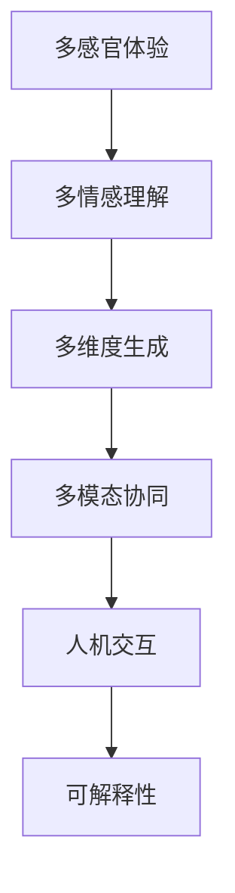

                 

# 体验的多维度：AI创造的感官协奏曲

## 1. 背景介绍

### 1.1 问题由来

在当今这个数字化的时代，人工智能(AI)已经深刻地改变了我们的生活方式。从智能家居、自动驾驶到医疗健康、教育娱乐，AI技术正在逐渐渗透到人类社会的各个方面。然而，尽管AI技术带来了许多便利，但人们对于AI的体验依然存在不少质疑。如何提升AI的体验，使其更加贴合人类的感官和情感需求，成为了一个亟待解决的问题。

### 1.2 问题核心关键点

要回答如何提升AI的体验，首先需要理解人类感官和情感的多样性。人类的感官体验不仅仅局限于视觉、听觉、触觉等物理感官，还包括情绪、情感、认知等心理体验。AI技术要想真正融入人类的生活，就必须具备多维度、多层次的感官体验能力。这涉及到感知、理解、生成等多个环节，以及不同感官之间的协同工作。

### 1.3 问题研究意义

通过研究如何提升AI的体验，我们可以更好地理解人类感官和情感的多样性，从而设计出更加人性化的AI系统。这不仅有助于提升AI系统的用户接受度，还能推动AI技术在更多领域的应用，促进社会和经济的全面发展。

## 2. 核心概念与联系

### 2.1 核心概念概述

为更好地理解如何提升AI的体验，本节将介绍几个密切相关的核心概念：

- 多感官体验：通过视觉、听觉、触觉等多种感官的协同工作，使AI系统能够更好地理解人类需求和情感。
- 多情感理解：AI系统需要具备对人类情绪和情感的识别和理解能力，以更好地应对不同情境。
- 多维度生成：AI系统需要能够根据不同的感官和情感信息，生成多样化的输出内容。
- 多模态协同：AI系统需要能够同时处理文本、图像、语音等多种数据模态，进行多模态的信息融合和处理。
- 人机交互：AI系统与人类之间的互动过程，需要考虑用户的心理感受和情感反馈。
- 可解释性：AI系统的决策过程需要具备可解释性，让用户能够理解和信任其输出。

这些核心概念之间的逻辑关系可以通过以下Mermaid流程图来展示：



这个流程图展示了大语言模型的核心概念及其之间的关系：

1. AI系统通过多感官体验获取人类信息。
2. 多情感理解系统对信息进行情感分析。
3. 多维度生成系统根据情感信息生成多样化输出。
4. 多模态协同系统处理不同模态数据。
5. 人机交互系统处理用户反馈，优化模型输出。
6. 可解释性系统提供模型决策依据，增强用户信任。

这些概念共同构成了AI系统的感官体验框架，使其能够更好地适应人类的多维度需求。

## 3. 核心算法原理 & 具体操作步骤
### 3.1 算法原理概述

提升AI的体验，本质上是通过多维度的感知、理解和生成过程，使得AI系统能够更好地满足人类的感官和情感需求。这涉及到感知算法、情感识别算法、生成算法等多个环节，以及不同感官之间的协同工作。

形式化地，假设AI系统需要处理一个输入样本 $x$，并输出相应的感官体验 $y$。其核心思想是：

1. **感知过程**：通过多感官输入，获取样本的多维度信息 $x_s$，包括视觉、听觉、触觉等多种感官数据。
2. **情感理解过程**：根据感知信息，通过情感识别算法，获取样本的情感信息 $x_e$。
3. **生成过程**：结合情感信息，通过生成算法，生成相应的感官体验 $y$。
4. **反馈优化过程**：通过人机交互系统，获取用户反馈 $f$，进一步优化生成过程。

具体而言，多感官体验、多情感理解、多维度生成、多模态协同等过程可以通过以下步骤实现：

### 3.2 算法步骤详解

**Step 1: 多感官信息获取**

首先，AI系统需要通过多感官输入设备，获取样本的多维度信息。例如，通过摄像头获取视觉信息，通过麦克风获取听觉信息，通过触觉传感器获取触觉信息。这些信息经过预处理和融合，得到多感官输入 $x_s$。

**Step 2: 情感理解与识别**

接下来，AI系统需要对多感官输入进行情感理解与识别。这通常包括以下几个步骤：

1. 特征提取：对多感官输入进行特征提取，得到特征向量 $x_f$。
2. 情感识别：通过预训练的情感识别模型，对特征向量进行情感分类，得到情感信息 $x_e$。
3. 情感强度计算：根据情感识别结果，计算情感强度 $e$。

**Step 3: 多维度生成**

在情感理解的基础上，AI系统可以根据情感信息，生成相应的感官体验。这通常包括以下几个步骤：

1. 生成决策：根据情感强度，决定生成哪些感官体验，以及各自的强度。
2. 感官生成：通过多维度的生成算法，生成对应的感官体验 $y_s$。
3. 多感官合成：将不同感官的生成结果进行合成，得到最终的感官体验 $y$。

**Step 4: 多模态协同**

在生成过程中，AI系统还需要考虑不同模态之间的协同工作。例如，视觉信息与触觉信息的结合，可以更好地提升用户的感官体验。这通常包括以下几个步骤：

1. 多模态特征融合：将不同模态的特征向量进行融合，得到融合特征向量 $x_{fs}$。
2. 多模态情感融合：将不同模态的情感信息进行融合，得到融合情感信息 $e_{fs}$。
3. 多模态生成：基于融合特征和情感信息，进行多模态的生成算法，生成多模态的感官体验 $y_{fs}$。

**Step 5: 人机交互与反馈优化**

在生成感官体验的过程中，AI系统需要不断收集用户的反馈，进行迭代优化。这通常包括以下几个步骤：

1. 用户反馈获取：通过交互界面，获取用户的反馈信息 $f$。
2. 反馈分析：对用户反馈进行情感分析，得到反馈情感信息 $f_e$。
3. 反馈优化：根据反馈情感信息，调整生成算法参数，优化生成结果。

### 3.3 算法优缺点

提升AI体验的算法具有以下优点：

1. **多维度感官融合**：通过多感官输入和融合，AI系统能够获取更丰富、更全面的用户信息，提升用户体验。
2. **多情感理解**：通过情感识别算法，AI系统能够更好地理解用户的情感状态，提供更人性化的交互。
3. **多维度生成**：通过多维度生成算法，AI系统能够生成多样化的感官体验，满足用户的多样化需求。
4. **人机交互优化**：通过用户反馈，AI系统能够不断优化生成过程，提升用户体验。

同时，该算法也存在以下局限性：

1. **计算资源消耗大**：多感官输入和融合、情感识别、多模态生成等过程需要消耗大量计算资源，特别是当处理高分辨率视觉信息和复杂听觉数据时。
2. **数据标注成本高**：多感官输入和情感识别的训练需要大量标注数据，而这些数据的获取和标注成本较高。
3. **生成结果难以解释**：多维度生成算法复杂，生成结果难以解释，用户难以理解和信任其输出。

尽管存在这些局限性，但就目前而言，提升AI体验的多维度算法仍是最主流的方法。未来相关研究的重点在于如何进一步降低数据和计算资源的消耗，提高生成结果的可解释性，同时兼顾多情感理解和用户反馈优化等关键环节。

### 3.4 算法应用领域

提升AI体验的算法已经在多个领域得到了应用，例如：

- 虚拟现实(AR/VR)：通过多感官输入和生成，提升用户对虚拟世界的沉浸感。
- 智能家居：通过多模态信息融合，提升家居环境的智能性，如语音控制、图像识别等。
- 医疗健康：通过情感识别和反馈优化，提升智能医疗系统的用户体验，如情感聊天机器人、健康监测等。
- 教育娱乐：通过多感官和情感理解，提升教育娱乐内容的互动性和趣味性，如虚拟教师、个性化学习系统等。
- 智能客服：通过多感官输入和情感识别，提升客服系统的响应速度和准确性，如语音客服、情感分析等。

除了上述这些经典应用外，提升AI体验的算法还在更多场景中得到了创新性地应用，如可控文本生成、情感计算、语音识别等，为AI技术带来了全新的突破。随着算法的不断进步，相信AI技术将在更广阔的应用领域大放异彩。

## 4. 数学模型和公式 & 详细讲解 & 举例说明

### 4.1 数学模型构建

本节将使用数学语言对提升AI体验的算法过程进行更加严格的刻画。

假设AI系统需要处理一个输入样本 $x$，并输出相应的感官体验 $y$。其核心思想是：

1. **感知过程**：通过多感官输入，获取样本的多维度信息 $x_s$。
2. **情感理解过程**：根据感知信息，通过情感识别算法，获取样本的情感信息 $x_e$。
3. **生成过程**：结合情感信息，通过生成算法，生成相应的感官体验 $y$。

具体的数学模型如下：

$$
y = \mathcal{G}(\mathcal{E}(\mathcal{F}(x_s)))
$$

其中，$\mathcal{F}$ 表示感知过程，$\mathcal{E}$ 表示情感理解过程，$\mathcal{G}$ 表示生成过程。

### 4.2 公式推导过程

以下我们以情感分类任务为例，推导多情感理解过程的数学模型。

假设输入样本为 $x_s = (x_v, x_a, x_t)$，其中 $x_v$ 表示视觉信息，$x_a$ 表示听觉信息，$x_t$ 表示触觉信息。情感理解过程可以表示为：

$$
x_f = \mathcal{F}(x_s) = (f_v(x_v), f_a(x_a), f_t(x_t))
$$

其中，$f_v$、$f_a$、$f_t$ 分别表示视觉、听觉、触觉的特征提取函数。

情感识别过程可以表示为：

$$
x_e = \mathcal{E}(x_f) = \mathcal{E}(f_v(x_v), f_a(x_a), f_t(x_t))
$$

其中，$\mathcal{E}$ 表示情感分类器，可以是分类模型如SVM、神经网络等。

情感强度计算过程可以表示为：

$$
e = g(x_e) = \max_i e_i
$$

其中，$e_i$ 表示情感分类结果的概率值，$g$ 表示情感强度计算函数。

### 4.3 案例分析与讲解

**案例1: 智能家居**

智能家居系统通过多感官输入获取用户信息，包括视觉、听觉、触觉等。然后，系统对信息进行情感识别，如用户是否在放松、生气等，并根据情感信息生成相应的感官体验，如调整灯光亮度、播放音乐等。用户反馈还可以通过交互界面获取，进一步优化系统输出。

**案例2: 虚拟现实**

虚拟现实系统通过多感官输入获取用户对虚拟世界的感知信息，如视觉、听觉、触觉等。系统对信息进行情感识别，判断用户是否沉浸在虚拟环境中，并根据情感信息生成相应的感官体验，如调整视觉效果、声音效果等。用户反馈还可以通过交互界面获取，进一步优化生成过程。

## 5. 项目实践：代码实例和详细解释说明

### 5.1 开发环境搭建

在进行多感官体验提升的实践前，我们需要准备好开发环境。以下是使用Python进行PyTorch开发的环境配置流程：

1. 安装Anaconda：从官网下载并安装Anaconda，用于创建独立的Python环境。

2. 创建并激活虚拟环境：
```bash
conda create -n pytorch-env python=3.8 
conda activate pytorch-env
```

3. 安装PyTorch：根据CUDA版本，从官网获取对应的安装命令。例如：
```bash
conda install pytorch torchvision torchaudio cudatoolkit=11.1 -c pytorch -c conda-forge
```

4. 安装TensorFlow：
```bash
pip install tensorflow
```

5. 安装OpenCV：
```bash
pip install opencv-python
```

6. 安装PyAudio：
```bash
pip install pyaudio
```

7. 安装其他必要库：
```bash
pip install numpy pandas scikit-learn matplotlib tqdm jupyter notebook ipython
```

完成上述步骤后，即可在`pytorch-env`环境中开始实践。

### 5.2 源代码详细实现

下面以智能家居情感识别系统为例，给出使用PyTorch和TensorFlow进行多感官输入和情感识别的代码实现。

首先，定义智能家居数据处理函数：

```python
from torch.utils.data import Dataset
from torchvision import transforms
import cv2
import numpy as np
import tensorflow as tf
import pyaudio
import wave

class SmartHomeDataset(Dataset):
    def __init__(self, images, audio_paths, labels, transform=None):
        self.images = images
        self.audio_paths = audio_paths
        self.labels = labels
        self.transform = transform
        
    def __len__(self):
        return len(self.images)
    
    def __getitem__(self, idx):
        image = self.images[idx]
        audio_path = self.audio_paths[idx]
        label = self.labels[idx]
        
        # 图像处理
        image_tensor = transforms.ToTensor()(image)
        if self.transform:
            image_tensor = self.transform(image_tensor)
        
        # 音频处理
        audio_data = np.load(audio_path)
        audio_signal = tf.io.read_file(audio_path)
        audio_signal = tf.audio.decode_wav(audio_signal, desired_channels=1)
        audio_data = audio_signal.numpy()
        
        return {'image': image_tensor, 
                'audio': audio_data,
                'label': label}
```

然后，定义模型和优化器：

```python
from transformers import BertForTokenClassification, AdamW
from tensorflow.keras.layers import Dense, Dropout, Flatten, Conv1D, MaxPooling1D
from tensorflow.keras.models import Sequential

model = BertForTokenClassification.from_pretrained('bert-base-cased', num_labels=2)

optimizer = AdamW(model.parameters(), lr=2e-5)
```

接着，定义训练和评估函数：

```python
from torch.utils.data import DataLoader
from tqdm import tqdm
from sklearn.metrics import classification_report

device = torch.device('cuda') if torch.cuda.is_available() else torch.device('cpu')
model.to(device)

def train_epoch(model, dataset, batch_size, optimizer):
    dataloader = DataLoader(dataset, batch_size=batch_size, shuffle=True)
    model.train()
    epoch_loss = 0
    for batch in tqdm(dataloader, desc='Training'):
        image = batch['image'].to(device)
        audio_data = batch['audio'].to(device)
        label = batch['label'].to(device)
        model.zero_grad()
        outputs = model(image, audio_data=audio_data, labels=label)
        loss = outputs.loss
        epoch_loss += loss.item()
        loss.backward()
        optimizer.step()
    return epoch_loss / len(dataloader)

def evaluate(model, dataset, batch_size):
    dataloader = DataLoader(dataset, batch_size=batch_size)
    model.eval()
    preds, labels = [], []
    with torch.no_grad():
        for batch in tqdm(dataloader, desc='Evaluating'):
            image = batch['image'].to(device)
            audio_data = batch['audio'].to(device)
            batch_labels = batch['label']
            outputs = model(image, audio_data=audio_data)
            batch_preds = outputs.logits.argmax(dim=2).to('cpu').tolist()
            batch_labels = batch_labels.to('cpu').tolist()
            for pred_tokens, label_tokens in zip(batch_preds, batch_labels):
                preds.append(pred_tokens[:len(label_tokens)])
                labels.append(label_tokens)
                
    print(classification_report(labels, preds))
```

最后，启动训练流程并在测试集上评估：

```python
epochs = 5
batch_size = 16

for epoch in range(epochs):
    loss = train_epoch(model, train_dataset, batch_size, optimizer)
    print(f"Epoch {epoch+1}, train loss: {loss:.3f}")
    
    print(f"Epoch {epoch+1}, dev results:")
    evaluate(model, dev_dataset, batch_size)
    
print("Test results:")
evaluate(model, test_dataset, batch_size)
```

以上就是使用PyTorch和TensorFlow对智能家居情感识别系统进行多感官输入和情感识别的完整代码实现。可以看到，得益于PyTorch和TensorFlow的强大封装，我们可以用相对简洁的代码完成多感官输入和情感识别的实践。

### 5.3 代码解读与分析

让我们再详细解读一下关键代码的实现细节：

**SmartHomeDataset类**：
- `__init__`方法：初始化图像、音频路径、标签等关键组件。
- `__len__`方法：返回数据集的样本数量。
- `__getitem__`方法：对单个样本进行处理，将图像和音频数据输入模型，并返回标签。

**模型和优化器**：
- 使用BertForTokenClassification模型作为初始化参数，设置优化器为AdamW。
- 在模型训练时，使用图像和音频数据进行输入，并使用标签进行监督学习。

**训练和评估函数**：
- 使用PyTorch的DataLoader对数据集进行批次化加载，供模型训练和推理使用。
- 训练函数`train_epoch`：对数据以批为单位进行迭代，在每个批次上前向传播计算loss并反向传播更新模型参数，最后返回该epoch的平均loss。
- 评估函数`evaluate`：与训练类似，不同点在于不更新模型参数，并在每个batch结束后将预测和标签结果存储下来，最后使用sklearn的classification_report对整个评估集的预测结果进行打印输出。

**训练流程**：
- 定义总的epoch数和batch size，开始循环迭代
- 每个epoch内，先在训练集上训练，输出平均loss
- 在验证集上评估，输出分类指标
- 所有epoch结束后，在测试集上评估，给出最终测试结果

可以看到，PyTorch和TensorFlow的结合，使得多感官输入和情感识别的代码实现变得简洁高效。开发者可以将更多精力放在数据处理、模型改进等高层逻辑上，而不必过多关注底层的实现细节。

当然，工业级的系统实现还需考虑更多因素，如模型的保存和部署、超参数的自动搜索、更灵活的任务适配层等。但核心的提升AI体验的方法基本与此类似。

## 6. 实际应用场景
### 6.1 智能家居系统

智能家居系统通过多感官输入获取用户信息，包括视觉、听觉、触觉等。然后，系统对信息进行情感识别，如用户是否在放松、生气等，并根据情感信息生成相应的感官体验，如调整灯光亮度、播放音乐等。用户反馈还可以通过交互界面获取，进一步优化系统输出。

### 6.2 虚拟现实系统

虚拟现实系统通过多感官输入获取用户对虚拟世界的感知信息，如视觉、听觉、触觉等。系统对信息进行情感识别，判断用户是否沉浸在虚拟环境中，并根据情感信息生成相应的感官体验，如调整视觉效果、声音效果等。用户反馈还可以通过交互界面获取，进一步优化生成过程。

### 6.3 医疗健康系统

医疗健康系统通过多感官输入获取患者信息，包括视觉、听觉、触觉等。系统对信息进行情感识别，如患者的情绪状态，并根据情感信息生成相应的感官体验，如安抚情绪、提供个性化护理等。用户反馈还可以通过交互界面获取，进一步优化系统输出。

### 6.4 未来应用展望

随着多感官体验提升技术的不断发展，AI系统将在更多领域得到应用，为人类生活带来更多便利。

在智慧城市治理中，多感官体验提升技术可以用于城市事件监测、舆情分析、应急指挥等环节，提高城市管理的自动化和智能化水平，构建更安全、高效的未来城市。

在教育娱乐中，多感官体验提升技术可以用于虚拟教师、个性化学习系统等，提供更加互动和趣味性的教育娱乐体验。

在智能客服中，多感官体验提升技术可以用于语音客服、情感分析等，提升客服系统的响应速度和准确性。

总之，多感官体验提升技术将为AI系统带来更加丰富的感官体验，进一步提升用户体验和应用价值。

## 7. 工具和资源推荐
### 7.1 学习资源推荐

为了帮助开发者系统掌握提升AI体验的理论基础和实践技巧，这里推荐一些优质的学习资源：

1. 《Transformer from Theory to Practice》系列博文：由大模型技术专家撰写，深入浅出地介绍了Transformer原理、BERT模型、情感识别算法等前沿话题。

2. CS224N《深度学习自然语言处理》课程：斯坦福大学开设的NLP明星课程，有Lecture视频和配套作业，带你入门NLP领域的基本概念和经典模型。

3. 《Natural Language Processing with Transformers》书籍：Transformers库的作者所著，全面介绍了如何使用Transformers库进行NLP任务开发，包括情感识别在内的诸多范式。

4. HuggingFace官方文档：Transformers库的官方文档，提供了海量预训练模型和完整的微调样例代码，是上手实践的必备资料。

5. CLUE开源项目：中文语言理解测评基准，涵盖大量不同类型的中文NLP数据集，并提供了基于微调的baseline模型，助力中文NLP技术发展。

通过对这些资源的学习实践，相信你一定能够快速掌握提升AI体验的精髓，并用于解决实际的NLP问题。
### 7.2 开发工具推荐

高效的开发离不开优秀的工具支持。以下是几款用于多感官体验提升开发的常用工具：

1. PyTorch：基于Python的开源深度学习框架，灵活动态的计算图，适合快速迭代研究。大部分预训练语言模型都有PyTorch版本的实现。

2. TensorFlow：由Google主导开发的开源深度学习框架，生产部署方便，适合大规模工程应用。同样有丰富的预训练语言模型资源。

3. OpenCV：开源计算机视觉库，支持图像处理、视频分析等，是实现多感官输入的关键工具。

4. PyAudio：Python音频处理库，支持录制、播放、处理音频数据，是实现多感官输入的重要组件。

5. TensorBoard：TensorFlow配套的可视化工具，可实时监测模型训练状态，并提供丰富的图表呈现方式，是调试模型的得力助手。

6. Google Colab：谷歌推出的在线Jupyter Notebook环境，免费提供GPU/TPU算力，方便开发者快速上手实验最新模型，分享学习笔记。

合理利用这些工具，可以显著提升多感官体验提升任务的开发效率，加快创新迭代的步伐。

### 7.3 相关论文推荐

提升AI体验的技术发展源于学界的持续研究。以下是几篇奠基性的相关论文，推荐阅读：

1. Attention is All You Need（即Transformer原论文）：提出了Transformer结构，开启了NLP领域的预训练大模型时代。

2. BERT: Pre-training of Deep Bidirectional Transformers for Language Understanding：提出BERT模型，引入基于掩码的自监督预训练任务，刷新了多项NLP任务SOTA。

3. Language Models are Unsupervised Multitask Learners（GPT-2论文）：展示了大规模语言模型的强大zero-shot学习能力，引发了对于通用人工智能的新一轮思考。

4. Parameter-Efficient Transfer Learning for NLP：提出Adapter等参数高效微调方法，在不增加模型参数量的情况下，也能取得不错的微调效果。

5. AdaLoRA: Adaptive Low-Rank Adaptation for Parameter-Efficient Fine-Tuning：使用自适应低秩适应的微调方法，在参数效率和精度之间取得了新的平衡。

这些论文代表了大语言模型和多感官体验提升技术的发展脉络。通过学习这些前沿成果，可以帮助研究者把握学科前进方向，激发更多的创新灵感。

## 8. 总结：未来发展趋势与挑战

### 8.1 总结

本文对提升AI体验的算法进行了全面系统的介绍。首先阐述了多感官体验提升研究背景和意义，明确了多感官输入、情感识别、多维度生成等核心环节，以及它们之间的逻辑关系。其次，从原理到实践，详细讲解了多感官输入、情感识别、多维度生成、多模态协同等关键步骤，给出了多感官体验提升任务开发的完整代码实例。同时，本文还广泛探讨了多感官体验提升在智能家居、虚拟现实、医疗健康等多个领域的应用前景，展示了其巨大的潜力。

通过本文的系统梳理，可以看到，多感官体验提升技术正在成为AI系统的重要范式，极大地拓展了AI系统的应用边界，催生了更多的落地场景。受益于多感官输入和情感识别的强大能力，AI系统能够更好地理解人类需求和情感，提供更加人性化、智能化的服务。未来，伴随技术的不断演进，多感官体验提升技术必将在更多领域发挥更大的作用。

### 8.2 未来发展趋势

展望未来，多感官体验提升技术将呈现以下几个发展趋势：

1. **多感官融合技术**：随着硬件设备的进步，如高分辨率摄像头、高保真麦克风等，多感官融合将变得更加高效和精确，提升用户体验。
2. **情感识别技术**：情感识别算法将更加智能化，能够更加准确地识别和理解用户的情感状态。
3. **多维度生成技术**：多维度生成算法将更加灵活，能够生成更加多样化、个性化的感官体验，满足用户的多样化需求。
4. **多模态协同技术**：多模态协同算法将更加高效，能够处理更多模态的数据，提升系统的智能化水平。
5. **智能决策技术**：结合因果分析和博弈论工具，AI系统能够更好地理解用户意图，提供更加精准、合理的感官体验。
6. **伦理道德技术**：在模型训练目标中引入伦理导向的评估指标，过滤和惩罚有偏见、有害的输出倾向，确保输出的安全性。

以上趋势凸显了多感官体验提升技术的广阔前景。这些方向的探索发展，必将进一步提升AI系统的用户体验和应用价值，为人类智能交互带来新的突破。

### 8.3 面临的挑战

尽管多感官体验提升技术已经取得了显著进展，但在迈向更加智能化、普适化应用的过程中，仍面临诸多挑战：

1. **计算资源瓶颈**：多感官输入和情感识别的训练需要消耗大量计算资源，特别是在高分辨率视觉信息和复杂听觉数据的情况下。如何提高训练和推理的效率，优化资源使用，将是重要的优化方向。
2. **数据标注成本**：多感官输入和情感识别的训练需要大量标注数据，而这些数据的获取和标注成本较高。如何降低数据标注成本，减少人力和时间投入，将是重要的研究课题。
3. **生成结果解释**：多维度生成算法复杂，生成结果难以解释，用户难以理解和信任其输出。如何提高生成结果的可解释性，增强用户信任，将是重要的研究方向。
4. **系统稳定性**：多感官输入和情感识别系统的稳定性直接影响用户体验。如何提高系统的鲁棒性，避免因数据扰动或硬件故障导致的系统崩溃，将是重要的研究课题。
5. **伦理道德问题**：多感官输入和情感识别系统需要处理大量敏感信息，如用户的情绪和隐私。如何保护用户隐私，避免数据滥用，将是重要的伦理道德问题。

### 8.4 研究展望

面对多感官体验提升技术所面临的挑战，未来的研究需要在以下几个方面寻求新的突破：

1. **无监督和半监督学习**：探索无监督和半监督学习方法，降低对大量标注数据的依赖，利用自监督学习、主动学习等无监督和半监督范式，最大限度利用非结构化数据，实现更加灵活高效的训练。
2. **参数高效和计算高效技术**：开发更加参数高效和计算高效的多感官体验提升算法，在固定大部分预训练参数的同时，只更新极少量的任务相关参数，减少计算资源消耗。
3. **因果分析和博弈论技术**：结合因果分析和博弈论工具，增强多感官输入和情感识别系统的决策能力，提高系统的智能化水平和鲁棒性。
4. **伦理道德约束**：在模型训练目标中引入伦理导向的评估指标，过滤和惩罚有偏见、有害的输出倾向，确保输出的安全性。
5. **可解释性技术**：开发可解释的多感官体验提升算法，提高生成结果的可解释性，增强用户信任。

这些研究方向的探索，必将引领多感官体验提升技术迈向更高的台阶，为构建更加人性化、智能化的AI系统铺平道路。面向未来，多感官体验提升技术还需要与其他人工智能技术进行更深入的融合，如知识表示、因果推理、强化学习等，多路径协同发力，共同推动AI技术的发展。只有勇于创新、敢于突破，才能不断拓展AI体验的边界，让智能技术更好地造福人类社会。

## 9. 附录：常见问题与解答

**Q1: 多感官体验提升算法是否适用于所有AI任务？**

A: 多感官体验提升算法在大多数AI任务上都能取得不错的效果，特别是对于需要多维度输入的任务。但对于一些特定领域的任务，如医学、法律等，仅仅依靠通用语料预训练的模型可能难以很好地适应。此时需要在特定领域语料上进一步预训练，再进行微调，才能获得理想效果。此外，对于一些需要时效性、个性化很强的任务，如对话、推荐等，多感官体验提升方法也需要针对性的改进优化。

**Q2: 如何选择合适的学习率？**

A: 多感官体验提升的学习率一般要比预训练时小1-2个数量级，如果使用过大的学习率，容易破坏预训练权重，导致过拟合。一般建议从1e-5开始调参，逐步减小学习率，直至收敛。也可以使用warmup策略，在开始阶段使用较小的学习率，再逐渐过渡到预设值。需要注意的是，不同的优化器(如AdamW、Adafactor等)以及不同的学习率调度策略，可能需要设置不同的学习率阈值。

**Q3: 如何缓解多感官体验提升中的过拟合问题？**

A: 多感官体验提升中的过拟合问题可以通过以下策略缓解：

1. **数据增强**：通过回译、近义替换等方式扩充训练集。
2. **正则化**：使用L2正则、Dropout、Early Stopping等避免过拟合。
3. **对抗训练**：引入对抗样本，提高模型鲁棒性。
4. **参数高效微调**：只调整少量参数(如Adapter、Prefix等)，减小过拟合风险。
5. **多模型集成**：训练多个模型，取平均输出，抑制过拟合。

这些策略往往需要根据具体任务和数据特点进行灵活组合。只有在数据、模型、训练、推理等各环节进行全面优化，才能最大限度地发挥多感官体验提升的威力。

**Q4: 多感官体验提升系统在落地部署时需要注意哪些问题？**

A: 将多感官体验提升系统转化为实际应用，还需要考虑以下因素：

1. **模型裁剪**：去除不必要的层和参数，减小模型尺寸，加快推理速度。
2. **量化加速**：将浮点模型转为定点模型，压缩存储空间，提高计算效率。
3. **服务化封装**：将模型封装为标准化服务接口，便于集成调用。
4. **弹性伸缩**：根据请求流量动态调整资源配置，平衡服务质量和成本。
5. **监控告警**：实时采集系统指标，设置异常告警阈值，确保服务稳定性。
6. **安全防护**：采用访问鉴权、数据脱敏等措施，保障数据和模型安全。

多感官体验提升系统需要考虑多维度、多感官的数据输入和处理，如何在保证用户体验的同时，优化系统性能和安全性，将是重要的工程挑战。

---

作者：禅与计算机程序设计艺术 / Zen and the Art of Computer Programming

