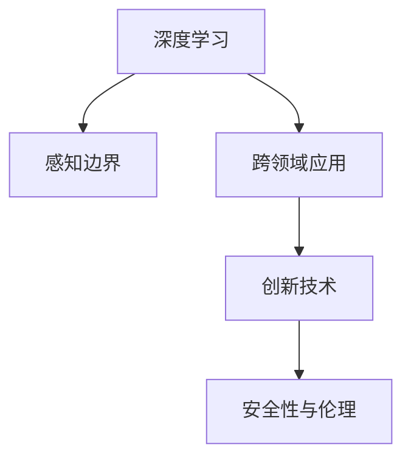
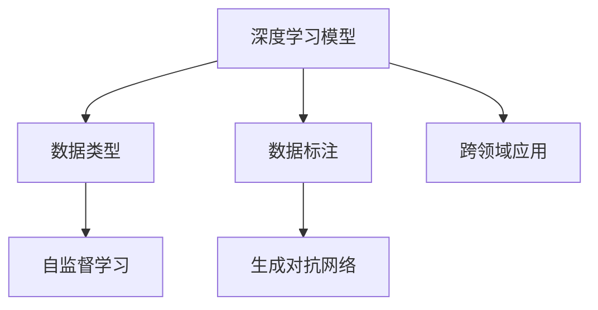

                 

# 体验跨时空探索：AI创造的感知边界拓展

> 关键词：深度学习,感知边界,人工智能,跨领域应用,创新技术

## 1. 背景介绍

### 1.1 问题由来

近年来，深度学习技术在各个领域取得了显著进展，尤其是AI在感知、理解、决策等方面的突破，极大地拓展了人类的感知边界。AI系统通过学习大量数据，能够识别复杂的模式、预测未来的趋势、生成新颖的内容，甚至在某些领域超越人类的表现。然而，这些AI技术的实际应用仍面临诸多挑战：如何更好地理解跨时空数据？如何让AI模型在复杂的跨领域任务中表现优异？如何安全有效地使用这些技术？

本文将深入探讨AI技术在跨时空探索中的感知边界拓展，介绍相关核心概念、算法原理、应用场景及实践方法。希望通过系统的学习，帮助读者理解AI在感知与理解方面的最新进展，并启发其在实际应用中的创新思路。

### 1.2 问题核心关键点

为更好地理解跨时空探索中AI的感知边界拓展，本节将介绍几个密切相关的核心概念：

- 深度学习(Deep Learning)：一种基于神经网络的机器学习方法，通过多层神经元提取数据特征，实现复杂模式的识别与预测。
- 感知边界(Perceptual Boundary)：指AI系统在感知和理解不同类型数据时的能力上限。
- 跨领域应用(Cross-Domain Application)：指AI技术在不同领域（如图像、语音、自然语言处理等）之间的迁移与融合。
- 创新技术(Innovative Techniques)：如生成对抗网络(GAN)、变分自编码器(VAE)、自监督学习等，这些技术推动了AI系统在感知和理解方面的新突破。
- 安全性与伦理(Security and Ethics)：AI技术在实际应用中的潜在风险与伦理问题，如隐私保护、算法偏见等。

这些概念之间的逻辑关系可以通过以下Mermaid流程图来展示：



这个流程图展示了大模型技术的核心概念及其之间的关系：

1. 深度学习技术提供了强大的感知能力。
2. 感知边界决定了AI系统在各种数据类型上的能力上限。
3. 跨领域应用将深度学习技术应用于更多领域，如计算机视觉、自然语言处理等。
4. 创新技术拓展了深度学习的边界，实现了更强的感知与理解能力。
5. 安全性与伦理确保AI技术在实际应用中安全可靠。

这些概念共同构成了AI技术在跨时空探索中的感知边界拓展，使其能够理解和处理更复杂、更多样的数据。通过理解这些核心概念，我们可以更好地把握AI技术的工作原理和优化方向。

## 2. 核心概念与联系

### 2.1 核心概念概述

为更好地理解深度学习在跨时空探索中的感知边界拓展，本节将介绍几个密切相关的核心概念：

- 深度学习模型：如卷积神经网络(CNN)、循环神经网络(RNN)、Transformer等，这些模型通过多层神经网络结构提取特征。
- 数据类型：图像、语音、文本等，深度学习模型需要学习不同类型的数据。
- 数据标注：即对数据进行人工标注，帮助模型更好地学习。
- 生成对抗网络(GAN)：通过两个对抗网络模型训练生成高质量的假数据，以提升模型的泛化能力。
- 自监督学习：指在没有监督信号的情况下，通过数据本身的特性进行学习，提升模型的感知能力。

### 2.2 核心概念原理和架构的 Mermaid 流程图

下面，我们将通过一个简单的Mermaid流程图，展示深度学习模型、数据类型、生成对抗网络、自监督学习等核心概念之间的联系：



这个流程图展示深度学习模型、数据类型、生成对抗网络、自监督学习等核心概念之间的联系：

1. 深度学习模型通过多层神经网络结构提取数据特征。
2. 数据标注帮助模型更好地学习特定任务的数据。
3. 生成对抗网络通过两个对抗网络模型训练高质量假数据，提升模型泛化能力。
4. 自监督学习通过数据本身的特性进行学习，提升模型的感知能力。
5. 跨领域应用将深度学习技术应用于更多领域，如计算机视觉、自然语言处理等。

## 3. 核心算法原理 & 具体操作步骤

### 3.1 算法原理概述

深度学习在跨时空探索中的感知边界拓展，主要依赖于模型的层次化特征提取能力。通过多层神经网络结构，深度学习模型可以逐步抽象出不同层次的特征，实现对复杂模式的识别与预测。

形式化地，假设输入数据为 $x$，模型参数为 $\theta$，模型的输出为 $y$，则训练目标为最小化损失函数 $L(y, x)$。常见的损失函数包括均方误差、交叉熵等。训练过程通过反向传播算法更新模型参数，使得模型输出逼近真实标签。

### 3.2 算法步骤详解

深度学习在跨时空探索中的感知边界拓展主要包括以下几个关键步骤：

**Step 1: 数据准备**

- 收集不同领域的数据，确保数据具有足够的复杂度和多样性。
- 对数据进行预处理，包括数据清洗、归一化、标准化等。
- 对数据进行标注，标注过程中需考虑标注成本和标注质量。

**Step 2: 模型选择与设计**

- 选择适合任务类型的深度学习模型，如CNN、RNN、Transformer等。
- 设计模型架构，包括网络深度、卷积核大小、层数等。
- 确定损失函数和优化器，选择合适的超参数。

**Step 3: 模型训练**

- 将数据集分为训练集、验证集和测试集。
- 使用随机梯度下降(SGD)等优化算法更新模型参数。
- 在验证集上评估模型性能，根据性能调整模型参数。
- 在测试集上测试最终模型性能。

**Step 4: 模型评估与优化**

- 使用准确率、召回率、F1分数等指标评估模型性能。
- 根据评估结果，调整模型架构和超参数。
- 使用生成对抗网络、自监督学习等方法提升模型泛化能力。

### 3.3 算法优缺点

深度学习在跨时空探索中的感知边界拓展具有以下优点：

- 强大的特征提取能力：多层神经网络结构可以逐步抽象出不同层次的特征，实现对复杂模式的识别与预测。
- 跨领域泛化能力：模型在多种数据类型上都有较好的泛化能力。
- 高度灵活性：模型结构可以根据任务需求进行调整。

然而，深度学习也存在以下缺点：

- 数据依赖：深度学习模型对标注数据依赖较大，数据质量直接影响模型性能。
- 计算资源需求：深度学习模型需要大量计算资源进行训练，部署成本较高。
- 可解释性差：深度学习模型通常是"黑盒"系统，难以解释其内部工作机制。

### 3.4 算法应用领域

深度学习在跨时空探索中的感知边界拓展已经在众多领域得到应用，如：

- 计算机视觉：如物体识别、图像分割、人脸识别等。深度学习模型通过卷积神经网络提取图像特征，实现高精度的图像理解。
- 自然语言处理：如机器翻译、文本生成、情感分析等。深度学习模型通过循环神经网络和Transformer等模型提取文本特征，实现复杂的语言理解与生成。
- 语音识别：如语音转文本、语音合成等。深度学习模型通过卷积神经网络和循环神经网络提取音频特征，实现高效的语音处理。
- 医疗影像：如医学图像分析、病理学诊断等。深度学习模型通过卷积神经网络提取医学影像特征，实现高精度的医学诊断。
- 自动驾驶：如目标检测、路径规划等。深度学习模型通过卷积神经网络和循环神经网络提取感知数据，实现智能驾驶。

除了这些领域，深度学习在金融、气象、物流等领域也有广泛应用。通过跨领域应用，深度学习技术不断拓展其感知边界，为各行各业带来了革命性的变化。

## 4. 数学模型和公式 & 详细讲解 & 举例说明

### 4.1 数学模型构建

假设输入数据为 $x$，深度学习模型为 $f_{\theta}$，输出为 $y$，则模型的训练目标为最小化损失函数 $L(y, x)$。假设模型为线性模型，则损失函数为：

$$
L(y, x) = \frac{1}{2} \sum_{i=1}^n (y_i - f_{\theta}(x_i))^2
$$

其中 $n$ 为样本数。假设模型为非线性模型，则损失函数为：

$$
L(y, x) = -\frac{1}{n} \sum_{i=1}^n \log f_{\theta}(y_i \mid x_i)
$$

假设模型为神经网络，则损失函数为：

$$
L(y, x) = -\frac{1}{n} \sum_{i=1}^n \sum_{j=1}^m y_{ij} \log f_{\theta}(x_i \mid x_j)
$$

其中 $m$ 为类别数。

### 4.2 公式推导过程

以线性回归模型为例，我们进行详细推导：

设输入数据为 $x \in \mathbb{R}^d$，标签为 $y \in \mathbb{R}$，模型参数为 $\theta \in \mathbb{R}^d$，则线性回归模型的输出为 $f_{\theta}(x) = \theta^T x$。

假设模型的训练数据集为 $D = \{(x_i, y_i)\}_{i=1}^n$，其中 $x_i \in \mathbb{R}^d, y_i \in \mathbb{R}$。则损失函数为：

$$
L(y, x) = \frac{1}{2} \sum_{i=1}^n (y_i - \theta^T x_i)^2
$$

求导得到梯度：

$$
\nabla_{\theta} L(y, x) = \sum_{i=1}^n (y_i - \theta^T x_i) x_i
$$

通过反向传播算法，可以更新模型参数 $\theta$，最小化损失函数 $L(y, x)$。

### 4.3 案例分析与讲解

以下以图像分类任务为例，展示深度学习在跨时空探索中的感知边界拓展：

假设输入为一张图像 $x \in \mathbb{R}^{n \times n \times 3}$，标签为 $y \in \{0, 1\}$，模型为卷积神经网络(CNN)。

假设模型的训练数据集为 $D = \{(x_i, y_i)\}_{i=1}^n$，其中 $x_i \in \mathbb{R}^{n \times n \times 3}, y_i \in \{0, 1\}$。

假设模型的架构为：

```
input
    |
conv1
    |
relu1
    |
pool1
    |
conv2
    |
relu2
    |
pool2
    |
flatten
    |
dense1
    |
relu3
    |
dense2
    |
softmax
```

其中，conv1-2为卷积层，relu1-3为激活层，pool1-2为池化层，dense1-2为全连接层，softmax为输出层。

假设损失函数为交叉熵损失：

$$
L(y, x) = -\frac{1}{n} \sum_{i=1}^n \sum_{j=1}^2 y_{ij} \log f_{\theta}(x_i \mid x_j)
$$

通过反向传播算法更新模型参数 $\theta$，使得模型输出逼近真实标签。

## 5. 项目实践：代码实例和详细解释说明

### 5.1 开发环境搭建

在进行深度学习项目实践前，我们需要准备好开发环境。以下是使用Python进行TensorFlow开发的环境配置流程：

1. 安装Anaconda：从官网下载并安装Anaconda，用于创建独立的Python环境。

2. 创建并激活虚拟环境：
```bash
conda create -n tf-env python=3.8 
conda activate tf-env
```

3. 安装TensorFlow：根据CUDA版本，从官网获取对应的安装命令。例如：
```bash
conda install tensorflow==2.3
```

4. 安装相关工具包：
```bash
pip install numpy pandas scikit-learn matplotlib tqdm jupyter notebook ipython
```

完成上述步骤后，即可在`tf-env`环境中开始深度学习实践。

### 5.2 源代码详细实现

下面我以图像分类任务为例，给出使用TensorFlow进行深度学习模型训练的Python代码实现。

首先，定义模型和损失函数：

```python
import tensorflow as tf
from tensorflow.keras import layers

# 定义模型架构
model = tf.keras.Sequential([
    layers.Conv2D(32, (3, 3), activation='relu', input_shape=(28, 28, 1)),
    layers.MaxPooling2D((2, 2)),
    layers.Conv2D(64, (3, 3), activation='relu'),
    layers.MaxPooling2D((2, 2)),
    layers.Conv2D(64, (3, 3), activation='relu'),
    layers.Flatten(),
    layers.Dense(64, activation='relu'),
    layers.Dense(10, activation='softmax')
])

# 定义损失函数
loss_fn = tf.keras.losses.SparseCategoricalCrossentropy(from_logits=True)

# 定义优化器
optimizer = tf.keras.optimizers.Adam()

# 定义评估指标
metrics = [tf.keras.metrics.SparseCategoricalAccuracy('accuracy')]
```

然后，定义训练和评估函数：

```python
# 定义训练函数
@tf.function
def train_step(images, labels):
    with tf.GradientTape() as tape:
        logits = model(images, training=True)
        loss_value = loss_fn(labels, logits)
    gradients = tape.gradient(loss_value, model.trainable_variables)
    optimizer.apply_gradients(zip(gradients, model.trainable_variables))
    return loss_value

# 定义评估函数
@tf.function
def evaluate_step(images, labels):
    logits = model(images, training=False)
    predictions = tf.argmax(logits, axis=1)
    accuracy = tf.keras.metrics.SparseCategoricalAccuracy()(labels, predictions)
    return accuracy.numpy()
```

最后，启动训练流程并在测试集上评估：

```python
# 加载数据集
(x_train, y_train), (x_test, y_test) = tf.keras.datasets.mnist.load_data()

# 数据预处理
x_train = x_train.reshape(-1, 28, 28, 1).astype('float32') / 255.0
x_test = x_test.reshape(-1, 28, 28, 1).astype('float32') / 255.0

# 训练模型
for epoch in range(10):
    epoch_loss = 0.0
    epoch_accuracy = 0.0
    for batch in tf.data.Dataset.from_tensor_slices((x_train, y_train)).batch(32):
        images, labels = batch
        batch_loss = train_step(images, labels)
        epoch_loss += batch_loss
    epoch_accuracy = evaluate_step(x_test, y_test)
    print(f'Epoch {epoch+1}, loss: {epoch_loss/len(x_train)}, accuracy: {epoch_accuracy}')
```

以上就是使用TensorFlow进行图像分类任务深度学习模型训练的完整代码实现。可以看到，TensorFlow的高级API使得模型构建和训练过程非常简洁。

### 5.3 代码解读与分析

让我们再详细解读一下关键代码的实现细节：

**模型定义**：
- 定义了包含卷积层、池化层、全连接层的深度学习模型，使用了TensorFlow的Sequential API。
- 定义了交叉熵损失函数和Adam优化器。

**训练函数**：
- 定义了tf.function装饰器，将训练过程编译为图计算，提高计算效率。
- 使用tf.GradientTape记录梯度，通过Adam优化器更新模型参数。
- 返回训练损失。

**评估函数**：
- 定义了tf.function装饰器，将评估过程编译为图计算。
- 使用模型输出计算准确率。
- 返回评估准确率。

**训练流程**：
- 定义了数据集加载和预处理。
- 通过循环迭代，在每个epoch上计算损失和评估准确率。
- 输出每个epoch的训练损失和评估准确率。

可以看到，TensorFlow的高级API使得深度学习模型训练和评估过程非常简洁高效。开发者可以将更多精力放在模型架构优化、数据增强等高层逻辑上，而不必过多关注底层的实现细节。

当然，工业级的系统实现还需考虑更多因素，如模型保存和部署、超参数自动搜索、模型可视化等。但核心的训练范式基本与此类似。

## 6. 实际应用场景

### 6.1 智能安防监控

深度学习在智能安防监控中的应用，能够实时监测监控视频，识别异常行为和目标，及时报警。例如，在智慧小区的门口监控中，深度学习模型能够通过分析视频帧，识别出可疑人员和物品，并及时报警。

具体实现时，可以通过收集大量监控视频数据，对其进行标注和预处理，构建深度学习模型。在实时监控中，模型通过卷积神经网络对视频帧进行特征提取，并结合循环神经网络进行行为分析和目标识别，最终输出报警信号。

### 6.2 智能推荐系统

深度学习在智能推荐系统中的应用，能够根据用户历史行为和兴趣，推荐个性化的内容。例如，电商平台的商品推荐系统，能够根据用户浏览和购买历史，推荐用户可能感兴趣的商品。

具体实现时，可以通过收集大量用户行为数据，构建深度学习模型。在推荐过程中，模型通过卷积神经网络和循环神经网络，对用户行为进行特征提取，并结合注意力机制，生成推荐结果。

### 6.3 智能交通管理

深度学习在智能交通管理中的应用，能够实时监测交通流量，优化交通信号灯控制，提升交通管理效率。例如，在智能交通系统中，深度学习模型能够通过分析实时交通数据，预测交通流量变化，优化信号灯控制策略，减少交通拥堵。

具体实现时，可以通过收集大量交通流量数据，构建深度学习模型。在信号灯控制中，模型通过卷积神经网络和循环神经网络，对交通流量进行特征提取，并结合强化学习算法，生成最优控制策略。

### 6.4 未来应用展望

随着深度学习技术的不断发展，其在跨时空探索中的感知边界拓展将呈现出以下几个发展趋势：

1. 多模态感知能力：深度学习技术将实现跨视觉、语音、文本等多模态数据的感知和理解，提升AI系统的跨领域泛化能力。
2. 自监督学习：无需标注数据的自监督学习算法将逐步成熟，提升深度学习模型的感知能力。
3. 生成对抗网络：生成对抗网络技术将不断提升，实现更加逼真的假数据生成，提升模型的泛化能力。
4. 知识图谱融合：深度学习模型将与知识图谱进行更深入的融合，提升模型的跨领域迁移能力。
5. 安全与伦理：深度学习模型将在安全性与伦理方面得到更多的重视，确保其应用的安全可靠。

以上趋势凸显了深度学习在跨时空探索中的感知边界拓展的广阔前景。这些方向的探索发展，必将进一步提升AI系统在复杂数据环境中的感知与理解能力，为各行各业带来革命性的变革。

## 7. 工具和资源推荐

### 7.1 学习资源推荐

为了帮助开发者系统掌握深度学习在跨时空探索中的感知边界拓展的理论基础和实践技巧，这里推荐一些优质的学习资源：

1. 《深度学习》（Ian Goodfellow, Yoshua Bengio, Aaron Courville）：全面介绍了深度学习的基本原理和应用，是深度学习领域的重要教材。
2. CS231n《卷积神经网络》课程：斯坦福大学开设的深度学习课程，重点介绍了卷积神经网络的结构和应用。
3. CS224d《序列模型》课程：斯坦福大学开设的深度学习课程，重点介绍了序列模型的结构和应用。
4. 《Python深度学习》（Francois Chollet）：通过Keras框架，介绍了深度学习的基本原理和应用。
5. TensorFlow官方文档：TensorFlow的官方文档，提供了丰富的API文档和教程，是深度学习开发的必备工具。

通过对这些资源的学习实践，相信你一定能够快速掌握深度学习在跨时空探索中的感知边界拓展的精髓，并启发其在实际应用中的创新思路。

### 7.2 开发工具推荐

高效的开发离不开优秀的工具支持。以下是几款用于深度学习开发的常用工具：

1. PyTorch：基于Python的开源深度学习框架，灵活动态的计算图，适合快速迭代研究。大多数深度学习模型都有PyTorch版本的实现。
2. TensorFlow：由Google主导开发的开源深度学习框架，生产部署方便，适合大规模工程应用。
3. Keras：高级神经网络API，可以运行在TensorFlow、Theano、CNTK等后端上，适合快速原型开发。
4. Weights & Biases：模型训练的实验跟踪工具，可以记录和可视化模型训练过程中的各项指标，方便对比和调优。
5. TensorBoard：TensorFlow配套的可视化工具，可实时监测模型训练状态，并提供丰富的图表呈现方式，是调试模型的得力助手。
6. Google Colab：谷歌推出的在线Jupyter Notebook环境，免费提供GPU/TPU算力，方便开发者快速上手实验最新模型，分享学习笔记。

合理利用这些工具，可以显著提升深度学习项目的开发效率，加快创新迭代的步伐。

### 7.3 相关论文推荐

深度学习在跨时空探索中的感知边界拓展源于学界的持续研究。以下是几篇奠基性的相关论文，推荐阅读：

1. ImageNet Classification with Deep Convolutional Neural Networks（AlexNet）：引入了卷积神经网络结构，在ImageNet数据集上取得了优异表现。
2. Deep Residual Learning for Image Recognition（ResNet）：提出了残差网络结构，解决了深度神经网络中的梯度消失问题。
3. Attention is All You Need（Transformer）：提出了Transformer结构，实现了高精度的语言理解与生成。
4. Generative Adversarial Nets（GAN）：提出了生成对抗网络，实现了高质量假数据的生成。
5. Variational Autoencoders（VAE）：提出了变分自编码器，实现了数据的降维与重构。

这些论文代表了大模型技术的最新进展。通过学习这些前沿成果，可以帮助研究者把握学科前进方向，激发更多的创新灵感。

## 8. 总结：未来发展趋势与挑战

### 8.1 研究成果总结

本文对深度学习在跨时空探索中的感知边界拓展进行了全面系统的介绍。首先阐述了深度学习在跨领域任务中的强大感知能力，介绍了相关核心概念及其联系。其次，从原理到实践，详细讲解了深度学习模型的训练过程和优化策略，给出了深度学习项目开发的完整代码实例。同时，本文还广泛探讨了深度学习在智能安防监控、智能推荐系统、智能交通管理等实际应用场景中的应用，展示了深度学习技术的广泛适用性。最后，本文总结了深度学习在跨时空探索中的感知边界拓展的未来发展趋势，并指出了其面临的挑战。

通过本文的系统梳理，可以看到，深度学习在跨时空探索中的感知边界拓展已经取得了显著成果，并展现出广阔的应用前景。未来，伴随深度学习技术的持续演进，深度学习模型必将在更复杂、更多样的数据环境中发挥更大的作用。

### 8.2 未来发展趋势

展望未来，深度学习在跨时空探索中的感知边界拓展将呈现出以下几个发展趋势：

1. 多模态感知能力：深度学习技术将实现跨视觉、语音、文本等多模态数据的感知和理解，提升AI系统的跨领域泛化能力。
2. 自监督学习：无需标注数据的自监督学习算法将逐步成熟，提升深度学习模型的感知能力。
3. 生成对抗网络：生成对抗网络技术将不断提升，实现更加逼真的假数据生成，提升模型的泛化能力。
4. 知识图谱融合：深度学习模型将与知识图谱进行更深入的融合，提升模型的跨领域迁移能力。
5. 安全与伦理：深度学习模型将在安全性与伦理方面得到更多的重视，确保其应用的安全可靠。

以上趋势凸显了深度学习在跨时空探索中的感知边界拓展的广阔前景。这些方向的探索发展，必将进一步提升AI系统在复杂数据环境中的感知与理解能力，为各行各业带来革命性的变革。

### 8.3 面临的挑战

尽管深度学习在跨时空探索中的感知边界拓展已经取得了瞩目成就，但在迈向更加智能化、普适化应用的过程中，它仍面临诸多挑战：

1. 数据依赖：深度学习模型对标注数据依赖较大，数据质量直接影响模型性能。
2. 计算资源需求：深度学习模型需要大量计算资源进行训练，部署成本较高。
3. 可解释性差：深度学习模型通常是"黑盒"系统，难以解释其内部工作机制。
4. 算法公平性：深度学习模型可能存在算法偏见，导致不公平的输出结果。
5. 安全性与隐私：深度学习模型在处理敏感数据时，可能存在数据泄露和隐私风险。

正视这些挑战，积极应对并寻求突破，将使深度学习技术在跨时空探索中更好地发挥其感知边界拓展的优势。相信随着学界和产业界的共同努力，这些挑战终将一一被克服，深度学习技术必将在构建人机协同的智能时代中扮演越来越重要的角色。

### 8.4 研究展望

未来，在深度学习在跨时空探索中的感知边界拓展的研究方向上，有以下几个可能的突破：

1. 多模态深度学习：结合视觉、语音、文本等多模态数据的感知与理解，提升AI系统的跨领域泛化能力。
2. 无监督学习：无需标注数据的无监督学习算法将逐步成熟，提升深度学习模型的感知能力。
3. 跨领域迁移学习：通过知识图谱等方法，实现深度学习模型在不同领域之间的迁移与融合。
4. 可解释性增强：通过解释模型内部的决策过程，提升深度学习模型的可解释性和可理解性。
5. 安全性保障：通过数据加密、隐私保护等手段，确保深度学习模型在处理敏感数据时的安全性与隐私保护。

这些研究方向将引领深度学习技术在跨时空探索中的感知边界拓展走向更高的台阶，为构建安全、可靠、可解释、可控的智能系统铺平道路。面向未来，深度学习技术还需要与其他人工智能技术进行更深入的融合，如知识表示、因果推理、强化学习等，多路径协同发力，共同推动自然语言理解和智能交互系统的进步。只有勇于创新、敢于突破，才能不断拓展深度学习技术的边界，让智能技术更好地造福人类社会。

## 9. 附录：常见问题与解答

**Q1：深度学习模型对标注数据依赖较大，如何提升模型泛化能力？**

A: 深度学习模型对标注数据依赖较大，可以通过以下方法提升模型泛化能力：
1. 数据增强：通过图像旋转、平移、缩放等操作扩充训练数据。
2. 生成对抗网络：通过生成对抗网络训练生成高质量假数据，丰富训练数据集。
3. 自监督学习：通过数据本身的特性进行学习，提升模型的感知能力。
4. 跨领域迁移学习：通过迁移学习将深度学习模型在不同领域之间进行迁移。

**Q2：深度学习模型如何实现多模态感知能力？**

A: 深度学习模型实现多模态感知能力，可以通过以下方法：
1. 跨模态融合：通过跨模态特征提取，将视觉、语音、文本等多模态数据融合到深度学习模型中。
2. 多模态网络：通过构建多模态神经网络结构，实现跨模态数据的感知与理解。
3. 多模态注意力：通过多模态注意力机制，实现不同模态数据的协同处理。
4. 多模态数据集：通过构建多模态数据集，提升深度学习模型的泛化能力。

**Q3：深度学习模型如何提升可解释性？**

A: 深度学习模型提升可解释性，可以通过以下方法：
1. 模型可视化：通过可视化模型内部的激活特征，理解模型的工作机制。
2. 特征重要性：通过计算特征重要性，理解模型对不同特征的依赖关系。
3. 解释模型：通过引入解释模型，如LIME、SHAP等，解释模型的决策过程。
4. 可解释模型：通过构建可解释模型，如决策树、线性模型等，增强模型的可解释性。

**Q4：深度学习模型如何在保证性能的同时，提升推理速度？**

A: 深度学习模型在保证性能的同时，提升推理速度，可以通过以下方法：
1. 模型裁剪：去除不必要的层和参数，减小模型尺寸。
2. 量化加速：将浮点模型转为定点模型，压缩存储空间。
3. 模型并行：通过模型并行技术，提升模型计算效率。
4. 硬件优化：使用GPU、TPU等高性能硬件设备，提升模型推理速度。

**Q5：深度学习模型如何在处理敏感数据时保障安全性与隐私？**

A: 深度学习模型在处理敏感数据时保障安全性与隐私，可以通过以下方法：
1. 数据加密：通过数据加密技术，保护数据在传输和存储过程中的安全性。
2. 差分隐私：通过差分隐私技术，保护数据在统计分析过程中的隐私。
3. 安全多方计算：通过安全多方计算技术，在不泄露数据的前提下，实现多方的数据协作。
4. 匿名化处理：通过匿名化处理，保护数据的隐私。

以上方法可以有效地提升深度学习模型在处理敏感数据时的安全性与隐私保护。

