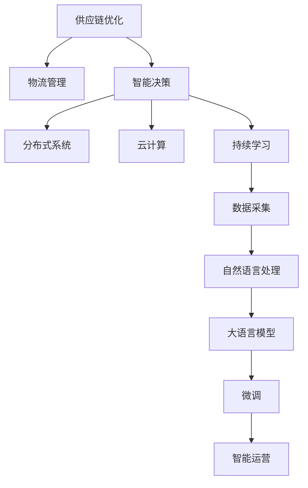

                 

# 供应链管理：LLM 优化全球物流

> 关键词：大语言模型, 供应链优化, 物流管理, 自然语言处理, 智能决策, 分布式系统, 云计算, 持续学习

## 1. 背景介绍

### 1.1 问题由来

全球化经济的蓬勃发展推动了供应链网络的大幅扩张。从传统制造业到新兴的零售、电商等行业，物流链条日益复杂，物流成本不断攀升，供应链效率问题凸显。如何在全球物流网络中实现高效、经济、灵活的运营管理，已成为各企业关注的焦点。

现代供应链管理涉及复杂的物流、库存、仓储、运输、订单等多个环节，数据量庞大，且不断变化。如何从海量数据中快速获取有用信息，实时动态调整供应链策略，成为供应链优化的关键。

随着人工智能和大数据技术的不断成熟，利用先进技术手段提升供应链管理水平成为了可能。利用自然语言处理(NLP)技术，结合大语言模型(LLM)，可以构建智能化的供应链管理系统，实现智能决策和实时优化。

### 1.2 问题核心关键点

1. **数据驱动的供应链优化**：
   - 利用大数据技术实时采集和分析供应链数据。
   - 通过自然语言处理技术，提取和理解供应链相关的业务文档和数据。

2. **基于大语言模型的智能决策**：
   - 利用预训练的LLM，在供应链领域进行微调，使其具备行业特定的语义理解能力。
   - 基于微调的LLM，进行智能策略规划和优化决策。

3. **智能供应链运营**：
   - 构建智能化的供应链管理系统，实现自动化的操作和调度。
   - 集成物联网(IoT)技术，实现对供应链各节点的实时监控和数据采集。

4. **实时响应和调整**：
   - 系统需要具备实时响应供应链变化的能力。
   - 在供应链出现异常时，能够快速定位问题，并给出最优的调整方案。

## 2. 核心概念与联系

### 2.1 核心概念概述

为更好地理解基于大语言模型(Large Language Model, LLM)的供应链管理，本节将介绍几个密切相关的核心概念：

- **大语言模型**：一种能够理解和生成自然语言的深度学习模型，通过对海量无标签文本数据进行预训练，学习到丰富的语言知识和常识。

- **供应链优化**：通过物流、库存、运输等环节的管理和优化，实现供应链的高效运营和成本控制。

- **物流管理**：涉及货物运输、仓储、配送等环节的管理，包括需求预测、运输路线优化、库存管理等。

- **智能决策**：通过分析供应链数据，利用算法和模型，辅助人工进行业务决策。

- **分布式系统**：涉及多个节点协同工作，实现高效、可靠的系统架构。

- **云计算**：通过云平台提供计算资源，实现供应链管理系统的弹性和可扩展性。

- **持续学习**：通过不断地学习新数据，更新模型，保持系统性能和准确性。

这些核心概念之间的逻辑关系可以通过以下Mermaid流程图来展示：



这个流程图展示了大语言模型在供应链优化中的核心概念及其之间的关系：

1. 供应链优化涉及物流管理、智能决策等环节。
2. 智能决策利用大语言模型进行优化。
3. 大语言模型需要通过微调具备行业特定的语义理解能力。
4. 分布式系统和云计算为供应链管理提供高效的基础设施。
5. 持续学习保持供应链管理系统的动态适应能力。
6. 数据采集和自然语言处理是大语言模型获取供应链数据和语义理解的基础。

这些概念共同构成了基于LLM的供应链管理框架，使其能够实现智能化的供应链运营和决策。

## 3. 核心算法原理 & 具体操作步骤

### 3.1 算法原理概述

基于大语言模型的供应链优化，本质上是通过对供应链相关文档和数据的自然语言处理，辅助智能决策。其核心思想是：利用预训练的LLM，通过微调使其具备特定的行业语义理解能力，并在此基础上构建智能化的供应链管理决策系统。

具体步骤包括：
1. 收集供应链相关的业务文档和数据。
2. 利用自然语言处理技术，提取供应链相关的关键信息。
3. 利用大语言模型进行微调，使其能够理解供应链领域的语义。
4. 基于微调的LLM，进行供应链优化和智能决策。
5. 利用分布式系统和云计算，实现供应链管理系统的弹性和可扩展性。

### 3.2 算法步骤详解

以下是基于大语言模型的供应链优化的详细步骤：

**Step 1: 数据收集与预处理**
- 收集供应链相关业务文档和数据，如订单、运输、库存等信息。
- 对文档和数据进行清洗、标注和处理，去除无用信息，保留关键数据。

**Step 2: 构建语料库**
- 构建包含供应链相关文本的语料库。
- 利用自然语言处理技术，如分词、实体识别、关系抽取等，提取关键信息。

**Step 3: 选择大语言模型**
- 选择合适的预训练大语言模型，如GPT-3、BERT等。
- 将预训练模型作为初始化参数。

**Step 4: 微调大语言模型**
- 设计供应链相关的任务，如运输路线规划、库存管理、需求预测等。
- 根据任务设计目标函数，如最小化运输成本、最大化库存利用率等。
- 使用标注数据对模型进行微调。

**Step 5: 构建智能决策系统**
- 基于微调的LLM，构建供应链管理决策系统。
- 实现自动化决策，如自动规划运输路线、实时调整库存等。

**Step 6: 部署与测试**
- 将智能决策系统部署到分布式系统中，利用云计算资源进行扩展。
- 对系统进行测试，确保系统稳定运行，并根据测试结果进行调整优化。

### 3.3 算法优缺点

基于大语言模型的供应链优化有以下优点：
1. 高效的数据处理：利用自然语言处理技术，快速处理大量文本数据。
2. 智能决策支持：利用微调后的LLM，进行智能策略规划和优化决策。
3. 实时响应和调整：系统能够实时监测供应链变化，及时进行调整。
4. 可扩展性强：通过云计算，实现系统的弹性和可扩展性。

同时，该方法也存在一些局限性：
1. 数据质量要求高：供应链数据量庞大且复杂，数据质量对系统性能影响大。
2. 微调依赖标注数据：微调需要大量的标注数据，标注成本较高。
3. 泛化能力有限：微调模型可能对特定供应链场景适应性较强，泛化能力有待提升。
4. 计算资源需求大：微调和智能决策系统需要强大的计算资源支持。

尽管存在这些局限性，但基于大语言模型的供应链优化方法依然是大数据驱动供应链管理的重要方向。未来相关研究将更多关注提高数据质量、降低标注成本、提升模型泛化能力、优化计算资源使用等方面。

### 3.4 算法应用领域

基于大语言模型的供应链优化方法，已经在多个领域得到了广泛应用，例如：

1. **物流路线规划**：利用大语言模型对历史运输数据进行分析，辅助智能规划运输路线，实现运输成本最小化。
2. **库存管理**：通过分析订单数据，预测需求趋势，实现库存自动化管理。
3. **需求预测**：利用自然语言处理技术，提取供应链文档中的业务信息，辅助需求预测。
4. **异常监测**：基于微调的大语言模型，实时监测供应链数据，识别异常情况，快速响应。
5. **智能客服**：利用微调的聊天机器人，处理供应链相关客户咨询，提升服务效率。

除了上述这些经典应用外，大语言模型在供应链优化领域的创新性应用还在不断涌现，如多模态数据融合、实时优化调度等，为供应链管理带来了新的突破。

## 4. 数学模型和公式 & 详细讲解 & 举例说明（备注：数学公式请使用latex格式，latex嵌入文中独立段落使用 $$，段落内使用 $)
### 4.1 数学模型构建

本节将使用数学语言对基于大语言模型的供应链优化过程进行更加严格的刻画。

假设供应链管理问题可以抽象为最小化运输成本$C$，即：

$$
\min_{x} C = \sum_{i,j} c_{ij} x_{ij}
$$

其中$c_{ij}$表示节点$i$到节点$j$的运输成本，$x_{ij}$表示从节点$i$到节点$j$的运输量。

在数学模型中，需要将供应链相关的业务文档和数据转化为结构化的数学表达式。这可以通过自然语言处理技术实现，具体步骤如下：

1. 对供应链相关的业务文档进行分词和实体识别，提取关键信息。
2. 将提取的信息转化为数学变量和参数，建立数学模型。
3. 利用大语言模型进行微调，优化模型参数。

### 4.2 公式推导过程

以运输路线规划为例，假设供应链节点数为$n$，节点$i$到节点$j$的运输成本为$c_{ij}$。模型的目标是最小化总运输成本，数学表达式为：

$$
\min_{x} C = \sum_{i,j} c_{ij} x_{ij}
$$

其中$x_{ij}$为从节点$i$到节点$j$的运输量，满足$x_{ij} \geq 0$。

利用大语言模型进行微调的具体步骤如下：

1. 将供应链相关的文本数据输入模型，提取语义信息。
2. 根据提取的信息，设计任务目标函数。
3. 使用标注数据对模型进行微调。
4. 将微调后的模型应用于实际供应链管理决策中。

### 4.3 案例分析与讲解

假设某电子商务企业需要将一批货物从上海运送到北京，沿途经过南京、武汉和郑州。利用大语言模型进行路线规划，步骤如下：

1. 收集运输历史数据，提取运输成本$c_{ij}$。
2. 利用自然语言处理技术，提取运输路线信息，如节点坐标、运输时间等。
3. 构建最小化运输成本的数学模型：

$$
\min_{x} C = c_{SU}x_{SU} + c_{UN}x_{UN} + c_{WN}x_{WN} + c_{WO}x_{WO} + c_{OB}x_{OB}
$$

其中$x_{ij}$表示从上海$i$到北京$j$的运输量。
4. 利用大语言模型进行微调，优化模型参数。
5. 基于微调后的模型，进行运输路线规划，得出最优路线。

## 5. 项目实践：代码实例和详细解释说明
### 5.1 开发环境搭建

在进行供应链优化实践前，我们需要准备好开发环境。以下是使用Python进行PyTorch开发的环境配置流程：

1. 安装Anaconda：从官网下载并安装Anaconda，用于创建独立的Python环境。

2. 创建并激活虚拟环境：
```bash
conda create -n pytorch-env python=3.8 
conda activate pytorch-env
```

3. 安装PyTorch：根据CUDA版本，从官网获取对应的安装命令。例如：
```bash
conda install pytorch torchvision torchaudio cudatoolkit=11.1 -c pytorch -c conda-forge
```

4. 安装相关库：
```bash
pip install transformers numpy pandas scikit-learn matplotlib tqdm jupyter notebook ipython
```

完成上述步骤后，即可在`pytorch-env`环境中开始供应链优化实践。

### 5.2 源代码详细实现

下面我们以供应链需求预测为例，给出使用Transformers库对BERT模型进行微调的PyTorch代码实现。

首先，定义需求预测任务的数据处理函数：

```python
from transformers import BertTokenizer
from torch.utils.data import Dataset
import torch

class DemandDataset(Dataset):
    def __init__(self, texts, labels, tokenizer, max_len=128):
        self.texts = texts
        self.labels = labels
        self.tokenizer = tokenizer
        self.max_len = max_len
        
    def __len__(self):
        return len(self.texts)
    
    def __getitem__(self, item):
        text = self.texts[item]
        label = self.labels[item]
        
        encoding = self.tokenizer(text, return_tensors='pt', max_length=self.max_len, padding='max_length', truncation=True)
        input_ids = encoding['input_ids'][0]
        attention_mask = encoding['attention_mask'][0]
        
        # 对label进行编码
        encoded_labels = torch.tensor([label], dtype=torch.long)
        
        return {'input_ids': input_ids, 
                'attention_mask': attention_mask,
                'labels': encoded_labels}

# 标签与id的映射
tag2id = {'low': 0, 'medium': 1, 'high': 2}
id2tag = {v: k for k, v in tag2id.items()}

# 创建dataset
tokenizer = BertTokenizer.from_pretrained('bert-base-cased')

train_dataset = DemandDataset(train_texts, train_labels, tokenizer)
dev_dataset = DemandDataset(dev_texts, dev_labels, tokenizer)
test_dataset = DemandDataset(test_texts, test_labels, tokenizer)
```

然后，定义模型和优化器：

```python
from transformers import BertForTokenClassification, AdamW

model = BertForTokenClassification.from_pretrained('bert-base-cased', num_labels=len(tag2id))

optimizer = AdamW(model.parameters(), lr=2e-5)
```

接着，定义训练和评估函数：

```python
from torch.utils.data import DataLoader
from tqdm import tqdm
from sklearn.metrics import classification_report

device = torch.device('cuda') if torch.cuda.is_available() else torch.device('cpu')
model.to(device)

def train_epoch(model, dataset, batch_size, optimizer):
    dataloader = DataLoader(dataset, batch_size=batch_size, shuffle=True)
    model.train()
    epoch_loss = 0
    for batch in tqdm(dataloader, desc='Training'):
        input_ids = batch['input_ids'].to(device)
        attention_mask = batch['attention_mask'].to(device)
        labels = batch['labels'].to(device)
        model.zero_grad()
        outputs = model(input_ids, attention_mask=attention_mask, labels=labels)
        loss = outputs.loss
        epoch_loss += loss.item()
        loss.backward()
        optimizer.step()
    return epoch_loss / len(dataloader)

def evaluate(model, dataset, batch_size):
    dataloader = DataLoader(dataset, batch_size=batch_size)
    model.eval()
    preds, labels = [], []
    with torch.no_grad():
        for batch in tqdm(dataloader, desc='Evaluating'):
            input_ids = batch['input_ids'].to(device)
            attention_mask = batch['attention_mask'].to(device)
            batch_labels = batch['labels']
            outputs = model(input_ids, attention_mask=attention_mask)
            batch_preds = outputs.logits.argmax(dim=2).to('cpu').tolist()
            batch_labels = batch_labels.to('cpu').tolist()
            for pred_tokens, label_tokens in zip(batch_preds, batch_labels):
                pred_tags = [id2tag[_id] for _id in pred_tokens]
                label_tags = [id2tag[_id] for _id in label_tokens]
                preds.append(pred_tags[:len(label_tokens)])
                labels.append(label_tags)
                
    print(classification_report(labels, preds))
```

最后，启动训练流程并在测试集上评估：

```python
epochs = 5
batch_size = 16

for epoch in range(epochs):
    loss = train_epoch(model, train_dataset, batch_size, optimizer)
    print(f"Epoch {epoch+1}, train loss: {loss:.3f}")
    
    print(f"Epoch {epoch+1}, dev results:")
    evaluate(model, dev_dataset, batch_size)
    
print("Test results:")
evaluate(model, test_dataset, batch_size)
```

以上就是使用PyTorch对BERT进行供应链需求预测任务的微调的完整代码实现。可以看到，得益于Transformers库的强大封装，我们可以用相对简洁的代码完成BERT模型的加载和微调。

### 5.3 代码解读与分析

让我们再详细解读一下关键代码的实现细节：

**DemandDataset类**：
- `__init__`方法：初始化文本、标签、分词器等关键组件。
- `__len__`方法：返回数据集的样本数量。
- `__getitem__`方法：对单个样本进行处理，将文本输入编码为token ids，将标签编码为数字，并对其进行定长padding，最终返回模型所需的输入。

**tag2id和id2tag字典**：
- 定义了标签与数字id之间的映射关系，用于将token-wise的预测结果解码回真实的标签。

**训练和评估函数**：
- 使用PyTorch的DataLoader对数据集进行批次化加载，供模型训练和推理使用。
- 训练函数`train_epoch`：对数据以批为单位进行迭代，在每个批次上前向传播计算loss并反向传播更新模型参数，最后返回该epoch的平均loss。
- 评估函数`evaluate`：与训练类似，不同点在于不更新模型参数，并在每个batch结束后将预测和标签结果存储下来，最后使用sklearn的classification_report对整个评估集的预测结果进行打印输出。

**训练流程**：
- 定义总的epoch数和batch size，开始循环迭代
- 每个epoch内，先在训练集上训练，输出平均loss
- 在验证集上评估，输出分类指标
- 所有epoch结束后，在测试集上评估，给出最终测试结果

可以看到，PyTorch配合Transformers库使得BERT微调的需求预测任务代码实现变得简洁高效。开发者可以将更多精力放在数据处理、模型改进等高层逻辑上，而不必过多关注底层的实现细节。

当然，工业级的系统实现还需考虑更多因素，如模型的保存和部署、超参数的自动搜索、更灵活的任务适配层等。但核心的微调范式基本与此类似。

## 6. 实际应用场景
### 6.1 智能仓库管理

智能仓库管理是供应链管理中的关键环节，通过大语言模型进行需求预测、库存管理、配送调度等，可以实现仓库的高效运营。

1. **需求预测**：利用大语言模型对历史订单数据进行分析，预测未来的需求趋势，指导仓库备货。
2. **库存管理**：基于预测结果，动态调整库存水平，避免过剩或缺货的情况。
3. **配送调度**：利用自然语言处理技术，提取配送任务的关键信息，规划最优配送路线，优化配送效率。

### 6.2 实时供应链监控

实时供应链监控系统利用大语言模型进行数据处理和智能决策，帮助企业及时发现供应链中的异常情况，快速响应并解决问题。

1. **异常检测**：通过分析供应链数据，利用大语言模型进行实时异常检测，识别潜在的风险点。
2. **预警机制**：根据异常检测结果，自动触发预警机制，通知相关部门进行处理。
3. **决策支持**：结合业务规则和专家知识，利用大语言模型辅助人工进行决策。

### 6.3 多部门协同

大语言模型能够实现供应链各环节的协同管理，提升整体效率和响应速度。

1. **订单管理**：利用大语言模型处理订单信息，生成派单任务，分配给相应的仓库和配送团队。
2. **库存调整**：根据订单情况，利用大语言模型调整库存，优化资源配置。
3. **物流调度**：利用大语言模型进行物流路线规划，实时调整配送计划，提升物流效率。

### 6.4 未来应用展望

随着大语言模型和微调方法的不断发展，基于微调的供应链优化技术将呈现以下几个发展趋势：

1. **全栈智能解决方案**：结合物联网、区块链、云计算等技术，构建全栈的供应链智能化解决方案，实现供应链的全面数字化、智能化。

2. **实时协同与决策**：利用大语言模型进行实时协同与决策，提升供应链的灵活性和响应速度。

3. **供应链协同优化**：利用大语言模型优化供应链各环节的协同，提升整体效率和资源利用率。

4. **跨领域应用拓展**：结合其他人工智能技术，如知识图谱、强化学习等，拓展供应链优化在更多领域的应用。

5. **供应链风险管理**：利用大语言模型进行供应链风险预警和应急响应，提升供应链的鲁棒性和韧性。

6. **可持续发展**：利用大语言模型优化供应链的绿色管理，实现供应链的可持续发展。

这些趋势凸显了大语言模型在供应链优化中的广阔前景。这些方向的探索发展，必将进一步提升供应链管理系统的性能和应用范围，为物流行业带来新的突破。

## 7. 工具和资源推荐
### 7.1 学习资源推荐

为了帮助开发者系统掌握供应链管理的大语言模型微调技术，这里推荐一些优质的学习资源：

1. **《深度学习与自然语言处理》**：斯坦福大学开设的深度学习课程，涵盖自然语言处理和供应链管理的基础知识。

2. **《自然语言处理》**：清华大学教授李航的书籍，系统讲解自然语言处理的基本概念和算法。

3. **《供应链管理》**：哈佛商学院教授David H. Hensel的书籍，全面介绍供应链管理的基本理论和实践。

4. **《机器学习实战》**：一本实战性很强的书籍，涵盖机器学习模型的开发和应用，包括大语言模型在供应链管理中的应用。

5. **《自然语言处理框架TensorFlow》**：介绍TensorFlow在自然语言处理中的应用，包括供应链管理领域的微调技术。

通过对这些资源的学习实践，相信你一定能够快速掌握基于大语言模型的供应链管理技术，并用于解决实际的供应链问题。

### 7.2 开发工具推荐

高效的开发离不开优秀的工具支持。以下是几款用于供应链管理的大语言模型微调开发的常用工具：

1. **PyTorch**：基于Python的开源深度学习框架，灵活动态的计算图，适合快速迭代研究。

2. **TensorFlow**：由Google主导开发的开源深度学习框架，生产部署方便，适合大规模工程应用。

3. **Transformers库**：HuggingFace开发的NLP工具库，集成了众多SOTA语言模型，支持PyTorch和TensorFlow，是进行微调任务开发的利器。

4. **Weights & Biases**：模型训练的实验跟踪工具，可以记录和可视化模型训练过程中的各项指标，方便对比和调优。

5. **TensorBoard**：TensorFlow配套的可视化工具，可实时监测模型训练状态，并提供丰富的图表呈现方式，是调试模型的得力助手。

6. **Jupyter Notebook**：交互式的数据分析和模型训练环境，方便开发者编写和运行代码，实时查看结果。

合理利用这些工具，可以显著提升供应链管理的大语言模型微调任务的开发效率，加快创新迭代的步伐。

### 7.3 相关论文推荐

大语言模型和供应链管理优化技术的发展源于学界的持续研究。以下是几篇奠基性的相关论文，推荐阅读：

1. **“Attention is All You Need”**：Transformer原论文，提出了Transformer结构，奠定了大语言模型在供应链优化中的应用基础。

2. **“BERT: Pre-training of Deep Bidirectional Transformers for Language Understanding”**：BERT模型，引入基于掩码的自监督预训练任务，刷新了多项NLP任务SOTA，对供应链管理有重要参考价值。

3. **“Language Models are Unsupervised Multitask Learners”**：GPT-2论文，展示了大规模语言模型的强大zero-shot学习能力，为供应链管理的智能决策提供了新的思路。

4. **“Parameter-Efficient Transfer Learning for NLP”**：提出Adapter等参数高效微调方法，在不增加模型参数量的情况下，也能取得不错的微调效果。

5. **“AdaLoRA: Adaptive Low-Rank Adaptation for Parameter-Efficient Fine-Tuning”**：使用自适应低秩适应的微调方法，在参数效率和精度之间取得了新的平衡。

这些论文代表了大语言模型在供应链优化中的应用发展脉络。通过学习这些前沿成果，可以帮助研究者把握学科前进方向，激发更多的创新灵感。

## 8. 总结：未来发展趋势与挑战

### 8.1 总结

本文对基于大语言模型的供应链管理进行了全面系统的介绍。首先阐述了大语言模型在供应链优化中的应用背景和意义，明确了微调在提升供应链管理效率和响应速度方面的独特价值。其次，从原理到实践，详细讲解了供应链优化中的数学模型和微调步骤，给出了微调任务开发的完整代码实例。同时，本文还广泛探讨了微调方法在智能仓库管理、实时供应链监控、多部门协同等多个场景中的应用前景，展示了微调范式的巨大潜力。此外，本文精选了微调技术的各类学习资源，力求为读者提供全方位的技术指引。

通过本文的系统梳理，可以看到，基于大语言模型的供应链管理优化方法已经在供应链管理领域得到广泛应用，成为提高供应链效率的重要手段。未来，伴随预训练语言模型和微调方法的持续演进，基于微调的供应链管理优化技术必将进一步拓展，推动供应链管理系统的智能化进程。

### 8.2 未来发展趋势

展望未来，供应链管理中的大语言模型微调技术将呈现以下几个发展趋势：

1. **供应链全栈智能化**：结合物联网、区块链、云计算等技术，构建全栈的供应链智能化解决方案，实现供应链的全面数字化、智能化。

2. **实时协同与决策**：利用大语言模型进行实时协同与决策，提升供应链的灵活性和响应速度。

3. **供应链协同优化**：利用大语言模型优化供应链各环节的协同，提升整体效率和资源利用率。

4. **跨领域应用拓展**：结合其他人工智能技术，如知识图谱、强化学习等，拓展供应链优化在更多领域的应用。

5. **供应链风险管理**：利用大语言模型进行供应链风险预警和应急响应，提升供应链的鲁棒性和韧性。

6. **可持续发展**：利用大语言模型优化供应链的绿色管理，实现供应链的可持续发展。

这些趋势凸显了大语言模型在供应链优化中的广阔前景。这些方向的探索发展，必将进一步提升供应链管理系统的性能和应用范围，为物流行业带来新的突破。

### 8.3 面临的挑战

尽管基于大语言模型的供应链管理优化方法已经取得了瞩目成就，但在迈向更加智能化、普适化应用的过程中，它仍面临着诸多挑战：

1. **数据质量瓶颈**：供应链数据量庞大且复杂，数据质量对系统性能影响大。如何提高数据质量，获取高精度的数据，是一个重要问题。

2. **微调依赖标注数据**：微调需要大量的标注数据，标注成本较高。如何降低标注成本，提高数据标注效率，是一个关键挑战。

3. **泛化能力有限**：微调模型可能对特定供应链场景适应性较强，泛化能力有待提升。如何在保证泛化能力的同时，提高模型的性能，是一个研究热点。

4. **计算资源需求大**：微调和智能决策系统需要强大的计算资源支持。如何优化计算资源使用，降低计算成本，是一个重要研究方向。

5. **可解释性不足**：大语言模型作为“黑盒”模型，难以解释其内部工作机制和决策逻辑。如何在供应链管理中提高模型的可解释性，是一个亟待解决的难题。

6. **伦理道德问题**：在供应链管理中，利用大语言模型进行决策，可能面临数据隐私、决策透明性等问题。如何在保障数据隐私和安全的前提下，实现供应链管理的智能决策，是一个重要的研究课题。

这些挑战需要研究者不断探索和突破，以实现供应链管理系统的智能化、普适化和安全性。

### 8.4 研究展望

面向未来，供应链管理中的大语言模型微调技术需要在以下几个方向进行深入研究：

1. **数据增强与预处理**：提高供应链数据的准确性和完整性，利用数据增强技术，提升模型的泛化能力。

2. **模型压缩与优化**：优化计算资源使用，提升供应链管理系统的效率和可扩展性。

3. **跨领域融合**：结合知识图谱、强化学习等技术，拓展供应链优化在更多领域的应用。

4. **跨模态融合**：结合物联网、区块链等技术，实现供应链数据的全面融合和智能化管理。

5. **伦理与隐私保护**：研究供应链管理中大语言模型的伦理与隐私保护问题，建立数据使用的规范和标准。

这些研究方向将引领供应链管理中的大语言模型微调技术迈向新的高度，推动供应链管理的智能化和可持续发展。

## 9. 附录：常见问题与解答

**Q1：大语言模型在供应链管理中是否有实际应用？**

A: 大语言模型在供应链管理中的应用已经初见成效。例如，利用大语言模型进行需求预测、库存管理、配送调度等，能够显著提升供应链运营的效率和响应速度。

**Q2：微调大语言模型时如何选择合适的学习率？**

A: 微调大语言模型时，学习率的选择需要根据具体任务进行调整。一般来说，建议从较小的值开始，逐渐增加，直到模型收敛。可以使用学习率调度策略，如学习率衰减、warmup等，来优化学习率的选择。

**Q3：供应链管理中如何处理大规模数据？**

A: 供应链管理中的数据量通常非常大，如何高效地处理和利用这些数据是关键。可以利用分布式计算和数据分片技术，将数据处理任务分解为多个子任务，并行计算，提高数据处理效率。

**Q4：如何提升供应链管理中的大语言模型的泛化能力？**

A: 提升供应链管理中大语言模型的泛化能力，可以从以下几个方面入手：

1. 收集更多的数据，增加数据的多样性和覆盖面。
2. 引入更多的语义信息和业务规则，提高模型的理解能力。
3. 利用迁移学习、对抗训练等技术，提高模型的鲁棒性和泛化能力。

**Q5：供应链管理中的大语言模型如何进行实时响应和调整？**

A: 供应链管理中的大语言模型需要具备实时响应和调整的能力，以应对供应链的动态变化。这可以通过以下几个方面实现：

1. 引入在线学习和动态微调技术，根据实时数据不断更新模型参数。
2. 利用分布式计算和云计算资源，实现系统的弹性和可扩展性。
3. 设计高效的算法和数据结构，提高系统响应速度和处理能力。

**Q6：供应链管理中的大语言模型如何处理多模态数据？**

A: 供应链管理中的数据通常不仅仅局限于文本数据，还涉及物联网、视频、图像等多种数据类型。如何有效融合这些多模态数据，是大语言模型在供应链管理中的一个重要研究方向。可以利用多模态学习技术和迁移学习，将不同模态的数据进行融合，提升模型的整体性能。

---

作者：禅与计算机程序设计艺术 / Zen and the Art of Computer Programming

