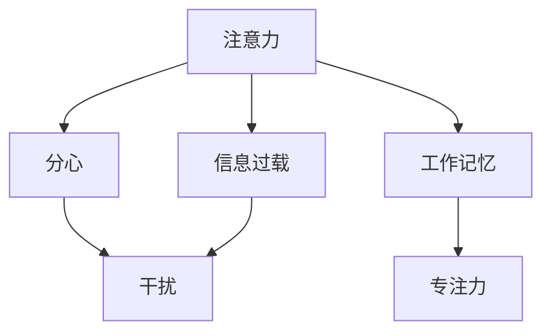

                 

# 信息时代的注意力管理技术：在干扰和信息过载中增强专注力

## 1. 背景介绍

### 1.1 问题由来
随着互联网和移动设备的普及，信息量呈指数级增长，人们每天面对海量的信息流，注意力成为了稀缺资源。分散的注意力导致工作效率下降、学习效率不高、心理负担增加等问题。如何有效地管理注意力，提高专注力，在信息过载的环境中取得最佳表现，成为现代社会的一大挑战。

### 1.2 问题核心关键点
注意力管理技术旨在帮助个体提升专注力，高效处理信息。核心问题在于如何克服信息干扰和过载，找到并维持对重要信息的注意力。以下是注意力管理的几个关键点：

- **注意力分配**：学习在众多任务和干扰源中有效分配注意力，确保关键任务的优先级。
- **注意力持续**：通过减少分心因素，提高长时间保持注意力的能力。
- **注意力恢复**：在疲劳和分心时，能快速恢复注意力，进入高效状态。
- **注意力监控**：实时监控注意力状态，反馈并调节注意力行为。

### 1.3 问题研究意义
研究注意力管理技术，有助于提升工作效率，减轻心理压力，增强学习效果，特别是在信息量巨大的工作和生活场景中。通过科学合理地分配和管理注意力，个体可以更好地应对信息过载，提高生活质量和工作效率。

## 2. 核心概念与联系

### 2.1 核心概念概述

为更好地理解注意力管理技术的核心，本节将介绍几个关键概念：

- **注意力(Attention)**：认知心理学中的注意力是指个体选择性地关注某些信息而忽略其他信息的心理过程。
- **分心(Distractibility)**：指个体容易在非重要任务上投入过多注意力的心理特性。
- **信息过载(Information Overload)**：指个体面对的信息量超出其处理能力，导致认知负荷过重，影响注意力和决策。
- **干扰(Interference)**：指外界刺激或内部心理因素导致个体注意力分散，影响认知过程。
- **工作记忆(Working Memory)**：指个体在短时间内对信息进行加工、存储和操作的能力。

这些概念之间的逻辑关系可以通过以下Mermaid流程图来展示：



这个流程图展示了好几个概念之间的关联：

1. 注意力受到信息过载和分心的影响，同时也依赖于工作记忆的支持。
2. 干扰因素可以导致注意力分散。
3. 提升注意力可以增强工作记忆，从而提高专注力。

## 3. 核心算法原理 & 具体操作步骤
### 3.1 算法原理概述

注意力管理技术通常包括注意力分配、注意力保持、注意力恢复和注意力监控四个方面。其核心算法原理是通过认知心理学、行为科学和计算技术，模拟人类的注意力过程，辅助个体进行有效的注意力分配和管理。

形式化地，假设个体面临的信息流为 $X$，任务的优先级为 $P$，注意力分配策略为 $A$，则注意力管理过程可以表示为：

$$
A = \arg\min_{A} \sum_{x \in X} P(x) \cdot f(\text{Attention}(x, A))
$$

其中 $f(\text{Attention}(x, A))$ 表示任务 $x$ 在注意力策略 $A$ 下的注意力分配。

### 3.2 算法步骤详解

注意力管理技术的具体操作步骤如下：

1. **任务评估**：对所有待处理任务进行优先级排序，例如使用Eisenhower矩阵进行四象限划分。
2. **注意力分配**：基于优先级和当前注意力的可用性，动态调整各任务的注意力分配。
3. **注意力保持**：采用心理学的注意力保持技术，如番茄工作法、断网模式等，帮助个体维持注意力集中。
4. **注意力恢复**：使用认知负荷缓解技术，如休息间隙、深呼吸等，快速恢复注意力。
5. **注意力监控**：实时监测注意力状态，提供注意力监控报告，反馈并调节注意力行为。

### 3.3 算法优缺点

注意力管理技术有以下优点：

- **提高工作效率**：通过合理分配和管理注意力，个体可以更高效地完成任务，提高生产力。
- **增强心理韧性**：通过科学注意力管理，减轻信息过载和分心带来的心理压力，提升心理健康。
- **改善学习效果**：提高学习过程中的专注力，减少干扰，提高记忆和理解能力。

同时，该技术也存在一些缺点：

- **依赖个体自控力**：效果依赖于个体是否能够按照技术指导进行自我管理。
- **适应性问题**：技术难以自动适应个体差异，需要个体进行一定程度的个性化调整。
- **技术依赖性**：对技术的过度依赖可能导致个体失去部分自然注意力管理能力。
- **交互性不足**：目前的注意力管理工具大多缺乏个性化交互，用户体验有待提升。

### 3.4 算法应用领域

注意力管理技术在多个领域都有广泛应用，例如：

- **工作场景**：办公室职员、学生等面对繁重任务时，可以利用注意力管理工具提升工作效率。
- **学习场景**：学生和研究人员可以利用注意力管理技术提高学习效果，减少分心。
- **娱乐场景**：游戏玩家可以使用注意力管理技术减少游戏过程中的分心，提升游戏体验。
- **健康管理**：心理健康辅导、失眠治疗等，通过调整注意力状态，缓解心理压力，提高睡眠质量。

## 4. 数学模型和公式 & 详细讲解 & 举例说明

### 4.1 数学模型构建

注意力管理技术的数学模型构建主要基于以下几个概念：

- **任务优先级**：使用$P(x)$表示任务$x$的优先级，一般可以使用专家打分、统计频率等方式计算。
- **注意力分配**：$f(\text{Attention}(x, A))$表示任务$x$在注意力策略$A$下的注意力分配，可以使用加权平均、加权求和等方法计算。
- **认知负荷**：使用$C(x)$表示处理任务$x$所需的认知负荷，可以使用工作记忆容量等指标计算。
- **注意力恢复**：使用$R(A)$表示注意力恢复效果，可以使用休息时间、心理放松等指标计算。

### 4.2 公式推导过程

以加权平均法为例，推导注意力分配函数的计算过程：

假设任务集合为 $X$，注意力总和为 $S$，则加权平均法的注意力分配公式为：

$$
f(\text{Attention}(x, A)) = \frac{P(x)}{S} \cdot \frac{C(x)}{C_{\max}}
$$

其中 $S = \sum_{x \in X} P(x)$ 表示所有任务的优先级总和，$C_{\max}$ 表示最高认知负荷。

根据该公式，任务优先级越高、认知负荷越大，分配给该任务的注意力也越多。

### 4.3 案例分析与讲解

假设有一个学生需要完成数学作业、英语作业和阅读三门任务，优先级分别为1、2、3，每项任务的认知负荷分别为100、80、60。当前学生剩余注意力总和为150，则按照加权平均法计算的注意力分配如下：

$$
f(\text{Attention}(数学作业, A)) = \frac{1}{1+2+3} \cdot \frac{100}{100+80+60} \cdot \frac{150}{150} = 0.2
$$

$$
f(\text{Attention}(英语作业, A)) = \frac{2}{1+2+3} \cdot \frac{80}{100+80+60} \cdot \frac{150}{150} = 0.267
$$

$$
f(\text{Attention}(阅读, A)) = \frac{3}{1+2+3} \cdot \frac{60}{100+80+60} \cdot \frac{150}{150} = 0.533
$$

因此，学生应该首先处理阅读任务，其次处理英语作业，最后处理数学作业，以最大化注意力使用效率。

## 5. 项目实践：代码实例和详细解释说明
### 5.1 开发环境搭建

在进行注意力管理技术的实践前，我们需要准备好开发环境。以下是使用Python进行开发的环境配置流程：

1. 安装Anaconda：从官网下载并安装Anaconda，用于创建独立的Python环境。

2. 创建并激活虚拟环境：
```bash
conda create -n attention-manage python=3.8 
conda activate attention-manage
```

3. 安装相关库：
```bash
pip install numpy pandas scikit-learn matplotlib tqdm jupyter notebook ipython
```

4. 安装注意力管理工具：
```bash
pip install attentionlib
```

完成上述步骤后，即可在`attention-manage`环境中开始注意力管理的开发实践。

### 5.2 源代码详细实现

下面我们以番茄工作法(Tomato Technique)为例，给出使用Python实现注意力保持的代码实现。

```python
import time
from attentionlib import AttentionManager

# 定义番茄工作法
class TomatoTimer:
    def __init__(self):
        self.working_time = 25 # 工作时间 25分钟
        self.break_time = 5 # 休息时间 5分钟
        self.clock = 0
        self.manager = AttentionManager()
    
    def start(self):
        self.manager.start(self.working_time)
        print("开始工作，工作时间：{}分钟".format(self.working_time))
        time.sleep(self.working_time * 60)
        print("工作时间结束，休息时间：{}分钟".format(self.break_time))
        self.manager.switch_to_break()
        time.sleep(self.break_time * 60)
        print("休息时间结束，重新开始工作。")
        self.manager.switch_to_working()
    
    def stop(self):
        print("停止工作，请重新开始。")
        self.manager.stop()

# 创建番茄计时器实例
tomato = TomatoTimer()

# 启动工作计时器
tomato.start()

# 工作结束后停止计时器
tomato.stop()
```

### 5.3 代码解读与分析

让我们再详细解读一下关键代码的实现细节：

**TomatoTimer类**：
- `__init__`方法：初始化番茄工作法参数，包括工作时间、休息时间等。
- `start`方法：启动工作计时器，并调用AttentionManager的`start`方法，开始工作计时。
- `stop`方法：停止工作计时器，并调用AttentionManager的`stop`方法，停止计时。

**AttentionManager类**：
- `start`方法：启动当前注意力分配模式，即工作模式。
- `switch_to_break`方法：切换到休息模式。
- `switch_to_working`方法：切换到工作模式。

**运行结果展示**：
通过以上代码，启动番茄工作法后，系统将开始计时工作时间，并在工作结束后切换为休息时间，持续循环。用户可以根据需要停止工作计时器，进行休息或调整。

## 6. 实际应用场景
### 6.1 企业办公室

企业办公室中，员工面对各种会议、邮件、任务，注意力管理技术可以帮助员工合理安排时间，提升工作效率。

在实际应用中，可以使用电子日历和任务管理工具，结合注意力管理软件，帮助员工自动划分任务优先级，动态调整注意力分配，确保重要任务的优先处理。

### 6.2 学生课堂

学生课堂中，面对繁重的作业和考试压力，注意力管理技术可以帮助学生提高学习效率，减轻心理负担。

学生可以使用学习管理应用，根据课程难度、学习目标等因素，设定任务优先级，动态调整注意力分配。同时，结合番茄工作法等注意力保持技术，提升课堂学习的专注力。

### 6.3 远程办公

远程办公环境下，员工面对各种干扰和信息过载，注意力管理技术可以帮助员工提高远程工作效率，保持心理平衡。

在实际应用中，远程办公人员可以使用注意力管理软件，实时监控注意力状态，动态调整工作任务和休息时间。结合视频会议工具，可以更好地处理多任务和即时沟通。

## 7. 工具和资源推荐
### 7.1 学习资源推荐

为了帮助开发者系统掌握注意力管理技术的理论基础和实践技巧，这里推荐一些优质的学习资源：

1. 《注意力管理：认知负荷、分心与效率》书籍：系统介绍了注意力管理的原理、方法和实践，适合入门学习。
2. 《番茄工作法图解》：图文并茂，详细讲解了番茄工作法的使用方法和心理学原理，适合实际应用。
3. Coursera《注意力管理与工作效率》课程：由认知心理学专家授课，深入浅出地讲解了注意力管理技术的理论和实践。
4. Udacity《注意力与信息处理》课程：结合神经科学和认知科学，讲解了注意力管理的科学原理。
5. B站《注意力管理技术》系列视频：由专业讲师讲解，结合实际案例，生动易懂，适合初学者。

通过对这些资源的学习实践，相信你一定能够快速掌握注意力管理技术的精髓，并用于解决实际的注意力管理问题。

### 7.2 开发工具推荐

高效的开发离不开优秀的工具支持。以下是几款用于注意力管理开发的常用工具：

1. Focus@Will：提供定制的音乐和声音，帮助用户集中注意力，适合长时间工作的知识工作者。
2. Cold Turkey：可以屏蔽干扰应用和网站，帮助用户专注工作，适合需要断网模式的用户。
3. RescueTime：自动记录和分析用户的电脑使用习惯，提供注意力管理报告，适合自我反思的用户。
4. Pomodone：结合番茄工作法和在线任务管理，帮助用户高效完成任务，适合远程办公的用户。
5. Notion：结合笔记、任务管理和番茄计时器，提供全面的注意力管理工具，适合各类应用场景。

合理利用这些工具，可以显著提升注意力管理技术的开发效率，加快创新迭代的步伐。

### 7.3 相关论文推荐

注意力管理技术的研究源于学界的持续研究。以下是几篇奠基性的相关论文，推荐阅读：

1. Coherent Attention: Deep Learning of Scheduling with Attention (Attention-Based Scheduling)：提出了一种基于注意力的调度模型，用于优化资源分配。
2. Towards Explainable Attention Mechanisms for Deep Learning Models：讨论了注意力机制的可解释性，提出了一种可视化注意力图的方法。
3. Cognitive Load Management and Sustainable Attention Management in Complex Environments：总结了注意力管理的心理学和认知负荷理论，提出了多任务注意力管理的策略。
4. Neural Architectures for Modulating Attention in Visual Recognition：提出了一种神经网络架构，用于调制注意力机制，提高了视觉识别任务的效率。
5. Attention is All You Need (Transformer论文)：虽然这篇论文主要讨论了Transformer架构，但其中的注意力机制在注意力管理技术中具有重要参考价值。

这些论文代表了大语言模型微调技术的发展脉络。通过学习这些前沿成果，可以帮助研究者把握学科前进方向，激发更多的创新灵感。

## 8. 总结：未来发展趋势与挑战
### 8.1 总结

本文对注意力管理技术的核心原理和操作步骤进行了详细讲解，并通过实际代码实例，展示了注意力管理技术在实践中的应用。重点介绍了番茄工作法等注意力保持技术，并通过案例分析，展示了注意力管理技术在实际应用中的效果。

通过本文的系统梳理，可以看到，注意力管理技术在提升个体专注力和工作效率方面，具有重要的应用价值。未来的研究需要在理论和实践两方面进行进一步探索，以期提升注意力管理技术的科学性和实用性。

### 8.2 未来发展趋势

展望未来，注意力管理技术将呈现以下几个发展趋势：

1. **个性化增强**：未来的注意力管理工具将更加注重个性化需求，结合生物识别技术，如眼动追踪、心电图等，实现更精准的注意力管理。
2. **技术融合**：结合物联网、可穿戴设备、人工智能等技术，构建智能化的注意力管理系统，提升用户的综合体验。
3. **跨平台应用**：开发跨平台、多设备支持的注意力管理应用，实现无缝切换和统一管理。
4. **自动化程度提升**：结合机器学习和人工智能技术，实现自动化注意力管理，减少人工干预。
5. **融合心理支持**：结合心理干预技术，如认知行为疗法、冥想训练等，提升用户的心理健康和注意力管理能力。

以上趋势凸显了注意力管理技术的广阔前景。这些方向的探索发展，必将进一步提升注意力管理技术的科学性和实用性，为提升个体生活质量和工作效率提供更多可能性。

### 8.3 面临的挑战

尽管注意力管理技术已经取得了不小的进展，但在迈向更加智能化、普适化应用的过程中，它仍面临诸多挑战：

1. **个性化难题**：尽管个性化技术发展迅速，但当前注意力管理工具难以完全满足个体差异，仍需大量个性化调整。
2. **跨平台兼容性**：不同平台和设备上的注意力管理应用需要相互兼容，实现无缝切换。
3. **数据隐私和安全**：注意力管理工具涉及用户隐私数据，数据安全和隐私保护至关重要。
4. **依赖性问题**：过度依赖技术可能导致用户失去部分自然注意力管理能力，需要找到技术和自然管理的平衡点。
5. **技术普及度**：注意力管理技术还未能广泛普及，需要更多教育和推广，提高用户认知和使用率。

### 8.4 研究展望

面对注意力管理技术所面临的挑战，未来的研究需要在以下几个方面寻求新的突破：

1. **融合多模态数据**：结合生理信号、心理状态等多模态数据，实现更全面、准确的注意力状态监测和评估。
2. **引入因果推断**：引入因果推断技术，提高注意力管理策略的科学性和可靠性，减少误导性行为。
3. **提升模型可解释性**：结合可解释性技术，增强注意力管理模型的透明度和可信度。
4. **结合AI和心理学**：结合人工智能和心理学原理，开发更高效、更自然的注意力管理工具。
5. **融合伦理和道德**：结合伦理和道德考量，确保注意力管理技术的公平性和安全性。

这些研究方向的探索，必将引领注意力管理技术迈向更高的台阶，为提升个体生活质量和工作效率提供更多可能性。面向未来，注意力管理技术还需要与其他人工智能技术进行更深入的融合，如知识表示、因果推理、强化学习等，多路径协同发力，共同推动注意力管理技术的进步。只有勇于创新、敢于突破，才能不断拓展注意力管理的边界，让技术更好地造福人类社会。

## 9. 附录：常见问题与解答

**Q1：如何选择合适的注意力管理工具？**

A: 选择合适的注意力管理工具需要考虑以下几个方面：
1. 功能和需求：根据自己的工作和学习需求，选择具有相应功能的工具。
2. 用户界面：选择界面友好、易用性高的工具。
3. 数据隐私：选择注重数据隐私和安全性的工具。
4. 兼容性：选择支持跨平台和跨设备的工具，方便切换使用。
5. 用户评价：选择用户评价高、口碑好的工具，避免踩坑。

**Q2：注意力管理技术对提高工作效率有什么帮助？**

A: 注意力管理技术通过合理分配和管理注意力，帮助个体提高工作效率，具体表现在以下几个方面：
1. 任务优先级排序：通过任务优先级排序，确保关键任务的优先处理。
2. 注意力保持：通过番茄工作法等注意力保持技术，帮助个体保持长时间的高效工作。
3. 注意力恢复：通过休息间隙等注意力恢复技术，帮助个体快速恢复注意力，进入高效状态。
4. 注意力监控：通过实时监测注意力状态，提供注意力管理报告，帮助个体及时调整注意力行为。

**Q3：注意力管理技术的理论基础是什么？**

A: 注意力管理技术的理论基础主要来自认知心理学和行为科学，包括：
1. 认知负荷理论：解释个体注意力如何分配和处理信息。
2. 分心与集中理论：讨论个体如何应对分心和集中注意力。
3. 番茄工作法：提出一种高效的时间管理技术，帮助个体保持长时间高效工作。
4. 工作记忆理论：解释个体如何存储和加工信息，以及认知负荷的限制。

这些理论为注意力管理技术的开发提供了坚实的理论基础。

**Q4：注意力管理技术在实际应用中有哪些局限性？**

A: 注意力管理技术在实际应用中也存在一些局限性：
1. 依赖个体自控力：效果依赖于个体是否能够按照技术指导进行自我管理。
2. 适应性问题：技术难以自动适应个体差异，需要个体进行一定程度的个性化调整。
3. 技术依赖性：过度依赖技术可能导致用户失去部分自然注意力管理能力。
4. 交互性不足：目前的注意力管理工具大多缺乏个性化交互，用户体验有待提升。

**Q5：如何克服注意力管理技术在信息过载环境中的局限性？**

A: 克服注意力管理技术在信息过载环境中的局限性，可以采取以下策略：
1. 数据筛选：通过数据分析和筛选，剔除无关信息，减少信息过载。
2. 批量处理：将类似任务合并处理，减少频繁切换任务带来的分心。
3. 技术融合：结合自动化技术，如智能推荐系统，自动筛选重要信息。
4. 心理干预：通过心理训练和干预，提升个体对信息过载的适应能力。

---

作者：禅与计算机程序设计艺术 / Zen and the Art of Computer Programming

