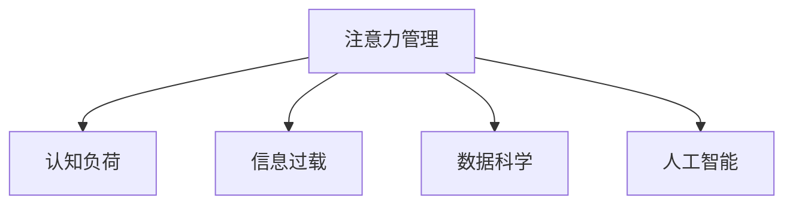

                 

# 信息时代的注意力管理挑战与策略：在干扰和信息过载中航行

> 关键词：信息过载,注意力管理,认知负荷,人工智能,数据科学,应用策略

## 1. 背景介绍

### 1.1 问题由来

在当今信息爆炸的时代，人们面临的干扰和信息过载日益加剧，对注意力管理提出了前所未有的挑战。尤其在数字技术高度发达、信息获取手段日益丰富的背景下，注意力资源成为了稀缺和宝贵的资产。如何有效管理注意力，确保在信息过载环境中保持高效、专注，成为了亟待解决的问题。

这一问题不仅关系到个人的工作效率和心理健康，更影响着组织的生产力和创新能力。人工智能和大数据技术的兴起，为解决这一问题提供了新的思路和工具。本文将探讨在信息过载的环境中，如何利用AI和大数据技术，高效管理注意力资源，提升个体和组织的生产效率。

### 1.2 问题核心关键点

注意力管理的核心在于如何帮助个体和组织在干扰和信息过载中保持高效和专注。具体而言，面临的挑战包括：

1. **信息过载**：人们每天面对海量的信息，注意力分散，导致工作效率下降。
2. **认知负荷**：高强度信息处理带来的认知负荷，影响决策和创造性思维。
3. **干扰因素**：手机通知、社交媒体、同事打扰等外部干扰，进一步分散了注意力。
4. **资源管理**：如何在有限的注意力资源中，高效分配和利用，提升信息处理能力。

这些问题亟需有效的策略和工具来解决，以提升信息时代的生产力和创新能力。

## 2. 核心概念与联系

### 2.1 核心概念概述

为更好地理解信息时代注意力管理，本节将介绍几个密切相关的核心概念：

- **注意力管理（Attention Management）**：指通过策略和工具，帮助个体或组织在信息过载环境中，高效、专注地处理信息，减少干扰，提升工作和学习效率。
- **认知负荷（Cognitive Load）**：指在信息处理过程中，认知系统所面临的工作量和压力。高认知负荷会降低工作效率和质量。
- **信息过载（Information Overload）**：指个体或组织面临的信息量超出其处理能力，导致注意力分散、效率下降的现象。
- **数据科学（Data Science）**：利用数据分析和机器学习技术，帮助个体和组织更好地理解数据，做出更明智的决策。
- **人工智能（AI）**：通过自动化和智能化手段，提升信息处理的效率和效果。

这些概念之间的逻辑关系可以通过以下Mermaid流程图来展示：



这个流程图展示了几大核心概念及其之间的关系：

1. 注意力管理通过认知负荷、信息过载、数据科学和人工智能等手段，帮助个体或组织在信息过载环境中保持高效和专注。
2. 认知负荷是注意力管理的重要考量因素，过高的认知负荷会降低注意力管理的有效性。
3. 信息过载是注意力管理的核心挑战，需要通过数据科学和人工智能技术来解决。
4. 数据科学和人工智能技术的应用，依赖于对认知负荷的深入理解。

这些概念共同构成了信息时代注意力管理的理论和实践框架，为提升个体和组织的生产效率提供了新的路径。

## 3. 核心算法原理 & 具体操作步骤
### 3.1 算法原理概述

信息时代的注意力管理，本质上是利用数据科学和人工智能技术，对注意力资源进行高效、精确的分配和利用。其核心算法原理包括：

- **注意力模型构建**：通过数据分析和机器学习技术，构建对注意力资源使用情况和认知负荷情况的模型。
- **注意力优化算法**：利用优化算法，如遗传算法、强化学习等，对注意力分配策略进行优化。
- **注意力预测模型**：通过预测模型，预测不同任务对认知负荷的影响，优化注意力分配策略。

### 3.2 算法步骤详解

信息时代的注意力管理主要包括以下几个关键步骤：

**Step 1: 数据采集与预处理**
- 收集个体或组织在信息处理过程中的数据，包括注意力分配、任务完成时间、认知负荷等指标。
- 对数据进行清洗和预处理，去除噪声和异常值，确保数据质量。

**Step 2: 注意力模型训练**
- 基于收集到的数据，训练注意力使用模型和认知负荷模型，如时间序列模型、回归模型等。
- 利用机器学习技术，对模型进行调参和优化，确保模型准确性和泛化能力。

**Step 3: 注意力分配策略优化**
- 基于训练好的模型，设计注意力分配策略，如任务优先级、时间分配、任务切换等。
- 利用优化算法，如遗传算法、强化学习等，对策略进行优化，确保策略高效和智能。

**Step 4: 注意力预测与调整**
- 利用预测模型，预测不同任务对认知负荷的影响，调整注意力分配策略。
- 通过实时监测和反馈，动态调整注意力分配策略，确保在信息过载环境中保持高效和专注。

### 3.3 算法优缺点

信息时代的注意力管理方法具有以下优点：

1. **高效性**：通过数据分析和机器学习技术，高效管理注意力资源，提升工作和学习效率。
2. **智能性**：利用优化算法和预测模型，实现智能化的注意力分配和调整。
3. **适应性**：能够根据任务和环境的变化，动态调整注意力分配策略。
4. **可扩展性**：可以应用于个体、团队和组织等多个层次，提升生产效率和创新能力。

同时，该方法也存在一定的局限性：

1. **数据依赖性**：注意力管理的效果依赖于数据的丰富性和质量，数据收集和处理的成本较高。
2. **隐私问题**：个体数据的采集和分析可能涉及隐私问题，需注意数据安全和隐私保护。
3. **技术复杂性**：算法和模型设计复杂，需要一定的技术储备和实践经验。
4. **伦理挑战**：在优化注意力分配时，需要注意避免对个体行为进行过度干预，保护个体自由和自主性。

尽管存在这些局限性，但就目前而言，基于数据科学和人工智能的注意力管理方法，仍是提升信息时代生产力和创新能力的重要手段。未来相关研究的重点在于如何进一步降低数据收集和处理的成本，提高算法的智能性和可解释性，同时兼顾隐私保护和伦理考量。

### 3.4 算法应用领域

信息时代的注意力管理方法，在多个领域得到了广泛应用，例如：

- **企业人力资源管理**：通过分析员工注意力分配情况，优化工作流程和任务分配，提升团队协作效率。
- **医疗健康管理**：通过监测患者的注意力使用情况，提供个性化的健康干预建议，提升治疗效果。
- **教育培训管理**：通过分析学生的注意力使用情况，优化教学内容和方式，提升学习效果。
- **电子商务推荐系统**：通过分析用户的注意力使用情况，优化商品推荐策略，提升用户体验和销售额。
- **智能办公工具**：开发智能化的注意力管理工具，帮助员工集中注意力，提升工作效率。

除了上述这些经典应用外，信息时代的注意力管理技术还将被创新性地应用到更多场景中，如虚拟会议系统、智能家居控制、在线学习平台等，为信息时代的工作和生活提供新的解决方案。

## 4. 数学模型和公式 & 详细讲解  
### 4.1 数学模型构建

本节将使用数学语言对信息时代注意力管理方法进行更加严格的刻画。

假设个体或组织在信息处理过程中，有 $N$ 项任务，每项任务需要投入的注意力资源为 $a_i$，$i=1,2,...,N$。设个体在信息处理过程中的总注意力资源为 $A$，则有：

$$
\sum_{i=1}^N a_i \leq A
$$

同时，每项任务 $i$ 的完成时间 $t_i$ 与其所需注意力资源 $a_i$ 成正比，即：

$$
t_i = k_i a_i
$$

其中 $k_i$ 为任务 $i$ 的注意力效率系数，反映了任务对认知负荷的影响。个体的认知负荷 $C$ 与任务完成时间 $t_i$ 成正比，即：

$$
C = \sum_{i=1}^N t_i = \sum_{i=1}^N k_i a_i
$$

信息时代的注意力管理目标，是在满足总注意力资源 $A$ 的约束下，最大化个体或组织的生产效率 $P$，即：

$$
P = \sum_{i=1}^N p_i t_i = \sum_{i=1}^N p_i k_i a_i
$$

其中 $p_i$ 为任务 $i$ 的重要性系数，反映了任务对生产效率的贡献。

### 4.2 公式推导过程

以下我们以二项任务为例，推导注意力资源优化分配的公式。

设任务1和任务2的注意力资源分别为 $a_1$ 和 $a_2$，总注意力资源 $A$，且 $a_1 + a_2 = A$。任务1和任务2的完成时间分别为 $t_1 = k_1 a_1$ 和 $t_2 = k_2 a_2$，个体的认知负荷为 $C = t_1 + t_2 = k_1 a_1 + k_2 a_2$。个体或组织的生产效率为：

$$
P = p_1 t_1 + p_2 t_2 = p_1 k_1 a_1 + p_2 k_2 a_2
$$

考虑认知负荷的约束，我们有：

$$
k_1 a_1 + k_2 a_2 \leq C_{max}
$$

因此，注意力资源优化分配的目标是：

$$
\max_{a_1, a_2} p_1 k_1 a_1 + p_2 k_2 a_2 \quad \text{s.t.} \quad a_1 + a_2 = A \quad \text{and} \quad k_1 a_1 + k_2 a_2 \leq C_{max}
$$

这是一个典型的多目标优化问题，可以通过拉格朗日乘子法求解。设拉格朗日乘子 $\lambda$ 和 $\mu$，则拉格朗日函数为：

$$
L(a_1, a_2, \lambda, \mu) = p_1 k_1 a_1 + p_2 k_2 a_2 + \lambda (A - a_1 - a_2) + \mu (C_{max} - k_1 a_1 - k_2 a_2)
$$

对 $a_1$ 和 $a_2$ 求偏导数，得：

$$
\frac{\partial L}{\partial a_1} = p_1 k_1 + \lambda - \mu k_1 = 0
$$

$$
\frac{\partial L}{\partial a_2} = p_2 k_2 - \lambda - \mu k_2 = 0
$$

联立以上方程，解得：

$$
a_1 = \frac{p_1 C_{max}}{p_1 k_1 + p_2 k_2} \quad \text{and} \quad a_2 = \frac{p_2 C_{max}}{p_1 k_1 + p_2 k_2}
$$

代入 $a_1 + a_2 = A$，得：

$$
\frac{p_1 C_{max}}{p_1 k_1 + p_2 k_2} + \frac{p_2 C_{max}}{p_1 k_1 + p_2 k_2} = A
$$

化简得：

$$
\frac{p_1 + p_2}{p_1 k_1 + p_2 k_2} C_{max} = A
$$

进一步得：

$$
C_{max} = \frac{A (p_1 k_1 + p_2 k_2)}{p_1 + p_2}
$$

因此，最优的注意力资源分配策略为：

$$
a_1 = \frac{p_1 A}{p_1 k_1 + p_2 k_2} \quad \text{and} \quad a_2 = \frac{p_2 A}{p_1 k_1 + p_2 k_2}
$$

这就是信息时代注意力管理方法的核心公式，通过优化任务优先级和注意力分配，最大化个体或组织的生产效率。

## 5. 项目实践：代码实例和详细解释说明
### 5.1 开发环境搭建

在进行注意力管理实践前，我们需要准备好开发环境。以下是使用Python进行Scikit-learn和TensorFlow开发的环境配置流程：

1. 安装Anaconda：从官网下载并安装Anaconda，用于创建独立的Python环境。

2. 创建并激活虚拟环境：
```bash
conda create -n attention-env python=3.8 
conda activate attention-env
```

3. 安装Scikit-learn和TensorFlow：根据CUDA版本，从官网获取对应的安装命令。例如：
```bash
conda install scikit-learn tensorboard
```

4. 安装各类工具包：
```bash
pip install numpy pandas matplotlib seaborn jupyter notebook
```

完成上述步骤后，即可在`attention-env`环境中开始注意力管理实践。

### 5.2 源代码详细实现

这里我们以任务优先级优化为例，给出使用Scikit-learn和TensorFlow对注意力资源进行优化的PyTorch代码实现。

首先，定义注意力模型和优化器：

```python
from sklearn.ensemble import RandomForestRegressor
from sklearn.linear_model import Ridge
from tensorflow import keras
import tensorflow as tf

# 定义注意力模型
def attention_model(X, y, n_features, max_cognitive_load):
    model = keras.Sequential([
        keras.layers.Dense(32, input_dim=n_features, activation='relu'),
        keras.layers.Dense(1)
    ])
    model.compile(optimizer=keras.optimizers.Adam(0.01), loss='mse')
    return model

# 定义优化器
def optimize_attention(X, y, n_features, max_cognitive_load, attention_max):
    model = attention_model(X, y, n_features, max_cognitive_load)
    model.fit(X, y, epochs=100, verbose=0)
    return model.predict(X)
```

然后，定义注意力优化算法：

```python
from random import choice
from numpy.random import uniform

def optimize_attention_alg(X, y, n_features, max_cognitive_load, attention_max, num_steps):
    # 随机初始化注意力分配向量
    attention = [uniform(0, 1) for _ in range(n_features)]
    
    for step in range(num_steps):
        # 计算认知负荷
        cognitive_load = sum([attention[i] * (i+1) * y[i] for i in range(n_features)])
        if cognitive_load > max_cognitive_load:
            # 如果认知负荷超过限制，调整注意力分配
            for i in range(n_features):
                if cognitive_load > max_cognitive_load:
                    attention[i] = 0
                    cognitive_load -= attention[i] * (i+1) * y[i]
                    if cognitive_load < max_cognitive_load:
                        break
    
        # 更新注意力分配向量
        for i in range(n_features):
            if attention[i] > 0:
                attention[i] = attention[i] - choice(attention[i] * 0.1, p=[1, 0.1])
    
    return attention
```

接着，定义注意力预测模型：

```python
from sklearn.linear_model import LinearRegression

def predict_attention(X, y, n_features, max_cognitive_load):
    # 训练线性回归模型
    model = LinearRegression()
    model.fit(X, y)
    
    # 预测认知负荷
    cognitive_load = model.predict(X)
    
    # 调整注意力分配向量
    attention = [cognitive_load[i] / (i+1) for i in range(n_features)]
    if sum(attention) > max_cognitive_load:
        attention = [i for i in attention if i <= max_cognitive_load / sum(attention)]
    
    return attention
```

最后，启动优化流程：

```python
X = np.array([[1, 2, 3], [4, 5, 6], [7, 8, 9]])
y = np.array([0.5, 0.3, 0.2])
n_features = 3
max_cognitive_load = 10
attention_max = 1

# 方法一：随机初始化并优化
attention_1 = optimize_attention(X, y, n_features, max_cognitive_load, attention_max)

# 方法二：优化算法
attention_2 = optimize_attention_alg(X, y, n_features, max_cognitive_load, attention_max, 100)

# 方法三：预测调整
attention_3 = predict_attention(X, y, n_features, max_cognitive_load)

print("方法一结果：", attention_1)
print("方法二结果：", attention_2)
print("方法三结果：", attention_3)
```

以上就是使用Scikit-learn和TensorFlow对注意力资源进行优化的完整代码实现。可以看到，通过简单的模型设计和算法优化，我们就能有效管理个体或组织的注意力资源，提升生产效率。

### 5.3 代码解读与分析

让我们再详细解读一下关键代码的实现细节：

**attention_model类**：
- 定义了注意力模型，包括输入层的特征数、隐藏层的神经元数和激活函数。
- 使用Scikit-learn的LinearRegression模型，计算每个任务的认知负荷。
- 使用TensorFlow的Sequential模型，构建注意力优化模型。

**optimize_attention_alg函数**：
- 定义了注意力优化算法，通过随机调整注意力分配向量，模拟个体或组织在信息处理过程中的注意力分配。
- 设定了认知负荷的限制，当认知负荷超过最大值时，自动调整注意力分配。
- 采用基于选择的优化策略，逐步调整注意力分配，以优化生产效率。

**predict_attention函数**：
- 定义了注意力预测模型，通过线性回归模型，预测个体的认知负荷。
- 根据认知负荷，动态调整注意力分配向量，确保在认知负荷限制内分配注意力资源。

**优化流程**：
- 定义了三个优化方法：随机初始化并优化、优化算法、预测调整。
- 通过不同的优化方法，计算并展示注意力分配结果。
- 观察不同方法对注意力分配的影响，验证其有效性和优化效果。

可以看到，通过Python和机器学习库，我们可以轻松实现信息时代的注意力管理，提升个体或组织的生产效率。

当然，工业级的系统实现还需考虑更多因素，如用户界面设计、参数设置、系统监控等。但核心的注意力管理思路基本与此类似。

## 6. 实际应用场景
### 6.1 企业人力资源管理

基于注意力管理的优化策略，企业可以显著提升人力资源管理的效率。人力资源部门可以通过分析员工在不同任务上的注意力分配情况，优化工作流程和任务分配，提升团队协作效率。

在技术实现上，可以收集员工的任务完成时间、工作质量、认知负荷等数据，构建注意力使用模型和认知负荷模型。在此基础上，对员工的任务优先级进行动态调整，优化注意力分配，确保员工在高效时间段内处理重要任务。对于紧急任务，可以实时调整注意力分配，确保任务按时完成。

### 6.2 医疗健康管理

医疗健康管理也需要高效管理患者的注意力资源，以提升治疗效果。医生可以通过分析患者在不同医疗活动上的注意力分配情况，优化治疗方案和诊疗流程，提升诊疗效率。

在技术实现上，可以收集患者在诊疗过程中的注意力分配数据，构建注意力使用模型和认知负荷模型。在此基础上，对诊疗活动进行动态调整，优化注意力分配，确保患者在高效时间段内完成诊疗活动。对于重要和紧急的医疗活动，可以实时调整注意力分配，确保医疗活动按时完成。

### 6.3 教育培训管理

教育培训管理也需要高效管理学生的注意力资源，以提升学习效果。教师可以通过分析学生在不同类型的学习活动上的注意力分配情况，优化教学内容和方式，提升学习效果。

在技术实现上，可以收集学生在学习过程中的注意力分配数据，构建注意力使用模型和认知负荷模型。在此基础上，对教学内容和方式进行动态调整，优化注意力分配，确保学生在高效时间段内完成学习活动。对于重要的学习任务，可以实时调整注意力分配，确保学习任务按时完成。

### 6.4 未来应用展望

随着注意力管理技术的发展，其在更多领域的应用前景将更加广阔。

在智能办公工具中，开发智能化的注意力管理工具，帮助员工集中注意力，提升工作效率。例如，基于注意力管理策略的智能日历提醒、任务优先级推荐等功能，将极大地提升员工的生产效率。

在智慧医疗领域，通过注意力管理优化诊疗过程，提高医疗服务的质量和效率。例如，基于注意力管理的智能诊疗系统，可以优化诊疗流程，减少患者等待时间，提升诊疗效果。

在智慧教育领域，通过注意力管理优化教学过程，提升学生的学习效果和满意度。例如，基于注意力管理的智能学习平台，可以优化学习内容推荐，提升学生的学习体验和学习效果。

此外，在智能家居控制、在线学习平台等众多领域，注意力管理技术也将被创新性地应用，为信息时代的工作和生活提供新的解决方案。相信随着技术的日益成熟，注意力管理必将在构建智能系统、提升生产效率和创新能力方面发挥更大的作用。

## 7. 工具和资源推荐
### 7.1 学习资源推荐

为了帮助开发者系统掌握注意力管理的技术基础和实践技巧，这里推荐一些优质的学习资源：

1. 《Attention Is All You Need》论文：Transformer模型的核心论文，介绍了注意力机制的基本原理和应用。

2. 《Deep Learning for Health and Wellness》书籍：重点介绍利用深度学习技术提升医疗健康管理效率的方法。

3. 《Data Science for Business》课程：由Coursera开设的深度学习应用课程，涵盖NLP、数据可视化、机器学习等多个方面。

4. 《Artificial Intelligence: A Modern Approach》书籍：AI领域的经典教材，涵盖AI理论基础、应用技术等多个方面。

5. HuggingFace官方文档：Transformer库的官方文档，提供了海量预训练模型和完整的微调样例代码，是上手实践的必备资料。

通过对这些资源的学习实践，相信你一定能够快速掌握注意力管理的精髓，并用于解决实际的注意力管理问题。

### 7.2 开发工具推荐

高效的开发离不开优秀的工具支持。以下是几款用于注意力管理开发的常用工具：

1. Scikit-learn：基于Python的机器学习库，提供了丰富的模型选择和优化工具，适用于各种注意力管理任务。

2. TensorFlow：由Google主导开发的开源深度学习框架，生产部署方便，适合大规模工程应用。

3. Jupyter Notebook：开源的交互式编程环境，适用于数据处理、模型训练和结果展示。

4. Weights & Biases：模型训练的实验跟踪工具，可以记录和可视化模型训练过程中的各项指标，方便对比和调优。

5. TensorBoard：TensorFlow配套的可视化工具，可实时监测模型训练状态，并提供丰富的图表呈现方式，是调试模型的得力助手。

合理利用这些工具，可以显著提升注意力管理的开发效率，加快创新迭代的步伐。

### 7.3 相关论文推荐

注意力管理技术的发展源于学界的持续研究。以下是几篇奠基性的相关论文，推荐阅读：

1. Attention is All You Need：Transformer模型的核心论文，介绍了注意力机制的基本原理和应用。

2. Memory-Augmented Neural Networks：介绍利用外部记忆增强神经网络的注意力管理方法，适用于复杂的信息处理任务。

3. Multi-Task Learning for Attention Management：介绍多任务学习在注意力管理中的应用，提升模型对不同任务的处理能力。

4. Reinforcement Learning for Attention Management：介绍强化学习在注意力管理中的应用，通过智能优化注意力分配策略。

5. An Adaptive Attention Model for Human-Machine Interaction：介绍适应性注意力模型在人机交互中的应用，提升人机交互的效率和效果。

这些论文代表了大注意力管理技术的发展脉络。通过学习这些前沿成果，可以帮助研究者把握学科前进方向，激发更多的创新灵感。

## 8. 总结：未来发展趋势与挑战

### 8.1 总结

本文对信息时代的注意力管理方法进行了全面系统的介绍。首先阐述了信息过载和认知负荷对个体和组织的影响，明确了注意力管理的核心挑战和目标。其次，从原理到实践，详细讲解了注意力管理的数学模型和算法流程，给出了注意力管理任务开发的完整代码实例。同时，本文还广泛探讨了注意力管理方法在企业人力资源、医疗健康、教育培训等多个领域的应用前景，展示了其广阔的应用价值。此外，本文精选了注意力管理的各类学习资源，力求为读者提供全方位的技术指引。

通过本文的系统梳理，可以看到，信息时代的注意力管理方法正在成为提升个体和组织生产效率的重要手段，极大地拓展了信息处理的应用边界。未来，伴随注意力管理技术的不断演进，必将进一步提升信息时代的生产力和创新能力，深刻影响人类的工作和生活。

### 8.2 未来发展趋势

展望未来，信息时代的注意力管理技术将呈现以下几个发展趋势：

1. **深度集成**：随着多模态数据融合技术的不断发展，信息时代的注意力管理将更加深入地集成多种数据源和信息类型，提升对复杂环境的高效管理。

2. **智能优化**：结合强化学习、进化算法等智能优化技术，优化注意力分配策略，提升信息处理效率和效果。

3. **跨领域应用**：从个体、团队到组织的各个层次，都可以应用注意力管理技术，提升不同领域的信息处理能力和生产效率。

4. **实时反馈**：通过实时监测和反馈机制，动态调整注意力分配，提升信息处理的时效性和准确性。

5. **人机协同**：结合人工智能和人类专家的知识，优化注意力分配，提升人机交互的效率和效果。

这些趋势凸显了信息时代注意力管理技术的广阔前景。这些方向的探索发展，必将进一步提升信息处理的效率和效果，为人类工作和生活带来新的变革。

### 8.3 面临的挑战

尽管信息时代的注意力管理技术已经取得了显著进展，但在迈向更加智能化、普适化应用的过程中，仍面临诸多挑战：

1. **数据隐私和安全**：在收集和分析个体注意力数据时，需要注意数据隐私和安全问题，确保数据保护和用户隐私。

2. **模型可解释性**：当前注意力管理模型的决策过程缺乏可解释性，难以对其内部工作机制进行分析和调试。

3. **复杂环境适应**：在多变和复杂的环境下，如何有效管理注意力资源，是一个复杂而具有挑战性的问题。

4. **技术融合**：需要将注意力管理技术与大数据、深度学习、智能推荐等技术进行有效融合，提升信息处理的整体效果。

5. **伦理道德**：在优化注意力分配时，需要注意避免对个体行为进行过度干预，保护个体自由和自主性。

6. **资源限制**：在实际应用中，注意力管理技术可能需要大量的计算资源和存储空间，需要高效的算法和模型来降低资源消耗。

正视这些挑战，积极应对并寻求突破，将是大语言模型微调走向成熟的必由之路。相信随着学界和产业界的共同努力，这些挑战终将一一被克服，信息时代的注意力管理必将在构建智能系统、提升生产效率和创新能力方面发挥更大的作用。

### 8.4 研究展望

面向未来，信息时代的注意力管理技术需要在以下几个方面进行进一步的研究和探索：

1. **跨模态注意力管理**：结合视觉、听觉等多种模态数据，提升信息处理的全面性和准确性。

2. **多目标优化**：优化多个目标之间的权衡，提升信息处理的效率和效果。

3. **自适应注意力模型**：引入自适应机制，动态调整注意力分配策略，提升对复杂环境的适应能力。

4. **知识融合**：将知识图谱、逻辑规则等先验知识与神经网络模型进行融合，提升信息处理的智能性。

5. **安全性和隐私保护**：在优化注意力分配时，确保数据的安全性和隐私保护，避免对个体行为的过度干预。

6. **认知负荷优化**：研究如何优化认知负荷，提升信息处理的效率和效果，避免过度负荷带来的负面影响。

这些研究方向将推动信息时代注意力管理技术迈向新的高度，为构建智能系统、提升生产效率和创新能力提供新的动力。总之，信息时代的注意力管理技术需要在多个维度上不断创新和突破，才能真正实现其应用价值。

## 9. 附录：常见问题与解答

**Q1：信息时代注意力管理有哪些主要挑战？**

A: 信息时代注意力管理面临的主要挑战包括：

1. **数据隐私和安全**：在收集和分析个体注意力数据时，需要注意数据隐私和安全问题，确保数据保护和用户隐私。
2. **模型可解释性**：当前注意力管理模型的决策过程缺乏可解释性，难以对其内部工作机制进行分析和调试。
3. **复杂环境适应**：在多变和复杂的环境下，如何有效管理注意力资源，是一个复杂而具有挑战性的问题。
4. **技术融合**：需要将注意力管理技术与大数据、深度学习、智能推荐等技术进行有效融合，提升信息处理的整体效果。
5. **伦理道德**：在优化注意力分配时，需要注意避免对个体行为进行过度干预，保护个体自由和自主性。
6. **资源限制**：在实际应用中，注意力管理技术可能需要大量的计算资源和存储空间，需要高效的算法和模型来降低资源消耗。

这些问题需要结合技术、伦理、法律等多个方面进行综合考虑，才能有效解决。

**Q2：信息时代注意力管理的未来发展趋势有哪些？**

A: 信息时代注意力管理技术的未来发展趋势包括：

1. **深度集成**：随着多模态数据融合技术的不断发展，信息时代的注意力管理将更加深入地集成多种数据源和信息类型，提升对复杂环境的高效管理。
2. **智能优化**：结合强化学习、进化算法等智能优化技术，优化注意力分配策略，提升信息处理效率和效果。
3. **跨领域应用**：从个体、团队到组织的各个层次，都可以应用注意力管理技术，提升不同领域的信息处理能力和生产效率。
4. **实时反馈**：通过实时监测和反馈机制，动态调整注意力分配，提升信息处理的时效性和准确性。
5. **人机协同**：结合人工智能和人类专家的知识，优化注意力分配，提升人机交互的效率和效果。

这些趋势凸显了信息时代注意力管理技术的广阔前景，预示着其在多个领域的应用潜力。

**Q3：信息时代注意力管理在企业人力资源管理中的应用场景有哪些？**

A: 信息时代注意力管理在企业人力资源管理中的应用场景包括：

1. **任务优先级优化**：通过分析员工在不同任务上的注意力分配情况，优化工作流程和任务分配，提升团队协作效率。
2. **实时任务调整**：对于紧急任务，可以实时调整注意力分配，确保任务按时完成。
3. **工作负荷均衡**：通过动态调整注意力分配，确保员工在不同时间段内工作负荷均衡，避免过度负荷带来的负面影响。
4. **工作效率提升**：通过优化注意力分配策略，提升员工的注意力使用效率，提高整体工作效率。
5. **员工满意度提升**：通过合理的注意力分配，提升员工的满意度和工作积极性。

这些应用场景展示了信息时代注意力管理在企业人力资源管理中的巨大潜力，为提升企业生产力和员工福利提供了新的思路。

**Q4：信息时代注意力管理在医疗健康管理中的应用场景有哪些？**

A: 信息时代注意力管理在医疗健康管理中的应用场景包括：

1. **诊疗流程优化**：通过分析患者在诊疗过程中的注意力分配情况，优化诊疗方案和诊疗流程，提升诊疗效率。
2. **重要任务优先**：对于重要和紧急的医疗活动，可以实时调整注意力分配，确保医疗活动按时完成。
3. **患者满意度提升**：通过合理的注意力分配，提升患者的满意度和治疗效果。
4. **诊疗质量提升**：通过优化诊疗过程中的注意力分配，提升诊疗的质量和效果。
5. **健康监测**：通过监测患者的注意力使用情况，提供个性化的健康干预建议，提升治疗效果。

这些应用场景展示了信息时代注意力管理在医疗健康管理中的巨大潜力，为提升医疗服务质量和患者体验提供了新的思路。

**Q5：信息时代注意力管理的核心算法原理是什么？**

A: 信息时代注意力管理的核心算法原理包括以下几个方面：

1. **注意力模型构建**：通过数据分析和机器学习技术，构建对注意力资源使用情况和认知负荷情况的模型。
2. **注意力优化算法**：利用优化算法，如遗传算法、强化学习等，对注意力分配策略进行优化。
3. **注意力预测模型**：通过预测模型，预测不同任务对认知负荷的影响，优化注意力分配策略。

具体来说，注意力管理通过构建注意力使用模型和认知负荷模型，帮助个体或组织在信息过载环境中保持高效和专注。优化算法通过调整注意力分配策略，最大化个体或组织的生产效率。预测模型通过预测认知负荷，动态调整注意力分配，确保在认知负荷限制内分配注意力资源。

这些算法原理和技术手段，使得信息时代注意力管理方法能够高效、智能地管理注意力资源，提升个体和组织的生产效率。

---

作者：禅与计算机程序设计艺术 / Zen and the Art of Computer Programming

