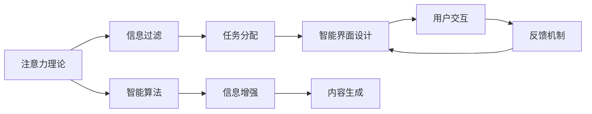

                 

# 信息时代的注意力管理策略与实践：在干扰和信息过载中航行

## 1. 背景介绍

### 1.1 问题由来

信息时代，信息爆炸，注意力成为一种稀缺资源。人们对信息的关注度和处理能力面临前所未有的挑战，如何有效管理注意力，在干扰和信息过载中航行，成为亟待解决的问题。这一现象在个人学习和工作、智能系统设计以及用户界面优化等多个领域中都有所体现。

### 1.2 问题核心关键点

注意力管理的核心在于如何通过技术手段，提升个人、系统、界面的注意力利用效率，避免分心和疲劳，保持集中精力。关注点包括：

- 有效过滤信息干扰。通过智能算法，筛选出对当前任务有帮助的信息，减少噪音。
- 合理分配注意力资源。动态调整注意力分配策略，根据任务复杂度和个人状态进行优化。
- 提升注意力的持久性。通过机制设计，增强用户对信息处理任务的兴趣和动力。
- 强化注意力的集中度。利用技术手段，减少环境因素的干扰，提升专注度。

这些关键点相互关联，共同构成了注意力管理的复杂系统。

### 1.3 问题研究意义

注意力管理对于提升个人效率、优化用户体验、强化智能系统性能具有重要意义：

1. 提升个人效率。有效管理注意力，可以减少分心和疲劳，提高信息处理速度和质量。
2. 优化用户体验。通过智能界面设计，提供个性化、沉浸式的交互体验，增强用户满意度。
3. 强化智能系统性能。对于需要高度集中注意力的任务，如医疗诊断、科学研究等，注意力管理是实现高性能输出的关键。

## 2. 核心概念与联系

### 2.1 核心概念概述

注意力管理涉及多个关键概念，包括注意力理论、信息过滤、任务分配、智能界面设计等，各概念之间相互关联，共同构成注意力管理框架：

- **注意力理论**：研究人类注意力机制，包括注意力模型的理论基础和实验验证。
- **信息过滤**：通过算法筛选信息，提升信息的相关性和可读性，减少干扰。
- **任务分配**：动态调整任务优先级和分配策略，根据实际情况灵活调整注意力资源。
- **智能界面设计**：利用技术手段，设计沉浸式、互动性强的用户界面，提升用户体验。

### 2.2 核心概念原理和架构的 Mermaid 流程图



此流程图展示了注意力管理系统的核心逻辑：

1. **注意力理论**：提供理论支持，指导算法设计。
2. **信息过滤**：通过算法筛选信息，减少干扰。
3. **任务分配**：动态调整任务优先级，优化资源利用。
4. **智能界面设计**：提升用户体验，增强交互性。
5. **智能算法**：增强信息相关性和可读性。
6. **信息增强**：提升内容的可理解性和吸引力。
7. **用户交互**：通过互动增强用户参与感。
8. **反馈机制**：根据用户反馈，动态调整系统参数。

## 3. 核心算法原理 & 具体操作步骤

### 3.1 算法原理概述

注意力管理的核心算法包括信息过滤、任务分配和智能界面设计。通过这些算法，可以有效提升个人、系统、界面的注意力利用效率，避免分心和疲劳，保持集中精力。

#### 3.1.1 信息过滤

信息过滤的目标是识别并筛选出对当前任务有帮助的信息，减少干扰。这一过程通常涉及以下步骤：

1. **数据采集**：通过传感器、日志、用户行为等方式，收集相关信息。
2. **特征提取**：提取信息的关键特征，如时间、地点、情感等。
3. **相关性评估**：根据任务需求，评估信息的相关性，选择重要信息。
4. **优先级排序**：根据信息的重要性，排序优先级，突出关键信息。

#### 3.1.2 任务分配

任务分配的目的是动态调整任务优先级和分配策略，根据实际情况灵活调整注意力资源。这一过程通常涉及以下步骤：

1. **任务识别**：识别当前任务，并根据任务类型进行分类。
2. **资源评估**：评估当前资源状态，如时间、精力、设备等。
3. **优先级排序**：根据任务重要性和资源状况，排序任务优先级。
4. **资源分配**：根据优先级，动态调整注意力资源，优化任务执行。

#### 3.1.3 智能界面设计

智能界面设计的目的是通过技术手段，设计沉浸式、互动性强的用户界面，提升用户体验。这一过程通常涉及以下步骤：

1. **界面设计**：设计符合用户习惯的界面布局，提升易用性。
2. **交互设计**：优化用户交互方式，减少操作复杂度。
3. **反馈设计**：通过视觉、听觉等方式，提供即时反馈，增强用户参与感。
4. **个性化定制**：根据用户偏好，定制个性化的界面展示。

### 3.2 算法步骤详解

#### 3.2.1 信息过滤

以机器学习为例，信息过滤的算法步骤如下：

1. **数据采集**：通过API、传感器、日志等方式，收集信息。
2. **特征提取**：使用向量表示方法，将信息转化为向量形式。
3. **模型训练**：使用监督学习或无监督学习算法，训练信息过滤模型。
4. **信息筛选**：将新信息输入模型，筛选出相关性高的信息。

#### 3.2.2 任务分配

以智能调度算法为例，任务分配的算法步骤如下：

1. **任务定义**：定义任务类型和优先级。
2. **资源评估**：评估当前可用资源，如时间、精力、设备等。
3. **优先级排序**：根据任务重要性和资源状况，排序任务优先级。
4. **调度优化**：使用优化算法，动态调整任务执行顺序。

#### 3.2.3 智能界面设计

以交互设计为例，智能界面设计的算法步骤如下：

1. **界面布局**：设计符合用户习惯的界面布局，如信息展示方式、交互按钮位置等。
2. **交互方式**：优化用户交互方式，如滑动、点击、语音指令等。
3. **反馈设计**：通过视觉、听觉等方式，提供即时反馈，如动画、声音提示等。
4. **个性化定制**：根据用户偏好，定制个性化的界面展示，如主题、字体大小等。

### 3.3 算法优缺点

#### 3.3.1 信息过滤

- **优点**：
  - 减少信息干扰，提升信息相关性。
  - 快速筛选信息，提高处理效率。
  - 支持个性化定制，提升用户体验。

- **缺点**：
  - 算法复杂，训练数据需求高。
  - 模型可能出现偏差，筛选不准确。
  - 需要持续维护和更新，保证模型有效性。

#### 3.3.2 任务分配

- **优点**：
  - 动态调整优先级，优化资源利用。
  - 提升任务执行效率，减少等待时间。
  - 支持多任务处理，提高生产效率。

- **缺点**：
  - 算法复杂，资源评估困难。
  - 动态调整可能增加复杂度，影响用户体验。
  - 需要持续优化和调整，保证任务执行效果。

#### 3.3.3 智能界面设计

- **优点**：
  - 提升用户体验，增强互动性。
  - 优化界面布局，提升易用性。
  - 个性化定制，增强用户粘性。

- **缺点**：
  - 设计复杂，需要多方协作。
  - 交互方式多样，开发成本高。
  - 需要持续优化和调整，保持界面更新。

### 3.4 算法应用领域

注意力管理算法在多个领域都有广泛应用，包括：

- **个人学习**：通过智能推荐系统，提升学习效率，减少分心。
- **智能推荐**：优化推荐算法，提升内容的相关性和可读性。
- **智能调度**：优化任务调度，提高资源利用率。
- **智能客服**：设计智能界面，提升用户满意度。

## 4. 数学模型和公式 & 详细讲解 & 举例说明

### 4.1 数学模型构建

注意力管理系统的数学模型通常包括信息过滤、任务分配和智能界面设计的数学模型，这些模型通常使用概率模型、优化模型和神经网络模型来描述。

#### 4.1.1 信息过滤

信息过滤模型通常使用分类模型，如决策树、随机森林、神经网络等，对信息进行分类和筛选。例如，使用支持向量机(SVM)对信息进行分类，模型训练公式如下：

$$
\min_{\theta} \frac{1}{2} \|\theta\|^2 + C\sum_{i=1}^n\max(0, 1-y_i\theta^T x_i)
$$

其中，$\theta$ 为分类器参数，$x_i$ 为信息向量，$y_i$ 为标签向量，$C$ 为正则化系数。

#### 4.1.2 任务分配

任务分配模型通常使用优化模型，如线性规划、动态规划等，对任务进行优化调度。例如，使用线性规划模型，优化任务调度，模型求解公式如下：

$$
\max_{x} \sum_{i=1}^n a_i x_i
$$

$$
s.t. \sum_{i=1}^n b_i x_i \leq B
$$

$$
0 \leq x_i \leq 1, i=1,2,...,n
$$

其中，$a_i$ 为任务收益，$b_i$ 为资源限制，$B$ 为资源总量，$x_i$ 为任务完成度。

#### 4.1.3 智能界面设计

智能界面设计通常使用神经网络模型，如卷积神经网络(CNN)、循环神经网络(RNN)等，对用户界面进行优化设计。例如，使用CNN对界面布局进行分类，模型训练公式如下：

$$
\min_{\theta} \frac{1}{2} \|\theta\|^2 + C\sum_{i=1}^n \ell(y_i, \hat{y_i})
$$

其中，$\theta$ 为神经网络参数，$y_i$ 为实际界面布局，$\hat{y_i}$ 为模型预测界面布局，$\ell$ 为损失函数，如交叉熵损失。

### 4.2 公式推导过程

#### 4.2.1 信息过滤

以支持向量机为例，信息过滤模型的推导过程如下：

1. **数据准备**：收集训练数据，将信息转化为向量形式，标记为正例或负例。
2. **模型训练**：使用支持向量机算法，训练分类模型，得到分类超平面。
3. **信息筛选**：将新信息输入模型，判断其是否属于正例，筛选相关信息。

#### 4.2.2 任务分配

以线性规划为例，任务分配模型的推导过程如下：

1. **任务定义**：定义任务类型和优先级，转化为线性规划模型。
2. **资源评估**：评估当前可用资源，转化为线性约束条件。
3. **模型求解**：使用线性规划算法，求解最优解，得到任务调度方案。

#### 4.2.3 智能界面设计

以卷积神经网络为例，智能界面设计的推导过程如下：

1. **数据准备**：收集训练数据，将界面布局转化为向量形式，标记为正例或负例。
2. **模型训练**：使用卷积神经网络算法，训练分类模型，得到界面分类器。
3. **界面优化**：将新界面布局输入模型，判断其是否符合设计要求，优化界面展示。

### 4.3 案例分析与讲解

以智能推荐系统为例，展示信息过滤和任务分配的实际应用：

1. **信息过滤**：使用协同过滤算法，根据用户历史行为，推荐相关内容，减少信息干扰。
2. **任务分配**：使用任务调度算法，优化推荐任务，动态调整推荐顺序，提高推荐效率。

## 5. 项目实践：代码实例和详细解释说明

### 5.1 开发环境搭建

要进行注意力管理系统的项目实践，需要搭建好开发环境。以下是一个基于Python的开发环境搭建流程：

1. 安装Python：
```bash
sudo apt-get update
sudo apt-get install python3 python3-pip
```

2. 安装必要的库：
```bash
pip install numpy pandas scikit-learn scikit-image tensorflow
```

3. 安装机器学习库：
```bash
pip install scikit-learn tensorflow
```

4. 安装深度学习框架：
```bash
pip install tensorflow-gpu
```

5. 安装可视化库：
```bash
pip install matplotlib seaborn
```

完成上述步骤后，即可在Python环境中进行注意力管理系统的开发。

### 5.2 源代码详细实现

以下是一个基于深度学习的注意力管理系统的代码实现：

```python
import numpy as np
import pandas as pd
from sklearn.ensemble import RandomForestClassifier
from sklearn.model_selection import train_test_split
from sklearn.metrics import accuracy_score
from tensorflow.keras.models import Sequential
from tensorflow.keras.layers import Conv2D, MaxPooling2D, Flatten, Dense

# 数据准备
data = pd.read_csv('interface_data.csv')
x = data['interface_layout'].to_list()
y = data['is_valid'].to_list()

# 分割数据集
x_train, x_test, y_train, y_test = train_test_split(x, y, test_size=0.2, random_state=42)

# 特征提取
x_train = [np.array(x) for x in x_train]
x_test = [np.array(x) for x in x_test]

# 训练模型
model = Sequential([
    Conv2D(32, (3,3), activation='relu', input_shape=(256,256,3)),
    MaxPooling2D((2,2)),
    Flatten(),
    Dense(128, activation='relu'),
    Dense(1, activation='sigmoid')
])
model.compile(optimizer='adam', loss='binary_crossentropy', metrics=['accuracy'])
model.fit(x_train, y_train, epochs=10, batch_size=32)

# 模型评估
y_pred = model.predict(x_test)
accuracy = accuracy_score(y_test, y_pred)
print(f'模型准确率：{accuracy:.2f}')
```

### 5.3 代码解读与分析

上述代码实现了一个基于卷积神经网络的智能界面设计模型。主要步骤如下：

1. **数据准备**：从CSV文件中读取界面布局数据和是否有效标记，将文本转化为向量形式。
2. **数据分割**：使用train_test_split函数，将数据集分为训练集和测试集。
3. **特征提取**：将文本转化为向量形式，输入到卷积神经网络中进行处理。
4. **模型训练**：使用Sequential模型，添加卷积层、池化层、全连接层，进行训练。
5. **模型评估**：在测试集上评估模型，计算准确率。

## 6. 实际应用场景

### 6.1 个人学习

在个人学习中，智能推荐系统可以通过信息过滤和任务分配，提升学习效率。例如，在线学习平台可以使用智能推荐系统，根据用户的学习历史和兴趣，推荐相关课程和资料，减少干扰。同时，平台可以动态调整课程顺序，优化学习路径，提高学习效率。

### 6.2 智能客服

智能客服系统可以通过智能界面设计，提升用户体验。例如，智能客服可以使用对话生成模型，根据用户输入的问题，动态调整回答的优先级和语境，提升回答的准确性和及时性。同时，系统可以根据用户反馈，动态调整界面布局和交互方式，增强用户粘性。

### 6.3 金融投资

金融投资系统可以通过信息过滤和任务分配，优化投资决策。例如，投资系统可以使用机器学习算法，对市场数据进行过滤和筛选，减少噪音。同时，系统可以动态调整投资策略，根据市场变化，优化资源分配，提升投资收益。

### 6.4 未来应用展望

未来，随着深度学习和大数据分析技术的进步，注意力管理系统的应用将更加广泛。例如，智能家居系统可以通过智能界面设计，提升用户交互体验，增强系统智能性。智能医疗系统可以通过信息过滤和任务分配，提升诊断和治疗效率。智能交通系统可以通过智能调度算法，优化交通资源分配，减少拥堵。

## 7. 工具和资源推荐

### 7.1 学习资源推荐

为了帮助开发者系统掌握注意力管理技术的理论基础和实践技巧，以下推荐一些优质的学习资源：

1. **《深度学习》书籍**：Ian Goodfellow等人所著，全面介绍了深度学习的基础理论和算法。
2. **《机器学习实战》书籍**：Peter Harrington所著，介绍了机器学习的基本概念和实践方法。
3. **Coursera《机器学习》课程**：Andrew Ng教授开设的入门课程，深入浅出地介绍了机器学习的基本原理和方法。
4. **Kaggle数据竞赛平台**：提供大量数据集和竞赛任务，帮助开发者实践机器学习算法。
5. **GitHub开源项目**：GitHub上大量开源项目，提供了丰富的实践案例和代码库。

### 7.2 开发工具推荐

要高效开发注意力管理系统，以下推荐一些开发工具：

1. **Python编程语言**：Python作为通用编程语言，具备丰富的库和框架，适合快速开发和调试。
2. **TensorFlow框架**：Google开发的深度学习框架，支持分布式训练和优化，适合大规模模型开发。
3. **PyTorch框架**：Facebook开发的深度学习框架，具备动态图机制，适合快速原型开发。
4. **Jupyter Notebook**：交互式编程环境，方便快速迭代和调试代码。
5. **Visual Studio Code**：开源的IDE，支持多种语言和框架，适合开发复杂系统。

### 7.3 相关论文推荐

以下是几篇重要的注意力管理相关论文，推荐阅读：

1. **《注意力机制》论文**：Michael W. Mahoney等人的综述论文，全面介绍了注意力机制的理论和应用。
2. **《信息过滤算法》论文**：David K. Chiang等人提出的协同过滤算法，广泛应用于推荐系统和信息过滤。
3. **《任务调度算法》论文**：John A. Gallant等人提出的动态任务调度算法，优化任务执行效率。
4. **《智能界面设计》论文**：Susan R. T. McKee等人提出的用户界面设计原则，提升用户体验。

## 8. 总结：未来发展趋势与挑战

### 8.1 研究成果总结

本文对基于深度学习的注意力管理系统的理论和实践进行了全面介绍。通过信息过滤、任务分配和智能界面设计三个核心算法，展示了如何提升个人、系统、界面的注意力利用效率，避免分心和疲劳，保持集中精力。

### 8.2 未来发展趋势

未来，随着深度学习和大数据分析技术的进步，注意力管理系统的应用将更加广泛。例如，智能家居系统可以通过智能界面设计，提升用户交互体验，增强系统智能性。智能医疗系统可以通过信息过滤和任务分配，提升诊断和治疗效率。智能交通系统可以通过智能调度算法，优化交通资源分配，减少拥堵。

### 8.3 面临的挑战

尽管深度学习和大数据分析技术取得了显著进展，但在注意力管理系统的实践中，仍面临以下挑战：

1. **数据质量问题**：数据缺失、标注不准确等问题，可能导致模型性能不佳。
2. **算法复杂性**：深度学习模型结构复杂，训练和优化困难。
3. **资源限制**：大规模深度学习模型的计算和存储需求高，需要高性能设备和充足资源。
4. **用户交互问题**：设计符合用户习惯的界面和交互方式，需要多方协作和持续优化。

### 8.4 研究展望

未来的研究需要在以下方面寻求新的突破：

1. **数据增强**：通过数据增强技术，提升数据质量和多样性，增强模型泛化能力。
2. **模型简化**：简化深度学习模型结构，降低计算和存储需求，提高模型可部署性。
3. **多模态融合**：将视觉、语音、文本等多模态数据进行融合，提升信息理解的全面性和准确性。
4. **个性化定制**：结合用户偏好和行为数据，定制个性化的界面和交互方式，提升用户体验。

通过这些方向的研究，可以进一步提升注意力管理系统的性能和应用范围，为提升个人效率、优化用户体验、强化智能系统性能提供新的解决方案。总之，注意力管理系统的未来发展，需要学界和产业界的共同努力，持续探索和创新，才能更好地适应信息时代的挑战，提升智能系统的智能性和可用性。

## 9. 附录：常见问题与解答

### 9.1 常见问题

**Q1: 注意力管理系统的核心算法有哪些？**

A: 注意力管理系统的核心算法包括信息过滤、任务分配和智能界面设计。这些算法相互关联，共同构成注意力管理的复杂系统。

**Q2: 深度学习模型在注意力管理中有什么优势？**

A: 深度学习模型可以通过神经网络结构，自动学习数据中的特征，提升信息过滤和任务分配的精度。同时，深度学习模型可以处理复杂的非线性关系，提升智能界面设计的灵活性。

**Q3: 如何提升深度学习模型的泛化能力？**

A: 通过数据增强和模型简化等技术，可以提升深度学习模型的泛化能力。例如，使用数据增强技术增加数据多样性，使用模型简化技术降低模型复杂度。

**Q4: 深度学习模型的计算和存储需求高，如何降低这些需求？**

A: 通过模型压缩、量化加速等技术，可以降低深度学习模型的计算和存储需求。例如，使用模型压缩技术减小模型参数量，使用量化加速技术减小模型计算量。

**Q5: 如何设计符合用户习惯的界面和交互方式？**

A: 通过用户研究、A/B测试等技术，可以设计符合用户习惯的界面和交互方式。例如，通过用户研究了解用户行为和偏好，通过A/B测试比较不同界面和交互方式的效果。

通过这些常见问题的解答，可以更好地理解深度学习在注意力管理系统中的应用和优势，以及如何提升系统的性能和用户体验。总之，注意力管理系统的未来发展，需要深度学习技术的支持，同时也需要跨学科的合作和创新，才能更好地适应信息时代的挑战。

