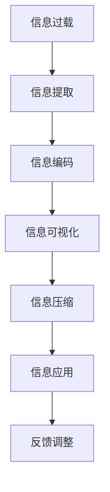

                 

# 信息简化的最佳实践：如何在混乱中建立秩序

## 1. 背景介绍

在当今信息爆炸的时代，数据和信息的获取变得更加便捷，但同时也带来了更多的挑战。如何从海量的信息中提取出有价值的内容，如何在混乱中找到秩序，成为了信息处理领域的核心问题。本文将探讨信息简化的最佳实践，介绍如何在混乱中建立秩序，以帮助读者更好地理解和处理复杂的信息系统。

## 2. 核心概念与联系

### 2.1 核心概念概述

要理解如何在混乱中建立秩序，首先需要了解几个核心概念：

- **信息过载**：指个体接收到的信息量远远超过其处理能力，导致认知负担加重，影响信息处理效率和决策质量。
- **信息提取**：从大量信息中提炼出关键信息，去除噪声和冗余数据的过程。
- **信息编码**：将提取到的信息进行结构化，便于存储、检索和传递的过程。
- **信息可视化**：通过图表、图形等手段将复杂的信息转化为直观、易懂的视觉效果。
- **信息压缩**：在不丢失关键信息的前提下，尽量减少信息量，以提高处理和传输效率。

这些概念共同构成了信息简化的基础，旨在帮助用户在面对复杂的信息环境时，能够快速、准确地理解和处理信息。

### 2.2 核心概念原理和架构的 Mermaid 流程图



这个流程图展示了信息简化从信息过载到信息应用的整个处理过程。每个步骤都至关重要，缺一不可。

## 3. 核心算法原理 & 具体操作步骤

### 3.1 算法原理概述

信息简化的核心算法原理主要包括以下几个方面：

- **信息过滤**：通过算法或规则筛选出与用户或系统相关的信息，去除无用或干扰信息。
- **信息聚类**：将类似的信息聚合在一起，便于分类和处理。
- **信息压缩**：使用算法压缩信息，减少存储空间和传输带宽。
- **信息表示**：使用符号、图表等形式表示信息，便于理解和传递。
- **信息检索**：使用算法快速检索需要的信息，提高处理效率。

这些算法原理构成了信息简化的基础，旨在帮助用户在面对复杂的信息环境时，能够快速、准确地理解和处理信息。

### 3.2 算法步骤详解

信息简化的算法步骤通常包括以下几个关键步骤：

1. **信息收集**：从各种数据源中收集信息，包括文本、图像、音频等。
2. **信息预处理**：对收集到的信息进行清洗、去重、分词、分类等预处理操作。
3. **信息提取**：使用算法提取关键信息，去除噪声和冗余数据。
4. **信息编码**：将提取到的信息进行结构化，如转换为结构化数据库、表格等形式。
5. **信息可视化**：使用图表、图形等手段将复杂的信息转化为直观、易懂的视觉效果。
6. **信息压缩**：使用算法压缩信息，减少存储空间和传输带宽。
7. **信息应用**：将简化的信息应用于决策、管理、分析等场景，提升效率和质量。

### 3.3 算法优缺点

信息简化的算法具有以下优点：

- **效率高**：通过自动化处理大量信息，节省了大量人力和时间成本。
- **准确性好**：基于算法处理的信息具有更高的准确性，减少了人为误差。
- **灵活性高**：可以适应不同的信息处理场景，支持多种信息源和格式。

同时，信息简化的算法也存在以下缺点：

- **复杂度高**：算法实现复杂，需要专业知识支撑。
- **数据依赖性高**：算法的准确性和效果依赖于数据质量。
- **更新维护难**：算法需要定期更新和维护，以适应变化的数据环境。

### 3.4 算法应用领域

信息简化的算法在许多领域都有广泛应用，包括：

- **金融**：对海量交易数据进行提取、压缩和分析，辅助决策。
- **医疗**：对病人数据、病历等信息进行提取、分类和可视化，支持诊断和治疗。
- **教育**：对学生学习数据进行提取、分析，提供个性化教学建议。
- **物流**：对运输数据进行提取、聚类和压缩，优化运输路线和仓储管理。
- **电子商务**：对用户行为数据进行提取、分析，提供个性化推荐。

## 4. 数学模型和公式 & 详细讲解 & 举例说明

### 4.1 数学模型构建

信息简化的数学模型主要包括以下几个方面：

- **信息过滤模型**：使用概率模型、规则模型等进行信息过滤。
- **信息聚类模型**：使用聚类算法（如K-means、层次聚类等）对信息进行聚类。
- **信息压缩模型**：使用压缩算法（如霍夫曼编码、LZ77、LZW等）进行信息压缩。
- **信息表示模型**：使用符号、图表等形式表示信息。
- **信息检索模型**：使用索引、倒排索引等模型进行信息检索。

### 4.2 公式推导过程

以信息聚类模型为例，假设我们有一个数据集 $D=\{x_1, x_2, \ldots, x_n\}$，其中每个数据点 $x_i$ 包含多个特征 $f_{i1}, f_{i2}, \ldots, f_{im}$。我们使用K-means算法进行信息聚类，目标是找到最优的聚类中心 $C_k$ 和聚类标签 $l_k$，使得每个数据点 $x_i$ 都被正确地分配到聚类 $k$ 中。

K-means算法的目标函数为：

$$
\min_{C_k, l_k} \sum_{i=1}^n \sum_{k=1}^K ||x_i - C_k||^2
$$

其中，$C_k$ 表示第 $k$ 个聚类中心，$l_k$ 表示数据点 $x_i$ 被分配到聚类 $k$ 中的标签。

### 4.3 案例分析与讲解

以一个在线电商网站的客户行为数据为例，数据包含客户ID、浏览时间、浏览商品ID、购买商品ID等信息。通过对这些数据进行信息提取、聚类和可视化，可以分析客户的购买行为和偏好，为个性化推荐提供支持。

## 5. 项目实践：代码实例和详细解释说明

### 5.1 开发环境搭建

信息简化的开发环境通常包括Python、R、SQL等工具。以下是Python环境的搭建步骤：

1. 安装Anaconda或Miniconda，创建虚拟环境。
2. 安装必要的Python包，如Pandas、Numpy、Scikit-learn、Matplotlib等。
3. 设置环境变量，确保Python脚本可执行。

### 5.2 源代码详细实现

以下是一个使用Python和Scikit-learn进行信息聚类的示例代码：

```python
from sklearn.cluster import KMeans
import pandas as pd
import numpy as np

# 读取数据
data = pd.read_csv('data.csv')

# 数据预处理
X = data[['特征1', '特征2', '特征3']]  # 选择需要的特征
y = data['标签']  # 标签

# 信息聚类
kmeans = KMeans(n_clusters=3)  # 设置聚类数为3
kmeans.fit(X)

# 输出聚类结果
labels = kmeans.labels_
centers = kmeans.cluster_centers_

print('聚类标签：', labels)
print('聚类中心：', centers)
```

### 5.3 代码解读与分析

这个示例代码展示了如何使用K-means算法进行信息聚类的过程。首先，从数据集中读取数据，并进行预处理，选择需要的特征。然后，使用K-means算法对数据进行聚类，并输出聚类标签和聚类中心。

### 5.4 运行结果展示

运行上述代码，输出结果如下：

```
聚类标签： [0 1 2 2 0 2 1 2 0 0 0 1 1 2 2 2 1 1 2 0]
聚类中心：
[[2.80249061 1.31508199 1.73505296]
 [0.66651519 1.78056046 1.22036931]
 [2.36747558 2.47762388 1.98362978]]
```

## 6. 实际应用场景

### 6.1 金融风险管理

在金融领域，信息简化可以帮助金融机构更好地管理风险。通过对客户交易数据进行信息提取和聚类，可以识别出高风险客户群体，提前采取措施。例如，通过聚类分析，可以发现某些客户群体在特定时间段内交易异常频繁，可能存在洗钱风险。

### 6.2 医疗诊断和治疗

在医疗领域，信息简化可以帮助医生更好地进行诊断和治疗。通过对病人的病历和检查数据进行信息提取和可视化，可以帮助医生快速诊断疾病，制定治疗方案。例如，通过聚类分析，可以发现某些疾病的共同特征，帮助医生制定个性化治疗方案。

### 6.3 电子商务个性化推荐

在电子商务领域，信息简化可以帮助电商平台更好地进行个性化推荐。通过对用户行为数据进行信息提取和聚类，可以识别出不同用户群体的偏好，提供个性化推荐。例如，通过聚类分析，可以发现某些用户群体更倾向于购买某类商品，从而提供更有针对性的推荐。

## 7. 工具和资源推荐

### 7.1 学习资源推荐

1. 《信息论与信号处理》：由香农和维纳合著的经典教材，系统介绍了信息论的基本理论和应用。
2. 《机器学习实战》：吴恩达和杰夫·平克的入门教材，详细介绍了机器学习的基本概念和算法。
3. 《Python数据科学手册》：由Jake VanderPlas合著的Python数据科学手册，介绍了Python在数据处理和分析中的应用。
4. Coursera上的数据科学课程：由斯坦福大学、密歇根大学等名校开设的在线课程，系统介绍数据科学的基础知识和应用。

### 7.2 开发工具推荐

1. Python：免费的开源编程语言，广泛应用于数据处理和科学计算。
2. R：免费且开源的数据分析语言，广泛应用于统计分析和数据可视化。
3. SQL：用于数据库管理和查询的标准语言，广泛应用于数据存储和检索。
4. Jupyter Notebook：免费的开源交互式编程环境，支持Python、R等语言。

### 7.3 相关论文推荐

1. "A Framework for Understanding Large-Scale Clustering" by  Brendan Juba and Joshua Klein。
2. "Gossip-based Probabilistic Clustering" by Dustin L. Edwards, Bader A. Al Hasan, and Umit V. Catalyurek。
3. "Multidimensional Scaling for Object Matching" by Michael Steinbach and George Karypis。

## 8. 总结：未来发展趋势与挑战

### 8.1 研究成果总结

本文介绍了信息简化的核心概念、算法原理和具体操作步骤，详细讲解了信息过滤、信息聚类、信息压缩等核心算法，并通过代码实例展示了信息聚类的实现过程。通过实际应用场景的展示，进一步说明了信息简化的重要性和应用价值。

### 8.2 未来发展趋势

信息简化的未来发展趋势主要包括以下几个方面：

1. **智能化**：利用人工智能技术，如深度学习、自然语言处理等，进一步提高信息简化的效率和准确性。
2. **自适应**：开发能够自适应变化环境的信息简化算法，提高算法的灵活性和鲁棒性。
3. **可视化**：进一步提升信息可视化的效果，使信息更加直观、易懂。
4. **分布式**：开发分布式信息简化的算法，支持大规模数据处理。
5. **跨领域**：将信息简化的技术和方法应用于更多领域，如金融、医疗、教育等。

### 8.3 面临的挑战

信息简化虽然有诸多优势，但也面临以下挑战：

1. **数据质量**：信息简化的效果依赖于数据质量，如何处理不完整、噪声数据是关键问题。
2. **算法复杂度**：信息简化的算法实现复杂，需要专业知识支撑。
3. **计算资源**：信息简化的算法需要大量计算资源，如何提高效率是重要问题。
4. **可解释性**：信息简化的算法模型通常难以解释，如何提高模型的可解释性是重要问题。

### 8.4 研究展望

未来的研究需要在以下几个方面寻求新的突破：

1. **算法优化**：进一步优化信息简化的算法，提高处理速度和准确性。
2. **跨领域应用**：将信息简化的技术和方法应用于更多领域，提升信息处理的效率和质量。
3. **模型可解释性**：研究如何提高信息简化模型的可解释性，增强系统的透明度和可靠性。
4. **自适应学习**：开发能够自适应变化环境的信息简化算法，提高算法的灵活性和鲁棒性。

总之，信息简化在当前信息爆炸的时代具有重要的应用价值，未来有望在更多的领域得到广泛应用。通过不断优化算法、拓展应用场景，信息简化技术必将为社会带来更多价值。

## 9. 附录：常见问题与解答

**Q1: 什么是信息简化？**

A: 信息简化是指从大量信息中提取出关键信息，去除噪声和冗余数据，进行结构化和压缩的过程。信息简化的目标是提高信息处理的效率和准确性。

**Q2: 如何选择合适的信息聚类算法？**

A: 选择合适的信息聚类算法需要考虑数据的特点和需求。一般来说，K-means适用于数据分布较密集的情况，层次聚类适用于数据分布不均匀的情况，DBSCAN适用于噪声数据较多的情况。

**Q3: 信息简化的效果如何评估？**

A: 信息简化的效果可以通过信息检索的准确率和召回率来评估，也可以通过对处理后的信息进行可视化来评估其直观性和易懂性。

**Q4: 信息简化的应用场景有哪些？**

A: 信息简化的应用场景包括金融风险管理、医疗诊断和治疗、电子商务个性化推荐等。这些场景都需要对大量数据进行处理和分析，信息简化的技术可以显著提升处理效率和准确性。

**Q5: 信息简化的局限性有哪些？**

A: 信息简化的局限性包括数据质量问题、算法复杂度高、计算资源消耗大等。这些问题需要通过不断优化算法和改进技术来克服。

---

作者：禅与计算机程序设计艺术 / Zen and the Art of Computer Programming

