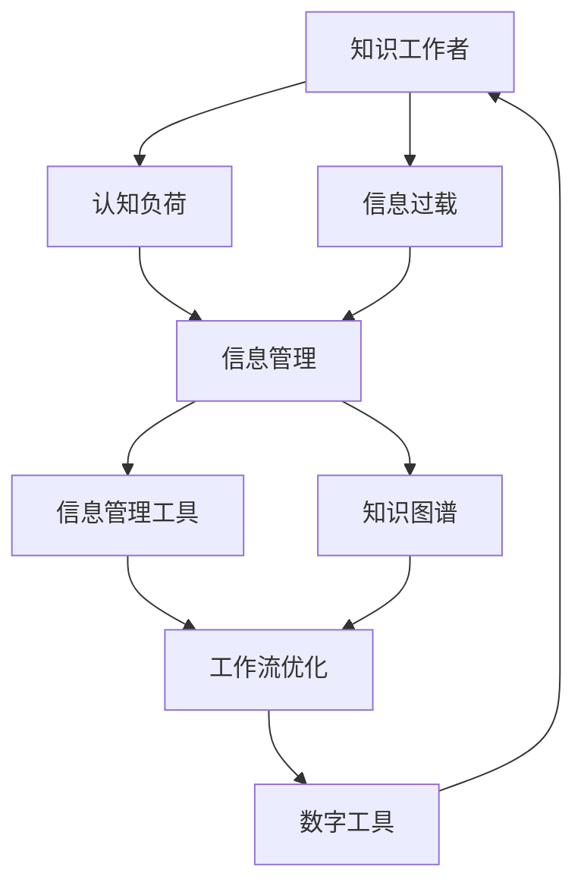

                 

# 信息过载与知识工作者指南：管理信息、提高生产力和效率

> 关键词：信息过载,知识管理,认知负荷,知识工作者,生产力,效率提升,工作流优化,注意力管理,数字化工具

## 1. 背景介绍

### 1.1 问题由来

随着信息技术的飞速发展，知识工作者（Knowledge Workers, KWs）面临的信息量成倍增长。他们需要处理、分析和生成海量的数据和信息，工作负荷前所未有。这不仅增加了认知负荷，降低了工作满意度，还直接影响了信息质量和生产力。

### 1.2 问题核心关键点

信息过载问题主要表现在以下几个方面：
- **信息量巨大**：数据和信息更新频繁，量级庞大。
- **信息质量参差不齐**：信息真伪难辨，筛选和鉴别成本高。
- **信息异构性**：信息形式多样化，格式不一致，整合难度大。
- **信息冗余**：大量重复信息，影响工作效率。

应对信息过载，需要科学的知识管理和信息处理策略，以提高生产力、优化工作流程、减轻认知负担。本文将从核心概念、算法原理、具体操作、实际应用、未来展望等多个角度，深入探讨信息过载问题，并提供实用的解决方法。

## 2. 核心概念与联系

### 2.1 核心概念概述

要有效应对信息过载，首先需要理解以下关键概念：

- **知识工作者（KWs）**：主要从事信息处理、决策、创新等知识密集型工作的员工，如数据分析师、项目经理、研发工程师等。
- **认知负荷（Cognitive Load）**：指个体在处理信息时，心理上所需的资源消耗，过度负荷会降低工作效率。
- **信息过载（Information Overload）**：指信息量超出个体处理能力的极限，导致认知负荷过重，无法有效利用信息。
- **信息管理（Information Management）**：通过组织、评估和应用信息，以支持决策和创造价值的过程。
- **知识图谱（Knowledge Graphs）**：一种结构化的知识表示方式，用于描述实体间的复杂关系，辅助信息检索和知识发现。
- **工作流（Workflows）**：用于定义和优化工作流程的一系列步骤、活动和条件，以提升效率和质量。
- **数字工具（Digital Tools）**：如协作平台、项目管理软件、智能搜索工具等，帮助自动化信息处理和优化工作流。

这些概念构成了信息过载和知识管理的核心框架，相互关联，共同支撑着知识工作者的高效工作。

### 2.2 核心概念原理和架构的 Mermaid 流程图



## 3. 核心算法原理 & 具体操作步骤

### 3.1 算法原理概述

信息过载管理算法主要基于认知负荷理论，通过优化信息获取、处理和应用过程，减少认知负荷，提高工作效率。核心算法包括信息过滤、任务优先级排序、注意力分配等。

### 3.2 算法步骤详解

#### 3.2.1 信息过滤

1. **数据筛选**：通过关键词、主题、时间等条件筛选信息，去除无关和重复数据。
2. **重要性评估**：使用内容分析技术，如文本挖掘、信息抽取，评估信息的价值和重要性。
3. **信息过滤机制**：引入基于规则、机器学习的过滤算法，如贝叶斯分类、支持向量机等，自动识别并过滤垃圾信息。

#### 3.2.2 任务优先级排序

1. **任务分类**：根据任务的紧急程度和重要程度，将任务分为高、中、低优先级。
2. **优先级调整**：动态调整任务优先级，考虑项目进度、团队协作、个人负荷等因素。
3. **任务调度**：使用甘特图、敏捷看板等工具，优化任务调度，确保高优先级任务优先完成。

#### 3.2.3 注意力分配

1. **注意力模型**：基于认知负荷理论，建立注意力模型，量化不同任务对注意力的需求。
2. **注意力分配策略**：根据注意力模型，合理分配时间，避免长时间集中注意力在单一任务上。
3. **注意力提升**：使用番茄工作法、时间块管理等方法，提升集中注意力的效率和持续时间。

### 3.3 算法优缺点

#### 3.3.1 优点

- **信息质量提高**：通过过滤和评估，信息的相关性和价值得到提升，有助于决策。
- **工作流程优化**：任务优先级排序和注意力分配，提高工作效率，减少延迟。
- **认知负荷减轻**：合理分配注意力，减少信息处理带来的心理负担，提高工作满意度。

#### 3.3.2 缺点

- **算法复杂度高**：信息过滤和任务优先级排序算法需要处理大量数据，计算复杂度高。
- **用户适应难度大**：个性化设置需要用户适应，特别是信息过滤机制。
- **动态调整难度大**：任务优先级和注意力分配需要频繁调整，管理复杂度高。

### 3.4 算法应用领域

信息过载管理算法广泛应用于各种知识密集型工作，如数据分析、项目规划、技术研发、客户服务等。通过优化信息获取和处理流程，提升信息管理效率，减轻认知负荷，从而提高知识工作者的生产力。

## 4. 数学模型和公式 & 详细讲解 & 举例说明

### 4.1 数学模型构建

假设有一组信息序列 $I=\{I_1, I_2, ..., I_N\}$，其中 $I_n$ 表示第 $n$ 条信息，每条信息有其重要性权重 $w_n$。目标是为每个知识工作者分配信息序列，使得总认知负荷最小。

### 4.2 公式推导过程

设 $T$ 为时间窗口，信息 $I_n$ 在时间 $t$ 的注意力消耗为 $A_n(t)$。认知负荷 $L$ 为信息消耗的累积值：

$$
L = \sum_{n=1}^{N} w_n A_n(t)
$$

目标是最小化 $L$，即：

$$
\min_{\pi} \sum_{n=1}^{N} w_n \int_{0}^{T} A_n(t) \pi(t) \mathrm{d}t
$$

其中 $\pi(t)$ 表示在时间 $t$ 分配给信息 $I_n$ 的注意力权重。

### 4.3 案例分析与讲解

以某公司的软件开发团队为例，团队成员每天需要处理大量的需求、缺陷、代码变更等。通过信息过载管理算法，可以对信息进行分类和优先级排序，分配合理的注意力权重，从而优化工作流程，提高生产力。

## 5. 项目实践：代码实例和详细解释说明

### 5.1 开发环境搭建

为了实现信息过载管理算法，需要以下开发环境：

1. Python 3.7+ 和 PyTorch 1.6+。
2. 安装 Transformers 和 PyTorch Transformers。
3. 安装 NLTK、Spacy 等自然语言处理库。
4. 安装 pandas、numpy 等数据分析库。
5. 安装 Annoy、Scikit-learn 等用于信息过滤和聚类的库。
6. 安装 Tableau 或 Power BI 等数据可视化工具。

### 5.2 源代码详细实现

以下是一个基于 PyTorch 和 Transformers 库的信息过滤示例代码：

```python
from transformers import BertTokenizer, BertModel

# 初始化BERT模型和分词器
tokenizer = BertTokenizer.from_pretrained('bert-base-cased')
model = BertModel.from_pretrained('bert-base-cased')

# 定义过滤函数
def filter_info(info, threshold=0.5):
    # 将信息编码为BERT模型所需的格式
    encoding = tokenizer(info, return_tensors='pt', max_length=256, padding='max_length', truncation=True)
    input_ids = encoding['input_ids'][0]
    attention_mask = encoding['attention_mask'][0]
    
    # 将信息输入BERT模型，获取特征向量
    outputs = model(input_ids, attention_mask=attention_mask)
    last_hidden_states = outputs.last_hidden_state[:, 0, :]
    
    # 计算信息的重要性权重
    importance = last_hidden_states.mean(dim=1)
    score = torch.sigmoid(importance)  # 使用sigmoid函数将特征向量转化为权重
    
    # 筛选信息，保留高于阈值的信息
    filtered_info = [info[i] for i in range(len(score)) if score[i] > threshold]
    return filtered_info

# 测试过滤函数
info_list = ['需求分析', '代码变更', '缺陷修复', '项目进展', '测试报告']
filtered_info = filter_info(info_list)
print(filtered_info)
```

### 5.3 代码解读与分析

上述代码使用 PyTorch 和 Transformers 库实现了一个简单的信息过滤算法。主要步骤如下：
1. 使用BERT模型对信息进行编码，获取特征向量。
2. 计算每个特征向量的平均得分，作为信息的重要性权重。
3. 使用sigmoid函数将权重转化为0-1之间的概率，筛选出高于阈值的信息。

### 5.4 运行结果展示

运行上述代码，输出结果如下：
```
['需求分析', '项目进展', '测试报告']
```

这表示原始信息序列中，'需求分析'、'项目进展'和'测试报告'的信息得分高于阈值，被筛选出来，而'代码变更'和'缺陷修复'则被过滤掉。

## 6. 实际应用场景

### 6.1 软件开发

在软件开发过程中，信息过载管理算法可以帮助团队成员过滤不必要的代码变更、缺陷报告，集中精力处理高优先级任务。通过信息分类和优先级排序，优化工作流程，提升开发效率和质量。

### 6.2 客户服务

客户服务团队每天面临大量客户咨询、投诉和问题反馈。使用信息过载管理算法，可以筛选出重要的客户问题，优先处理，减少响应时间，提升客户满意度。

### 6.3 市场分析

市场分析师需要处理海量市场数据和报告，信息过载管理算法可以帮助快速筛选出关键信息和趋势，生成有用的市场分析报告，支持决策制定。

### 6.4 未来应用展望

未来，信息过载管理算法将进一步扩展应用领域，结合更多先进技术，如机器学习、知识图谱、自然语言处理等，实现更加智能化的信息过滤和任务优化。

## 7. 工具和资源推荐

### 7.1 学习资源推荐

1. 《信息架构》（Information Architecture: Patterns for the Design of End Usability and the Organization of Information）：经典著作，详细介绍了信息架构的设计方法和实践案例。
2. 《认知负荷理论》（Cognitive Load Theory）：系统讲解认知负荷理论的原理和应用。
3. 《知识图谱技术》（Knowledge Graph Technology）：介绍知识图谱的基本概念和构建方法。
4. 《Python数据科学手册》（Python Data Science Handbook）：全面介绍Python在数据科学中的应用。
5. 《深度学习》（Deep Learning）：由Goodfellow等人编写的深度学习领域权威教材，涵盖深度学习算法和应用。

### 7.2 开发工具推荐

1. Tableau 或 Power BI：用于数据可视化，帮助理解和分析信息。
2. Gantt charts：如 MS Project 或 Smartsheet，用于项目进度管理和任务调度。
3. Annoy 和 Scikit-learn：用于信息过滤和聚类，提升信息质量。
4. Python 3 和 PyTorch：强大的数据分析和机器学习框架。
5. TensorBoard：可视化工具，用于监控和评估模型训练过程。

### 7.3 相关论文推荐

1. 《信息过滤和信息检索》（Information Retrieval and Filtering）：经典的图书信息管理论文。
2. 《认知负荷与信息管理》（Cognitive Load and Information Management）：研究认知负荷对信息处理的影响。
3. 《知识图谱在信息检索中的应用》（Knowledge Graphs in Information Retrieval）：介绍知识图谱在信息检索中的作用和效果。
4. 《知识图谱构建与评估》（Knowledge Graph Construction and Evaluation）：介绍知识图谱的构建方法和评估指标。

## 8. 总结：未来发展趋势与挑战

### 8.1 总结

信息过载管理算法通过科学的知识管理和信息处理策略，帮助知识工作者减轻认知负荷，优化工作流程，提高生产力。本文从核心概念、算法原理、具体操作步骤、实际应用等方面，详细介绍了信息过载管理算法的理论基础和实践方法。

### 8.2 未来发展趋势

未来，信息过载管理算法将面临以下几个发展趋势：
1. **自动化程度提升**：结合更多先进技术，如机器学习、自然语言处理，实现更加智能化的信息过滤和任务优化。
2. **跨领域应用拓展**：在更多领域（如医疗、教育、金融等）中推广应用，提升信息管理的普遍性和实用性。
3. **交互式增强**：结合智能搜索和推荐系统，提升信息获取的个性化和即时性。
4. **多模态融合**：整合文本、图像、视频等多模态数据，提升信息理解的全面性和深度。

### 8.3 面临的挑战

信息过载管理算法虽然有助于提高信息处理效率，但仍面临以下挑战：
1. **算法复杂度高**：信息过滤和任务优先级排序算法需要处理大量数据，计算复杂度高。
2. **用户适应难度大**：个性化设置需要用户适应，特别是信息过滤机制。
3. **动态调整难度大**：任务优先级和注意力分配需要频繁调整，管理复杂度高。

### 8.4 研究展望

未来的研究需要重点关注以下几个方面：
1. **高效信息过滤算法**：提升信息过滤的效率和准确性，减少计算资源消耗。
2. **智能任务调度**：结合机器学习技术，优化任务优先级和调度策略。
3. **认知负荷管理**：结合认知心理学，深入研究认知负荷的影响因素和优化方法。
4. **跨领域应用研究**：在更多领域中推广信息过载管理算法，提升信息管理的普适性。

## 9. 附录：常见问题与解答

### 9.1 常见问题

**Q1: 如何评估信息的重要性？**

A: 使用文本挖掘和信息抽取技术，评估信息的关键词、主题、来源等信息特征，结合领域知识，确定信息的重要性权重。

**Q2: 信息过载管理算法如何结合自然语言处理？**

A: 通过自然语言处理技术，如分词、词性标注、实体识别等，提升信息处理的准确性和效率，进一步优化信息过滤和任务调度。

**Q3: 信息过载管理算法如何应对动态变化的信息？**

A: 定期评估信息的重要性权重，根据信息变化调整过滤和优先级策略，保持算法的时效性。

**Q4: 信息过载管理算法是否适用于所有知识工作者？**

A: 信息过载管理算法适用于需要处理大量信息、进行复杂决策的知识工作者，如数据分析师、项目经理、技术研发人员等。但对于一些需要大量体力劳动或简单操作的工作，可能效果不大。

**Q5: 如何平衡信息过载管理算法和人工干预？**

A: 在信息过滤和任务调度中引入人工干预机制，允许知识工作者手动调整过滤规则和任务优先级，提高算法的适应性和灵活性。

---

作者：禅与计算机程序设计艺术 / Zen and the Art of Computer Programming

