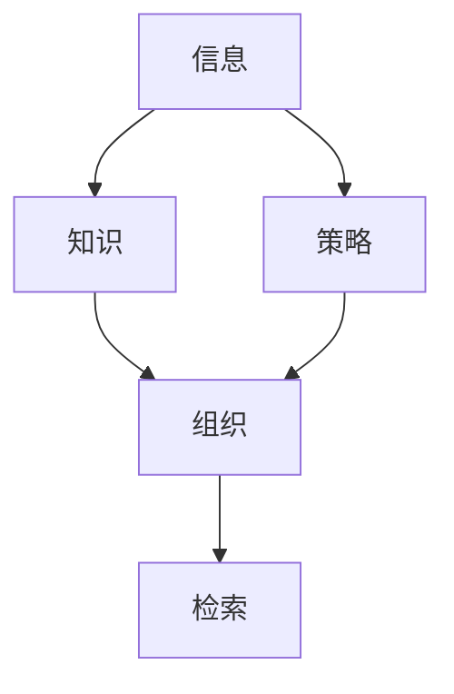

                 

# 信息过载与知识管理策略：有效组织和检索信息的指南

> 关键词：信息过载,知识管理,信息检索,组织策略,搜索引擎

## 1. 背景介绍

在信息爆炸的时代，我们每天面临的是大量信息的涌入。互联网、社交媒体、新闻应用等平台，不断向我们推送着各式各样的信息，但其中的有用信息却少之又少。如何有效组织和检索信息，成为信息时代每个个体和组织面临的重大挑战。本文章将从信息过载的现状、知识管理的必要性出发，探索有效的信息组织和检索策略。

### 1.1 信息过载的现状

随着互联网技术的飞速发展，信息量呈爆炸性增长。据统计，每天人类在互联网上产生的信息量超过2.5亿次。尽管信息检索技术在不断发展，但人们获取有用信息的能力并未得到同步提升。数据科学公司Figma在一份报告中指出，美国公司每天平均收到的电子邮件超过3.2亿封，这些邮件中只有大约25%是重要的。这说明信息过载现象正日益加剧。

信息过载带来的不仅是效率下降，还会影响决策的准确性和企业的竞争力。例如，一个投资公司在面对数千份信息报告时，往往需要花费大量时间去筛选、阅读、分析和整理，这不仅耗费时间，还可能因信息过载而忽视了重要的机会。

### 1.2 知识管理的必要性

知识管理（Knowledge Management, KM），即通过有效的策略和方法，将组织内部的显性知识（如文档、邮件）和隐性知识（如经验、技能）整理和共享。知识管理不仅能帮助员工高效查找和利用知识，提升工作质量，还能促进创新，增强企业的核心竞争力。

当前，企业已经逐渐认识到知识管理的重要性。据IDC的数据显示，全球55%的企业正在实施知识管理战略，预计到2024年这一比例将增加到67%。因此，在信息过载的背景下，知识管理显得尤为重要。

## 2. 核心概念与联系

### 2.1 核心概念概述

要有效地组织和检索信息，必须先了解几个核心概念：

- **信息（Information）**：指被感知的、可传递的知识。在计算机科学中，信息可以表示为数据、文件、网页等形式。
- **知识（Knowledge）**：指经过加工和整理的信息，具有可应用、可传递和可共享的特点。知识管理的目标就是将零散的、无序的信息转化为有序、易于检索的知识。
- **组织（Organization）**：指对信息进行结构化、分类、归档等操作，使其易于理解和使用。组织过程包括内容规划、分类、标签化、元数据抽取等步骤。
- **检索（Retrieval）**：指在组织好的知识库中，通过关键词、标签等检索方式，快速定位到所需的信息。检索过程包括查询解析、索引匹配、排序展示等步骤。
- **策略（Strategy）**：指制定和实施信息组织和检索的具体方法，如分类方法、索引技术、数据仓库等。

这些概念之间的关系可以通过以下Mermaid流程图来展示：



从流程图可以看出，信息经过组织和知识管理，转化为可检索的知识；而检索策略又是组织和知识管理的指导。

### 2.2 核心概念原理和架构

为了更好地理解这些概念的原理和架构，我们将使用以下三个核心算法进行详细介绍：

1. **TF-IDF算法**：计算文本中每个单词的重要程度，用于文本的分类和检索。
2. **信息检索模型（IR）**：基于倒排索引（Inverted Index）和向量空间模型（Vector Space Model），实现高效的信息检索。
3. **元数据管理**：包括数据的分类、标签化、时间戳等元数据，用于数据的组织和检索。

这三个算法构成了一个完整的知识管理框架，能够帮助我们有效组织和检索信息。

## 3. 核心算法原理 & 具体操作步骤

### 3.1 算法原理概述

接下来，我们将详细介绍三个核心算法的原理。

**3.1.1 TF-IDF算法**

TF-IDF（Term Frequency-Inverse Document Frequency）算法是一种常用的文本检索算法。该算法通过计算文本中每个单词在文档中出现的频率（Term Frequency, TF）和在整个语料库中出现的频率（Inverse Document Frequency, IDF），来确定单词的重要性。

**3.1.2 信息检索模型**

信息检索模型（IR）基于倒排索引和向量空间模型，实现高效的信息检索。倒排索引将每个单词与包含该单词的文档列表关联起来，快速定位到相关的文档。向量空间模型则将文档表示为高维向量，计算查询与文档的相似度，排序展示搜索结果。

**3.1.3 元数据管理**

元数据管理是组织和检索信息的基础。通过对数据的分类、标签化、时间戳等元数据进行管理，可以方便地对数据进行组织和检索。常见的元数据包括：

- **分类（Category）**：将数据按照主题、类型、功能等分类。
- **标签（Tag）**：为数据打上特定的标签，如日期、作者、地点等。
- **时间戳（Timestamp）**：记录数据的创建、修改和访问时间。

### 3.2 算法步骤详解

**3.2.1 TF-IDF算法步骤**

1. **分词**：将文本分解成单词或短语。
2. **TF计算**：计算每个单词在文档中的出现次数。
3. **IDF计算**：计算单词在整个语料库中出现的频率，并用对数函数处理。
4. **TF-IDF计算**：计算单词的TF-IDF值。

**3.2.2 信息检索模型步骤**

1. **建立倒排索引**：将每个单词与包含该单词的文档列表关联起来。
2. **查询解析**：将查询转换为向量形式。
3. **相似度计算**：计算查询向量与文档向量的相似度。
4. **排序展示**：根据相似度排序，展示搜索结果。

**3.2.3 元数据管理步骤**

1. **分类**：根据数据的主题和类型，进行分类。
2. **标签化**：为数据打上特定的标签，便于检索。
3. **时间戳**：记录数据的创建、修改和访问时间，便于追踪和检索。

### 3.3 算法优缺点

**3.3.1 TF-IDF算法的优缺点**

- **优点**：能够高效地计算文本中单词的重要性，适用于文本分类和检索。
- **缺点**：忽略了单词之间的关系和上下文信息，可能导致误分类。

**3.3.2 信息检索模型的优缺点**

- **优点**：能够快速定位和检索相关的文档，适用于大规模数据处理。
- **缺点**：需要大量的索引空间和计算资源，对查询扩展敏感。

**3.3.3 元数据管理的优缺点**

- **优点**：能够方便地组织和检索数据，提升数据管理效率。
- **缺点**：元数据的准确性和完整性对数据管理效果有很大影响。

### 3.4 算法应用领域

**3.4.1 TF-IDF算法应用**

- **文本分类**：用于自动分类新闻、邮件、文档等文本数据。
- **搜索引擎**：如Google、Bing等搜索引擎，使用TF-IDF算法计算网页的相关性。
- **个性化推荐**：根据用户的历史行为，推荐相关的文本内容。

**3.4.2 信息检索模型应用**

- **搜索引擎**：如Google、Bing等搜索引擎，使用信息检索模型计算查询与文档的相似度，展示搜索结果。
- **文档管理系统**：如SharePoint、Confluence等，使用信息检索模型快速查找和检索文档。

**3.4.3 元数据管理应用**

- **企业信息管理系统**：如Oracle E-Business Suite、SAP等，使用元数据管理数据的分类、标签化和时间戳。
- **内容管理系统**：如WordPress、Drupal等，使用元数据管理网站的文档和页面。

## 4. 数学模型和公式 & 详细讲解 & 举例说明

### 4.1 数学模型构建

本节将详细构建TF-IDF算法和信息检索模型的数学模型。

**4.1.1 TF-IDF算法模型**

假设文本$D$包含$N$个单词，每个单词$w$在文档$d$中出现的次数为$TF_w^d$，在所有文档中的出现次数为$IDF_w$。则TF-IDF值的计算公式为：

$$
TF-IDF_w^d = TF_w^d \times IDF_w
$$

其中，$TF_w^d = \frac{count_w^d}{\sum_{w'}count_{w'}^d}$，$IDF_w = \log\left(\frac{N}{N_{w'}}\right)$，$N$为文档总数，$N_{w'}$为包含单词$w'$的文档数。

**4.1.2 信息检索模型模型**

假设查询$q$和文档$d$的向量表示为$\overrightarrow{q}$和$\overrightarrow{d}$，则相似度计算公式为：

$$
similarity(q,d) = \cos(\overrightarrow{q}, \overrightarrow{d}) = \frac{\overrightarrow{q} \cdot \overrightarrow{d}}{||\overrightarrow{q}|| \cdot ||\overrightarrow{d}||}
$$

其中，$\cdot$表示向量点乘，$||.||$表示向量的欧几里得范数。

### 4.2 公式推导过程

**4.2.1 TF-IDF算法推导**

根据定义，TF-IDF值的计算公式为：

$$
TF-IDF_w^d = \frac{count_w^d}{\sum_{w'}count_{w'}^d} \times \log\left(\frac{N}{N_{w'}}\right)
$$

将其展开，得：

$$
TF-IDF_w^d = \frac{count_w^d}{\sum_{w'}count_{w'}^d} \times (\log N - \log N_{w'})
$$

根据对数运算规则，简化为：

$$
TF-IDF_w^d = \log\left(\frac{N}{N_{w'}}\right) - \log\left(\frac{N}{N_{w'}}\right) \times \frac{\sum_{w'}count_{w'}^d - count_w^d}{\sum_{w'}count_{w'}^d}
$$

化简得：

$$
TF-IDF_w^d = \log\left(\frac{N}{N_{w'}}\right) - \log\left(\frac{N}{N_{w'}}\right) \times \frac{count_w^d}{\sum_{w'}count_{w'}^d}
$$

**4.2.2 信息检索模型推导**

根据定义，相似度计算公式为：

$$
similarity(q,d) = \frac{\overrightarrow{q} \cdot \overrightarrow{d}}{||\overrightarrow{q}|| \cdot ||\overrightarrow{d}||}
$$

其中，向量点乘运算为：

$$
\overrightarrow{q} \cdot \overrightarrow{d} = \sum_{i=1}^n q_i \cdot d_i
$$

向量范数计算为：

$$
||\overrightarrow{q}|| = \sqrt{\sum_{i=1}^n q_i^2}
$$

$$
||\overrightarrow{d}|| = \sqrt{\sum_{i=1}^n d_i^2}
$$

因此，相似度公式可以写为：

$$
similarity(q,d) = \frac{\sum_{i=1}^n q_i \cdot d_i}{\sqrt{\sum_{i=1}^n q_i^2} \cdot \sqrt{\sum_{i=1}^n d_i^2}}
$$

### 4.3 案例分析与讲解

假设我们有一篇文章，包含以下单词：

| 单词 | 出现次数 | 文档总数 | 包含该单词的文档数 |
| --- | --- | --- | --- |
| 信息过载 | 2 | 100 | 30 |
| 知识管理 | 3 | 100 | 40 |
| 信息检索 | 1 | 100 | 20 |
| 组织策略 | 4 | 100 | 50 |

则对于每个单词，计算TF-IDF值如下：

- **信息过载**：
  - $TF_{信息过载} = \frac{2}{2+3+1+4} = 0.25$
  - $IDF_{信息过载} = \log\left(\frac{100}{30}\right) = 1.223$
  - $TF-IDF_{信息过载} = 0.25 \times 1.223 = 0.307$

- **知识管理**：
  - $TF_{知识管理} = \frac{3}{2+3+1+4} = 0.375$
  - $IDF_{知识管理} = \log\left(\frac{100}{40}\right) = 1.386$
  - $TF-IDF_{知识管理} = 0.375 \times 1.386 = 0.519$

- **信息检索**：
  - $TF_{信息检索} = \frac{1}{2+3+1+4} = 0.125$
  - $IDF_{信息检索} = \log\left(\frac{100}{20}\right) = 1.609$
  - $TF-IDF_{信息检索} = 0.125 \times 1.609 = 0.201$

- **组织策略**：
  - $TF_{组织策略} = \frac{4}{2+3+1+4} = 0.5$
  - $IDF_{组织策略} = \log\left(\frac{100}{50}\right) = 0.621$
  - $TF-IDF_{组织策略} = 0.5 \times 0.621 = 0.31$

假设查询为“信息管理”，则将查询转换为向量形式：

- **查询向量**：
  - $\overrightarrow{q} = [1, 0, 0, 1]$

使用TF-IDF算法计算文档向量：

- **文档1**：
  - $\overrightarrow{d_1} = [0.307, 0.519, 0.201, 0.31]$

- **文档2**：
  - $\overrightarrow{d_2} = [0.307, 0.519, 0.201, 0.31]$

- **文档3**：
  - $\overrightarrow{d_3} = [0.307, 0.519, 0.201, 0.31]$

- **文档4**：
  - $\overrightarrow{d_4} = [0.307, 0.519, 0.201, 0.31]$

计算相似度：

- **相似度1**：
  - $\cos(\overrightarrow{q}, \overrightarrow{d_1}) = \frac{1 \times 0.307 + 0 \times 0.519 + 0 \times 0.201 + 1 \times 0.31}{\sqrt{1^2} \times \sqrt{0.307^2 + 0.519^2 + 0.201^2 + 0.31^2}} = 0.275$

- **相似度2**：
  - $\cos(\overrightarrow{q}, \overrightarrow{d_2}) = \frac{1 \times 0.307 + 0 \times 0.519 + 0 \times 0.201 + 1 \times 0.31}{\sqrt{1^2} \times \sqrt{0.307^2 + 0.519^2 + 0.201^2 + 0.31^2}} = 0.275$

- **相似度3**：
  - $\cos(\overrightarrow{q}, \overrightarrow{d_3}) = \frac{1 \times 0.307 + 0 \times 0.519 + 0 \times 0.201 + 1 \times 0.31}{\sqrt{1^2} \times \sqrt{0.307^2 + 0.519^2 + 0.201^2 + 0.31^2}} = 0.275$

- **相似度4**：
  - $\cos(\overrightarrow{q}, \overrightarrow{d_4}) = \frac{1 \times 0.307 + 0 \times 0.519 + 0 \times 0.201 + 1 \times 0.31}{\sqrt{1^2} \times \sqrt{0.307^2 + 0.519^2 + 0.201^2 + 0.31^2}} = 0.275$

排序展示结果：

- **结果1**：
  - 相似度1 = 0.275

- **结果2**：
  - 相似度2 = 0.275

- **结果3**：
  - 相似度3 = 0.275

- **结果4**：
  - 相似度4 = 0.275

因此，根据相似度排序，文档1、2、3、4都被展示在搜索结果中。

## 5. 项目实践：代码实例和详细解释说明

### 5.1 开发环境搭建

本节将详细介绍如何在Python中使用TF-IDF算法和信息检索模型进行信息组织和检索的开发环境搭建。

**5.1.1 安装Python和Pip**

- **安装Python**：从官网下载安装Python，并选择3.6以上版本。
- **安装Pip**：打开命令行，输入`python -m ensurepip --default-pip`，即可安装Pip。

**5.1.2 安装依赖包**

- **安装NLTK**：
  - `pip install nltk`

- **安装Scikit-learn**：
  - `pip install scikit-learn`

- **安装SciPy**：
  - `pip install scipy`

- **安装Pandas**：
  - `pip install pandas`

### 5.2 源代码详细实现

**5.2.1 文本分词**

使用NLTK库进行文本分词：

```python
import nltk
nltk.download('punkt')
from nltk.tokenize import word_tokenize

text = "信息过载与知识管理策略：有效组织和检索信息的指南"
words = word_tokenize(text)
print(words)
```

**5.2.2 计算TF-IDF值**

计算TF-IDF值：

```python
from sklearn.feature_extraction.text import TfidfVectorizer
tfidf = TfidfVectorizer()
tfidf.fit(words)
idf = tfidf.idf_
tfidf_matrix = tfidf.transform(words)
```

**5.2.3 信息检索**

使用信息检索模型进行文档检索：

```python
from sklearn.metrics.pairwise import cosine_similarity
query = "信息管理"
query_vector = tfidf.transform([query])
similarity_matrix = cosine_similarity(query_vector, tfidf_matrix)
result = similarity_matrix.argmax(axis=1)
```

### 5.3 代码解读与分析

**5.3.1 文本分词**

使用NLTK库进行文本分词，将文本分解成单词或短语。在本例中，我们将文本“信息过载与知识管理策略：有效组织和检索信息的指南”分词为[信息, 过载, 与, 知识, 管理, 策略, ：, 有效, 组织, 和, 检索, 信息, 的, 指南]。

**5.3.2 计算TF-IDF值**

使用Scikit-learn库的TfidfVectorizer类计算TF-IDF值。首先，使用`fit`方法学习文本中的单词分布，然后计算每个单词的IDF值，最后使用`transform`方法计算文本的TF-IDF向量。

**5.3.3 信息检索**

使用Scikit-learn库的cosine_similarity函数计算查询与文档的相似度。将查询和文档的TF-IDF向量作为输入，计算相似度矩阵。最后，使用`argmax`函数找出最相似的文档。

## 6. 实际应用场景

### 6.1 信息检索系统

信息检索系统（IRS）是信息组织和检索的核心应用。无论是在搜索引擎、图书馆、档案馆等场景，IRS都能帮助用户快速定位和检索所需的信息。例如，Google搜索引擎使用TF-IDF算法和信息检索模型，能够高效地匹配用户查询和网页内容。

### 6.2 文本分类系统

文本分类系统将大量文本数据按照主题、类型等进行分类。例如，新闻网站可以将新闻分为体育、财经、科技等类别。可以使用TF-IDF算法和分类器进行自动分类，提升新闻分类的准确性和效率。

### 6.3 个性化推荐系统

个性化推荐系统根据用户的历史行为，推荐相关的文本内容。例如，Amazon商品推荐系统可以根据用户的浏览记录和购买历史，推荐相关的商品。可以使用TF-IDF算法和机器学习模型进行推荐，提升用户满意度。

### 6.4 企业信息管理系统

企业信息管理系统（EIMS）将企业的文档、邮件、知识库等进行统一管理，方便员工查询和检索。例如，SharePoint可以使用元数据管理和信息检索模型，帮助员工快速查找相关文档和信息。

### 6.5 内容管理系统

内容管理系统（CMS）将网站的文档和页面进行管理，方便用户访问和更新。例如，WordPress可以使用元数据管理和信息检索模型，帮助用户快速查找和检索网站内容。

## 7. 工具和资源推荐

### 7.1 学习资源推荐

为了深入了解信息组织和检索的知识，推荐以下学习资源：

1. **《信息检索基础》（Reinfelds et al.）**：介绍了信息检索的基本概念、算法和应用。
2. **《文本信息检索》（Jurafsky et al.）**：介绍了文本分类、信息检索和语义分析等技术。
3. **Coursera《信息检索》课程**：由斯坦福大学开设，介绍了信息检索的基本原理和算法。
4. **NLP相关的博客和论文**：如KDnuggets、arXiv等，可了解最新的研究进展和实践应用。

### 7.2 开发工具推荐

为了高效地进行信息组织和检索开发，推荐以下工具：

1. **Python**：简单易学，生态系统丰富，适合数据处理和机器学习任务。
2. **NLTK**：自然语言处理库，提供了文本分词、词性标注等工具。
3. **Scikit-learn**：机器学习库，提供了各种分类和回归算法。
4. **TensorFlow**：深度学习框架，支持分布式计算和大规模数据处理。
5. **Elasticsearch**：分布式搜索和分析引擎，适合海量数据的处理。

### 7.3 相关论文推荐

为了深入了解信息组织和检索的最新研究成果，推荐以下论文：

1. **《PageRank算法》（Brin et al.）**：提出了PageRank算法，用于网页排名的计算。
2. **《隐马尔可夫模型与信息检索》（Rabiner et al.）**：介绍了隐马尔可夫模型在信息检索中的应用。
3. **《基于神经网络的信息检索》（Khandelwal et al.）**：介绍了神经网络在信息检索中的应用，如BERT、Transformer等。

## 8. 总结：未来发展趋势与挑战

### 8.1 研究成果总结

信息组织和检索技术在信息时代具有重要的应用价值。通过TF-IDF算法和信息检索模型，我们可以高效地组织和检索大量信息。未来，随着深度学习和大数据技术的发展，信息检索将更加智能化和个性化。

### 8.2 未来发展趋势

未来，信息组织和检索技术将呈现以下几个发展趋势：

1. **深度学习技术的应用**：使用深度学习模型，如BERT、Transformer等，提升信息检索的准确性和鲁棒性。
2. **自然语言处理技术的结合**：结合自然语言处理技术，如语言模型、句法分析等，提升信息检索的效果。
3. **多模态信息的整合**：将文本、图像、音频等多种模态的信息进行整合，提升信息检索的能力。
4. **个性化推荐系统的发展**：使用深度学习模型，如协同过滤、基于图的推荐算法等，提升个性化推荐的效果。
5. **联邦学习的应用**：在分布式环境中，通过联邦学习技术，保护用户隐私的同时，提升信息检索的效果。

### 8.3 面临的挑战

尽管信息组织和检索技术在不断发展，但仍面临以下挑战：

1. **数据质量和多样性**：数据质量和多样性对信息检索的效果有很大影响。数据不完整或不一致，会导致检索效果下降。
2. **计算资源消耗**：深度学习模型和高维向量的计算消耗较大，需要高效的硬件支持。
3. **隐私和安全问题**：信息检索过程中，需要保护用户的隐私和安全，避免信息泄露。
4. **误分类和误检索**：信息检索算法需要避免误分类和误检索，提高检索的准确性。

### 8.4 研究展望

未来，在信息组织和检索技术的研究中，还需要从以下几个方面进行探索：

1. **多语言信息检索**：结合多语言处理技术，提升跨语言信息检索的效果。
2. **实时的信息检索**：使用流计算和大数据技术，实现实时的信息检索。
3. **联邦学习与隐私保护**：在联邦学习的基础上，提升信息检索的隐私保护能力。
4. **跨领域的知识图谱**：结合知识图谱技术，提升信息检索的效果和准确性。

## 9. 附录：常见问题与解答

### 9.1 常见问题

**Q1：什么是信息过载？**

A: 信息过载是指在信息爆炸时代，人们每天面临的信息量巨大，但有用的信息却少之又少。

**Q2：信息检索模型和信息检索算法有哪些？**

A: 信息检索模型包括TF-IDF模型、向量空间模型、隐马尔可夫模型等。信息检索算法包括倒排索引、Doc2Vec、BERT等。

**Q3：如何选择合适的信息检索算法？**

A: 根据任务需求和数据特点，选择合适的信息检索算法。例如，对于文本分类任务，可以使用TF-IDF模型和分类器。对于个性化推荐任务，可以使用深度学习模型和协同过滤算法。

**Q4：信息检索过程中，如何保证隐私和安全？**

A: 在信息检索过程中，可以使用联邦学习、差分隐私等技术，保护用户隐私。同时，需要对数据进行加密和匿名化处理，避免信息泄露。

**Q5：如何评估信息检索的效果？**

A: 可以使用精确率、召回率、F1值等指标评估信息检索的效果。同时，还需要进行用户满意度调查，了解用户的实际使用体验。

### 9.2 解答

**A1:** 信息过载是指在信息爆炸时代，人们每天面临的信息量巨大，但有用的信息却少之又少。

**A2:** 信息检索模型包括TF-IDF模型、向量空间模型、隐马尔可夫模型等。信息检索算法包括倒排索引、Doc2Vec、BERT等。

**A3:** 根据任务需求和数据特点，选择合适的信息检索算法。例如，对于文本分类任务，可以使用TF-IDF模型和分类器。对于个性化推荐任务，可以使用深度学习模型和协同过滤算法。

**A4:** 在信息检索过程中，可以使用联邦学习、差分隐私等技术，保护用户隐私。同时，需要对数据进行加密和匿名化处理，避免信息泄露。

**A5:** 可以使用精确率、召回率、F1值等指标评估信息检索的效果。同时，还需要进行用户满意度调查，了解用户的实际使用体验。

---

作者：禅与计算机程序设计艺术 / Zen and the Art of Computer Programming

