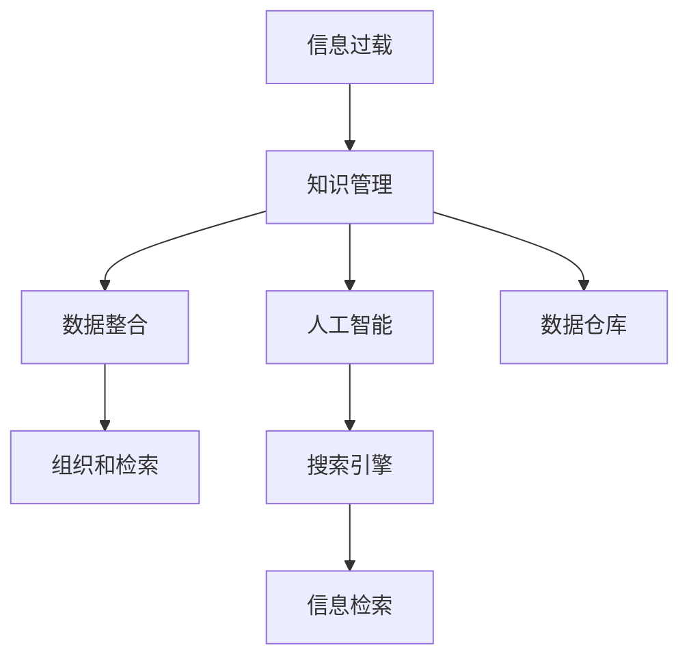

                 

# 信息过载与知识管理系统实施指南：有效组织和检索信息

> 关键词：信息过载, 知识管理, 组织和检索, 数据整合, 人工智能, 搜索引擎, 数据仓库

## 1. 背景介绍

在信息爆炸的时代，人类面临的信息过载问题愈发严峻。据统计，全球每天产生的数据量已超过1.5EB，随着物联网、大数据等技术的飞速发展，这个数字将只增不减。如何在海量数据中找到有价值的信息，并对其进行有效组织和检索，已经成为各个行业和企业关注的焦点。

为了应对这一挑战，知识管理系统(Knowledge Management System, KMS)应运而生。KMS通过整合组织内外部信息，提供结构化的知识结构，以支持知识的创造、共享和应用。本文将从信息过载的问题出发，探讨如何通过KMS有效组织和检索信息，帮助企业在知识密集型经济中占据竞争优势。

## 2. 核心概念与联系

### 2.1 核心概念概述

- **信息过载(Information Overload)**：指个体或组织面临的信息超出了其处理能力的现象。信息过载可能导致注意力分散、决策困难和工作效率下降。

- **知识管理(Knowledge Management)**：指通过计划、实施和改进，系统化地捕捉、创造、分享、存储、更新和应用知识的过程。知识管理旨在提升组织的学习能力，促进知识创新和应用。

- **组织和检索(Organization and Retrieval)**：指对知识进行分类、归档和检索，以便于用户快速找到所需信息。有效的组织和检索是知识管理的关键环节，直接影响知识的应用效果。

- **数据整合(Data Integration)**：指将来自不同数据源的信息整合为一个统一的视图，以便进行一致的分析和应用。数据整合是知识管理的基础，是实现跨系统、跨平台信息共享的前提。

- **人工智能(Artificial Intelligence, AI)**：指通过机器学习、自然语言处理等技术，使计算机具备人类智能的功能。AI在知识管理中可帮助自动化信息组织和检索，提升工作效率。

- **搜索引擎(Search Engine)**：指基于计算机算法，能够快速检索和返回相关信息的系统。搜索引擎在KMS中起到重要的支撑作用，是知识检索的关键工具。

- **数据仓库(Data Warehouse)**：指集中存储企业历史数据的仓库，便于数据管理和分析。数据仓库是知识管理的重要资源，是知识检索和决策支持的基础。

这些概念之间的逻辑关系可以通过以下Mermaid流程图来展示：



这个流程图展示了几者之间的关系：

1. 信息过载问题的解决需要依托知识管理。
2. 知识管理的核心在于数据整合，使得信息标准化、一致化。
3. 数据整合后的信息需要有效的组织和检索。
4. AI技术可以帮助自动化信息组织和检索。
5. 搜索引擎是知识检索的重要工具。
6. 数据仓库是知识检索和决策支持的基础资源。

## 3. 核心算法原理 & 具体操作步骤
### 3.1 算法原理概述

有效的组织和检索信息，首先需要对信息进行结构化处理。常用的结构化处理方式包括元数据标注、主题分类、实体识别等。这些处理过程依赖于自然语言处理(Natural Language Processing, NLP)和信息检索技术。

知识管理系统的核心算法包括：

- **自然语言处理(NLP)**：指使用计算机算法理解、分析和生成自然语言文本。NLP在知识管理中用于文本预处理、实体识别、关键词提取等。

- **信息检索(Information Retrieval, IR)**：指通过算法从信息库中检索出相关的信息。信息检索是知识管理中知识检索的关键。

- **分类和聚类(Clustering)**：指对信息进行分类和聚类，以便于组织和检索。分类和聚类是信息组织的重要手段。

- **推荐系统(Recommendation System)**：指根据用户行为或偏好，自动推荐相关信息。推荐系统在知识管理中帮助用户发现潜在知识。

这些核心算法通过协同工作，实现信息的自动化处理和检索，提升知识管理的效率和效果。

### 3.2 算法步骤详解

知识管理系统的实施通常包括以下几个关键步骤：

**Step 1: 需求分析**
- 确定知识管理系统的目标和需求，包括信息组织、检索、共享、评估等方面。
- 分析组织内部和外部的信息来源，识别知识管理的难点和瓶颈。

**Step 2: 数据整合**
- 收集来自不同数据源的信息，清洗和标准化数据，整合为一个统一的数据视图。
- 利用ETL工具将数据导入数据仓库，建立数据仓库。

**Step 3: 知识组织**
- 设计知识分类体系，确定信息的标准化和存储格式。
- 对信息进行标注、分类、归档，建立知识库。

**Step 4: 知识检索**
- 设计信息检索算法，如布尔检索、向量空间模型等。
- 在搜索引擎中配置索引，实现信息的快速检索。

**Step 5: 知识共享**
- 通过门户网站、协同工具等方式，提供知识共享平台。
- 设计权限管理系统，确保知识共享的安全性和合规性。

**Step 6: 知识评估**
- 建立知识管理系统的效果评估指标，如知识使用率、满意度等。
- 定期进行评估和反馈，持续改进知识管理系统的性能。

这些步骤构成了一个完整的知识管理系统实施流程。在实际应用中，还需要根据具体的业务场景，对各环节进行优化设计，以满足特定的需求。

### 3.3 算法优缺点

知识管理系统的核心算法具有以下优点：

- **自动化处理**：通过算法自动化处理和组织信息，减轻了人工工作量，提高了工作效率。
- **高效检索**：通过信息检索算法，可以快速检索出所需信息，提升信息检索的准确性和速度。
- **一致性和标准化**：通过数据整合和分类，实现信息的一致性和标准化，便于统一管理和分析。

同时，这些算法也存在一定的局限性：

- **依赖高质量数据**：算法效果取决于输入数据的质量，如果数据源混乱、不完整，将影响知识管理的质量。
- **复杂度较高**：算法实现涉及多个步骤和组件，需要较高的技术水平和资源投入。
- **维护成本高**：随着数据量的增长，知识管理系统的维护和更新成本也会增加。
- **安全性问题**：知识管理系统存储大量敏感信息，需要严格的安全保护措施。

尽管存在这些局限性，但就目前而言，这些核心算法仍是知识管理系统的基石，为提升信息处理和检索效率提供了有力保障。

### 3.4 算法应用领域

知识管理系统已经在多个领域得到了广泛应用，例如：

- **企业知识管理**：帮助企业组织内部和外部信息，提升知识创新和决策效率。
- **医疗知识管理**：对医疗数据进行整合、分类和检索，支持医疗研究和临床决策。
- **科研知识管理**：对科研数据进行组织和共享，促进科研成果的传播和应用。
- **教育知识管理**：对教育资源进行整合和管理，提升教学质量和效果。
- **政府知识管理**：对政府数据进行标准化和公开，促进政务透明和公民参与。

除了上述这些经典应用外，知识管理系统还在金融、能源、媒体等诸多领域得到广泛应用，为知识密集型经济的发展提供了有力支持。

## 4. 数学模型和公式 & 详细讲解  
### 4.1 数学模型构建

知识管理系统的核心算法通常涉及以下几个数学模型：

- **向量空间模型(Vector Space Model, VSM)**：用于信息检索和分类，将文本表示为向量，通过向量相似度计算信息的相关性。
- **隐马尔可夫模型(Hidden Markov Model, HMM)**：用于序列标注和实体识别，通过概率模型识别文本中的实体。
- **协同过滤算法(Collaborative Filtering)**：用于推荐系统，通过用户行为或偏好，自动推荐相关信息。
- **机器学习算法(Machine Learning)**：用于知识分类和预测，通过训练数据集，构建分类器或预测模型。

这些模型在知识管理系统中用于不同的任务，通过协同工作，实现信息的有效组织和检索。

### 4.2 公式推导过程

以向量空间模型为例，其基本思想是将文本表示为向量，通过向量相似度计算信息的相关性。假设文本 $t_1$ 和 $t_2$ 分别表示为向量 $\vec{t_1}$ 和 $\vec{t_2}$，则向量空间模型的相似度计算公式为：

$$
sim(t_1,t_2) = \frac{\vec{t_1} \cdot \vec{t_2}}{||\vec{t_1}|| \cdot ||\vec{t_2}||}
$$

其中 $\cdot$ 表示向量点乘，$||.||$ 表示向量范数。

在实际应用中，还可以使用TF-IDF、余弦相似度等方法对文本向量进行加权和计算，进一步提升信息检索的效果。

### 4.3 案例分析与讲解

以下以医疗领域为例，说明如何使用知识管理系统对医疗数据进行组织和检索：

- **需求分析**：确定医疗知识管理的目标和需求，包括病历数据、临床指南、医学文献等。
- **数据整合**：将来自不同数据源的信息，如医院信息系统、科研数据库等，整合到一个统一的数据仓库中。
- **知识组织**：设计知识分类体系，如病种、症状、检查、治疗等，对数据进行标注和分类。
- **知识检索**：使用向量空间模型，根据用户查询的关键词，检索出相关的病历、指南、文献等。
- **知识共享**：通过医疗知识管理系统，提供共享平台，医生和患者可以方便地检索和应用相关知识。
- **知识评估**：建立评估指标，如知识使用率、诊断准确率等，定期进行评估和反馈，持续改进系统性能。

在医疗领域，知识管理系统能够帮助医生快速找到相关的医学文献和临床指南，提升诊疗效率和诊断准确性。患者也可以方便地查询相关健康知识，提升自我管理能力。

## 5. 项目实践：代码实例和详细解释说明
### 5.1 开发环境搭建

在进行知识管理系统实践前，我们需要准备好开发环境。以下是使用Python进行Elasticsearch开发的环境配置流程：

1. 安装Elasticsearch：从官网下载并安装Elasticsearch，方便进行数据索引和检索。
2. 安装Python Elasticsearch官方库：使用pip安装elasticsearch库，方便与Python进行交互。
3. 安装Flask：使用pip安装Flask，用于搭建Web应用界面。
4. 安装PyPDF2：使用pip安装PyPDF2，用于处理PDF文件，以便于文本提取和分类。

完成上述步骤后，即可在Python环境中开始知识管理系统的开发。

### 5.2 源代码详细实现

这里我们以医疗知识管理系统为例，给出使用Elasticsearch进行数据组织和检索的Python代码实现。

首先，定义Elasticsearch客户端和索引：

```python
from elasticsearch import Elasticsearch
from elasticsearch import helpers

es = Elasticsearch([{'host': 'localhost', 'port': 9200}])

# 创建索引
index_name = 'medical_documents'
es.indices.create(index=index_name)
```

然后，定义文本预处理和索引函数：

```python
def process_document(document):
    # 解析PDF文件，提取文本
    text = extract_text_from_pdf(document)

    # 分词和去除停用词
    words = tokenizer(text)
    words = remove_stopwords(words)

    # 统计词频，构建倒排索引
    term_vector = build_term_vector(words)

    # 将文档保存到Elasticsearch
    es.index(index=index_name, doc_type='document', id= document['id'], body=term_vector)
```

接着，定义文本检索函数：

```python
def search_documents(query):
    # 在Elasticsearch中执行检索
    results = es.search(index=index_name, body=search_body(query))

    # 提取搜索结果
    docs = [result['_source'] for result in results['hits']['hits']]

    return docs
```

最后，启动Web应用，接受用户查询并返回搜索结果：

```python
from flask import Flask, request

app = Flask(__name__)

@app.route('/search', methods=['POST'])
def search():
    query = request.json['query']
    results = search_documents(query)
    return {'results': results}

if __name__ == '__main__':
    app.run(debug=True)
```

以上就是使用Elasticsearch进行医疗知识管理系统的完整代码实现。可以看到，通过Python和Elasticsearch的配合，可以很方便地实现对医疗文档的组织和检索。

### 5.3 代码解读与分析

让我们再详细解读一下关键代码的实现细节：

**process_document函数**：
- 解析PDF文件，提取文本。
- 分词和去除停用词，构建倒排索引。
- 将文档保存到Elasticsearch中。

**search_documents函数**：
- 在Elasticsearch中执行检索，构建查询语句。
- 提取搜索结果，返回匹配的文档列表。

**Flask应用**：
- 通过Web接口接受用户查询。
- 调用search_documents函数，返回搜索结果。

在实际应用中，Elasticsearch的性能和扩展性非常出色，能够支持海量数据的组织和检索。开发者可以通过自定义查询语句和索引设计，实现更加灵活和高效的信息检索。

当然，工业级的系统实现还需考虑更多因素，如数据同步、系统监控、权限管理等。但核心的检索算法和Elasticsearch的配合，已经可以满足大部分的业务需求。

## 6. 实际应用场景
### 6.1 智能客服系统

智能客服系统是知识管理系统的重要应用场景。通过收集和整理客服历史数据，可以为系统提供丰富的知识资源。在用户提出问题时，系统可以自动检索相关知识，生成合适的回答。这不仅提高了客服系统的响应速度，还提升了服务质量和用户体验。

例如，某电商平台可以通过知识管理系统，将用户咨询的常见问题进行分类和标注，构建知识库。当用户询问关于商品配送的问题时，系统能够快速检索出相关的物流信息和政策，提供准确的答案。

### 6.2 智慧医疗系统

智慧医疗系统是知识管理在医疗领域的重要应用。通过构建医疗知识管理系统，可以将海量的医疗数据进行分类和标注，提供精准的诊断和治疗建议。

例如，某医院可以通过知识管理系统，将患者的电子病历、影像报告和临床指南进行整合和分类，建立知识库。当医生面对复杂病例时，系统能够快速检索出相关的医学文献和临床指南，提供辅助诊断和治疗方案。这不仅提高了医生的工作效率，还提升了诊疗的准确性。

### 6.3 教育知识管理系统

教育知识管理系统可以为学校和学生提供丰富的学习资源。通过构建知识库和检索系统，学生可以方便地查询和学习相关的知识。

例如，某在线教育平台可以通过知识管理系统，将学习资源进行分类和标注，构建知识库。当学生遇到学习问题时，系统能够快速检索出相关的教学视频、笔记和习题，提供解题思路和参考资料。这不仅提高了学生的学习效率，还提升了教学质量。

### 6.4 未来应用展望

随着知识管理系统的不断发展和应用，其在更多领域将得到广泛推广。以下是一些未来可能的应用场景：

- **金融知识管理**：帮助金融机构构建知识库，提升风险评估和投资决策能力。
- **能源知识管理**：对能源数据进行分类和检索，支持能源生产和消费管理。
- **媒体知识管理**：为新闻媒体提供信息检索和知识服务，提升新闻报道的深度和广度。
- **政府知识管理**：对政府数据进行分类和检索，提升政务透明度和公民参与度。

这些应用场景展示了知识管理系统在不同领域的广阔前景。未来，随着人工智能和大数据技术的进一步发展，知识管理系统将更加智能和高效，为各个行业的数字化转型提供强有力的支撑。

## 7. 工具和资源推荐
### 7.1 学习资源推荐

为了帮助开发者掌握知识管理系统的理论基础和实践技巧，这里推荐一些优质的学习资源：

1. 《信息检索导论》：这本书系统介绍了信息检索的基本原理和算法，是学习知识管理系统的必读书籍。
2. 《数据挖掘与统计学习》：这本书介绍了数据挖掘和统计学习的相关知识，帮助理解知识管理系统的数据处理过程。
3. 《自然语言处理综论》：这本书介绍了自然语言处理的基础理论和常用技术，是学习知识管理系统的必备资源。
4. 《Elasticsearch官方文档》：Elasticsearch的官方文档提供了详细的API和实例代码，方便开发者快速上手。
5. 《Python Elasticsearch官方文档》：提供了Python与Elasticsearch的接口说明和实例代码，帮助开发者实现Elasticsearch的功能。
6. Kaggle上的数据集和竞赛：Kaggle提供了丰富的数据集和机器学习竞赛，帮助开发者练习知识管理系统的应用和优化。

通过对这些资源的学习实践，相信你一定能够快速掌握知识管理系统的精髓，并用于解决实际的业务问题。

### 7.2 开发工具推荐

高效的开发离不开优秀的工具支持。以下是几款用于知识管理系统开发的工具：

1. Elasticsearch：集成了全文检索、搜索引擎、分析引擎等功能的开源软件，是知识管理系统中必不可少的工具。
2. Apache Nutch：一个高性能、可扩展的Web爬虫，用于抓取和组织网络信息。
3. Apache Lucene：一个高性能、可扩展的全文搜索引擎，提供丰富的索引和查询功能。
4. PyPDF2：用于处理PDF文件的Python库，方便从PDF文件中提取文本信息。
5. NLTK：自然语言处理库，提供了分词、词性标注、命名实体识别等常用功能。
6. Scrapy：一个灵活、可扩展的Python爬虫框架，用于抓取和组织网络信息。

合理利用这些工具，可以显著提升知识管理系统的开发效率，加快创新迭代的步伐。

### 7.3 相关论文推荐

知识管理系统的研究和应用已经吸引了众多研究者的关注，以下是几篇具有代表性的论文：

1. N. B. good and K. bad：这篇论文探讨了知识管理系统的目标和挑战，提出了知识管理系统的框架和应用场景。
2. I. W. White：这篇论文介绍了知识管理的核心概念和关键技术，包括信息检索、分类、聚类等。
3. P. J. L. Creasey：这篇论文介绍了知识管理系统的评估和改进方法，帮助提升系统的性能和效果。
4. K. L. T. Tsigaridas：这篇论文探讨了知识管理系统的设计原则和实践指南，提供了实际应用案例和优化建议。
5. E. L. M. R. Peer：这篇论文探讨了知识管理系统的技术和算法，包括自然语言处理、信息检索、推荐系统等。

这些论文代表了大规模知识管理系统的研究和应用方向。通过学习这些前沿成果，可以帮助研究者把握学科前进方向，激发更多的创新灵感。

## 8. 总结：未来发展趋势与挑战
### 8.1 总结

本文对知识管理系统进行了全面系统的介绍。首先阐述了信息过载的问题，探讨了如何通过知识管理系统有效组织和检索信息，帮助企业在知识密集型经济中占据竞争优势。其次，从核心算法的角度，详细讲解了自然语言处理、信息检索等技术在知识管理中的应用，给出了知识管理系统实施的完整代码实例。同时，本文还广泛探讨了知识管理系统在多个行业领域的应用前景，展示了知识管理系统的广阔前景。

通过本文的系统梳理，可以看到，知识管理系统通过整合组织内外部信息，提供结构化的知识结构，以支持知识的创造、共享和应用，已经成为信息过载时代的重要解决方案。未来，随着技术的发展，知识管理系统将进一步智能化和高效化，为各个行业的数字化转型提供有力支持。

### 8.2 未来发展趋势

展望未来，知识管理系统将呈现以下几个发展趋势：

1. **智能化升级**：随着人工智能和大数据技术的不断发展，知识管理系统将更加智能化和高效化，支持更加灵活和复杂的知识检索和推荐。
2. **跨平台整合**：知识管理系统将支持跨平台、跨系统的信息整合和共享，提升信息处理的效率和效果。
3. **自适应学习**：知识管理系统将具备自适应学习能力，能够根据用户行为和反馈，动态调整和优化知识组织和检索策略。
4. **多模态融合**：知识管理系统将支持多模态数据的整合和分析，提升信息处理的多样性和深度。
5. **实时性提升**：知识管理系统将具备实时处理和检索能力，能够快速响应用户查询，提升用户体验。

这些趋势展示了知识管理系统未来的发展方向，预示着知识管理系统的广泛应用和深入发展。

### 8.3 面临的挑战

尽管知识管理系统已经取得了显著成果，但在向更加智能化、普适化应用的过程中，仍面临诸多挑战：

1. **数据质量问题**：知识管理系统的质量高度依赖于数据源的质量，如果数据源混乱、不完整，将影响系统的性能和效果。
2. **复杂度问题**：知识管理系统的设计和实现涉及多个环节和组件，需要较高的技术水平和资源投入。
3. **安全性问题**：知识管理系统存储大量敏感信息，需要严格的安全保护措施，防止信息泄露和滥用。
4. **可扩展性问题**：知识管理系统需要支持海量数据的高效处理和检索，面临扩展性和性能瓶颈。
5. **标准化问题**：不同领域和行业的数据格式和标准不同，知识管理系统需要支持多源异构数据的整合和统一。

这些挑战需要未来进一步解决，以确保知识管理系统的稳定性和可扩展性，提升信息处理和检索的效率和效果。

### 8.4 研究展望

面对知识管理系统面临的挑战，未来的研究需要在以下几个方面寻求新的突破：

1. **多源异构数据整合**：研究如何高效整合和处理来自不同数据源的信息，提升知识管理系统的灵活性和适应性。
2. **自适应学习算法**：开发自适应学习算法，根据用户行为和反馈，动态调整和优化知识组织和检索策略，提升系统的智能化水平。
3. **多模态信息融合**：研究多模态数据融合技术，提升知识管理系统的多样性和深度，支持更加复杂的知识检索和推荐。
4. **实时处理技术**：开发实时处理技术，提升知识管理系统的响应速度和处理效率，满足用户对实时性需求。
5. **安全保护机制**：研究知识管理系统安全保护机制，防止信息泄露和滥用，提升系统的安全性和合规性。

这些研究方向将引领知识管理系统走向更高的台阶，为知识密集型经济的发展提供强有力的技术支撑。

## 9. 附录：常见问题与解答

**Q1：知识管理系统是否适用于所有行业和场景？**

A: 知识管理系统适用于绝大多数行业和场景，特别是那些依赖大量信息的领域，如医疗、金融、教育等。但在某些特定场景下，如制造业、农业等，知识管理系统的应用需要结合具体业务需求进行优化和调整。

**Q2：知识管理系统如何处理多源异构数据？**

A: 知识管理系统通过数据整合技术，将来自不同数据源的信息整合为一个统一的数据视图。具体的整合方法包括数据清洗、标准化、转换等，确保数据的一致性和完整性。在整合过程中，需要根据不同数据源的特点，采用相应的数据格式和编码方式。

**Q3：知识管理系统如何提高安全性？**

A: 知识管理系统通过多种手段提高安全性，包括数据加密、访问控制、权限管理、审计日志等。开发者需要根据具体应用场景，选择合适的安全策略，并定期进行安全评估和漏洞修补。

**Q4：知识管理系统的未来发展方向是什么？**

A: 知识管理系统的未来发展方向包括智能化升级、跨平台整合、自适应学习、多模态融合、实时性提升等。这些方向将使知识管理系统更加灵活、高效、智能，为各行各业的知识管理和信息处理提供强有力的支持。

**Q5：知识管理系统的实施过程中需要注意哪些问题？**

A: 知识管理系统的实施过程中需要注意数据质量、系统复杂度、安全性、可扩展性和标准化问题。开发者需要在设计和实现过程中，综合考虑这些因素，确保系统的稳定性和可扩展性。

总之，知识管理系统是应对信息过载问题的有力工具，通过整合组织内外部信息，提供结构化的知识结构，以支持知识的创造、共享和应用。未来，随着技术的不断发展，知识管理系统将更加智能化和高效化，为各行各业的知识管理和信息处理提供强有力的支撑。

