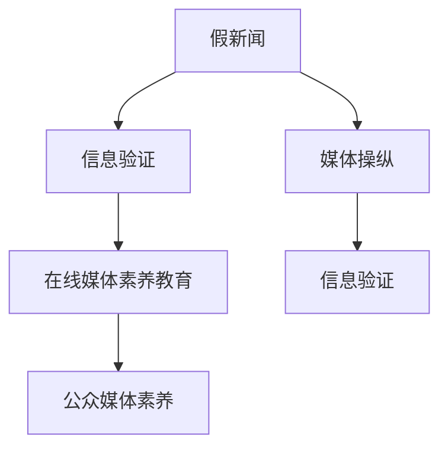

                 

## 1. 背景介绍

在信息爆炸的时代，互联网已成为新闻传播的主要渠道，然而，伴随而来的是大量假新闻和媒体操纵现象。这些虚假信息不仅扰乱了公共话语空间，还对个人、社会乃至国家安全构成严重威胁。如何在海量的信息中识别真伪，提升公众的媒体素养，成为摆在全社会面前的重大课题。

### 1.1 问题由来

虚假新闻和媒体操纵现象的增多，主要源于以下几个方面：

- **信息过载**：互联网的开放性使得任何人都可以发布信息，且往往无须验证。同时，用户接收信息的渠道和频率也大幅增加，在处理信息时容易产生判断失误。

- **商业利益驱动**：部分媒体机构和自媒体为了追求点击率和广告收入，有意无意地制造和传播假新闻，误导公众。

- **技术手段的滥用**：一些自媒体和个人利用AI生成、伪造图片、视频等手段，制造假新闻，极具欺骗性。

- **社会信任的下降**：社会信任度降低，使得公众对所有信息的真实性都保持怀疑态度，进一步助长了假新闻的传播。

针对这些问题，信息验证和在线媒体素养教育成为亟需解决的当务之急。本文将从大语言模型角度出发，探索利用先进的自然语言处理技术，提升信息验证和在线媒体素养教育的效果。

### 1.2 问题核心关键点

本节将详细讨论信息验证和在线媒体素养教育中的几个核心关键点：

- **大语言模型在信息验证中的应用**：如何利用预训练语言模型，自动化识别假新闻和媒体操纵行为。

- **在线媒体素养教育的必要性**：为何要提升公众的在线媒体素养，提高其对假新闻的辨别能力。

- **大语言模型在媒体素养教育中的潜力**：如何设计训练数据集，利用大语言模型提升教育效果。

- **未来发展方向**：信息验证和在线媒体素养教育技术应如何进一步发展和应用。

## 2. 核心概念与联系

### 2.1 核心概念概述

为更好地理解信息验证和在线媒体素养教育，本节将介绍几个关键概念：

- **假新闻**：故意制造、篡改或扭曲事实的虚假新闻，旨在误导公众。

- **媒体操纵**：媒体机构故意扭曲事实、夸大事实或制造假新闻，以达到特定目的，如影响公众观点、打击竞争对手等。

- **信息验证**：通过各种技术手段，对新闻和信息进行真实性判断，识别假新闻和媒体操纵行为。

- **媒体素养**：公众获取、分析、评估、创造和传播信息的能力。

- **大语言模型**：基于深度学习技术的预训练语言模型，能够理解并生成自然语言，具备强大的信息处理能力。

这些概念之间的联系可以通过以下Mermaid流程图来展示：



这个流程图展示了大语言模型在信息验证和在线媒体素养教育中的关键作用：

1. 假新闻和媒体操纵问题通过信息验证进行识别。
2. 信息验证利用大语言模型提升识别效果。
3. 在线媒体素养教育提高公众识别假新闻的能力。
4. 公众媒体素养的提升，反过来又进一步增强信息验证的效率和准确性。

## 3. 核心算法原理 & 具体操作步骤

### 3.1 算法原理概述

基于大语言模型的信息验证和在线媒体素养教育，本质上是一个自然语言处理（NLP）任务，可以形式化为如下问题：

- **信息验证**：给定一个新闻文章，判断其是否为假新闻。

- **在线媒体素养教育**：给定一系列示例文章，生成一个训练集，用于训练大语言模型，使其能够区分真实与虚假新闻。

这两种任务都涉及自然语言理解和生成，可以通过预训练语言模型来解决。

### 3.2 算法步骤详解

#### 3.2.1 信息验证

信息验证的一般步骤如下：

1. **数据收集与标注**：收集大量新闻文章，并对其中的真实与虚假文章进行标注。这些标注数据可以是人工标注，也可以利用现有的大规模语料库进行标注。

2. **预训练语言模型加载**：选择一个预训练语言模型（如BERT、GPT等），加载到计算设备上。

3. **特征提取**：对新闻文章进行预处理，提取其特征向量，这些向量将作为模型输入。

4. **模型推理**：将特征向量输入到预训练模型中，模型会根据输入生成一个向量表示，该向量表示可以反映文章内容的真实性。

5. **结果判断**：将模型生成的向量表示与真实性标签进行对比，如果向量表示与真实标签不一致，则判定文章为假新闻。

#### 3.2.2 在线媒体素养教育

在线媒体素养教育的一般步骤如下：

1. **数据生成与标注**：构建一个包含真实新闻和虚假新闻的语料库，并对其进行标注。

2. **模型训练**：使用标注好的语料库，对预训练语言模型进行微调，训练模型区分真实与虚假新闻的能力。

3. **模型评估**：在测试集上评估微调后的模型，并根据评估结果调整超参数，以提高模型的准确性。

4. **模型部署**：将训练好的模型部署到线上，用于实时识别假新闻。

5. **用户反馈**：收集用户对模型的反馈，不断优化模型和数据集。

### 3.3 算法优缺点

#### 3.3.1 优点

- **自动化**：利用预训练语言模型，可以自动化处理大量文本数据，极大地提升信息验证和在线媒体素养教育的效率。

- **准确性**：预训练语言模型经过大规模无标签数据训练，具备强大的语言理解能力，可以显著提高信息验证和媒体素养教育的准确性。

- **灵活性**：可以根据具体任务调整模型结构和超参数，适应不同的应用场景。

- **可扩展性**：预训练语言模型可以应用到各种自然语言处理任务中，具备良好的可扩展性。

#### 3.3.2 缺点

- **依赖标注数据**：信息验证和在线媒体素养教育的效果很大程度上取决于标注数据的质量和数量，标注成本较高。

- **过拟合风险**：如果数据标注不平衡，模型可能出现过拟合现象，降低验证效果。

- **模型复杂度**：大规模预训练语言模型的训练和推理需要大量的计算资源，可能带来较高的硬件成本。

- **数据隐私问题**：在收集和处理数据时，需要考虑隐私保护和数据安全，避免数据泄露。

## 4. 数学模型和公式 & 详细讲解 & 举例说明

### 4.1 数学模型构建

信息验证和在线媒体素养教育涉及的数学模型主要包括：

- **新闻文章的向量表示**：使用Word2Vec、GloVe等词嵌入方法，将新闻文章中的单词转换为向量。

- **模型训练目标**：使用交叉熵损失函数，优化模型的预测结果与真实标签之间的差异。

- **模型推理过程**：利用预训练模型的前向传播和后向传播过程，生成模型的预测结果。

### 4.2 公式推导过程

设新闻文章为 $x = (w_1, w_2, ..., w_n)$，其中 $w_i$ 为单词，使用Word2Vec方法将其转换为向量表示 $v_x = (v_{w_1}, v_{w_2}, ..., v_{w_n})$。

假设模型对新闻文章的真实性预测为 $y \in \{0, 1\}$，其中 $0$ 表示假新闻，$1$ 表示真实新闻。则模型的训练目标为最小化交叉熵损失：

$$
\mathcal{L}(y, \hat{y}) = -(y \log \hat{y} + (1 - y) \log (1 - \hat{y}))
$$

其中 $\hat{y}$ 为模型的预测结果。

### 4.3 案例分析与讲解

假设我们有一篇新闻文章 $x = "特朗普政府宣布对中国征收关税"，其向量表示为 $v_x = [0.1, 0.5, -0.2, 0.3]$。使用BERT模型进行信息验证时，首先加载BERT模型，并计算文章向量 $v_x$ 的表示，然后将其输入到模型中，计算模型的预测结果 $\hat{y}$。如果 $\hat{y}$ 与真实标签 $y$ 不一致，则判定文章为假新闻。

## 5. 项目实践：代码实例和详细解释说明

### 5.1 开发环境搭建

本节将介绍信息验证和在线媒体素养教育项目的开发环境搭建步骤：

1. **Python环境**：安装Python 3.6及以上版本。

2. **深度学习框架**：安装TensorFlow或PyTorch，用于模型的训练和推理。

3. **数据处理库**：安装Pandas、NumPy等库，用于数据预处理和分析。

4. **自然语言处理库**：安装NLTK、SpaCy等库，用于文本处理和特征提取。

5. **在线服务**：部署在线服务框架，如Flask、FastAPI等，用于模型的部署和调用。

### 5.2 源代码详细实现

以下是使用PyTorch进行信息验证的代码实现：

```python
import torch
import torch.nn as nn
import torch.optim as optim

class NewsClassifier(nn.Module):
    def __init__(self, embedding_dim, hidden_dim):
        super(NewsClassifier, self).__init__()
        self.embedding = nn.Embedding(vocab_size, embedding_dim)
        self.fc1 = nn.Linear(embedding_dim, hidden_dim)
        self.fc2 = nn.Linear(hidden_dim, 1)
        self.sigmoid = nn.Sigmoid()

    def forward(self, x):
        embedded = self.embedding(x)
        hidden = self.fc1(embedded)
        logits = self.fc2(hidden)
        return self.sigmoid(logits)

# 训练模型
model = NewsClassifier(embedding_dim=300, hidden_dim=128)
optimizer = optim.Adam(model.parameters(), lr=0.001)
criterion = nn.BCELoss()

for epoch in range(num_epochs):
    for i, (x, y) in enumerate(train_loader):
        x = x.to(device)
        y = y.to(device)
        optimizer.zero_grad()
        output = model(x)
        loss = criterion(output, y)
        loss.backward()
        optimizer.step()

# 测试模型
model.eval()
correct = 0
total = 0
with torch.no_grad():
    for x, y in test_loader:
        x = x.to(device)
        y = y.to(device)
        output = model(x)
        _, predicted = torch.max(output.data, 1)
        total += y.size(0)
        correct += (predicted == y).sum().item()

print('Test Accuracy of the model on the 10000 test images: %d %%' % (
    100 * correct / total))
```

### 5.3 代码解读与分析

**NewsClassifier类**：
- `__init__`方法：初始化模型结构，包括嵌入层、全连接层等。
- `forward`方法：定义模型的前向传播过程。

**训练和测试过程**：
- 使用PyTorch的DataLoader将数据集划分为训练集和测试集，按批次输入模型进行训练和测试。
- 在每个epoch内，对训练集数据进行前向传播和后向传播，更新模型参数。
- 在测试集上评估模型性能，输出测试准确率。

## 6. 实际应用场景

### 6.1 假新闻识别

在假新闻识别场景中，大语言模型可以通过自动化的方式，对大规模新闻文章进行信息验证，及时识别出假新闻。例如，可以在新闻平台集成假新闻识别系统，对所有新闻文章进行实时验证，避免虚假信息的传播。

### 6.2 媒体素养教育

在线媒体素养教育可以帮助公众提高对假新闻的辨别能力。通过构建包含大量真实与虚假新闻的训练数据集，利用大语言模型训练出新闻分类模型，并部署到线上教育平台，用户可以通过输入新闻文章，获取模型对新闻真实性的判断。

### 6.3 未来应用展望

未来，信息验证和在线媒体素养教育将更广泛地应用于多个领域：

- **政务透明**：在政务信息公开中，利用大语言模型自动验证政府信息，提升政府透明度和公信力。

- **公共安全**：在公共卫生、反恐等领域，利用大语言模型自动识别假新闻，防范不实信息传播。

- **金融风控**：在金融领域，利用大语言模型验证金融新闻，防范金融欺诈和信息操纵。

- **舆论引导**：在媒体行业，利用大语言模型分析新闻热点，引导舆论方向，构建健康的信息生态。

## 7. 工具和资源推荐

### 7.1 学习资源推荐

以下是几个推荐的在线学习资源，用于提升对大语言模型在信息验证和在线媒体素养教育中的理解和应用：

1. **Coursera上的NLP课程**：由斯坦福大学开设，涵盖自然语言处理的基本概念和深度学习模型。

2. **Kaggle上的NLP比赛**：参加NLP相关的Kaggle比赛，提升数据处理和模型训练能力。

3. **Towards Data Science博客**：涵盖NLP领域的最新研究成果和应用实践，值得关注。

### 7.2 开发工具推荐

以下是几个推荐的开发工具，用于大语言模型的开发和应用：

1. **PyTorch**：基于Python的深度学习框架，适用于模型训练和推理。

2. **TensorFlow**：Google开发的深度学习框架，适用于大规模模型训练。

3. **NLTK**：Python自然语言处理库，提供了丰富的文本处理功能。

4. **SpaCy**：Python自然语言处理库，适用于实体识别和情感分析等任务。

### 7.3 相关论文推荐

以下是几篇关于信息验证和在线媒体素养教育的经典论文，值得深入研究：

1. **A Systematic Review of Automated Fake News Detection: Survey and Taxonomy**：对自动化假新闻检测的研究进行综述，并提出分类框架。

2. **A Survey on Deep Learning-based Fake News Detection**：对基于深度学习的假新闻检测方法进行综述，并讨论未来研究方向。

3. **Bert-Primed Prompting for Reliable and Interpretable Fake News Detection**：提出基于BERT模型的假新闻检测方法，并展示其效果和可解释性。

4. **Teaching Machines about the World**：探讨如何利用大语言模型提升在线媒体素养教育的效果。

## 8. 总结：未来发展趋势与挑战

### 8.1 研究成果总结

本文从大语言模型的角度，探讨了信息验证和在线媒体素养教育的方法和实践。通过信息验证和在线媒体素养教育，可以有效识别假新闻和媒体操纵行为，提升公众的在线媒体素养。

### 8.2 未来发展趋势

未来，信息验证和在线媒体素养教育将呈现以下发展趋势：

1. **自动化与智能化**：利用大语言模型，实现信息验证和在线媒体素养教育的自动化和智能化。

2. **数据驱动**：通过大规模语料库和标注数据，驱动模型的持续优化和升级。

3. **可解释性**：提升模型的可解释性，让用户理解模型的判断依据，增强信任度。

4. **跨模态融合**：结合文本、图像、视频等多种模态的信息，提升信息验证和媒体素养教育的准确性。

5. **社会合作**：加强政府、媒体、学术界的合作，共同推动信息验证和在线媒体素养教育的发展。

### 8.3 面临的挑战

尽管大语言模型在信息验证和在线媒体素养教育中具备广阔前景，但仍面临诸多挑战：

1. **数据隐私**：在收集和处理数据时，需要考虑隐私保护和数据安全。

2. **模型泛化性**：模型需要在不同的数据集上表现出良好的泛化性，避免过拟合。

3. **计算资源**：大规模模型的训练和推理需要大量的计算资源，成本较高。

4. **可解释性**：模型的判断依据需要可解释，以便用户理解和信任。

5. **社会接受度**：用户对自动化信息验证和在线媒体素养教育的需求和接受度仍有待提高。

## 9. 附录：常见问题与解答

### 9.1 Q1：大语言模型在信息验证中的应用有哪些？

A：大语言模型可以应用于假新闻识别、媒体操纵检测、新闻分类等多个方面。例如，在假新闻识别中，可以利用大语言模型自动验证新闻的真实性，及时识别出假新闻；在媒体操纵检测中，可以利用大语言模型分析新闻内容，识别出媒体操纵行为。

### 9.2 Q2：在线媒体素养教育如何提升公众对假新闻的辨别能力？

A：在线媒体素养教育通过构建包含大量真实与虚假新闻的训练数据集，利用大语言模型训练出新闻分类模型，并部署到线上教育平台。用户可以通过输入新闻文章，获取模型对新闻真实性的判断，从而提升对假新闻的辨别能力。

### 9.3 Q3：大语言模型在信息验证中的局限性有哪些？

A：大语言模型在信息验证中主要面临数据隐私、模型泛化性、计算资源、可解释性等挑战。数据隐私问题需要在数据收集和处理时严格保护；模型泛化性需要在不同数据集上测试模型的性能，避免过拟合；计算资源需要在模型训练和推理时考虑硬件成本；可解释性需要在模型训练和应用中考虑模型的可解释性，以便用户理解和信任。

### 9.4 Q4：如何进一步提升大语言模型在信息验证中的应用效果？

A：为了进一步提升大语言模型在信息验证中的应用效果，可以从以下几个方面进行优化：

1. **数据增强**：通过数据增强技术，如回译、近义词替换等，扩充训练集，提高模型的泛化性。

2. **模型优化**：使用先进的模型架构，如BERT、GPT等，提升模型的准确性和鲁棒性。

3. **超参数调优**：通过超参数调优，如学习率、批量大小等，优化模型的训练过程，提高模型的性能。

4. **模型融合**：结合多个模型，如集成学习、多任务学习等，提升模型的综合性能。

5. **用户反馈**：收集用户对模型的反馈，不断优化模型和数据集，提高模型的准确性。

---

作者：禅与计算机程序设计艺术 / Zen and the Art of Computer Programming

