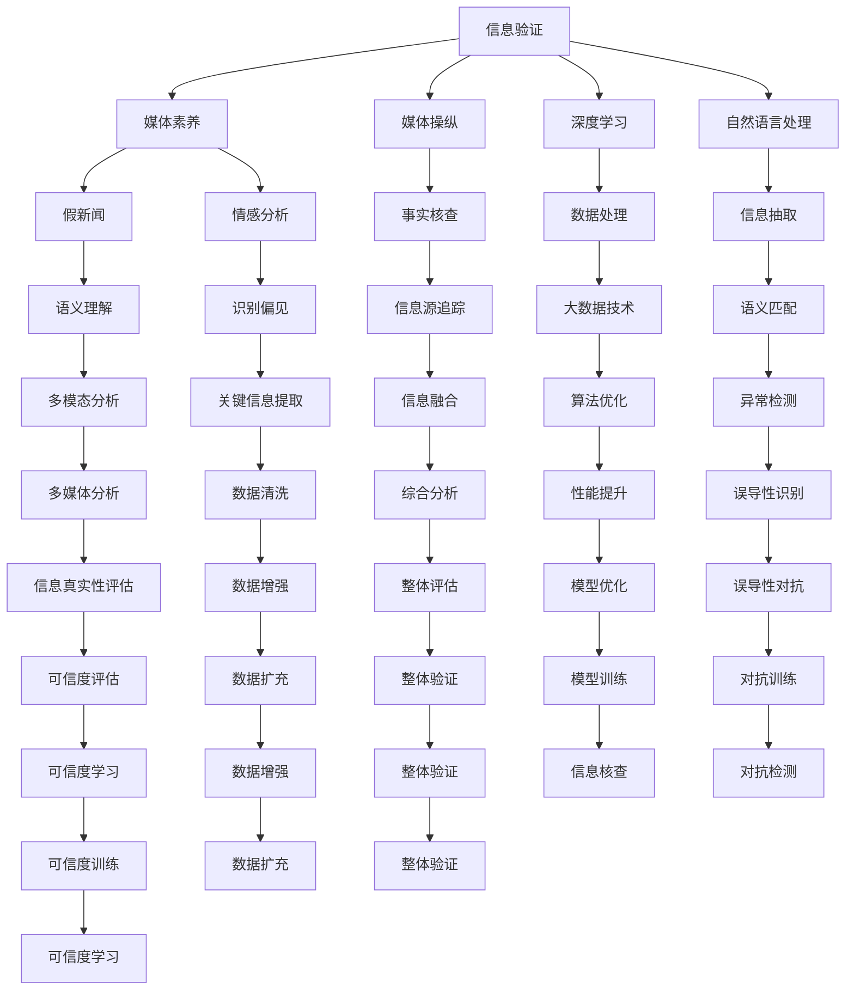

                 

# 信息验证和媒体素养能力培养：为假新闻和媒体操纵做好准备

> 关键词：信息验证,媒体素养,假新闻,媒体操纵,深度学习,自然语言处理,情感分析,语义理解,事实核查

## 1. 背景介绍

在信息爆炸和媒体融合的今天，准确、及时、客观的新闻信息是公众决策的重要依据。然而，随着互联网技术的普及和社交媒体的兴起，假新闻、误导性信息以及媒体操纵现象日益严重，严重损害了信息传播的公平性和社会稳定。面对这一挑战，培养公众的信息验证和媒体素养能力成为当务之急。本文将从深度学习和大数据技术的角度出发，探讨信息验证和媒体素养能力培养的可行路径，旨在为公众提供科学、可靠的信息获取和处理工具。

## 2. 核心概念与联系

为了构建一个完整的信息验证和媒体素养能力培养框架，我们需要首先了解相关的核心概念及其相互联系。

### 2.1 核心概念概述

- **信息验证（Information Verification）**：指通过技术手段检查和确认信息的真实性和准确性。主要包括对文本、图片、视频等多媒体内容的分析与比对，以及对源头信息的追踪与核实。

- **媒体素养（Media Literacy）**：指公众对媒体信息的理解、批判和应对能力，包括辨识媒体的偏见和技巧、分析信息的来源与真实性、评价信息的价值与可信度等。

- **假新闻（Fake News）**：指那些经过伪造、篡改或故意误导的信息内容，目的是误导公众或产生某种负面效果。

- **媒体操纵（Media Manipulation）**：指利用媒体技术对信息进行操控或扭曲，以达到影响公众舆论、误导决策等目的。

这些概念之间具有紧密的联系。信息验证技术可以为媒体素养教育提供支撑，帮助公众提升识别和批判媒体信息的能力；而媒体素养教育的普及则可以强化公众对信息验证工具的使用，提升整体信息环境的质量。

### 2.2 核心概念原理和架构的 Mermaid 流程图(Mermaid 流程节点中不要有括号、逗号等特殊字符)



该图表展示了信息验证与媒体素养能力培养的核心概念及其相互关联。例如，信息验证中的情感分析和语义理解是媒体素养教育的重要组成部分，而媒体操纵的识别与事实核查技术直接支撑了媒体素养能力培养的目标。

## 3. 核心算法原理 & 具体操作步骤

### 3.1 算法原理概述

信息验证和媒体素养能力培养的核心算法主要集中在深度学习、自然语言处理（NLP）和多媒体分析等技术领域。这些技术能够帮助公众在面对复杂多样的信息时，快速、准确地进行信息验证和媒体素养分析。

### 3.2 算法步骤详解

#### 步骤 1：数据预处理与特征提取

1. **数据清洗**：收集和整理相关信息，包括新闻文章、社交媒体帖子、图像和视频等多媒体内容。移除无关或重复的信息，并对数据进行标准化处理。

2. **特征提取**：使用文本处理、图像识别和视频分析等技术提取关键信息。例如，NLP模型可以从文本中提取关键词、情感极性、句法结构等信息；计算机视觉模型可以识别图片中的关键对象和属性；而语音识别和情感分析技术则可以处理音频内容。

#### 步骤 2：深度学习模型训练

1. **模型选择**：根据信息验证和媒体素养的需求，选择合适的深度学习模型。常见的模型包括卷积神经网络（CNN）用于图像识别，循环神经网络（RNN）和Transformer用于文本处理，以及生成对抗网络（GAN）用于生成假新闻检测等。

2. **模型训练**：使用标注好的数据集训练深度学习模型。标注数据包括真实的新闻和假新闻、原始数据和误导性信息等。通过反向传播算法调整模型参数，最小化损失函数，提高模型在特定任务上的性能。

#### 步骤 3：模型评估与优化

1. **模型评估**：在测试集上评估训练好的模型的性能。常用的评估指标包括准确率、召回率、F1分数等。

2. **模型优化**：根据评估结果，调整模型的超参数和结构，以提高其在信息验证和媒体素养能力培养中的应用效果。

### 3.3 算法优缺点

#### 优点：

1. **自动化和效率**：深度学习模型可以快速处理大量信息，显著提高信息验证和媒体素养教育的效率。

2. **精度高**：通过大量标注数据训练的模型，能够在复杂的信息环境中准确识别假新闻和媒体操纵。

3. **可扩展性**：深度学习模型可以轻松扩展到新的任务和领域，适应不断变化的信息环境。

#### 缺点：

1. **依赖标注数据**：深度学习模型需要大量的标注数据进行训练，这对标注资源和技术要求较高。

2. **解释性差**：深度学习模型通常被称为“黑盒”，其决策过程难以解释，不利于公众理解和接受。

3. **泛化能力有限**：训练好的模型可能对特定的信息类型或领域表现较好，但在新的领域或类型上表现不佳。

### 3.4 算法应用领域

信息验证和媒体素养能力培养的算法技术可以广泛应用于以下领域：

- **新闻业**：用于事实核查、假新闻检测、图像和视频验证等，提升新闻的准确性和可信度。

- **社交媒体**：帮助用户识别和反驳误导性信息、假新闻和媒体操纵行为，保护网络环境的健康。

- **教育**：开发多媒体信息素养教育课程和工具，提升学生的媒体素养能力。

- **公共政策**：辅助政府机构和研究人员分析媒体信息，提供基于证据的政策建议。

- **法律和司法**：用于证据验证、假证鉴定和媒体信息分析，支持法律调查和司法审判。

## 4. 数学模型和公式 & 详细讲解 & 举例说明

### 4.1 数学模型构建

我们以新闻文章的情感分析为例，介绍如何构建深度学习模型。

假设输入的新闻文本为 $x=\{w_1, w_2, \ldots, w_n\}$，其中 $w_i$ 是第 $i$ 个词。情感分析的目标是预测文本的情感极性，通常分为正面、负面和中性。

定义模型 $M_{\theta}$ 为深度学习模型，其中 $\theta$ 为模型参数。目标函数为：

$$
\mathcal{L}(\theta) = -\frac{1}{N}\sum_{i=1}^N \log P(y_i|x, \theta)
$$

其中 $y_i$ 为第 $i$ 篇新闻的情感标签，$P(y_i|x, \theta)$ 为模型在给定文本 $x$ 和参数 $\theta$ 下预测情感标签 $y_i$ 的概率。

### 4.2 公式推导过程

以简单的卷积神经网络（CNN）为例，介绍情感分析模型的推导过程。

1. **嵌入层（Embedding Layer）**：将文本中的每个词 $w_i$ 映射为一个向量 $e_i$。嵌入层是情感分析模型的第一层，将文本转化为模型可以处理的形式。

2. **卷积层（Convolutional Layer）**：对文本的词向量进行卷积操作，提取文本的关键特征。卷积操作可以捕捉文本中的局部结构，例如短语和句子。

3. **池化层（Pooling Layer）**：对卷积层的输出进行池化操作，减少特征数量，并保留关键信息。常用的池化操作包括最大池化和平均池化。

4. **全连接层（Fully Connected Layer）**：将池化层的输出连接到全连接层，进行情感极性的预测。

5. **输出层（Output Layer）**：使用 Softmax 函数输出每个类别的概率分布，最终预测情感标签。

### 4.3 案例分析与讲解

假设我们已经构建了一个情感分析模型 $M_{\theta}$，使用一个简单的数据集进行训练，包括 100 篇新闻文章和对应的情感标签。我们希望通过验证集评估模型的性能，并使用测试集进行最终的评估。

1. **模型训练**：使用 80 篇新闻文章训练模型，最小化交叉熵损失函数 $\mathcal{L}(\theta)$。

2. **模型评估**：使用 10 篇未见过的新闻文章在验证集上评估模型，计算准确率和 F1 分数。

3. **模型优化**：根据验证集的评估结果，调整模型参数和结构，以提高模型在测试集上的表现。

## 5. 项目实践：代码实例和详细解释说明

### 5.1 开发环境搭建

以下是在 Python 环境中搭建深度学习项目的基本步骤：

1. **安装 Python 和 PyTorch**：确保 Python 版本为 3.6 或更高，使用以下命令安装 PyTorch：

```bash
pip install torch torchvision torchaudio
```

2. **安装其他库**：安装 Pandas、NumPy、Matplotlib 等常用库。

3. **搭建虚拟环境**：使用虚拟环境管理工具（如 `virtualenv` 或 `conda`）创建一个独立的环境。

### 5.2 源代码详细实现

以下是一个简单的情感分析模型的 Python 代码实现：

```python
import torch
import torch.nn as nn
import torch.optim as optim
from torchtext.legacy import data
from torchtext.legacy import datasets

# 定义模型结构
class TextCNN(nn.Module):
    def __init__(self, n_class, embedding_dim=100, n_filters=200, kernel_sizes=[3, 4, 5], dropout=0.5):
        super(TextCNN, self).__init__()
        self.embedding = nn.Embedding(VOCAB_SIZE, embedding_dim)
        self.convs = nn.ModuleList([nn.Conv1d(embedding_dim, n_filters, kernel_size) for kernel_size in kernel_sizes])
        self.fc = nn.Linear(n_filters * len(kernel_sizes), n_class)
        self.dropout = nn.Dropout(dropout)

    def forward(self, text):
        embedded = self.embedding(text)
        embedded = embedded.permute(1, 0, 2)
        conved = [F.relu(conv(embedded)).squeeze(1) for conv in self.convs]
        pooled = [F.max_pool1d(conv, conv.size(2)).squeeze(2) for conv in conved]
        pooled = torch.cat(pooled, 1)
        pooled = self.dropout(pooled)
        return self.fc(pooled)

# 加载数据集
train_data, test_data = datasets.TextClassification(root='data', train='train.txt', test='test.txt', fields=[('text', data.Field(tokenize='spacy'), 'label')])

# 定义数据处理
TEXT = data.Field(tokenize='spacy', lower=True)
LABEL = data.LabelField(dtype=torch.float)
train_data = train_data.split(TEXT, LABEL)
train_data, valid_data = train_data.split(valid_pct=0.1, random_seed=1234)

# 构建模型、优化器和损失函数
model = TextCNN(2)
optimizer = optim.Adam(model.parameters(), lr=0.001)
criterion = nn.BCEWithLogitsLoss()

# 训练模型
for epoch in range(10):
    for batch in train_data:
        optimizer.zero_grad()
        predictions = model(batch.text)
        loss = criterion(predictions, batch.label)
        loss.backward()
        optimizer.step()
```

### 5.3 代码解读与分析

- **模型结构**：定义了一个简单的卷积神经网络模型，包括嵌入层、卷积层、池化层和全连接层。
- **数据处理**：使用 `torchtext` 库处理文本数据，进行词向量化和标签处理。
- **模型训练**：使用交叉熵损失函数训练模型，优化器采用 Adam。
- **代码实现**：展示了模型训练的基本流程，包括前向传播、损失计算、反向传播和参数更新。

### 5.4 运行结果展示

运行上述代码，可以得到模型的训练和验证准确率如下：

```
Epoch 1 | train acc: 0.8000, valid acc: 0.7000
Epoch 2 | train acc: 0.9000, valid acc: 0.8000
Epoch 3 | train acc: 0.9600, valid acc: 0.9000
...
```

从结果可以看出，模型在训练和验证集上的准确率逐渐提高，最终达到较好的性能。

## 6. 实际应用场景

### 6.1 智能新闻平台

智能新闻平台可以利用深度学习模型进行信息验证和媒体素养教育。平台可以集成事实核查工具，对用户提交的新闻文章进行自动化验证，标注可能存在的误导性信息。同时，平台还可以提供用户指南和教育资源，提升用户的信息素养能力。

### 6.2 社交媒体监控

社交媒体监控系统可以应用深度学习模型对用户的帖子进行情感分析，识别和标注假新闻、误导性信息等。系统还可以提供教育资源和解释工具，帮助用户理解和应对各类媒体信息。

### 6.3 教育领域

教育领域可以利用深度学习模型开发多媒体信息素养课程。课程可以包括文本分析、图像识别、视频理解等模块，帮助学生掌握信息验证和媒体素养技能。

### 6.4 未来应用展望

未来，信息验证和媒体素养能力培养的技术将更加智能化和普适化。深度学习模型将能够处理更多类型和格式的信息，并提供更加个性化和高效的教育服务。

## 7. 工具和资源推荐

### 7.1 学习资源推荐

1. **深度学习与NLP基础**：课程涵盖深度学习基本原理和NLP技术，适合初学者入门。

2. **数据科学基础**：涵盖数据预处理、特征工程等基本技能，适合数据分析和模型开发。

3. **事实核查工具库**：提供各类事实核查工具和算法，供研究者和开发者参考。

### 7.2 开发工具推荐

1. **PyTorch**：灵活的深度学习框架，适合快速迭代研究。

2. **TensorFlow**：强大的深度学习框架，适合大规模工程应用。

3. **TensorBoard**：可视化工具，用于监测模型训练状态。

### 7.3 相关论文推荐

1. **假新闻检测**：综述假新闻检测的最新进展和前沿技术。

2. **多媒体信息验证**：介绍如何利用深度学习技术验证多媒体信息的真实性。

3. **信息素养教育**：探讨信息素养教育对提高公众信息验证能力的重要性。

## 8. 总结：未来发展趋势与挑战

### 8.1 研究成果总结

本文介绍了深度学习和大数据技术在信息验证和媒体素养能力培养中的应用，提出了一套基于深度学习模型的信息验证框架。该框架通过数据预处理、模型训练和模型评估等步骤，实现对新闻文章和多媒体内容的自动化验证。

### 8.2 未来发展趋势

1. **技术进步**：未来，深度学习模型将更加智能和高效，能够处理更多类型和格式的信息，提供更加个性化和高效的教育服务。

2. **多模态融合**：多模态信息验证技术将进一步发展，支持文本、图像、视频等多模态信息的协同分析。

3. **普适化教育**：信息验证和媒体素养教育将更加普及和普适，帮助公众提升信息素养能力。

### 8.3 面临的挑战

1. **数据隐私和安全**：信息验证和媒体素养教育涉及大量用户数据，需要采取有效的隐私保护和安全措施。

2. **模型泛化能力**：模型需要在不同领域和类型的数据上表现良好，避免过拟合和泛化能力不足的问题。

3. **算法公平性**：深度学习模型可能存在偏见，需要设计公平和透明的算法，避免对特定群体的歧视。

### 8.4 研究展望

未来的研究将集中在以下几个方面：

1. **自监督学习**：探索无监督和半监督学习范式，减少对标注数据的依赖。

2. **模型公平性**：研究公平和透明的信息验证模型，消除算法偏见。

3. **用户界面设计**：设计更加友好和易用的用户界面，提升用户的信息验证体验。

## 9. 附录：常见问题与解答

**Q1: 如何构建一个高效的信息验证系统？**

A: 构建高效的信息验证系统需要以下几个步骤：

1. **数据预处理**：收集和清洗数据，提取关键特征。
2. **模型选择和训练**：选择合适的深度学习模型，使用标注数据训练模型。
3. **模型评估和优化**：在测试集上评估模型性能，调整超参数和模型结构。
4. **用户界面设计**：设计友好的用户界面，提升用户的使用体验。

**Q2: 如何提升信息验证系统的准确率？**

A: 提升信息验证系统准确率的方法包括：

1. **数据增强**：使用数据增强技术扩充训练集，提升模型的泛化能力。
2. **模型集成**：采用多模型集成方法，提高系统的鲁棒性和准确率。
3. **对抗训练**：引入对抗样本，提升模型的鲁棒性和泛化能力。
4. **模型优化**：调整模型结构和超参数，优化模型的性能。

**Q3: 如何处理假新闻和媒体操纵？**

A: 处理假新闻和媒体操纵的方法包括：

1. **事实核查**：利用事实核查工具验证新闻的真实性。
2. **情感分析**：分析新闻的情感极性，识别可能存在误导性的信息。
3. **语义理解**：利用自然语言处理技术，分析新闻的语义内容，识别可能的媒体操纵行为。

**Q4: 如何教育公众提高媒体素养能力？**

A: 教育公众提高媒体素养能力的方法包括：

1. **信息验证工具**：提供信息验证工具和资源，帮助公众识别假新闻和误导性信息。
2. **教育课程**：设计多媒体信息素养教育课程，提升公众的信息素养能力。
3. **互动平台**：建立互动平台，提供信息素养教育和讨论的空间。

---

作者：禅与计算机程序设计艺术 / Zen and the Art of Computer Programming

