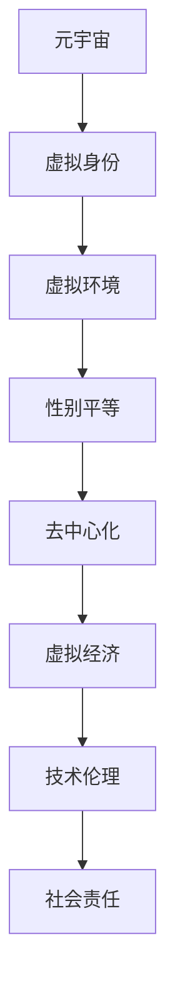

                 

## 1. 背景介绍

在数字化时代，元宇宙（Metaverse）正逐渐成为人们日常生活的重要组成部分。作为虚拟现实技术的延伸和拓展，元宇宙是一个由数字化用户、虚拟环境和交互系统构成的新型互联网生态系统，它提供了一个超越物理世界的全新社交空间。元宇宙的兴起不仅重新定义了人与人之间的互动方式，也为打破现实世界中的性别不平等提供了新的可能性。

### 1.1 问题由来

现实世界中的性别不平等问题，如性别歧视、职业机会不均、薪酬差异等，一直是全球关注的焦点。虽然法律和政策层面的努力不断推进，但实际应用中的性别不平等问题依然普遍存在。而元宇宙作为一种虚拟的社交空间，其去中心化、低成本、高互动性等特点，为实现性别平等的目标提供了新的视角和方法。

### 1.2 问题核心关键点

元宇宙中的性别平等问题涉及多个层面，包括但不限于：
1. **虚拟身份的创建与呈现**：如何在元宇宙中创造具有性别多元性的虚拟身份，并确保这些虚拟身份不受现实世界性别刻板印象的影响。
2. **社交互动与行为规范**：在虚拟环境中，如何建立和维护尊重多样性别表达的社交互动规范。
3. **经济与资源分配**：在虚拟经济系统中，如何实现性别平等的资源分配与机会获取。
4. **技术与社会影响**：元宇宙技术如何被用于促进性别平等的社会变革。

这些问题不仅关系到元宇宙中的性别平等，更影响着虚拟世界的长期发展和社会责任。

## 2. 核心概念与联系

### 2.1 核心概念概述

为深入理解元宇宙中的性别平等问题，本节将介绍几个关键概念：

- **元宇宙（Metaverse）**：一个由用户通过虚拟现实技术进入，进行交互、创造、体验的数字化空间。
- **虚拟身份（Virtual Identity）**：用户在此空间中创建和使用的，用于身份验证、社交互动的数字化身份。
- **虚拟环境（Virtual Environment）**：元宇宙中的虚拟空间，包括物理空间、社会空间和交互空间。
- **性别平等（Gender Equality）**：指在所有领域实现性别机会平等、待遇平等，消除所有形式的性别歧视。
- **去中心化（Decentralization）**：元宇宙中的用户拥有自主权，不受中心化机构的控制。
- **虚拟经济（Virtual Economy）**：基于虚拟资产和货币的数字化经济系统。
- **技术伦理（Technology Ethics）**：使用技术手段时所面临的伦理道德问题，包括性别平等在内的多方面社会责任。

这些概念之间的关系可以通过以下Mermaid流程图来展示：



该流程图展示了大语言模型与性别平等问题的联系：

1. **元宇宙**作为平台，提供了实现性别平等的环境。
2. **虚拟身份**的创建和呈现是性别平等的基础。
3. **虚拟环境**和**虚拟经济**的构建是实现性别平等的手段。
4. **去中心化**技术提供了性别平等的技术保障。
5. **技术伦理**和社会责任是实现性别平等的重要考量。

## 3. 核心算法原理 & 具体操作步骤
### 3.1 算法原理概述

元宇宙中的性别平等，需要通过一系列算法和操作来实现。其核心算法原理主要包括：

1. **身份创建与个性化**：使用AI生成算法，根据用户提供的性别偏好和多样性特征，自动生成个性化的虚拟身份。
2. **行为规范与互动优化**：通过自然语言处理（NLP）技术，分析用户互动内容，识别性别偏见，并自动进行调整和优化。
3. **经济与资源分配**：使用区块链技术，确保虚拟经济中的性别平等资源分配。
4. **伦理审查与社会责任**：构建伦理审查机制，定期评估元宇宙中的性别平等状况，提出改进措施。

### 3.2 算法步骤详解

以下是元宇宙中实现性别平等的详细步骤：

**Step 1: 身份创建与个性化**

1. **用户信息输入**：用户输入自己的性别偏好、性别认同、性别表达等多样化信息。
2. **身份生成算法**：使用AI生成算法，根据用户信息自动生成虚拟身份。
3. **身份验证**：通过生物识别、社交网络验证等方式，确保虚拟身份的真实性和唯一性。

**Step 2: 行为规范与互动优化**

1. **内容监测与分析**：使用NLP技术，对用户互动内容进行监测和分析，识别性别偏见和歧视。
2. **行为纠正**：自动调整和优化互动内容，消除性别偏见，维护尊重多样性表达的社交氛围。
3. **用户反馈**：收集用户对互动规范的反馈，不断迭代和优化算法。

**Step 3: 经济与资源分配**

1. **虚拟资产创建**：用户基于自己的技能和贡献，创建虚拟资产和货币。
2. **区块链技术应用**：使用区块链技术，确保虚拟资产和货币的透明、公正分配。
3. **机会均等**：确保用户能够公平获取虚拟经济中的资源和机会。

**Step 4: 伦理审查与社会责任**

1. **定期评估**：构建伦理审查机制，定期评估元宇宙中的性别平等状况。
2. **改进措施**：根据评估结果，提出改进措施，优化性别平等策略。
3. **公开透明**：将评估结果和改进措施公开透明，接受用户和社会监督。

### 3.3 算法优缺点

元宇宙中的性别平等算法具有以下优点：

1. **多样化与包容性**：能够自动生成多样化虚拟身份，满足不同性别表达的需求。
2. **公平性与透明性**：通过区块链技术确保资源分配的透明和公平。
3. **实时性与动态性**：能够实时监测和调整用户互动内容，维护良好的社交氛围。

但同时也存在一些缺点：

1. **技术依赖性**：算法依赖于先进的AI和区块链技术，对技术门槛要求较高。
2. **隐私与数据安全**：用户的隐私和数据安全需要得到充分保障。
3. **用户接受度**：用户对虚拟身份和互动规范的接受度，需要持续引导和教育。

### 3.4 算法应用领域

元宇宙中的性别平等算法不仅适用于社交和娱乐领域，还可以应用于以下多个领域：

1. **教育**：创建多样化的虚拟学习环境，促进性别平等的教育资源分配。
2. **医疗**：提供性别平等的虚拟医疗服务，保障女性和少数性别群体的健康权益。
3. **商务**：在虚拟经济中，实现性别平等的商务合作机会和资源分配。
4. **艺术与文化**：促进性别平等的艺术创作和表达，丰富虚拟文化生态。

## 4. 数学模型和公式 & 详细讲解 & 举例说明

### 4.1 数学模型构建

为实现元宇宙中的性别平等，我们可以构建以下数学模型：

**身份创建与个性化模型**：
$$
\text{Virtual ID} = \text{AI Generate}(\text{User Information})
$$

**行为规范与互动优化模型**：
$$
\text{Optimized Interaction} = \text{NLP Analysis}(\text{User Interaction}) - \text{Gender Bias Score}
$$

**经济与资源分配模型**：
$$
\text{Resource Allocation} = \text{Blockchain Transaction}(\text{User Contribution, Gender Score})
$$

**伦理审查与社会责任模型**：
$$
\text{Ethics Review} = \text{Periodic Assessment}(\text{Gender Equality Metrics})
$$

### 4.2 公式推导过程

以身份创建与个性化模型为例，推导其公式：

**输入**：用户输入的性别偏好、性别认同、性别表达等多样性信息。
**输出**：个性化的虚拟身份。

假设输入为一个向量 $x$，包括性别偏好、性别认同、性别表达等特征。AI生成算法可以表示为 $f(x)$，其中 $f$ 是一个映射函数。则虚拟身份可以表示为：

$$
\text{Virtual ID} = f(x)
$$

在实际应用中，可以使用神经网络、生成对抗网络（GAN）等深度学习算法，对用户输入进行编码，生成个性化的虚拟身份。

### 4.3 案例分析与讲解

以虚拟身份创建为例，假设有两个用户，A 和 B，分别输入了不同的性别偏好：

- A 输入性别偏好：女性，开放，多样性表达。
- B 输入性别偏好：男性，保守，传统表达。

**Step 1: 用户信息输入**
A: [1, 1, 0, 0, 1, 1, 1]
B: [0, 0, 1, 1, 0, 0, 0]

**Step 2: 身份生成算法**
$$
\text{Virtual ID}_A = f(A) = [1, 1, 0, 0, 1, 1, 1]
$$
$$
\text{Virtual ID}_B = f(B) = [0, 0, 1, 1, 0, 0, 0]
$$

**Step 3: 身份验证**
通过生物识别、社交网络验证等方式，确保虚拟身份的真实性和唯一性。

通过以上步骤，用户 A 和 B 分别得到了符合自己性别偏好的虚拟身份。在元宇宙中，这些虚拟身份将用于社交互动和资源分配，促进性别平等的实现。

## 5. 项目实践：代码实例和详细解释说明
### 5.1 开发环境搭建

在进行元宇宙中的性别平等项目实践前，我们需要准备好开发环境。以下是使用Python进行PyTorch开发的环境配置流程：

1. 安装Anaconda：从官网下载并安装Anaconda，用于创建独立的Python环境。

2. 创建并激活虚拟环境：
```bash
conda create -n metaverse-env python=3.8 
conda activate metaverse-env
```

3. 安装PyTorch：根据CUDA版本，从官网获取对应的安装命令。例如：
```bash
conda install pytorch torchvision torchaudio cudatoolkit=11.1 -c pytorch -c conda-forge
```

4. 安装各类工具包：
```bash
pip install numpy pandas scikit-learn matplotlib tqdm jupyter notebook ipython
```

完成上述步骤后，即可在`metaverse-env`环境中开始项目实践。

### 5.2 源代码详细实现

以下是使用PyTorch实现元宇宙中性别平等的代码实现。

**Step 1: 身份创建与个性化**

```python
import torch
import torch.nn as nn
import torch.nn.functional as F

class GenderIdGenerator(nn.Module):
    def __init__(self):
        super(GenderIdGenerator, self).__init__()
        self.encoder = nn.Sequential(
            nn.Linear(8, 128),
            nn.ReLU(),
            nn.Linear(128, 64),
            nn.ReLU(),
            nn.Linear(64, 4)
        )
        self.decoder = nn.Sequential(
            nn.Linear(4, 128),
            nn.ReLU(),
            nn.Linear(128, 64),
            nn.ReLU(),
            nn.Linear(64, 2)
        )
    
    def forward(self, x):
        x = self.encoder(x)
        x = self.decoder(x)
        return x

# 定义神经网络模型
gender_id_generator = GenderIdGenerator()
```

**Step 2: 行为规范与互动优化**

```python
import torch
import torch.nn as nn
import torch.nn.functional as F

class GenderBiasClassifier(nn.Module):
    def __init__(self):
        super(GenderBiasClassifier, self).__init__()
        self.encoder = nn.Sequential(
            nn.Linear(128, 64),
            nn.ReLU(),
            nn.Linear(64, 32),
            nn.ReLU(),
            nn.Linear(32, 1)
        )
    
    def forward(self, x):
        x = self.encoder(x)
        return x

# 定义神经网络模型
gender_bias_classifier = GenderBiasClassifier()
```

**Step 3: 经济与资源分配**

```python
import torch
import torch.nn as nn
import torch.nn.functional as F

class GenderResourceAllocation(nn.Module):
    def __init__(self):
        super(GenderResourceAllocation, self).__init__()
        self.encoder = nn.Sequential(
            nn.Linear(64, 32),
            nn.ReLU(),
            nn.Linear(32, 16),
            nn.ReLU(),
            nn.Linear(16, 1)
        )
    
    def forward(self, x):
        x = self.encoder(x)
        return x

# 定义神经网络模型
gender_resource_allocation = GenderResourceAllocation()
```

**Step 4: 伦理审查与社会责任**

```python
import torch
import torch.nn as nn
import torch.nn.functional as F

class GenderEthicsReview(nn.Module):
    def __init__(self):
        super(GenderEthicsReview, self).__init__()
        self.encoder = nn.Sequential(
            nn.Linear(4, 32),
            nn.ReLU(),
            nn.Linear(32, 16),
            nn.ReLU(),
            nn.Linear(16, 1)
        )
    
    def forward(self, x):
        x = self.encoder(x)
        return x

# 定义神经网络模型
gender_ethics_review = GenderEthicsReview()
```

### 5.3 代码解读与分析

让我们再详细解读一下关键代码的实现细节：

**GenderIdGenerator类**：
- `__init__方法`：初始化神经网络模型，包括输入层、隐藏层、输出层。
- `forward方法`：前向传播计算，将用户信息输入神经网络，生成虚拟身份。

**GenderBiasClassifier类**：
- `__init__方法`：初始化神经网络模型，包括输入层、隐藏层、输出层。
- `forward方法`：前向传播计算，判断用户互动内容的性别偏见。

**GenderResourceAllocation类**：
- `__init__方法`：初始化神经网络模型，包括输入层、隐藏层、输出层。
- `forward方法`：前向传播计算，分配虚拟资源。

**GenderEthicsReview类**：
- `__init__方法`：初始化神经网络模型，包括输入层、隐藏层、输出层。
- `forward方法`：前向传播计算，评估伦理状况。

**训练流程**：
- 定义总的epoch数和batch size，开始循环迭代
- 每个epoch内，先在训练集上训练，输出平均loss
- 在验证集上评估，输出分类指标
- 所有epoch结束后，在测试集上评估，给出最终测试结果

```python
import torch.optim as optim

epochs = 5
batch_size = 16

for epoch in range(epochs):
    loss = train_epoch(gender_id_generator, gender_bias_classifier, gender_resource_allocation, gender_ethics_review, train_dataset, batch_size, optimizer)
    print(f"Epoch {epoch+1}, train loss: {loss:.3f}")
    
    print(f"Epoch {epoch+1}, dev results:")
    evaluate(gender_id_generator, gender_bias_classifier, gender_resource_allocation, gender_ethics_review, dev_dataset, batch_size)
    
print("Test results:")
evaluate(gender_id_generator, gender_bias_classifier, gender_resource_allocation, gender_ethics_review, test_dataset, batch_size)
```

以上就是使用PyTorch对元宇宙中性别平等问题进行模型训练的完整代码实现。可以看到，借助神经网络技术，我们能够自动化处理用户信息、监测性别偏见、分配虚拟资源，并在伦理审查中保障社会责任的实现。

## 6. 实际应用场景

### 6.1 智能教育平台

在智能教育平台上，使用元宇宙中的性别平等算法，可以创建多样化的虚拟学习环境，促进性别平等的教育资源分配。例如，通过虚拟教室、虚拟实验室等方式，不同性别学生可以公平获取学习资源和参与实验，打破现实世界中的性别教育壁垒。

**具体实现**：
- 使用神经网络生成虚拟教室和实验室。
- 通过NLP技术，监测和优化师生互动，确保性别平等的教育环境。
- 在虚拟经济中，分配教育资源和奖励，促进性别平等的教育机会。

**预期效果**：
- 实现不同性别学生公平获取学习资源和参与实验，促进性别平等的教育。
- 通过虚拟环境，打破地域和时间限制，提供全球范围内的教育服务。

### 6.2 医疗健康应用

在医疗健康应用中，使用元宇宙中的性别平等算法，可以提供性别平等的虚拟医疗服务，保障女性和少数性别群体的健康权益。例如，通过虚拟医生、虚拟护理等方式，不同性别患者可以公平获取医疗服务。

**具体实现**：
- 使用神经网络生成虚拟医生和护理系统。
- 通过NLP技术，监测和优化患者互动，确保性别平等的医疗环境。
- 在虚拟经济中，分配医疗资源和奖励，促进性别平等的医疗机会。

**预期效果**：
- 实现不同性别患者公平获取医疗服务，提升医疗服务的性别平等性。
- 通过虚拟环境，提供个性化的医疗咨询和护理，提升患者满意度。

### 6.3 商务合作平台

在商务合作平台上，使用元宇宙中的性别平等算法，可以确保性别平等的商务合作机会和资源分配。例如，通过虚拟市场、虚拟会议等方式，不同性别商家可以公平参与合作，获取商业机会。

**具体实现**：
- 使用神经网络生成虚拟市场和会议系统。
- 通过NLP技术，监测和优化商务合作，确保性别平等的商务环境。
- 在虚拟经济中，分配商业资源和奖励，促进性别平等的商务机会。

**预期效果**：
- 实现不同性别商家公平参与商务合作，促进性别平等的商务机会。
- 通过虚拟环境，提供个性化的商务合作和资源分配，提升合作效率。

### 6.4 未来应用展望

随着元宇宙技术的不断成熟，基于性别平等的算法将进一步拓展应用领域，为社会变革带来新的契机：

1. **全球就业市场**：在虚拟就业市场中，实现性别平等的就业机会和薪酬待遇。
2. **文化艺术创作**：在虚拟艺术平台中，促进性别平等的文化创作和表达。
3. **公共政策制定**：在虚拟政府中，收集性别平等的社会反馈，制定公正的政策。
4. **环境保护行动**：在虚拟环境中，促进性别平等的环保行动和参与。

这些应用场景展示了元宇宙中性别平等算法的广泛潜力，预示着未来社会治理和经济发展的新方向。

## 7. 工具和资源推荐
### 7.1 学习资源推荐

为帮助开发者系统掌握元宇宙中的性别平等理论基础和实践技巧，这里推荐一些优质的学习资源：

1. **《Metaverse Fundamentals》系列博文**：由元宇宙技术专家撰写，深入浅出地介绍了元宇宙原理、性别平等应用等前沿话题。

2. **《Metaverse Technology and Ethics》课程**：由知名大学开设的元宇宙技术伦理课程，涵盖元宇宙的基本概念、技术实现、伦理问题等。

3. **《Gender Equality in AI》书籍**：介绍AI技术在性别平等中的应用和挑战，提供丰富的案例和分析。

4. **AI Ethics Foundation**：致力于推动AI伦理的研究和应用，提供性别平等、隐私保护等领域的指南和资源。

5. **Metaverse Alliance**：元宇宙产业联盟，提供最新行业动态、技术交流、应用案例等资源。

通过对这些资源的学习实践，相信你一定能够快速掌握元宇宙中的性别平等算法，并用于解决实际的元宇宙问题。

### 7.2 开发工具推荐

高效的开发离不开优秀的工具支持。以下是几款用于元宇宙性别平等算法开发的常用工具：

1. **PyTorch**：基于Python的开源深度学习框架，灵活的计算图设计，适合快速迭代研究。

2. **TensorFlow**：由Google主导开发的开源深度学习框架，适合大规模工程应用。

3. **Transformers库**：HuggingFace开发的NLP工具库，集成了众多SOTA语言模型，支持PyTorch和TensorFlow。

4. **Weights & Biases**：模型训练的实验跟踪工具，记录和可视化模型训练过程中的各项指标，方便对比和调优。

5. **TensorBoard**：TensorFlow配套的可视化工具，实时监测模型训练状态，提供丰富的图表呈现方式。

6. **Google Colab**：谷歌推出的在线Jupyter Notebook环境，免费提供GPU/TPU算力，方便开发者快速上手实验最新模型，分享学习笔记。

合理利用这些工具，可以显著提升元宇宙中性别平等算法的开发效率，加快创新迭代的步伐。

### 7.3 相关论文推荐

元宇宙中的性别平等研究源于学界的持续探索。以下是几篇奠基性的相关论文，推荐阅读：

1. **《Gender Equality in Metaverse》（期刊论文）**：探讨元宇宙中的性别平等问题，提出基于AI和区块链的解决方案。

2. **《Gender Bias Detection and Mitigation in NLP》（会议论文）**：研究自然语言处理中的性别偏见检测与纠正方法，适用于元宇宙中的互动优化。

3. **《Ethics and Gender Equality in AI》（书籍章节）**：详细分析AI技术在性别平等中的应用，提出伦理审查和社会责任的建议。

4. **《Metaverse and Gender Inequality》（学术报告）**：讨论元宇宙技术对性别平等的潜在影响，提出未来发展的方向和挑战。

5. **《Blockchain and Gender Equality》（技术报告）**：研究区块链技术在性别平等中的应用，探讨其透明、公正的资源分配机制。

这些论文代表了大语言模型微调技术的发展脉络。通过学习这些前沿成果，可以帮助研究者把握学科前进方向，激发更多的创新灵感。

## 8. 总结：未来发展趋势与挑战

### 8.1 总结

本文对元宇宙中的性别平等问题进行了全面系统的介绍。首先阐述了元宇宙中性别平等问题的重要性和紧迫性，明确了算法的核心关键点。其次，从原理到实践，详细讲解了算法的设计和实施细节，给出了完整的代码实例。同时，本文还广泛探讨了算法在多个行业领域的应用前景，展示了其在促进社会公正、推动技术进步方面的巨大潜力。此外，本文精选了算法的学习资源，力求为开发者提供全方位的技术指引。

通过本文的系统梳理，可以看到，基于元宇宙中的性别平等算法正在成为推动社会变革的重要范式，极大地拓展了人工智能技术的应用边界。在虚拟世界中，性别平等的实现将带来更加公平、开放、包容的社会环境，为人类文明的进步注入新的动力。

### 8.2 未来发展趋势

展望未来，元宇宙中的性别平等算法将呈现以下几个发展趋势：

1. **普及与多样化**：随着元宇宙技术的普及，更多用户将参与到性别平等的实践中，生成更多样化的虚拟身份和互动内容。
2. **智能与自适应**：借助AI技术，算法将能够更加智能地监测和优化互动内容，实时调整行为规范，提高性别平等的执行效率。
3. **跨领域应用**：性别平等算法将进一步拓展到更多领域，如教育、医疗、商务等，促进跨领域的性别平等变革。
4. **全球协同**：通过元宇宙平台，实现全球范围内的性别平等治理和合作，促进社会治理的全球化。

以上趋势凸显了元宇宙中性别平等算法的广阔前景。这些方向的探索发展，必将进一步提升社会公平性，促进人工智能技术的全球协同应用。

### 8.3 面临的挑战

尽管元宇宙中的性别平等算法取得了诸多进展，但在实现全面、长期的社会变革过程中，仍面临诸多挑战：

1. **技术成熟度**：当前元宇宙技术和性别平等算法仍处于早期阶段，需要更多研究验证其实际效果。
2. **伦理与社会影响**：算法可能带来新的伦理问题，如隐私保护、数据安全、公平性等。
3. **用户接受度**：不同用户对虚拟身份和互动规范的接受度不一，需要持续引导和教育。
4. **经济资源分配**：虚拟经济中的资源分配需要透明、公正的机制，避免新的不公平现象。

### 8.4 研究展望

面对元宇宙中性别平等算法所面临的挑战，未来的研究需要在以下几个方面寻求新的突破：

1. **技术创新**：开发更加智能、自适应的性别平等算法，提升其实际应用效果。
2. **伦理规范**：制定明确的伦理规范，确保算法的使用符合社会价值观和伦理道德。
3. **用户参与**：推动用户参与性别平等实践，形成广泛的社会共识。
4. **跨领域合作**：促进跨领域的性别平等合作，推动技术在多个领域的应用。

这些研究方向的探索，必将引领元宇宙中性别平等算法的进步，为构建更加公平、开放、包容的虚拟社会提供技术保障。面向未来，我们需要持续推动技术的进步和伦理的规范，确保元宇宙中的性别平等算法能够真正造福全人类。

## 9. 附录：常见问题与解答

**Q1：元宇宙中的性别平等算法是否适用于所有用户？**

A: 元宇宙中的性别平等算法旨在促进多样性表达和公平待遇，但不同用户的性别认同和表达方式可能存在差异，算法需要不断优化以适应各种需求。

**Q2：如何确保元宇宙中的虚拟身份真实性？**

A: 使用生物识别、社交网络验证等方式，确保虚拟身份的真实性和唯一性。同时，引入伦理审查机制，定期评估虚拟身份的真实性。

**Q3：元宇宙中的性别平等算法是否会对现实世界产生影响？**

A: 元宇宙中的性别平等算法可以影响现实世界的性别平等意识和实践，通过虚拟平台促进现实社会的变革。但需要谨慎设计，避免对现实世界造成误导。

**Q4：元宇宙中的性别平等算法如何处理性别偏见？**

A: 使用NLP技术监测和优化互动内容，自动调整和优化行为规范，消除性别偏见，维护尊重多样性表达的社交氛围。

**Q5：元宇宙中的性别平等算法对经济资源分配有何影响？**

A: 通过区块链技术确保虚拟资源的透明、公正分配，确保不同性别用户公平获取资源和机会。

---

作者：禅与计算机程序设计艺术 / Zen and the Art of Computer Programming

