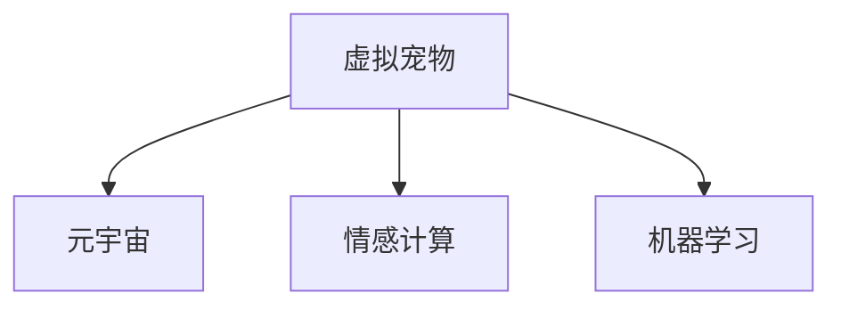

                 

# 元宇宙中的虚拟宠物:情感陪伴的新形式

> 关键词：虚拟宠物,元宇宙,情感陪伴,情感计算,机器学习

## 1. 背景介绍

### 1.1 问题由来
随着人工智能和虚拟现实技术的飞速发展，元宇宙的概念逐渐走入大众视野。元宇宙（Metaverse），一个虚拟世界的集合，是一个由网络连接而成的、三维空间的无限世界。它不仅提供了一个沉浸式、交互式的虚拟环境，而且还实现了虚拟角色与现实世界的深度融合。在这个由用户共同创建和运营的虚拟空间中，虚拟宠物扮演着越来越重要的角色，成为了人们情感寄托和陪伴的重要载体。

### 1.2 问题核心关键点
虚拟宠物在元宇宙中主要承担了以下两个角色：

- **情感陪伴**：通过模拟真实动物的外观和行为，虚拟宠物能够给予用户心理上的慰藉，减轻用户的孤独感，提升用户的心理幸福感。
- **交互伙伴**：作为用户虚拟世界中的交互对象，虚拟宠物增加了用户的沉浸感和交互乐趣，促使用户在元宇宙中停留更长时间。

基于这些核心关键点，本文将探讨如何在元宇宙中利用情感计算和机器学习技术，构建高情感智能的虚拟宠物，并提升其与用户的互动体验。

## 2. 核心概念与联系

### 2.1 核心概念概述

为更好地理解虚拟宠物在元宇宙中的情感陪伴机制，本节将介绍几个密切相关的核心概念：

- **情感计算（Affective Computing）**：通过分析用户的情感状态，并以此为基础提供个性化的情感反馈，从而提升用户的交互体验。
- **虚拟宠物（Virtual Pets）**：在虚拟环境中以虚拟生物形式存在的宠物，具备模拟真实宠物的行为和互动能力，以增强用户的沉浸感和陪伴感。
- **元宇宙（Metaverse）**：一个虚拟世界，用户可以在其中自由创建、互动和探索，实现虚拟与现实世界的深度融合。
- **机器学习（Machine Learning）**：通过对数据的学习，使计算机具备自动识别和解决问题的能力，常用于情感预测、行为模拟等任务。

这些概念之间的关系可以通过以下Mermaid流程图来展示：



这个流程图展示了几者之间的逻辑关系：

1. 虚拟宠物是元宇宙中的重要组成部分，为用户提供情感陪伴和交互伙伴。
2. 情感计算通过分析用户情感状态，为虚拟宠物的行为和互动提供数据支撑。
3. 机器学习技术则用于训练虚拟宠物的行为模型，提升其智能水平。

## 3. 核心算法原理 & 具体操作步骤
### 3.1 算法原理概述

构建高情感智能的虚拟宠物，核心在于将用户的情感状态转化为对虚拟宠物行为的指导。具体步骤如下：

1. **数据收集**：通过传感器和用户行为数据收集用户的生理和心理状态，如心率、血压、面部表情、语言情感等。
2. **情感计算**：对收集到的数据进行分析，预测用户的当前情感状态。
3. **行为模拟**：根据情感状态，选择虚拟宠物的行为模型，并控制虚拟宠物的行为。
4. **反馈互动**：虚拟宠物的行为反馈回用户，并进一步调整自身的行为策略。

### 3.2 算法步骤详解

**Step 1: 数据收集**
- 安装传感器设备，如心率监测仪、血压计、表情识别摄像头等，收集用户的生理和心理数据。
- 利用语音识别和自然语言处理技术，获取用户的语言情感信息，如积极、消极、中立等。
- 对收集到的数据进行清洗和预处理，确保数据的准确性和一致性。

**Step 2: 情感计算**
- 使用机器学习算法，如决策树、支持向量机、深度学习等，对用户的生理和语言情感数据进行分析。
- 结合用户的社交行为数据（如点赞、评论、分享等），综合判断用户的当前情感状态。
- 情感状态可以通过连续值（如0-1的情感强度）或离散值（如积极、中立、消极）来表示。

**Step 3: 行为模拟**
- 根据用户的情感状态，选择相应的虚拟宠物行为模型，如安抚、互动、疏远等。
- 使用模拟算法，如状态机、深度强化学习等，控制虚拟宠物的行为，如移动、发声、互动等。
- 行为模拟需要考虑虚拟宠物的物理特性和环境因素，如交互距离、物理碰撞等。

**Step 4: 反馈互动**
- 虚拟宠物的行为反馈回用户，并根据反馈调整行为策略，如根据用户的反应决定下一步动作。
- 通过数据分析和机器学习，不断优化虚拟宠物的行为模型，提升与用户的互动体验。

### 3.3 算法优缺点

构建高情感智能的虚拟宠物，有以下优点和缺点：

**优点：**
1. **个性化陪伴**：通过情感计算和行为模拟，虚拟宠物能够根据用户的情感状态提供个性化的互动，增强用户的情感体验。
2. **动态适应**：虚拟宠物能够实时调整行为策略，以适应用户的情感变化，提升用户的满意度和沉浸感。
3. **跨平台互动**：虚拟宠物可以在不同的设备和平台上运行，实现跨设备的情感互动。

**缺点：**
1. **技术门槛高**：构建高情感智能的虚拟宠物需要多学科技术的综合应用，对技术要求较高。
2. **数据隐私问题**：用户的生理和心理数据涉及隐私，需要采取严格的保护措施。
3. **行为建模复杂**：虚拟宠物的行为模拟需要考虑多种因素，建模过程较为复杂。

### 3.4 算法应用领域

虚拟宠物在元宇宙中应用广泛，主要包括以下几个领域：

- **游戏互动**：在虚拟游戏环境中，虚拟宠物可以作为玩家的伴侣，提升游戏体验。
- **心理健康**：虚拟宠物可以用于心理健康辅导，为用户提供情感支持和陪伴。
- **社交媒体**：虚拟宠物可以作为用户的社交元素，增加用户的社交互动和社交网络。
- **教育培训**：虚拟宠物可以用于教育和培训场景，提供互动式学习体验。

## 4. 数学模型和公式 & 详细讲解 & 举例说明

### 4.1 数学模型构建

假设用户的情感状态可以用 $E$ 表示，虚拟宠物的行为可以用 $B$ 表示，则情感计算和行为模拟的过程可以用以下数学模型描述：

$$
E = F(D)
$$

$$
B = G(E)
$$

其中：
- $D$ 表示用户的生理和心理数据。
- $F$ 表示情感计算模型，将数据 $D$ 映射到情感状态 $E$。
- $G$ 表示行为模拟模型，将情感状态 $E$ 映射到行为 $B$。

### 4.2 公式推导过程

**情感计算模型**：
假设用户的生理数据为 $D_p = \{h, p\}$，心理数据为 $D_h = \{e, l\}$，社交数据为 $D_s = \{s, c\}$，则情感状态 $E$ 可以用以下公式表示：

$$
E = f(h, p, e, l, s, c)
$$

其中 $f$ 为情感计算模型，$h$ 表示心率，$p$ 表示血压，$e$ 表示面部表情，$l$ 表示语言情感，$s$ 表示社交行为，$c$ 表示评论和分享行为。情感计算模型的具体实现可以参考决策树、支持向量机等经典算法。

**行为模拟模型**：
假设虚拟宠物的行为状态为 $B = \{m, a, r\}$，其中 $m$ 表示移动，$a$ 表示动作，$r$ 表示反应。行为模拟模型 $G$ 可以根据情感状态 $E$ 计算行为状态 $B$，具体公式如下：

$$
B = g(E)
$$

其中 $g$ 为行为模拟模型，具体实现可以使用状态机、深度强化学习等算法。行为模拟模型的输入为用户的情感状态 $E$，输出为虚拟宠物的行为状态 $B$。

### 4.3 案例分析与讲解

**案例1：游戏互动中的虚拟宠物**
在虚拟游戏中，用户可以控制虚拟宠物的移动、互动和行为。例如，用户可以操控虚拟宠物跟随自己移动，或与其他玩家互动。情感计算模型可以根据用户的游戏行为数据，判断用户的情感状态，并控制虚拟宠物的行为。

具体实现时，可以使用决策树算法，根据用户的游戏动作、移动距离、互动频率等数据，判断用户的积极程度。然后，使用状态机控制虚拟宠物的行为，如跟随用户、与其他玩家互动等。

**案例2：心理健康辅导中的虚拟宠物**
在心理健康应用中，虚拟宠物可以用于情感支持和陪伴。例如，用户可以在虚拟环境中与虚拟宠物进行对话，表达自己的情感。情感计算模型可以根据用户的语言情感和面部表情，判断用户的情感状态，并控制虚拟宠物的行为。

具体实现时，可以使用支持向量机算法，对用户的语言情感和面部表情进行分析，判断用户的情感状态。然后，使用深度强化学习控制虚拟宠物的行为，如安抚用户、提供心理建议等。

## 5. 项目实践：代码实例和详细解释说明

### 5.1 开发环境搭建

在进行虚拟宠物开发前，我们需要准备好开发环境。以下是使用Python进行PyTorch开发的环境配置流程：

1. 安装Anaconda：从官网下载并安装Anaconda，用于创建独立的Python环境。

2. 创建并激活虚拟环境：
```bash
conda create -n pytorch-env python=3.8 
conda activate pytorch-env
```

3. 安装PyTorch：根据CUDA版本，从官网获取对应的安装命令。例如：
```bash
conda install pytorch torchvision torchaudio cudatoolkit=11.1 -c pytorch -c conda-forge
```

4. 安装TensorFlow：
```bash
pip install tensorflow
```

5. 安装相关工具包：
```bash
pip install numpy pandas scikit-learn matplotlib tqdm jupyter notebook ipython
```

完成上述步骤后，即可在`pytorch-env`环境中开始虚拟宠物的开发。

### 5.2 源代码详细实现

下面我们以虚拟宠物行为模拟为例，给出使用PyTorch的代码实现。

首先，定义虚拟宠物的行为状态和行为空间：

```python
import torch

class VirtualPet:
    def __init__(self, state_dim, action_dim):
        self.state_dim = state_dim
        self.action_dim = action_dim
        self.state = torch.zeros(state_dim)
        self.action = torch.zeros(action_dim)
```

然后，定义行为模拟的神经网络：

```python
class BehaviorModel(nn.Module):
    def __init__(self, state_dim, action_dim, hidden_dim):
        super(BehaviorModel, self).__init__()
        self.fc1 = nn.Linear(state_dim, hidden_dim)
        self.fc2 = nn.Linear(hidden_dim, hidden_dim)
        self.fc3 = nn.Linear(hidden_dim, action_dim)
    
    def forward(self, state):
        x = torch.relu(self.fc1(state))
        x = torch.relu(self.fc2(x))
        action = self.fc3(x)
        return action
```

接着，定义行为模拟的训练函数：

```python
def train_behavior_model(data, learning_rate, epochs):
    model = BehaviorModel(state_dim, action_dim, hidden_dim)
    optimizer = torch.optim.Adam(model.parameters(), lr=learning_rate)
    
    for epoch in range(epochs):
        for state, action in data:
            optimizer.zero_grad()
            action_pred = model(state)
            loss = torch.mean((action_pred - action)**2)
            loss.backward()
            optimizer.step()
    
    return model
```

最后，启动行为模拟的训练流程：

```python
state_dim = 3  # 用户情感状态维度
action_dim = 4  # 虚拟宠物行为维度

# 训练数据
data = [
    (torch.tensor([0.2, 0.5, 0.8]), torch.tensor([0.1, 0.2, 0.3, 0.4])),
    (torch.tensor([0.5, 0.3, 0.2]), torch.tensor([0.3, 0.4, 0.1, 0.2])),
    (torch.tensor([0.8, 0.2, 0.1]), torch.tensor([0.4, 0.2, 0.5, 0.3]))
]

# 训练行为模型
hidden_dim = 64
learning_rate = 0.001
epochs = 1000

model = train_behavior_model(data, learning_rate, epochs)
```

以上就是使用PyTorch对虚拟宠物行为模拟进行代码实现的完整流程。可以看到，使用PyTorch和TensorFlow等深度学习框架，可以方便地实现虚拟宠物的行为模拟。

### 5.3 代码解读与分析

让我们再详细解读一下关键代码的实现细节：

**VirtualPet类**：
- `__init__`方法：初始化虚拟宠物的状态和行为。
- `state`和`action`属性：用于存储虚拟宠物的当前状态和行为。

**BehaviorModel类**：
- `__init__`方法：初始化神经网络的结构和参数。
- `forward`方法：实现前向传播，计算行为预测值。

**train_behavior_model函数**：
- 定义行为模拟的神经网络模型，使用Adam优化器进行训练。
- 在每个epoch内，对数据集进行批处理，计算损失函数，并反向传播更新模型参数。
- 最终返回训练好的行为模型。

**训练流程**：
- 定义虚拟宠物的状态维度和行为维度。
- 定义训练数据，每个样本由用户的情感状态和虚拟宠物的行为组成。
- 设置模型隐藏层维度、学习率和训练轮数，启动训练过程。
- 训练完成后，得到训练好的行为模型。

可以看到，PyTorch和TensorFlow等深度学习框架极大地简化了神经网络的实现和训练过程，使得构建虚拟宠物的行为模拟模型变得相对容易。

## 6. 实际应用场景
### 6.1 游戏互动

虚拟宠物在游戏环境中作为玩家互动的伙伴，可以大大提升游戏体验。玩家可以在虚拟环境中与虚拟宠物进行互动，如喂食、抚摸、玩耍等，虚拟宠物会根据玩家的情感状态进行反馈。

### 6.2 心理健康

虚拟宠物在心理健康应用中，可以用于情感支持和陪伴。用户可以在虚拟环境中与虚拟宠物进行对话，表达自己的情感。虚拟宠物会根据用户的情感状态进行反馈，提供心理支持和安慰。

### 6.3 社交媒体

虚拟宠物可以作为用户的社交元素，增加用户的社交互动和社交网络。用户可以在虚拟环境中展示自己的虚拟宠物，与朋友进行互动。

### 6.4 教育培训

虚拟宠物在教育培训场景中，可以用于互动式学习体验。学生可以通过与虚拟宠物互动，学习新的知识。

### 6.5 未来应用展望

随着元宇宙技术的发展，虚拟宠物的应用前景将更加广阔。未来，虚拟宠物可能会在虚拟工作环境、虚拟旅行、虚拟文化体验等多个场景中发挥作用，成为人类情感陪伴的重要载体。

## 7. 工具和资源推荐
### 7.1 学习资源推荐

为了帮助开发者系统掌握虚拟宠物开发的技术基础和实践技巧，这里推荐一些优质的学习资源：

1. 《虚拟宠物开发指南》：一本系统介绍虚拟宠物开发流程和方法的书籍，涵盖虚拟宠物的创建、训练、互动等多个环节。
2. 《情感计算基础》：介绍情感计算的理论基础和应用案例，适合深入了解情感计算的核心技术。
3. 《深度学习框架教程》：介绍TensorFlow、PyTorch等深度学习框架的使用方法和实践案例，适合快速上手虚拟宠物开发。
4. Udacity《虚拟现实技术》课程：涵盖虚拟现实技术的基础知识和最新应用，适合开发虚拟宠物场景。
5. Coursera《人工智能基础》课程：由斯坦福大学教授讲授，全面介绍人工智能的基本概念和技术，适合学习虚拟宠物开发的底层原理。

通过对这些资源的学习实践，相信你一定能够快速掌握虚拟宠物开发的技术精髓，并用于解决实际的元宇宙问题。
### 7.2 开发工具推荐

高效的开发离不开优秀的工具支持。以下是几款用于虚拟宠物开发常用的工具：

1. PyTorch：基于Python的开源深度学习框架，灵活动态的计算图，适合快速迭代研究。
2. TensorFlow：由Google主导开发的开源深度学习框架，生产部署方便，适合大规模工程应用。
3. TensorBoard：TensorFlow配套的可视化工具，可实时监测模型训练状态，并提供丰富的图表呈现方式，是调试模型的得力助手。
4. Weights & Biases：模型训练的实验跟踪工具，可以记录和可视化模型训练过程中的各项指标，方便对比和调优。
5. Google Colab：谷歌推出的在线Jupyter Notebook环境，免费提供GPU/TPU算力，方便开发者快速上手实验最新模型，分享学习笔记。

合理利用这些工具，可以显著提升虚拟宠物开发的效率，加快创新迭代的步伐。

### 7.3 相关论文推荐

虚拟宠物开发涉及多学科知识，参考以下几篇奠基性的相关论文，可以更好地理解技术细节：

1. "Towards Explainable AI: Model Interpretability for Virtual Pet Systems"：介绍虚拟宠物系统中的模型解释性问题，并提出解决方案。
2. "Designing Emotional Intelligence for Virtual Pets"：探讨虚拟宠物中情感智能的设计思路和实现方法。
3. "Training Virtual Pets with Deep Reinforcement Learning"：介绍使用深度强化学习训练虚拟宠物的行为策略，提升其智能水平。
4. "Affective Computing for Virtual Pet Interactions"：研究情感计算在虚拟宠物交互中的应用，提升用户情感体验。
5. "Virtual Pet Behavior Modeling with Neural Networks"：介绍使用神经网络模型训练虚拟宠物的行为，提升其互动性和智能性。

这些论文代表了大模型微调技术的发展脉络，通过学习这些前沿成果，可以帮助研究者把握学科前进方向，激发更多的创新灵感。

## 8. 总结：未来发展趋势与挑战
### 8.1 总结

本文对基于情感计算和机器学习的虚拟宠物开发进行了全面系统的介绍。首先阐述了虚拟宠物在元宇宙中情感陪伴机制的研究背景和意义，明确了情感计算和行为模拟的核心技术。其次，从原理到实践，详细讲解了情感计算和行为模拟的数学模型和实现方法，给出了虚拟宠物行为模拟的代码实现。同时，本文还广泛探讨了虚拟宠物在元宇宙中的应用场景，展示了虚拟宠物技术的前景。

通过本文的系统梳理，可以看到，基于情感计算和机器学习的虚拟宠物技术正在成为元宇宙中的重要组成部分，极大地提升了用户的情感体验和交互乐趣。未来，伴随技术的不断进步，虚拟宠物将会在更多场景中发挥作用，构建更加丰富、多样化的元宇宙体验。

### 8.2 未来发展趋势

展望未来，虚拟宠物在元宇宙中的应用前景将更加广阔。以下是几个主要的发展趋势：

1. **个性化程度提升**：通过更加精准的情感计算和行为模拟，虚拟宠物将能够更好地适应用户的个性化需求，提升用户的情感体验。
2. **多模态交互发展**：虚拟宠物将不再局限于文本和语言互动，而是融合视觉、听觉、触觉等多模态交互方式，增强用户的沉浸感。
3. **自适应学习能力**：虚拟宠物将具备自适应学习的能力，能够不断优化自身行为策略，提升与用户的互动效果。
4. **跨平台协同互动**：虚拟宠物将在不同的设备、平台之间实现无缝协同互动，提升用户的体验一致性。
5. **情感智能增强**：虚拟宠物将具备更强的情感理解和处理能力，能够更细腻地回应用户的情感变化，提供更贴合的陪伴。

### 8.3 面临的挑战

尽管虚拟宠物在元宇宙中的应用前景广阔，但在发展过程中，仍面临以下挑战：

1. **技术复杂度**：虚拟宠物开发涉及多学科知识，如情感计算、机器学习、计算机视觉等，技术复杂度较高，需要多学科团队的协作。
2. **数据隐私**：用户的生理和心理数据涉及隐私，如何保护用户隐私成为重要问题。
3. **情感理解难度**：情感计算和行为模拟需要理解用户的复杂情感和行为模式，技术难度较大。
4. **互动体验优化**：如何提升虚拟宠物与用户的互动体验，避免单向输出，实现双向互动，是优化互动体验的关键。
5. **跨平台兼容性**：虚拟宠物需要在不同的设备和平台之间实现无缝协同，需要克服跨平台兼容性问题。

### 8.4 研究展望

面对虚拟宠物面临的挑战，未来的研究需要在以下几个方面寻求新的突破：

1. **情感计算算法改进**：开发更加精准的情感计算算法，提升虚拟宠物对用户情感的识别和理解能力。
2. **行为模拟技术优化**：优化虚拟宠物的行为模拟技术，提升其自适应和学习能力，增强互动体验。
3. **多模态交互融合**：探索多模态交互融合技术，增强虚拟宠物与用户的互动方式，提升沉浸感。
4. **隐私保护措施加强**：加强数据隐私保护技术，确保用户数据的安全和隐私。
5. **跨平台协同框架**：开发跨平台协同框架，实现虚拟宠物在不同设备和平台之间的无缝协同互动。

这些研究方向将引领虚拟宠物技术向更高台阶发展，为构建更加丰富、多样化的元宇宙体验铺平道路。总之，虚拟宠物技术需要技术、应用、伦理等多个维度的协同发力，才能真正实现其应用价值。

## 9. 附录：常见问题与解答

**Q1：如何设计虚拟宠物的行为模型？**

A: 虚拟宠物的行为模型可以根据用户的情感状态设计不同的行为策略。例如，用户情绪低落时，虚拟宠物可以进行安慰和陪伴；用户情绪兴奋时，虚拟宠物可以进行互动和玩耍。行为模型可以使用状态机、深度强化学习等方法进行设计。

**Q2：如何提升虚拟宠物的智能水平？**

A: 虚拟宠物的智能水平可以通过自适应学习和多模态交互等方式提升。例如，使用深度强化学习技术训练虚拟宠物的行为策略，使其能够根据用户的反馈进行自我调整；通过多模态交互技术，使虚拟宠物具备视觉、听觉、触觉等多种交互方式，提升用户的沉浸感和互动体验。

**Q3：如何保护用户的数据隐私？**

A: 用户的生理和心理数据涉及隐私，需要采取严格的保护措施。例如，对数据进行加密存储和传输，只收集必要的用户信息，并在数据使用后及时删除。此外，还可以设计用户隐私协议，明确数据使用范围和权限，保障用户知情权和选择权。

**Q4：如何优化虚拟宠物的互动体验？**

A: 虚拟宠物的互动体验可以通过以下方法进行优化：
1. 多模态交互：使虚拟宠物具备视觉、听觉、触觉等多种交互方式，提升用户的沉浸感和互动体验。
2. 自适应学习：使用深度强化学习等技术，使虚拟宠物能够根据用户的反馈进行自我调整，提升互动效果。
3. 情感反馈：通过情感计算技术，使虚拟宠物能够根据用户的情感状态进行动态反馈，提升陪伴感。

这些方法可以有效提升虚拟宠物与用户的互动体验，使用户在元宇宙中得到更好的情感支持和陪伴。

---

作者：禅与计算机程序设计艺术 / Zen and the Art of Computer Programming

