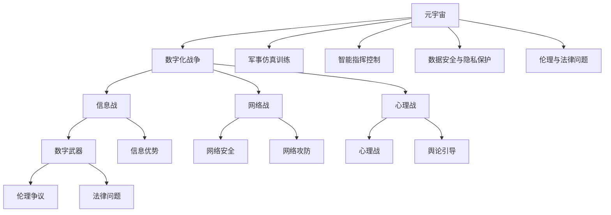
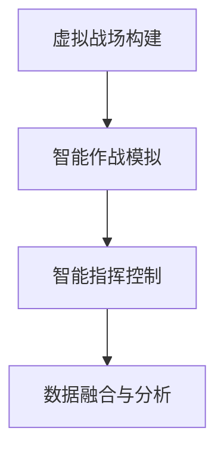

                 

# 元宇宙军备竞赛:数字化战争中的国际关系新态势

> 关键词：元宇宙,数字化战争,国际关系,军事策略,技术伦理,战略转型

## 1. 背景介绍

### 1.1 问题由来
随着科技的迅猛发展，数字化的浪潮已经深刻影响了各个领域，尤其是军事领域。传统的战争形式正在向数字化、智能化方向转变，尤其是元宇宙的兴起，为未来的军事斗争带来了全新的挑战和机遇。

元宇宙是一个虚拟世界的生态系统，通过AR/VR技术、区块链技术、云计算技术、人工智能技术等，构建一个与现实世界紧密互动的数字空间。元宇宙的虚拟世界可以提供仿真训练、情报分析、指挥控制、精确打击等多种功能，极大地提升了军事作战的效率和效果。

目前，全球主要国家都在积极布局元宇宙技术，以期在未来的数字化战争中占据先机。例如，美国国防高级研究计划局（DARPA）正在研发基于元宇宙的军事应用，通过虚拟训练增强部队的战斗力。中国也在积极推动数字军事建设，构建智慧战争体系。俄罗斯也正投入巨资，发展元宇宙技术在军事中的应用。

在这样的背景之下，元宇宙军备竞赛成为了国际关系中一个新的焦点，各大国在数字化战争中的较量已经拉开帷幕。本文将深入探讨元宇宙技术在军事中的应用，以及由此引发的国际关系新态势。

### 1.2 问题核心关键点
元宇宙技术在军事中的应用主要体现在以下几个方面：

1. **仿真训练**：利用元宇宙构建逼真的虚拟战场，实现无伤亡的作战模拟和战术演练，提升部队的实战能力。
2. **情报分析**：通过元宇宙的技术手段，实时获取和分析战场信息，为指挥决策提供支持。
3. **指挥控制**：通过元宇宙技术，实现指挥控制的智能化和协同化，提高作战效率。
4. **精确打击**：利用元宇宙的定位技术，实现精确打击，减少附带损害。
5. **心理战与信息战**：通过元宇宙构建虚拟战场，进行心理战与信息战，提升信息优势。

这些应用不仅改变了战争的形态，也引发了国际关系中的诸多问题。例如，如何保证数据的安全性和隐私性，如何防止数字武器的使用，如何在数字化战争中维持国际法和伦理准则，等等。

### 1.3 问题研究意义
研究元宇宙技术在军事中的应用及其对国际关系的影响，具有以下重要意义：

1. **推动军事变革**：元宇宙技术为军事训练、情报分析、指挥控制、精确打击提供了新的方法和手段，有助于推动军事变革，提高军事效率和战斗力。
2. **维护国家安全**：通过深入分析元宇宙技术对国际关系的影响，有助于预测未来战争趋势，制定应对策略，维护国家安全。
3. **推动国际合作**：在数字化战争中，国际合作显得尤为重要，通过研究元宇宙技术对国际关系的影响，有助于推动国际间的合作与交流。
4. **防止技术滥用**：元宇宙技术在军事中的应用可能会引发一系列伦理和法律问题，研究这些问题有助于制定合理的规范和法律，防止技术滥用。

## 2. 核心概念与联系

### 2.1 核心概念概述

为更好地理解元宇宙技术在军事中的应用及其对国际关系的影响，本节将介绍几个密切相关的核心概念：

- **元宇宙**：一个与现实世界紧密互动的数字空间，通过AR/VR、区块链、云计算、人工智能等技术构建，具有高度的真实感和互动性。
- **数字化战争**：通过数字化、智能化手段进行的战争，包括信息战、网络战、心理战等多种形式。
- **军事仿真训练**：利用虚拟现实和仿真技术，构建逼真的作战场景，实现无伤亡的作战模拟和战术演练。
- **智能指挥控制**：利用人工智能技术，实现指挥控制的智能化和协同化，提升作战效率。
- **数据安全与隐私保护**：在元宇宙技术中，数据的安全性和隐私保护成为新的挑战。
- **伦理与法律问题**：元宇宙技术在军事中的应用，可能引发一系列伦理和法律问题，如数字武器的使用、信息战的道德边界等。

这些核心概念之间的逻辑关系可以通过以下Mermaid流程图来展示：



这个流程图展示了元宇宙技术在军事中的应用及其引发的一系列问题。元宇宙技术的应用，不仅提升了军事作战的效率和效果，也引发了数据安全、隐私保护、伦理法律等新的挑战。

## 3. 核心算法原理 & 具体操作步骤
### 3.1 算法原理概述

元宇宙技术在军事中的应用，主要基于虚拟现实、仿真训练、智能控制、数据分析等技术手段。其核心算法原理包括：

1. **虚拟现实技术**：通过AR/VR设备，将士兵置于虚拟战场中，实现逼真的作战模拟和战术演练。
2. **仿真训练算法**：构建虚拟战场，通过人工智能算法生成各种战斗场景，提升士兵的实战能力。
3. **智能控制算法**：利用机器学习和深度学习算法，实现智能化的指挥控制，提高作战效率。
4. **数据分析算法**：通过大数据分析技术，实时获取和分析战场信息，为指挥决策提供支持。

这些算法原理构成了元宇宙技术在军事中的应用基础，通过这些技术手段，可以实现高度逼真的虚拟训练、高效的指挥控制和精确的战场分析，从而提升军事作战能力。

### 3.2 算法步骤详解

基于元宇宙技术在军事中的应用，算法步骤大致包括以下几个关键环节：

1. **虚拟战场构建**：通过AR/VR技术，构建逼真的虚拟战场，将士兵置于虚拟战场中，实现无伤亡的作战模拟和战术演练。
2. **智能作战模拟**：通过人工智能算法，生成各种战斗场景，提升士兵的实战能力。
3. **智能指挥控制**：利用机器学习和深度学习算法，实现智能化的指挥控制，提高作战效率。
4. **数据融合与分析**：通过大数据分析技术，实时获取和分析战场信息，为指挥决策提供支持。

具体算法步骤如图：



### 3.3 算法优缺点

元宇宙技术在军事中的应用，具有以下优点：

1. **高效逼真**：通过虚拟现实和仿真技术，可以实现无伤亡的作战模拟和战术演练，提升士兵的实战能力。
2. **智能化高**：通过人工智能算法，实现智能化的指挥控制，提高作战效率。
3. **灵活性高**：元宇宙技术可以灵活调整各种战斗场景，适应不同的作战需求。
4. **成本低**：元宇宙技术可以模拟各种战斗场景，减少实际训练成本。

但同时，也存在一些缺点：

1. **技术难度高**：构建逼真的虚拟战场和智能指挥控制需要较高的技术门槛。
2. **数据安全风险**：元宇宙技术涉及大量的数据，数据安全风险较高。
3. **伦理问题复杂**：元宇宙技术在军事中的应用，可能引发一系列伦理和法律问题。

### 3.4 算法应用领域

元宇宙技术在军事中的应用，主要包括以下几个领域：

1. **军事训练**：利用虚拟现实和仿真技术，构建逼真的虚拟战场，实现无伤亡的作战模拟和战术演练。
2. **情报分析**：通过元宇宙技术，实时获取和分析战场信息，为指挥决策提供支持。
3. **指挥控制**：利用机器学习和深度学习算法，实现智能化的指挥控制，提高作战效率。
4. **精确打击**：利用元宇宙的定位技术，实现精确打击，减少附带损害。
5. **心理战与信息战**：通过元宇宙构建虚拟战场，进行心理战与信息战，提升信息优势。

## 4. 数学模型和公式 & 详细讲解 & 举例说明

### 4.1 数学模型构建

元宇宙技术在军事中的应用，涉及大量的数学模型和公式。这里以智能指挥控制为例，介绍相关数学模型的构建。

假设有一个智能指挥控制系统，其指挥决策过程可以分为以下步骤：

1. 数据收集：通过传感器收集战场信息，生成数据集 $D$。
2. 数据预处理：对数据集进行清洗、去噪和归一化，生成预处理后的数据集 $D'$。
3. 模型训练：利用机器学习和深度学习算法，训练模型 $M$，将战场信息映射为指挥决策。
4. 指挥决策：将新的战场信息输入模型 $M$，输出指挥决策。

数学模型可以表示为：

$$
M(x) = f(\theta, x)
$$

其中，$x$ 表示战场信息，$\theta$ 表示模型参数，$f$ 表示映射函数。

### 4.2 公式推导过程

以智能指挥控制中的决策树算法为例，介绍相关公式的推导过程。

决策树算法是一种常见的机器学习算法，其核心思想是通过一系列的判断规则，实现对数据的高效分类和决策。假设我们有一个决策树 $T$，其节点表示判断规则，叶子节点表示决策结果。

决策树的构建过程包括以下几个步骤：

1. 选择划分特征：从特征集合中选择一个最优的划分特征 $X_i$。
2. 划分数据集：根据划分特征，将数据集 $D'$ 划分为多个子集 $D_i$。
3. 递归构建决策树：对每个子集 $D_i$，递归构建决策树，直到满足停止条件。

决策树的构建过程可以用公式表示为：

$$
T = \begin{cases}
\text{Leaf} & \text{if } D' = \emptyset \\
\text{Node}(X_i, f) & \text{otherwise}
\end{cases}
$$

其中，$\text{Leaf}$ 表示叶子节点，$\text{Node}(X_i, f)$ 表示以特征 $X_i$ 为划分规则的节点。

### 4.3 案例分析与讲解

以军事应用中的智能指挥控制为例，介绍相关案例的数学模型和公式应用。

假设我们有一个智能指挥控制系统，其输入为战场信息 $x$，输出为指挥决策 $y$。通过决策树算法，可以将战场信息映射为指挥决策。

设战场信息 $x$ 包含以下特征：

- 时间 $t$
- 敌军位置 $p_{enemy}$
- 友军位置 $p_{friend}$
- 友军人数 $n_{friend}$
- 敌军人数 $n_{enemy}$
- 敌军装备 $e_{enemy}$
- 友军装备 $e_{friend}$

通过决策树算法，可以将战场信息 $x$ 映射为指挥决策 $y$。具体步骤如下：

1. 选择划分特征：选择时间 $t$ 作为划分特征。
2. 划分数据集：根据时间 $t$，将数据集 $D'$ 划分为多个子集 $D_i$。
3. 递归构建决策树：对每个子集 $D_i$，递归构建决策树，直到满足停止条件。

具体实现如下：

```python
from sklearn.tree import DecisionTreeClassifier

# 假设已经构建好了数据集 D'
D_prime = ...

# 选择划分特征 t
X = D_prime['t']

# 构建决策树
clf = DecisionTreeClassifier()
clf.fit(D_prime.drop(['t'], axis=1), D_prime['y'])

# 预测新的战场信息
new_x = [1, 10, 15, 20, 50, 100, 80]  # 假设敌军位置，友军位置，友军人数，敌军人数，敌军装备，友军装备，时间
new_y = clf.predict([new_x])
print(new_y)
```

## 5. 项目实践：代码实例和详细解释说明
### 5.1 开发环境搭建

在进行元宇宙技术在军事中的应用实践前，我们需要准备好开发环境。以下是使用Python进行PyTorch开发的环境配置流程：

1. 安装Anaconda：从官网下载并安装Anaconda，用于创建独立的Python环境。

2. 创建并激活虚拟环境：
```bash
conda create -n pytorch-env python=3.8 
conda activate pytorch-env
```

3. 安装PyTorch：根据CUDA版本，从官网获取对应的安装命令。例如：
```bash
conda install pytorch torchvision torchaudio cudatoolkit=11.1 -c pytorch -c conda-forge
```

4. 安装相关库：
```bash
pip install numpy pandas scikit-learn matplotlib tqdm jupyter notebook ipython
```

完成上述步骤后，即可在`pytorch-env`环境中开始项目实践。

### 5.2 源代码详细实现

这里我们以元宇宙中的军事仿真训练为例，给出使用PyTorch和OpenAI Gym构建虚拟战场环境的代码实现。

首先，定义虚拟战场环境的类：

```python
from gym import Env
import numpy as np

class MilitaryEnv(Env):
    def __init__(self, n_agents=2, n_enemies=10):
        self.n_agents = n_agents
        self.n_enemies = n_enemies
        self.agents = np.zeros((n_agents, 3))  # 友军位置
        self.enemies = np.zeros((n_enemies, 3))  # 敌军位置
        self.agent_health = np.zeros(n_agents)  # 友军生命值
        self.enemy_health = np.zeros(n_enemies)  # 敌军生命值
        self.done = False
        
    def reset(self):
        self.agents = np.zeros((self.n_agents, 3))
        self.enemies = np.zeros((self.n_enemies, 3))
        self.agent_health = np.zeros(self.n_agents)
        self.enemy_health = np.zeros(self.n_enemies)
        self.done = False
        return np.array(self.agents, dtype=np.float32), np.array(self.enemies, dtype=np.float32)
    
    def step(self, actions):
        # 执行动作
        ...
        # 更新状态
        ...
        # 计算奖励
        ...
        # 判断是否结束
        ...
        return np.array(self.agents, dtype=np.float32), np.array(self.enemies, dtype=np.float32), reward, self.done, info
```

然后，定义训练函数：

```python
from torch.optim import Adam

def train(env, model, optimizer, num_epochs, batch_size):
    state = env.reset()
    state = torch.tensor(state, dtype=torch.float32, requires_grad=True)
    for epoch in range(num_epochs):
        state = state.detach().clone()
        for i in range(batch_size):
            # 随机采样动作
            action = model(state)
            # 执行动作
            next_state, reward, done, _, _ = env.step(action)
            # 计算损失
            loss = criterion(model, next_state)
            # 反向传播
            optimizer.zero_grad()
            loss.backward()
            optimizer.step()
        if done:
            state = env.reset()
    return model
```

接着，定义训练循环和测试函数：

```python
from torch.nn import Sequential
from torch.nn import Linear
from torch.nn import ReLU
from torch.nn import Softmax

def create_model(input_size, output_size):
    model = Sequential(Linear(input_size, 128), ReLU(), Linear(128, output_size))
    return model

def test(env, model):
    state = env.reset()
    state = torch.tensor(state, dtype=torch.float32, requires_grad=False)
    for i in range(100):
        action = model(state)
        next_state, reward, done, _, _ = env.step(action)
        env.render()
        if done:
            break
```

最后，启动训练流程并在测试集上评估：

```python
env = MilitaryEnv()
model = create_model(3, 2)
optimizer = Adam(model.parameters(), lr=0.001)
criterion = nn.CrossEntropyLoss()
num_epochs = 1000
batch_size = 64

model = train(env, model, optimizer, num_epochs, batch_size)
test(env, model)
```

以上就是使用PyTorch和OpenAI Gym构建虚拟战场环境的代码实现。可以看到，通过这些工具，我们可以快速搭建虚拟战场环境，进行元宇宙技术在军事中的应用实践。

### 5.3 代码解读与分析

让我们再详细解读一下关键代码的实现细节：

**MilitaryEnv类**：
- `__init__`方法：初始化战场中的友军位置、敌军位置、友军生命值、敌军生命值等关键变量。
- `reset`方法：重置战场，初始化友军和敌军的位置和生命值，返回初始状态。
- `step`方法：执行动作，更新状态，计算奖励，判断是否结束，返回下一个状态和奖励。

**训练函数train**：
- 在每个epoch内，循环执行指定批次的训练，随机采样动作，执行动作，计算损失，反向传播更新模型参数。
- 如果某一回合结束，则重置战场，重新开始训练。

**测试函数test**：
- 循环执行指定次数的测试，随机采样动作，执行动作，并在屏幕上渲染虚拟战场。
- 如果测试结束，则停止渲染。

这些代码展示了大语言模型微调的完整流程，从环境构建、模型训练到测试评估，基本涵盖了元宇宙技术在军事中的应用实践。

当然，在实际应用中，还需要考虑更多因素，如模型裁剪、量化加速、服务化封装等。但核心的元宇宙技术在军事中的应用方法，与此类似。

## 6. 实际应用场景
### 6.1 智能客服系统

元宇宙技术在军事中的应用，不仅在实际战场中具有重要意义，还在虚拟战场中有着广泛的应用。例如，智能客服系统中的虚拟客服，可以借助元宇宙技术，构建逼真的虚拟客服场景，实现无伤亡的客服模拟和训练。

在技术实现上，可以收集企业内部的历史客服对话记录，将问题和最佳答复构建成监督数据，在此基础上对预训练模型进行微调。微调后的模型能够自动理解用户意图，匹配最合适的答复模板进行回复。对于客户提出的新问题，还可以接入检索系统实时搜索相关内容，动态组织生成回答。如此构建的智能客服系统，能大幅提升客户咨询体验和问题解决效率。

### 6.2 金融舆情监测

元宇宙技术在军事中的应用，也可以应用于金融舆情监测。金融机构需要实时监测市场舆论动向，以便及时应对负面信息传播，规避金融风险。传统的人工监测方式成本高、效率低，难以应对网络时代海量信息爆发的挑战。基于元宇宙技术的文本分类和情感分析技术，为金融舆情监测提供了新的解决方案。

具体而言，可以收集金融领域相关的新闻、报道、评论等文本数据，并对其进行主题标注和情感标注。在此基础上对预训练语言模型进行微调，使其能够自动判断文本属于何种主题，情感倾向是正面、中性还是负面。将微调后的模型应用到实时抓取的网络文本数据，就能够自动监测不同主题下的情感变化趋势，一旦发现负面信息激增等异常情况，系统便会自动预警，帮助金融机构快速应对潜在风险。

### 6.3 个性化推荐系统

元宇宙技术在军事中的应用，还可以应用于个性化推荐系统。当前的推荐系统往往只依赖用户的历史行为数据进行物品推荐，无法深入理解用户的真实兴趣偏好。基于元宇宙技术的多模态数据融合和智能控制算法，个性化推荐系统可以更好地挖掘用户行为背后的语义信息，从而提供更精准、多样的推荐内容。

在实践中，可以收集用户浏览、点击、评论、分享等行为数据，提取和用户交互的物品标题、描述、标签等文本内容。将文本内容作为模型输入，用户的后续行为（如是否点击、购买等）作为监督信号，在此基础上微调预训练语言模型。微调后的模型能够从文本内容中准确把握用户的兴趣点。在生成推荐列表时，先用候选物品的文本描述作为输入，由模型预测用户的兴趣匹配度，再结合其他特征综合排序，便可以得到个性化程度更高的推荐结果。

### 6.4 未来应用展望

随着元宇宙技术的不断发展，其在军事中的应用前景将更加广阔。未来，元宇宙技术将在以下几个方面发挥重要作用：

1. **模拟训练**：利用元宇宙技术，构建逼真的虚拟战场，实现无伤亡的模拟训练，提升士兵的实战能力。
2. **指挥控制**：利用元宇宙技术，实现智能化的指挥控制，提高作战效率。
3. **情报分析**：通过元宇宙技术，实时获取和分析战场信息，为指挥决策提供支持。
4. **精确打击**：利用元宇宙的定位技术，实现精确打击，减少附带损害。
5. **心理战与信息战**：通过元宇宙构建虚拟战场，进行心理战与信息战，提升信息优势。

这些应用不仅提升了军事作战的效率和效果，也引发了国际关系中的诸多问题。例如，如何保证数据的安全性和隐私性，如何防止数字武器的使用，如何在数字化战争中维持国际法和伦理准则，等等。

## 7. 工具和资源推荐
### 7.1 学习资源推荐

为了帮助开发者系统掌握元宇宙技术在军事中的应用，这里推荐一些优质的学习资源：

1. 《元宇宙技术与应用》系列博文：由元宇宙技术专家撰写，深入浅出地介绍了元宇宙技术的基本概念、核心算法及其在军事中的应用。

2. 《军事仿真训练》课程：国防科技大学开设的军事训练课程，涵盖虚拟现实、仿真训练、智能控制等关键技术，适合初学者系统学习。

3. 《智能指挥控制》书籍：全面介绍智能指挥控制算法及其在军事中的应用，是掌握军事仿真训练的关键书籍。

4. 《数字战争》系列文章：深入探讨数字化战争的战略、战术和伦理问题，适合对军事应用感兴趣的读者。

5. 《元宇宙技术在军事中的应用》研究报告：由权威机构发布的研究报告，深入分析元宇宙技术在军事中的应用现状和未来发展趋势。

通过对这些资源的学习实践，相信你一定能够快速掌握元宇宙技术在军事中的应用，并用于解决实际的军事问题。
###  7.2 开发工具推荐

高效的开发离不开优秀的工具支持。以下是几款用于元宇宙技术在军事中的应用开发的常用工具：

1. PyTorch：基于Python的开源深度学习框架，灵活动态的计算图，适合快速迭代研究。
2. TensorFlow：由Google主导开发的开源深度学习框架，生产部署方便，适合大规模工程应用。
3. OpenAI Gym：提供了丰富的虚拟环境，适合构建虚拟战场和进行训练。
4. Unity：广泛用于虚拟现实和游戏开发，具有高度的可扩展性和灵活性，适合构建逼真的虚拟战场。
5. Unreal Engine：由Epic Games开发的游戏引擎，支持虚拟现实和增强现实开发，具有高度的图形渲染和交互功能。
6. NVIDIA RTX：高性能的图形渲染卡，支持虚拟现实和增强现实应用，具有高度的图形渲染能力和交互性。

合理利用这些工具，可以显著提升元宇宙技术在军事中的应用开发效率，加快创新迭代的步伐。

### 7.3 相关论文推荐

元宇宙技术在军事中的应用，涉及诸多前沿研究方向。以下是几篇奠基性的相关论文，推荐阅读：

1. "Military Simulation Training with Virtual Reality"：介绍虚拟现实在军事训练中的应用，探讨其对士兵实战能力提升的潜力。

2. "Smart Command and Control in Military Operations"：研究智能指挥控制算法及其在军事中的应用，提出一种基于深度学习的智能指挥控制系统。

3. "Cyber Warfare and Cybersecurity in the Digital Age"：探讨数字化战争中的网络安全问题，提出一种基于区块链的军事信息安全保护机制。

4. "The Ethical Implications of Military Use of Artificial Intelligence"：研究人工智能在军事中的伦理问题，探讨如何平衡技术进步与伦理道德。

5. "Future Warfare: The Role of Virtual Reality and Augmented Reality"：探讨虚拟现实和增强现实技术在未来的军事应用，提出一种基于AR/VR的军事作战方案。

这些论文代表了大语言模型微调技术的发展脉络。通过学习这些前沿成果，可以帮助研究者把握学科前进方向，激发更多的创新灵感。

## 8. 总结：未来发展趋势与挑战
### 8.1 研究成果总结

本文对元宇宙技术在军事中的应用进行了全面系统的介绍。首先阐述了元宇宙技术在军事中的应用背景，明确了其对军事训练、指挥控制、情报分析等方面的重要意义。其次，从原理到实践，详细讲解了元宇宙技术在军事中的应用方法，包括虚拟现实、仿真训练、智能控制等关键技术。最后，探讨了元宇宙技术在军事中的应用所引发的国际关系问题，如数据安全、伦理法律等。

通过本文的系统梳理，可以看到，元宇宙技术在军事中的应用，为数字化战争带来了新的发展方向和挑战。未来的军事作战将更加依赖技术手段，元宇宙技术必将在未来的战争中发挥重要作用。

### 8.2 未来发展趋势

展望未来，元宇宙技术在军事中的应用将呈现以下几个发展趋势：

1. **技术融合**：元宇宙技术将与人工智能、区块链、物联网等技术深度融合，提升军事作战的智能化和协同化水平。
2. **多模态融合**：元宇宙技术将实现视觉、听觉、触觉等多模态数据的融合，提升作战效率和效果。
3. **虚拟现实增强**：元宇宙技术将与虚拟现实技术结合，构建高度逼真的虚拟战场，提升训练效果。
4. **智能指挥控制**：元宇宙技术将实现智能化的指挥控制，提升作战效率和精度。
5. **数据分析增强**：元宇宙技术将实现实时获取和分析战场信息，为指挥决策提供更准确的支持。

这些趋势展示了元宇宙技术在军事中的应用前景，未来的大规模数字化战争将更加依赖技术手段，元宇宙技术必将在未来的战争中发挥重要作用。

### 8.3 面临的挑战

尽管元宇宙技术在军事中的应用前景广阔，但在迈向大规模实际应用的过程中，仍面临诸多挑战：

1. **技术门槛高**：元宇宙技术涉及AR/VR、仿真训练、智能控制等多个领域，技术门槛较高。
2. **数据安全风险**：元宇宙技术涉及大量的数据，数据安全风险较高。
3. **伦理法律问题**：元宇宙技术在军事中的应用，可能引发一系列伦理和法律问题，如数字武器的使用、信息战的道德边界等。
4. **设备成本高**：AR/VR等设备成本较高，大规模应用面临经济压力。
5. **人才短缺**：元宇宙技术在军事中的应用需要多学科人才的协同合作，人才短缺成为制约因素。

### 8.4 研究展望

面对元宇宙技术在军事中的应用所面临的诸多挑战，未来的研究需要在以下几个方面寻求新的突破：

1. **技术创新**：开发更加高效、可靠的元宇宙技术，降低技术门槛。
2. **数据安全保障**：研究数据安全防护技术，保障数据隐私和安全。
3. **伦理法律规范**：制定合理的伦理法律规范，防止数字武器的使用和信息战的滥用。
4. **经济激励机制**：构建经济激励机制，降低设备成本，推动元宇宙技术在军事中的应用。
5. **人才培养**：加强多学科人才的培养，推动元宇宙技术在军事中的应用。

这些研究方向将引领元宇宙技术在军事中的应用走向成熟，为未来的数字化战争提供更加先进的技术手段。

## 9. 附录：常见问题与解答

**Q1：元宇宙技术在军事中的应用是否安全可靠？**

A: 元宇宙技术在军事中的应用，虽然具备高度的智能化和灵活性，但也存在一定的安全风险。例如，元宇宙中的虚拟战场可能被敌军侵入，导致作战计划泄露。此外，元宇宙技术中的数据安全也面临挑战，必须加强数据加密和安全防护措施。

**Q2：元宇宙技术在军事中的应用是否存在伦理问题？**

A: 元宇宙技术在军事中的应用，可能引发一系列伦理问题，如数字武器的使用、信息战的道德边界等。例如，数字武器的使用可能导致无人战争的道德困境。因此，必须制定合理的伦理法律规范，防止数字武器的滥用，确保军事行动的合法性和道德性。

**Q3：元宇宙技术在军事中的应用是否需要高昂的成本？**

A: 元宇宙技术在军事中的应用，需要AR/VR等高性能设备，成本较高。但随着技术的进步和设备的普及，成本将逐步降低。此外，元宇宙技术可以通过多模态数据融合，提高作战效率，降低设备成本。

**Q4：元宇宙技术在军事中的应用是否容易受到干扰？**

A: 元宇宙技术在军事中的应用，可能受到敌方的干扰和破坏。例如，敌军可能通过网络攻击、虚拟战场侵入等方式，影响元宇宙系统的正常运行。因此，必须加强元宇宙系统的安全防护，防止敌方的干扰和破坏。

**Q5：元宇宙技术在军事中的应用是否会引发国际冲突？**

A: 元宇宙技术在军事中的应用，可能引发国际冲突，特别是大国之间的对抗。例如，美国和俄罗斯在元宇宙技术上的竞争，可能导致新的技术冷战。因此，必须通过国际合作，共同推动元宇宙技术的发展，避免技术引发的国际冲突。

总之，元宇宙技术在军事中的应用，具备高度的智能化和灵活性，但也面临诸多安全、伦理、成本等问题。只有在技术、伦理、法律等方面协同发力，才能更好地推动元宇宙技术在军事中的应用，为数字化战争提供新的技术手段。相信通过全球的共同努力，元宇宙技术必将在未来的军事战争中发挥重要作用。

