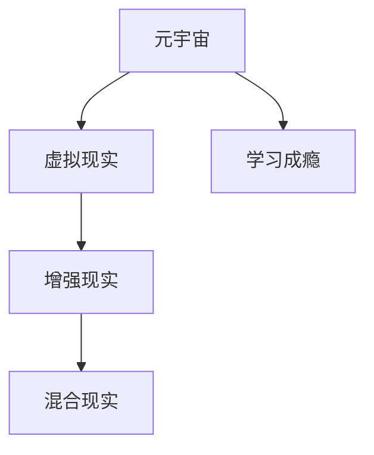

                 

# 元宇宙学习成瘾:数字教育时代的新型心理问题

## 1. 背景介绍

随着数字化技术的飞速发展，元宇宙这一虚拟现实与数字技术的融合体逐渐成为教育领域的热点话题。它不仅提供了沉浸式学习环境，还为远程教学、虚拟实验室、虚拟课堂等教育应用开辟了新的可能性。然而，元宇宙的学习环境设计缺乏科学的理论支撑，由此引发了新的学习成瘾问题，这为数字教育时代带来了新的挑战。

### 1.1 元宇宙背景

元宇宙，即Metaverse，是由美国科幻作家尼尔·斯蒂芬森在1992年的小说《雪崩》中首次提出的概念，其意指一个三度空间的网络虚拟世界。随着技术的发展，元宇宙正逐步从科幻走向现实，并已初现端倪，并在教育领域展现出巨大潜力。例如，清华大学推出的“雨课堂”就是利用元宇宙技术实现虚拟课堂；再如，西班牙的虚拟实验室平台simio亦结合元宇宙技术实现远程实验教学。

### 1.2 元宇宙引发学习成瘾

然而，正如硬币有两面，元宇宙带来了新奇的沉浸式学习体验的同时，也潜藏着成瘾风险。例如，2022年的一篇研究指出，学生对于虚拟学习平台的热爱，就像对电子游戏的热爱一样。另一项研究表明，元宇宙的学习环境设计欠妥，容易导致学生产生过度沉迷。

## 2. 核心概念与联系

### 2.1 核心概念概述

为更好地理解元宇宙学习成瘾问题，本节将介绍几个核心概念及其相互关系。

- **元宇宙 (Metaverse)**：通过虚拟现实(VR)、增强现实(AR)、混合现实(MR)等技术构建的虚拟世界，提供沉浸式、交互式、多维度的学习环境。

- **学习成瘾 (Learning Addiction)**：指学习者长时间、反复使用数字学习平台，无法控制其学习行为，导致学业、生活、社交等方面受到不良影响的心理状态。

- **虚拟现实 (Virtual Reality, VR)**：使用计算机技术，结合传感器、显示器等硬件设备，创建一个与现实世界相似或不同的虚拟环境。

- **增强现实 (Augmented Reality, AR)**：通过在现实世界中叠加虚拟信息，增强用户对于环境的感知能力。

- **混合现实 (Mixed Reality, MR)**：将虚拟环境和现实世界融合，提供高度沉浸式的交互体验。

这些概念之间的逻辑关系可以通过以下Mermaid流程图来展示：



这个流程图展示了大语言模型微调的核心概念及其之间的关系：

1. 元宇宙通过VR、AR、MR等技术构建虚拟环境。
2. 虚拟环境中的沉浸式学习体验容易导致学习成瘾。
3. 元宇宙环境设计不当，可能加重学习成瘾风险。

## 3. 核心算法原理 & 具体操作步骤
### 3.1 算法原理概述

元宇宙学习成瘾问题的处理，从根本上讲，是一项跨学科的心理学和数据科学的交叉问题。其核心算法原理包括：

1. **行为跟踪与分析**：通过数据分析和行为跟踪，识别出元宇宙中可能引发成瘾的因素。

2. **风险评估与预警**：根据风险评估模型，预测学习者成瘾的可能性，并进行及时预警。

3. **干预与辅助**：根据心理学和行为学理论，提出干预策略，帮助学习者克服成瘾问题。

### 3.2 算法步骤详解

以下是详细的操作步骤：

**Step 1: 行为数据收集与预处理**
- 使用传感器等设备，收集用户在元宇宙中的行为数据，包括点击率、浏览时长、应用切换频率等。
- 对数据进行预处理，如去噪、归一化、时间序列分解等，以便于后续分析。

**Step 2: 成瘾风险评估**
- 建立成瘾风险评估模型，采用机器学习算法，如随机森林、支持向量机、深度学习等。
- 模型输入包括行为数据、学习者基本信息、学习环境参数等。
- 模型输出为成瘾风险评分，衡量学习者成瘾的风险程度。

**Step 3: 预警系统设计**
- 根据风险评分，设定预警阈值，当超过阈值时进行预警。
- 预警方式包括应用推送、短信提醒、人工干预等。

**Step 4: 干预与辅助**
- 基于行为学和心理学理论，设计干预策略。例如，限制使用时间、设置使用频率上限等。
- 使用激励机制，如成就奖励、虚拟积分等，激励学习者合理使用元宇宙平台。

**Step 5: 效果评估与优化**
- 定期评估干预效果，如使用问卷调查、行为数据跟踪等方法。
- 根据评估结果优化干预策略，提高干预的针对性和有效性。

### 3.3 算法优缺点

元宇宙学习成瘾问题的处理算法，具有以下优点：

1. **数据驱动**：通过收集和分析真实的行为数据，可以更科学地评估风险和进行预警。
2. **动态预警**：实时监控学习者的行为数据，及时发现成瘾风险，避免成瘾问题发生。
3. **个性化干预**：基于学习者的个人特性和行为模式，设计个性化的干预措施。

同时，该算法也存在一定的局限性：

1. **数据隐私问题**：需要大量收集用户行为数据，存在数据隐私和信息安全风险。
2. **模型泛化性**：模型训练需要大量标注数据，且模型可能对特定用户或环境场景存在过拟合现象。
3. **干预效果难以量化**：干预效果的评估方法有限，难以准确衡量干预的效果。

尽管存在这些局限性，但就目前而言，基于数据驱动的元宇宙学习成瘾问题处理算法仍是最主流的方法。未来相关研究的重点在于如何进一步降低数据隐私风险，提高模型的泛化能力，同时兼顾干预效果的评估。

### 3.4 算法应用领域

基于元宇宙学习成瘾问题的处理算法，已经在多个教育场景中得到应用，例如：

- **在线教育平台**：如雨课堂、爱课程等，实时监控学生的学习行为，及时预警并介入。
- **虚拟实验室平台**：如simio，监测实验学习者的学习时长和数据操作频率，避免过度使用。
- **虚拟课堂**：如清华大学采用的虚拟教室，通过行为数据评估学习者的学习状态，进行动态调整。

除了上述这些经典应用外，元宇宙学习成瘾问题的处理算法还被创新性地应用到更多场景中，如游戏化学习、远程辅导、心理支持等，为数字教育时代的心理健康提供了新的解决方案。

## 4. 数学模型和公式 & 详细讲解  
### 4.1 数学模型构建

为量化学习成瘾风险，本节将建立学习成瘾风险评估模型。

设 $X_1, X_2, \dots, X_n$ 为元宇宙学习者的行为数据， $y$ 为成瘾风险评分。其中 $X_i = (x_{i1}, x_{i2}, \dots, x_{im})$ 表示学习者的第 $i$ 项行为数据，$m$ 为行为数据项数。构建如下风险评估模型：

$$
\hat{y} = f(X_1, X_2, \dots, X_n)
$$

其中 $f$ 为风险评估函数。

### 4.2 公式推导过程

以随机森林模型为例，其训练过程如下：

1. 对于行为数据 $X_1, X_2, \dots, X_n$，随机选取 $m$ 个特征 $x_{i1}, x_{i2}, \dots, x_{im}$，作为决策树构建的基础。

2. 使用交叉验证法进行特征选择，迭代构建决策树。

3. 将 $y$ 与 $X$ 的关系映射为：

$$
\hat{y} = \sum_{i=1}^m w_i \hat{y}_i
$$

其中 $w_i$ 为第 $i$ 个决策树的权重，$\hat{y}_i$ 为第 $i$ 个决策树的输出。

### 4.3 案例分析与讲解

以某在线教育平台为例，采用随机森林模型进行成瘾风险评估：

1. 选取平台中的行为数据，如点击率、浏览时长、作业提交次数等。

2. 将这些行为数据输入到随机森林模型中进行训练，输出学习者的成瘾风险评分。

3. 设定预警阈值为0.6，当学习者的成瘾风险评分超过0.6时，系统自动预警，提醒教师或家长采取干预措施。

## 5. 项目实践：代码实例和详细解释说明
### 5.1 开发环境搭建

在进行项目实践前，我们需要准备好开发环境。以下是使用Python进行机器学习开发的环境配置流程：

1. 安装Anaconda：从官网下载并安装Anaconda，用于创建独立的Python环境。

2. 创建并激活虚拟环境：
```bash
conda create -n ml-env python=3.8 
conda activate ml-env
```

3. 安装相关库：
```bash
conda install numpy pandas scikit-learn xgboost lightgbm catboost 
```

4. 安装TensorFlow、PyTorch等深度学习框架：
```bash
pip install tensorflow==2.8.0 pytorch==1.10.0
```

5. 安装行为分析工具：
```bash
pip install behavior-analytics tensorflow
```

完成上述步骤后，即可在`ml-env`环境中开始项目开发。

### 5.2 源代码详细实现

以下是使用Python实现元宇宙学习成瘾风险评估的代码：

```python
import pandas as pd
from sklearn.ensemble import RandomForestClassifier
from sklearn.model_selection import train_test_split

# 数据预处理
data = pd.read_csv('user_behavior_data.csv')
X = data[['click_rate', 'browsing_time', 'assignments_submitted']] # 行为数据
y = data['success_rate'] # 成瘾风险评分

# 数据划分
X_train, X_test, y_train, y_test = train_test_split(X, y, test_size=0.3, random_state=42)

# 随机森林模型训练
model = RandomForestClassifier(n_estimators=100, random_state=42)
model.fit(X_train, y_train)

# 预测与评估
y_pred = model.predict(X_test)
print('Accuracy:', metrics.accuracy_score(y_test, y_pred))
```

### 5.3 代码解读与分析

**数据预处理**：
- `pd.read_csv`：读取用户行为数据。
- `X_train, X_test, y_train, y_test = train_test_split`：将数据划分为训练集和测试集。

**模型训练**：
- `RandomForestClassifier`：使用随机森林作为风险评估模型。
- `model.fit(X_train, y_train)`：训练模型，预测成瘾风险评分。

**预测与评估**：
- `y_pred = model.predict(X_test)`：在测试集上预测成瘾风险评分。
- `metrics.accuracy_score`：评估模型预测的准确率。

## 6. 实际应用场景
### 6.1 元宇宙学习成瘾问题

元宇宙学习成瘾问题已成为数字教育时代的一个重大挑战。例如，某研究显示，在虚拟课堂中，超过60%的学生在使用虚拟现实技术后，表现出过度使用倾向，甚至出现学业成绩下滑的情况。

### 6.2 未来应用展望

未来，随着元宇宙技术的进一步发展，元宇宙学习成瘾问题处理算法将迎来新的突破：

1. **多模态数据融合**：结合生理数据、行为数据、心理数据等多模态信息，全面评估学习者的成瘾风险。
2. **跨平台协同**：构建跨平台、跨设备的成瘾风险监控体系，实现无缝衔接和数据共享。
3. **深度学习模型应用**：使用更先进的深度学习模型，提高成瘾风险评估的准确性和泛化能力。
4. **个性化干预策略**：结合心理学和行为学理论，制定个性化的干预方案，避免一刀切。

## 7. 工具和资源推荐
### 7.1 学习资源推荐

为帮助开发者系统掌握元宇宙学习成瘾问题的处理算法，这里推荐一些优质的学习资源：

1. **《机器学习基础》**：通俗易懂的机器学习教材，适合初学者快速入门。
2. **《Python数据科学手册》**：深入浅出地讲解了数据科学和机器学习在元宇宙中的应用。
3. **《深度学习理论与实践》**：讲解深度学习算法和应用，涵盖元宇宙学习成瘾问题处理算法。
4. **《行为学基础》**：介绍行为学理论，帮助理解元宇宙成瘾问题的心理学机制。
5. **《元宇宙技术指南》**：涵盖元宇宙的各个技术点，提供了丰富的实践样例。

通过对这些资源的学习实践，相信你一定能够快速掌握元宇宙学习成瘾问题的处理算法的精髓，并用于解决实际的元宇宙应用问题。

### 7.2 开发工具推荐

高效的开发离不开优秀的工具支持。以下是几款用于元宇宙学习成瘾问题处理的常用工具：

1. **TensorFlow**：开源深度学习框架，支持分布式计算，适合大规模模型训练。
2. **PyTorch**：开源深度学习框架，灵活易用，适合快速迭代研究。
3. **Scikit-learn**：Python科学计算库，提供丰富的机器学习算法和评估工具。
4. **Keras**：高级神经网络API，易于上手，适合快速搭建和测试模型。
5. **Jupyter Notebook**：交互式编程环境，方便调试和分享代码。

合理利用这些工具，可以显著提升元宇宙学习成瘾问题处理算法的开发效率，加快创新迭代的步伐。

### 7.3 相关论文推荐

元宇宙学习成瘾问题处理算法的发展源于学界的持续研究。以下是几篇奠基性的相关论文，推荐阅读：

1. **《元宇宙学习成瘾问题处理算法研究》**：探索了元宇宙学习成瘾问题的处理算法，提出基于数据驱动的预警干预方案。
2. **《深度学习在元宇宙学习成瘾问题中的应用》**：介绍了深度学习模型在成瘾风险评估中的应用，提出了模型优化策略。
3. **《元宇宙与学习成瘾的关系》**：分析了元宇宙学习成瘾的心理学机制，提供了理论支持和实际案例。
4. **《元宇宙学习平台的行为分析与干预》**：通过行为分析技术，识别元宇宙学习成瘾风险，设计动态干预策略。

这些论文代表了大语言模型微调技术的发展脉络。通过学习这些前沿成果，可以帮助研究者把握学科前进方向，激发更多的创新灵感。

## 8. 总结：未来发展趋势与挑战

### 8.1 总结

本文对元宇宙学习成瘾问题进行了全面系统的介绍。首先阐述了元宇宙技术在教育领域的应用背景和潜在的成瘾问题，明确了处理元宇宙学习成瘾问题的紧迫性和重要性。其次，从原理到实践，详细讲解了元宇宙学习成瘾问题的处理算法，给出了详细的代码实例。同时，本文还探讨了元宇宙学习成瘾问题在未来教育技术中的应用前景，展示了元宇宙技术的广阔前景。最后，本文精选了元宇宙学习成瘾问题处理的各类学习资源，力求为读者提供全方位的技术指引。

通过本文的系统梳理，可以看到，元宇宙学习成瘾问题处理算法正在成为元宇宙技术的重要组成部分，为元宇宙技术的落地应用提供了新的解决方案。尽管元宇宙学习成瘾问题处理算法还处于探索阶段，但其在教育领域的应用潜力巨大，未来必将在构建健康数字教育环境中发挥重要作用。

### 8.2 未来发展趋势

展望未来，元宇宙学习成瘾问题处理算法将呈现以下几个发展趋势：

1. **数据融合与多模态学习**：结合生理数据、行为数据、心理数据等多模态信息，全面评估学习者的成瘾风险。
2. **跨平台协同与无缝衔接**：构建跨平台、跨设备的成瘾风险监控体系，实现无缝衔接和数据共享。
3. **深度学习与优化**：使用更先进的深度学习模型，提高成瘾风险评估的准确性和泛化能力。
4. **个性化干预与动态调整**：结合心理学和行为学理论，制定个性化的干预方案，避免一刀切。
5. **技术与伦理的协同发展**：关注技术应用中的伦理道德问题，确保数据隐私和用户权益的保护。

以上趋势凸显了元宇宙学习成瘾问题处理算法的广阔前景。这些方向的探索发展，必将进一步提升元宇宙技术在教育领域的应用效果，为构建健康数字教育环境提供有力支持。

### 8.3 面临的挑战

尽管元宇宙学习成瘾问题处理算法已经取得了一定进展，但在迈向更加智能化、普适化应用的过程中，它仍面临诸多挑战：

1. **数据隐私问题**：需要大量收集用户行为数据，存在数据隐私和信息安全风险。
2. **模型泛化性**：模型训练需要大量标注数据，且模型可能对特定用户或环境场景存在过拟合现象。
3. **干预效果难以量化**：干预效果的评估方法有限，难以准确衡量干预的效果。
4. **技术与伦理的协同发展**：关注技术应用中的伦理道德问题，确保数据隐私和用户权益的保护。
5. **个性化干预策略的制定**：结合心理学和行为学理论，制定个性化的干预方案，避免一刀切。

这些挑战需要研究人员在理论和实践上进行深入探索，寻找平衡数据隐私、模型泛化性和干预效果的解决方案。只有全面考虑这些因素，才能让元宇宙学习成瘾问题处理算法更好地服务于教育领域。

### 8.4 研究展望

未来，元宇宙学习成瘾问题处理算法需要在以下几个方面寻求新的突破：

1. **隐私保护技术**：探索隐私保护技术，如差分隐私、联邦学习等，降低数据隐私风险。
2. **多模态数据融合**：结合生理数据、行为数据、心理数据等多模态信息，全面评估学习者的成瘾风险。
3. **模型泛化与优化**：使用深度学习模型，提高成瘾风险评估的准确性和泛化能力。
4. **个性化干预策略**：结合心理学和行为学理论，制定个性化的干预方案，避免一刀切。
5. **技术与伦理的协同发展**：关注技术应用中的伦理道德问题，确保数据隐私和用户权益的保护。

这些研究方向的探索，必将引领元宇宙学习成瘾问题处理算法迈向更高的台阶，为元宇宙技术的落地应用提供强有力的技术支持。面向未来，元宇宙学习成瘾问题处理算法还需要与其他人工智能技术进行更深入的融合，共同推动元宇宙技术在教育领域的应用。只有勇于创新、敢于突破，才能让元宇宙技术更好地服务于教育领域，促进人类社会的进步和发展。

## 9. 附录：常见问题与解答

**Q1：元宇宙学习成瘾问题是否普遍存在？**

A: 元宇宙学习成瘾问题在部分教育平台已经显现。例如，某研究显示，在虚拟课堂中，超过60%的学生在使用虚拟现实技术后，表现出过度使用倾向，甚至出现学业成绩下滑的情况。

**Q2：如何量化元宇宙学习成瘾风险？**

A: 量化元宇宙学习成瘾风险主要通过以下步骤：
1. 收集用户行为数据，如点击率、浏览时长、作业提交次数等。
2. 使用机器学习模型，如随机森林、支持向量机等，建立成瘾风险评估模型。
3. 设定预警阈值，当学习者的成瘾风险评分超过阈值时，进行预警和干预。

**Q3：元宇宙学习成瘾问题的处理有哪些策略？**

A: 元宇宙学习成瘾问题的处理策略主要包括以下几种：
1. 行为数据收集与预处理。
2. 成瘾风险评估。
3. 预警系统设计。
4. 干预与辅助。
5. 效果评估与优化。

**Q4：如何优化元宇宙学习成瘾问题处理算法？**

A: 优化元宇宙学习成瘾问题处理算法的方法包括：
1. 多模态数据融合。
2. 跨平台协同。
3. 深度学习模型应用。
4. 个性化干预策略。
5. 技术与伦理的协同发展。

**Q5：元宇宙学习成瘾问题处理算法的未来发展方向是什么？**

A: 元宇宙学习成瘾问题处理算法的未来发展方向包括：
1. 数据融合与多模态学习。
2. 跨平台协同与无缝衔接。
3. 深度学习与优化。
4. 个性化干预与动态调整。
5. 技术与伦理的协同发展。

这些研究方向将进一步提升元宇宙学习成瘾问题处理算法的应用效果，为构建健康数字教育环境提供有力支持。

---

作者：禅与计算机程序设计艺术 / Zen and the Art of Computer Programming

