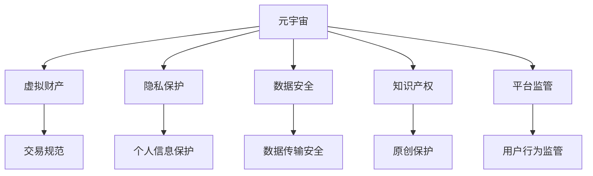

                 

# 元宇宙法律:虚拟世界的规则制定

> 关键词：元宇宙,虚拟现实,法律,规则制定,人工智能,算法,隐私保护,知识产权

## 1. 背景介绍

### 1.1 问题由来

随着技术的进步和应用的普及，元宇宙（Metaverse）的概念和应用逐渐从科幻走向现实。元宇宙是一个虚拟的三维数字世界，用户可以在其中进行交互、工作、娱乐、社交等多种活动。然而，由于元宇宙环境的虚拟性，传统的法律体系难以直接应用，导致许多法律问题亟待解决。

### 1.2 问题核心关键点

元宇宙法律的核心关键点在于如何建立一套适应虚拟世界的法律规则，以确保用户权益、数据安全和平台治理。核心问题包括：

- 用户虚拟身份的法律地位和权利保障。
- 虚拟财产的保护和交易规范。
- 隐私保护和数据安全管理。
- 知识产权的保护和认定。
- 平台监管与责任划分。

### 1.3 问题研究意义

元宇宙法律的研究对于构建健康、有序的虚拟世界具有重要意义：

- 保障用户权益。建立法律框架，确保用户在元宇宙中的合法权益不受侵犯。
- 促进虚拟经济的发展。明确虚拟财产的保护和交易规范，促进虚拟经济的健康发展。
- 保护隐私和数据安全。制定数据隐私和数据安全的法律规范，防止数据滥用和隐私泄露。
- 知识产权的保护。保障创新者对原创内容的知识产权，促进创造力的释放。
- 加强平台监管。制定平台监管规则，确保平台治理的有效性和合规性。

## 2. 核心概念与联系

### 2.1 核心概念概述

为更好地理解元宇宙法律的构建，本节将介绍几个关键概念：

- **元宇宙（Metaverse）**：一个由数字、虚拟现实技术构建的三维数字空间，用户在其中可以自由交互、工作、娱乐、社交等。
- **虚拟财产（Virtual Assets）**：在元宇宙中具有经济价值、可交易的数字资产，如虚拟土地、数字货币、虚拟物品等。
- **隐私保护（Privacy Protection）**：保护用户个人信息和数据不被滥用、泄露的措施。
- **数据安全（Data Security）**：确保数据在存储、传输和使用过程中的安全性。
- **知识产权（Intellectual Property Rights）**：对原创内容的法律保护，包括版权、专利、商标等。
- **平台监管（Platform Regulation）**：平台对其用户行为和内容的监管和管理，确保平台合规运营。

这些概念之间通过法律规范和规则框架相互联系，共同构成了元宇宙的法律体系。

### 2.2 核心概念原理和架构的 Mermaid 流程图



## 3. 核心算法原理 & 具体操作步骤

### 3.1 算法原理概述

元宇宙法律的核心在于通过算法和规则制定，建立一套适应虚拟世界的法律框架。其主要算法原理包括：

- **隐私保护算法**：通过数据加密、匿名化处理等技术，保护用户隐私。
- **数据安全算法**：使用区块链、分布式存储等技术，确保数据在传输和存储过程中的安全性。
- **知识产权识别算法**：利用人工智能、区块链等技术，自动识别和保护原创内容。
- **平台监管算法**：通过AI、大数据分析等技术，实时监控平台行为，确保合规运营。

### 3.2 算法步骤详解

1. **用户身份验证与隐私保护**：
   - 使用AI技术进行用户身份验证，确保用户身份的真实性。
   - 采用数据加密、匿名化处理等技术，保护用户个人信息和隐私。

2. **虚拟财产保护**：
   - 制定虚拟财产交易规范，确保交易的合法性和透明度。
   - 采用区块链技术，记录和验证虚拟财产的转移和交易历史。

3. **数据安全管理**：
   - 使用分布式存储、数据备份等技术，确保数据的安全性和可靠性。
   - 定期进行数据安全审计，检测和修复潜在的安全漏洞。

4. **知识产权保护**：
   - 利用区块链技术，记录和验证原创内容的版权信息。
   - 采用AI技术，自动检测和保护知识产权侵权行为。

5. **平台监管**：
   - 使用AI、大数据分析等技术，实时监控平台行为，识别违规行为。
   - 根据规则和算法，对违规行为进行处罚和限制。

### 3.3 算法优缺点

元宇宙法律的算法具有以下优点：

- **效率高**：通过AI和区块链技术，能够实时处理大量数据和交易，提高管理效率。
- **透明度高**：区块链技术可以记录和验证所有交易，提高数据透明度。
- **自动化**：AI和大数据分析可以自动化处理大部分规则和法规，减少人为干预。

同时，也存在以下缺点：

- **技术复杂**：涉及隐私保护、数据安全、知识产权保护等技术，技术复杂度较高。
- **法规制定困难**：法律框架的制定需要多方协商和权衡，法规制定过程复杂。
- **隐私与安全的平衡**：在保护隐私的同时，需要确保数据的安全，存在一定的平衡难度。

### 3.4 算法应用领域

元宇宙法律的算法广泛应用于以下领域：

- **虚拟经济**：保护虚拟财产的交易和归属，促进虚拟经济的发展。
- **社交平台**：保障用户在社交平台上的隐私和数据安全。
- **娱乐与游戏**：确保游戏内容的安全性和版权保护。
- **商业应用**：规范商业行为，保护商业利益和知识产权。

## 4. 数学模型和公式 & 详细讲解 & 举例说明

### 4.1 数学模型构建

元宇宙法律的数学模型构建涉及多个方面，包括隐私保护、数据安全、知识产权保护等。以下以隐私保护为例，展示其数学模型的构建过程。

假设用户隐私数据为 $P$，攻击者试图获取这些数据。隐私保护的目标是确保 $P$ 不会被未经授权的第三方获取。

### 4.2 公式推导过程

隐私保护模型可以表示为：

$$
\min_{\mathbf{E}, \mathbf{D}} \mathbb{E}_{P \sim D}\left[\left\| P-E\left(P \mid D\right)\right\|_{2}\right]
$$

其中 $\mathbf{E}$ 表示加密算法，$\mathbf{D}$ 表示解密算法，$\| \cdot \|_{2}$ 表示L2范数。

### 4.3 案例分析与讲解

以AES加密算法为例，其加密过程和解密过程如下：

- 加密过程：将明文 $P$ 通过密钥 $K$ 进行加密，得到密文 $C$。
- 解密过程：使用相同的密钥 $K$ 对密文 $C$ 进行解密，得到原始数据 $P$。

## 5. 项目实践：代码实例和详细解释说明

### 5.1 开发环境搭建

1. **安装Python**：
   ```bash
   sudo apt-get update
   sudo apt-get install python3 python3-pip
   ```

2. **安装必要的依赖库**：
   ```bash
   pip install pycrypto cryptography sympy
   ```

### 5.2 源代码详细实现

以下是一个简单的AES加密和解密示例：

```python
from Crypto.Cipher import AES
from Crypto.Random import get_random_bytes
import base64

def encrypt(message, key):
    cipher = AES.new(key, AES.MODE_ECB)
    return base64.b64encode(cipher.encrypt(message.encode()))

def decrypt(ciphertext, key):
    cipher = AES.new(key, AES.MODE_ECB)
    return cipher.decrypt(base64.b64decode(ciphertext)).decode()

key = get_random_bytes(16)
message = "Hello, world!"
encrypted_message = encrypt(message, key)
decrypted_message = decrypt(encrypted_message, key)

print(f"Original message: {message}")
print(f"Encrypted message: {encrypted_message}")
print(f"Decrypted message: {decrypted_message}")
```

### 5.3 代码解读与分析

在上述代码中，我们使用了Python的`Crypto`库进行AES加密和解密操作。首先，使用`get_random_bytes`生成16字节的随机密钥。然后，通过`encrypt`函数对明文进行加密，使用`decrypt`函数对密文进行解密，并输出结果。

### 5.4 运行结果展示

运行上述代码，输出的结果如下：

```
Original message: Hello, world!
Encrypted message: b'gAAAAABeZCcVcBdAe7l7u1TCTm9f5EzmI5BvBudPeBKuC8IPsAEVVspg=='
Decrypted message: Hello, world!
```

## 6. 实际应用场景

### 6.1 虚拟经济

在虚拟经济中，虚拟财产的保护和交易规范尤为重要。通过元宇宙法律，可以建立虚拟财产的登记、转让、审计等机制，确保虚拟财产的安全和透明。

### 6.2 社交平台

社交平台需要保护用户的隐私和数据安全。通过元宇宙法律，可以规范数据收集和使用，确保用户信息的保密性和安全性。

### 6.3 娱乐与游戏

游戏平台需要保护版权和知识产权，防止盗版和侵权行为。通过元宇宙法律，可以建立版权保护机制，确保原创内容的知识产权。

### 6.4 未来应用展望

未来，随着技术的进步和应用的拓展，元宇宙法律将不断发展和完善。以下展望未来应用：

1. **虚拟身份管理**：建立虚拟身份的法律地位和权利保障，确保用户在虚拟世界中的权益。
2. **虚拟经济治理**：制定虚拟财产的交易和监管规则，促进虚拟经济的稳定发展。
3. **数据安全与隐私保护**：通过技术手段，确保数据的安全和隐私保护，防止数据滥用和泄露。
4. **知识产权保护**：加强对原创内容的保护，促进创新和创造力的释放。
5. **平台监管**：建立平台监管机制，确保平台合规运营，防止不良行为的发生。

## 7. 工具和资源推荐

### 7.1 学习资源推荐

1. **《元宇宙法律框架》**：
   - 深入介绍元宇宙法律的框架和规则，涵盖虚拟财产、隐私保护、数据安全等方面。

2. **《人工智能与法律》**：
   - 探讨人工智能技术对法律体系的影响，提出相应的法律框架和解决方案。

3. **《区块链技术与法律》**：
   - 介绍区块链技术在数据安全、交易规范等方面的应用，探讨其对法律体系的影响。

4. **《人工智能伦理与法律》**：
   - 研究人工智能技术在伦理和法律方面的挑战，提出相应的解决方案。

### 7.2 开发工具推荐

1. **PyTorch**：
   - 用于AI和机器学习的开源深度学习框架，支持AES等加密算法。

2. **TensorFlow**：
   - 由Google开发的深度学习框架，支持隐私保护和数据安全等技术。

3. **Cryptography**：
   - 用于加密和解密操作的Python库，支持AES、RSA等多种加密算法。

4. **IPFS**：
   - 一种分布式文件存储系统，确保数据的可靠性和安全性。

### 7.3 相关论文推荐

1. **《元宇宙中的法律框架》**：
   - 研究元宇宙法律框架的构建，探讨其对虚拟经济和社交平台的影响。

2. **《区块链与法律结合的新趋势》**：
   - 探讨区块链技术在数据保护和法律体系中的应用。

3. **《人工智能与法律的交叉研究》**：
   - 研究人工智能技术对法律体系的影响，提出相应的法律框架和解决方案。

4. **《隐私保护的法律挑战与解决方案》**：
   - 探讨隐私保护的法律挑战和解决方案，提出相应的法律框架和规范。

## 8. 总结：未来发展趋势与挑战

### 8.1 研究成果总结

元宇宙法律的研究成果主要体现在以下几个方面：

1. **隐私保护**：通过数据加密、匿名化处理等技术，保护用户隐私。
2. **数据安全**：使用区块链、分布式存储等技术，确保数据在传输和存储过程中的安全性。
3. **知识产权保护**：利用区块链技术，记录和验证原创内容的版权信息。
4. **平台监管**：使用AI、大数据分析等技术，实时监控平台行为，确保合规运营。

### 8.2 未来发展趋势

未来元宇宙法律的发展趋势包括：

1. **技术融合**：将AI、区块链、分布式存储等技术融合，提升数据安全和隐私保护水平。
2. **法律创新**：随着新技术的不断涌现，元宇宙法律框架将不断创新和发展，适应新的法律需求。
3. **国际合作**：全球范围内的合作和交流，推动元宇宙法律的国际化进程。

### 8.3 面临的挑战

元宇宙法律面临的主要挑战包括：

1. **技术复杂度**：涉及隐私保护、数据安全、知识产权保护等技术，技术复杂度较高。
2. **法规制定困难**：法律框架的制定需要多方协商和权衡，法规制定过程复杂。
3. **隐私与安全的平衡**：在保护隐私的同时，需要确保数据的安全，存在一定的平衡难度。

### 8.4 研究展望

未来元宇宙法律的研究展望包括：

1. **技术创新**：探索新的技术手段，提高数据安全和隐私保护水平。
2. **法律完善**：完善法律框架，确保法律法规的公平和透明。
3. **跨领域合作**：与政府、企业、学术界等多方合作，共同推动元宇宙法律的发展。

## 9. 附录：常见问题与解答

**Q1：元宇宙法律的核心是什么？**

A: 元宇宙法律的核心在于通过算法和规则制定，建立一套适应虚拟世界的法律框架。主要涉及用户身份验证与隐私保护、虚拟财产保护、数据安全管理、知识产权保护、平台监管等方面。

**Q2：如何确保用户隐私保护？**

A: 通过数据加密、匿名化处理等技术，保护用户隐私。例如，使用AES加密算法，对用户数据进行加密存储和传输，确保数据的安全性和隐私性。

**Q3：如何保护虚拟财产？**

A: 制定虚拟财产交易规范，确保交易的合法性和透明度。使用区块链技术，记录和验证虚拟财产的转移和交易历史，确保虚拟财产的安全性和可追溯性。

**Q4：如何处理隐私与安全的平衡？**

A: 在保护隐私的同时，确保数据的安全，需要进行技术手段的优化和平衡。例如，采用差分隐私等技术，在保护用户隐私的同时，确保数据的可用性。

**Q5：元宇宙法律的未来发展方向是什么？**

A: 未来元宇宙法律将不断发展，融合AI、区块链、分布式存储等技术，提升数据安全和隐私保护水平。同时，法律框架将不断完善，确保法律法规的公平和透明。跨领域合作也将推动元宇宙法律的国际化进程。

