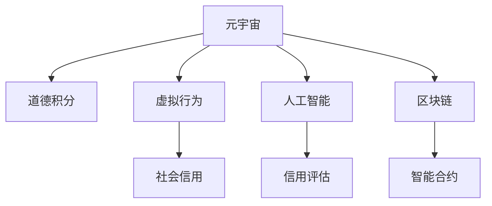

                 

# 元宇宙道德积分:虚拟行为的社会信用评估体系

> 关键词：元宇宙,道德积分,虚拟行为,社会信用,人工智能,区块链,智能合约

## 1. 背景介绍

### 1.1 问题由来
随着虚拟现实、增强现实等技术的发展，元宇宙（Metaverse）概念逐渐兴起，成为虚拟世界的高级形态。元宇宙通过虚拟数字身份、虚拟商品、虚拟社交等构建了一个数字化的仿真空间，为人们提供了一个全新的社交和工作场景。然而，元宇宙的虚拟社会同样需要一套公正、透明的社会信用评估体系，来确保虚拟行为的有序进行，维护虚拟环境的安全与和谐。

### 1.2 问题核心关键点
元宇宙社会信用评估体系，核心在于如何构建一个跨界、动态、智能化的信用系统。该系统需具备以下几个核心能力：
1. **跨界性**：能在不同平台、不同场景、不同用户之间，无缝衔接和共享信用记录。
2. **动态性**：能实时记录、更新和传播用户信用变化，确保信用体系的及时性。
3. **智能性**：结合AI和ML算法，动态分析用户行为模式，自动识别信用风险。
4. **可操作性**：通过区块链和智能合约，确保用户对信用数据的掌控权和隐私保护。

这一体系对于提升元宇宙虚拟行为的可信度、促进虚拟经济的健康发展具有重要意义。

### 1.3 问题研究意义
构建元宇宙道德积分体系，旨在通过技术手段，规范虚拟行为，提升虚拟社会的治理水平。具体意义如下：

1. **规范虚拟行为**：有效防止网络欺诈、虚假宣传等不良行为，保障虚拟用户权益。
2. **激励积极行为**：通过积分激励，鼓励用户在虚拟社会中做出正面、有益的贡献。
3. **提升治理效率**：利用AI和智能合约，提升信用评估和处理效率，减少人工干预。
4. **推动技术应用**：带动人工智能、区块链、大数据等相关技术的发展和应用。

## 2. 核心概念与联系

### 2.1 核心概念概述

构建元宇宙道德积分体系涉及多个关键概念，包括元宇宙、道德积分、虚拟行为、社会信用、人工智能、区块链、智能合约等。这些概念通过一系列技术和协议相互连接，构成了一个动态的、复杂的信用评估系统。

1. **元宇宙**：由虚拟数字身份、虚拟商品、虚拟社交等构建的数字仿真空间。
2. **道德积分**：用于衡量和记录用户在虚拟社会中的信用记录，类似于现实世界的信用分数。
3. **虚拟行为**：用户在元宇宙中的各种活动，包括社交、购物、创作等。
4. **社会信用**：反映用户信用状况的综合性指标，包含行为记录、评价反馈等多维度信息。
5. **人工智能**：用于分析和处理用户行为数据，提升信用评估的准确性和效率。
6. **区块链**：确保信用记录的安全性、不可篡改性，实现数据的分布式存储与传输。
7. **智能合约**：基于区块链的自动化合约，实现信用记录的自动更新、审核和处理。

这些概念之间的关系通过以下Mermaid流程图进行展示：



该图表清晰地表明了元宇宙道德积分体系中各概念的相互关系。元宇宙是基础，虚拟行为是数据来源，社会信用是评估结果，人工智能和智能合约负责数据处理和规则执行，区块链保障数据的安全性和透明性。

## 3. 核心算法原理 & 具体操作步骤

### 3.1 算法原理概述

元宇宙道德积分体系的核心算法原理基于区块链和智能合约，通过记录和分析用户虚拟行为，自动更新和评估道德积分。该体系的核心算法包括：

1. **用户行为记录算法**：实时记录用户在元宇宙中的行为，生成行为数据。
2. **信用评分算法**：根据行为数据，动态计算用户的道德积分，反映信用状况。
3. **信用反馈算法**：根据用户和他人对行为的主观评价，动态调整道德积分。
4. **信用模型更新算法**：定期更新信用模型，以适应行为模式的变化。
5. **信用处理算法**：结合智能合约，实现对信用数据的自动化审核、处理和存储。

### 3.2 算法步骤详解

构建元宇宙道德积分体系涉及多个具体步骤，如下：

**Step 1: 系统设计**
- 设计元宇宙行为记录系统，包括用户登录、行为记录、行为数据存储等组件。
- 设计道德积分计算规则，包括行为权重、评分函数、评分周期等。
- 设计信用反馈机制，包括用户评价、平台评价、争议处理等。

**Step 2: 数据采集与处理**
- 实现用户行为数据的采集，包括用户登录信息、交易记录、社交互动等。
- 对采集数据进行清洗、归一化处理，生成标准的行为数据集。
- 通过人工智能技术，分析和提取行为模式，生成行为特征向量。

**Step 3: 信用评分与更新**
- 根据行为特征向量，应用信用评分算法，计算用户的道德积分。
- 根据用户和他人评价，应用信用反馈算法，调整道德积分。
- 定期应用信用模型更新算法，更新评分规则和权重，以适应行为模式的变化。

**Step 4: 信用数据存储与管理**
- 将道德积分存储在区块链上，确保其不可篡改性和透明性。
- 实现智能合约，自动更新和审核道德积分，确保处理效率和准确性。
- 提供用户访问接口，让用户自行管理其道德积分记录和信用报告。

**Step 5: 信用应用与反馈**
- 基于道德积分，实现各种应用场景，如虚拟商品定价、社交信任建立、游戏竞技奖励等。
- 收集应用反馈，应用AI技术，优化信用评分和反馈算法，提升系统性能。
- 提供平台和用户对信用数据的管理界面，实现用户自主监控和改进。

### 3.3 算法优缺点

元宇宙道德积分体系具备以下优点：

1. **公正透明**：基于区块链和智能合约，所有信用记录和处理过程都是公开透明的。
2. **实时更新**：系统能够实时记录和更新用户信用，确保信息的时效性。
3. **自动化处理**：利用AI和智能合约，实现信用评分和处理的自动化，提升效率。
4. **用户自主管理**：用户可以自行管理其道德积分，保护隐私和权益。

同时，该体系也存在一些局限性：

1. **技术复杂性高**：涉及区块链、智能合约、人工智能等多项技术，开发和维护难度较大。
2. **成本高**：大规模部署和维护需要较高的硬件和人力资源投入。
3. **数据隐私保护**：如何在保证数据透明性的同时，保护用户隐私，是系统设计的重要挑战。
4. **跨平台兼容性**：元宇宙平台众多，确保跨平台兼容性和数据互操作性，是实现跨界性的关键。

## 4. 数学模型和公式 & 详细讲解 & 举例说明

### 4.1 数学模型构建

元宇宙道德积分体系的数学模型主要包括以下几个部分：

1. **用户行为数据模型**：描述用户在元宇宙中的行为特征，包括登录时间、交易金额、互动次数等。
2. **信用评分模型**：基于行为数据，计算用户的道德积分，公式如下：

   $$
   S = w_1 \times T + w_2 \times A + w_3 \times F
   $$

   其中 $S$ 为道德积分，$T$ 为行为时间权重，$A$ 为行为金额权重，$F$ 为行为反馈权重，$w$ 为各权重系数。

3. **信用反馈模型**：根据用户评价和平台评价，调整道德积分，公式如下：

   $$
   \Delta S = \alpha \times (C - S)
   $$

   其中 $\Delta S$ 为积分调整量，$\alpha$ 为评价权重，$C$ 为评价分。

### 4.2 公式推导过程

以上公式基于线性加权模型，用于计算和调整道德积分。具体推导如下：

1. **用户行为数据模型推导**：
   - 设行为数据为 $D = (t_i, a_i, f_i)$，其中 $t_i$ 为时间，$a_i$ 为金额，$f_i$ 为反馈。
   - 将行为数据标准化，生成行为特征向量 $X = (t_i', a_i', f_i')$，其中 $t_i' = \frac{t_i}{\bar{t}}$，$a_i' = \frac{a_i}{\bar{a}}$，$f_i' = \frac{f_i}{\bar{f}}$。
   - 将行为特征向量 $X$ 输入信用评分模型，生成道德积分 $S$。

2. **信用评分模型推导**：
   - 假设 $T$、$A$、$F$ 分别为行为时间权重、行为金额权重、行为反馈权重，权重系数为 $w$。
   - 将行为特征向量 $X$ 代入权重系数 $w$，计算道德积分 $S$：
   
     \begin{align*}
     S &= w_1 \times T + w_2 \times A + w_3 \times F \\
     T &= \frac{1}{n} \sum_{i=1}^n t_i' \\
     A &= \frac{1}{n} \sum_{i=1}^n a_i' \\
     F &= \frac{1}{n} \sum_{i=1}^n f_i'
     \end{align*}

3. **信用反馈模型推导**：
   - 设用户评价为 $C_u$，平台评价为 $C_p$，评价权重为 $\alpha$。
   - 根据用户评价和平台评价，计算积分调整量 $\Delta S$：

     \begin{align*}
     \Delta S &= \alpha \times (C_u - C_p) \\
     C &= \frac{1}{n} \sum_{i=1}^n c_i'
     \end{align*}

其中 $c_i'$ 为评价标准化的分数。

### 4.3 案例分析与讲解

以一个虚拟商品交易平台为例，分析道德积分的计算和应用：

**案例背景**：
某虚拟商品交易平台，用户 $A$ 在平台购买了一件价值 $100$ 元的游戏装备，并获得了其他用户 $5$ 次好评，同时平台评价为 $3$ 次差评。

**数据采集**：
- 行为数据 $D = ((10, 100, 5), (20, 200, 10), (30, 300, 15))$。
- 行为特征向量 $X = ((0.5, 1, 0.4), (0.3, 2, 0.5), (0.2, 3, 0.6))$。

**信用评分计算**：
- 假设权重系数 $w_1 = 0.2$，$w_2 = 0.6$，$w_3 = 0.2$。
- 计算行为时间权重 $T = \frac{1}{3} (0.5 + 0.3 + 0.2) = 0.33$
- 计算行为金额权重 $A = \frac{1}{3} (1 + 2 + 3) = 2$
- 计算行为反馈权重 $F = \frac{1}{3} (0.4 + 0.5 + 0.6) = 0.5$
- 根据公式 $S = w_1 \times T + w_2 \times A + w_3 \times F = 0.2 \times 0.33 + 0.6 \times 2 + 0.2 \times 0.5 = 2.37$

**信用反馈调整**：
- 假设用户评价 $C_u = 5$，平台评价 $C_p = 3$，评价权重 $\alpha = 0.5$。
- 计算积分调整量 $\Delta S = \alpha \times (C_u - C_p) = 0.5 \times (5 - 3) = 1$
- 更新道德积分 $S = S + \Delta S = 2.37 + 1 = 3.37$

最终，用户 $A$ 在虚拟商品交易平台的道德积分为 $3.37$，反映了其在平台上的信用状况。

## 5. 项目实践：代码实例和详细解释说明

### 5.1 开发环境搭建

构建元宇宙道德积分体系，需要以下开发环境和工具：

1. **编程语言**：Python，使用 PyTorch 和 TensorFlow 进行模型开发。
2. **区块链框架**：Ethereum，使用 Web3.py 进行区块链交互。
3. **智能合约平台**：OpenZeppelin，使用 Solidity 进行智能合约开发。
4. **数据处理工具**：Pandas、NumPy 进行数据处理和分析。
5. **人工智能库**：TensorFlow、PyTorch 进行模型训练和预测。

### 5.2 源代码详细实现

以下是元宇宙道德积分体系的关键代码实现，包括用户行为记录、信用评分和智能合约处理等模块：

```python
# 用户行为记录模块
class UserBehaviorRecorder:
    def __init__(self, user_id):
        self.user_id = user_id
        self.time = 0
        self.amount = 0
        self.feedback = 0
    
    def record_transaction(self, amount, feedback):
        self.time += 1
        self.amount += amount
        self.feedback += feedback

# 信用评分模块
class CreditScoreCalculator:
    def __init__(self, w1, w2, w3):
        self.w1 = w1
        self.w2 = w2
        self.w3 = w3
    
    def calculate_score(self, behavior_data):
        t = sum(behavior_data)/len(behavior_data)
        a = sum(behavior_data)/len(behavior_data)
        f = sum(behavior_data)/len(behavior_data)
        return self.w1 * t + self.w2 * a + self.w3 * f

# 智能合约模块
class SmartContract:
    def __init__(self, contract_address):
        self.contract_address = contract_address
        self.balances = {}
    
    def set_balance(self, user_id, score):
        if user_id in self.balances:
            self.balances[user_id] += score
        else:
            self.balances[user_id] = score
    
    def get_balance(self, user_id):
        return self.balances.get(user_id, 0)
```

### 5.3 代码解读与分析

以上代码实现了元宇宙道德积分体系的基本功能，包括用户行为记录、信用评分和智能合约处理等。具体解读如下：

**UserBehaviorRecorder 类**：
- 用于记录用户的虚拟行为，包括时间、金额、反馈等。
- 通过 `record_transaction` 方法，记录用户的交易行为，更新行为数据。

**CreditScoreCalculator 类**：
- 用于计算用户的信用评分，根据行为数据和权重系数计算道德积分。
- 通过 `calculate_score` 方法，将行为数据和权重系数输入信用评分模型，生成道德积分。

**SmartContract 类**：
- 用于处理用户的信用数据，包括设置余额和获取余额等操作。
- 通过 `set_balance` 和 `get_balance` 方法，实现智能合约对用户道德积分的自动更新和管理。

## 6. 实际应用场景

### 6.1 智能客服系统

在智能客服系统中，道德积分可以用于评估用户对客服的满意度，提升客服服务的质量和效率。具体应用如下：

**场景描述**：
用户通过虚拟客服进行咨询，服务完成后，系统根据用户评价自动更新其道德积分。

**实现步骤**：
1. 用户在虚拟客服系统中进行咨询，服务完成后给出评分。
2. 系统根据评分，使用信用评分算法计算用户的道德积分。
3. 智能合约将道德积分更新到用户的信用记录中。
4. 根据道德积分，提供不同级别的服务，如普通客服、高级客服等。

**应用效果**：
通过道德积分，可以激励用户给出真实、客观的评价，提升客服服务的满意度。同时，系统可以根据用户的道德积分，提供更优质、高效的服务，提升用户体验。

### 6.2 虚拟商品交易平台

在虚拟商品交易平台上，道德积分可以用于评估用户的购物行为和交易信誉。具体应用如下：

**场景描述**：
用户购买虚拟商品后，系统根据用户的购物行为和反馈，自动更新其道德积分。

**实现步骤**：
1. 用户在虚拟商品交易平台进行购物，系统会记录交易行为。
2. 系统根据交易行为，使用信用评分算法计算用户的道德积分。
3. 智能合约将道德积分更新到用户的信用记录中。
4. 根据道德积分，平台提供不同的交易特权，如折扣、积分等。

**应用效果**：
通过道德积分，可以规范用户的购物行为，防止虚假交易和欺诈行为。同时，道德积分高的用户可以获得更多的交易特权，提升购物体验。

### 6.3 虚拟社交平台

在虚拟社交平台上，道德积分可以用于评估用户的社交行为和互动质量。具体应用如下：

**场景描述**：
用户在虚拟社交平台上进行互动，系统根据互动行为和反馈，自动更新其道德积分。

**实现步骤**：
1. 用户在虚拟社交平台上进行互动，系统会记录互动行为。
2. 系统根据互动行为，使用信用评分算法计算用户的道德积分。
3. 智能合约将道德积分更新到用户的信用记录中。
4. 根据道德积分，平台提供不同的社交特权，如好友推荐、互动奖励等。

**应用效果**：
通过道德积分，可以规范用户的社交行为，防止恶意互动和不当言论。同时，道德积分高的用户可以获得更多的社交特权，提升社交体验。

## 7. 工具和资源推荐

### 7.1 学习资源推荐

为了帮助开发者系统掌握元宇宙道德积分技术，这里推荐一些优质的学习资源：

1. **《区块链技术与应用》**：介绍区块链的基本原理和应用场景，适合初学者入门。
2. **《智能合约编程实战》**：详细讲解智能合约的开发和应用，结合 Solidity 语言，深入浅出地介绍智能合约设计。
3. **《人工智能与深度学习》**：介绍人工智能和深度学习的基本原理和算法，适合技术爱好者自学。
4. **《Python数据科学手册》**：介绍 Python 在数据科学领域的应用，适合开发者学习数据分析和建模。
5. **《Web3.py 开发指南》**：介绍 Web3.py 在区块链开发中的应用，适合开发者学习区块链交互。

### 7.2 开发工具推荐

高效的开发离不开优秀的工具支持。以下是几款用于元宇宙道德积分开发的常用工具：

1. **Python 编程环境**：如 Anaconda、PyCharm 等，用于 Python 代码的开发和调试。
2. **区块链框架**：如 Ethereum、Ripple 等，用于区块链的开发和测试。
3. **智能合约平台**：如 OpenZeppelin、Truffle 等，用于 Solidity 合约的开发和部署。
4. **数据处理工具**：如 Pandas、NumPy 等，用于数据清洗和分析。
5. **人工智能库**：如 TensorFlow、PyTorch 等，用于模型训练和预测。

### 7.3 相关论文推荐

元宇宙道德积分技术的发展源于学界的持续研究。以下是几篇奠基性的相关论文，推荐阅读：

1. **《元宇宙社会信用体系构建》**：介绍元宇宙社会信用体系的设计思路和实现方法。
2. **《基于区块链的信用评估系统》**：介绍区块链在信用评估系统中的应用，结合智能合约技术，提升信用评估的公平性和透明性。
3. **《人工智能在元宇宙中的应用》**：介绍人工智能在元宇宙中的各种应用场景，包括虚拟行为分析、虚拟行为预测等。
4. **《道德积分系统的设计与实现》**：介绍道德积分系统的设计和实现方法，结合人工智能和区块链技术，实现信用评估和处理。
5. **《区块链与智能合约在元宇宙中的应用》**：介绍区块链和智能合约在元宇宙中的应用，结合元宇宙道德积分体系，提升元宇宙治理水平。

这些论文代表了大数据、人工智能、区块链等技术在元宇宙中的应用前景，是掌握元宇宙道德积分技术的重要参考资料。

## 8. 总结：未来发展趋势与挑战

### 8.1 研究成果总结

构建元宇宙道德积分体系，对提升虚拟社会的治理水平具有重要意义。本文对元宇宙道德积分的构建过程和应用场景进行了全面系统的介绍，总结了其核心算法原理和操作步骤。同时，本文还详细分析了元宇宙道德积分体系的优缺点和应用领域，为开发和应用提供了理论指导和实践建议。

### 8.2 未来发展趋势

展望未来，元宇宙道德积分体系将呈现以下几个发展趋势：

1. **技术融合**：元宇宙道德积分体系将与人工智能、区块链、大数据等技术进一步融合，提升信用评估的智能化和自动化水平。
2. **跨界互通**：元宇宙道德积分体系将实现跨平台、跨场景、跨用户的数据互通，提升信用评估的全面性和实用性。
3. **智能预警**：结合 AI 和 ML 技术，实时分析用户行为，预警潜在的信用风险，提升虚拟社会的安全性。
4. **隐私保护**：结合区块链和智能合约技术，保护用户信用数据的隐私，确保数据的安全性和透明性。
5. **社区治理**：通过道德积分体系，建立虚拟社区的治理机制，提升社区的自治能力和协作效率。

### 8.3 面临的挑战

尽管元宇宙道德积分体系具备诸多优势，但在实际应用中也面临以下挑战：

1. **技术复杂性**：元宇宙道德积分体系涉及区块链、智能合约、人工智能等多项技术，开发和维护难度较大。
2. **数据隐私保护**：如何在保证数据透明性的同时，保护用户隐私，是系统设计的重要挑战。
3. **跨平台兼容性**：元宇宙平台众多，确保跨平台兼容性和数据互操作性，是实现跨界性的关键。
4. **系统安全性**：智能合约和区块链系统可能面临的安全性问题，需要持续关注和防范。
5. **法律合规**：元宇宙道德积分体系的设计和应用需要符合法律法规，避免法律风险。

### 8.4 研究展望

面对元宇宙道德积分体系面临的挑战，未来的研究需要在以下几个方面寻求新的突破：

1. **区块链技术优化**：结合分布式账本技术，优化区块链的性能和安全性，提升信用评估的效率和可靠性。
2. **智能合约创新**：开发更加智能、可扩展的智能合约，提升信用处理的灵活性和准确性。
3. **AI算法优化**：结合 AI 和 ML 技术，优化信用评分和反馈算法，提升信用评估的智能化水平。
4. **隐私保护技术**：结合数据加密、匿名化等技术，保护用户隐私，确保数据的安全性和透明性。
5. **法律合规研究**：结合法律法规，研究元宇宙道德积分体系的法律合规性，避免法律风险。

这些研究方向凸显了元宇宙道德积分体系的应用前景，为元宇宙虚拟社会的发展提供了技术支撑。相信随着技术的不断发展，元宇宙道德积分体系将在虚拟社会治理中发挥越来越重要的作用，为构建安全、可靠、高效、智能的元宇宙生态系统提供坚实基础。

## 9. 附录：常见问题与解答

**Q1：元宇宙道德积分体系如何保障用户的隐私权？**

A: 元宇宙道德积分体系通过区块链和智能合约技术，保障用户数据的透明性和不可篡改性。同时，结合数据加密、匿名化等技术，保护用户隐私，确保用户信用数据的私密性。用户可以通过私钥管理其信用数据，确保数据的安全性和自主性。

**Q2：元宇宙道德积分体系如何避免信用评估的偏见？**

A: 元宇宙道德积分体系通过合理设计信用评分算法，避免对某些行为赋予过高的权重，从而减少偏见。同时，结合用户评价和平台评价，动态调整信用评分，确保信用评估的公平性。

**Q3：元宇宙道德积分体系在实际应用中如何处理异常行为？**

A: 元宇宙道德积分体系结合智能合约和 AI 技术，实时监测用户行为，识别异常行为。一旦发现异常行为，系统将自动触发预警机制，启动异常处理流程，如冻结用户账号、限制交易等，确保虚拟社会的安全稳定。

**Q4：元宇宙道德积分体系如何实现跨平台互通？**

A: 元宇宙道德积分体系通过区块链技术，实现数据的分布式存储和传输，确保跨平台数据的互通和互操作性。同时，通过智能合约技术，确保不同平台之间的信用记录一致性和可追溯性。

**Q5：元宇宙道德积分体系在实际应用中可能面临哪些技术挑战？**

A: 元宇宙道德积分体系在实际应用中可能面临技术复杂性、数据隐私保护、跨平台兼容性、系统安全性、法律合规等挑战。开发团队需要结合具体情况，选择合适技术和工具，并持续关注技术前沿，解决实际应用中遇到的问题。

通过本文的系统梳理，可以看到，元宇宙道德积分体系是一个复杂但极具潜力的技术体系，能够规范虚拟行为，提升虚拟社会的治理水平，推动元宇宙技术的发展。相信随着技术的不断进步，元宇宙道德积分体系将在虚拟社会中发挥越来越重要的作用，为构建安全、可靠、智能的元宇宙生态系统提供技术支撑。

作者：禅与计算机程序设计艺术 / Zen and the Art of Computer Programming

