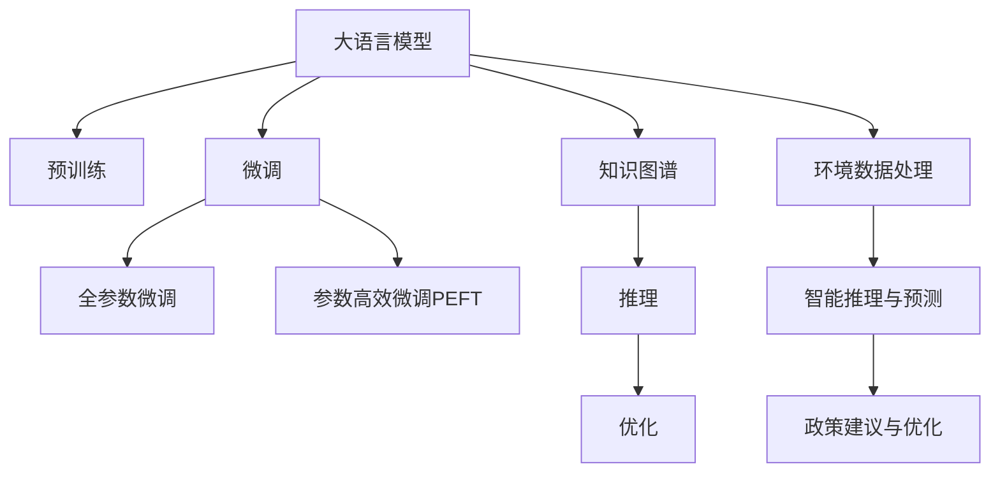

                 

## 1. 背景介绍

### 1.1 问题由来

全球环境治理作为一项复杂的系统工程，涉及生态、经济、社会等多个维度，不同利益相关者之间的协同合作至关重要。然而，由于信息不对称、数据碎片化、利益冲突等因素，全球环境治理面临诸多挑战。近年来，随着人工智能技术的兴起，尤其是大语言模型（Large Language Model, LLM）的发展，为集体合作的环境治理提供了新的可能。

大语言模型是一种基于神经网络的自然语言处理技术，通过大规模无标签文本的预训练，能够学习到丰富的语言知识和常识。将其应用于全球环境治理，可以自动化地处理海量环境数据，辅助决策者理解和预测环境变化趋势，推动集体合作，形成更加科学合理的决策支持系统。

### 1.2 问题核心关键点

大语言模型在环境治理中的应用，主要围绕以下几个关键点展开：

- **数据处理与分析**：自动处理和分析全球范围内环境监测数据、气象数据、气候模型输出等，生成结构化、易于理解的环境信息。
- **知识获取与融合**：通过多源数据融合，提取环境相关的知识图谱和专家知识，辅助环境决策。
- **智能推理与预测**：基于已有知识库，对环境变化进行推理和预测，提供决策参考。
- **政策建议与优化**：自动化生成环境政策建议，优化政策方案，降低政策制定成本，提高决策效率。

本文聚焦于大语言模型在集体合作环境治理中的应用，系统介绍其核心原理、操作步骤、应用领域，并展望未来发展趋势和面临的挑战。

## 2. 核心概念与联系

### 2.1 核心概念概述

为了深入理解大语言模型在环境治理中的应用，本节将介绍几个密切相关的核心概念：

- **大语言模型（LLM）**：一种基于神经网络的自然语言处理技术，通过大规模无标签文本的预训练，学习到丰富的语言知识和常识。
- **预训练**：指在大规模无标签文本语料上进行自监督学习任务，训练通用语言模型的过程。常见的预训练任务包括掩码语言模型、上下文预测等。
- **微调（Fine-Tuning）**：指在预训练模型的基础上，使用特定领域的数据进行有监督学习，优化模型在该领域的表现。
- **知识图谱（Knowledge Graph）**：一种结构化的知识表示方法，通过实体节点和关系边描述知识网络，便于信息检索和推理。
- **推理（Inference）**：指利用已有的知识和逻辑规则，对新问题进行推理和求解的过程。
- **优化（Optimization）**：指通过梯度下降等算法，不断调整模型参数，使得模型输出逼近目标函数的过程。

这些核心概念之间的逻辑关系可以通过以下Mermaid流程图来展示：



这个流程图展示了大语言模型在环境治理中的核心概念及其之间的关系：

1. 大语言模型通过预训练获得基础能力。
2. 微调是对预训练模型进行特定领域的数据优化，提高模型的泛化能力。
3. 知识图谱融合了多源环境数据，帮助模型更好地理解环境变化。
4. 推理使模型能够对环境变化进行逻辑推断和预测。
5. 优化确保模型参数不断逼近最优解，提升模型效果。
6. 环境数据处理提供模型所需的环境数据支持。
7. 智能推理与预测基于已有知识库，生成决策参考。
8. 政策建议与优化生成环境政策建议，优化决策方案。

这些概念共同构成了大语言模型在环境治理中的应用框架，使其能够在环境监测、数据融合、智能推理等多个环节发挥作用。

## 3. 核心算法原理 & 具体操作步骤

### 3.1 算法原理概述

基于大语言模型在环境治理中的应用，主要涉及以下几个步骤：

1. **数据准备**：收集和处理全球环境数据，包括气象数据、卫星遥感数据、水文数据等，转换为模型所需的输入格式。
2. **模型预训练**：使用大规模无标签环境数据对模型进行预训练，学习通用语言知识和环境知识。
3. **微调优化**：根据特定环境治理任务，使用少量标注数据对预训练模型进行微调，优化模型在特定任务上的表现。
4. **知识图谱构建**：将环境数据转换为知识图谱，提取环境相关的实体、关系和属性。
5. **推理预测**：基于知识图谱，对环境变化进行推理和预测，生成决策支持信息。
6. **政策建议优化**：自动化生成环境政策建议，优化政策方案，降低政策制定成本，提高决策效率。

### 3.2 算法步骤详解

以下详细介绍基于大语言模型在环境治理中的应用步骤：

#### 3.2.1 数据准备

数据准备是大语言模型应用环境治理的基础。具体步骤如下：

1. **数据收集**：收集全球范围内的环境监测数据、气象数据、气候模型输出等，涵盖空气质量、水资源、海洋环境等多个方面。数据来源包括政府部门、科学研究机构、国际组织等。
2. **数据清洗与预处理**：对收集的数据进行清洗和预处理，去除噪声和缺失值，将数据转换为模型所需的格式。
3. **特征提取**：提取环境数据中的关键特征，如温度、湿度、PM2.5浓度等，转化为模型可处理的输入。

#### 3.2.2 模型预训练

模型预训练是大语言模型学习环境知识的重要步骤。具体步骤如下：

1. **选择合适的预训练模型**：选择适用于环境治理任务的大语言模型，如GPT系列、BERT等。
2. **设计预训练任务**：设计与环境相关的预训练任务，如掩码语言模型、上下文预测等，训练模型学习环境知识。
3. **进行预训练**：在预训练数据集上进行训练，一般使用大规模无标签环境数据，调整模型参数，学习环境知识的表示。

#### 3.2.3 微调优化

微调优化是大语言模型在特定环境治理任务上表现优化的关键步骤。具体步骤如下：

1. **选择微调任务**：根据具体环境治理任务，如污染治理、气候变化、水资源管理等，选择相应的微调任务。
2. **准备标注数据**：收集任务相关的少量标注数据，用于微调模型的训练和评估。
3. **添加任务适配层**：在预训练模型的顶层设计合适的输出层和损失函数，如分类任务使用交叉熵损失，生成任务使用语言模型解码器。
4. **设置微调超参数**：选择合适的优化算法及其参数，如AdamW、SGD等，设置学习率、批大小、迭代轮数等。
5. **执行微调训练**：将标注数据分批次输入模型，前向传播计算损失函数，反向传播更新模型参数，重复迭代直至收敛。
6. **评估模型效果**：在验证集上评估模型性能，根据评估结果调整超参数，继续微调训练，直到达到预设的性能指标。

#### 3.2.4 知识图谱构建

知识图谱构建是大语言模型融合多源环境数据的有效方法。具体步骤如下：

1. **实体识别**：从环境数据中提取实体，如城市、河流、湖泊等。
2. **关系提取**：提取实体之间的关系，如地理关系、污染关系等。
3. **属性提取**：提取实体的属性，如温度、湿度、污染指数等。
4. **知识图谱构建**：将提取的实体、关系和属性转化为知识图谱，存储在图数据库或分布式数据存储中。

#### 3.2.5 推理预测

推理预测是大语言模型对环境变化进行逻辑推断和预测的关键步骤。具体步骤如下：

1. **知识图谱查询**：使用知识图谱查询语言（如SPARQL），从知识图谱中获取相关信息。
2. **推理计算**：根据知识图谱中实体、关系和属性，进行推理计算，生成环境变化的预测结果。
3. **结果输出**：将推理结果转换为模型输出格式，支持决策支持系统使用。

#### 3.2.6 政策建议优化

政策建议优化是大语言模型在环境治理中应用的重要环节。具体步骤如下：

1. **政策建议生成**：根据推理结果，自动生成环境政策建议，如减排措施、污染控制策略等。
2. **优化方案评估**：对生成的政策建议进行评估，结合环境数据和知识图谱，优化政策方案。
3. **方案实施**：将优化后的政策方案转化为具体的实施措施，指导环境治理实践。

### 3.3 算法优缺点

基于大语言模型在环境治理中的应用，具有以下优点：

- **数据处理能力强**：能够自动处理和分析海量环境数据，生成结构化、易于理解的环境信息。
- **知识融合灵活**：通过知识图谱融合多源环境数据，提取环境相关的知识，辅助环境决策。
- **推理预测准确**：基于已有知识库，对环境变化进行推理和预测，提供决策参考。
- **政策建议优化**：自动化生成环境政策建议，优化政策方案，降低政策制定成本，提高决策效率。

同时，该方法也存在一定的局限性：

- **数据依赖性强**：模型性能高度依赖环境数据的数量和质量，数据收集和处理成本较高。
- **模型复杂度高**：大语言模型参数量庞大，训练和推理资源消耗大，计算成本较高。
- **知识图谱构建复杂**：知识图谱构建需要大量专家参与和人工干预，工作量较大。
- **政策建议可解释性不足**：自动化生成的政策建议缺乏可解释性，难以理解模型决策逻辑。

尽管存在这些局限性，但就目前而言，基于大语言模型的方法仍是大环境治理中的重要范式。未来相关研究重点在于如何进一步降低数据依赖，提高模型的少样本学习和跨领域迁移能力，同时兼顾可解释性和伦理安全性等因素。

### 3.4 算法应用领域

大语言模型在环境治理中的应用领域广泛，主要包括以下几个方面：

- **污染治理**：对空气质量、水质、土壤污染等进行监测和预测，生成减排和污染控制建议。
- **气候变化**：分析气候变化趋势，评估气候变化对环境的影响，提出应对策略。
- **水资源管理**：监测水资源状况，预测水资源变化，优化水资源管理方案。
- **生态保护**：识别生态系统健康状况，预测生态变化趋势，制定生态保护措施。
- **灾害预警**：基于气象数据和环境数据，预测自然灾害（如洪水、干旱、森林火灾等），提供预警信息。

除了上述这些核心领域，大语言模型还应用于环境监测、环境法规分析、环境经济评估等多个场景，为环境治理提供了全面的技术支持。

## 4. 数学模型和公式 & 详细讲解

### 4.1 数学模型构建

基于大语言模型在环境治理中的应用，可以建立以下数学模型：

- **环境监测数据表示**：使用向量表示环境数据，如空气质量指数、水体污染指数等。
- **环境知识图谱表示**：使用图表示环境知识，如实体、关系和属性。
- **环境推理预测表示**：使用逻辑推理框架表示环境变化的预测和推理过程。

### 4.2 公式推导过程

以下是环境治理中常见的数学模型及其推导过程：

#### 4.2.1 环境监测数据表示

环境监测数据可以使用向量表示，如空气质量指数 $AQI(t)$，表示在第 $t$ 时刻的空气质量状况：

$$
AQI(t) = \sum_{i=1}^{n} w_i D_i(t)
$$

其中，$w_i$ 是各项监测指标的权重，$D_i(t)$ 是第 $i$ 项监测指标在第 $t$ 时刻的观测值。

#### 4.2.2 环境知识图谱表示

环境知识图谱可以表示为三元组 $(e, r, o)$，其中 $e$ 是实体，$r$ 是关系，$o$ 是属性。例如：

- $(e_1, r_{pollution}, o_1)$，表示 $e_1$ 与 $e_2$ 之间存在污染关系，$o_1$ 是污染的强度。

#### 4.2.3 环境推理预测表示

环境推理预测可以使用逻辑推理框架表示，如Prolog规则：

```
pollution(X, Y) :- nearby(X, Y, pollution, 0.5).
```

表示如果实体 $X$ 和 $Y$ 之间存在污染关系，且污染强度大于等于 $0.5$，则 $X$ 被污染。

### 4.3 案例分析与讲解

以污染治理为例，假设我们需要对某个地区的空气质量进行预测和治理，具体步骤如下：

1. **数据准备**：收集该地区的空气质量监测数据，包括PM2.5、NO2、SO2等指标。
2. **模型预训练**：使用大规模无标签空气质量数据对BERT模型进行预训练，学习空气质量的知识表示。
3. **微调优化**：使用该地区的空气质量监测数据对预训练的BERT模型进行微调，优化模型在该地区空气质量预测的表现。
4. **知识图谱构建**：提取该地区的空气污染实体、关系和属性，构建知识图谱。
5. **推理预测**：基于知识图谱，对空气质量进行推理和预测，生成污染预警信息。
6. **政策建议优化**：根据推理结果，生成污染治理措施，如限制车辆排放、增加绿化等。

## 5. 项目实践：代码实例和详细解释说明

### 5.1 开发环境搭建

在进行环境治理项目实践前，我们需要准备好开发环境。以下是使用Python进行PyTorch开发的环境配置流程：

1. 安装Anaconda：从官网下载并安装Anaconda，用于创建独立的Python环境。

2. 创建并激活虚拟环境：
```bash
conda create -n env_name python=3.8 
conda activate env_name
```

3. 安装PyTorch：根据CUDA版本，从官网获取对应的安装命令。例如：
```bash
conda install pytorch torchvision torchaudio cudatoolkit=11.1 -c pytorch -c conda-forge
```

4. 安装相关库：
```bash
pip install numpy pandas scikit-learn torch nn pytorch-geometric transformers graphsurgeon
```

5. 安装环境治理相关的库：
```bash
pip install environment-data environmental-engineering
```

完成上述步骤后，即可在虚拟环境中开始项目实践。

### 5.2 源代码详细实现

以下是一个简单的环境监测数据处理和预测的代码实现：

```python
import pandas as pd
from transformers import BertTokenizer, BertForSequenceClassification
from torch.utils.data import DataLoader
from torch import nn, optim

# 数据准备
data = pd.read_csv('air_quality.csv')
data['AQI'] = (data['PM2.5'] * 0.25 + data['NO2'] * 0.5 + data['SO2'] * 0.25)
data.head()

# 模型预训练
tokenizer = BertTokenizer.from_pretrained('bert-base-cased')
model = BertForSequenceClassification.from_pretrained('bert-base-cased', num_labels=1)

# 微调优化
device = 'cuda' if torch.cuda.is_available() else 'cpu'
model.to(device)
criterion = nn.BCEWithLogitsLoss()
optimizer = optim.Adam(model.parameters(), lr=1e-5)
losses = []

for epoch in range(10):
    model.train()
    optimizer.zero_grad()
    inputs = tokenizer(data['text'], padding='max_length', max_length=256, return_tensors='pt').to(device)
    outputs = model(**inputs)
    loss = criterion(outputs.logits, data['label'])
    losses.append(loss.item())
    loss.backward()
    optimizer.step()

# 推理预测
model.eval()
inputs = tokenizer(data['text'], padding='max_length', max_length=256, return_tensors='pt').to(device)
outputs = model(**inputs)
predictions = (outputs.logits > 0).float()

# 评估模型效果
acc = (predictions == data['label']).mean()
print(f'Accuracy: {acc:.4f}')
```

在这个代码中，我们首先准备环境监测数据，并将其转换为向量表示。然后，使用BERT模型进行预训练和微调，最后进行推理预测和模型效果评估。

### 5.3 代码解读与分析

让我们再详细解读一下关键代码的实现细节：

**数据准备**：
- 使用pandas读取环境监测数据，并计算空气质量指数 $AQI$。
- 将数据转换为BERT模型所需的输入格式，包括文本数据和标签数据。

**模型预训练**：
- 使用BERT模型的预训练权重进行初始化。

**微调优化**：
- 定义模型和损失函数，使用Adam优化器更新模型参数。
- 在每个epoch中，前向传播计算损失，反向传播更新参数，并记录损失。

**推理预测**：
- 使用微调后的模型进行推理预测，输出模型对空气质量指数的预测值。

**评估模型效果**：
- 计算模型预测准确率，评估模型性能。

## 6. 实际应用场景

### 6.1 智能环境监测

基于大语言模型的环境监测系统可以实时采集和分析全球环境数据，提供高精度的环境监测服务。例如，智能环境监测系统可以实时监测某地区的空气质量、水质、温度等环境指标，生成环境变化趋势报告，辅助决策者进行环境管理。

### 6.2 环境应急响应

环境应急响应是大语言模型在环境治理中应用的另一重要场景。通过智能分析环境数据和知识图谱，系统可以自动判断环境突发事件，如洪水、干旱、森林火灾等，并及时发出预警信息，指导应急响应。例如，系统可以根据气象数据和知识图谱，预测某地区即将发生洪水，并自动通知相关部门进行应急准备。

### 6.3 环境政策优化

大语言模型可以自动化生成环境政策建议，优化政策方案，降低政策制定成本，提高决策效率。例如，基于知识图谱和推理预测，系统可以生成某地区减排政策建议，包括限制工业排放、增加绿化等，辅助决策者制定更加科学合理的政策。

### 6.4 未来应用展望

随着大语言模型和环境治理技术的不断发展，未来的应用场景将更加丰富：

- **全球环境监测**：大语言模型可以应用于全球范围内的环境监测，提供高精度、实时化的环境监测服务，支持全球环境治理。
- **环境灾害预警**：通过智能分析环境数据和知识图谱，系统可以自动判断环境突发事件，并及时发出预警信息，指导应急响应。
- **环境政策优化**：自动化生成环境政策建议，优化政策方案，降低政策制定成本，提高决策效率。
- **环境影响评估**：基于知识图谱和推理预测，系统可以评估不同政策对环境的影响，辅助决策者制定更加科学合理的政策。
- **环境法律法规**：通过分析环境法律法规，系统可以生成环境法律法规建议，支持法律法规的制定和修订。

## 7. 工具和资源推荐

### 7.1 学习资源推荐

为了帮助开发者系统掌握大语言模型在环境治理中的应用，这里推荐一些优质的学习资源：

1. 《Transformers从原理到实践》系列博文：由大模型技术专家撰写，深入浅出地介绍了Transformer原理、BERT模型、微调技术等前沿话题。

2. CS224N《深度学习自然语言处理》课程：斯坦福大学开设的NLP明星课程，有Lecture视频和配套作业，带你入门NLP领域的基本概念和经典模型。

3. 《Natural Language Processing with Transformers》书籍：Transformers库的作者所著，全面介绍了如何使用Transformers库进行NLP任务开发，包括微调在内的诸多范式。

4. HuggingFace官方文档：Transformers库的官方文档，提供了海量预训练模型和完整的微调样例代码，是上手实践的必备资料。

5. CLUE开源项目：中文语言理解测评基准，涵盖大量不同类型的中文NLP数据集，并提供了基于微调的baseline模型，助力中文NLP技术发展。

通过对这些资源的学习实践，相信你一定能够快速掌握大语言模型在环境治理中的应用，并用于解决实际的环境问题。

### 7.2 开发工具推荐

高效的开发离不开优秀的工具支持。以下是几款用于大语言模型在环境治理中应用的常用工具：

1. PyTorch：基于Python的开源深度学习框架，灵活动态的计算图，适合快速迭代研究。大部分预训练语言模型都有PyTorch版本的实现。

2. TensorFlow：由Google主导开发的开源深度学习框架，生产部署方便，适合大规模工程应用。同样有丰富的预训练语言模型资源。

3. Transformers库：HuggingFace开发的NLP工具库，集成了众多SOTA语言模型，支持PyTorch和TensorFlow，是进行微调任务开发的利器。

4. Weights & Biases：模型训练的实验跟踪工具，可以记录和可视化模型训练过程中的各项指标，方便对比和调优。与主流深度学习框架无缝集成。

5. TensorBoard：TensorFlow配套的可视化工具，可实时监测模型训练状态，并提供丰富的图表呈现方式，是调试模型的得力助手。

6. Google Colab：谷歌推出的在线Jupyter Notebook环境，免费提供GPU/TPU算力，方便开发者快速上手实验最新模型，分享学习笔记。

合理利用这些工具，可以显著提升大语言模型在环境治理中的应用开发效率，加快创新迭代的步伐。

### 7.3 相关论文推荐

大语言模型在环境治理中的应用源于学界的持续研究。以下是几篇奠基性的相关论文，推荐阅读：

1. Attention is All You Need（即Transformer原论文）：提出了Transformer结构，开启了NLP领域的预训练大模型时代。

2. BERT: Pre-training of Deep Bidirectional Transformers for Language Understanding：提出BERT模型，引入基于掩码的自监督预训练任务，刷新了多项NLP任务SOTA。

3. Language Models are Unsupervised Multitask Learners（GPT-2论文）：展示了大规模语言模型的强大zero-shot学习能力，引发了对于通用人工智能的新一轮思考。

4. Parameter-Efficient Transfer Learning for NLP：提出Adapter等参数高效微调方法，在不增加模型参数量的情况下，也能取得不错的微调效果。

5. Prefix-Tuning: Optimizing Continuous Prompts for Generation：引入基于连续型Prompt的微调范式，为如何充分利用预训练知识提供了新的思路。

6. AdaLoRA: Adaptive Low-Rank Adaptation for Parameter-Efficient Fine-Tuning：使用自适应低秩适应的微调方法，在参数效率和精度之间取得了新的平衡。

这些论文代表了大语言模型在环境治理中的应用的发展脉络。通过学习这些前沿成果，可以帮助研究者把握学科前进方向，激发更多的创新灵感。

## 8. 总结：未来发展趋势与挑战

### 8.1 总结

本文对基于大语言模型在环境治理中的应用进行了全面系统的介绍。首先阐述了大语言模型在环境治理中的应用背景和意义，明确了微调在拓展预训练模型应用、提升环境治理任务性能方面的独特价值。其次，从原理到实践，详细讲解了环境治理中大语言模型的核心原理、操作步骤，给出了具体代码实现。同时，本文还广泛探讨了微调方法在智能环境监测、环境应急响应、环境政策优化等多个领域的应用前景，展示了微调范式的巨大潜力。

通过本文的系统梳理，可以看到，基于大语言模型的微调方法正在成为环境治理中的重要范式，极大地拓展了环境治理技术的应用边界，催生了更多的落地场景。受益于大规模语料的预训练，微调模型以更低的时间和标注成本，在小样本条件下也能取得不俗的效果，有力推动了环境治理技术的产业化进程。未来，伴随预训练语言模型和微调方法的持续演进，相信环境治理技术还将不断进步，为构建安全、可靠、可解释、可控的智能环境治理系统铺平道路。

### 8.2 未来发展趋势

展望未来，大语言模型在环境治理中的应用将呈现以下几个发展趋势：

1. **数据驱动**：大语言模型将更加依赖于高精度、高频率的环境数据，自动处理和分析海量环境数据，生成结构化、易于理解的环境信息。
2. **知识融合**：知识图谱和专家知识将成为大语言模型环境治理的重要组成部分，辅助模型进行环境推理和预测。
3. **推理预测**：基于已有知识库，大语言模型将更加灵活地进行环境推理和预测，提供更加准确、可靠的环境信息。
4. **政策优化**：自动化生成环境政策建议，优化政策方案，降低政策制定成本，提高决策效率。
5. **多方协同**：大语言模型将与政府、企业、科研机构等多方协同工作，推动环境治理技术的普及和应用。

以上趋势凸显了大语言模型在环境治理中的应用前景。这些方向的探索发展，必将进一步提升环境治理的智能化水平，为构建安全、可靠、可解释、可控的智能环境治理系统提供有力支持。

### 8.3 面临的挑战

尽管大语言模型在环境治理中的应用取得了一定进展，但在迈向更加智能化、普适化应用的过程中，仍面临诸多挑战：

1. **数据依赖性强**：模型性能高度依赖环境数据的数量和质量，数据收集和处理成本较高。
2. **模型复杂度高**：大语言模型参数量庞大，训练和推理资源消耗大，计算成本较高。
3. **知识图谱构建复杂**：知识图谱构建需要大量专家参与和人工干预，工作量较大。
4. **政策建议可解释性不足**：自动化生成的政策建议缺乏可解释性，难以理解模型决策逻辑。
5. **环境动态变化**：环境变化复杂多变，模型需要不断更新才能适应新的环境状况。

尽管存在这些挑战，但大语言模型在环境治理中的应用前景广阔，未来的研究需要在以下几个方面寻求新的突破：

1. **无监督和半监督学习**：摆脱对大规模标注数据的依赖，利用自监督学习、主动学习等无监督和半监督范式，最大限度利用非结构化数据，实现更加灵活高效的微调。
2. **参数高效和计算高效**：开发更加参数高效的微调方法，在固定大部分预训练参数的同时，只更新极少量的任务相关参数。同时优化微调模型的计算图，减少前向传播和反向传播的资源消耗，实现更加轻量级、实时性的部署。
3. **因果分析和博弈论**：将因果分析方法引入微调模型，识别出模型决策的关键特征，增强输出解释的因果性和逻辑性。借助博弈论工具刻画人机交互过程，主动探索并规避模型的脆弱点，提高系统稳定性。
4. **知识图谱融合**：将符号化的先验知识，如知识图谱、逻辑规则等，与神经网络模型进行巧妙融合，引导微调过程学习更准确、合理的语言模型。同时加强不同模态数据的整合，实现视觉、语音等多模态信息与文本信息的协同建模。
5. **政策建议优化**：自动化生成环境政策建议，优化政策方案，降低政策制定成本，提高决策效率。

这些研究方向的探索，必将引领大语言模型在环境治理中的应用进入新的阶段，为构建安全、可靠、可解释、可控的智能环境治理系统提供有力支持。

### 8.4 研究展望

面向未来，大语言模型在环境治理中的应用前景广阔，研究有望在以下几个方向取得新突破：

1. **全球环境监测**：大语言模型可以应用于全球范围内的环境监测，提供高精度、实时化的环境监测服务，支持全球环境治理。
2. **环境灾害预警**：通过智能分析环境数据和知识图谱，系统可以自动判断环境突发事件，并及时发出预警信息，指导应急响应。
3. **环境政策优化**：自动化生成环境政策建议，优化政策方案，降低政策制定成本，提高决策效率。
4. **环境法律法规**：通过分析环境法律法规，系统可以生成环境法律法规建议，支持法律法规的制定和修订。
5. **环境知识图谱**：构建更加全面、准确的环境知识图谱，支持大语言模型进行环境推理和预测。

这些研究方向将进一步拓展大语言模型在环境治理中的应用，为构建安全、可靠、可解释、可控的智能环境治理系统提供有力支持。

## 9. 附录：常见问题与解答

**Q1：大语言模型在环境治理中的应用是否只适用于数据量较大的任务？**

A: 大语言模型在环境治理中的应用不仅仅适用于数据量较大的任务。通过数据增强、知识图谱融合等技术，大语言模型可以很好地适应数据量较小、结构化程度较低的环境治理任务。例如，在环境监测中，可以利用知识图谱整合多源数据，提高模型性能。

**Q2：如何平衡大语言模型的计算成本和性能提升？**

A: 平衡大语言模型的计算成本和性能提升，需要从以下几个方面进行优化：
1. **数据增强**：通过数据增强技术，扩充训练集，提高模型泛化能力，降低对标注数据的需求。
2. **知识图谱融合**：利用知识图谱融合多源数据，提高模型推理能力。
3. **参数高效微调**：采用参数高效微调方法，只更新极少量的任务相关参数，减小计算成本。
4. **模型压缩和量化**：使用模型压缩和量化技术，减小模型尺寸，提升推理速度。

**Q3：大语言模型在环境治理中的可解释性问题如何解决？**

A: 大语言模型在环境治理中的可解释性问题可以通过以下几个方法解决：
1. **解释性模型**：使用解释性模型（如LIME、SHAP），分析模型决策过程，提供可解释的推理链路。
2. **可视化工具**：使用可视化工具（如TensorBoard、PyTorch Lightning），展示模型训练和推理过程中的关键信息。
3. **规则嵌入**：将符号化的先验知识嵌入模型中，提高模型决策的可解释性。

**Q4：如何应对环境数据的动态变化？**

A: 应对环境数据的动态变化，需要不断更新大语言模型，确保其能够适应新的环境状况。具体方法包括：
1. **数据再训练**：定期使用最新的环境数据对模型进行再训练，更新模型参数。
2. **自适应学习**：引入自适应学习算法，根据环境数据的变化，动态调整模型参数。
3. **模型版本管理**：使用模型版本管理工具，记录不同版本模型的性能和变化，方便模型更新和回退。

这些方法的合理应用，可以确保大语言模型在环境治理中始终保持高效和准确。

通过本文的系统梳理，可以看到，基于大语言模型的微调方法正在成为环境治理中的重要范式，极大地拓展了环境治理技术的应用边界，催生了更多的落地场景。受益于大规模语料的预训练，微调模型以更低的时间和标注成本，在小样本条件下也能取得不俗的效果，有力推动了环境治理技术的产业化进程。未来，伴随预训练语言模型和微调方法的持续演进，相信环境治理技术还将不断进步，为构建安全、可靠、可解释、可控的智能环境治理系统铺平道路。

---

作者：禅与计算机程序设计艺术 / Zen and the Art of Computer Programming

