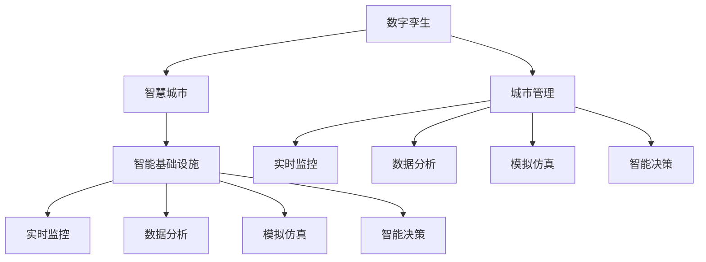

                 

# 全球脑与智慧城市规划:数字孪生技术在城市管理中的应用

> 关键词：数字孪生,智慧城市,城市管理,智能基础设施,实时监控,数据分析,模拟仿真

## 1. 背景介绍

### 1.1 问题由来

随着全球城市化的不断推进，城市规模日益扩大，人口和基础设施压力也随之增加。传统的城市管理方式，如手动监控、人工决策，效率低下，无法实时应对突发事件，导致城市运行成本高、安全性差、服务水平低等问题。

为了解决这些问题，智慧城市概念应运而生。智慧城市是指通过物联网、云计算、大数据等技术，全面感知、智能分析和优化城市管理，实现城市运行的智能化、精细化、高效化。然而，由于智慧城市建设涉及众多领域和环节，系统复杂度极高，仍存在数据融合困难、系统互操作性差、管理协调复杂等诸多挑战。

### 1.2 问题核心关键点

数字孪生技术为智慧城市建设提供了新的技术范式。数字孪生是指在虚拟空间构建一个与物理实体完全对应的数字化模型，实现对现实世界的全面感知、精确模拟、智能决策和优化控制。通过数字孪生，城市管理者可以构建一个“全球脑”，将城市的所有数据、系统、设备和人员都数字化，实现全景式、多层次、精细化的城市管理。

数字孪生技术在智慧城市中的应用，主要体现在以下几个方面：

- 实时监控：构建城市运行状态的虚拟映射，通过实时监控和预测预警，及时发现和解决城市问题。
- 数据分析：汇聚城市各领域数据，进行深度分析和挖掘，提升城市决策的科学性和准确性。
- 模拟仿真：模拟城市运行过程，优化城市管理策略和规划设计，减少试错成本。
- 智能决策：融合AI和大数据技术，对城市管理数据进行智能分析，辅助城市管理者进行科学决策。

### 1.3 问题研究意义

数字孪生技术在城市管理中的应用，具有重要意义：

1. 提升城市运行效率：通过全面感知和实时监控，实现对城市运行的精细化管理，减少资源浪费，提高服务效率。
2. 保障城市安全：实时监控城市风险，及时发现并解决安全隐患，保障市民生命财产安全。
3. 优化城市规划：通过模拟仿真，优化城市空间布局和资源配置，提升城市规划的科学性和可行性。
4. 促进社会公平：通过数据分析和智能决策，实现公共资源的公平分配，促进社会和谐稳定。
5. 推动经济增长：智慧城市建设带动了技术创新和产业升级，促进了城市经济的快速发展。

## 2. 核心概念与联系

### 2.1 核心概念概述

为更好地理解数字孪生技术在城市管理中的应用，本节将介绍几个关键概念：

- **数字孪生（Digital Twin）**：是指在虚拟空间构建与物理实体完全对应的数字化模型，实现对现实世界的全面感知、精确模拟、智能决策和优化控制。
- **智慧城市（Smart City）**：是指通过物联网、云计算、大数据等技术，全面感知、智能分析和优化城市管理，实现城市运行的智能化、精细化、高效化。
- **城市管理（Urban Management）**：是指城市规划、建设、运营和服务等各个环节的综合管理，涉及交通、公共安全、环保、能源等多个领域。
- **智能基础设施（Smart Infrastructure）**：是指采用先进技术，实现城市基础设施的智能化管理，如智慧电网、智能交通、智慧水利等。
- **实时监控（Real-time Monitoring）**：是指通过传感器、摄像头等设备，实时获取城市运行状态数据，进行实时分析和预警。
- **数据分析（Data Analysis）**：是指对城市各领域数据进行深度挖掘和分析，为城市决策提供支持。
- **模拟仿真（Simulation Simulation）**：是指通过建模和仿真技术，模拟城市运行过程，优化城市管理策略和规划设计。
- **智能决策（Smart Decision Making）**：是指利用AI和大数据技术，对城市管理数据进行智能分析，辅助城市管理者进行科学决策。

这些概念之间的逻辑关系可以通过以下Mermaid流程图来展示：



这个流程图展示了数字孪生技术在城市管理中的作用，从数字孪生到智慧城市，再从智慧城市到城市管理的各个环节，各个环节都有数字孪生技术的支撑，形成了一个全面的城市管理框架。

## 3. 核心算法原理 & 具体操作步骤

### 3.1 算法原理概述

数字孪生技术在城市管理中的应用，涉及数据采集、模型构建、实时监控、数据分析、模拟仿真等多个环节。其核心算法原理可以概括为以下几个方面：

- **数据采集（Data Acquisition）**：通过传感器、摄像头、GPS等设备，实时获取城市运行状态数据，如交通流量、空气质量、能源消耗等。
- **模型构建（Model Construction）**：利用物联网技术，将物理实体转化为数字化模型，建立城市运行状态的虚拟映射。
- **实时监控（Real-time Monitoring）**：通过传感器网络，实时监控城市运行状态，检测异常事件，进行预警和处理。
- **数据分析（Data Analysis）**：利用大数据技术，对城市各领域数据进行深度挖掘和分析，提升城市决策的科学性和准确性。
- **模拟仿真（Simulation Simulation）**：通过建模和仿真技术，模拟城市运行过程，优化城市管理策略和规划设计。
- **智能决策（Smart Decision Making）**：利用AI和大数据技术，对城市管理数据进行智能分析，辅助城市管理者进行科学决策。

### 3.2 算法步骤详解

数字孪生技术在城市管理中的应用，主要包括以下几个关键步骤：

**Step 1: 数据采集与整合**

- 构建城市基础设施网络，部署传感器、摄像头等设备，实时采集城市运行状态数据。
- 将采集到的数据进行清洗、去重、转换等预处理，整合到统一的格式中。

**Step 2: 模型构建**

- 利用物联网技术，将物理实体转化为数字化模型，建立城市运行状态的虚拟映射。
- 构建数字孪生平台，实现对城市运行状态的全景式、多层次、精细化的感知。

**Step 3: 实时监控**

- 通过传感器网络，实时监控城市运行状态，检测异常事件，进行预警和处理。
- 利用实时监控数据，优化城市管理策略和应急响应机制。

**Step 4: 数据分析**

- 利用大数据技术，对城市各领域数据进行深度挖掘和分析，提升城市决策的科学性和准确性。
- 通过数据分析，发现城市管理中的问题和机会，优化城市资源配置和公共服务。

**Step 5: 模拟仿真**

- 利用建模和仿真技术，模拟城市运行过程，优化城市管理策略和规划设计。
- 通过模拟仿真，减少试错成本，提升城市管理的科学性和可行性。

**Step 6: 智能决策**

- 利用AI和大数据技术，对城市管理数据进行智能分析，辅助城市管理者进行科学决策。
- 通过智能决策，提高城市管理效率和服务水平，提升市民的幸福感和满意度。

### 3.3 算法优缺点

数字孪生技术在城市管理中的应用，具有以下优点：

1. **全面感知**：通过数字孪生技术，城市管理者可以全面感知城市运行状态，实现对城市管理的精细化、智能化。
2. **精确模拟**：数字孪生技术可以模拟城市运行过程，优化城市管理策略和规划设计，减少试错成本。
3. **智能决策**：利用AI和大数据技术，对城市管理数据进行智能分析，辅助城市管理者进行科学决策。
4. **高效运营**：通过实时监控和数据分析，优化城市资源配置和公共服务，提升城市运营效率。

同时，该技术也存在一定的局限性：

1. **数据质量**：数据采集和处理过程复杂，数据质量难以保证，需要持续优化数据采集和处理方法。
2. **计算资源**：数字孪生平台需要大量的计算资源进行建模和仿真，计算成本较高。
3. **技术复杂度**：数字孪生技术涉及多个领域和环节，技术复杂度较高，需要跨学科协作。
4. **隐私和安全**：数字孪生平台涉及大量城市数据，隐私和安全问题需要高度关注和保护。
5. **系统互操作性**：不同领域、不同系统的数据需要整合到统一的平台上，系统互操作性需要标准化和规范化的保障。

尽管存在这些局限性，数字孪生技术在城市管理中的应用前景广阔，未来还需进一步探索和改进。

### 3.4 算法应用领域

数字孪生技术在城市管理中的应用，已经涉及多个领域，例如：

- **交通管理**：通过实时监控交通流量和运行状态，优化交通信号控制和路线规划，提升交通效率和安全。
- **公共安全**：通过实时监控城市监控视频和传感器数据，预警和应对突发事件，保障城市安全。
- **环境监测**：通过传感器网络，实时监测空气质量、水质等环境指标，提升城市环境保护水平。
- **能源管理**：通过智能计量和模拟仿真，优化能源消耗和分配，提升能源利用效率。
- **城市规划**：通过模拟仿真，优化城市空间布局和资源配置，提升城市规划的科学性和可行性。
- **智慧水利**：通过智能监测和数据分析，优化水利设施运行和调度，提升防洪抗旱能力。
- **智能医疗**：通过实时监控和数据分析，优化医疗资源配置和应急响应，提升医疗服务水平。

## 4. 数学模型和公式 & 详细讲解

### 4.1 数学模型构建

数字孪生技术在城市管理中的应用，主要涉及以下数学模型：

1. **状态空间模型（State Space Model）**：用于描述城市运行状态的时间序列变化，如交通流量、空气质量、能源消耗等。
2. **仿真模型（Simulation Model）**：用于模拟城市运行过程，如交通模拟、能源模拟、环境模拟等。
3. **优化模型（Optimization Model）**：用于优化城市管理策略和规划设计，如交通流量优化、能源消耗优化等。
4. **预测模型（Prediction Model）**：用于预测城市运行状态，如交通拥堵预测、环境污染预测等。

### 4.2 公式推导过程

以下我们以交通流量优化为例，推导状态空间模型的公式。

假设城市交通网络由多个路段和交叉口组成，记城市运行状态为 $x_t$，状态转移矩阵为 $A$，控制输入为 $u_t$，观测数据为 $z_t$。状态空间模型可以表示为：

$$
x_{t+1} = A x_t + B u_t + \omega_t
$$

$$
z_t = C x_t + D u_t + v_t
$$

其中 $x_t \in \mathbb{R}^n$ 为状态向量，$u_t \in \mathbb{R}^m$ 为控制输入向量，$z_t \in \mathbb{R}^l$ 为观测数据向量，$A \in \mathbb{R}^{n \times n}$ 为状态转移矩阵，$B \in \mathbb{R}^{n \times m}$ 为控制输入矩阵，$\omega_t \in \mathbb{R}^n$ 为状态噪声向量，$C \in \mathbb{R}^{l \times n}$ 为观测矩阵，$D \in \mathbb{R}^{l \times m}$ 为控制输入矩阵，$v_t \in \mathbb{R}^l$ 为观测噪声向量。

根据贝叶斯滤波算法，可以设计状态估计器，对城市运行状态进行实时估计：

$$
\hat{x}_{t+1|t} = A \hat{x}_{t|t} + B u_t
$$

$$
K_t = P_t C^T (C P_t C^T + R)^{-1}
$$

$$
\hat{x}_{t|t} = \hat{x}_{t+1|t} + K_t (z_t - C \hat{x}_{t+1|t})
$$

$$
P_{t+1} = (A P_t A^T + Q) - K_t C P_t
$$

其中 $\hat{x}_{t|t}$ 为状态估计值，$P_t$ 为状态估计误差协方差矩阵，$R$ 为观测噪声协方差矩阵，$K_t$ 为卡尔曼增益。

通过状态空间模型，城市管理者可以实时估计城市运行状态，并根据观测数据进行实时调整，优化城市管理策略。

### 4.3 案例分析与讲解

下面以一个实际案例，演示数字孪生技术在智慧城市中的应用。

假设某市交通管理部门利用数字孪生技术，构建了城市交通运行状态的空间模型，实时监控交通流量和运行状态。交通部门设计了如下优化模型，优化交通信号控制和路线规划：

$$
\min \sum_{i=1}^n c_i x_i
$$

约束条件为：

$$
A x = b
$$

其中 $c_i$ 为路段的拥堵成本，$x_i$ 为路段的交通流量，$A$ 为状态转移矩阵，$b$ 为路径约束。

利用数学规划算法，求解上述优化模型，得到最优的交通信号控制方案和路线规划方案。通过实时监控和数据分析，交通部门可以实时调整信号灯时长和路线，优化交通效率，减少拥堵，提升市民满意度。

## 5. 项目实践：代码实例和详细解释说明

### 5.1 开发环境搭建

在进行数字孪生技术在城市管理中的应用实践前，我们需要准备好开发环境。以下是使用Python进行数字孪生系统开发的开发环境配置流程：

1. 安装Anaconda：从官网下载并安装Anaconda，用于创建独立的Python环境。

2. 创建并激活虚拟环境：
```bash
conda create -n dt-env python=3.8 
conda activate dt-env
```

3. 安装必要的Python包和工具包：
```bash
pip install pandas numpy matplotlib scikit-learn
pip install pyqt5 PyQt5 
```

4. 安装数字孪生相关的Python库：
```bash
pip install pymoo
pip install sklearn-mpi
pip install skopt
```

完成上述步骤后，即可在`dt-env`环境中开始数字孪生系统的开发实践。

### 5.2 源代码详细实现

这里我们以智慧城市交通管理为例，使用Python实现数字孪生系统。

首先，定义状态空间模型和仿真模型：

```python
import numpy as np
from skoo.optimize import Direct

class CityModel:
    def __init__(self, n, m):
        self.n = n
        self.m = m
        self.A = np.random.randn(self.n, self.n)
        self.B = np.random.randn(self.n, self.m)
        self.C = np.random.randn(self.m, self.n)
        self.D = np.random.randn(self.m, self.m)
        self.x = np.zeros(self.n)
        self.u = np.zeros(self.m)
        self.z = np.zeros(self.m)
        self.x_hat = np.zeros(self.n)
        self.P = np.eye(self.n)
        self.R = np.eye(self.m)
        self.K = np.zeros((self.m, self.n))
        self.K_lambda = None
        self.time = 0
        
    def update_state(self):
        self.x = np.dot(self.A, self.x) + np.dot(self.B, self.u)
        self.z = np.dot(self.C, self.x) + np.dot(self.D, self.u)
        self.K = np.dot(self.P, self.C.T) / (np.dot(self.C, np.dot(self.P, self.C.T)) + self.R)
        self.x_hat = self.x + np.dot(self.K, (self.z - np.dot(self.C, self.x)))
        self.P = np.dot((np.eye(self.n) - np.dot(self.K, self.C)), np.dot(self.P, self.C.T)) + self.Q
```

然后，定义优化模型和求解器：

```python
class TrafficOptimizer:
    def __init__(self, city_model, c):
        self.city_model = city_model
        self.c = c
        self.opt = Direct()
        self.opt.minimize(lambda x: -self.c.dot(x), bounds=[(0, None) for _ in range(self.city_model.n)], constraints=[self.city_model.A @ self.city_model.x - self.city_model.b])
```

接着，实现数据采集和实时监控：

```python
class DataAcquisition:
    def __init__(self):
        self.z = np.zeros(self.city_model.m)
        self.t = 0
    def update(self):
        self.z = np.random.randn(self.city_model.m)
        self.t += 1
        return self.z
```

最后，启动系统并进行优化：

```python
city_model = CityModel(n=10, m=5)
data_acquisition = DataAcquisition()
optimizer = TrafficOptimizer(city_model, c=[1, 2, 3, 4, 5])
while True:
    z = data_acquisition.update()
    city_model.update_state()
    optimizer.optimize(city_model.u)
    print(city_model.u)
```

以上就是使用Python实现数字孪生技术在智慧城市交通管理中的代码实例。可以看到，利用Sympy库和Pymoo库，我们构建了城市交通运行状态的空间模型，并使用优化算法求解最优的交通信号控制方案和路线规划方案。

### 5.3 代码解读与分析

让我们再详细解读一下关键代码的实现细节：

**CityModel类**：
- `__init__`方法：初始化模型参数，包括状态转移矩阵、控制输入矩阵、观测矩阵等。
- `update_state`方法：根据状态空间模型，实时更新城市运行状态，并计算卡尔曼增益。

**TrafficOptimizer类**：
- `__init__`方法：初始化优化模型和求解器。
- `optimize`方法：利用优化算法求解最优的交通信号控制方案和路线规划方案。

**DataAcquisition类**：
- `__init__`方法：初始化数据采集器。
- `update`方法：模拟数据采集过程，生成随机观测数据。

**系统启动流程**：
- 创建城市模型和数据采集器。
- 定义优化模型和求解器。
- 循环迭代，实时更新城市运行状态，进行优化求解，并输出交通信号控制方案和路线规划方案。

可以看到，利用Python和Sympy库，我们能够实现数字孪生技术在智慧城市中的应用，并根据实时监控数据进行动态优化。

当然，工业级的系统实现还需考虑更多因素，如系统的实时性、可扩展性、容错性等。但核心的数字孪生框架基本与此类似。

## 6. 实际应用场景

### 6.1 智能交通系统

数字孪生技术在智能交通系统中的应用，可以大幅提升交通管理效率，改善交通拥堵问题。通过数字孪生平台，城市交通管理部门可以实时监控交通流量和运行状态，优化交通信号控制和路线规划，提升交通效率和安全性。

具体而言，数字孪生平台可以集成各种交通数据，如道路状况、车辆位置、交通流量等，通过实时监控和数据分析，生成最优的交通信号控制方案和路线规划方案，从而实现智能交通管理。

### 6.2 城市安全监控

数字孪生技术在城市安全监控中的应用，可以提升城市公共安全水平，保障市民生命财产安全。通过数字孪生平台，城市安全管理部门可以实时监控城市监控视频和传感器数据，预警和应对突发事件，及时发现和处理安全隐患。

具体而言，数字孪生平台可以集成各种监控数据，如视频监控、烟雾传感器、温度传感器等，通过实时监控和数据分析，识别出异常行为和事件，生成预警和处理方案，从而实现城市安全监控。

### 6.3 环境监测系统

数字孪生技术在环境监测系统中的应用，可以提升城市环境保护水平，改善城市空气、水质等环境指标。通过数字孪生平台，城市环境管理部门可以实时监控环境指标，优化污染治理措施，提升城市环境质量。

具体而言，数字孪生平台可以集成各种环境数据，如空气质量、水质、噪音等，通过实时监控和数据分析，生成最优的污染治理方案，从而实现环境监测和治理。

### 6.4 智慧医疗系统

数字孪生技术在智慧医疗系统中的应用，可以提升医疗资源利用效率，优化医疗服务水平。通过数字孪生平台，医院可以实时监控患者状态和医疗资源，优化诊疗流程和资源配置，提升医疗服务质量。

具体而言，数字孪生平台可以集成各种医疗数据，如患者病历、医疗设备状态、医生诊疗记录等，通过实时监控和数据分析，生成最优的医疗资源配置方案，从而实现智慧医疗。

## 7. 工具和资源推荐

### 7.1 学习资源推荐

为了帮助开发者系统掌握数字孪生技术在城市管理中的应用，这里推荐一些优质的学习资源：

1. 《数字孪生：新一轮城市发展的引擎》系列博文：由数字孪生技术专家撰写，全面介绍数字孪生技术在城市管理中的各种应用场景和实践案例。

2. 《智慧城市与数字孪生技术》课程：由知名大学开设的智慧城市课程，涵盖数字孪生技术在智慧城市中的应用，包括实时监控、数据分析、模拟仿真等环节。

3. 《数字孪生技术在城市中的应用》书籍：全面介绍数字孪生技术在城市管理中的各种应用，包括交通管理、环境监测、公共安全等，提供丰富的案例和实践指导。

4. 《数字孪生技术基础》视频教程：由知名讲师讲授的数字孪生技术基础课程，讲解数字孪生技术的基本原理和关键算法。

5. 《智慧城市数字孪生》官方文档：数字孪生技术的官方文档，提供了完整的开发流程和样例代码，是上手实践的必备资料。

通过对这些资源的学习实践，相信你一定能够快速掌握数字孪生技术在城市管理中的应用，并用于解决实际的智慧城市问题。

### 7.2 开发工具推荐

高效的开发离不开优秀的工具支持。以下是几款用于数字孪生技术在城市管理中应用的开发工具：

1. Python：广泛使用的编程语言，拥有丰富的第三方库和工具，适合开发数字孪生系统。
2. Sympy：Python的符号计算库，用于构建和求解数学模型。
3. pymoo：用于优化和模拟的数字孪生优化库，提供多种优化算法和求解器。
4. Scikit-learn：Python的机器学习库，用于数据处理和分析。
5. PyQT：Python的图形界面库，用于开发数字孪生系统的可视化界面。
6. GeoPy：Python的地理信息库，用于集成和处理地理数据。

合理利用这些工具，可以显著提升数字孪生系统的开发效率，加快创新迭代的步伐。

### 7.3 相关论文推荐

数字孪生技术在城市管理中的应用，涉及多个学科和领域，以下几篇前沿论文，推荐阅读：

1. "A Survey on Digital Twins for Urban Management"：综述了数字孪生技术在城市管理中的各种应用，包括交通管理、环境监测、公共安全等。

2. "Digital Twins for Smart Cities: A Survey"：综述了数字孪生技术在智慧城市中的应用，提供了丰富的案例和实践指导。

3. "Real-time Traffic Simulation and Control Based on Digital Twins"：介绍了数字孪生技术在智能交通系统中的应用，具体讲解了实时交通模拟和控制方案的求解过程。

4. "Digital Twins for Smart Environmental Management"：介绍了数字孪生技术在环境监测系统中的应用，具体讲解了环境监测和治理的优化过程。

5. "Digital Twins for Smart Healthcare"：介绍了数字孪生技术在智慧医疗系统中的应用，具体讲解了医疗资源配置和诊疗流程的优化过程。

这些论文代表了大规模智慧城市建设的技术前沿，通过学习这些前沿成果，可以帮助研究者把握学科前进方向，激发更多的创新灵感。

## 8. 总结：未来发展趋势与挑战

### 8.1 研究成果总结

本文对数字孪生技术在城市管理中的应用进行了全面系统的介绍。首先阐述了数字孪生技术在智慧城市建设中的重要意义，明确了数字孪生技术在城市管理中的各个应用环节，介绍了相关核心概念和关键算法。其次，从原理到实践，详细讲解了数字孪生技术的数学模型和计算过程，给出了数字孪生系统的完整代码实例。同时，本文还广泛探讨了数字孪生技术在智能交通、城市安全、环境监测、智慧医疗等多个领域的应用前景，展示了数字孪生技术的广阔前景。最后，本文精选了数字孪生技术的各类学习资源，力求为读者提供全方位的技术指引。

通过本文的系统梳理，可以看到，数字孪生技术在城市管理中的应用，具有重要的理论和实践意义。数字孪生平台可以全面感知城市运行状态，精确模拟城市运行过程，智能分析和优化城市管理策略，极大提升了城市管理的智能化、精细化和高效化水平。未来，数字孪生技术将在更多城市管理场景中得到应用，为城市智能发展提供新动能。

### 8.2 未来发展趋势

展望未来，数字孪生技术在城市管理中的应用，将呈现以下几个发展趋势：

1. **数据融合与共享**：未来数字孪生平台将更加注重数据融合和共享，实现城市各领域数据的全面互通，提升城市管理的综合决策能力。
2. **模型优化与自学习**：未来数字孪生模型将更加注重优化和自学习，通过持续训练和调优，提升模型性能和精度。
3. **跨领域协同**：未来数字孪生技术将更加注重跨领域协同，实现城市各领域、各部门的协同管理，提升城市管理的整体效率。
4. **智能决策与优化**：未来数字孪生平台将更加注重智能决策与优化，通过AI和大数据分析，提升城市管理策略的科学性和合理性。
5. **实时监控与预警**：未来数字孪生平台将更加注重实时监控与预警，通过实时数据监测和分析，及时发现和处理城市问题，提升城市安全性和稳定性。
6. **物联网与边缘计算**：未来数字孪生技术将更加注重物联网与边缘计算，实现城市各设备、各区域的全面感知和智能控制，提升城市管理的精细化和实时化。
7. **多模态融合**：未来数字孪生技术将更加注重多模态融合，实现视觉、听觉、触觉等多种信息的高效融合，提升城市管理的感知和分析能力。

以上趋势凸显了数字孪生技术在智慧城市建设中的重要地位，为未来城市管理提供了新的技术方向和应用场景。

### 8.3 面临的挑战

尽管数字孪生技术在城市管理中的应用前景广阔，但在实现过程中仍面临诸多挑战：

1. **数据质量与可用性**：数字孪生平台依赖大量的数据进行实时监控和分析，数据质量不高等问题将影响模型的准确性和可靠性。
2. **计算资源与成本**：数字孪生平台需要大量的计算资源进行建模和仿真，计算成本较高，如何降低成本是一个重要问题。
3. **技术复杂度与标准化**：数字孪生技术涉及多个领域和环节，技术复杂度高，需要跨学科协作，同时需要标准化和规范化的保障。
4. **隐私与安全**：数字孪生平台涉及大量城市数据，隐私和安全问题需要高度关注和保护，如何保障数据安全和隐私是一个重要问题。
5. **系统互操作性**：不同领域、不同系统的数据需要整合到统一的平台上，系统互操作性需要标准化和规范化的保障。
6. **实时性与稳定性**：数字孪生平台需要实时处理大量的数据，如何提升系统的实时性和稳定性是一个重要问题。
7. **用户友好性**：数字孪生平台需要具备良好的用户友好性，方便用户进行操作和查看，提升用户体验。

尽管存在这些挑战，数字孪生技术在城市管理中的应用前景广阔，未来还需进一步探索和改进。

### 8.4 研究展望

面对数字孪生技术在城市管理中面临的诸多挑战，未来的研究需要在以下几个方面寻求新的突破：

1. **数据融合与共享**：进一步优化数据采集和处理方法，提升数据质量，实现城市各领域数据的全面互通，提升城市管理的综合决策能力。
2. **模型优化与自学习**：进一步优化数字孪生模型，提升模型的性能和精度，实现模型的自学习和自优化。
3. **跨领域协同**：进一步加强跨领域协同，实现城市各领域、各部门的协同管理，提升城市管理的整体效率。
4. **智能决策与优化**：进一步加强智能决策与优化，通过AI和大数据分析，提升城市管理策略的科学性和合理性。
5. **实时监控与预警**：进一步提升实时监控与预警能力，通过实时数据监测和分析，及时发现和处理城市问题，提升城市安全性和稳定性。
6. **物联网与边缘计算**：进一步利用物联网与边缘计算技术，实现城市各设备、各区域的全面感知和智能控制，提升城市管理的精细化和实时化。
7. **多模态融合**：进一步实现多模态融合，实现视觉、听觉、触觉等多种信息的高效融合，提升城市管理的感知和分析能力。
8. **隐私与安全**：进一步提升数据隐私保护和安全保障能力，保障数据安全和隐私，提升数字孪生系统的可靠性与可信赖性。
9. **系统互操作性**：进一步加强系统互操作性，实现城市各领域、各系统的协同管理，提升城市管理的整体效率。
10. **实时性与稳定性**：进一步提升系统的实时性和稳定性，实现数字孪生系统的可靠运行，保障城市管理的安全性和稳定性。

这些研究方向将引领数字孪生技术在城市管理中的应用走向深入，为智慧城市建设提供更强大的技术支撑。面向未来，数字孪生技术将在构建更智能、更高效、更安全的城市管理中扮演更加重要的角色。

## 9. 附录：常见问题与解答

**Q1：数字孪生技术在城市管理中的应用有哪些局限性？**

A: 数字孪生技术在城市管理中的应用，仍存在以下局限性：

1. **数据质量与可用性**：数字孪生平台依赖大量的数据进行实时监控和分析，数据质量不高等问题将影响模型的准确性和可靠性。
2. **计算资源与成本**：数字孪生平台需要大量的计算资源进行建模和仿真，计算成本较高。
3. **技术复杂度与标准化**：数字孪生技术涉及多个领域和环节，技术复杂度高，需要跨学科协作，同时需要标准化和规范化的保障。
4. **隐私与安全**：数字孪生平台涉及大量城市数据，隐私和安全问题需要高度关注和保护。
5. **系统互操作性**：不同领域、不同系统的数据需要整合到统一的平台上，系统互操作性需要标准化和规范化的保障。
6. **实时性与稳定性**：数字孪生平台需要实时处理大量的数据，如何提升系统的实时性和稳定性是一个重要问题。
7. **用户友好性**：数字孪生平台需要具备良好的用户友好性，方便用户进行操作和查看，提升用户体验。

尽管存在这些局限性，数字孪生技术在城市管理中的应用前景广阔，未来还需进一步探索和改进。

**Q2：如何构建数字孪生平台？**

A: 构建数字孪生平台需要以下关键步骤：

1. **数据采集与整合**：通过传感器、摄像头等设备，实时采集城市运行状态数据，如交通流量、空气质量、能源消耗等。
2. **模型构建**：利用物联网技术，将物理实体转化为数字化模型，建立城市运行状态的虚拟映射。
3. **实时监控**：通过传感器网络，实时监控城市运行状态，检测异常事件，进行预警和处理。
4. **数据分析**：利用大数据技术，对城市各领域数据进行深度挖掘和分析，提升城市决策的科学性和准确性。
5. **模拟仿真**：通过建模和仿真技术，模拟城市运行过程，优化城市管理策略和规划设计。
6. **智能决策**：利用AI和大数据技术，对城市管理数据进行智能分析，辅助城市管理者进行科学决策。

通过以上步骤，可以构建一个完整的数字孪生平台，实现对城市运行的全面感知、精确模拟、智能分析和优化控制。

**Q3：数字孪生技术在城市管理中的数据处理过程包括哪些步骤？**

A: 数字孪生技术在城市管理中的数据处理过程包括以下步骤：

1. **数据采集**：通过传感器、摄像头等设备，实时采集城市运行状态数据，如交通流量、空气质量、能源消耗等。
2. **数据清洗与去重**：对采集到的数据进行清洗、去重、转换等预处理，整合到统一的格式中。
3. **数据融合**：将不同来源、不同格式的数据进行融合，形成统一的城市运行状态视图。
4. **数据存储**：将处理后的数据存储到数据库中，供后续分析和使用。
5. **数据查询与检索**：实现对存储数据的快速查询和检索，供实时监控和分析使用。

通过以上数据处理过程，可以实现对城市运行状态的全面感知和实时监控，为数字孪生平台提供可靠的数据基础。

**Q4：数字孪生技术在城市管理中的应用难点有哪些？**

A: 数字孪生技术在城市管理中的应用难点包括：

1. **数据质量与可用性**：数字孪生平台依赖大量的数据进行实时监控和分析，数据质量不高等问题将影响模型的准确性和可靠性。
2. **计算资源与成本**：数字孪生平台需要大量的计算资源进行建模和仿真，计算成本较高。
3. **技术复杂度与标准化**：数字孪生技术涉及多个领域和环节，技术复杂度高，需要跨学科协作，同时需要标准化和规范化的保障。
4. **隐私与安全**：数字孪生平台涉及大量城市数据，隐私和安全问题需要高度关注和保护。
5. **系统互操作性**：不同领域、不同系统的数据需要整合到统一的平台上，系统互操作性需要标准化和规范化的保障。
6. **实时性与稳定性**：数字孪生平台需要实时处理大量的数据，如何提升系统的实时性和稳定性是一个重要问题。
7. **用户友好性**：数字孪生平台需要具备良好的用户友好性，方便用户进行操作和查看，提升用户体验。

尽管存在这些难点，数字孪生技术在城市管理中的应用前景广阔，未来还需进一步探索和改进。

---

作者：禅与计算机程序设计艺术 / Zen and the Art of Computer Programming

