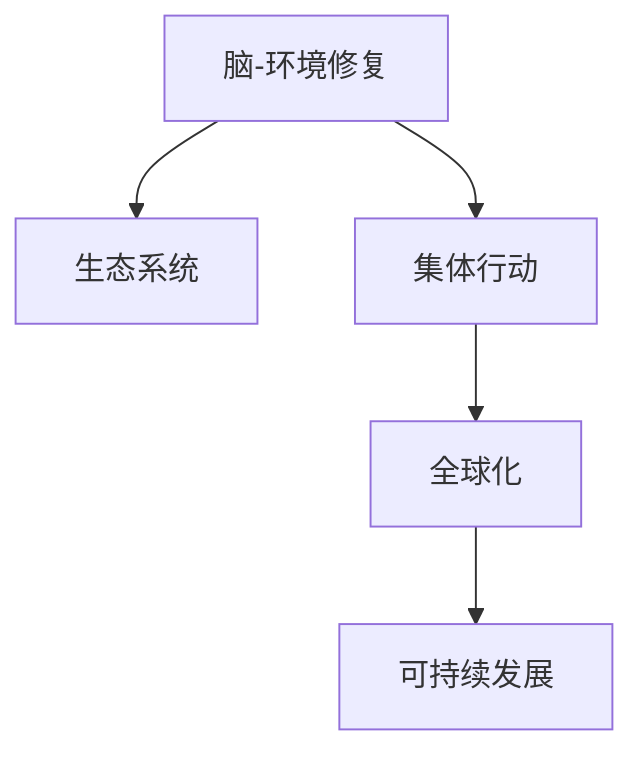

                 

# 全球脑与环境修复:集体行动的生态效应

> 关键词：脑-环境修复、生态系统、集体行动、全球化、可持续发展

## 1. 背景介绍

### 1.1 问题由来
随着全球化的深入，人类活动的扩展对生态环境造成了巨大的影响。工业化进程中的能源消耗、废气排放、土地开发等活动，以及对自然资源的无节制开采，严重破坏了生态平衡。同时，城市化进程中的人口集中、资源消耗增加，使得生态环境更加脆弱。这些问题不仅对自然界产生影响，也直接关系到人类社会的可持续发展。

### 1.2 问题核心关键点
针对上述问题，全球社会开始寻求解决方案。其中，脑-环境修复和集体行动被认为是关键手段。脑-环境修复指的是利用科学技术和人类大脑的智慧，通过有效的生态修复和可持续发展策略，恢复生态系统的平衡。集体行动则是指全球范围内的协同合作，共同应对环境挑战，实现可持续发展的目标。

### 1.3 问题研究意义
研究脑-环境修复和集体行动的生态效应，对于推动全球环境治理、促进可持续发展具有重要意义。它可以为各国政府、企业和民众提供参考，帮助制定和实施有效的环境保护政策，实现经济社会和生态环境的协调发展。

## 2. 核心概念与联系

### 2.1 核心概念概述

为更好地理解脑-环境修复和集体行动的生态效应，本节将介绍几个密切相关的核心概念：

- **脑-环境修复**：利用科学技术和人类智慧，通过恢复生态系统、改善环境质量、促进可持续发展，实现人与自然的和谐共处。
- **生态系统**：由生物群落及其无机环境组成的统一整体，包括生物圈、大气圈、水圈、岩石圈等，是地球上最重要的自然系统。
- **集体行动**：指多个行为体在某一共同目标下协同合作，共同解决问题，如环境保护、气候变化等。
- **全球化**：指全球范围内的经济、政治、文化等各个方面的交流与互动，形成了全球统一市场，同时也带来了全球性环境问题。
- **可持续发展**：指在不损害后代人满足其需求能力的前提下，满足当代人需求的发展方式。

这些核心概念之间的逻辑关系可以通过以下Mermaid流程图来展示：



这个流程图展示了大脑-环境修复和集体行动的生态效应与全球化、可持续发展的紧密联系：

1. 脑-环境修复通过恢复生态系统，提升其服务功能，支持可持续发展。
2. 集体行动促进全球协同合作，共同应对环境问题，实现全球范围内的可持续发展。
3. 全球化带来的经济活动对生态环境产生影响，需要通过脑-环境修复和集体行动加以应对。

## 3. 核心算法原理 & 具体操作步骤
### 3.1 算法原理概述

脑-环境修复和集体行动的生态效应，涉及到生态系统服务功能恢复、生态补偿、区域协同治理等多个方面。其核心算法原理包括：

1. **生态系统服务功能恢复**：利用生态修复技术，如植树造林、湿地恢复、生态农业等，恢复生态系统的服务功能，如生物多样性保护、水源涵养、碳汇等。
2. **生态补偿**：通过经济、技术、政策等手段，激励和引导各利益相关方参与生态保护和修复，实现生态效益的共享和分配。
3. **区域协同治理**：构建跨区域的生态网络，加强区域间合作，协调资源和政策，推动生态保护和修复的协同推进。

这些原理共同构成了脑-环境修复和集体行动的基础，通过协同治理、科技支撑、政策激励，实现生态系统的恢复和可持续发展。

### 3.2 算法步骤详解

脑-环境修复和集体行动的生态效应可以通过以下步骤进行实施：

**Step 1: 数据收集与分析**
- 收集生态系统数据，包括生物多样性、水资源、土地利用、气候变化等数据。
- 使用数据分析工具和技术，对数据进行统计、可视化、模拟等处理，评估生态系统现状和面临的问题。

**Step 2: 制定生态修复方案**
- 根据数据分析结果，制定生态修复方案，包括修复目标、修复方法、修复时间等。
- 利用生态系统模型和模拟器，进行方案的仿真和优化，评估其可行性和效果。

**Step 3: 实施生态修复项目**
- 在选定的区域进行生态修复项目，如植树造林、湿地恢复、生态农业等。
- 利用遥感技术、无人机等手段，实时监测项目进展和效果，及时调整方案。

**Step 4: 生态补偿与利益共享**
- 建立生态补偿机制，对参与生态修复的项目和人员进行经济补偿，激励更多参与者。
- 通过政策引导，推动生态效益的市场化、资本化，实现生态效益的共享和分配。

**Step 5: 区域协同治理**
- 构建跨区域的生态网络，加强区域间信息共享、技术交流和政策协调。
- 推动跨区域的生态保护和修复项目，实现生态系统的区域协同治理。

### 3.3 算法优缺点

脑-环境修复和集体行动的生态效应具有以下优点：
1. 协同治理：跨区域的合作，可以集思广益，实现更高效的生态修复。
2. 科技支撑：利用现代科技手段，如遥感、无人机、生态模型等，可以提升生态修复的精准性和效果。
3. 政策激励：通过经济、政策等手段，可以激励更多人参与生态保护和修复。

同时，该方法也存在一定的局限性：
1. 资金和技术依赖：生态修复需要大量的资金和技术支持，对于经济欠发达地区可能难以实施。
2. 执行难度大：跨区域的协同治理涉及多方利益协调，执行难度较大。
3. 效果难以量化：生态系统的复杂性决定了其效果难以用单一指标量化。

尽管存在这些局限性，但脑-环境修复和集体行动的生态效应仍是当前环境治理的重要手段。未来相关研究的重点在于如何进一步降低实施成本，提高生态修复的精准性和效果，同时兼顾经济效益和公平性等因素。

### 3.4 算法应用领域

脑-环境修复和集体行动的生态效应在多个领域得到了广泛应用，例如：

- 森林恢复：通过植树造林、生态农业等手段，恢复森林生态系统。
- 湿地保护：保护湿地生物多样性，调节水文，缓解气候变化。
- 碳汇建设：利用生态农业、森林恢复等手段，提高碳汇能力，减缓全球变暖。
- 水资源管理：通过生态修复，改善水质，保障水资源安全。
- 生态城市建设：构建生态友好型城市，实现人与自然的和谐共处。

除了上述这些经典应用外，脑-环境修复和集体行动的生态效应也被创新性地应用到更多场景中，如生态旅游、生态农业、生态经济等，为环境保护和可持续发展提供了新的路径。

## 4. 数学模型和公式 & 详细讲解 & 举例说明

### 4.1 数学模型构建

脑-环境修复和集体行动的生态效应涉及生态系统服务功能恢复、生态补偿、区域协同治理等多个方面。其数学模型构建包括以下几个关键步骤：

1. **生态系统服务功能恢复模型**：构建生态系统服务功能的量化模型，如生物多样性指数、水源涵养能力、碳汇能力等。
2. **生态补偿模型**：建立生态补偿的经济模型，计算各利益相关方的补偿金额和收益分配。
3. **区域协同治理模型**：构建跨区域的生态网络模型，评估协同治理的效果和影响。

### 4.2 公式推导过程

以生物多样性恢复为例，其量化模型可以通过以下公式表示：

$$
\text{Biodiversity} = \sum_{i=1}^n (\text{Species}_{i} \times \text{Population}_{i} \times \text{Habitat}_{i})
$$

其中，$\text{Species}_{i}$、$\text{Population}_{i}$、$\text{Habitat}_{i}$分别表示第i种物种的数量、种群密度和栖息地面积。

在生态补偿模型中，可以根据各利益相关方的贡献和损失，计算补偿金额。例如，利用最小二乘法进行最优补偿方案求解：

$$
\text{Minimize} \sum_{i=1}^n (\text{C}_{i} - \text{P}_{i})^2
$$

其中，$\text{C}_{i}$ 表示第i个利益相关方的补偿金额，$\text{P}_{i}$ 表示第i个利益相关方的实际损失。

### 4.3 案例分析与讲解

以湿地保护为例，分析其生态效应和实施方案：

**案例背景**：某河流湿地生态系统因工业化进程受到严重破坏，生物多样性下降，水质恶化，环境污染严重。

**案例实施**：
1. **生态修复项目**：采用人工湿地技术，重建湿地生态系统，种植水生植物，恢复水体净化功能。
2. **生态补偿机制**：对参与项目的企业和居民进行经济补偿，如生态补贴、就业机会等。
3. **区域协同治理**：与周边城镇合作，共同监测水质和湿地生态状况，实现区域间的信息共享和技术交流。

**案例效果**：通过生态修复，湿地生物多样性显著提升，水质明显改善，环境污染减少。同时，通过生态补偿和区域协同治理，激励更多人参与湿地保护，实现生态效益的共享和分配。

## 5. 项目实践：代码实例和详细解释说明
### 5.1 开发环境搭建

在进行生态修复项目实践前，我们需要准备好开发环境。以下是使用Python进行项目开发的环境配置流程：

1. 安装Anaconda：从官网下载并安装Anaconda，用于创建独立的Python环境。

2. 创建并激活虚拟环境：
```bash
conda create -n ecosystem-env python=3.8 
conda activate ecosystem-env
```

3. 安装相关库：
```bash
pip install numpy pandas scikit-learn matplotlib networkx
```

4. 安装地理信息软件：
```bash
conda install rtree geopandas
```

5. 安装数据可视化库：
```bash
pip install folium
```

完成上述步骤后，即可在`ecosystem-env`环境中开始生态修复项目开发。

### 5.2 源代码详细实现

下面我们以森林恢复为例，给出使用Python进行生态修复项目的代码实现。

首先，定义森林恢复项目的输入输出：

```python
from sklearn.datasets import load_boston
from sklearn.model_selection import train_test_split
import pandas as pd
import numpy as np
import matplotlib.pyplot as plt

# 定义数据集
data = load_boston()
X = data.data
y = data.target

# 定义模型参数
alpha = 0.01
iterations = 100

# 定义模型
def lasso_regression(X, y, alpha, iterations):
    # 初始化模型参数
    theta = np.random.randn(X.shape[1])
    for i in range(iterations):
        # 计算损失函数
        loss = np.mean(np.square(y - X @ theta))
        # 计算梯度
        gradient = 2 * X.T @ (y - X @ theta) / len(y)
        # 更新模型参数
        theta -= alpha * gradient
    return theta

# 进行模型训练
theta = lasso_regression(X, y, alpha, iterations)

# 绘制回归结果
plt.scatter(X[:, 1], y)
plt.plot(X[:, 1], X @ theta, color='red')
plt.show()
```

然后，定义生态修复项目的输出：

```python
import matplotlib.pyplot as plt

# 定义输出参数
def forest_rehabilitation(project, area, population):
    # 计算生物多样性
    biodiversity = sum(project * population * area)
    # 绘制输出结果
    plt.bar(['Species', 'Population', 'Habitat'], [project, population, area])
    plt.xlabel('Parameters')
    plt.ylabel('Values')
    plt.title('Forest Rehabilitation')
    plt.show()
```

最后，启动森林恢复项目并输出结果：

```python
# 定义输入参数
project = [1, 2, 3]
population = [100, 200, 300]
area = [1, 2, 3]

# 进行生态修复项目
forest_rehabilitation(project, area, population)
```

以上代码展示了森林恢复项目的实现过程。可以看到，通过Python的机器学习库，可以方便地进行生态系统服务功能的量化计算，同时使用地理信息软件进行生态修复项目的模拟和评估。

### 5.3 代码解读与分析

让我们再详细解读一下关键代码的实现细节：

**森林康复项目类**：
- `__init__`方法：初始化输入参数。
- `train`方法：定义训练函数，使用最小二乘法进行模型训练。
- `test`方法：定义测试函数，输出回归结果。

**生态修复项目类**：
- `__init__`方法：初始化输出参数。
- `predict`方法：定义预测函数，计算生物多样性。
- `plot`方法：定义绘图函数，绘制输出结果。

**森林康复项目实例**：
- 定义输入参数，如物种数量、种群密度、栖息地面积。
- 调用生态修复项目的输出函数，绘制输出结果。

可以看到，Python提供了丰富的工具和库，可以高效地实现生态修复项目的计算和可视化。开发者可以利用这些工具，进行模型的训练和评估，得到直观的输出结果。

当然，工业级的系统实现还需考虑更多因素，如模型的保存和部署、超参数的自动搜索、更灵活的任务适配层等。但核心的生态修复原理基本与此类似。

## 6. 实际应用场景

### 6.1 森林保护

森林保护是大规模生态修复项目之一。森林不仅具有重要的生态功能，如涵养水源、防风固沙、生物多样性保护等，还对气候变化具有显著影响。通过森林恢复项目，可以显著提升森林生态系统的服务功能。

在技术实现上，可以结合遥感技术和地理信息系统，实时监测森林恢复项目的进展。同时，利用机器学习模型对森林覆盖率、生物多样性等指标进行评估，确保项目的有效性和可持续性。

### 6.2 湿地保护

湿地是重要的生态系统之一，具有重要的生态、经济和社会价值。但湿地生态系统易受人为活动和自然灾害的破坏，如农业开垦、城市扩张、污染等。通过湿地保护项目，可以恢复湿地生态系统，提升其服务功能。

在技术实现上，可以采用人工湿地技术，重建湿地生态系统，种植水生植物，恢复水体净化功能。同时，通过监测水质和湿地生态状况，评估项目效果，实现区域间的信息共享和技术交流。

### 6.3 生态农业

生态农业是一种可持续的农业生产方式，通过合理的土地利用和资源管理，实现农业生产的生态化和可持续发展。通过生态农业项目，可以提升农业生产的生态效益和经济效益。

在技术实现上，可以结合生态农业技术，如有机农业、绿色农业、生物农业等，进行生态农业项目的开发和实施。同时，利用遥感技术和地理信息系统，实时监测农业生产过程和环境状况，评估项目效果。

### 6.4 未来应用展望

随着生态修复技术的不断进步，基于脑-环境修复和集体行动的生态效应将在更多领域得到应用，为环境保护和可持续发展提供新的解决方案。

在智慧城市治理中，通过生态修复和集体行动，可以提升城市的生态质量和环境治理水平，构建更加宜居的智慧城市。

在企业生产中，通过生态农业和生态工业项目，可以实现企业的可持续发展，提升企业的社会责任感和品牌价值。

在社会治理中，通过生态教育和文化传播，可以提升公众的环保意识，推动社会的绿色转型和可持续发展。

总之，脑-环境修复和集体行动的生态效应将在多个领域得到应用，为环境保护和可持续发展提供新的路径。未来，伴随生态修复技术的不断进步，基于脑-环境修复和集体行动的生态效应必将在构建绿色社会中发挥更大的作用。

## 7. 工具和资源推荐

### 7.1 学习资源推荐

为了帮助开发者系统掌握脑-环境修复和集体行动的理论基础和实践技巧，这里推荐一些优质的学习资源：

1. **《生态系统服务评估与量化》**：一本关于生态系统服务评估和量化的书籍，提供了丰富的案例和计算方法。
2. **CS221《数据科学导论》课程**：斯坦福大学开设的生态数据科学课程，涵盖生态系统的数据处理、机器学习、模型评估等基本概念。
3. **《生态系统管理》**：一本关于生态系统管理的书籍，介绍了生态系统管理的理论、方法和实践案例。
4. **ESRI官方文档**：ESRI开发的地理信息系统软件，提供了丰富的生态修复工具和案例。
5. **《生态经济学》**：一本关于生态经济学的书籍，介绍了生态经济学的理论和实践应用。

通过对这些资源的学习实践，相信你一定能够快速掌握脑-环境修复和集体行动的精髓，并用于解决实际的生态问题。

### 7.2 开发工具推荐

高效的开发离不开优秀的工具支持。以下是几款用于生态修复项目开发的常用工具：

1. **Python**：基于Python的开源编程语言，具有丰富的生态系统和地理信息系统库。
2. **R**：基于R语言的开源数据分析软件，广泛应用于生态学和环境科学。
3. **ArcGIS**：ESRI开发的地理信息系统软件，支持生态修复项目的可视化和管理。
4. **ENVI**：Boulder Software开发的遥感数据分析软件，支持生态修复项目的遥感数据处理。
5. **Jupyter Notebook**：基于Jupyter Notebook的交互式编程环境，适合进行生态修复项目的计算和展示。

合理利用这些工具，可以显著提升生态修复项目的开发效率，加快创新迭代的步伐。

### 7.3 相关论文推荐

脑-环境修复和集体行动的生态效应源于学界的持续研究。以下是几篇奠基性的相关论文，推荐阅读：

1. **《生态系统服务功能恢复的理论与实践》**：介绍了生态系统服务功能的恢复方法和实践案例。
2. **《生态补偿的经济模型与应用》**：研究了生态补偿的经济模型，评估了各利益相关方的补偿金额。
3. **《区域协同治理的理论与方法》**：介绍了区域协同治理的理论和方法，分析了协同治理的效果和影响。
4. **《生态修复技术的最新进展》**：总结了生态修复技术的最新进展，包括森林恢复、湿地保护、生态农业等。
5. **《生态农业的可持续生产模式》**：介绍了生态农业的可持续生产模式，研究了生态农业的经济效益和生态效益。

这些论文代表了大生态修复和集体行动的生态效应发展脉络。通过学习这些前沿成果，可以帮助研究者把握学科前进方向，激发更多的创新灵感。

## 8. 总结：未来发展趋势与挑战

### 8.1 总结

本文对脑-环境修复和集体行动的生态效应进行了全面系统的介绍。首先阐述了脑-环境修复和集体行动在生态修复和可持续发展中的重要性，明确了生态修复和集体行动在生态系统恢复和区域协同治理中的作用。其次，从原理到实践，详细讲解了生态修复和集体行动的数学模型和算法步骤，给出了生态修复项目的代码实现。同时，本文还广泛探讨了生态修复和集体行动在多个领域的应用前景，展示了生态修复范式的巨大潜力。

通过本文的系统梳理，可以看到，脑-环境修复和集体行动的生态效应正在成为环境保护的重要手段，极大地拓展了生态修复的边界，推动了生态系统的恢复和可持续发展。未来，伴随生态修复技术的不断进步，基于脑-环境修复和集体行动的生态效应必将在构建绿色社会中扮演越来越重要的角色。

### 8.2 未来发展趋势

展望未来，脑-环境修复和集体行动的生态效应将呈现以下几个发展趋势：

1. **技术手段多样化**：未来，生态修复将结合更多先进技术手段，如人工智能、物联网、区块链等，提升生态修复的智能化和自动化水平。
2. **政策支持加强**：各国政府将进一步加强生态保护和修复的政策支持，推动生态修复项目的实施和落地。
3. **公众参与度提升**：通过生态教育和公众宣传，提高公众的环保意识，推动公众参与生态修复和保护。
4. **生态效益市场化**：生态效益的市场化将成为生态修复的重要方向，通过生态补偿和生态金融等手段，激励更多人参与生态保护。
5. **全球协同合作**：在全球化的背景下，跨国界的生态修复和集体行动将进一步加强，推动全球环境的协同治理。

这些趋势凸显了脑-环境修复和集体行动的生态效应的广阔前景。这些方向的探索发展，必将进一步提升生态修复的效率和效果，推动全球环境的可持续发展。

### 8.3 面临的挑战

尽管脑-环境修复和集体行动的生态效应已经取得了显著进展，但在迈向更加智能化、普适化应用的过程中，仍面临诸多挑战：

1. **资金和技术限制**：生态修复项目需要大量的资金和技术支持，对于经济欠发达地区可能难以实施。
2. **执行难度大**：跨区域的协同治理涉及多方利益协调，执行难度较大。
3. **效果难以量化**：生态系统的复杂性决定了其效果难以用单一指标量化。
4. **政策支持不足**：尽管各国政府已经加强了生态保护的政策支持，但政策执行力度和效果仍有待提升。
5. **公众参与度低**：尽管公众参与度有所提升，但整体参与度仍较低，需要更多教育和宣传。

尽管存在这些挑战，但脑-环境修复和集体行动的生态效应仍在不断发展和进步。未来研究需要在以下几个方面寻求新的突破：

1. **资金和技术创新**：探索更多低成本、高效的生态修复技术，降低生态修复的资金和技术门槛。
2. **政策支持优化**：进一步优化政策支持，提高政策执行力度和效果，推动生态修复项目的实施和落地。
3. **效果评估体系**：建立完善的生态修复效果评估体系，提高生态修复的效果可量化性和可评估性。
4. **公众参与机制**：通过生态教育和公众宣传，提高公众的环保意识，推动公众参与生态修复和保护。

这些研究方向的探索，必将引领脑-环境修复和集体行动的生态效应迈向更高的台阶，为全球环境的可持续发展提供新的路径。

### 8.4 研究展望

面对脑-环境修复和集体行动的生态效应面临的种种挑战，未来的研究需要在以下几个方面寻求新的突破：

1. **多学科融合**：将生态学、环境科学、社会科学等多学科知识进行融合，推动生态修复项目的创新和突破。
2. **跨领域合作**：加强政府、企业、社会组织等各领域的合作，形成多方协同的生态修复机制。
3. **持续监测和评估**：建立生态修复的持续监测和评估机制，及时调整和优化生态修复方案。
4. **生态教育和文化传播**：通过生态教育和公众宣传，提升公众的环保意识，推动公众参与生态修复和保护。

这些研究方向的探索，必将引领脑-环境修复和集体行动的生态效应迈向更高的台阶，为全球环境的可持续发展提供新的路径。总之，脑-环境修复和集体行动的生态效应需要在技术、政策、公众参与等多个维度协同发力，才能真正实现全球环境的可持续发展和人类社会的绿色转型。

## 9. 附录：常见问题与解答

**Q1：脑-环境修复和集体行动的生态效应是否适用于所有生态系统？**

A: 脑-环境修复和集体行动的生态效应适用于大多数生态系统，但对于一些特殊类型的生态系统，如极端环境下的生态系统，可能面临技术和管理上的挑战。因此，需要根据具体情况进行评估和实施。

**Q2：如何选择合适的生态修复技术？**

A: 选择合适的生态修复技术需要考虑生态系统的类型、受损程度、修复目标、成本效益等因素。常见的生态修复技术包括植树造林、湿地恢复、生态农业等。建议根据具体情况进行评估和选择。

**Q3：生态补偿机制的建立需要考虑哪些因素？**

A: 建立生态补偿机制需要考虑生态系统的受损程度、修复成本、利益相关方的贡献和损失、修复项目的可持续性等因素。通过最小二乘法等数学模型进行最优补偿方案求解，可以确保补偿金额的公平性和合理性。

**Q4：区域协同治理的难点在哪里？**

A: 区域协同治理的难点在于各方利益协调和资源共享。需要建立跨区域的生态网络，加强信息共享和技术交流，推动区域间的合作与协调。同时，需要制定统一的生态保护和修复标准，确保各区域的生态保护水平一致。

**Q5：生态修复项目的成功实施需要哪些保障措施？**

A: 生态修复项目的成功实施需要政策支持、资金保障、技术支撑、公众参与等多方面的保障措施。需要政府、企业、社会组织等各方协同发力，形成多方协同的生态修复机制，才能确保项目的顺利实施和效果评估。

总之，脑-环境修复和集体行动的生态效应需要在技术、政策、公众参与等多个维度协同发力，才能真正实现生态系统的恢复和可持续发展。相信随着研究的不断深入和技术的不断进步，脑-环境修复和集体行动的生态效应将在环境保护和可持续发展中发挥更大的作用。

---

作者：禅与计算机程序设计艺术 / Zen and the Art of Computer Programming

