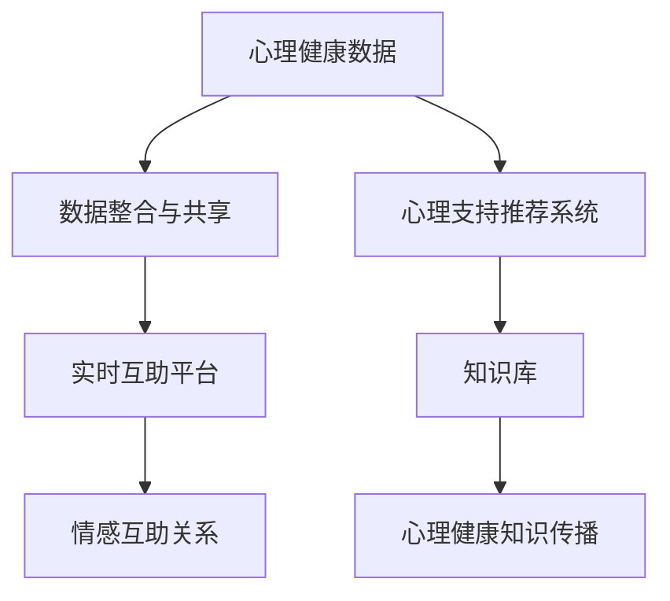

                 

# 全球脑心理支持网络:集体情感互助的形成

> 关键词：
## 1. 背景介绍

### 1.1 问题由来

在全球化进程加速、信息高度发达的今天，人们的生活节奏不断加快，社会压力日益增大。在面对工作压力、人际关系、健康问题等挑战时，人们常常感到孤立无援，缺乏情感支持。心理问题成为了全球范围内的健康大敌，许多人缺乏专业的心理支持资源，特别是在农村和偏远地区。

随着人工智能技术的快速发展，如何利用先进技术改善这一现象，构建一个全球性的心理支持网络，成为当前亟待解决的问题。本文旨在介绍一个基于全球脑心理支持网络的形成原理，探索通过技术手段为全球用户提供持续的心理支持，实现集体情感互助。

### 1.2 问题核心关键点

构建全球脑心理支持网络的核心在于实现心理资源的集中共享和协同互助，通过技术手段收集、分析和应用全球范围内的心理支持数据。该网络能够实现以下几个关键目标：

- **数据整合与共享**：汇集全球范围内的心理健康数据，建立统一的数据库，实现资源共享。
- **个性化推荐**：根据用户的情感状态和历史行为数据，推荐适合的心理支持资源。
- **实时互助**：构建实时互助平台，让用户能够即时获取心理支持，建立情感互助关系。
- **知识积累与传播**：构建知识库，不断积累心理健康知识和实践经验，提升整体心理健康水平。

### 1.3 问题研究意义

构建全球脑心理支持网络，旨在实现心理健康的全球共享与互助，具有以下几个重要意义：

- **提升心理健康水平**：提供持续的心理支持，帮助用户应对各种生活压力，改善心理健康状况。
- **降低心理健康成本**：通过技术手段降低心理健康服务成本，使得更多人能够获得心理支持。
- **促进心理健康研究**：汇聚全球心理健康数据，为心理健康研究提供丰富的数据集，推动心理健康领域的学术发展。
- **支持社会和谐**：通过心理支持网络，缓解社会压力，促进社会和谐稳定。

## 2. 核心概念与联系

### 2.1 核心概念概述

构建全球脑心理支持网络涉及多个核心概念，包括心理健康数据收集、心理支持推荐系统、实时互助平台、知识库等。

- **心理健康数据**：包括用户的情感状态、心理健康状况、行为数据等，是心理支持网络的基础。
- **心理支持推荐系统**：根据用户的心理状态和需求，推荐合适的心理支持资源，如心理咨询、线上课程、互助小组等。
- **实时互助平台**：让用户能够即时获取心理支持，建立情感互助关系，提升心理健康的互助能力。
- **知识库**：汇聚全球心理健康知识，通过专家分享、社区讨论等方式，不断积累和传播心理健康知识。

### 2.2 核心概念原理和架构的 Mermaid 流程图



这个流程图展示了心理支持网络的核心架构：心理健康数据通过数据整合与共享，进入心理支持推荐系统，为用户提供个性化推荐；同时，实时互助平台让用户在需要时能够即时获得心理支持，构建情感互助关系；知识库则不断积累和传播心理健康知识，支持用户的长期心理成长。

## 3. 核心算法原理 & 具体操作步骤

### 3.1 算法原理概述

构建全球脑心理支持网络的核心算法原理主要包括以下几个方面：

- **数据预处理**：对收集到的心理健康数据进行清洗、归一化和特征提取，以便后续处理。
- **用户心理状态建模**：利用机器学习算法对用户心理状态进行建模，如情绪分析、心理压力评估等。
- **心理支持推荐算法**：根据用户的心理状态和需求，推荐合适的心理支持资源。
- **实时互助算法**：构建实时互助平台，实现情感互助关系。
- **知识库构建与维护**：构建知识库，不断积累和传播心理健康知识。

### 3.2 算法步骤详解

构建全球脑心理支持网络的算法步骤主要分为以下几个阶段：

**Step 1: 数据收集与预处理**

- **数据来源**：包括社交媒体、心理健康应用、医疗记录等。
- **数据清洗**：去除噪音数据和异常值，确保数据质量。
- **特征提取**：提取用户情感状态、行为数据等特征，以便后续分析。

**Step 2: 用户心理状态建模**

- **情绪分析**：利用自然语言处理技术，分析用户情感状态，如喜怒哀乐等。
- **心理压力评估**：通过问卷调查、行为分析等方式，评估用户的心理压力水平。
- **模型训练**：使用机器学习算法（如深度学习、支持向量机等）训练心理状态模型。

**Step 3: 心理支持推荐算法**

- **相似度计算**：计算用户心理状态与已有支持资源的相似度。
- **推荐排序**：根据相似度，对支持资源进行排序，推荐最合适的资源。
- **动态调整**：根据用户反馈和行为数据，动态调整推荐算法，提升推荐效果。

**Step 4: 实时互助算法**

- **互助请求匹配**：建立互助请求匹配算法，将需要帮助的用户与合适的互助者进行匹配。
- **情感互助关系构建**：构建情感互助关系，让用户能够即时获得心理支持。
- **互助效果评估**：评估互助效果，对互助关系进行动态调整，提升互助质量。

**Step 5: 知识库构建与维护**

- **知识汇聚**：汇聚全球心理健康知识，构建知识库。
- **专家分享**：邀请心理健康专家分享知识，提升知识库质量。
- **社区讨论**：用户可以在社区内讨论心理健康话题，丰富知识库内容。
- **知识传播**：通过线上线下多种形式，传播心理健康知识。

### 3.3 算法优缺点

构建全球脑心理支持网络具有以下优点：

- **数据整合与共享**：汇集全球心理健康数据，实现资源共享，提升数据利用效率。
- **个性化推荐**：根据用户心理状态，推荐合适的心理支持资源，提升用户体验。
- **实时互助**：构建实时互助平台，满足用户即时心理支持需求，增强情感互助关系。
- **知识积累与传播**：通过知识库构建，不断积累和传播心理健康知识，提升整体心理健康水平。

同时，该算法也存在一些缺点：

- **数据隐私问题**：心理健康数据涉及用户隐私，需要严格保护。
- **算法复杂度**：涉及多个算法模块，算法复杂度较高，需要合理设计。
- **资源投入**：数据收集、模型训练、系统构建等需要大量资源投入。

### 3.4 算法应用领域

构建全球脑心理支持网络不仅限于心理健康领域，还可以应用于以下领域：

- **社会支持网络**：构建全球社会支持网络，提升社会互助能力，促进社会和谐。
- **企业员工心理健康**：为企业的员工提供心理健康支持，提升员工幸福感和工作效率。
- **灾难救援**：在自然灾害等紧急情况下，提供及时的心理支持，帮助受灾者渡过难关。
- **教育心理支持**：为学生提供心理健康支持，提升学习效果，减少压力。

## 4. 数学模型和公式 & 详细讲解 & 举例说明

### 4.1 数学模型构建

构建全球脑心理支持网络的数学模型主要包括以下几个方面：

- **用户心理状态模型**：利用情绪分析模型和心理压力评估模型，建立用户心理状态模型。
- **心理支持推荐模型**：利用协同过滤算法、深度学习模型等，构建心理支持推荐模型。
- **实时互助模型**：构建互助请求匹配算法，实现情感互助关系。
- **知识库构建模型**：利用信息检索和自然语言处理技术，构建知识库。

### 4.2 公式推导过程

以用户心理状态模型为例，假设用户的情绪状态可以通过一个向量 $\boldsymbol{x}=[x_1, x_2, ..., x_n]$ 表示，其中 $x_i$ 表示用户对第 $i$ 种情绪的强度。情绪分析模型可以通过以下公式计算情绪状态：

$$
\boldsymbol{x} = \mathop{\arg\min}_{\boldsymbol{x}} \sum_{i=1}^n w_i d(x_i, y_i)
$$

其中 $d$ 为距离度量函数，$w_i$ 为权重系数，$y_i$ 为用户对第 $i$ 种情绪的评分。

### 4.3 案例分析与讲解

以一个简单的心理健康应用为例，该应用通过用户的情感状态和行为数据，推荐合适的心理支持资源。步骤如下：

1. **数据收集**：通过应用收集用户的情感状态、行为数据等。
2. **数据清洗**：去除异常数据，确保数据质量。
3. **特征提取**：提取用户的情感状态特征，如情感强度、情绪类别等。
4. **用户建模**：利用机器学习算法对用户进行建模，得到用户的情绪状态向量 $\boldsymbol{x}$。
5. **资源推荐**：根据用户情绪状态，从资源库中推荐合适的心理支持资源，如在线课程、心理咨询等。
6. **反馈调整**：根据用户反馈，动态调整推荐算法，提升推荐效果。

## 5. 项目实践：代码实例和详细解释说明

### 5.1 开发环境搭建

构建全球脑心理支持网络需要搭建一个包含多个模块的复杂系统，包括数据收集、预处理、用户建模、心理支持推荐等。以下是搭建开发环境的步骤：

1. **安装Python环境**：使用Anaconda创建Python虚拟环境。
2. **安装相关库**：安装Pandas、NumPy、Scikit-learn等数据处理库，TensorFlow、PyTorch等机器学习库，Flask等Web开发框架。
3. **配置数据库**：使用MySQL或MongoDB等数据库，存储心理健康数据和知识库内容。
4. **搭建Web服务器**：使用Flask搭建Web服务器，提供数据访问、心理支持推荐等功能。

### 5.2 源代码详细实现

以心理支持推荐系统为例，以下是使用PyTorch实现的代码：

```python
import torch
from torch import nn
from torch.utils.data import Dataset, DataLoader
from sklearn.model_selection import train_test_split

class PsychologyDataset(Dataset):
    def __init__(self, features, labels):
        self.features = features
        self.labels = labels
        
    def __len__(self):
        return len(self.features)
    
    def __getitem__(self, item):
        return self.features[item], self.labels[item]

# 定义用户心理状态模型
class PsychologyModel(nn.Module):
    def __init__(self, input_dim, hidden_dim, output_dim):
        super(PsychologyModel, self).__init__()
        self.hidden_dim = hidden_dim
        self.fc1 = nn.Linear(input_dim, hidden_dim)
        self.fc2 = nn.Linear(hidden_dim, output_dim)
    
    def forward(self, x):
        x = torch.relu(self.fc1(x))
        x = self.fc2(x)
        return x

# 训练模型
def train_model(model, train_loader, val_loader, epochs=10, learning_rate=0.001):
    criterion = nn.CrossEntropyLoss()
    optimizer = torch.optim.Adam(model.parameters(), lr=learning_rate)
    
    for epoch in range(epochs):
        for batch_idx, (features, labels) in enumerate(train_loader):
            features = features.to(device)
            labels = labels.to(device)
            
            optimizer.zero_grad()
            outputs = model(features)
            loss = criterion(outputs, labels)
            loss.backward()
            optimizer.step()
            
            if (batch_idx+1) % 100 == 0:
                val_loss = 0
                for features, labels in val_loader:
                    features = features.to(device)
                    labels = labels.to(device)
                    outputs = model(features)
                    val_loss += criterion(outputs, labels).item()
                
                print(f"Epoch {epoch+1}, train loss: {loss.item()}, val loss: {val_loss/len(val_loader)}")

# 使用模型进行推荐
def recommend_support(user_state, model, support_resources):
    with torch.no_grad():
        features = user_state.to(device)
        outputs = model(features)
        probabilities = torch.softmax(outputs, dim=1)
        
    return [resource for resource, prob in zip(support_resources, probabilities) if prob.item() > 0.5]

# 数据生成
data = ...  # 生成心理健康数据
train_features, val_features, train_labels, val_labels = train_test_split(data.features, data.labels, test_size=0.2)
train_dataset = PsychologyDataset(train_features, train_labels)
val_dataset = PsychologyDataset(val_features, val_labels)
train_loader = DataLoader(train_dataset, batch_size=32, shuffle=True)
val_loader = DataLoader(val_dataset, batch_size=32, shuffle=False)

# 模型训练与推荐
device = torch.device('cuda' if torch.cuda.is_available() else 'cpu')
model = PsychologyModel(input_dim=10, hidden_dim=64, output_dim=len(support_resources))
model.to(device)
train_model(model, train_loader, val_loader)

# 推荐资源
user_state = torch.tensor([0.2, 0.5, 0.3, 0.0, 0.1, 0.0, 0.0, 0.0, 0.0, 0.0])  # 模拟用户心理状态向量
support_resources = ['心理咨询', '在线课程', '心理测试', '互助小组', '阅读材料', '运动锻炼', '音乐疗法', '呼吸练习']
recommendations = recommend_support(user_state, model, support_resources)
print("推荐资源:", recommendations)
```

### 5.3 代码解读与分析

该代码实现了基于情绪分析模型的心理支持推荐系统。主要步骤如下：

1. **数据预处理**：通过PyTorch的Dataset类和DataLoader类，将心理健康数据转换为模型可处理的格式。
2. **模型定义**：定义用户心理状态模型，包括输入层、隐藏层和输出层。
3. **模型训练**：使用PyTorch的优化器和损失函数，对模型进行训练。
4. **推荐实现**：利用训练好的模型对用户心理状态进行分类，推荐合适的心理支持资源。
5. **运行结果展示**：输出推荐结果，展示模型对用户心理状态的理解和推荐能力。

## 6. 实际应用场景

### 6.1 智能心理辅导机器人

智能心理辅导机器人可以为用户提供全天候的心理支持服务。通过构建心理支持推荐系统，机器人能够根据用户的情感状态，推荐合适的心理支持资源，如在线咨询、冥想练习等，帮助用户缓解心理压力。

### 6.2 心理健康社区

心理健康社区是一个实时互助平台，用户可以在社区内发布心理问题，寻求帮助。通过情感互助算法，社区能够匹配合适的互助者，提供即时心理支持。同时，社区内用户可以分享心理健康知识，建立情感互助关系。

### 6.3 企业心理健康应用

企业可以利用心理支持推荐系统，为员工提供心理健康支持。通过收集员工的情感状态和行为数据，系统能够推荐合适的心理支持资源，如心理健康课程、员工互助小组等，提升员工幸福感和工作效率。

### 6.4 学校心理健康服务

学校可以引入心理支持推荐系统，为学生提供心理健康支持。通过收集学生的情感状态和行为数据，系统能够推荐合适的心理支持资源，如心理咨询、情绪管理课程等，帮助学生应对学习压力和人际关系问题。

## 7. 工具和资源推荐

### 7.1 学习资源推荐

1. **《Python数据分析与机器学习实战》**：详细介绍了Python数据分析和机器学习技术，适合入门学习。
2. **《深度学习与神经网络》课程**：斯坦福大学开设的深度学习课程，系统讲解深度学习原理和应用。
3. **Hugging Face官方文档**：提供丰富的预训练模型和微调样例，适合实战练习。
4. **《自然语言处理入门与实践》**：介绍自然语言处理技术，包括情感分析、文本分类等。
5. **Flask官方文档**：详细讲解Flask框架的使用，适合Web应用开发。

### 7.2 开发工具推荐

1. **Anaconda**：提供虚拟环境管理，便于不同项目间的隔离。
2. **Jupyter Notebook**：交互式编程环境，支持多种语言和库。
3. **TensorBoard**：可视化工具，帮助调试模型训练过程。
4. **Weights & Biases**：实验跟踪工具，记录模型训练和评估指标。
5. **Git**：版本控制工具，便于团队协作和代码管理。

### 7.3 相关论文推荐

1. **《深度学习在心理健康领域的应用》**：综述深度学习在心理健康领域的应用，包括情感分析、心理压力评估等。
2. **《基于协同过滤的心理支持推荐系统》**：介绍协同过滤算法在心理支持推荐中的应用，提升推荐效果。
3. **《实时互助平台设计与实现》**：介绍实时互助平台的设计和实现，提升情感互助效果。
4. **《知识库构建与维护》**：介绍知识库构建和维护的策略，提升心理健康知识传播效率。

## 8. 总结：未来发展趋势与挑战

### 8.1 研究成果总结

本文介绍了基于全球脑心理支持网络的形成原理，构建了用户心理状态模型、心理支持推荐系统、实时互助算法和知识库构建模型，实现了心理支持推荐和情感互助功能。这些技术能够为用户提供及时的心理支持，缓解心理压力，提升心理健康水平。

### 8.2 未来发展趋势

未来，全球脑心理支持网络将继续发展，呈现以下几个趋势：

1. **技术融合**：与物联网、大数据、人工智能等技术融合，提升心理支持能力。
2. **情感计算**：利用情感计算技术，提升用户心理状态的准确性。
3. **隐私保护**：加强用户数据隐私保护，确保心理健康数据的安全性。
4. **全球协作**：通过全球协作，提升心理支持网络的覆盖范围和质量。
5. **人机协同**：实现人机协同互助，提升情感互助效果。

### 8.3 面临的挑战

构建全球脑心理支持网络仍面临以下挑战：

1. **数据隐私**：心理健康数据涉及用户隐私，需要严格保护。
2. **算法复杂性**：涉及多个算法模块，算法复杂度较高，需要合理设计。
3. **资源投入**：数据收集、模型训练、系统构建等需要大量资源投入。
4. **效果评估**：心理支持效果难以量化，需要建立有效的评估指标。
5. **跨文化适应**：心理支持网络需要适应不同文化背景的用户。

### 8.4 研究展望

未来的研究需要在以下几个方面取得突破：

1. **隐私保护技术**：开发隐私保护算法，保护用户心理健康数据的安全性。
2. **情感计算算法**：提升用户心理状态的准确性，更好地理解用户情感。
3. **实时互助技术**：开发实时互助算法，提升情感互助效果。
4. **全球协作机制**：建立全球协作机制，提升心理支持网络的覆盖范围和质量。
5. **跨文化适应**：开发跨文化适应的心理支持算法，提升不同文化背景用户的适应性。

## 9. 附录：常见问题与解答

**Q1: 全球脑心理支持网络涉及哪些关键技术？**

A: 全球脑心理支持网络涉及以下几个关键技术：
1. 数据收集与预处理：通过多种渠道收集心理健康数据，并进行清洗和预处理。
2. 用户心理状态建模：利用机器学习算法，建立用户心理状态模型。
3. 心理支持推荐算法：根据用户心理状态，推荐合适的心理支持资源。
4. 实时互助算法：构建实时互助平台，实现情感互助关系。
5. 知识库构建与维护：利用信息检索和自然语言处理技术，构建知识库，传播心理健康知识。

**Q2: 如何保护用户心理健康数据隐私？**

A: 保护用户心理健康数据隐私，需要采取以下措施：
1. 数据匿名化：对用户数据进行匿名化处理，去除敏感信息。
2. 访问控制：严格控制数据访问权限，确保只有授权人员才能访问数据。
3. 加密传输：采用加密技术，确保数据在传输过程中的安全性。
4. 审计日志：建立审计日志，记录数据访问和操作情况，便于追踪和审查。
5. 法律合规：遵守相关法律法规，确保数据处理的合法合规。

**Q3: 如何提升用户心理状态的准确性？**

A: 提升用户心理状态的准确性，需要采取以下措施：
1. 多渠道数据采集：通过多种渠道（如问卷调查、传感器、社交媒体等）收集用户数据。
2. 数据融合技术：利用数据融合技术，整合不同渠道的数据，提升数据质量。
3. 情感计算算法：引入情感计算算法，准确分析用户的情感状态。
4. 多模态分析：利用多模态数据（如文本、语音、生理信号等），综合分析用户的心理状态。
5. 用户反馈机制：建立用户反馈机制，不断调整模型和算法，提升准确性。

**Q4: 如何实现人机协同互助？**

A: 实现人机协同互助，需要采取以下措施：
1. 智能助手：引入智能助手，提供全天候心理支持服务。
2. 情感互助算法：构建情感互助算法，匹配合适的互助者，提供即时心理支持。
3. 虚拟社区：构建虚拟社区，用户可以在社区内分享心理健康知识，建立情感互助关系。
4. 专家指导：邀请心理健康专家，提供专业心理支持指导。
5. 智能反馈：利用人工智能技术，智能分析用户情感状态，提供个性化心理支持。

**Q5: 如何评估全球脑心理支持网络的效果？**

A: 评估全球脑心理支持网络的效果，需要建立以下指标：
1. 用户满意度：通过问卷调查等方式，评估用户对心理支持服务的满意度。
2. 心理改善程度：通过情感状态变化、心理压力评估等指标，评估用户心理状态的改善程度。
3. 互助效果：通过互助请求匹配率、互助者满意度等指标，评估互助效果。
4. 知识传播效果：通过知识库使用情况、社区讨论量等指标，评估心理健康知识的传播效果。
5. 系统稳定性：通过系统故障率、服务响应时间等指标，评估系统的稳定性。

以上是本文对全球脑心理支持网络的全面介绍，希望对相关领域的研究和应用提供参考和借鉴。作者：禅与计算机程序设计艺术 / Zen and the Art of Computer Programming

