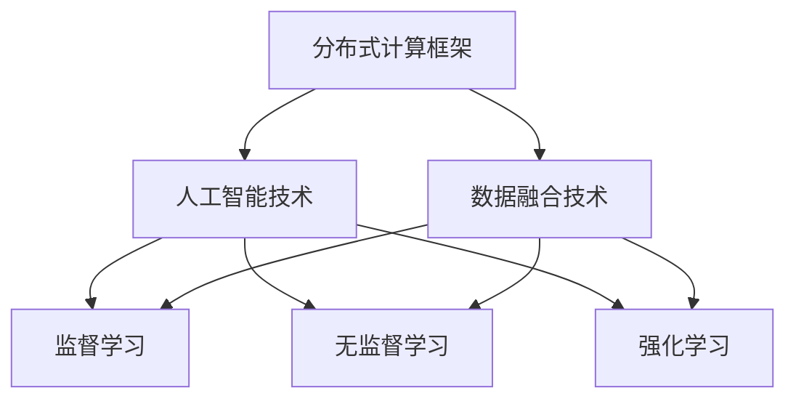

                 

# 全球脑驱动的群体智慧:超越个体局限的决策系统

> 关键词：群体智慧,全球脑,决策系统,分布式计算,数据融合,人工智能

## 1. 背景介绍

### 1.1 问题由来
在全球化浪潮席卷下，各个国家和地区间的联系日益紧密，各行各业的竞争也随之加剧。如何在快速变化的环境中做出高质量的决策，成为了一项重要的挑战。为了应对这一挑战，研究者们开始探索如何利用群体智慧(GWI, Group Wisdom)来提升决策质量。GWI指的是来自全球各地的人类智慧聚集在一起，共同参与决策的过程，从而超越个体的局限，实现更全面、更高质量的决策。

### 1.2 问题核心关键点
群体智慧的核心在于将多人的智慧融合起来，利用分布式计算和数据融合技术，实现超越个体认知的决策。其关键点包括：

1. **分布式计算框架**：将计算任务分布在多个节点上执行，以提高计算效率和可扩展性。
2. **数据融合技术**：将来自不同源的数据进行整合和分析，提取有价值的信息。
3. **人工智能技术**：利用机器学习、深度学习等人工智能技术，自动学习和提取数据中的模式和规律。

通过这些技术，可以构建一个高效、可靠的群体智慧决策系统，实现高效率、高质量的决策。

### 1.3 问题研究意义
研究群体智慧的决策系统，对于提升决策质量、提高决策效率、增强组织竞争力具有重要意义：

1. **决策质量提升**：利用全球各地的智慧，避免因地域限制和个人经验导致的偏见和失误，提高决策的全面性和准确性。
2. **决策效率提高**：通过分布式计算和数据融合技术，快速处理大量数据，缩短决策周期。
3. **组织竞争力增强**：通过群体的智慧和经验，增强组织在市场中的竞争力和适应性。
4. **技术创新推动**：群体智慧的探索和应用，可以推动分布式计算、数据融合和人工智能等技术的发展。

## 2. 核心概念与联系

### 2.1 核心概念概述

为了更好地理解群体智慧决策系统，本节将介绍几个密切相关的核心概念：

1. **分布式计算框架**：指将计算任务分布在多个节点上执行的计算模型。常见的分布式计算框架包括Hadoop、Spark、Flink等。
2. **数据融合技术**：指将来自不同数据源的信息整合、分析，提取有价值的信息。常见的数据融合技术包括数据清洗、特征提取、聚类、分类等。
3. **人工智能技术**：利用机器学习、深度学习等技术，自动学习和提取数据中的模式和规律。常见的人工智能技术包括监督学习、无监督学习、强化学习等。

这些核心概念之间的逻辑关系可以通过以下Mermaid流程图来展示：



这个流程图展示了几类核心技术之间的相互关系：

1. 分布式计算框架为数据融合和人工智能技术提供计算能力。
2. 数据融合技术为人工智能技术提供数据支持，帮助其更好地学习数据中的模式和规律。
3. 人工智能技术，尤其是监督学习和无监督学习，可以进一步提升数据融合的效果。

这些概念共同构成了群体智慧决策系统的基础框架，使得系统能够高效、可靠地进行决策。

## 3. 核心算法原理 & 具体操作步骤
### 3.1 算法原理概述

群体智慧决策系统的核心算法基于分布式计算、数据融合和人工智能技术。其核心思想是：通过分布式计算框架将计算任务分散到多个节点上执行，利用数据融合技术将不同数据源的信息整合和分析，最后通过人工智能技术自动学习和提取数据中的模式和规律，辅助决策过程。

具体而言，群体智慧决策系统可以分为以下几个步骤：

1. **数据收集和预处理**：从不同数据源收集数据，并进行清洗、归一化等预处理操作。
2. **分布式计算**：利用分布式计算框架将计算任务分散到多个节点上执行，提高计算效率和可扩展性。
3. **数据融合**：使用数据融合技术将来自不同数据源的信息进行整合和分析，提取有价值的信息。
4. **人工智能建模**：利用人工智能技术，如机器学习、深度学习等，自动学习和提取数据中的模式和规律，辅助决策过程。
5. **决策生成和优化**：基于融合后的数据和人工智能模型的输出，生成决策方案并进行优化。

### 3.2 算法步骤详解

群体智慧决策系统的算法步骤可以概括如下：

**Step 1: 数据收集和预处理**

- 从不同数据源收集数据，包括但不限于政府报告、企业数据、社交媒体等。
- 对数据进行清洗和预处理，去除噪声和异常值，归一化数据。

**Step 2: 分布式计算**

- 使用分布式计算框架（如Hadoop、Spark）将计算任务分散到多个节点上执行。
- 在每个节点上，执行独立的计算任务，并周期性进行通信和数据交换。

**Step 3: 数据融合**

- 将来自不同数据源的信息进行整合和分析，去除重复和冗余信息，提取关键特征。
- 使用数据融合技术，如K-means聚类、PCA降维、决策树等，对数据进行特征提取和聚类。

**Step 4: 人工智能建模**

- 使用监督学习、无监督学习或强化学习等人工智能技术，自动学习和提取数据中的模式和规律。
- 对人工智能模型进行训练和优化，确保模型能够准确预测和分类数据。

**Step 5: 决策生成和优化**

- 基于融合后的数据和人工智能模型的输出，生成决策方案。
- 使用优化算法（如遗传算法、蚁群优化等）对决策方案进行优化，寻找最优解。

### 3.3 算法优缺点

群体智慧决策系统具有以下优点：

1. **高效性**：利用分布式计算框架，可以处理大规模数据，提高计算效率和可扩展性。
2. **全面性**：通过数据融合技术，整合来自不同数据源的信息，提供更全面的决策支持。
3. **准确性**：利用人工智能技术，自动学习和提取数据中的模式和规律，提高决策的准确性。

同时，该系统也存在一些局限性：

1. **数据源多样性**：不同数据源的数据质量和格式可能不一致，增加了数据融合的难度。
2. **系统复杂性**：分布式计算和数据融合技术，以及人工智能模型的训练和优化，需要较高的技术门槛。
3. **安全性问题**：分布式计算和数据融合过程中，数据的隐私和安全需要特别关注。

尽管存在这些局限性，群体智慧决策系统仍是一个值得探索和应用的技术方向，尤其是在数据驱动的决策场景中，其高效性和全面性具有显著优势。

### 3.4 算法应用领域

群体智慧决策系统已经在多个领域得到了应用，以下是几个典型的例子：

1. **金融风险管理**：利用全球各地的金融数据和人工智能技术，实时监控市场风险，提前预警潜在危机。
2. **公共安全管理**：通过整合来自不同城市和国家的安全数据，使用数据融合和人工智能技术，提升公共安全管理水平。
3. **医疗健康管理**：结合全球各地的医疗数据和人工智能技术，提供更全面、精准的疾病预测和治疗方案。
4. **环境监测和治理**：利用全球各地的环境数据和人工智能技术，实时监测和预测环境变化，提供决策支持。

这些应用展示了群体智慧决策系统的强大能力和广泛应用前景。未来，随着技术的不断进步，群体智慧决策系统将在更多领域得到应用，为全球决策提供更强大的支持。

## 4. 数学模型和公式 & 详细讲解 & 举例说明

### 4.1 数学模型构建

为了更好地理解群体智慧决策系统的算法原理，本节将介绍几个数学模型：

1. **分布式计算模型**：利用MapReduce模型，将计算任务分散到多个节点上执行。MapReduce模型由Map和Reduce两个阶段组成，Map阶段负责将输入数据分割成若干子任务，Reduce阶段负责将子任务的结果进行合并和汇总。

2. **数据融合模型**：使用K-means聚类算法，将来自不同数据源的信息进行聚类和融合。K-means算法的基本步骤如下：
   - 随机选择K个初始聚类中心。
   - 将每个数据点分配到最近的聚类中心。
   - 计算每个聚类的质心。
   - 重复上述步骤，直到聚类结果收敛。

3. **人工智能模型**：使用监督学习模型，如线性回归、逻辑回归等，对数据进行分类和预测。监督学习模型的基本步骤如下：
   - 选择训练数据和测试数据。
   - 选择模型参数和优化算法。
   - 使用训练数据训练模型，并使用测试数据评估模型性能。

### 4.2 公式推导过程

以K-means聚类算法为例，推导其基本公式：

假设输入数据集为 $D = \{x_1, x_2, ..., x_n\}$，其中 $x_i \in \mathbb{R}^d$，表示第i个数据点。K-means算法的目标是将数据集分成K个聚类，每个聚类包含若干数据点。

首先，随机选择K个初始聚类中心 $c_1, c_2, ..., c_K$，计算每个数据点到每个聚类中心的距离，将其分配到最近的聚类中心。设第i个数据点分配到第j个聚类，则分配公式为：

$$
i_j = \arg\min_{1 \leq j \leq K} ||x_i - c_j||^2
$$

然后，计算每个聚类的质心 $c_j$，作为下一次迭代的初始聚类中心。设第j个聚类的质心为 $c_j$，则质心公式为：

$$
c_j = \frac{1}{|j|} \sum_{i \in j} x_i
$$

重复上述步骤，直到聚类结果收敛。收敛条件为聚类中心不再发生变化，或达到预设的最大迭代次数。

### 4.3 案例分析与讲解

以一个简单的金融风险管理为例，展示群体智慧决策系统的工作流程。

假设全球各地的金融市场数据被收集并整合到一个分布式计算框架中，每个节点负责处理一部分数据，并将处理结果传递给其他节点。数据融合阶段，使用K-means聚类算法将不同市场的数据进行聚类，提取关键特征。人工智能建模阶段，使用监督学习模型对聚类结果进行分析，预测市场风险。决策生成阶段，基于模型预测结果，生成风险预警方案并进行优化。

通过这个案例，可以看到群体智慧决策系统如何利用分布式计算、数据融合和人工智能技术，实现高效、全面、准确的决策。

## 5. 项目实践：代码实例和详细解释说明
### 5.1 开发环境搭建

在进行群体智慧决策系统开发前，我们需要准备好开发环境。以下是使用Python进行Spark开发的环境配置流程：

1. 安装Apache Spark：从官网下载并安装Spark，用于分布式计算。

2. 配置环境变量：设置Spark的运行路径和Java路径，确保环境变量正确配置。

3. 安装PySpark：安装PySpark，使得Python可以直接调用Spark的API进行分布式计算。

4. 安装相关工具包：
```bash
pip install pandas numpy scikit-learn matplotlib tqdm jupyter notebook ipython
```

完成上述步骤后，即可在本地环境中开始群体智慧决策系统的开发。

### 5.2 源代码详细实现

下面以一个简单的K-means聚类为例，展示如何使用PySpark进行分布式计算和数据融合。

首先，定义数据集和初始聚类中心：

```python
from pyspark import SparkContext, SparkConf

# 创建Spark上下文
conf = SparkConf().setAppName("K-means Clustering").setMaster("local")
sc = SparkContext(conf=conf)

# 定义数据集
data = sc.parallelize([(1, 2), (3, 4), (5, 6), (7, 8), (9, 10)])

# 定义初始聚类中心
centroids = sc.parallelize([(0, 0), (5, 5)])
```

然后，实现K-means聚类算法：

```python
# 定义聚类函数
def kmeans(data, centroids, k=2, max_iter=10):
    for i in range(max_iter):
        # 分配数据点
        distances = data.map(lambda x: (x, centroids.map(lambda c: (c, (x - c) ** 2).sum()))).reduceByKey(lambda x, y: (x, y))
        data_points = distances.map(lambda x: (x[1][1], x[0]))
        
        # 计算新的聚类中心
        new_centroids = data_points.groupBy(0).agg(lambda x: (x, list(map(sum, zip(*x))))).map(lambda x: (x[0], x[1] / len(x[1])))
        
        # 检查是否收敛
        if new_centroids.collect() == centroids.collect():
            return new_centroids
        
        # 更新聚类中心
        centroids = new_centroids
    
    return centroids

# 调用聚类函数
new_centroids = kmeans(data, centroids)
```

最后，展示聚类结果：

```python
# 显示新的聚类中心
new_centroids.collect()
```

以上就是使用PySpark进行K-means聚类的完整代码实现。可以看到，通过PySpark，我们能够在分布式环境中高效地实现数据融合和聚类操作。

### 5.3 代码解读与分析

让我们再详细解读一下关键代码的实现细节：

**K-means函数**：
- 输入数据 `data`：包含需要聚类的数据点，使用Spark的RDD（弹性分布式数据集）表示。
- 输入聚类中心 `centroids`：包含初始聚类中心，同样使用Spark的RDD表示。
- 参数 `k`：聚类数量，默认值为2。
- 参数 `max_iter`：最大迭代次数，默认值为10。

**分配数据点**：
- 计算每个数据点到每个聚类中心的距离，选择距离最近的聚类中心。
- 使用Spark的`map`和`reduceByKey`函数，将数据点和聚类中心的信息传递和聚合。

**计算新的聚类中心**：
- 对每个聚类，计算其包含的数据点的均值，作为新的聚类中心。
- 使用Spark的`groupBy`和`agg`函数，将数据点的信息聚合和计算。

**检查是否收敛**：
- 比较新的聚类中心和初始聚类中心，如果相同则停止迭代，否则继续更新聚类中心。

通过这个代码示例，我们可以看到PySpark如何利用分布式计算框架，实现高效、可靠的数据融合和聚类操作。

当然，在工业级的系统实现中，还需要考虑更多因素，如模型的优化和评估、超参数的自动搜索、更灵活的数据源整合等。但核心的算法逻辑基本与此类似。

## 6. 实际应用场景

### 6.1 智能电网管理

群体智慧决策系统可以应用于智能电网管理，提升电网运行的稳定性和效率。通过整合来自不同城市和国家的数据，使用数据融合和人工智能技术，实时监测和预测电网运行状况，生成优化方案并进行调整，从而提升电网的可靠性和安全性。

### 6.2 环境监测和治理

群体智慧决策系统可以应用于环境监测和治理，提升环境管理的全面性和准确性。通过整合全球各地的环境数据和人工智能技术，实时监测和预测环境变化，生成环境治理方案并进行优化，从而提升环境质量，保障人类健康。

### 6.3 智慧城市治理

群体智慧决策系统可以应用于智慧城市治理，提升城市管理的自动化和智能化水平。通过整合全球各地的城市数据和人工智能技术，实时监测和预测城市运行状况，生成城市治理方案并进行优化，从而提升城市运行的效率和质量。

### 6.4 未来应用展望

随着技术的不断进步，群体智慧决策系统将在更多领域得到应用，为全球决策提供更强大的支持。

在智慧医疗领域，利用全球各地的医疗数据和人工智能技术，实时监测和预测疾病流行趋势，生成疾病防治方案并进行优化，从而提升公共卫生水平。

在智慧教育领域，结合全球各地的教育数据和人工智能技术，实时监测和预测教育质量，生成教育优化方案并进行优化，从而提升教育效果。

在智慧农业领域，整合全球各地的农业数据和人工智能技术，实时监测和预测农作物生长状况，生成农业管理方案并进行优化，从而提升农业生产效率。

此外，在金融、交通、物流、能源等多个领域，群体智慧决策系统也将不断涌现，为各行各业带来变革性影响。相信随着技术的日益成熟，群体智慧决策系统必将成为决策科学的重要工具，推动全球智慧治理的进程。

## 7. 工具和资源推荐

### 7.1 学习资源推荐

为了帮助开发者系统掌握群体智慧决策系统的理论基础和实践技巧，这里推荐一些优质的学习资源：

1. 《Spark从原理到实践》系列博文：由Spark技术专家撰写，深入浅出地介绍了Spark原理、分布式计算、数据融合等前沿话题。

2. CS224D《大规模机器学习》课程：斯坦福大学开设的机器学习课程，涵盖了数据融合、分布式计算、深度学习等知识，适合深入学习。

3. 《大规模分布式数据处理》书籍：介绍分布式计算和大数据处理技术，帮助理解Spark等分布式计算框架的实现原理。

4. K-means聚类算法详解：详细讲解K-means聚类算法的原理和实现，适合学习K-means聚类的细节。

5. Scikit-learn官方文档：Scikit-learn机器学习库的官方文档，提供丰富的API和算法实现，适合进行实际项目开发。

通过对这些资源的学习实践，相信你一定能够快速掌握群体智慧决策系统的精髓，并用于解决实际的决策问题。

### 7.2 开发工具推荐

高效的开发离不开优秀的工具支持。以下是几款用于群体智慧决策系统开发的常用工具：

1. Apache Spark：由Apache基金会开发的分布式计算框架，适合处理大规模数据。

2. Scikit-learn：Python机器学习库，提供丰富的算法实现和工具，适合进行数据融合和人工智能建模。

3. PySpark：Spark的Python API，方便进行分布式计算和数据融合操作。

4. TensorBoard：TensorFlow的可视化工具，实时监测模型训练状态，并提供丰富的图表呈现方式。

5. Weights & Biases：模型训练的实验跟踪工具，记录和可视化模型训练过程中的各项指标，方便对比和调优。

合理利用这些工具，可以显著提升群体智慧决策系统的开发效率，加快创新迭代的步伐。

### 7.3 相关论文推荐

群体智慧决策系统的研究源于学界的持续研究。以下是几篇奠基性的相关论文，推荐阅读：

1. A Survey on Distributed Clustering Algorithms: Classification, Algorithmic Issues, System Design, and Scalability（分布式聚类算法综述）：系统介绍分布式聚类算法的原理和实现，适合理解分布式计算框架的原理。

2. A Systematic Review of Group Wisdom Frameworks: What, How, and When?（群体智慧框架综述）：系统介绍群体智慧框架的原理和应用，适合理解群体智慧决策系统的概念。

3. Distributed Data Mining: Concepts and Techniques（分布式数据挖掘）：介绍分布式数据挖掘的原理和应用，适合理解数据融合技术的实现。

4. Clustering Algorithms for Data Mining（数据挖掘中的聚类算法）：详细介绍聚类算法的原理和实现，适合理解聚类算法的基本原理。

5. A Survey on Distributed Deep Learning（分布式深度学习综述）：系统介绍分布式深度学习的原理和应用，适合理解人工智能模型的实现。

这些论文代表了大规模分布式计算、数据融合和人工智能技术的发展脉络。通过学习这些前沿成果，可以帮助研究者把握学科前进方向，激发更多的创新灵感。

## 8. 总结：未来发展趋势与挑战

### 8.1 研究成果总结

本文对群体智慧决策系统的原理和应用进行了全面系统的介绍。首先阐述了群体智慧决策系统的研究背景和意义，明确了其在全球决策中的独特价值。其次，从原理到实践，详细讲解了群体智慧决策系统的算法原理和实现步骤，给出了代码实例和详细解释说明。同时，本文还探讨了群体智慧决策系统在多个领域的应用前景，展示了其在智能电网管理、环境监测和治理、智慧城市治理等场景中的巨大潜力。

通过本文的系统梳理，可以看到，群体智慧决策系统通过分布式计算、数据融合和人工智能技术，能够高效、全面、准确地辅助决策过程，具备广阔的应用前景。随着技术的不断进步，群体智慧决策系统必将在更多领域得到应用，为全球决策提供更强大的支持。

### 8.2 未来发展趋势

展望未来，群体智慧决策系统将呈现以下几个发展趋势：

1. **技术融合**：结合分布式计算、数据融合和人工智能技术，形成一体化的群体智慧决策系统。
2. **数据驱动**：利用全球各地的数据，提供更全面、准确、实时的决策支持。
3. **智能优化**：引入强化学习等智能优化技术，提升决策方案的优化效果。
4. **跨领域应用**：在更多领域得到应用，如智慧医疗、智慧教育、智慧农业等，提升各行业的智能化水平。
5. **安全性保障**：提升数据隐私和安全保障，确保决策过程的透明和可信。

这些趋势凸显了群体智慧决策系统的重要性和发展潜力，预示着其在全球决策中扮演越来越重要的角色。

### 8.3 面临的挑战

尽管群体智慧决策系统已经取得了显著成果，但在其发展过程中仍面临诸多挑战：

1. **数据质量问题**：不同数据源的数据质量和格式可能不一致，增加了数据融合的难度。
2. **技术复杂性**：分布式计算和数据融合技术，以及人工智能模型的训练和优化，需要较高的技术门槛。
3. **安全性问题**：数据隐私和安全保障是群体智慧决策系统面临的重要挑战。
4. **实时性问题**：系统需要快速处理大量数据，实时生成决策方案。

尽管存在这些挑战，但群体智慧决策系统仍是一个值得探索和应用的技术方向，尤其是在数据驱动的决策场景中，其高效性和全面性具有显著优势。

### 8.4 研究展望

面对群体智慧决策系统面临的挑战，未来的研究需要在以下几个方面寻求新的突破：

1. **数据融合技术优化**：开发更高效的数据融合算法，提升数据融合的准确性和效率。
2. **分布式计算框架改进**：优化分布式计算框架，提高系统的可扩展性和稳定性。
3. **人工智能模型创新**：开发更高效、更鲁棒的人工智能模型，提升决策方案的准确性和可靠性。
4. **跨领域数据整合**：研究跨领域数据整合技术，提升群体智慧决策系统的全面性和适用性。
5. **智能优化算法**：引入更智能的优化算法，提升决策方案的优化效果。

这些研究方向的探索，必将引领群体智慧决策系统走向更高的台阶，为全球决策提供更强大的支持。面向未来，群体智慧决策系统还需要与其他人工智能技术进行更深入的融合，如知识表示、因果推理、强化学习等，多路径协同发力，共同推动群体智慧决策系统的发展。只有勇于创新、敢于突破，才能不断拓展群体智慧决策系统的边界，让智能技术更好地造福人类社会。

## 9. 附录：常见问题与解答

**Q1：群体智慧决策系统是否适用于所有决策场景？**

A: 群体智慧决策系统适用于数据驱动的决策场景，特别是在涉及大规模数据和跨领域数据的决策中，可以显著提升决策的全面性和准确性。但对于一些决策需要依赖个人经验和专业知识，群体智慧决策系统可能无法完全替代人工决策。

**Q2：如何优化群体智慧决策系统的数据融合过程？**

A: 数据融合是群体智慧决策系统中的关键环节，可以通过以下方法进行优化：
1. 数据预处理：清洗、归一化、特征提取等预处理操作，去除噪声和异常值，提升数据质量。
2. 特征选择：选择合适的特征进行融合，去除冗余和无关特征。
3. 数据对齐：对来自不同数据源的数据进行对齐，确保数据的一致性和可比性。
4. 融合算法优化：使用更高效的数据融合算法，如基于神经网络的融合算法，提升融合效果。

**Q3：如何提高群体智慧决策系统的实时性？**

A: 群体智慧决策系统的实时性主要依赖于分布式计算框架和数据融合技术。可以通过以下方法进行优化：
1. 数据流处理：使用流处理框架（如Apache Flink），实现实时数据处理。
2. 分布式计算优化：优化分布式计算框架，提高计算效率和可扩展性。
3. 数据存储优化：优化数据存储和访问方式，减少数据传输延迟。

**Q4：群体智慧决策系统如何保证数据隐私和安全？**

A: 数据隐私和安全是群体智慧决策系统的重要问题，可以通过以下方法进行保障：
1. 数据匿名化：对数据进行匿名化处理，去除个人隐私信息。
2. 访问控制：设置严格的访问控制机制，限制数据的访问权限。
3. 数据加密：对数据进行加密处理，确保数据在传输和存储过程中的安全。
4. 区块链技术：引入区块链技术，确保数据的安全性和透明性。

通过这些措施，可以确保群体智慧决策系统的数据隐私和安全，保障决策过程的透明和可信。

**Q5：群体智慧决策系统如何应对跨领域数据整合的挑战？**

A: 跨领域数据整合是群体智慧决策系统面临的重要挑战，可以通过以下方法进行应对：
1. 统一数据格式：对不同领域的数据进行格式统一，确保数据的一致性和可比性。
2. 数据标准化：制定统一的数据标准，确保数据的一致性和可比性。
3. 多领域融合：引入多领域的专家知识和规则，提升数据融合的效果。
4. 数据增强：通过数据增强技术，提升数据融合的全面性和准确性。

通过这些方法，可以提升群体智慧决策系统在跨领域数据整合中的效果，确保决策方案的全面性和准确性。

**Q6：群体智慧决策系统如何应对大规模数据处理挑战？**

A: 群体智慧决策系统需要处理大规模数据，可以通过以下方法进行应对：
1. 分布式计算框架：使用分布式计算框架（如Apache Spark），提高计算效率和可扩展性。
2. 数据分片处理：将数据分片处理，减少单次计算的内存和计算压力。
3. 数据缓存：使用数据缓存技术，减少重复计算和数据传输。
4. 计算加速：使用GPU、TPU等硬件加速，提升计算效率。

通过这些方法，可以应对大规模数据处理的挑战，提升群体智慧决策系统的计算效率和可扩展性。

---

作者：禅与计算机程序设计艺术 / Zen and the Art of Computer Programming

