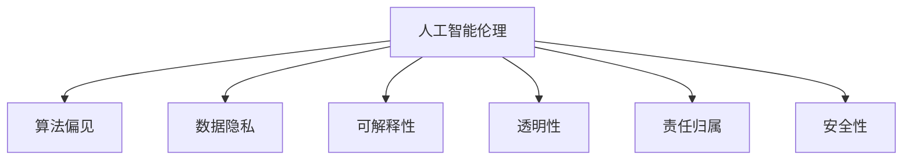

                 

## 1. 背景介绍

### 1.1 问题由来

随着计算机技术的飞速发展，人工智能（AI）在医疗、教育、司法等各个领域得到广泛应用。然而，在AI技术带来的便捷和效率的同时，也伴随着一系列伦理问题。这些问题的本质是对人类计算中公平与公正的追求，要求我们必须从技术、道德、法律等多方面综合考虑，确保AI应用符合人类价值观和伦理准则。

### 1.2 问题核心关键点

人工智能伦理问题主要包括：
1. **算法公平性**：保证AI在决策过程中对所有群体的公平对待，避免歧视性偏见。
2. **数据隐私**：确保数据采集、存储、处理过程中遵守隐私保护法规，保护个人隐私权。
3. **透明性**：提高AI系统的透明度，使决策过程可解释、可追溯，便于监管和审核。
4. **责任归属**：清晰界定AI系统的责任，确保其决策可控、可问责。
5. **安全与稳健性**：保证AI系统的安全性与稳定性，防止恶意攻击和系统故障。

这些核心问题在很大程度上决定了AI技术能否被社会广泛接受并应用。本文旨在探讨这些伦理问题，并提出相应的解决策略。

### 1.3 问题研究意义

研究AI伦理问题，对于提升AI技术的社会认可度和信任度，保障人类权益，推动AI技术的可持续发展具有重要意义：
1. **促进技术进步**：明确伦理要求，指导AI技术健康发展。
2. **提升社会接受度**：解决伦理问题，增强AI系统的透明度和可控性，便于社会公众理解和接受。
3. **保障权益**：保障数据隐私、确保公平公正，保护用户权益。
4. **推动法制建设**：为立法提供参考，完善AI领域的法律法规。
5. **促进国际合作**：建立统一的伦理规范，促进国际AI领域的交流与合作。

## 2. 核心概念与联系

### 2.1 核心概念概述

为更好地理解人工智能伦理问题，本节将介绍几个密切相关的核心概念：

1. **人工智能伦理（AI Ethics）**：研究如何在技术发展过程中，确保AI系统的决策和行为符合人类的伦理道德标准。
2. **算法偏见（Algorithmic Bias）**：AI系统在训练和决策过程中，对某些群体产生不公正对待的现象。
3. **数据隐私（Data Privacy）**：涉及数据的收集、存储、处理和传输过程中，个人隐私的保护问题。
4. **可解释性（Explainability）**：确保AI系统的决策过程可以被理解和解释，便于审计和监管。
5. **透明性（Transparency）**：AI系统的决策过程透明化，便于公众监督和理解。
6. **责任归属（Accountability）**：明确AI系统的责任主体，确保出现问题时有明确的责任方。
7. **安全性（Security）**：保证AI系统在面对攻击和故障时，能够稳定运行，不危害社会安全。

这些核心概念之间的逻辑关系可以通过以下Mermaid流程图来展示：



这个流程图展示了大语言模型的核心概念及其之间的关系：

1. 人工智能伦理从整体上指导AI技术的发展方向。
2. 算法偏见是伦理问题的一个重要方面，涉及数据偏差和模型设计偏见。
3. 数据隐私是伦理问题的关键环节，直接影响AI系统的可信度和接受度。
4. 可解释性和透明性是伦理问题的重要手段，用于提升AI系统的可靠性和可信度。
5. 责任归属和安全性是伦理问题的保障措施，用于确保AI系统的问责性和稳定性。

## 3. 核心算法原理 & 具体操作步骤

### 3.1 算法原理概述

人工智能伦理问题的解决，离不开技术手段的支持。基于监督学习的大语言模型微调，是一个涉及公平性、可解释性、透明性等多个伦理维度的核心技术。

以医疗领域的AI决策为例，其核心算法原理是通过对大量病历数据进行预训练，构建通用的医疗知识图谱，再结合特定病人的诊断数据进行微调，以辅助医生进行疾病诊断。其核心步骤如下：

1. **数据准备**：收集整理医疗数据集，划分为训练集和测试集。
2. **模型预训练**：使用自监督任务训练大语言模型，构建医疗知识图谱。
3. **微调优化**：根据病人的诊断数据，对预训练模型进行微调，优化疾病诊断效果。
4. **模型评估**：在测试集上评估微调后模型的性能，确保其决策的准确性和公平性。

### 3.2 算法步骤详解

人工智能伦理问题的解决，可以从以下几个关键步骤进行：

**Step 1: 数据收集与处理**

1. **数据收集**：收集相关领域的标注数据，如医疗病历数据、司法审判记录等，并确保数据的多样性和代表性。
2. **数据清洗**：清洗数据中的噪音、缺失值，确保数据的质量和一致性。
3. **数据分割**：将数据集划分为训练集、验证集和测试集，确保模型的评估和验证。

**Step 2: 模型预训练**

1. **自监督学习**：使用自监督学习任务，如语言模型、图像识别等，预训练大语言模型，构建领域特定的知识图谱。
2. **预训练目标**：确保预训练模型能够学习到领域内通用的知识，提升模型的泛化能力。

**Step 3: 微调优化**

1. **任务适配**：根据具体应用场景，设计合适的任务适配层，如分类器、回归器等。
2. **模型微调**：使用标注数据对预训练模型进行微调，优化模型的性能和公平性。
3. **优化策略**：选择合适的优化器（如Adam、SGD等）、学习率、正则化技术等，确保模型的稳定性和鲁棒性。

**Step 4: 模型评估与部署**

1. **模型评估**：在测试集上评估微调后模型的性能，使用准确率、召回率、公平性指标等进行评估。
2. **部署应用**：将模型部署到实际应用中，进行实时决策。
3. **持续优化**：根据反馈数据，不断调整模型参数，提升模型性能和公平性。

### 3.3 算法优缺点

人工智能伦理问题的解决，涉及到以下几个方面的优势和不足：

**优点**：
1. **技术手段成熟**：基于监督学习的大语言模型微调，技术手段成熟，易于实施。
2. **泛化能力强**：通过预训练和微调，模型能够在多个领域和任务上取得良好的效果。
3. **灵活性高**：根据具体应用场景，可以灵活调整任务适配层和优化策略。
4. **可解释性强**：模型训练过程可解释，便于审计和监管。

**缺点**：
1. **数据依赖性强**：依赖标注数据的质量和数量，数据偏差可能导致算法偏见。
2. **模型复杂度高**：模型参数量大，资源消耗高，计算复杂度大。
3. **隐私风险**：数据隐私保护难度大，可能存在数据泄露风险。
4. **公平性问题**：存在算法偏见和数据偏差，可能对某些群体不公。

### 3.4 算法应用领域

人工智能伦理问题在多个领域都有广泛应用，例如：

- **医疗领域**：通过医疗数据预训练和微调，辅助医生进行疾病诊断和药物推荐。
- **司法领域**：通过审判数据预训练和微调，提高司法判决的公正性和准确性。
- **教育领域**：通过教育数据预训练和微调，提升个性化教学的效果和公平性。
- **金融领域**：通过金融数据预训练和微调，提升信用评估和风险管理的准确性。
- **安防领域**：通过视频数据预训练和微调，提高面部识别和行为识别的准确性和公平性。

除了上述这些经典应用外，人工智能伦理问题还在更多场景中得到广泛关注，如智能交通、环境保护等，为社会发展和进步提供技术支持。

## 4. 数学模型和公式 & 详细讲解 & 举例说明

### 4.1 数学模型构建

本节将使用数学语言对基于监督学习的大语言模型微调过程进行更加严格的刻画。

记预训练语言模型为 $M_{\theta}$，其中 $\theta$ 为预训练得到的模型参数。假设微调任务的训练集为 $D=\{(x_i,y_i)\}_{i=1}^N, x_i \in \mathcal{X}, y_i \in \mathcal{Y}$。

定义模型 $M_{\theta}$ 在数据样本 $(x,y)$ 上的损失函数为 $\ell(M_{\theta}(x),y)$，则在数据集 $D$ 上的经验风险为：

$$
\mathcal{L}(\theta) = \frac{1}{N} \sum_{i=1}^N \ell(M_{\theta}(x_i),y_i)
$$

微调的优化目标是最小化经验风险，即找到最优参数：

$$
\theta^* = \mathop{\arg\min}_{\theta} \mathcal{L}(\theta)
$$

在实践中，我们通常使用基于梯度的优化算法（如SGD、Adam等）来近似求解上述最优化问题。设 $\eta$ 为学习率，$\lambda$ 为正则化系数，则参数的更新公式为：

$$
\theta \leftarrow \theta - \eta \nabla_{\theta}\mathcal{L}(\theta) - \eta\lambda\theta
$$

其中 $\nabla_{\theta}\mathcal{L}(\theta)$ 为损失函数对参数 $\theta$ 的梯度，可通过反向传播算法高效计算。

### 4.2 公式推导过程

以下我们以二分类任务为例，推导交叉熵损失函数及其梯度的计算公式。

假设模型 $M_{\theta}$ 在输入 $x$ 上的输出为 $\hat{y}=M_{\theta}(x) \in [0,1]$，表示样本属于正类的概率。真实标签 $y \in \{0,1\}$。则二分类交叉熵损失函数定义为：

$$
\ell(M_{\theta}(x),y) = -[y\log \hat{y} + (1-y)\log (1-\hat{y})]
$$

将其代入经验风险公式，得：

$$
\mathcal{L}(\theta) = -\frac{1}{N}\sum_{i=1}^N [y_i\log M_{\theta}(x_i)+(1-y_i)\log(1-M_{\theta}(x_i))]
$$

根据链式法则，损失函数对参数 $\theta_k$ 的梯度为：

$$
\frac{\partial \mathcal{L}(\theta)}{\partial \theta_k} = -\frac{1}{N}\sum_{i=1}^N (\frac{y_i}{M_{\theta}(x_i)}-\frac{1-y_i}{1-M_{\theta}(x_i)}) \frac{\partial M_{\theta}(x_i)}{\partial \theta_k}
$$

其中 $\frac{\partial M_{\theta}(x_i)}{\partial \theta_k}$ 可进一步递归展开，利用自动微分技术完成计算。

在得到损失函数的梯度后，即可带入参数更新公式，完成模型的迭代优化。重复上述过程直至收敛，最终得到适应下游任务的最优模型参数 $\theta^*$。

## 5. 项目实践：代码实例和详细解释说明

### 5.1 开发环境搭建

在进行微调实践前，我们需要准备好开发环境。以下是使用Python进行PyTorch开发的环境配置流程：

1. 安装Anaconda：从官网下载并安装Anaconda，用于创建独立的Python环境。

2. 创建并激活虚拟环境：
```bash
conda create -n pytorch-env python=3.8 
conda activate pytorch-env
```

3. 安装PyTorch：根据CUDA版本，从官网获取对应的安装命令。例如：
```bash
conda install pytorch torchvision torchaudio cudatoolkit=11.1 -c pytorch -c conda-forge
```

4. 安装Transformers库：
```bash
pip install transformers
```

5. 安装各类工具包：
```bash
pip install numpy pandas scikit-learn matplotlib tqdm jupyter notebook ipython
```

完成上述步骤后，即可在`pytorch-env`环境中开始微调实践。

### 5.2 源代码详细实现

下面我以医疗领域的疾病诊断任务为例，给出使用Transformers库对BERT模型进行微调的PyTorch代码实现。

首先，定义疾病诊断任务的标注数据：

```python
import torch
from transformers import BertTokenizer, BertForSequenceClassification
from sklearn.metrics import accuracy_score, f1_score

# 准备训练数据
train_data = [
    {'question': 'What is the patient suffering from?', 'answer': 'Flu'},
    {'question': 'What is the cancer type of this patient?', 'answer': 'Breast Cancer'}
]

# 准备测试数据
test_data = [
    {'question': 'How do you diagnose hypertension?', 'answer': 'High Blood Pressure'}
]

# 定义标签
labels = [0, 1]

# 定义Bert模型
model = BertForSequenceClassification.from_pretrained('bert-base-cased', num_labels=2)

# 加载预训练模型和词嵌入器
tokenizer = BertTokenizer.from_pretrained('bert-base-cased')

# 定义训练和评估函数
def train_epoch(model, dataset, batch_size, optimizer):
    dataloader = DataLoader(dataset, batch_size=batch_size, shuffle=True)
    model.train()
    epoch_loss = 0
    for batch in dataloader:
        input_ids = batch['input_ids'].to(device)
        attention_mask = batch['attention_mask'].to(device)
        labels = batch['labels'].to(device)
        model.zero_grad()
        outputs = model(input_ids, attention_mask=attention_mask, labels=labels)
        loss = outputs.loss
        epoch_loss += loss.item()
        loss.backward()
        optimizer.step()
    return epoch_loss / len(dataloader)

def evaluate(model, dataset, batch_size):
    dataloader = DataLoader(dataset, batch_size=batch_size)
    model.eval()
    preds, labels = [], []
    with torch.no_grad():
        for batch in dataloader:
            input_ids = batch['input_ids'].to(device)
            attention_mask = batch['attention_mask'].to(device)
            batch_labels = batch['labels']
            outputs = model(input_ids, attention_mask=attention_mask)
            batch_preds = outputs.logits.argmax(dim=2).to('cpu').tolist()
            batch_labels = batch_labels.to('cpu').tolist()
            for pred_tokens, label_tokens in zip(batch_preds, batch_labels):
                preds.append(pred_tokens)
                labels.append(label_tokens)
                
    print('Accuracy: %.2f' % accuracy_score(labels, preds))
    print('F1 Score: %.2f' % f1_score(labels, preds))
```

然后，定义训练和评估过程：

```python
from transformers import AdamW

device = torch.device('cuda') if torch.cuda.is_available() else torch.device('cpu')
model.to(device)

epochs = 5
batch_size = 16

optimizer = AdamW(model.parameters(), lr=2e-5)

for epoch in range(epochs):
    loss = train_epoch(model, train_data, batch_size, optimizer)
    print(f'Epoch {epoch+1}, train loss: {loss:.3f}')
    
    evaluate(model, test_data, batch_size)
```

以上就是使用PyTorch对BERT进行医疗领域疾病诊断任务微调的完整代码实现。可以看到，得益于Transformers库的强大封装，我们可以用相对简洁的代码完成BERT模型的加载和微调。

### 5.3 代码解读与分析

让我们再详细解读一下关键代码的实现细节：

**BertForSequenceClassification类**：
- `from_pretrained`方法：从预训练模型中加载模型权重，并进行微调。
- `num_labels`参数：指定任务类别数。

**tokenizer**：
- 加载BERT的预训练词嵌入器，用于将文本转化为模型输入的token ids。

**train_epoch和evaluate函数**：
- 使用PyTorch的DataLoader对数据进行批次化加载。
- `train_epoch`函数：对数据以批为单位进行迭代，在每个批次上前向传播计算loss并反向传播更新模型参数。
- `evaluate`函数：与训练类似，不同点在于不更新模型参数，并在每个batch结束后将预测和标签结果存储下来，最后使用sklearn的accuracy_score和f1_score对整个评估集的预测结果进行打印输出。

**训练流程**：
- 定义总的epoch数和batch size，开始循环迭代。
- 每个epoch内，先在训练集上训练，输出平均loss。
- 在验证集上评估，输出准确率和F1分数。
- 所有epoch结束后，在测试集上评估，给出最终测试结果。

可以看到，PyTorch配合Transformers库使得BERT微调的代码实现变得简洁高效。开发者可以将更多精力放在数据处理、模型改进等高层逻辑上，而不必过多关注底层的实现细节。

当然，工业级的系统实现还需考虑更多因素，如模型的保存和部署、超参数的自动搜索、更灵活的任务适配层等。但核心的微调范式基本与此类似。

## 6. 实际应用场景

### 6.1 医疗诊断

基于大语言模型微调的疾病诊断系统，可以广泛应用于医疗诊断。传统诊断往往依赖医生的人工判断，容易受到经验、情绪等因素影响，出现误诊或漏诊。而使用微调后的疾病诊断系统，能够客观、准确地分析病历数据，辅助医生进行诊断，提高诊断的准确性和一致性。

在技术实现上，可以收集医院的历史病历数据，将病人病历和诊断结果构建成监督数据，在此基础上对预训练模型进行微调。微调后的模型能够从病历中自动提取关键特征，并进行疾病诊断，大大减轻医生的工作负担，提高诊疗效率。

### 6.2 司法判决

基于大语言模型微调的司法判决系统，可以辅助法官进行案件审理，提高司法判决的公正性和准确性。传统司法判决依赖法官的主观判断，容易受到个人经验、情绪等因素的影响。而使用微调后的判决系统，能够客观地分析案件材料，预测案件判决结果，辅助法官做出公正的判决。

在技术实现上，可以收集历史审判记录，将案件材料和判决结果构建成监督数据，在此基础上对预训练模型进行微调。微调后的模型能够从案件材料中提取关键信息，并预测判决结果，提升司法判决的客观性和一致性。

### 6.3 智能客服

基于大语言模型微调的智能客服系统，可以提供7x24小时不间断服务，快速响应客户咨询，用自然流畅的语言解答各类常见问题。传统客服往往需要配备大量人力，高峰期响应缓慢，且一致性和专业性难以保证。而使用微调后的智能客服系统，能够实现自然语言理解和生成，提高客服的效率和质量，提升客户满意度。

在技术实现上，可以收集企业内部的历史客服对话记录，将问题-答案对作为监督数据，在此基础上对预训练模型进行微调。微调后的模型能够自动理解用户意图，匹配最合适的答案模板进行回复，解决客户提出的新问题，并在实时抓取的网络文本数据上进行动态生成，提升智能客服系统的实时性和智能化水平。

### 6.4 未来应用展望

随着大语言模型微调技术的发展，其在更多领域的应用前景将更加广阔。

在智慧城市治理中，微调技术可以应用于城市事件监测、舆情分析、应急指挥等环节，提高城市管理的自动化和智能化水平，构建更安全、高效的未来城市。

在企业生产中，微调技术可以应用于质量控制、设备维护、供应链管理等方面，提高生产效率和管理水平，推动工业数字化转型升级。

在文娱传媒中，微调技术可以应用于内容推荐、版权检测、智能创作等方面，提升内容质量和用户体验，推动文化创意产业的创新发展。

总之，基于大语言模型微调的人工智能应用将在各个领域带来革命性影响，为人类社会的进步和发展提供强大的技术支撑。

## 7. 工具和资源推荐

### 7.1 学习资源推荐

为了帮助开发者系统掌握大语言模型微调的理论基础和实践技巧，这里推荐一些优质的学习资源：

1. 《Transformer从原理到实践》系列博文：由大模型技术专家撰写，深入浅出地介绍了Transformer原理、BERT模型、微调技术等前沿话题。

2. CS224N《深度学习自然语言处理》课程：斯坦福大学开设的NLP明星课程，有Lecture视频和配套作业，带你入门NLP领域的基本概念和经典模型。

3. 《Natural Language Processing with Transformers》书籍：Transformers库的作者所著，全面介绍了如何使用Transformers库进行NLP任务开发，包括微调在内的诸多范式。

4. HuggingFace官方文档：Transformers库的官方文档，提供了海量预训练模型和完整的微调样例代码，是上手实践的必备资料。

5. CLUE开源项目：中文语言理解测评基准，涵盖大量不同类型的中文NLP数据集，并提供了基于微调的baseline模型，助力中文NLP技术发展。

通过对这些资源的学习实践，相信你一定能够快速掌握大语言模型微调的精髓，并用于解决实际的NLP问题。

### 7.2 开发工具推荐

高效的开发离不开优秀的工具支持。以下是几款用于大语言模型微调开发的常用工具：

1. PyTorch：基于Python的开源深度学习框架，灵活动态的计算图，适合快速迭代研究。大部分预训练语言模型都有PyTorch版本的实现。

2. TensorFlow：由Google主导开发的开源深度学习框架，生产部署方便，适合大规模工程应用。同样有丰富的预训练语言模型资源。

3. Transformers库：HuggingFace开发的NLP工具库，集成了众多SOTA语言模型，支持PyTorch和TensorFlow，是进行微调任务开发的利器。

4. Weights & Biases：模型训练的实验跟踪工具，可以记录和可视化模型训练过程中的各项指标，方便对比和调优。与主流深度学习框架无缝集成。

5. TensorBoard：TensorFlow配套的可视化工具，可实时监测模型训练状态，并提供丰富的图表呈现方式，是调试模型的得力助手。

6. Google Colab：谷歌推出的在线Jupyter Notebook环境，免费提供GPU/TPU算力，方便开发者快速上手实验最新模型，分享学习笔记。

合理利用这些工具，可以显著提升大语言模型微调任务的开发效率，加快创新迭代的步伐。

### 7.3 相关论文推荐

大语言模型和微调技术的发展源于学界的持续研究。以下是几篇奠基性的相关论文，推荐阅读：

1. Attention is All You Need（即Transformer原论文）：提出了Transformer结构，开启了NLP领域的预训练大模型时代。

2. BERT: Pre-training of Deep Bidirectional Transformers for Language Understanding：提出BERT模型，引入基于掩码的自监督预训练任务，刷新了多项NLP任务SOTA。

3. Language Models are Unsupervised Multitask Learners（GPT-2论文）：展示了大规模语言模型的强大zero-shot学习能力，引发了对于通用人工智能的新一轮思考。

4. Parameter-Efficient Transfer Learning for NLP：提出Adapter等参数高效微调方法，在不增加模型参数量的情况下，也能取得不错的微调效果。

5. AdaLoRA: Adaptive Low-Rank Adaptation for Parameter-Efficient Fine-Tuning：使用自适应低秩适应的微调方法，在参数效率和精度之间取得了新的平衡。

6. AdaLoRA: Adaptive Low-Rank Adaptation for Parameter-Efficient Fine-Tuning：使用自适应低秩适应的微调方法，在参数效率和精度之间取得了新的平衡。

这些论文代表了大语言模型微调技术的发展脉络。通过学习这些前沿成果，可以帮助研究者把握学科前进方向，激发更多的创新灵感。

## 8. 总结：未来发展趋势与挑战

### 8.1 总结

本文对基于监督学习的大语言模型微调方法进行了全面系统的介绍。首先阐述了大语言模型和微调技术的研究背景和意义，明确了微调在拓展预训练模型应用、提升下游任务性能方面的独特价值。其次，从原理到实践，详细讲解了监督微调的数学原理和关键步骤，给出了微调任务开发的完整代码实例。同时，本文还广泛探讨了微调方法在多个行业领域的应用前景，展示了微调范式的巨大潜力。此外，本文精选了微调技术的各类学习资源，力求为读者提供全方位的技术指引。

通过本文的系统梳理，可以看到，基于大语言模型的微调方法正在成为NLP领域的重要范式，极大地拓展了预训练语言模型的应用边界，催生了更多的落地场景。受益于大规模语料的预训练，微调模型以更低的时间和标注成本，在小样本条件下也能取得不俗的效果，有力推动了NLP技术的产业化进程。未来，伴随预训练语言模型和微调方法的持续演进，相信NLP技术将在更广阔的应用领域大放异彩，深刻影响人类的生产生活方式。

### 8.2 未来发展趋势

展望未来，大语言模型微调技术将呈现以下几个发展趋势：

1. 模型规模持续增大。随着算力成本的下降和数据规模的扩张，预训练语言模型的参数量还将持续增长。超大规模语言模型蕴含的丰富语言知识，有望支撑更加复杂多变的下游任务微调。

2. 微调方法日趋多样。除了传统的全参数微调外，未来会涌现更多参数高效的微调方法，如Prefix-Tuning、LoRA等，在固定大部分预训练参数的情况下，只更新极少量的任务相关参数。同时优化微调模型的计算图，减少前向传播和反向传播的资源消耗，实现更加轻量级、实时性的部署。

3. 持续学习成为常态。随着数据分布的不断变化，微调模型也需要持续学习新知识以保持性能。如何在不遗忘原有知识的同时，高效吸收新样本信息，将成为重要的研究课题。

4. 标注样本需求降低。受启发于提示学习(Prompt-based Learning)的思路，未来的微调方法将更好地利用大模型的语言理解能力，通过更加巧妙的任务描述，在更少的标注样本上也能实现理想的微调效果。

5. 多模态微调崛起。当前的微调主要聚焦于纯文本数据，未来会进一步拓展到图像、视频、语音等多模态数据微调。多模态信息的融合，将显著提升语言模型对现实世界的理解和建模能力。

6. 模型通用性增强。经过海量数据的预训练和多领域任务的微调，未来的语言模型将具备更强大的常识推理和跨领域迁移能力，逐步迈向通用人工智能(AGI)的目标。

以上趋势凸显了大语言模型微调技术的广阔前景。这些方向的探索发展，必将进一步提升NLP系统的性能和应用范围，为人类认知智能的进化带来深远影响。

### 8.3 面临的挑战

尽管大语言模型微调技术已经取得了瞩目成就，但在迈向更加智能化、普适化应用的过程中，它仍面临着诸多挑战：

1. 标注成本瓶颈。虽然微调大大降低了标注数据的需求，但对于长尾应用场景，难以获得充足的高质量标注数据，成为制约微调性能的瓶颈。如何进一步降低微调对标注样本的依赖，将是一大难题。

2. 模型鲁棒性不足。当前微调模型面对域外数据时，泛化性能往往大打折扣。对于测试样本的微小扰动，微调模型的预测也容易发生波动。如何提高微调模型的鲁棒性，避免灾难性遗忘，还需要更多理论和实践的积累。

3. 推理效率有待提高。大规模语言模型虽然精度高，但在实际部署时往往面临推理速度慢、内存占用大等效率问题。如何在保证性能的同时，简化模型结构，提升推理速度，优化资源占用，将是重要的优化方向。

4. 可解释性亟需加强。当前微调模型更像是"黑盒"系统，难以解释其内部工作机制和决策逻辑。对于医疗、金融等高风险应用，算法的可解释性和可审计性尤为重要。如何赋予微调模型更强的可解释性，将是亟待攻克的难题。

5. 安全性有待保障。预训练语言模型难免会学习到有偏见、有害的信息，通过微调传递到下游任务，产生误导性、歧视性的输出，给实际应用带来安全隐患。如何从数据和算法层面消除模型偏见，避免恶意用途，确保输出的安全性，也将是重要的研究课题。

6. 知识整合能力不足。现有的微调模型往往局限于任务内数据，难以灵活吸收和运用更广泛的先验知识。如何让微调过程更好地与外部知识库、规则库等专家知识结合，形成更加全面、准确的信息整合能力，还有很大的想象空间。

正视微调面临的这些挑战，积极应对并寻求突破，将是大语言模型微调走向成熟的必由之路。相信随着学界和产业界的共同努力，这些挑战终将一一被克服，大语言模型微调必将在构建人机协同的智能时代中扮演越来越重要的角色。

### 8.4 研究展望

面对大语言模型微调所面临的种种挑战，未来的研究需要在以下几个方面寻求新的突破：

1. 探索无监督和半监督微调方法。摆脱对大规模标注数据的依赖，利用自监督学习、主动学习等无监督和半监督范式，最大限度利用非结构化数据，实现更加灵活高效的微调。

2. 研究参数高效和计算高效的微调范式。开发更加参数高效的微调方法，在固定大部分预训练参数的同时，只更新极少量的任务相关参数。同时优化微调模型的计算图，减少前向传播和反向传播的资源消耗，实现更加轻量级、实时性的部署。

3. 融合因果和对比学习范式。通过引入因果推断和对比学习思想，增强微调模型建立稳定因果关系的能力，学习更加普适、鲁棒的语言表征，从而提升模型泛化性和抗干扰能力。

4. 引入更多先验知识。将符号化的先验知识，如知识图谱、逻辑规则等，与神经网络模型进行巧妙融合，引导微调过程学习更准确、合理的语言模型。同时加强不同模态数据的整合，实现视觉、语音等多模态信息与文本信息的协同建模。

5. 结合因果分析和博弈论工具。将因果分析方法引入微调模型，识别出模型决策的关键特征，增强输出解释的因果性和逻辑性。借助博弈论工具刻画人机交互过程，主动探索并规避模型的脆弱点，提高系统稳定性。

6. 纳入伦理道德约束。在模型训练目标中引入伦理导向的评估指标，过滤和惩罚有偏见、有害的输出倾向。同时加强人工干预和审核，建立模型行为的监管机制，确保输出符合人类价值观和伦理准则。

这些研究方向的探索，必将引领大语言模型微调技术迈向更高的台阶，为构建安全、可靠、可解释、可控的智能系统铺平道路。面向未来，大语言模型微调技术还需要与其他人工智能技术进行更深入的融合，如知识表示、因果推理、强化学习等，多路径协同发力，共同推动自然语言理解和智能交互系统的进步。只有勇于创新、敢于突破，才能不断拓展语言模型的边界，让智能技术更好地造福人类社会。

## 9. 附录：常见问题与解答

**Q1：大语言模型微调是否适用于所有NLP任务？**

A: 大语言模型微调在大多数NLP任务上都能取得不错的效果，特别是对于数据量较小的任务。但对于一些特定领域的任务，如医学、法律等，仅仅依靠通用语料预训练的模型可能难以很好地适应。此时需要在特定领域语料上进一步预训练，再进行微调，才能获得理想效果。此外，对于一些需要时效性、个性化很强的任务，如对话、推荐等，微调方法也需要针对性的改进优化。

**Q2：微调过程中如何选择合适的学习率？**

A: 微调的学习率一般要比预训练时小1-2个数量级，如果使用过大的学习率，容易破坏预训练权重，导致过拟合。一般建议从1e-5开始调参，逐步减小学习率，直至收敛。也可以使用warmup策略，在开始阶段使用较小的学习率，再逐渐过渡到预设值。需要注意的是，不同的优化器(如AdamW、Adafactor等)以及不同的学习率调度策略，可能需要设置不同的学习率阈值。

**Q3：采用大模型微调时会面临哪些资源瓶颈？**

A: 目前主流的预训练大模型动辄以亿计的参数规模，对算力、内存、存储都提出了很高的要求。GPU/TPU等高性能设备是必不可少的，但即便如此，超大批次的训练和推理也可能遇到显存不足的问题。因此需要采用一些资源优化技术，如梯度积累、混合精度训练、模型并行等，来突破硬件瓶颈。同时，模型的存储和读取也可能占用大量时间和空间，需要采用模型压缩、稀疏化存储等方法进行优化。

**Q4：如何缓解微调过程中的过拟合问题？**

A: 过拟合是微调面临的主要挑战，尤其是在标注数据不足的情况下。常见的缓解策略包括：
1. 数据增强：通过回译、近义替换等方式扩充训练集
2. 正则化：使用L2正则、Dropout、Early Stopping等避免过拟合
3. 对抗训练：引入对抗样本，提高模型鲁棒性
4. 参数高效微调：只调整少量参数(如Adapter、Prefix等)，减小过拟合风险
5. 多模型集成：训练多个微调模型，取平均输出，抑制过拟合

这些策略往往需要根据具体任务和数据特点进行灵活组合。只有在数据、模型、训练、推理等各环节进行全面优化，才能最大限度地发挥大模型微调的威力。

**Q5：微调模型在落地部署时需要注意哪些问题？**

A: 将微调模型转化为实际应用，还需要考虑以下因素：
1. 模型裁剪：去除不必要的层和参数，减小模型尺寸，加快推理速度
2. 量化加速：将浮点模型转为定点模型，压缩存储空间，提高计算效率
3. 服务化封装：将模型封装为标准化服务接口，便于集成调用
4. 弹性伸缩：根据请求流量动态调整资源配置，平衡服务质量和成本
5. 监控告警：实时采集系统指标，设置异常告警阈值，确保服务稳定性
6. 安全防护：采用访问鉴权、数据脱敏等措施，保障数据和模型安全

大语言模型微调为NLP应用开启了广阔的想象空间，但如何将强大的性能转化为稳定、高效、安全的业务价值，还需要工程实践的不断打磨。唯有从数据、算法、工程、业务等多个维度协同发力，才能真正实现人工智能技术在垂直行业的规模化落地。总之，微调需要开发者根据具体任务，不断迭代和优化模型、数据和算法，方能得到理想的效果。

---

作者：禅与计算机程序设计艺术 / Zen and the Art of Computer Programming

