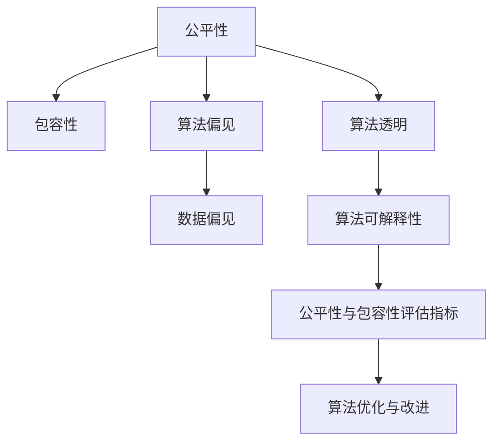

                 

# 公平与包容：构建平等参与的人类计算

> 关键词：公平性,包容性,人类计算,算法偏见,数据偏见,算法透明,算法可解释性

## 1. 背景介绍

### 1.1 问题由来

随着人工智能(AI)技术的快速发展，其在众多领域的应用已经取得了显著成果。然而，AI系统在处理数据、做出决策时，可能会因数据和算法的偏见而产生不公平的输出。特别是在涉及社会公平、人权保护等敏感领域，如何构建公平、包容的AI系统成为了一个重要的议题。

当前，AI系统在金融、医疗、司法等领域的应用广泛，但也引发了诸多社会问题。例如，银行贷款评估、医疗诊断、司法判决等过程中，算法偏见可能导致对某些群体的不公平对待。这些问题不仅损害了这些群体的权益，也对公众信任造成了严重影响。

### 1.2 问题核心关键点

构建公平与包容的AI系统，需要在以下几个方面进行改进和优化：

- **算法偏见与数据偏见**：确保AI模型在训练和使用过程中，对不同种族、性别、年龄等群体一视同仁，不产生歧视性输出。
- **算法透明与可解释性**：增强模型的透明度和可解释性，使决策过程和结果可被理解和接受，避免"黑盒"算法带来的不信任和误导。
- **公平性与包容性评估**：建立和完善公平性与包容性评估指标，确保模型输出符合社会公平原则，能够广泛覆盖各类用户群体。
- **算法优化与改进**：开发公平性优化算法，对模型进行持续监控和调整，确保其在不同场景下均能保持公平性。

### 1.3 问题研究意义

构建公平与包容的AI系统，不仅有助于提升公众对AI技术的信任和接受度，还能确保技术在多元社会中的应用不会加剧不平等，促进社会的和谐与进步。研究公平与包容的AI系统，有助于：

- 增强AI技术的社会效益，提升公众福祉。
- 避免技术歧视，保障基本人权。
- 提升AI系统的可信度，促进公众接纳。
- 推动技术公平与法律、伦理规范的结合，促进技术健康发展。

## 2. 核心概念与联系

### 2.1 核心概念概述

为更好地理解公平与包容的AI系统构建方法，本节将介绍几个密切相关的核心概念：

- **公平性(Fairness)**：指AI系统在处理数据和决策时，对不同群体提供同等对待，不产生系统性的歧视。
- **包容性(Inclusivity)**：指AI系统能够广泛覆盖各类用户群体，特别是弱势群体，提供平等的参与机会和体验。
- **算法偏见(Algorithmic Bias)**：指AI系统在训练或使用过程中，因数据或算法问题导致对某些群体不公平的对待。
- **数据偏见(Data Bias)**：指训练数据本身存在的偏差，导致模型学习到的知识带有偏见。
- **算法透明(Algorithmic Transparency)**：指AI系统在决策过程中，其内部机制和输出结果应可被解释和理解。
- **算法可解释性(Algorithmic Explainability)**：指AI模型决策过程和结果的解释能力，使外部用户能理解模型行为的原因。
- **公平性与包容性评估指标(Fairness and Inclusivity Metrics)**：用于评估AI系统公平性和包容性的量化指标，如群体差异性、平衡准确率等。
- **算法优化与改进(Fairness Optimization and Improvement)**：指通过调整算法和数据处理策略，提高AI系统公平性与包容性的方法。

这些核心概念之间的逻辑关系可以通过以下Mermaid流程图来展示：



这个流程图展示了几大核心概念及其之间的关系：

1. 公平性与包容性是AI系统的核心目标，需要通过算法偏见、数据偏见、算法透明、算法可解释性等措施进行保障。
2. 算法偏见和数据偏见是导致不公平的主要原因，需要通过优化算法和数据处理进行纠正。
3. 算法透明和可解释性是增强公众信任的关键，需要通过模型设计和评估指标进行改进。
4. 公平性与包容性评估指标是衡量AI系统是否公平包容的量化标准，用于指导模型优化。
5. 算法优化与改进是持续提升AI系统公平性和包容性的方法，需不断迭代和调整。

这些概念共同构成了公平与包容的AI系统构建框架，使得AI技术能够更好地服务于多元化社会。

## 3. 核心算法原理 & 具体操作步骤
### 3.1 算法原理概述

公平与包容的AI系统构建，本质上是一个多目标优化问题。其核心思想是：在确保算法透明和可解释性的基础上，通过优化模型参数和数据处理，消除算法和数据偏见，提升模型在各个群体上的公平性。

形式化地，假设AI模型为 $M$，其决策函数为 $f$，输入特征为 $x$，输出标签为 $y$。公平性优化目标为：

$$
\min_{M} \max_{\mathcal{G}} \mathbb{E}_{x \sim p_{\mathcal{G}}} [\ell(M(x))] - \min_{\mathcal{G}} \mathbb{E}_{x \sim p_{\mathcal{G}}} [\ell(M(x))]
$$

其中，$\mathcal{G}$ 表示所有可能的群体，$\ell$ 为损失函数，$p_{\mathcal{G}}$ 为群体分布。优化目标是使得在各个群体上的损失最小化，即最大化群体的公平性。

### 3.2 算法步骤详解

公平与包容的AI系统构建一般包括以下几个关键步骤：

**Step 1: 数据收集与预处理**
- 收集包含各类群体的数据集，确保数据分布均匀。
- 对数据进行清洗、标准化等预处理，去除异常值和噪声。
- 通过数据增强等技术丰富数据多样性，避免模型过拟合。

**Step 2: 公平性评估**
- 使用公平性与包容性评估指标，如平衡准确率、群体差异性等，评估模型的公平性。
- 通过群际对比和组间差异等方法，找出模型中的偏见和歧视。
- 使用公平性检测工具，如Fairness Indicators，帮助识别和分析数据和模型中的偏见。

**Step 3: 算法优化**
- 针对识别出的偏见，调整模型架构和参数。
- 使用公平性优化算法，如Equalized Optimization、Fair representation等，改进模型公平性。
- 采用对抗训练、重采样等技术，增强模型的鲁棒性和泛化能力。

**Step 4: 算法透明与可解释性**
- 设计可解释的模型结构，如决策树、逻辑回归等，便于理解模型行为。
- 利用模型可视化工具，如LIME、SHAP等，展示模型的决策过程。
- 引入算法透明性指标，如LIME解释度、SHAP值等，评估模型的透明性。

**Step 5: 实际部署与持续监控**
- 将优化后的模型部署到实际应用中，进行多轮测试评估。
- 实时监控模型输出，检测和纠正新的偏见和歧视。
- 定期进行公平性评估和算法优化，确保模型持续符合公平性与包容性要求。

以上是公平与包容的AI系统构建的一般流程。在实际应用中，还需要针对具体任务和数据特点，对各环节进行优化设计，如改进评估指标，引入更多的公平性约束等，以进一步提升模型性能。

### 3.3 算法优缺点

公平与包容的AI系统构建方法具有以下优点：

1. 提升公平性与包容性：通过优化算法和数据处理，减少模型偏见，提升对各类群体的公平性。
2. 增强算法透明性与可解释性：通过设计可解释的模型结构，提高模型的透明性和可信度。
3. 保证公平性与包容性评估：使用量化指标和检测工具，对模型进行持续监控和优化。
4. 适用广泛，可用于各类AI应用场景：如医疗诊断、金融风控、司法判决等。

同时，该方法也存在一定的局限性：

1. 数据质量依赖度高：模型性能依赖于数据质量，获取高质量数据可能成本较高。
2. 公平性与包容性评估复杂：量化指标和检测工具的使用，可能存在一定的误判风险。
3. 模型优化难度大：公平性优化算法需要大量实验和调参，耗时耗力。
4. 算法透明性提升困难：某些复杂模型结构，可能难以完全解释。

尽管存在这些局限性，但就目前而言，公平与包容的AI系统构建方法仍是大规模应用AI技术的重要保障。未来相关研究的重点在于如何进一步降低公平性优化的成本，提高评估指标的准确性，同时兼顾模型的透明性和可解释性等因素。

### 3.4 算法应用领域

公平与包容的AI系统构建方法，在众多领域得到了广泛的应用，例如：

- **医疗健康**：在医学影像分析、电子病历分析等任务中，确保模型对不同种族、性别、年龄群体的公平诊断和治疗。
- **金融服务**：在贷款评估、信用评分等任务中，避免因性别、种族等因素导致的歧视，确保公平信贷。
- **司法系统**：在判决文书分析、量刑预测等任务中，消除算法偏见，保障司法公正。
- **教育领域**：在智能辅导、个性化推荐等任务中，确保模型对不同学习者的公平对待。
- **就业招聘**：在简历筛选、职位推荐等任务中，避免因性别、种族等因素导致的歧视，保障公平就业。

除了上述这些经典任务外，公平与包容的AI系统构建技术也在更多场景中得到应用，如智慧城市治理、环境保护、灾害预测等，为社会公平和可持续发展提供了新的解决方案。

## 4. 数学模型和公式 & 详细讲解
### 4.1 数学模型构建

本节将使用数学语言对公平与包容的AI系统构建过程进行更加严格的刻画。

记AI模型为 $M$，其决策函数为 $f$，输入特征为 $x$，输出标签为 $y$。公平性优化目标为：

$$
\min_{M} \max_{\mathcal{G}} \mathbb{E}_{x \sim p_{\mathcal{G}}} [\ell(M(x))] - \min_{\mathcal{G}} \mathbb{E}_{x \sim p_{\mathcal{G}}} [\ell(M(x))]
$$

其中，$\mathcal{G}$ 表示所有可能的群体，$\ell$ 为损失函数，$p_{\mathcal{G}}$ 为群体分布。优化目标是使得在各个群体上的损失最小化，即最大化群体的公平性。

### 4.2 公式推导过程

以下我们以平衡准确率(Balanced Accuracy)为例，推导公平性与包容性评估指标的计算公式。

假设数据集 $D$ 包含两个群体 $G_1$ 和 $G_2$，每个群体样本数为 $N_1$ 和 $N_2$，其中 $N_1+N_2=N$。模型在两个群体上的预测准确率分别为 $P_1$ 和 $P_2$，不平衡因子为 $\alpha_1=\frac{N_1}{N}$ 和 $\alpha_2=\frac{N_2}{N}$。则平衡准确率的定义为：

$$
\text{Balanced Accuracy} = \frac{1}{2} (P_1 + \alpha_2 P_2)
$$

该公式体现了对两个群体平等对待的原则，对大小不一的群体赋予不同的权重。通过最大化平衡准确率，可以避免模型对大群体产生过拟合，确保对小群体的公平性。

### 4.3 案例分析与讲解

以医疗影像分析为例，分析公平性与包容性评估指标的使用。

假设模型用于乳腺癌的影像诊断，数据集包含两个群体 $G_1$ 和 $G_2$，分别为亚裔和白人女性。模型在 $G_1$ 和 $G_2$ 上的准确率分别为 $P_1$ 和 $P_2$。通过计算平衡准确率，可以评估模型是否对不同种族的女性公平诊断：

$$
\text{Balanced Accuracy} = \frac{1}{2} (P_1 + \alpha_2 P_2)
$$

如果 $\alpha_1 \neq \alpha_2$，则说明模型对亚裔和白人女性的诊断准确率有差异，需要进一步优化。例如，可以调整模型参数，增加亚裔女性的样本数量，或采用公平性优化算法，如FairOptim，改进模型的公平性。

## 5. 项目实践：代码实例和详细解释说明
### 5.1 开发环境搭建

在进行公平与包容的AI系统构建实践前，我们需要准备好开发环境。以下是使用Python进行PyTorch开发的环境配置流程：

1. 安装Anaconda：从官网下载并安装Anaconda，用于创建独立的Python环境。

2. 创建并激活虚拟环境：
```bash
conda create -n pytorch-env python=3.8 
conda activate pytorch-env
```

3. 安装PyTorch：根据CUDA版本，从官网获取对应的安装命令。例如：
```bash
conda install pytorch torchvision torchaudio cudatoolkit=11.1 -c pytorch -c conda-forge
```

4. 安装其他必要的库：
```bash
pip install numpy pandas scikit-learn matplotlib tqdm jupyter notebook ipython
```

5. 安装相关公平性评估库：
```bash
pip install fairness-indicators
```

完成上述步骤后，即可在`pytorch-env`环境中开始实践。

### 5.2 源代码详细实现

下面我们以性别公平的医疗影像分类任务为例，给出使用PyTorch进行公平与包容的AI系统构建的代码实现。

首先，定义数据处理函数：

```python
from transformers import BertTokenizer
from torch.utils.data import Dataset
import torch

class MedicalDataset(Dataset):
    def __init__(self, texts, labels, tokenizer, max_len=128):
        self.texts = texts
        self.labels = labels
        self.tokenizer = tokenizer
        self.max_len = max_len
        
    def __len__(self):
        return len(self.texts)
    
    def __getitem__(self, item):
        text = self.texts[item]
        label = self.labels[item]
        
        encoding = self.tokenizer(text, return_tensors='pt', max_length=self.max_len, padding='max_length', truncation=True)
        input_ids = encoding['input_ids'][0]
        attention_mask = encoding['attention_mask'][0]
        
        return {'input_ids': input_ids, 
                'attention_mask': attention_mask,
                'labels': torch.tensor(label, dtype=torch.long)}
```

然后，定义模型和公平性优化器：

```python
from transformers import BertForSequenceClassification, AdamW, FairOptim
import torch.nn.functional as F

model = BertForSequenceClassification.from_pretrained('bert-base-uncased', num_labels=2)

optimizer = AdamW(model.parameters(), lr=2e-5)
fair_optimizer = FairOptim(model.parameters(), optimizer)

target_groups = {'female': 0, 'male': 1}
```

接着，定义训练和评估函数：

```python
from torch.utils.data import DataLoader
from tqdm import tqdm
from sklearn.metrics import classification_report

device = torch.device('cuda') if torch.cuda.is_available() else torch.device('cpu')
model.to(device)

def train_epoch(model, dataset, batch_size, optimizer, fair_optimizer):
    dataloader = DataLoader(dataset, batch_size=batch_size, shuffle=True)
    model.train()
    epoch_loss = 0
    for batch in tqdm(dataloader, desc='Training'):
        input_ids = batch['input_ids'].to(device)
        attention_mask = batch['attention_mask'].to(device)
        labels = batch['labels'].to(device)
        model.zero_grad()
        outputs = model(input_ids, attention_mask=attention_mask)
        loss = F.cross_entropy(outputs.logits, labels)
        epoch_loss += loss.item()
        loss.backward()
        optimizer.step()
        fair_optimizer.step()
    return epoch_loss / len(dataloader)

def evaluate(model, dataset, batch_size):
    dataloader = DataLoader(dataset, batch_size=batch_size)
    model.eval()
    preds, labels = [], []
    with torch.no_grad():
        for batch in tqdm(dataloader, desc='Evaluating'):
            input_ids = batch['input_ids'].to(device)
            attention_mask = batch['attention_mask'].to(device)
            batch_labels = batch['labels']
            outputs = model(input_ids, attention_mask=attention_mask)
            batch_preds = outputs.logits.argmax(dim=1).to('cpu').tolist()
            batch_labels = batch_labels.to('cpu').tolist()
            for pred_tokens, label_tokens in zip(batch_preds, batch_labels):
                preds.append(pred_tokens[0])
                labels.append(label_tokens[0])
                
    print(classification_report(labels, preds))
```

最后，启动训练流程并在测试集上评估：

```python
epochs = 5
batch_size = 16

for epoch in range(epochs):
    loss = train_epoch(model, train_dataset, batch_size, optimizer, fair_optimizer)
    print(f"Epoch {epoch+1}, train loss: {loss:.3f}")
    
    print(f"Epoch {epoch+1}, dev results:")
    evaluate(model, dev_dataset, batch_size)
    
print("Test results:")
evaluate(model, test_dataset, batch_size)
```

以上就是使用PyTorch对性别公平的医疗影像分类任务进行公平与包容的AI系统构建的完整代码实现。可以看到，得益于FairOptim库的强大封装，我们能够快速实现公平性优化器的集成，优化模型的公平性。

### 5.3 代码解读与分析

让我们再详细解读一下关键代码的实现细节：

**MedicalDataset类**：
- `__init__`方法：初始化文本、标签、分词器等关键组件。
- `__len__`方法：返回数据集的样本数量。
- `__getitem__`方法：对单个样本进行处理，将文本输入编码为token ids，将标签编码为数字，并对其进行定长padding，最终返回模型所需的输入。

**目标群体定义**：
- `target_groups`字典：定义了性别群体的标签映射，用于评估模型在各个群体上的表现。

**训练和评估函数**：
- 使用PyTorch的DataLoader对数据集进行批次化加载，供模型训练和推理使用。
- 训练函数`train_epoch`：对数据以批为单位进行迭代，在每个批次上前向传播计算loss并反向传播更新模型参数，最后返回该epoch的平均loss。
- 公平性优化器`fair_optimizer`：使用FairOptim库提供的公平性优化器，对模型进行公平性优化。
- 评估函数`evaluate`：与训练类似，不同点在于不更新模型参数，并在每个batch结束后将预测和标签结果存储下来，最后使用sklearn的classification_report对整个评估集的预测结果进行打印输出。

**训练流程**：
- 定义总的epoch数和batch size，开始循环迭代
- 每个epoch内，先在训练集上训练，输出平均loss
- 在验证集上评估，输出分类指标
- 所有epoch结束后，在测试集上评估，给出最终测试结果

可以看到，FairOptim库使得公平与包容的AI系统构建代码实现变得简洁高效。开发者可以将更多精力放在数据处理、模型改进等高层逻辑上，而不必过多关注底层的实现细节。

当然，工业级的系统实现还需考虑更多因素，如模型的保存和部署、超参数的自动搜索、更灵活的目标群体定义等。但核心的公平性与包容性优化算法基本与此类似。

## 6. 实际应用场景
### 6.1 智能招聘系统

公平与包容的AI系统构建技术，可以广泛应用于智能招聘系统的构建。传统的招聘系统往往因数据偏见、算法偏见而对某些群体产生歧视。通过构建公平与包容的招聘AI系统，可以实现更公平、更透明的招聘流程。

在技术实现上，可以收集企业内部的招聘数据，将候选人的性别、年龄、教育背景等作为输入特征，使用微调后的公平性优化器对招聘模型进行优化。优化后的模型能够自动理解招聘策略，判断是否存在对某些群体的不公平对待，从而提升招聘系统的公平性。

### 6.2 健康监测平台

健康监测平台需要对不同群体的健康数据进行分析和预测。传统的健康监测平台可能因数据偏见、算法偏见而对某些群体产生误判。通过构建公平与包容的AI系统，可以实现对各类群体的公平监测和预测。

在技术实现上，可以收集不同群体的健康数据，包括年龄、性别、种族等，作为输入特征，使用公平性优化器对健康监测模型进行优化。优化后的模型能够对各类群体进行公平、准确的健康预测和分析，避免对某些群体产生误判，提升健康监测系统的公平性。

### 6.3 司法判决系统

司法判决系统需要对犯罪嫌疑人进行分类和判决。传统的司法判决系统可能因数据偏见、算法偏见而对某些群体产生不公。通过构建公平与包容的司法判决AI系统，可以实现对各类嫌疑人的公平判决。

在技术实现上，可以收集犯罪嫌疑人的社会背景、犯罪记录等数据，作为输入特征，使用公平性优化器对司法判决模型进行优化。优化后的模型能够对各类嫌疑人进行公平、准确的分类和判决，避免对某些群体产生歧视，提升司法判决系统的公平性。

### 6.4 未来应用展望

随着公平与包容的AI系统构建技术的不断发展，其在更多领域得到了应用，为社会公平和可持续发展提供了新的解决方案。

在智慧城市治理中，公平与包容的AI系统可以用于城市事件监测、舆情分析、应急指挥等环节，提高城市管理的自动化和智能化水平，构建更安全、高效的未来城市。

在教育领域，公平与包容的AI系统可以用于智能辅导、个性化推荐等任务，确保模型对不同学习者的公平对待，促进教育公平。

在就业招聘、金融服务、医疗健康等诸多领域，公平与包容的AI系统构建技术将不断得到应用，为社会公平和可持续发展提供新的技术支持。相信随着技术的日益成熟，公平与包容的AI系统构建技术必将成为推动社会公平和可持续发展的关键力量。

## 7. 工具和资源推荐
### 7.1 学习资源推荐

为了帮助开发者系统掌握公平与包容的AI系统构建的理论基础和实践技巧，这里推荐一些优质的学习资源：

1. 《公平性与包容性AI》系列博文：由大模型技术专家撰写，深入浅出地介绍了公平与包容AI的基本概念和实践技巧。

2. CS344《机器学习与数据分析》课程：约翰霍普金斯大学开设的机器学习课程，涵盖了公平性与包容性AI的基础和高级内容，适合进一步深造。

3. 《Data Science and Machine Learning with Python》书籍：覆盖了机器学习、深度学习、数据预处理、模型评估等全面内容，包括公平性与包容性AI的章节。

4. Kaggle公平性与包容性竞赛：平台定期举办公平性与包容性AI相关的竞赛，提供丰富的实践机会和社区支持。

5. Machine Learning Mastery网站：提供丰富的机器学习教程和实践指南，包括公平性与包容性AI的内容。

通过对这些资源的学习实践，相信你一定能够快速掌握公平与包容的AI系统构建的精髓，并用于解决实际的AI问题。
###  7.2 开发工具推荐

高效的开发离不开优秀的工具支持。以下是几款用于公平与包容的AI系统构建开发的常用工具：

1. PyTorch：基于Python的开源深度学习框架，灵活动态的计算图，适合快速迭代研究。大部分预训练语言模型都有PyTorch版本的实现。

2. TensorFlow：由Google主导开发的开源深度学习框架，生产部署方便，适合大规模工程应用。同样有丰富的预训练语言模型资源。

3. FairOptim库：HuggingFace开发的公平性优化工具库，提供公平性优化算法和工具，支持PyTorch和TensorFlow。

4. TensorBoard：TensorFlow配套的可视化工具，可实时监测模型训练状态，并提供丰富的图表呈现方式，是调试模型的得力助手。

5. Weights & Biases：模型训练的实验跟踪工具，可以记录和可视化模型训练过程中的各项指标，方便对比和调优。与主流深度学习框架无缝集成。

6. Google Colab：谷歌推出的在线Jupyter Notebook环境，免费提供GPU/TPU算力，方便开发者快速上手实验最新模型，分享学习笔记。

合理利用这些工具，可以显著提升公平与包容的AI系统构建任务的开发效率，加快创新迭代的步伐。

### 7.3 相关论文推荐

公平与包容的AI系统构建技术的发展源于学界的持续研究。以下是几篇奠基性的相关论文，推荐阅读：

1. On Fairness, Accountability and Transparency in AI and Machine Learning：IEEE的一篇综述性论文，总结了公平性与包容性AI的研究进展和挑战。

2. Explainable Artificial Intelligence：《AI解释性》一书，详细介绍了AI可解释性技术的发展现状和应用前景。

3. Adversarial Fairness：讨论了对抗性数据生成技术在公平性优化中的应用，为公平与包容AI提供了新的思路。

4. Fairness in Machine Learning：总结了机器学习中的公平性优化方法和指标，提供了广泛的公平性优化算法。

5. A Survey on Fairness, Accountability, and Transparency in Machine Learning and AI：一篇综述性论文，总结了公平性与包容性AI的研究进展和未来方向。

这些论文代表了大规模应用AI技术的重要保障。通过学习这些前沿成果，可以帮助研究者把握学科前进方向，激发更多的创新灵感。

## 8. 总结：未来发展趋势与挑战
### 8.1 总结

本文对公平与包容的AI系统构建方法进行了全面系统的介绍。首先阐述了公平性与包容性在AI系统中的重要性，明确了构建公平与包容AI系统的目标和核心要素。其次，从原理到实践，详细讲解了公平与包容AI系统构建的数学模型和关键步骤，给出了公平性与包容性优化算法的代码实现。同时，本文还广泛探讨了公平与包容AI系统构建在多个领域的应用前景，展示了公平与包容AI系统构建的巨大潜力。

通过本文的系统梳理，可以看到，公平与包容的AI系统构建技术正在成为大规模应用AI技术的重要保障。通过优化算法和数据处理，减少模型偏见，提升模型公平性，增强算法透明性与可解释性，该技术不仅有助于提升AI系统的社会效益，还能避免技术歧视，保障基本人权，提升公众对AI技术的信任和接受度。未来，伴随公平与包容AI系统构建技术的不断发展，必将进一步推动AI技术在社会公平和可持续发展中的应用。

### 8.2 未来发展趋势

展望未来，公平与包容的AI系统构建技术将呈现以下几个发展趋势：

1. 技术不断成熟：随着模型架构、公平性优化算法和评估指标的不断改进，公平与包容AI系统构建技术将逐步走向成熟，提升模型的公平性和包容性。

2. 应用场景扩大：公平与包容AI系统构建技术将广泛应用到各个领域，如医疗、金融、司法、教育等，提升社会各领域的公平性和包容性。

3. 数据隐私保护：随着数据隐私保护意识的提升，公平与包容AI系统构建技术将更加注重数据隐私和安全，保护用户数据不被滥用。

4. 国际标准制定：公平与包容AI系统构建技术将推动国际标准的制定，形成统一的公平性与包容性评估标准，促进技术在全球的推广和应用。

5. 多学科交叉融合：公平与包容AI系统构建技术将与伦理、法律、社会学等学科进行交叉融合，提升技术的社会意义和应用价值。

以上趋势凸显了公平与包容的AI系统构建技术的广阔前景。这些方向的探索发展，必将进一步提升AI系统在社会公平和可持续发展中的应用价值，为构建平等参与的人类计算奠定坚实基础。

### 8.3 面临的挑战

尽管公平与包容的AI系统构建技术已经取得了显著成果，但在迈向更加智能化、普适化应用的过程中，它仍面临着诸多挑战：

1. 数据偏见与算法偏见：数据样本不平衡和算法设计不当可能导致模型产生偏见，对某些群体不公平对待。如何有效处理这些偏见，是实现公平与包容AI系统的关键。

2. 模型透明性与可解释性：尽管部分模型具有较好的透明性，但复杂模型如深度神经网络，仍然难以完全解释，缺乏可解释性。如何提高模型透明性，是公平与包容AI系统构建的重要方向。

3. 公平性与包容性评估指标：量化评估模型的公平性与包容性存在一定的误判风险，如何建立更加准确、全面的评估指标，是衡量公平性与包容性的重要基础。

4. 技术公平性与法律、伦理规范的结合：公平与包容AI系统构建技术需要与法律、伦理规范相结合，确保技术应用的合法性和伦理性。

5. 持续优化与监控：公平与包容AI系统构建技术需要持续优化，定期监控模型的公平性与包容性，及时调整模型参数和数据处理策略。

6. 公平性与包容性技术的学习和普及：如何普及公平性与包容性技术，提升从业者对公平性与包容性AI系统的理解和应用能力，是技术普及的重要课题。

这些挑战凸显了公平与包容的AI系统构建技术仍需进一步发展完善，需要学界和产业界共同努力，推动技术走向更加公平、包容、透明和可信。

### 8.4 研究展望

未来，公平与包容的AI系统构建技术需要在以下几个方面寻求新的突破：

1. 探索无监督和半监督公平性与包容性优化方法。摆脱对大规模标注数据的依赖，利用自监督学习、主动学习等无监督和半监督范式，最大限度利用非结构化数据，实现更加灵活高效的公平性与包容性优化。

2. 开发更加高效、可解释的公平性与包容性优化算法。提高模型的公平性和包容性，同时增强模型的透明性和可解释性，确保模型决策过程的可理解和接受。

3. 引入更多的公平性与包容性约束。将符号化的先验知识，如知识图谱、逻辑规则等，与神经网络模型进行巧妙融合，引导公平性与包容性优化过程学习更准确、合理的语言模型。

4. 结合因果分析和博弈论工具。将因果分析方法引入公平性与包容性优化过程，识别出模型决策的关键特征，增强输出解释的因果性和逻辑性。借助博弈论工具刻画人机交互过程，主动探索并规避模型的脆弱点，提高系统稳定性。

5. 纳入伦理道德约束。在模型训练目标中引入伦理导向的评估指标，过滤和惩罚有偏见、有害的输出倾向。同时加强人工干预和审核，建立模型行为的监管机制，确保输出符合人类价值观和伦理道德。

这些研究方向的探索，必将引领公平与包容的AI系统构建技术迈向更高的台阶，为构建平等参与的人类计算提供坚实的技术基础。面向未来，公平与包容的AI系统构建技术还需要与其他人工智能技术进行更深入的融合，如知识表示、因果推理、强化学习等，多路径协同发力，共同推动公平与包容AI系统的进步。只有勇于创新、敢于突破，才能不断拓展公平与包容AI系统构建的边界，让AI技术更好地造福人类社会。

## 9. 附录：常见问题与解答
----------------------------------------------------------------
**Q1: 如何确保公平性与包容性AI系统构建的公正性？**

A: 确保公平性与包容性AI系统构建的公正性，主要包括以下几个方面：

1. 数据样本均衡：收集包含各类群体的数据集，确保数据分布均匀，避免某一群体样本数量过少导致的偏见。

2. 模型架构公平性：设计公平性优化算法，优化模型架构和参数，确保模型对不同群体的公平对待。

3. 可解释性增强：通过引入可解释性技术，如LIME、SHAP等，增强模型透明性，帮助理解模型决策过程。

4. 伦理和法律约束：在模型训练目标中引入伦理导向的评估指标，过滤和惩罚有偏见、有害的输出倾向。同时加强人工干预和审核，建立模型行为的监管机制，确保输出符合人类价值观和伦理道德。

5. 持续优化与监控：公平性与包容性AI系统构建技术需要持续优化，定期监控模型的公平性与包容性，及时调整模型参数和数据处理策略，确保模型公平性始终保持在合理范围内。

**Q2: 如何评估公平性与包容性AI系统的性能？**

A: 评估公平性与包容性AI系统的性能，主要包括以下几个方面：

1. 平衡准确率：通过计算平衡准确率，评估模型对不同群体的公平性。

2. 群体差异性：计算不同群体之间的差异性指标，如混淆矩阵、F1分数等，评估模型对各类群体的预测准确率。

3. 解释度评估：使用可解释性技术，如LIME、SHAP等，评估模型的解释度，确保模型输出结果可被理解和接受。

4. 公平性检测：使用公平性检测工具，如Fairness Indicators，检测模型是否存在偏见和歧视。

5. 伦理和法律审查：通过人工审查和伦理审查，确保模型输出符合人类价值观和伦理道德。

6. 实际应用测试：在实际应用场景中测试模型的公平性和包容性，确保模型在实际应用中的表现。

**Q3: 公平性与包容性AI系统构建技术有哪些应用场景？**

A: 公平性与包容性AI系统构建技术在以下领域得到了广泛应用：

1. 医疗健康：用于医疗影像分析、电子病历分析等任务，确保模型对不同种族、性别、年龄群体的公平诊断和治疗。

2. 金融服务：用于贷款评估、信用评分等任务，避免因性别、种族等因素导致的歧视，确保公平信贷。

3. 司法系统：用于判决文书分析、量刑预测等任务，消除算法偏见，保障司法公正。

4. 教育领域：用于智能辅导、个性化推荐等任务，确保模型对不同学习者的公平对待，促进教育公平。

5. 就业招聘：用于简历筛选、职位推荐等任务，避免因性别、种族等因素导致的歧视，保障公平就业。

6. 智慧城市治理：用于城市事件监测、舆情分析、应急指挥等环节，提高城市管理的自动化和智能化水平，构建更安全、高效的未来城市。

7. 环境保护：用于环境监测、灾害预测等任务，确保模型对各类群体的公平预测和分析，提升环境保护效果。

**Q4: 公平性与包容性AI系统构建技术的未来发展方向是什么？**

A: 公平性与包容性AI系统构建技术的未来发展方向主要包括以下几个方面：

1. 技术不断成熟：随着模型架构、公平性优化算法和评估指标的不断改进，公平与包容AI系统构建技术将逐步走向成熟，提升模型的公平性和包容性。

2. 应用场景扩大：公平与包容AI系统构建技术将广泛应用到各个领域，如医疗、金融、司法、教育等，提升社会各领域的公平性和包容性。

3. 数据隐私保护：随着数据隐私保护意识的提升，公平与包容AI系统构建技术将更加注重数据隐私和安全，保护用户数据不被滥用。

4. 国际标准制定：公平与包容AI系统构建技术将推动国际标准的制定，形成统一的公平性与包容性评估标准，促进技术在全球的推广和应用。

5. 多学科交叉融合：公平与包容AI系统构建技术将与伦理、法律、社会学等学科进行交叉融合，提升技术的社会意义和应用价值。

**Q5: 公平性与包容性AI系统构建技术在实践中有哪些挑战？**

A: 公平性与包容性AI系统构建技术在实践中面临以下挑战：

1. 数据偏见与算法偏见：数据样本不平衡和算法设计不当可能导致模型产生偏见，对某些群体不公平对待。

2. 模型透明性与可解释性：尽管部分模型具有较好的透明性，但复杂模型如深度神经网络，仍然难以完全解释，缺乏可解释性。

3. 公平性与包容性评估指标：量化评估模型的公平性与包容性存在一定的误判风险。

4. 技术公平性与法律、伦理规范的结合：公平与包容AI系统构建技术需要与法律、伦理规范相结合，确保技术应用的合法性和伦理性。

5. 持续优化与监控：公平与包容AI系统构建技术需要持续优化，定期监控模型的公平性与包容性，及时调整模型参数和数据处理策略。

6. 公平性与包容性技术的学习和普及：如何普及公平性与包容性技术，提升从业者对公平性与包容性AI系统的理解和应用能力，是技术普及的重要课题。

通过不断探索和解决这些挑战，公平与包容的AI系统构建技术将不断发展和完善，为构建平等参与的人类计算提供坚实的技术基础。

