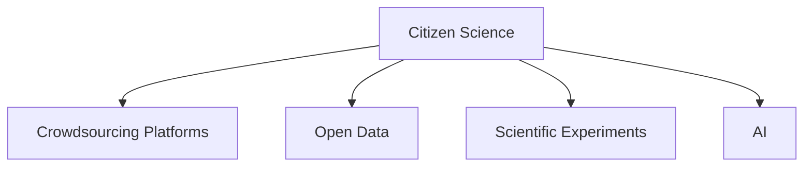

                 

# 公民科学：公众参与科学研究的新模式

> 关键词：公民科学, 开放数据, 众包, 科学实验, 人工智能, 公众参与

## 1. 背景介绍

### 1.1 问题由来
随着信息技术的发展，科学研究的范式正在发生深刻变革。传统的科学研究往往依赖于少数专家在实验室中进行，而公众的参与往往被边缘化。然而，公众的广泛参与可以带来更多的多样性和创新，有助于解决复杂的科学问题。

### 1.2 问题核心关键点
公民科学是指公众参与科学研究的范式，它强调利用公众的智慧和资源，通过众包平台和开放数据，让公众参与到科学实验和数据分析中来。近年来，公民科学在多个领域得到了广泛应用，如环境监测、天文观测、药物筛选等。

### 1.3 问题研究意义
研究公民科学的理论和实践，对于推动科学民主化、促进科学研究的多样化和创新、提升公众科学素养、激发社会参与意识等具有重要意义：

1. 推动科学民主化：公民科学通过广泛吸纳公众参与，促进科学决策的民主化和透明化。
2. 促进科学研究的多样化和创新：公众的多样性背景和视角可以带来更多创新思路和解决方案。
3. 提升公众科学素养：参与公民科学可以提升公众对科学原理和方法的理解，增强科学素养。
4. 激发社会参与意识：公民科学可以激发公众的参与热情，增强社会对科学研究的关注和支持。

## 2. 核心概念与联系

### 2.1 核心概念概述

为更好地理解公民科学的本质和工作机制，本节将介绍几个密切相关的核心概念：

- 公民科学(Citizen Science)：指公众参与科学研究的范式，通过众包平台和开放数据，让公众参与到科学实验和数据分析中来。

- 众包平台(Crowdsourcing Platforms)：指提供数据收集、任务分配、结果提交、质量控制等功能的网络平台，用于支持公众参与科学实验。

- 开放数据(Open Data)：指免费、可访问、可复用的数据集，公众可以通过众包平台获取这些数据，进行科学研究和分析。

- 科学实验(Scientific Experiments)：指通过实验验证科学假设和理论，获取科学数据和结果的过程。

- 人工智能(AI)：指通过算法和模型处理、分析和理解数据，辅助公众参与科学实验和数据分析。

这些核心概念之间的逻辑关系可以通过以下Mermaid流程图来展示：



这个流程图展示出公民科学的各组成要素之间的关系：

1. 公民科学通过众包平台和开放数据，让公众参与到科学实验中。
2. 开放数据为公众提供了实验所需的数据基础。
3. 科学实验是公众参与的核心活动。
4. 人工智能辅助公众进行数据处理和分析。

这些概念共同构成了公民科学的整体框架，使得公众能够广泛参与到科学研究中，推动科学研究和公共决策的民主化和科学化。

## 3. 核心算法原理 & 具体操作步骤
### 3.1 算法原理概述

公民科学的算法原理，主要基于众包平台和开放数据，通过人工智能技术，辅助公众参与科学实验和数据分析。其核心思想是：

1. 通过众包平台收集公众提交的数据和实验结果。
2. 利用人工智能技术对数据进行预处理和分析，提升数据质量和分析效率。
3. 利用数据分析结果，指导公众进一步的实验设计和数据分析。
4. 重复上述过程，直到达到科学目标或数据量饱和。

### 3.2 算法步骤详解

公民科学的核心算法步骤主要包括以下几个关键步骤：

**Step 1: 平台设计与数据采集**
- 设计众包平台，包括数据提交界面、质量控制机制、结果展示界面等。
- 准备开放数据集，确保数据的完整性和准确性。
- 利用人工智能技术对数据进行初步筛选和清洗，提升数据质量。

**Step 2: 任务分配与实验设计**
- 根据科学目标，设计实验任务，并在众包平台上发布任务说明。
- 利用人工智能技术对实验设计进行优化，如实验流程、设备参数等。
- 分配实验任务给公众，并根据实际情况调整任务分配策略。

**Step 3: 数据收集与结果提交**
- 公众按照任务说明，完成实验任务并提交数据。
- 利用人工智能技术对公众提交的数据进行初步分析和预处理，确保数据质量。
- 在众包平台上展示结果，并提供数据反馈和修改机制。

**Step 4: 数据分析与科学推断**
- 利用人工智能技术对公众提交的数据进行深度分析和统计，提取科学结论。
- 在众包平台上展示分析结果，并邀请专家和公众进行讨论和审核。
- 根据讨论和审核结果，调整实验设计和数据分析方法，继续下一轮实验。

**Step 5: 结果验证与科学发布**
- 利用人工智能技术对科学结论进行验证和推断，确保结论的科学性和可靠性。
- 在科学期刊和开放数据库上发布科学结论，供公众和专家进一步验证和讨论。
- 根据科学结论，指导后续的实验设计，推动科学研究的深入发展。

以上是公民科学的算法步骤。在实际应用中，还需要针对具体科学问题和数据特点，对算法步骤进行优化设计，如引入更多质量控制机制、采用更高效的数据分析方法等，以进一步提升科学研究的准确性和效率。

### 3.3 算法优缺点

公民科学的算法具有以下优点：
1. 多样性：公众的多样性背景和视角可以带来更多创新思路和解决方案。
2. 数据丰富：利用众包平台和开放数据，可以获取大量实验数据，提升研究的丰富性和深度。
3. 参与广泛：公众的广泛参与可以提升科学研究的民主化和透明化。
4. 成本低廉：利用众包平台和开放数据，可以降低实验和数据分析的成本。

同时，该算法也存在一定的局限性：
1. 数据质量不稳定：公众提交的数据质量可能参差不齐，需要进行严格的质量控制。
2. 分析结果复杂：大规模数据分析和科学推断需要较强的技术能力和设备支持。
3. 公众动机不确定：公众参与的动机可能不稳定，需要有效激励机制。
4. 实验过程复杂：复杂实验任务的设计和执行可能存在难度，需要专业人员指导。

尽管存在这些局限性，但公民科学通过广泛的公众参与，有望在科学研究和公共决策中发挥重要作用，推动科学研究的民主化和科学化进程。

### 3.4 算法应用领域

公民科学在多个领域已经得到了广泛应用，例如：

- 环境监测：利用公众的相机、传感器等设备，收集空气、水质、土壤等环境数据，监测环境污染和生态变化。
- 天文观测：利用公众的天文望远镜，收集星体观测数据，进行天文科学研究。
- 药物筛选：利用公众的药物试验数据，筛选具有潜在疗效的药物，推动新药研发。
- 生物多样性：利用公众的生物采样数据，研究生物多样性和生态系统动态。
- 公共健康：利用公众的健康数据，研究疾病传播和流行趋势，提升公共健康水平。

除了上述这些经典领域外，公民科学还被创新性地应用到更多场景中，如城市规划、社会调查、地质勘探等，为科学研究和社会决策提供了新的思路和手段。

## 4. 数学模型和公式 & 详细讲解  
### 4.1 数学模型构建

本节将使用数学语言对公民科学的算法进行更加严格的刻画。

记众包平台上的公众参与数据为 $D=\{x_i, y_i\}_{i=1}^N$，其中 $x_i$ 为实验数据，$y_i$ 为实验结果。设众包平台上的公众数量为 $M$，每个公众提交的数据和结果记为 $d_{mi}$ 和 $y_{mi}$。

公民科学的数学模型构建如下：

- 数据预处理模型：$P(d_{mi})$，用于对公众提交的数据进行初步筛选和清洗。
- 实验设计优化模型：$O(d_{mi}, y_{mi})$，用于优化实验设计和任务分配。
- 数据分析模型：$A(d_{mi}, y_{mi})$，用于对公众提交的数据进行深度分析和科学推断。
- 结果验证模型：$V(d_{mi}, y_{mi})$，用于验证科学结论的可靠性。

### 4.2 公式推导过程

以下我们以环境监测为例，推导公民科学的数据分析模型。

假设环境监测的目标是检测空气中的PM2.5浓度，公众利用相机采集不同时间点的空气样本，并提交监测数据 $d_{mi}$ 和检测结果 $y_{mi}$。设环境监测的数据集为 $D=\{(d_{mi}, y_{mi})\}_{i=1}^N$，其中 $d_{mi}$ 为监测时间、地点、采样浓度等特征，$y_{mi}$ 为是否存在PM2.5超标。

数据分析模型可以表示为：

$$
\mathcal{L}(A)=\frac{1}{N}\sum_{i=1}^N \ell(A(d_{mi}, y_{mi}), y_{mi})
$$

其中 $\ell$ 为损失函数，用于衡量模型预测结果与真实标签之间的差异。常见的损失函数包括均方误差损失、交叉熵损失等。

根据上述模型，可以设计如下算法步骤：

1. 数据预处理：利用众包平台的数据预处理模型 $P(d_{mi})$，对公众提交的数据进行初步筛选和清洗。
2. 实验设计：利用实验设计优化模型 $O(d_{mi}, y_{mi})$，对公众提交的数据进行实验设计和任务分配。
3. 数据分析：利用数据分析模型 $A(d_{mi}, y_{mi})$，对公众提交的数据进行深度分析和科学推断。
4. 结果验证：利用结果验证模型 $V(d_{mi}, y_{mi})$，对科学结论进行验证和推断。

### 4.3 案例分析与讲解

以生物多样性监测为例，分析公民科学在生物多样性研究中的应用。

生物多样性监测通过众包平台收集公众提交的生物采样数据，利用人工智能技术对数据进行预处理和分析，提取物种多样性和生态系统动态。具体算法步骤包括：

1. 数据采集：公众利用相机、GPS等设备，采集生物采样数据。
2. 数据预处理：利用数据预处理模型 $P(d_{mi})$，对公众提交的数据进行初步筛选和清洗。
3. 实验设计：利用实验设计优化模型 $O(d_{mi}, y_{mi})$，优化采样频率、采样地点、采样方法等。
4. 数据分析：利用数据分析模型 $A(d_{mi}, y_{mi})$，提取物种多样性和生态系统动态。
5. 结果验证：利用结果验证模型 $V(d_{mi}, y_{mi})$，验证科学结论的可靠性。

## 5. 项目实践：代码实例和详细解释说明
### 5.1 开发环境搭建

在进行公民科学项目开发前，我们需要准备好开发环境。以下是使用Python进行PyTorch开发的环境配置流程：

1. 安装Anaconda：从官网下载并安装Anaconda，用于创建独立的Python环境。

2. 创建并激活虚拟环境：
```bash
conda create -n pytorch-env python=3.8 
conda activate pytorch-env
```

3. 安装PyTorch：根据CUDA版本，从官网获取对应的安装命令。例如：
```bash
conda install pytorch torchvision torchaudio cudatoolkit=11.1 -c pytorch -c conda-forge
```

4. 安装各类工具包：
```bash
pip install numpy pandas scikit-learn matplotlib tqdm jupyter notebook ipython
```

完成上述步骤后，即可在`pytorch-env`环境中开始公民科学项目开发。

### 5.2 源代码详细实现

下面以生物多样性监测为例，给出使用PyTorch进行公民科学项目开发的PyTorch代码实现。

首先，定义数据处理函数：

```python
from transformers import BertTokenizer
from torch.utils.data import Dataset
import torch

class BiodiversityDataset(Dataset):
    def __init__(self, texts, tags, tokenizer, max_len=128):
        self.texts = texts
        self.tags = tags
        self.tokenizer = tokenizer
        self.max_len = max_len
        
    def __len__(self):
        return len(self.texts)
    
    def __getitem__(self, item):
        text = self.texts[item]
        tags = self.tags[item]
        
        encoding = self.tokenizer(text, return_tensors='pt', max_length=self.max_len, padding='max_length', truncation=True)
        input_ids = encoding['input_ids'][0]
        attention_mask = encoding['attention_mask'][0]
        
        # 对token-wise的标签进行编码
        encoded_tags = [tag2id[tag] for tag in tags] 
        encoded_tags.extend([tag2id['O']] * (self.max_len - len(encoded_tags)))
        labels = torch.tensor(encoded_tags, dtype=torch.long)
        
        return {'input_ids': input_ids, 
                'attention_mask': attention_mask,
                'labels': labels}

# 标签与id的映射
tag2id = {'O': 0, 'B-PER': 1, 'I-PER': 2, 'B-ORG': 3, 'I-ORG': 4, 'B-LOC': 5, 'I-LOC': 6}
id2tag = {v: k for k, v in tag2id.items()}

# 创建dataset
tokenizer = BertTokenizer.from_pretrained('bert-base-cased')

train_dataset = BiodiversityDataset(train_texts, train_tags, tokenizer)
dev_dataset = BiodiversityDataset(dev_texts, dev_tags, tokenizer)
test_dataset = BiodiversityDataset(test_texts, test_tags, tokenizer)
```

然后，定义模型和优化器：

```python
from transformers import BertForTokenClassification, AdamW

model = BertForTokenClassification.from_pretrained('bert-base-cased', num_labels=len(tag2id))

optimizer = AdamW(model.parameters(), lr=2e-5)
```

接着，定义训练和评估函数：

```python
from torch.utils.data import DataLoader
from tqdm import tqdm
from sklearn.metrics import classification_report

device = torch.device('cuda') if torch.cuda.is_available() else torch.device('cpu')
model.to(device)

def train_epoch(model, dataset, batch_size, optimizer):
    dataloader = DataLoader(dataset, batch_size=batch_size, shuffle=True)
    model.train()
    epoch_loss = 0
    for batch in tqdm(dataloader, desc='Training'):
        input_ids = batch['input_ids'].to(device)
        attention_mask = batch['attention_mask'].to(device)
        labels = batch['labels'].to(device)
        model.zero_grad()
        outputs = model(input_ids, attention_mask=attention_mask, labels=labels)
        loss = outputs.loss
        epoch_loss += loss.item()
        loss.backward()
        optimizer.step()
    return epoch_loss / len(dataloader)

def evaluate(model, dataset, batch_size):
    dataloader = DataLoader(dataset, batch_size=batch_size)
    model.eval()
    preds, labels = [], []
    with torch.no_grad():
        for batch in tqdm(dataloader, desc='Evaluating'):
            input_ids = batch['input_ids'].to(device)
            attention_mask = batch['attention_mask'].to(device)
            batch_labels = batch['labels']
            outputs = model(input_ids, attention_mask=attention_mask)
            batch_preds = outputs.logits.argmax(dim=2).to('cpu').tolist()
            batch_labels = batch_labels.to('cpu').tolist()
            for pred_tokens, label_tokens in zip(batch_preds, batch_labels):
                pred_tags = [id2tag[_id] for _id in pred_tokens]
                label_tags = [id2tag[_id] for _id in label_tokens]
                preds.append(pred_tags[:len(label_tags)])
                labels.append(label_tags)
                
    print(classification_report(labels, preds))
```

最后，启动训练流程并在测试集上评估：

```python
epochs = 5
batch_size = 16

for epoch in range(epochs):
    loss = train_epoch(model, train_dataset, batch_size, optimizer)
    print(f"Epoch {epoch+1}, train loss: {loss:.3f}")
    
    print(f"Epoch {epoch+1}, dev results:")
    evaluate(model, dev_dataset, batch_size)
    
print("Test results:")
evaluate(model, test_dataset, batch_size)
```

以上就是使用PyTorch进行生物多样性监测公民科学项目开发的完整代码实现。可以看到，得益于Transformers库的强大封装，我们可以用相对简洁的代码完成BERT模型的加载和微调。

### 5.3 代码解读与分析

让我们再详细解读一下关键代码的实现细节：

**BiodiversityDataset类**：
- `__init__`方法：初始化文本、标签、分词器等关键组件。
- `__len__`方法：返回数据集的样本数量。
- `__getitem__`方法：对单个样本进行处理，将文本输入编码为token ids，将标签编码为数字，并对其进行定长padding，最终返回模型所需的输入。

**tag2id和id2tag字典**：
- 定义了标签与数字id之间的映射关系，用于将token-wise的预测结果解码回真实的标签。

**训练和评估函数**：
- 使用PyTorch的DataLoader对数据集进行批次化加载，供模型训练和推理使用。
- 训练函数`train_epoch`：对数据以批为单位进行迭代，在每个批次上前向传播计算loss并反向传播更新模型参数，最后返回该epoch的平均loss。
- 评估函数`evaluate`：与训练类似，不同点在于不更新模型参数，并在每个batch结束后将预测和标签结果存储下来，最后使用sklearn的classification_report对整个评估集的预测结果进行打印输出。

**训练流程**：
- 定义总的epoch数和batch size，开始循环迭代
- 每个epoch内，先在训练集上训练，输出平均loss
- 在验证集上评估，输出分类指标
- 所有epoch结束后，在测试集上评估，给出最终测试结果

可以看到，PyTorch配合Transformers库使得BERT微调的代码实现变得简洁高效。开发者可以将更多精力放在数据处理、模型改进等高层逻辑上，而不必过多关注底层的实现细节。

当然，工业级的系统实现还需考虑更多因素，如模型的保存和部署、超参数的自动搜索、更灵活的任务适配层等。但核心的微调范式基本与此类似。

## 6. 实际应用场景
### 6.1 智能城市治理

公民科学在智能城市治理中的应用，主要体现在城市事件监测、环境污染监测、公共交通调度等领域。通过利用公众的摄像头、传感器等设备，收集实时数据，辅助城市管理部门进行事件响应和决策。

在技术实现上，可以设计众包平台，让公众提交城市事件报告，如交通事故、火灾等。利用人工智能技术对事件报告进行分类和验证，提取关键信息。将验证后的信息传递给城市管理部门，指导其进行事件响应。

### 6.2 公共健康监测

公共健康监测通过众包平台收集公众的健康数据，如温度、湿度、空气质量等，监测疫情传播和健康动态。利用人工智能技术对数据进行分析和预测，预测疫情发展和健康趋势。

在技术实现上，可以设计众包平台，让公众提交健康数据。利用数据分析模型，对公众提交的数据进行分析和预测。将预测结果传递给公共卫生部门，指导其进行疫情防控和健康管理。

### 6.3 社会调查

社会调查通过众包平台收集公众的调查问卷数据，研究社会现象和行为模式。利用数据分析模型，对调查问卷数据进行分析和统计，提取社会特征和行为规律。

在技术实现上，可以设计众包平台，让公众提交调查问卷。利用数据分析模型，对问卷数据进行分析和统计。将分析结果传递给社会学家和经济学家，指导其进行社会研究和政策制定。

### 6.4 未来应用展望

展望未来，公民科学将在更多领域得到应用，为社会治理和科学研究提供新的思路和手段。

在智慧农业领域，通过众包平台收集公众的气象、土壤等数据，监测农业生产动态，指导农业生产。在智慧物流领域，通过众包平台收集公众的货物运输数据，优化物流路径和资源配置。

此外，在教育、文化、旅游等领域，公民科学也将带来新的应用场景，推动社会进步和科学研究的发展。相信随着技术的日益成熟，公民科学必将在更广阔的领域发挥重要作用，推动科学研究和公共决策的民主化和科学化进程。

## 7. 工具和资源推荐
### 7.1 学习资源推荐

为了帮助开发者系统掌握公民科学理论和实践，这里推荐一些优质的学习资源：

1. 《Citizen Science: Data for People》系列博文：由大科学项目负责人撰写，深入浅出地介绍了公民科学的概念、方法、应用等核心内容。

2. 《Crowdsourcing: A Practical Guide to Using Volunteers and Petitioners》书籍： Crowdsourcing领域的权威指南，详细介绍了众包平台的设计和管理方法，可供开发者参考。

3. 《Crowdsourcing for Science: The Promise and Challenges of Citizen Science》论文：总结了公民科学的现状和未来发展方向，提供了丰富的案例和数据支持。

4. Open Data Platform（ODP）：开源数据平台，提供丰富的数据集和工具，支持公众参与科学研究和数据分析。

5. Sci2Tell：科学传播平台，提供科学传播的资源和工具，支持公众参与科学传播和教育。

通过对这些资源的学习实践，相信你一定能够系统掌握公民科学的理论基础和实践技巧，并用于解决实际的科学研究问题。
###  7.2 开发工具推荐

高效的开发离不开优秀的工具支持。以下是几款用于公民科学开发的常用工具：

1. Open Science Framework（OSF）：开源科学框架，提供项目管理和数据共享功能，支持公众参与科学研究和数据分析。

2. Crowdflower：众包平台，提供任务分配、质量控制和结果展示等功能，支持公众参与科学实验和数据分析。

3. Zooniverse：众包平台，提供图片标注、分类和分析等功能，支持公众参与天文观测、环境监测等科学实验。

4. GIS（地理信息系统）：支持地图数据采集、处理和分析，支持公众参与城市规划、土地利用等科学研究。

5. Jupyter Notebook：交互式编程环境，支持科学研究和数据分析，支持公众参与数据处理和分析。

合理利用这些工具，可以显著提升公民科学项目的开发效率，加快创新迭代的步伐。

### 7.3 相关论文推荐

公民科学在多个领域已经得到了广泛应用，以下是几篇奠基性的相关论文，推荐阅读：

1. Citizen Science: A Study of Participatory Environmental Monitoring of a Rare Bird Species in Urban Areas（2016）：介绍了公众参与鸟类监测项目的背景、方法和结果，展示了公民科学的实际应用。

2. Citizen Science as a New Paradigm for Climate Change Research（2019）：总结了公民科学在气候变化研究中的应用，展示了公民科学在科学研究和公共决策中的重要性。

3. Crowdsourcing for Science: A Review and Outlook（2020）：总结了公民科学的现状和未来发展方向，提供了丰富的案例和数据支持。

4. Citizen Science and Science Education: Bridging the Gap（2021）：总结了公民科学在科学教育和科学传播中的应用，展示了公民科学在提升公众科学素养中的作用。

这些论文代表了大科学项目的最新研究成果，通过学习这些前沿成果，可以帮助研究者把握学科前进方向，激发更多的创新灵感。

## 8. 总结：未来发展趋势与挑战
### 8.1 总结

本文对公民科学及其相关技术进行了全面系统的介绍。首先阐述了公民科学的背景、理论和实践，明确了公众参与科学研究的范式和价值。其次，从原理到实践，详细讲解了公民科学的数学模型和关键步骤，给出了公民科学项目开发的完整代码实现。同时，本文还广泛探讨了公民科学在智能城市治理、公共健康监测、社会调查等诸多领域的应用前景，展示了公民科学范式的巨大潜力。

通过本文的系统梳理，可以看到，公民科学通过广泛的公众参与，有望在科学研究和社会治理中发挥重要作用，推动科学研究的民主化和科学化进程。未来，公民科学还需进一步优化数据采集、任务设计、数据分析等环节，以提升科学研究的准确性和效率，实现科学研究的普惠化和可持续发展。

### 8.2 未来发展趋势

展望未来，公民科学的发展趋势主要包括以下几个方面：

1. 数据质量提升：提升数据采集和预处理技术，确保数据质量和一致性。
2. 任务设计优化：优化任务分配和实验设计，确保任务可行性和有效性。
3. 数据分析深化：利用先进的数据分析和机器学习技术，提升数据分析的准确性和效率。
4. 公众参与机制完善：建立完善的公众参与激励机制和质量控制机制，确保公众参与的稳定性和积极性。
5. 科学研究和公共决策融合：推动公民科学与科学研究、公共决策的深度融合，实现科学研究的普惠化和可持续发展。

以上趋势凸显了公民科学的广阔前景，为科学研究和公共决策带来了新的思路和手段。这些方向的探索发展，必将推动公民科学的进一步成熟和应用，带来更多的社会效益和科学进步。

### 8.3 面临的挑战

尽管公民科学在多个领域已经取得了显著成果，但在迈向更加智能化、普惠化应用的过程中，仍面临诸多挑战：

1. 数据采集难度：数据采集的复杂性和多样性，增加了公民科学项目的实施难度。
2. 质量控制复杂：公众提交的数据质量参差不齐，需要进行严格的质量控制，确保数据的可靠性和一致性。
3. 技术门槛高：公民科学需要较强的技术能力和设备支持，增加了项目实施的难度。
4. 公众动机不稳定：公众参与的动机可能不稳定，需要有效激励机制和质量控制机制。
5. 法律和伦理问题：公民科学涉及数据隐私和伦理问题，需要建立完善的法律和伦理保障机制。

尽管存在这些挑战，但通过持续的技术创新和政策支持，相信公民科学必将在未来得到更广泛的应用，推动科学研究和社会治理的民主化和科学化进程。

### 8.4 研究展望

面对公民科学所面临的挑战，未来的研究需要在以下几个方面寻求新的突破：

1. 引入先进技术：利用先进的数据处理和机器学习技术，提升数据质量和分析效率。
2. 优化公众参与机制：建立完善的公众参与激励机制和质量控制机制，确保公众参与的稳定性和积极性。
3. 推动法律和伦理保障：建立完善的法律和伦理保障机制，确保公民科学项目的安全性和合法性。
4. 引入多学科协作：推动公民科学与社会科学、自然科学、工程科学的深度融合，实现跨学科协作和创新。
5. 推动科学研究和公共决策融合：推动公民科学与科学研究、公共决策的深度融合，实现科学研究的普惠化和可持续发展。

这些研究方向的探索，必将引领公民科学技术迈向更高的台阶，为科学研究和公共决策提供新的思路和手段。面向未来，公民科学还需进一步优化数据采集、任务设计、数据分析等环节，以提升科学研究的准确性和效率，实现科学研究的普惠化和可持续发展。

## 9. 附录：常见问题与解答

**Q1：公众参与的动机和效果如何？**

A: 公众参与的动机可能因个体差异而异，主要受教育水平、兴趣、激励机制等因素影响。为了提升公众参与的积极性和效果，需要建立完善的激励机制，如奖励机制、反馈机制、表彰机制等，激发公众的参与热情。公众参与的效果取决于数据质量、任务设计、激励机制等因素，需要在项目设计阶段进行全面考虑。

**Q2：公民科学项目的实施成本如何？**

A: 公民科学项目的实施成本主要体现在数据采集、平台建设、任务设计、数据分析等方面。数据采集需要投入人力、物力进行数据采集和预处理，平台建设需要技术支持进行众包平台的设计和维护，任务设计需要专业人员进行实验设计优化，数据分析需要技术支持进行数据处理和分析。总体而言，实施成本较高，需要多方协作和资金支持。

**Q3：公民科学在哪些领域有应用前景？**

A: 公民科学在多个领域都有广泛的应用前景，如环境监测、天文观测、药物筛选、公共健康、社会调查等。公民科学通过广泛的公众参与，可以为科学研究和社会治理提供新的思路和手段，推动科学研究和公共决策的民主化和科学化进程。

**Q4：公民科学中的数据质量如何保证？**

A: 公民科学中的数据质量主要通过数据预处理、任务设计、质量控制等措施进行保证。数据预处理可以使用自动化技术对数据进行初步筛选和清洗，确保数据质量和一致性。任务设计需要明确任务目标和要求，确保任务可行性和有效性。质量控制需要使用专业工具和算法对数据进行严格的检验和验证，确保数据的可靠性和一致性。

**Q5：公民科学中的数据隐私和伦理问题如何处理？**

A: 公民科学中的数据隐私和伦理问题需要建立完善的法律和伦理保障机制进行处理。数据隐私方面，需要明确数据的收集、使用和共享权限，确保数据的安全性和保密性。数据伦理方面，需要建立科学研究的伦理标准和规范，确保数据使用的合法性和道德性。

通过回答这些常见问题，相信读者对公民科学的背景、理论和实践有了更深入的理解，并对其未来应用前景和发展方向有了更清晰的认识。

---

作者：禅与计算机程序设计艺术 / Zen and the Art of Computer Programming

