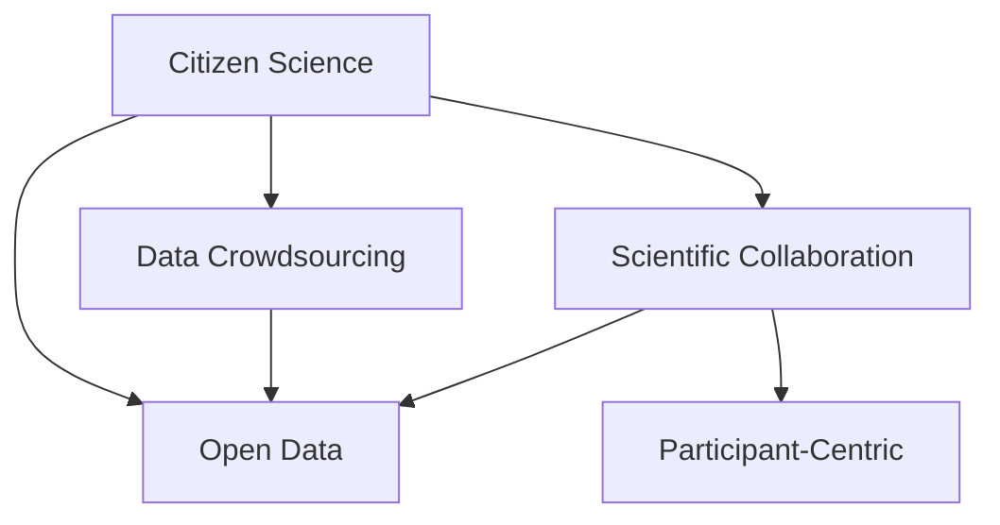

                 

# 公民科学：公众参与科学研究的新模式探索

> 关键词：公民科学, 科学合作, 数据众包, 公开数据, 公民参与, 科学项目

## 1. 背景介绍

### 1.1 问题由来
随着科技的迅速发展，科学研究正面临着前所未有的挑战与机遇。一方面，科研领域不断涌现的新技术和新问题，对科研人员的知识和技能提出了更高要求；另一方面，数据的爆炸性增长和复杂性，使得传统科研模式难以应对。为了应对这些挑战，科研领域亟需新的研究方法和合作机制。公民科学（Citizen Science）作为一种新兴的研究模式，近年来得到了广泛关注和应用。

公民科学指的是将公众参与到科学研究和数据收集中，借助互联网平台和开放数据，鼓励非专业科研人员参与科研活动。这种方式不仅拓宽了科研的边界，也带来了更多元化的研究视角和数据来源。

### 1.2 问题核心关键点
公民科学的核心关键点包括：
- **参与者**：来自不同背景的非专业科研人员。
- **平台**：互联网平台和开放数据，用于数据收集、数据共享和协作交流。
- **目标**：提升科学研究的质量和效率，发现新知识，解决实际问题。
- **应用领域**：生态监测、气候变化、天文学、社会科学等。

## 2. 核心概念与联系

### 2.1 核心概念概述

为更好地理解公民科学的研究模式，本节将介绍几个关键概念：

- **公民科学（Citizen Science）**：指公众参与到科学研究和数据收集中的科研模式。公众通过在线平台参与科学项目，贡献自己的数据和劳动。
- **科学合作（Scientific Collaboration）**：指不同领域和背景的科研人员共同合作，分享知识和数据，协作完成科研任务。
- **数据众包（Data Crowdsourcing）**：指通过互联网平台，将数据收集和标注任务分配给大众，形成大规模的众包数据集。
- **开放数据（Open Data）**：指科研数据公开共享，任何人都可以免费使用、修改和再发布。
- **参与者中心（Participant-Centric）**：指以参与者的需求和兴趣为中心，设计科研活动，鼓励公众积极参与。

这些概念之间的逻辑关系可以通过以下Mermaid流程图来展示：



这个流程图展示了几者之间的联系：

1. 公民科学通过科学合作和数据众包，充分利用开放数据资源。
2. 科学合作促进了数据的共享和参与者之间的协作。
3. 数据众包和开放数据为公众参与提供了基础平台。
4. 参与者中心设计鼓励公众积极参与。

## 3. 核心算法原理 & 具体操作步骤
### 3.1 算法原理概述

公民科学的研究模式基于公开数据和网络平台，其核心算法原理可以概括为：
- **数据收集**：通过互联网平台，将数据收集任务分配给公众。
- **数据标注**：利用众包平台，让公众对数据进行标注和验证。
- **数据分析**：通过科研人员和公众共同分析，提升数据分析的效率和质量。
- **知识共享**：公开科研成果和数据，促进科研知识共享和应用。

### 3.2 算法步骤详解

公民科学的算法步骤一般包括以下几个关键步骤：

**Step 1: 项目设计与任务发布**
- 确定研究目标和科学问题。
- 设计合适的数据收集和标注任务。
- 在公开平台发布任务，吸引公众参与。

**Step 2: 参与者招募与注册**
- 设计激励机制，吸引非专业科研人员参与。
- 提供注册和培训，提高参与者能力。
- 分配任务，并提供必要的技术支持。

**Step 3: 数据收集与标注**
- 公众通过平台提交数据和标注结果。
- 科研人员审核和验证标注结果。
- 数据分析师进行初步分析，筛选高质量数据。

**Step 4: 数据共享与协作**
- 将数据集公开共享，便于其他科研人员使用。
- 科研人员和公众共同分析数据，挖掘新知识。
- 利用协作工具，如在线论坛、项目管理工具，促进交流协作。

**Step 5: 成果展示与反馈**
- 公开科研成果，展示公众参与的贡献。
- 收集公众反馈，改进科研活动。
- 扩展项目，吸引更多公众参与。

以上是公民科学研究的一般流程。在实际应用中，还需要针对具体项目的特点，对各个环节进行优化设计，如改进任务设计，引入更多的激励机制，搜索最优的激励策略等，以进一步提升公众参与度和数据质量。

### 3.3 算法优缺点

公民科学的算法具有以下优点：
1. 提高数据质量。利用大量公众参与的数据标注，可以显著提升数据集的质量。
2. 扩大科研范围。将科研活动扩展到非专业领域，形成更广泛的研究视角。
3. 促进知识共享。通过开放数据和协作平台，科研人员和公众可以共同推进科学知识的发展。
4. 降低科研成本。公众参与分担了部分科研工作，降低了科研成本。

同时，该算法也存在一定的局限性：
1. 参与者能力不一。非专业科研人员的参与可能存在数据标注不准确等问题。
2. 数据收集和分析依赖公众。公众的参与度和质量直接决定了数据集的价值。
3. 激励机制复杂。需要设计合理的激励机制，吸引公众长期参与。
4. 数据隐私保护。需要确保公众提交数据的隐私和安全，避免数据滥用。

尽管存在这些局限性，但公民科学作为一种新兴的科研模式，仍具有广泛的应用前景。未来相关研究的重点在于如何进一步提高公众参与的积极性和数据质量，同时兼顾数据隐私保护和激励机制的合理设计。

### 3.4 算法应用领域

公民科学的算法已经在多个领域得到了广泛的应用，例如：

- **生态监测**：利用手机或相机记录植物、动物、水质等生态信息，公众通过平台上传数据，科研人员进行数据分析和模型建立。
- **气候变化**：通过互联网平台收集公众对极端天气事件的记录和反馈，科研人员分析数据，研究气候变化趋势。
- **天文学**：利用公众望远镜记录天体数据，科研人员进行数据分析，发现新的天文现象。
- **社会科学**：通过在线调查或众包平台，收集公众对社会现象的看法和数据，科研人员进行社会学研究。

除了上述这些经典领域外，公民科学的应用范围还覆盖了更多场景，如健康监测、城市规划、农业生产等，为各领域的研究提供了新的数据来源和方法。随着技术的发展和公众参与意识的提高，公民科学的潜力将进一步释放，在更多领域中发挥重要作用。

## 4. 数学模型和公式 & 详细讲解  
### 4.1 数学模型构建

本节将使用数学语言对公民科学的数据收集和分析过程进行更加严格的刻画。

设公民科学项目中，公众提交的数据为 $D=\{(x_i,y_i)\}_{i=1}^N, x_i \in \mathcal{X}, y_i \in \mathcal{Y}$。假设数据标注任务为 $T$，即公众需要为每个数据点标注标签 $y_i$。

定义标注任务 $T$ 的标注函数为 $\mathcal{A}$，公众提交的标注结果为 $\hat{y}_i=\mathcal{A}(x_i)$。科研人员对 $\hat{y}_i$ 进行验证，得到标注正确率 $\epsilon$，即 $\hat{y}_i=y_i$ 的概率。

模型的目标是最小化标注错误率 $\epsilon$，即找到最优的标注函数 $\mathcal{A}$：

$$
\epsilon^* = \mathop{\arg\min}_{\mathcal{A}} \mathbb{E}[\mathcal{L}(\mathcal{A},D)]
$$

其中 $\mathbb{E}[\mathcal{L}(\mathcal{A},D)]$ 为标注函数 $\mathcal{A}$ 在数据集 $D$ 上的期望损失函数，$\mathcal{L}$ 为标注错误损失函数，一般定义为二元分类交叉熵损失。

### 4.2 公式推导过程

以下我们以二分类任务为例，推导标注函数 $\mathcal{A}$ 的损失函数及其梯度的计算公式。

假设模型 $M_{\theta}$ 在输入 $x$ 上的输出为 $\hat{y}=M_{\theta}(x) \in [0,1]$，表示样本属于正类的概率。公众提交的标注结果为 $\hat{y}_i$，科研人员对 $\hat{y}_i$ 进行验证，得到标注正确率 $\epsilon$。

标注函数 $\mathcal{A}$ 的损失函数定义为：

$$
\ell(\mathcal{A},D) = -\frac{1}{N}\sum_{i=1}^N \log \epsilon_i
$$

其中 $\epsilon_i$ 为第 $i$ 个样本的标注正确率。将其代入期望损失函数，得：

$$
\mathbb{E}[\mathcal{L}(\mathcal{A},D)] = -\frac{1}{N}\sum_{i=1}^N \mathbb{E}[\log \epsilon_i]
$$

通过链式法则，标注函数 $\mathcal{A}$ 的梯度为：

$$
\frac{\partial \mathbb{E}[\mathcal{L}(\mathcal{A},D)]}{\partial \theta_k} = -\frac{1}{N}\sum_{i=1}^N \frac{\partial \log \epsilon_i}{\partial \theta_k}
$$

其中 $\frac{\partial \log \epsilon_i}{\partial \theta_k}$ 为标注函数 $\mathcal{A}$ 对模型参数 $\theta_k$ 的梯度，可通过反向传播算法高效计算。

在得到损失函数的梯度后，即可带入优化算法，完成模型的迭代优化。重复上述过程直至收敛，最终得到最优的标注函数 $\mathcal{A}^*$。

### 4.3 案例分析与讲解

假设一个生态监测项目，公众通过手机应用记录植物、动物和水质信息，科研人员对公众提交的数据进行标注和分析。该项目可以设计以下步骤：

**Step 1: 项目设计与任务发布**
- 确定研究目标，如监测区域内动植物分布和环境变化。
- 设计数据收集和标注任务，如拍照、记录物种和环境数据。
- 在公开平台发布任务，提供详细的操作指南和激励机制。

**Step 2: 参与者招募与注册**
- 设计激励机制，如积分、荣誉证书等，吸引公众参与。
- 提供在线培训，提高公众的数据标注能力。
- 分配数据收集和标注任务，提供技术支持。

**Step 3: 数据收集与标注**
- 公众通过手机应用上传数据和标注结果。
- 科研人员对标注结果进行审核和验证，筛选高质量数据。
- 利用数据标注平台，对公众标注结果进行多轮标注和验证，确保数据质量。

**Step 4: 数据共享与协作**
- 将数据集公开共享，提供API接口供其他科研人员使用。
- 科研人员和公众共同分析数据，利用协作工具，如在线论坛、项目管理工具，促进交流协作。
- 定期发布研究报告和论文，展示公众参与的贡献。

**Step 5: 成果展示与反馈**
- 公开科研成果，展示公众参与的贡献和数据集价值。
- 收集公众反馈，改进科研活动和数据标注方法。
- 扩展项目，吸引更多公众参与，形成良性循环。

## 5. 项目实践：代码实例和详细解释说明
### 5.1 开发环境搭建

在进行公民科学项目开发前，我们需要准备好开发环境。以下是使用Python进行Flask开发的环境配置流程：

1. 安装Anaconda：从官网下载并安装Anaconda，用于创建独立的Python环境。

2. 创建并激活虚拟环境：
```bash
conda create -n citizen-science python=3.8 
conda activate citizen-science
```

3. 安装Flask：
```bash
pip install flask
```

4. 安装各类工具包：
```bash
pip install numpy pandas scikit-learn matplotlib tqdm jupyter notebook ipython
```

完成上述步骤后，即可在`citizen-science`环境中开始公民科学项目的开发。

### 5.2 源代码详细实现

下面我们以生态监测项目为例，给出使用Flask进行数据收集和标注的Python代码实现。

首先，定义数据收集和标注的API接口：

```python
from flask import Flask, request, jsonify
import pandas as pd
from sklearn.metrics import accuracy_score

app = Flask(__name__)

@app.route('/submit_data', methods=['POST'])
def submit_data():
    data = request.json
    # 解析数据，提取数据点和标签
    species = data.get('species')
    location = data.get('location')
    timestamp = data.get('timestamp')
    label = data.get('label')
    
    # 将数据保存到本地或数据库
    save_data(data)
    
    # 统计数据标注正确率
    correct_count = count_correct_labels(label)
    total_count = count_all_labels(label)
    accuracy = accuracy_score(correct_count, total_count)
    
    # 返回标注正确率
    return jsonify({'accuracy': accuracy})
    
@app.route('/data_stats', methods=['GET'])
def get_data_stats():
    # 统计标注正确率和数据集规模
    correct_count = count_correct_labels()
    total_count = count_all_labels()
    accuracy = accuracy_score(correct_count, total_count)
    
    # 返回统计结果
    return jsonify({'correct_count': correct_count, 'total_count': total_count, 'accuracy': accuracy})
```

然后，定义数据保存和标注结果统计函数：

```python
import os
import pandas as pd

def save_data(data):
    # 将数据保存到本地或数据库
    df = pd.DataFrame(data)
    df.to_csv('data.csv', index=False)
    
def count_correct_labels(label):
    # 统计标注正确的标签数量
    correct_count = sum(label == label)
    return correct_count
    
def count_all_labels(label):
    # 统计标注总数
    total_count = len(label)
    return total_count
```

最后，启动Flask应用并测试：

```python
if __name__ == '__main__':
    app.run(debug=True)
```

以上就是使用Flask对公民科学项目进行数据收集和标注的完整代码实现。可以看到，通过Flask开发的API接口，公民科学项目可以方便地接受公众提交的数据和标注结果，并进行统计分析。

### 5.3 代码解读与分析

让我们再详细解读一下关键代码的实现细节：

**Flask API接口**：
- `submit_data` 函数：接收公众提交的数据和标注结果，将数据保存到本地或数据库，并统计标注正确率，返回标注正确率。
- `get_data_stats` 函数：统计数据标注正确率和数据集规模，返回统计结果。

**数据保存和统计函数**：
- `save_data` 函数：将公众提交的数据保存到本地或数据库。
- `count_correct_labels` 函数：统计标注正确的标签数量。
- `count_all_labels` 函数：统计标注总数。

通过这些API接口和函数，公众可以通过简单的HTTP请求，方便地参与到数据收集和标注中，科研人员可以实时统计数据标注结果，提升数据质量和研究效率。

当然，工业级的系统实现还需考虑更多因素，如用户身份验证、数据加密、分布式存储等。但核心的公民科学开发流程基本与此类似。

## 6. 实际应用场景
### 6.1 环境监测

公民科学在环境监测领域有着广泛的应用，可以帮助科研人员实时获取环境数据，提升环境监测的准确性和效率。

例如，利用手机应用记录空气质量、水质、噪音等信息，公众通过平台提交数据，科研人员对数据进行分析和建模。公民科学项目可以设计以下步骤：

**Step 1: 项目设计与任务发布**
- 确定研究目标，如监测空气质量、水质和噪音污染。
- 设计数据收集和标注任务，如拍照、记录数值和声音。
- 在公开平台发布任务，提供详细的操作指南和激励机制。

**Step 2: 参与者招募与注册**
- 设计激励机制，如积分、荣誉证书等，吸引公众参与。
- 提供在线培训，提高公众的数据标注能力。
- 分配数据收集和标注任务，提供技术支持。

**Step 3: 数据收集与标注**
- 公众通过手机应用上传数据和标注结果。
- 科研人员对标注结果进行审核和验证，筛选高质量数据。
- 利用数据标注平台，对公众标注结果进行多轮标注和验证，确保数据质量。

**Step 4: 数据共享与协作**
- 将数据集公开共享，提供API接口供其他科研人员使用。
- 科研人员和公众共同分析数据，利用协作工具，如在线论坛、项目管理工具，促进交流协作。
- 定期发布研究报告和论文，展示公众参与的贡献。

**Step 5: 成果展示与反馈**
- 公开科研成果，展示公众参与的贡献和数据集价值。
- 收集公众反馈，改进科研活动和数据标注方法。
- 扩展项目，吸引更多公众参与，形成良性循环。

通过公民科学，环境监测项目可以收集到大量的公众数据，形成更全面、准确的环境监测结果。这些数据不仅有助于科研人员开展研究工作，也能为政府和企业决策提供参考。

### 6.2 社会调查

公民科学在社会科学研究中也具有重要应用，可以获取公众对社会现象的看法和数据，进行社会调查分析。

例如，利用在线调查工具，收集公众对某项政策的支持度和态度。公众通过平台提交调查结果，科研人员对结果进行分析和建模。公民科学项目可以设计以下步骤：

**Step 1: 项目设计与任务发布**
- 确定研究目标，如调查公众对某项政策的支持度。
- 设计数据收集和标注任务，如在线问卷、情感评分等。
- 在公开平台发布任务，提供详细的操作指南和激励机制。

**Step 2: 参与者招募与注册**
- 设计激励机制，如积分、荣誉证书等，吸引公众参与。
- 提供在线培训，提高公众的问卷填写能力。
- 分配调查任务，提供技术支持。

**Step 3: 数据收集与标注**
- 公众通过在线调查平台提交调查结果。
- 科研人员对调查结果进行审核和验证，筛选高质量数据。
- 利用数据标注平台，对公众调查结果进行多轮标注和验证，确保数据质量。

**Step 4: 数据共享与协作**
- 将调查结果公开共享，提供API接口供其他科研人员使用。
- 科研人员和公众共同分析数据，利用协作工具，如在线论坛、项目管理工具，促进交流协作。
- 定期发布研究报告和论文，展示公众参与的贡献。

**Step 5: 成果展示与反馈**
- 公开科研成果，展示公众参与的贡献和数据集价值。
- 收集公众反馈，改进科研活动和数据标注方法。
- 扩展项目，吸引更多公众参与，形成良性循环。

通过公民科学，社会科学研究可以收集到大量的公众数据，形成更全面、准确的社会调查结果。这些数据不仅有助于科研人员开展研究工作，也能为政府和企业决策提供参考。

### 6.3 未来应用展望

随着技术的进步和公众参与意识的提高，公民科学的应用范围将进一步扩大，为科学研究带来更多的机遇和挑战。

1. **多模态数据融合**：未来公民科学项目可以整合多模态数据，如文本、图像、声音等，提升研究数据的全面性和准确性。例如，通过公众提交的照片和视频，结合文本标注结果，进行更深入的环境监测和事件分析。

2. **实时数据流处理**：利用物联网设备和互联网平台，实现实时数据流处理，提升数据收集和分析的效率。例如，利用传感器和手机应用，实时监测环境变化和公众行为，进行实时数据分析和预测。

3. **人工智能辅助**：引入人工智能技术，如机器学习和深度学习，提升数据标注和分析的自动化水平。例如，利用模型预测和标注，减少公众的标注工作量，提高数据标注的准确性。

4. **隐私保护机制**：在公众数据收集和标注过程中，引入隐私保护机制，确保数据的安全和隐私。例如，采用匿名化处理、数据加密等技术，保护参与者的隐私。

5. **开放数据平台**：构建开放数据平台，促进科研数据的共享和利用。例如，利用公共云平台，提供数据共享API接口，方便其他科研人员使用。

这些技术手段的引入，将进一步推动公民科学的发展，提升科研数据的全面性和可用性，为科学研究带来更多的机遇和挑战。

## 7. 工具和资源推荐
### 7.1 学习资源推荐

为了帮助开发者系统掌握公民科学的研究方法和工具，这里推荐一些优质的学习资源：

1. **《公民科学入门与实践》系列博文**：由大模型技术专家撰写，深入浅出地介绍了公民科学的概念、方法和应用。

2. **Coursera《公民科学与数据众包》课程**：提供公民科学和数据众包的理论和实践知识，涵盖数据收集、标注、分析和项目管理等内容。

3. **Open Science Framework（OSF）**：提供开放科研平台，支持科研项目的公开共享和协作，是公民科学项目的理想平台。

4. **CrowdFlower**：提供数据标注和众包平台，支持大规模数据标注和任务分配，是公民科学项目的有效工具。

5. **Data Science Dojo**：提供在线学习平台，提供公民科学和数据众包的教程和案例，帮助开发者掌握相关技术。

通过对这些资源的学习实践，相信你一定能够快速掌握公民科学的精髓，并用于解决实际的科学研究问题。
###  7.2 开发工具推荐

高效的开发离不开优秀的工具支持。以下是几款用于公民科学项目开发的常用工具：

1. **Flask**：轻量级的Python Web框架，简单易用，适合快速迭代研究。
2. **TensorFlow**：Google开发的深度学习框架，支持分布式计算，适合大规模数据处理。
3. **Scikit-learn**：Python科学计算库，提供丰富的机器学习算法，适合数据标注和分析。
4. **Jupyter Notebook**：交互式开发环境，支持代码编辑和运行，适合科研协作和数据可视化。
5. **GitLab**：代码管理平台，支持版本控制和协作，适合团队协作开发。

合理利用这些工具，可以显著提升公民科学项目的开发效率，加快创新迭代的步伐。

### 7.3 相关论文推荐

公民科学的理论基础和实践方法还在不断探索中，以下是几篇奠基性的相关论文，推荐阅读：

1. **《Crowdsourcing in the Lab》**：该论文详细介绍了数据众包技术在科学实验中的应用，提供了大量实际案例和经验总结。

2. **《Crowdsourcing Public Participation in Scientific Research》**：该论文探讨了公民科学在生态、环境、社会科学等领域的广泛应用，提供了系统的研究方法和应用案例。

3. **《Citizen Science: Evaluating a Common-Sense Psychometric Model of Data Collection》**：该论文提出了一种用于评估公众数据收集质量的模型，探讨了数据标注的正确性和可靠性。

4. **《The Citizen Science Survey: Public Engagement in Scientific Research》**：该论文分析了公民科学在社会调查中的应用，提出了多轮标注和反馈机制，提高了数据标注的质量。

这些论文代表了大公民科学的发展脉络。通过学习这些前沿成果，可以帮助研究者把握学科前进方向，激发更多的创新灵感。

## 8. 总结：未来发展趋势与挑战

### 8.1 总结

本文对公民科学的研究模式进行了全面系统的介绍。首先阐述了公民科学的背景和核心关键点，明确了公民科学在提升科学研究质量、促进数据共享等方面的独特价值。其次，从原理到实践，详细讲解了公民科学的数学模型和关键步骤，给出了公民科学项目的完整代码实例。同时，本文还广泛探讨了公民科学在环境监测、社会调查等多个领域的应用前景，展示了公民科学的广阔应用空间。此外，本文精选了公民科学的学习资源、开发工具和相关论文，力求为读者提供全方位的技术指引。

通过本文的系统梳理，可以看到，公民科学作为一种新兴的研究模式，正在逐步成为科研领域的重要范式，为科学研究带来了新的思路和方法。公民科学不仅拓宽了科研的边界，还为公众参与科研活动提供了新的途径，推动了科学知识的共享和传播。未来，随着技术的不断进步和公众参与意识的提高，公民科学必将在更多领域中发挥重要作用。

### 8.2 未来发展趋势

展望未来，公民科学的趋势如下：

1. **多模态数据融合**：公民科学项目将进一步整合多模态数据，提升数据全面性和准确性。
2. **实时数据流处理**：利用物联网设备和互联网平台，实现实时数据收集和分析。
3. **人工智能辅助**：引入人工智能技术，提升数据标注和分析的自动化水平。
4. **隐私保护机制**：在公众数据收集和标注过程中，引入隐私保护机制，确保数据安全。
5. **开放数据平台**：构建开放数据平台，促进科研数据的共享和利用。

这些趋势将进一步推动公民科学的发展，提升科研数据的全面性和可用性，为科学研究带来更多的机遇和挑战。

### 8.3 面临的挑战

尽管公民科学具有广阔的应用前景，但在实践中也面临着诸多挑战：

1. **数据质量保证**：公众数据标注质量不一，难以保证数据准确性。
2. **参与者积极性**：需要设计合理的激励机制，吸引公众长期参与。
3. **隐私保护问题**：公众数据的隐私和安全问题亟需解决。
4. **技术复杂性**：需要综合运用多种技术手段，提升项目实施的效率和效果。
5. **科研合作难度**：不同领域和背景的科研人员协作，需要协调多方利益，形成高效的工作机制。

尽管存在这些挑战，但公民科学作为一种新兴的研究模式，仍具有广泛的应用前景。未来相关研究的重点在于如何进一步提高公众参与的积极性和数据质量，同时兼顾数据隐私保护和激励机制的合理设计。

### 8.4 研究展望

未来，公民科学的研究将在以下几个方面寻求新的突破：

1. **多模态数据融合方法**：探索多种数据类型的有效整合方式，提升数据全面性和准确性。
2. **实时数据流处理技术**：研究高效的数据收集和分析技术，实现实时数据流处理。
3. **人工智能辅助工具**：开发智能化的数据标注和分析工具，提升数据标注的自动化水平。
4. **隐私保护机制**：引入隐私保护技术，确保公众数据的安全和隐私。
5. **开放数据平台**：构建开放数据平台，促进科研数据的共享和利用。

这些研究方向将推动公民科学技术的进一步发展，为科学研究带来更多的机遇和挑战。

## 9. 附录：常见问题与解答

**Q1：公民科学是否可以应用于所有科研领域？**

A: 公民科学在环境监测、社会调查、天文学等领域有着广泛的应用，但在某些特定领域，如医学、法律等，可能难以直接应用。此时需要在特定领域语料上进一步预训练，再进行微调，才能获得理想效果。此外，对于一些需要时效性、个性化很强的任务，如对话、推荐等，微调方法也需要针对性的改进优化。

**Q2：如何设计合理的激励机制，吸引公众长期参与？**

A: 设计合理的激励机制是公民科学成功的关键之一。激励机制应包括以下几个方面：
1. 经济奖励：如积分、红包、奖金等，提供实际的经济激励。
2. 荣誉认证：如荣誉证书、徽章等，提升公众的参与感和成就感。
3. 社会认可：如在社交媒体上展示公众贡献，提升公众的社交地位。
4. 知识分享：如提供科研报告、学术文章等，分享公众的科研成果。

这些激励机制可以灵活组合，设计出适合不同项目和公众群体的激励方案。

**Q3：如何在公众数据收集和标注过程中，保护公众的隐私和安全？**

A: 数据隐私保护是公民科学的重要挑战之一。保护公众数据隐私和安全，需要采取以下措施：
1. 匿名化处理：对公众数据进行匿名化处理，去除个人标识信息。
2. 数据加密：对公众数据进行加密存储和传输，防止数据泄露。
3. 访问控制：对公众数据进行访问控制，确保只有授权人员才能访问和使用数据。
4. 隐私政策：制定明确的数据隐私政策，告知公众数据的收集和使用方式。

通过这些措施，可以有效保护公众的隐私和安全，确保公众数据的合法使用。

**Q4：如何在数据标注过程中，确保数据标注的准确性和可靠性？**

A: 数据标注的准确性和可靠性是公民科学项目成功的关键之一。确保数据标注质量，需要采取以下措施：
1. 多轮标注：通过多轮标注和审核，确保数据标注的正确性。
2. 标注指导：提供详细的标注指南和培训，提升公众的标注能力。
3. 结果验证：对标注结果进行验证和纠错，确保数据标注的可靠性。
4. 标注平台：利用标注平台，对公众标注结果进行管理，跟踪标注进度。

通过这些措施，可以有效提高数据标注的准确性和可靠性，提升数据质量。

**Q5：如何构建开放数据平台，促进科研数据的共享和利用？**

A: 开放数据平台是公民科学的重要基础设施，可以通过以下步骤构建：
1. 平台设计：设计开放数据平台的功能和架构，支持数据上传、共享、下载和分析。
2. 数据管理：对公众数据进行管理和存储，提供数据查询和访问接口。
3. 数据共享：制定明确的数据共享政策，确保数据的合法使用和共享。
4. 社区建设：构建科研社区，促进科研人员和公众的交流和协作。

通过这些措施，可以有效构建开放数据平台，促进科研数据的共享和利用。

---

作者：禅与计算机程序设计艺术 / Zen and the Art of Computer Programming

