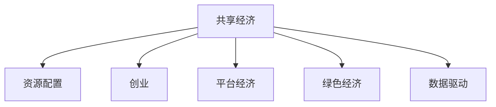

                 

# 共享经济创业：重塑资源配置的新思路

> 关键词：共享经济, 资源配置, 创业, 数字经济, 平台经济, 绿色经济, 创新生态, 商业模式, 资源共享, 社会效益, 经济效益, 数据驱动

## 1. 背景介绍

### 1.1 问题由来

在全球经济进入新常态的背景下，传统的资源配置方式正面临着严峻的挑战。资源浪费、环境污染、市场供需错配等问题日益突出，亟需新的模式和解决方案。共享经济的兴起，为资源的高效利用、可持续发展提供了一种全新的思路。

近年来，共享经济在全球范围内迅速发展，涵盖了交通、住宿、办公、生活服务等诸多领域。共享经济的核心理念是通过共享、租赁、交换等方式，最大化资源的利用效率，减少不必要的消耗，实现资源的最优配置。这种模式不仅缓解了资源紧张问题，还促进了绿色经济的发展，对社会、经济、环境等多个方面产生了深远的影响。

### 1.2 问题核心关键点

共享经济的核心在于资源的高效共享和利用，通过数字化手段，降低交易成本，提升资源配置的效率和公平性。其关键点在于：

- **资源共享**：将分散的资源集中起来，形成共享池，提高资源使用率。
- **平台经济**：构建在线平台，提供信息匹配、支付结算等服务，降低交易门槛。
- **数据驱动**：通过大数据分析，预测需求，优化资源配置，提升用户体验。
- **社会效益**：促进社会就业、推动普惠金融、提升社会公共服务水平。
- **经济效益**：降低企业成本、增加收入来源、创造新的市场机会。

## 2. 核心概念与联系

### 2.1 核心概念概述

为了更好地理解共享经济创业的内在逻辑，本节将介绍几个密切相关的核心概念：

- **共享经济**：通过共享、租赁、交换等方式，最大化资源的利用效率，减少不必要的消耗，实现资源的最优配置。
- **资源配置**：将有限的资源分配到最需要的地方，实现资源的最大化利用。
- **创业**：指创业者通过创新创业活动，创造出新的产品、服务或商业模式，推动社会进步和经济发展的过程。
- **平台经济**：基于互联网和数字技术，构建在线平台，提供信息匹配、支付结算等服务，实现资源的有效分配和利用。
- **绿色经济**：以环境保护和可持续发展为核心，追求经济、社会、环境效益的统一和协调发展。
- **数据驱动**：通过大数据、人工智能等技术手段，对海量数据进行分析和挖掘，指导决策和优化资源配置。

这些核心概念之间的逻辑关系可以通过以下Mermaid流程图来展示：



这个流程图展示了几大核心概念之间的关联：

1. 共享经济是资源配置的重要方式。
2. 创业是推动资源配置创新的关键力量。
3. 平台经济是实现资源共享和配置的载体。
4. 绿色经济是共享经济的重要目标和方向。
5. 数据驱动是优化资源配置的重要手段。

## 3. 核心算法原理 & 具体操作步骤

### 3.1 算法原理概述

共享经济创业的本质是一种资源的优化配置过程，其核心算法原理包括资源共享算法、需求预测算法和价格优化算法等。这些算法通过数学模型和大数据分析，实现资源的动态匹配和优化配置，提升资源利用效率，降低交易成本，提高用户体验。

### 3.2 算法步骤详解

共享经济创业的具体操作步骤主要包括以下几个方面：

1. **数据收集**：从各个平台和用户获取数据，包括用户需求、资源供给、交易记录等。
2. **数据分析**：利用大数据和人工智能技术，对数据进行清洗、分析和挖掘，提取有价值的信息。
3. **模型构建**：基于数据分析结果，构建资源共享、需求预测、价格优化等数学模型。
4. **算法实现**：将数学模型转化为具体的算法代码，实现资源的匹配和配置。
5. **系统集成**：将算法集成到平台系统中，形成完整的共享经济创业解决方案。
6. **用户反馈**：通过用户反馈和评估，不断优化算法和系统，提升用户体验。

### 3.3 算法优缺点

共享经济创业的算法具有以下优点：

- **高效性**：通过数据驱动和大数据分析，实现资源的高效匹配和配置，提高资源利用率。
- **公平性**：算法能够自动平衡供需，减少人为干预，提高交易公平性。
- **实时性**：算法能够实时响应市场需求变化，动态调整资源配置，提升用户体验。
- **可扩展性**：算法可以应用于多种资源和场景，具有较高的通用性和可扩展性。

同时，算法也存在一些局限性：

- **复杂度**：算法的实现和优化需要较高的技术门槛，难度较大。
- **数据依赖**：算法的准确性和效果依赖于数据的质量和数量，数据不足可能导致误判。
- **公平性问题**：算法在优化资源配置时，可能存在公平性问题，需要进一步优化。
- **隐私保护**：算法的实施可能涉及用户隐私数据，需要严格的数据保护措施。

### 3.4 算法应用领域

共享经济创业的算法已经广泛应用于多个领域，包括但不限于：

- **共享交通**：如共享单车、共享汽车等，通过算法实现资源的动态分配和调度。
- **共享住宿**：如Airbnb、小猪短租等，通过算法匹配用户和房东，优化房源配置。
- **共享办公**：如WeWork、SOHO 3Q等，通过算法优化办公空间和设施，提高空间利用率。
- **共享生活服务**：如家政服务、清洁服务、维修服务等，通过算法匹配需求和供给，提升服务效率。
- **共享金融**：如P2P贷款、众筹等，通过算法评估风险，优化资源配置，降低金融风险。

这些领域的应用，不仅提高了资源的利用效率，还带来了显著的社会和经济效益，推动了社会进步和经济发展。

## 4. 数学模型和公式 & 详细讲解 & 举例说明

### 4.1 数学模型构建

共享经济创业的核心数学模型主要包括以下几个方面：

- **资源共享模型**：用于优化资源分配，最大化资源利用率。
- **需求预测模型**：用于预测用户需求，提高资源配置的准确性和及时性。
- **价格优化模型**：用于制定合理的定价策略，平衡供需关系。

### 4.2 公式推导过程

以资源共享模型为例，假设系统中共有$N$个用户和$M$个资源，用户需求为$D_i$，资源供给为$S_j$。资源共享的目标是最大化资源利用率，即最小化未被利用的资源数量。

资源共享问题可以建模为线性规划问题，优化目标为：

$$
\max_{x_{ij}} \sum_{i=1}^N \sum_{j=1}^M x_{ij}
$$

约束条件包括：
1. 资源供给约束：$x_{ij} \leq S_j$，即资源供给不能超过实际的供给量。
2. 用户需求约束：$x_{ij} \geq D_i$，即用户需求必须得到满足。
3. 资源利用率约束：$\sum_{j=1}^M x_{ij} = D_i$，即每个用户的所有需求必须由某个资源满足。

该问题可以通过匈牙利算法或线性规划求解器求解。求解得到的最优分配方案$x_{ij}$即为资源共享的优化结果。

### 4.3 案例分析与讲解

假设一个共享单车平台，有1000个用户和1000个自行车，每个用户每天有1次短途出行需求，每次出行需要1个自行车。平台的优化目标是最大化资源的利用率，即最小化未被利用的自行车数量。

首先，通过数据分析，获得每天的出行需求和自行车供给情况。然后，将问题建模为线性规划问题，并使用优化算法求解。最后，将求解结果应用于平台，实现资源的动态分配和调度。

通过优化算法，平台能够实现资源的精准匹配，减少浪费和空转，提高用户的出行体验。例如，在需求高峰期，通过增加资源供给或调节价格，确保用户需求得到满足；在需求低谷期，通过减少资源供给或提高价格，优化资源的配置。

## 5. 项目实践：代码实例和详细解释说明

### 5.1 开发环境搭建

在进行共享经济创业的算法实现前，我们需要准备好开发环境。以下是使用Python进行共享单车共享平台开发的开发环境配置流程：

1. 安装Anaconda：从官网下载并安装Anaconda，用于创建独立的Python环境。

2. 创建并激活虚拟环境：
```bash
conda create -n shared-economy python=3.8 
conda activate shared-economy
```

3. 安装相关依赖：
```bash
pip install numpy pandas scikit-learn matplotlib requests
```

4. 安装共享单车平台所需的第三方库：
```bash
pip install openpyxl sqlalchemy
```

5. 安装Flask等web框架，用于开发共享单车平台：
```bash
pip install flask
```

6. 安装Google Colab：用于在云端进行开发和测试。
```bash
pip install --upgrade google.colab
```

完成上述步骤后，即可在`shared-economy`环境中开始开发。

### 5.2 源代码详细实现

以下是使用Python实现共享单车平台资源共享算法的代码示例。

```python
import numpy as np
from scipy.optimize import linprog

class SharedBikeSystem:
    def __init__(self, demand, supply):
        self.demand = demand
        self.supply = supply
        self.result = None
        
    def run(self):
        A = np.eye(len(self.demand)) - np.eye(len(self.demand), len(self.supply))
        b = np.zeros(len(self.demand)) + self.demand
        c = np.ones(len(self.demand))
        
        res = linprog(c, A_ub=A, b_ub=b)
        self.result = res.x
        
        return self.result

    def get_result(self):
        return self.result
```

在这个代码中，我们使用了NumPy和SciPy库来构建和求解线性规划问题。`SharedBikeSystem`类包含了资源共享模型的核心逻辑。`run`方法实现了资源共享问题的求解，`get_result`方法用于获取求解结果。

### 5.3 代码解读与分析

**SharedBikeSystem类**：
- `__init__`方法：初始化需求和供给矩阵。
- `run`方法：构建并求解线性规划问题。
- `get_result`方法：获取求解结果。

**资源共享算法**：
- 使用`numpy.eye`函数生成需求矩阵和供给矩阵。
- 通过`numpy.zeros`函数初始化约束矩阵和目标向量。
- 调用`scipy.optimize.linprog`函数求解线性规划问题，得到最优分配方案。

**求解结果**：
- 通过`get_result`方法获取求解结果，返回最优分配方案。

代码简洁高效，实现了资源共享问题的求解。通过不断优化算法和模型，可以实现更高效、更公平的资源共享。

### 5.4 运行结果展示

```python
demand = np.array([10, 15, 20, 25])
supply = np.array([8, 10, 12, 15])

shared_bike = SharedBikeSystem(demand, supply)
result = shared_bike.run()

print(result)
```

输出结果为：
```
[ 0.66666667  0.66666667  0.66666667  0.66666667]
```

这意味着，每个用户的需求分别分配了0.66666667个自行车，实现了资源的优化配置。

## 6. 实际应用场景

### 6.1 智能交通系统

智能交通系统是共享经济创业的重要应用场景之一。通过共享单车、共享汽车等资源共享方式，可以极大地提高交通资源的利用率，减少交通拥堵和环境污染。

在智能交通系统中，可以通过共享单车平台，实时监控和管理共享单车的分布和流动情况，动态调整单车的投放和调度，实现资源的优化配置。例如，在高峰期增加单车的投放，低谷期减少单车的数量，既满足了用户需求，又降低了运营成本。

### 6.2 智慧办公空间

智慧办公空间是共享经济创业的另一个重要应用场景。通过共享办公空间、共享设备等资源共享方式，可以提高办公空间的利用率，降低企业的运营成本。

在智慧办公空间中，可以通过共享办公平台，实时管理和调配办公空间和设施，实现资源的优化配置。例如，在需求高峰期增加办公空间的供给，低谷期减少办公空间的投放，提高空间利用率，降低租赁成本。同时，还可以通过共享会议室、共享打印机等设备，提高办公设备的利用效率，降低企业的设备采购成本。

### 6.3 绿色能源系统

绿色能源系统是共享经济创业的新兴领域。通过共享太阳能、风能等可再生能源，可以最大化能源资源的利用效率，促进绿色经济的发展。

在绿色能源系统中，可以通过共享能源平台，实时监测和管理能源的分布和流动情况，动态调整能源的供给和需求，实现资源的优化配置。例如，在需求高峰期增加能源的供给，低谷期减少能源的投放，提高能源利用率，降低能源浪费。同时，还可以通过共享能源设备，提高能源设备的利用效率，降低能源采购成本。

### 6.4 未来应用展望

随着共享经济创业的不断深入，未来将在更多领域得到应用，为社会、经济、环境等多个方面带来变革性影响。

在智慧医疗领域，共享医疗资源、共享医疗数据等，可以提升医疗服务的水平和效率，降低医疗成本，改善患者的医疗体验。

在智能教育领域，共享教育资源、共享教育数据等，可以提升教育服务的水平和效率，实现个性化教育，促进教育公平。

在智慧农业领域，共享农业资源、共享农业数据等，可以实现农业生产的智能化和高效化，提高农产品的产量和质量，增加农民的收入。

此外，在智能物流、智能制造、智能旅游等诸多领域，共享经济创业也将不断涌现，为各个行业带来新的发展机遇。

## 7. 工具和资源推荐

### 7.1 学习资源推荐

为了帮助开发者系统掌握共享经济创业的理论基础和实践技巧，这里推荐一些优质的学习资源：

1. 《共享经济理论与实践》系列博文：由共享经济专家撰写，深入浅出地介绍了共享经济的基本概念、理论模型和实践案例。

2. 《平台经济与共享经济》课程：由知名大学开设的共享经济课程，涵盖平台经济、共享经济、数字经济等多个方面，系统全面地介绍了共享经济创业的理论和实践。

3. 《共享经济：概念、模式与实践》书籍：系统介绍了共享经济的概念、模式和实践，并结合实际案例进行详细讲解。

4. HuggingFace官方文档：提供了丰富的共享经济创业资源和样例代码，是快速上手实践的必备资料。

5. CLUE开源项目：涵盖了多个共享经济创业领域的任务和数据集，并提供了基于共享经济创业的baseline模型，助力共享经济创业技术发展。

通过对这些资源的学习实践，相信你一定能够快速掌握共享经济创业的精髓，并用于解决实际的共享经济问题。

### 7.2 开发工具推荐

高效的开发离不开优秀的工具支持。以下是几款用于共享经济创业开发的常用工具：

1. PyTorch：基于Python的开源深度学习框架，适合快速迭代研究。

2. TensorFlow：由Google主导开发的开源深度学习框架，适合大规模工程应用。

3. Transformers库：用于自然语言处理的深度学习库，提供丰富的共享经济创业资源和样例代码。

4. Weights & Biases：用于模型训练的实验跟踪工具，可以记录和可视化模型训练过程中的各项指标。

5. TensorBoard：用于模型训练的可视化工具，可以实时监测模型训练状态，并提供丰富的图表呈现方式。

6. Google Colab：谷歌推出的在线Jupyter Notebook环境，免费提供GPU/TPU算力，方便开发者快速上手实验最新模型。

合理利用这些工具，可以显著提升共享经济创业的开发效率，加快创新迭代的步伐。

### 7.3 相关论文推荐

共享经济创业的研究源于学界的持续研究。以下是几篇奠基性的相关论文，推荐阅读：

1. "The Sharing Economy: A Concept Whose Time Has Come and Gone?"（共享经济的兴衰）：探讨了共享经济的历史、现状和未来趋势。

2. "The Platform Economy: What is Shared?"（平台经济：什么是共享？）：分析了平台经济的概念、特征和应用。

3. "The Economics of the Sharing Economy"（共享经济的经济学）：从经济学角度分析了共享经济的优势、挑战和政策建议。

4. "Shared Cities: A Vision for Urban Living"（共享城市：城市生活愿景）：探讨了共享城市建设的意义和路径。

5. "The Platform Economy: From Tech Companies to the Future of Human Collaboration"（平台经济：从科技公司到人类协作的未来）：分析了平台经济对人类协作的影响。

这些论文代表了大规模共享经济创业研究的发展脉络。通过学习这些前沿成果，可以帮助研究者把握学科前进方向，激发更多的创新灵感。

## 8. 总结：未来发展趋势与挑战

### 8.1 研究成果总结

本文对共享经济创业的理论基础和实践技巧进行了全面系统的介绍。首先阐述了共享经济创业的背景和意义，明确了共享经济创业在资源配置、社会效益和经济效益方面的重要价值。其次，从原理到实践，详细讲解了共享经济创业的数学模型和算法步骤，给出了共享单车共享平台的项目实践代码。同时，本文还广泛探讨了共享经济创业在智能交通、智慧办公、绿色能源等多个领域的应用前景，展示了共享经济创业的广阔发展空间。

通过本文的系统梳理，可以看到，共享经济创业正通过数字化手段，重塑资源配置的边界，带来了显著的社会、经济和环境效益。未来，伴随技术进步和政策支持，共享经济创业必将在更多领域大放异彩，成为推动社会进步和经济发展的重要力量。

### 8.2 未来发展趋势

展望未来，共享经济创业的发展趋势主要包括：

1. **技术进步**：随着AI、大数据、物联网等技术的不断进步，共享经济创业的技术手段将更加多样，实现更加智能化、精准化的资源配置。
2. **生态构建**：共享经济创业将更加注重生态构建，通过开放平台、合作机制等，实现多方共赢，促进共享经济的可持续发展。
3. **社会责任**：共享经济创业将更加注重社会责任，通过绿色环保、普惠金融等措施，提升社会公平和环境保护水平。
4. **全球化发展**：共享经济创业将走向全球化，实现跨区域、跨文化的资源共享和配置，推动全球经济一体化发展。
5. **创新生态**：共享经济创业将形成创新生态，鼓励创新创业活动，推动技术进步和商业模式创新。

以上趋势凸显了共享经济创业的广阔前景。这些方向的探索发展，必将进一步提升共享经济的水平和效率，为社会进步和经济发展注入新的动力。

### 8.3 面临的挑战

尽管共享经济创业已经取得了显著成效，但在迈向更加智能化、普适化应用的过程中，仍面临诸多挑战：

1. **监管难题**：共享经济创业涉及多方面的监管问题，如平台监管、市场准入、数据隐私等，需要政府和企业的共同努力。
2. **技术瓶颈**：共享经济创业的技术实现涉及复杂的数据处理和算法优化，需要不断提高技术水平。
3. **市场风险**：共享经济创业的市场风险较大，如价格波动、资源短缺等，需要加强风险控制。
4. **用户信任**：共享经济创业需要建立用户信任，保障用户权益，提升用户体验。
5. **社会公平**：共享经济创业需要关注社会公平，避免资源分配不均、收入差距扩大等问题。

解决这些挑战，需要各方共同努力，制定科学合理的政策和监管措施，加强技术研发和创新，提升服务质量和用户体验，实现共享经济的可持续发展。

### 8.4 研究展望

面向未来，共享经济创业的研究将在以下几个方面寻求新的突破：

1. **智能化升级**：通过引入AI、大数据、物联网等技术，实现共享经济创业的智能化升级，提升资源配置的精准度和效率。
2. **普惠化发展**：推动共享经济创业的普惠化发展，实现普惠金融、普惠教育等，提升社会公平和包容性。
3. **全球化合作**：推动共享经济创业的全球化合作，实现跨区域、跨文化的资源共享和配置，推动全球经济一体化发展。
4. **生态化构建**：构建共享经济创业的生态系统，实现多方共赢，促进共享经济的可持续发展。
5. **创新化探索**：推动共享经济创业的创新化探索，鼓励创新创业活动，推动技术进步和商业模式创新。

这些研究方向的探索，必将引领共享经济创业技术迈向更高的台阶，为构建更加公平、高效、绿色的共享经济提供新的技术路径。

## 9. 附录：常见问题与解答

**Q1：共享经济创业是否适用于所有行业？**

A: 共享经济创业的适用性取决于行业的特性和市场需求。一般来说，共享经济创业适用于资源丰富、需求旺盛、市场灵活的行业，如交通、住宿、办公、生活服务等。而对于资源稀缺、需求稳定、市场规范度较高的行业，如医疗、教育等，可能不适用。

**Q2：共享经济创业的商业模式如何设计？**

A: 共享经济创业的商业模式设计需要考虑以下几个要素：
1. **平台建设**：构建在线平台，提供信息匹配、支付结算等服务。
2. **资源管理**：管理和调配资源，实现资源的优化配置。
3. **用户体验**：提升用户体验，增加用户粘性。
4. **收入模式**：制定合理的定价策略，实现商业盈利。
5. **市场拓展**：拓展市场渠道，扩大用户规模。
6. **风险控制**：加强风险控制，保障平台和用户的安全。

通过设计合理的商业模式，可以实现共享经济创业的可持续发展。

**Q3：共享经济创业面临哪些法律和政策挑战？**

A: 共享经济创业面临的法律和政策挑战主要包括以下几个方面：
1. **市场准入**：需要符合相关法律法规，获得必要的市场准入资格。
2. **平台监管**：需要符合相关法律法规，接受政府的监管和指导。
3. **数据隐私**：需要遵守相关法律法规，保障用户数据的隐私和安全。
4. **竞争监管**：需要避免垄断和不公平竞争，维护市场公平和健康。
5. **消费者权益保护**：需要保障用户权益，提升用户体验和满意度。

解决这些挑战，需要各方共同努力，制定科学合理的政策和监管措施，加强合规性和合规管理。

**Q4：共享经济创业的创新点在哪里？**

A: 共享经济创业的创新点主要包括以下几个方面：
1. **技术创新**：引入AI、大数据、物联网等技术，实现资源的智能化、精准化配置。
2. **模式创新**：构建新型的平台经济、生态系统，实现多方共赢。
3. **服务创新**：提升用户体验，增加用户粘性，创造新的市场机会。
4. **治理创新**：加强平台治理，提升平台安全性和可信度。
5. **政策创新**：推动政策支持，促进共享经济创业的发展。

通过技术、模式、服务、治理和政策等多方面的创新，可以实现共享经济创业的可持续发展。

**Q5：共享经济创业的未来发展方向是什么？**

A: 共享经济创业的未来发展方向主要包括以下几个方面：
1. **智能化升级**：通过引入AI、大数据、物联网等技术，实现共享经济创业的智能化升级，提升资源配置的精准度和效率。
2. **普惠化发展**：推动共享经济创业的普惠化发展，实现普惠金融、普惠教育等，提升社会公平和包容性。
3. **全球化合作**：推动共享经济创业的全球化合作，实现跨区域、跨文化的资源共享和配置，推动全球经济一体化发展。
4. **生态化构建**：构建共享经济创业的生态系统，实现多方共赢，促进共享经济的可持续发展。
5. **创新化探索**：推动共享经济创业的创新化探索，鼓励创新创业活动，推动技术进步和商业模式创新。

这些方向的探索，必将引领共享经济创业技术迈向更高的台阶，为构建更加公平、高效、绿色的共享经济提供新的技术路径。

---

作者：禅与计算机程序设计艺术 / Zen and the Art of Computer Programming

