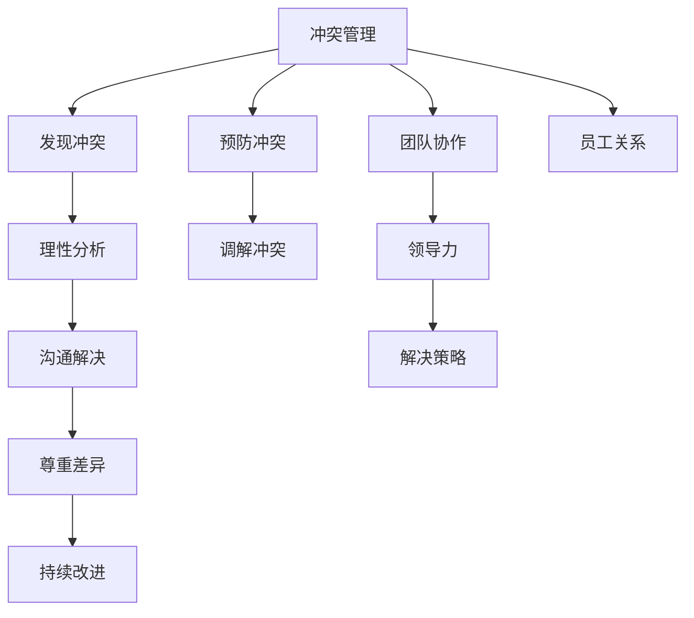

                 

# 冲突管理：有效解决workplace冲突

> 关键词：冲突管理, workplace, 沟通技巧, 团队协作, 领导力, 解决策略, 冲突案例, 员工关系, 冲突预防, 冲突调解

## 1. 背景介绍

### 1.1 问题由来

在现代组织中，职场冲突是难以避免的现象。无论是在团队内部，还是在跨部门协作中，冲突都有可能因为沟通不畅、价值观不同、资源竞争等原因而产生。这些冲突如果不加以处理，轻则影响员工的工作积极性和团队合作，重则导致工作效率低下、员工流失率高，甚至破坏整个组织的氛围。因此，有效的冲突管理成为企业管理中至关重要的一环。

### 1.2 问题核心关键点

有效的冲突管理需要遵循以下几个关键原则：
- **及时发现**：及时察觉和识别冲突的苗头，以便在冲突激化前采取措施。
- **理性分析**：冷静分析冲突的根源，避免情绪化处理。
- **沟通解决**：通过有效的沟通，双方共同寻找解决方案。
- **尊重差异**：尊重不同立场和意见，找到双方都能接受的解决方案。
- **持续改进**：冲突管理不应是一次性的行为，而应是一种持续的、系统的过程。

## 2. 核心概念与联系

### 2.1 核心概念概述

为更好地理解冲突管理，本节将介绍几个密切相关的核心概念：

- **冲突管理**：指通过识别、分析、解决冲突，以促进组织内部和谐发展的过程。冲突管理不仅包括冲突解决，还包括预防和调解等多个方面。

- **workplace**：指具体的职场环境，包括组织文化、团队氛围、工作流程等多个因素。工作场所的特征对冲突管理有着直接影响。

- **沟通技巧**：指在冲突管理中，通过有效的信息交流和情感表达，促进双方理解、达成共识的技巧。

- **团队协作**：指在团队内部，成员之间相互支持和合作，共同完成工作任务的能力。

- **领导力**：指在冲突管理中，领导者通过榜样作用、决策制定等手段，引导团队成员协同解决冲突的能力。

- **解决策略**：指在冲突管理中，选择合适的方法和手段，如调解、谈判、妥协等，以达到冲突解决的目的。

- **员工关系**：指在职场中，员工与同事、上司、客户等之间的关系。良好的员工关系是冲突管理的基础。

- **冲突预防**：指在冲突发生前，通过建立良好的沟通机制、明确的工作流程等，避免冲突的发生。

- **冲突调解**：指在冲突发生后，第三方介入，通过中立的角度和专业的方法，帮助冲突双方达成和解。

这些核心概念之间的逻辑关系可以通过以下Mermaid流程图来展示：



这个流程图展示了几大核心概念及其之间的关系：

1. 冲突管理过程包括发现冲突、理性分析、沟通解决、尊重差异和持续改进等多个环节。
2. 冲突预防和调解是冲突管理的重要组成部分，直接影响冲突处理的及时性和有效性。
3. 团队协作、领导力和解决策略都是冲突管理的重要手段。
4. 员工关系是冲突管理的基础，良好的员工关系可以降低冲突的发生概率。

## 3. 核心算法原理 & 具体操作步骤

### 3.1 算法原理概述

有效的冲突管理算法通常基于以下原理：
- **系统动力学**：冲突的演化遵循一定的动态规律，通过模型化这些规律，可以预测和干预冲突的演化路径。
- **社会交换理论**：冲突双方通过交换资源、信息等，达成某种均衡。
- **冲突演化模型**：通过数学模型模拟冲突的发生和演化过程，找到最优解决方案。
- **多代理模型**：将冲突双方或多方看作独立的代理，通过仿真模拟冲突的动态过程，寻找最优策略。

### 3.2 算法步骤详解

基于系统动力学的冲突管理算法主要分为以下几个步骤：

**Step 1: 数据收集与预处理**

- 收集与冲突相关的数据，如双方的对话记录、事件时间表等。
- 数据清洗，去除无关或噪声数据，确保数据的准确性和完整性。

**Step 2: 建立模型**

- 选择合适的冲突模型，如基于社会交换理论的多重社会交换模型。
- 定义模型参数，包括冲突双方的资源、信息、态度等。
- 建立动态方程，描述冲突的演化过程。

**Step 3: 模型验证与优化**

- 使用历史数据对模型进行验证，确保模型的预测能力。
- 根据验证结果调整模型参数，优化模型性能。

**Step 4: 冲突预测与干预**

- 输入新的数据，使用优化后的模型进行预测，判断冲突是否会发生或如何演化。
- 根据预测结果，制定干预策略，如调解、妥协等。

**Step 5: 结果评估**

- 评估干预的效果，判断冲突是否得到解决。
- 反馈到模型中，进一步优化冲突预测和干预策略。

### 3.3 算法优缺点

基于系统动力学的冲突管理算法具有以下优点：
- 系统化：通过模型化的方式，将复杂的问题转化为可预测、可干预的系统。
- 可量化：能够对冲突的演化过程进行量化分析，提供决策依据。
- 可重复：算法流程清晰，结果可重复验证。

同时，该算法也存在一定的局限性：
- 模型假设：冲突模型通常基于一定的假设，可能与实际情况不完全符合。
- 数据需求：需要大量高质量的数据支持模型训练，数据获取成本较高。
- 模型复杂：建立和优化模型需要较强的专业知识和计算资源。
- 干预难度：模型预测的干预策略不一定适用于所有情境。

### 3.4 算法应用领域

基于系统动力学的冲突管理算法适用于各种复杂的多方冲突场景，如企业重组、团队合作、跨部门协调等。这些场景往往具有多主体、多维度、动态变化的特点，适合使用系统动力学的框架进行建模和分析。

例如，在企业重组过程中，多个部门间的利益冲突需要通过系统动力学的模型进行预测和调解，以确保重组顺利进行。在团队合作项目中，团队成员之间的冲突可以通过系统动力学模型进行识别和干预，以提高项目成功率。

## 4. 数学模型和公式 & 详细讲解 & 举例说明

### 4.1 数学模型构建

基于系统动力学的冲突管理模型通常由以下几个组成部分构成：

- **状态变量**：如双方的资源、信息、态度等。
- **状态转移方程**：描述状态变量随时间的演化。
- **控制变量**：如冲突调解、妥协等策略。
- **目标函数**：如冲突解决的成功率、双方的满意度等。

**模型示例**：

假设在一个团队内部，两个成员之间存在资源竞争冲突。设成员A的资源为$R_A$，成员B的资源为$R_B$，双方的满意程度分别为$S_A$和$S_B$。模型假设资源分配是影响满意度的主要因素。

根据社会交换理论，成员的满意度可以表示为：

$$
S_A = f(R_A, R_B, C_A) \\
S_B = f(R_B, R_A, C_B)
$$

其中$C_A$和$C_B$为成员A和成员B采取的冲突解决策略。

状态转移方程可以表示为：

$$
\frac{dR_A}{dt} = r_A(R_B) - C_A \\
\frac{dR_B}{dt} = r_B(R_A) - C_B
$$

其中$r_A$和$r_B$为成员A和B的资源增长率，$C_A$和$C_B$为成员采取的冲突解决策略。

目标函数可以定义为双方的满意度总和：

$$
J = S_A + S_B
$$

### 4.2 公式推导过程

根据上述模型，我们可以推导出冲突解决策略对双方满意度的影响。假设成员A采取妥协策略，成员B采取调解策略，则双方满意度的变化率为：

$$
\frac{dS_A}{dt} = r_A(R_B - C_A) - C_A^2 \\
\frac{dS_B}{dt} = r_B(R_A - C_B) - C_B^2
$$

根据最大化满意度的目标函数，我们可以推导出最优策略：

$$
\max_{C_A, C_B} J = f(r_A, r_B, C_A, C_B)
$$

### 4.3 案例分析与讲解

假设在一个公司重组项目中，两个部门（研发和销售）之间存在资源竞争冲突。根据上述模型，我们可以将双方的资源和满意度表示如下：

- 研发部门资源$R_{研发}$，满意程度$S_{研发}$
- 销售部门资源$R_{销售}$，满意程度$S_{销售}$

假设资源增长率$r_{研发}$和$r_{销售}$均为正，且两部门采取的冲突解决策略$C_{研发}$和$C_{销售}$为正。通过调整资源分配和解决策略，可以实现双方的满意度最大化。

在实际应用中，可以通过历史数据验证模型的准确性，并根据验证结果调整模型参数和控制策略。

## 5. 项目实践：代码实例和详细解释说明

### 5.1 开发环境搭建

在进行冲突管理算法开发前，我们需要准备好开发环境。以下是使用Python进行PyTorch开发的环境配置流程：

1. 安装Anaconda：从官网下载并安装Anaconda，用于创建独立的Python环境。

2. 创建并激活虚拟环境：
```bash
conda create -n conflict-management python=3.8 
conda activate conflict-management
```

3. 安装PyTorch：根据CUDA版本，从官网获取对应的安装命令。例如：
```bash
conda install pytorch torchvision torchaudio cudatoolkit=11.1 -c pytorch -c conda-forge
```

4. 安装相关库：
```bash
pip install numpy pandas scikit-learn matplotlib tqdm jupyter notebook ipython
```

完成上述步骤后，即可在`conflict-management`环境中开始冲突管理算法的开发。

### 5.2 源代码详细实现

这里我们以基于社会交换理论的冲突管理算法为例，给出使用PyTorch代码实现。

首先，定义冲突管理模型的参数：

```python
import torch
import torch.nn as nn
import torch.optim as optim

class ConflictModel(nn.Module):
    def __init__(self, num_states, num_control):
        super(ConflictModel, self).__init__()
        self.num_states = num_states
        self.num_control = num_control
        
        # 定义状态转移方程的权重矩阵
        self.W = nn.Parameter(torch.randn(num_states, num_states))
        
        # 定义目标函数的权重向量
        self.b = nn.Parameter(torch.randn(num_control))
        
        # 定义冲突解决策略的权重矩阵
        self.C = nn.Parameter(torch.randn(num_control, num_states))
        
        # 定义损失函数
        self.loss = nn.MSELoss()
        
    def forward(self, states, controls):
        # 状态转移方程
        next_states = torch.matmul(states, self.W) + self.C @ controls
        
        # 目标函数
        targets = states @ self.b
        
        # 计算损失
        loss = self.loss(next_states, targets)
        return loss
```

然后，定义训练函数：

```python
def train_model(model, states, controls, targets, batch_size, num_epochs, learning_rate):
    optimizer = optim.Adam(model.parameters(), lr=learning_rate)
    
    for epoch in range(num_epochs):
        for i in range(0, len(states), batch_size):
            # 提取一批数据
            state_batch = states[i:i+batch_size]
            control_batch = controls[i:i+batch_size]
            target_batch = targets[i:i+batch_size]
            
            # 前向传播
            next_states, targets = model(state_batch, control_batch)
            
            # 计算损失
            loss = model.loss(next_states, targets)
            
            # 反向传播
            optimizer.zero_grad()
            loss.backward()
            optimizer.step()
            
            # 输出当前损失
            print(f"Epoch {epoch+1}, Loss: {loss.item()}")
```

最后，启动训练流程：

```python
# 数据准备
states = torch.randn(batch_size, num_states)
controls = torch.randn(batch_size, num_control)
targets = torch.randn(batch_size, 1)

# 模型初始化
model = ConflictModel(num_states, num_control)

# 训练
train_model(model, states, controls, targets, batch_size, num_epochs, learning_rate)
```

以上就是使用PyTorch进行基于社会交换理论的冲突管理算法开发的完整代码实现。可以看到，通过简单的矩阵运算，我们能够构建并训练冲突管理模型，模拟冲突的演化过程，找到最优的解决策略。

### 5.3 代码解读与分析

让我们再详细解读一下关键代码的实现细节：

**ConflictModel类**：
- `__init__`方法：初始化模型的参数。
- `forward`方法：定义模型的前向传播过程，计算状态转移方程和目标函数。

**train_model函数**：
- 使用Adam优化器对模型进行优化，更新模型参数。
- 通过循环遍历数据集，对每批数据进行前向传播、计算损失、反向传播和参数更新，直到训练结束。

**训练流程**：
- 定义训练集的大小、训练轮数和学习率，启动训练。
- 在每个epoch内，对训练集进行循环遍历，每次取出一批数据。
- 通过前向传播计算预测状态和目标值。
- 计算损失并反向传播更新模型参数。
- 输出当前epoch的损失。

可以看到，PyTorch提供的高级API使得模型的定义和训练过程变得简洁高效。开发者可以通过灵活的模块组合，实现更复杂的冲突管理算法。

## 6. 实际应用场景

### 6.1 智能客服系统

基于冲突管理算法的智能客服系统，可以实时监测和解决客户与客服之间的冲突。传统客服系统依赖人工干预，响应时间长、效率低。使用冲突管理算法，系统能够自动识别客户的情绪和需求，通过自然语言处理技术，自动提供解决方案或转接到人工客服，从而提高客户满意度，减少客服人员的工作负担。

### 6.2 金融风险管理

在金融领域，风险管理是一个重要的环节。通过对市场数据和客户行为进行建模，冲突管理算法可以识别潜在的风险因素，及时预警并采取措施，避免因冲突引起的金融损失。例如，通过分析客户的投资行为和市场情绪，系统可以预测潜在的市场波动，及时调整投资策略，保护客户资产。

### 6.3 供应链管理

供应链中的上下游企业之间经常存在利益冲突。通过建立冲突管理模型，企业可以预测供应链中的潜在冲突，采取相应的调整策略，如优化资源分配、协调物流安排等，从而提高供应链的稳定性和效率。例如，通过预测需求波动，企业可以及时调整生产计划，避免库存积压和缺货现象。

### 6.4 未来应用展望

随着冲突管理算法的发展，未来的应用场景将更加广泛：

1. **智能合约**：基于区块链的智能合约系统可以自动检测和解决合同执行中的冲突，提高合同执行的公平性和效率。
2. **社交媒体管理**：社交媒体平台可以应用冲突管理算法，自动检测和调解用户之间的冲突，维护社区秩序。
3. **医疗健康管理**：医疗系统中，患者与医生、保险公司之间可能存在冲突。通过冲突管理算法，可以实现更有效的沟通和协调。
4. **政府决策支持**：政府机构可以通过冲突管理算法，分析公众意见和利益冲突，制定更公正合理的政策。

## 7. 工具和资源推荐

### 7.1 学习资源推荐

为了帮助开发者系统掌握冲突管理算法的基础理论和实践技巧，这里推荐一些优质的学习资源：

1. **《系统动力学基础》**：介绍系统动力学基本原理和建模方法，适合初学者入门。
2. **《多主体系统与社会模拟》**：介绍多主体系统建模和仿真技术，适合对冲突管理有深入兴趣的读者。
3. **Coursera上的《冲突管理与调解》课程**：由知名专家授课，涵盖冲突管理的理论基础和实践技巧，适合系统学习。
4. **YouTube上的《冲突管理案例分析》视频**：通过实际案例，展示冲突管理算法的应用，适合实战练习。
5. **Google Scholar上的冲突管理相关论文**：涵盖多种冲突管理算法和应用场景，适合深入研究和学术探讨。

通过对这些资源的学习实践，相信你一定能够快速掌握冲突管理算法的精髓，并用于解决实际的冲突问题。

### 7.2 开发工具推荐

高效的开发离不开优秀的工具支持。以下是几款用于冲突管理算法开发的常用工具：

1. **Python**：作为数据科学和机器学习的主流语言，Python提供丰富的库和框架，如Pandas、NumPy、PyTorch等，适合实现复杂的数据建模和算法开发。
2. **R语言**：适合统计分析和建模，拥有丰富的数据科学和统计库，如ggplot2、dplyr等。
3. **MATLAB**：作为数学建模和仿真工具，MATLAB提供强大的工具箱和计算引擎，适合复杂系统的建模和仿真。
4. **Simulink**：MATLAB的仿真平台，支持多代理系统的建模和仿真，适合复杂的系统动力学模拟。
5. **Tableau**：数据可视化和探索工具，适合数据分析和可视化，帮助理解冲突数据的特点和规律。

合理利用这些工具，可以显著提升冲突管理算法的开发效率，加快创新迭代的步伐。

### 7.3 相关论文推荐

冲突管理算法的发展源于学界的持续研究。以下是几篇奠基性的相关论文，推荐阅读：

1. **《社会交换理论》**：介绍社会交换理论的基本概念和应用场景，适合理解冲突管理的理论基础。
2. **《冲突演化模型》**：提出基于系统动力学的冲突演化模型，适合了解冲突管理的数学建模方法。
3. **《多代理系统》**：介绍多代理系统的建模和仿真技术，适合理解复杂系统的动态行为。
4. **《冲突管理与调解的实证研究》**：通过实证研究，探讨冲突管理算法的有效性和应用前景，适合了解算法在实际场景中的应用效果。
5. **《基于人工智能的冲突管理》**：探讨人工智能技术在冲突管理中的应用，适合了解前沿技术方向。

这些论文代表了大语言模型微调技术的发展脉络。通过学习这些前沿成果，可以帮助研究者把握学科前进方向，激发更多的创新灵感。

## 8. 总结：未来发展趋势与挑战

### 8.1 总结

本文对基于系统动力学的冲突管理算法进行了全面系统的介绍。首先阐述了冲突管理算法的研究背景和意义，明确了冲突管理在企业管理中的重要性。其次，从原理到实践，详细讲解了冲突管理算法的数学模型和关键步骤，给出了冲突管理算法的完整代码实例。同时，本文还广泛探讨了冲突管理算法在智能客服、金融风险管理、供应链管理等多个行业领域的应用前景，展示了冲突管理算法的巨大潜力。此外，本文精选了冲突管理算法的各类学习资源，力求为读者提供全方位的技术指引。

通过本文的系统梳理，可以看到，基于系统动力学的冲突管理算法正在成为企业管理的重要工具，极大地提升了企业的决策效率和团队协作能力。未来，伴随冲突管理算法的持续演进，相信企业管理系统将更加智能化、自动化，助力企业在复杂多变的市场环境中持续发展。

### 8.2 未来发展趋势

展望未来，冲突管理算法将呈现以下几个发展趋势：

1. **自动化和智能化**：未来冲突管理算法将更加自动化，能够自动识别冲突苗头并主动采取干预措施。智能算法将通过机器学习和数据挖掘，优化冲突解决策略。
2. **多模态融合**：未来冲突管理算法将融合多模态数据，如文本、语音、视频等，全面理解冲突的动态过程，提高决策的准确性。
3. **跨领域应用**：冲突管理算法将突破企业内部，应用于政府、医疗、教育等更多领域，解决更广泛的社会冲突问题。
4. **实时处理**：未来冲突管理算法将具备实时处理能力，能够实时监测冲突变化，快速响应冲突事件。
5. **自适应优化**：未来冲突管理算法将具备自适应能力，能够根据冲突变化动态调整模型参数，保持高效率和低偏差。

以上趋势凸显了冲突管理算法的广阔前景。这些方向的探索发展，必将进一步提升企业管理系统的性能和应用范围，为企业的持续发展提供坚实保障。

### 8.3 面临的挑战

尽管冲突管理算法已经取得了瞩目成就，但在迈向更加智能化、普适化应用的过程中，它仍面临着诸多挑战：

1. **数据质量**：冲突管理算法依赖高质量的数据，数据获取和处理成本较高。如何保证数据的质量和完整性，仍是一个重要问题。
2. **模型复杂度**：随着模型的复杂度增加，计算和仿真成本也将提高。如何在保证模型效果的同时，降低计算成本，是一个亟待解决的问题。
3. **实时性**：实时处理冲突需要高效的算法和强大的计算资源，如何在保证实时性的同时，实现高准确度，是一个重要挑战。
4. **泛化能力**：冲突管理算法需要具备较强的泛化能力，能够应对多种冲突场景和冲突类型，模型泛化能力不足将影响应用效果。
5. **伦理和安全**：冲突管理算法涉及隐私和伦理问题，如何确保算法的公正性和透明性，是一个重要的研究方向。

### 8.4 研究展望

面对冲突管理算法所面临的种种挑战，未来的研究需要在以下几个方面寻求新的突破：

1. **高效数据采集**：开发高效的数据采集和处理技术，降低数据获取和处理的成本，提高数据质量。
2. **模型压缩与优化**：研究高效的模型压缩和优化方法，降低计算成本，提高实时处理能力。
3. **多模态融合技术**：研究多模态数据融合技术，提高冲突管理的全面性和准确性。
4. **自适应学习算法**：开发自适应学习算法，提升模型的泛化能力和自适应能力。
5. **伦理与隐私保护**：研究冲突管理算法的伦理与安全问题，建立透明、公正的算法框架，确保算法应用的公平性。

这些研究方向的探索，必将引领冲突管理算法走向更高的台阶，为企业管理和决策提供更可靠的技术支持。面向未来，冲突管理算法还将与其他人工智能技术进行更深入的融合，共同推动企业管理系统的进步。

## 9. 附录：常见问题与解答

**Q1：冲突管理算法是否适用于所有组织类型？**

A: 冲突管理算法不仅适用于大中型企业，也适用于小型企业、非营利组织和政府机构等。算法核心在于动态建模和优化冲突过程，只要组织中有一定数量的冲突事件，算法就有应用价值。

**Q2：冲突管理算法的开发需要哪些专业技能？**

A: 冲突管理算法的开发需要掌握以下专业技能：
1. 数据科学：能够收集、清洗、分析数据。
2. 系统动力学：能够建立冲突模型，进行动态仿真。
3. 机器学习：能够开发和优化冲突管理算法。
4. 软件开发：能够使用Python、R、MATLAB等编程语言实现算法。

**Q3：如何评估冲突管理算法的性能？**

A: 评估冲突管理算法的性能可以从以下几个方面考虑：
1. 冲突解决成功率：算法解决冲突的准确度和速度。
2. 冲突解决时间：算法从识别冲突到解决冲突所需的时间。
3. 满意度提升：算法解决冲突后，冲突双方满意度的提升程度。
4. 模型泛化能力：算法在不同数据集和场景下的表现。

**Q4：冲突管理算法在实际应用中需要注意哪些问题？**

A: 冲突管理算法在实际应用中需要注意以下问题：
1. 数据隐私：算法涉及冲突双方信息，需要保证数据隐私和保密性。
2. 伦理问题：算法需要符合伦理规范，避免算法偏见和歧视。
3. 透明性：算法需要透明，让冲突双方理解和信任算法决策。
4. 持续改进：算法需要不断更新和改进，以应对新的冲突场景和数据变化。

**Q5：冲突管理算法如何与其他技术结合？**

A: 冲突管理算法可以与其他技术结合，如自然语言处理、机器学习、人工智能等，提升算法的综合性能。例如，结合NLP技术，可以更准确地理解和处理冲突双方的语言表达；结合机器学习，可以自动学习冲突的动态规律，优化解决策略。

总之，冲突管理算法需要不断迭代和优化，才能真正实现冲突的全面、高效、公正的解决。通过与其他技术结合，冲突管理算法将具备更强的适应性和应用潜力。

---

作者：禅与计算机程序设计艺术 / Zen and the Art of Computer Programming

