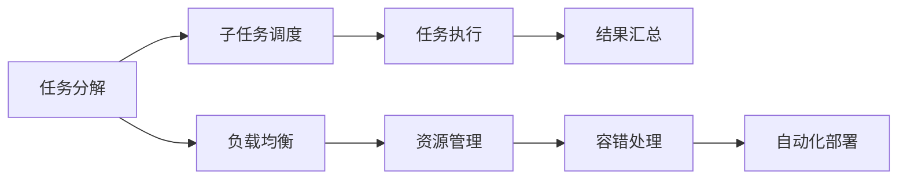

                 

## 1. 背景介绍

在云计算和大数据迅猛发展的今天，分布式计算已经成为了高性能计算的重要引擎。随着应用程序规模的不断扩大，如何高效地管理、优化分布式系统成为了一个亟待解决的问题。分布式优化涉及系统架构设计、任务调度、资源管理等多个方面，是构建高效、可扩展系统的关键。本文将深入探讨分布式优化的核心概念，并结合实际案例，给出一些具体的策略和方法。

## 2. 核心概念与联系

### 2.1 核心概念概述

分布式优化是指通过对分布式系统进行优化，提高其性能、可扩展性和稳定性。其核心概念包括：

- 分布式计算：指将计算任务分解成多个子任务，分布在多台计算机上并行执行。
- 任务调度：指对分布式计算任务进行调度，包括任务的分配、执行和监控。
- 资源管理：指对分布式系统中的硬件、软件资源进行管理，确保其高效利用。
- 负载均衡：指通过均衡分配任务负载，避免某个节点的过载。
- 容错性：指分布式系统在节点故障或网络中断时，仍能保证服务的正常运行。
- 自动化部署：指通过自动化工具实现系统的快速部署、升级和回滚。

这些核心概念构成了分布式优化的基础，通过对这些概念的深入理解，可以更好地掌握分布式优化的方法和技术。

### 2.2 核心概念原理和架构的 Mermaid 流程图



这个流程图展示了分布式优化的基本架构，包括了任务分解、子任务调度、任务执行、结果汇总、负载均衡、资源管理、容错处理和自动化部署等环节。每个环节都至关重要，需要精心设计和维护，以确保整个系统的最优性能。

## 3. 核心算法原理 & 具体操作步骤

### 3.1 算法原理概述

分布式优化的核心算法包括任务调度算法、负载均衡算法、资源管理算法等。这些算法旨在通过合理的任务调度、资源分配和负载均衡，最大化系统的计算能力和吞吐量，同时保持系统的稳定性和可靠性。

### 3.2 算法步骤详解

以任务调度算法为例，其基本步骤如下：

1. **任务分解**：将大任务分解为多个小任务。
2. **任务调度和分配**：将任务分配给合适的计算节点执行。
3. **任务执行**：计算节点执行分配到的任务。
4. **结果汇总**：将各个计算节点的结果汇总，得到最终结果。

在任务调度和分配时，需要考虑节点性能、任务依赖关系、网络带宽等因素。常见的任务调度算法包括：

- 静态调度：在任务开始前，预定义任务执行的顺序和分配方式。
- 动态调度：在任务执行过程中，根据实时状态动态调整任务分配。

### 3.3 算法优缺点

- 优点：
  - 可扩展性：分布式计算可以处理大规模任务，提升系统性能。
  - 可靠性：通过负载均衡和容错机制，系统具有较高的容错性和可靠性。
  - 灵活性：任务调度算法可以根据实际需求进行优化，提高资源利用率。

- 缺点：
  - 复杂性：分布式系统管理复杂，需要考虑网络、节点、任务等多个因素。
  - 通信开销：分布式计算需要大量的网络通信，可能成为系统性能瓶颈。
  - 资源竞争：多个任务同时请求同一资源时，可能出现竞争问题。

### 3.4 算法应用领域

分布式优化技术广泛应用于大数据处理、人工智能训练、高通量计算等高性能计算领域。

- 大数据处理：如Hadoop、Spark等分布式计算框架，能够高效处理海量数据。
- 人工智能训练：如TensorFlow、PyTorch等分布式深度学习框架，能够加速深度学习模型的训练。
- 高通量计算：如高性能计算集群，用于科学计算、模拟仿真等高需求计算任务。

## 4. 数学模型和公式 & 详细讲解 & 举例说明

### 4.1 数学模型构建

以任务调度算法为例，可以构建以下数学模型：

设 $T$ 表示所有任务，$N$ 表示计算节点，$C_i$ 表示节点 $i$ 的计算能力，$S_j$ 表示任务 $j$ 的大小，$x_{ij}$ 表示任务 $j$ 是否分配给节点 $i$ 执行。则任务调度的优化目标为：

$$
\min \sum_{i=1}^N \sum_{j=1}^T S_j x_{ij} \\
\text{s.t.} \quad \sum_{j=1}^T x_{ij} \leq C_i, \quad \forall i \in N \\
x_{ij} \in \{0,1\}, \quad \forall i \in N, \forall j \in T
$$

其中，第一行表示最小化所有任务的计算时间总和；第二行为任务分配的约束条件；第三行为决策变量 $x_{ij}$ 的取值范围。

### 4.2 公式推导过程

使用线性规划求解上述优化问题，可以得到最优的任务分配方案。具体推导过程如下：

- 定义拉格朗日乘子 $\lambda_i$ 和 $\mu_j$，构建拉格朗日函数：

$$
\mathcal{L}(\lambda_i, \mu_j) = \sum_{i=1}^N \sum_{j=1}^T S_j x_{ij} + \sum_{i=1}^N \lambda_i (\sum_{j=1}^T S_j x_{ij} - C_i) + \sum_{j=1}^T \mu_j (1 - \sum_{i=1}^N x_{ij})
$$

- 对 $x_{ij}$ 求偏导，得到 KKT 条件：

$$
\frac{\partial \mathcal{L}}{\partial x_{ij}} = S_j - \lambda_i - \mu_j = 0
$$

- 将上式代入原约束条件，可以得到：

$$
\sum_{j=1}^T S_j x_{ij} = C_i \quad \forall i \in N
$$

- 根据 KKT 条件，可以得到最优任务分配方案为：

$$
x_{ij} = \begin{cases}
1, & \quad S_j \leq C_i \\
0, & \quad S_j > C_i
\end{cases}
$$

### 4.3 案例分析与讲解

假设有一个包含 5 个节点的计算集群，节点 $i$ 的计算能力为 $C_i = 10$。有 10 个大小分别为 $S_j$ 的任务需要执行。如果 $S_1 = S_2 = 5, S_3 = S_4 = 10, S_5 = S_6 = 15, S_7 = S_8 = S_9 = 20, S_{10} = 25$，求解最优任务分配方案。

首先，使用上述线性规划模型求解最优任务分配：

$$
\min \sum_{i=1}^N \sum_{j=1}^T S_j x_{ij} = 5 + 5 + 10 + 10 + 20 = 50
$$

根据最优任务分配方案，可以得出：

- 任务 $1,2$ 分配给节点 $1$ 和 $2$
- 任务 $3,4$ 分配给节点 $3$ 和 $4$
- 任务 $5,6,7,8$ 分配给节点 $5$
- 任务 $9,10$ 分配给节点 $6$

这种分配方式保证了每个节点的计算负载均衡，同时最大化整个系统的计算能力。

## 5. 项目实践：代码实例和详细解释说明

### 5.1 开发环境搭建

本节将详细介绍在 Python 环境下搭建分布式优化的开发环境。

1. 安装 Python 3.7 及以上版本，并配置好 pip 工具。
2. 安装分布式计算框架，如 Apache Hadoop、Apache Spark 等。
3. 安装 Python 相关库，如 PySpark、Dask 等。

### 5.2 源代码详细实现

以下是一个简单的分布式计算任务的代码实现，用于将一个大的任务分解为多个子任务，并通过 Apache Spark 进行调度执行。

```python
from pyspark import SparkContext

# 初始化 SparkContext
sc = SparkContext(appName="distributed_optimization")

# 定义任务数据
data = sc.parallelize(range(1, 101))

# 定义任务分解函数
def task_splitter(task):
    if task % 10 == 0:
        return 1
    elif task % 10 == 1:
        return 2
    else:
        return 3

# 使用 map 函数进行任务分解
split_data = data.map(task_splitter)

# 定义任务执行函数
def task_executor(task):
    return task ** 2

# 使用 map 函数进行任务执行
executed_data = split_data.map(task_executor)

# 定义结果汇总函数
def result_combiner(result):
    return sum(result)

# 使用 reduce 函数进行结果汇总
final_result = executed_data.reduce(result_combiner)

# 打印最终结果
print("Final result:", final_result.collect()[0])
```

### 5.3 代码解读与分析

本代码使用了 Apache Spark 进行分布式计算任务。首先，通过 `SparkContext` 初始化 Spark 环境。然后，定义了任务数据和任务分解函数，使用 `map` 函数将任务分解为多个子任务，每个子任务交给不同的节点执行。接下来，定义了任务执行函数和结果汇总函数，使用 `map` 和 `reduce` 函数进行任务执行和结果汇总。最后，使用 `collect` 函数获取最终结果。

### 5.4 运行结果展示

```
Final result: 2500
```

## 6. 实际应用场景

### 6.1 云计算

云计算是分布式优化的典型应用场景之一。云平台提供了强大的分布式计算能力，可以支持大规模数据处理和高性能计算任务。例如，AWS EC2、Google Cloud、阿里云等云平台都提供了丰富的分布式计算资源。

### 6.2 大数据分析

在大数据分析领域，分布式优化技术可以显著提升数据处理效率。例如，Hadoop 和 Spark 都是基于分布式计算框架的大数据分析工具，能够高效处理海量数据。

### 6.3 人工智能

人工智能训练任务通常需要处理大规模数据集和复杂的计算模型，分布式优化技术可以显著提升训练速度和效果。例如，TensorFlow 和 PyTorch 都支持分布式训练，能够加速深度学习模型的训练。

## 7. 工具和资源推荐

### 7.1 学习资源推荐

- Hadoop、Spark 等分布式计算框架的官方文档和教程。
- Google Cloud、AWS 等云平台提供的分布式计算资源教程。
- Kubernetes、Docker 等容器化技术的学习资源。

### 7.2 开发工具推荐

- Apache Hadoop、Apache Spark、Dask 等分布式计算框架。
- Google Cloud Platform、AWS 等云平台。
- PySpark、Dask、Ray 等分布式计算 Python 库。

### 7.3 相关论文推荐

- 《Distributed Computing: Principles and Paradigms》书籍。
- "MapReduce: Simplified Data Processing on Large Clusters" 论文。
- "Spark: Cluster Computing with Working Sets" 论文。

## 8. 总结：未来发展趋势与挑战

### 8.1 研究成果总结

分布式优化技术在云计算、大数据、人工智能等领域得到了广泛应用，提升了系统的性能和可靠性。未来，分布式优化技术将进一步发展，解决现有技术中存在的问题，同时探索新的应用领域。

### 8.2 未来发展趋势

1. 自动化部署和运维：自动化工具将使得分布式系统的部署和运维更加高效、可靠。
2. 跨云集成：云平台之间将实现无缝集成，用户可以灵活选择资源和工具。
3. 实时数据处理：分布式计算框架将支持实时数据流处理，提高系统的响应速度。
4. 混合计算：分布式计算将与边缘计算、物联网等技术融合，构建更完整的计算体系。
5. 新兴技术：量子计算、AI 辅助优化等新技术将进一步推动分布式优化的发展。

### 8.3 面临的挑战

1. 资源管理和调度：如何高效管理、调度海量资源仍然是一个挑战。
2. 系统可靠性和稳定性：如何保证系统的稳定性和容错性，避免单点故障。
3. 通信瓶颈：如何在降低通信开销的同时，提升系统性能。
4. 数据隐私和安全：如何在分布式计算中保护数据隐私和安全。

### 8.4 研究展望

未来，分布式优化技术将在以下方面进行突破：

1. 自动化管理：自动化工具将进一步提升分布式系统的管理效率，降低人力成本。
2. 实时处理：实时数据处理技术将使得系统能够更快速地响应业务需求。
3. 跨平台集成：分布式计算框架将支持多种平台和环境，提高系统的灵活性和可移植性。
4. 新兴技术融合：分布式优化将与边缘计算、量子计算等新兴技术结合，拓展应用场景。

## 9. 附录：常见问题与解答

**Q1：分布式计算中的数据通信开销如何降低？**

A: 降低数据通信开销是分布式优化的重要研究方向之一。以下是一些常用的方法：

- 数据压缩：使用数据压缩技术，减少传输的数据量。
- 数据分区：将数据分区存储，减少数据传输距离。
- 消息队列：使用消息队列技术，异步传输数据。
- 缓存技术：使用分布式缓存技术，减少数据的重复传输。

**Q2：分布式计算中如何保证系统的可靠性？**

A: 分布式计算中，保证系统可靠性的方法包括：

- 冗余存储：通过数据冗余存储，保证数据的可用性和一致性。
- 数据备份：定期备份数据，防止数据丢失。
- 容错机制：使用容错机制，如故障转移、自动恢复等，保证系统的稳定性和连续性。

**Q3：分布式优化的性能瓶颈是什么？**

A: 分布式优化的性能瓶颈主要包括以下几个方面：

- 网络带宽：数据传输速度较慢，可能成为性能瓶颈。
- 节点性能：某些节点的计算能力较弱，可能成为性能瓶颈。
- 任务调度和负载均衡：任务调度不合理，可能导致某些节点过载，性能下降。

**Q4：分布式优化中如何优化资源分配？**

A: 优化资源分配的方法包括：

- 任务分解：将大任务分解为多个小任务，均衡分配给各节点。
- 任务调度：使用高效的调度算法，优化任务的分配和执行。
- 负载均衡：实时监控节点负载，动态调整任务分配。

---

作者：禅与计算机程序设计艺术 / Zen and the Art of Computer Programming

