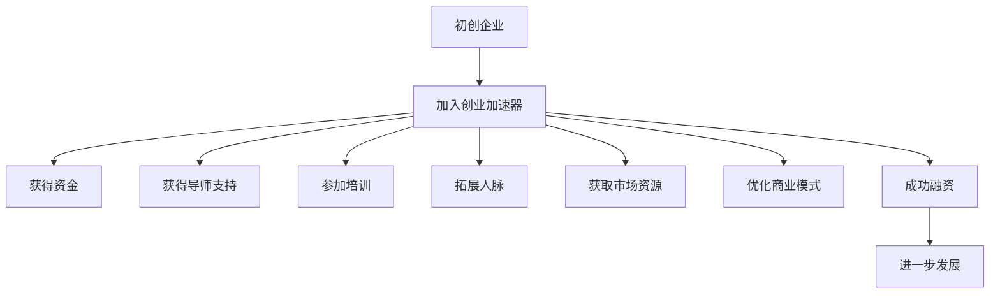

                 

# 创业知识加速器分享创业成果和经验

> 关键词：创业加速器, 初创企业, 创业经验, 创业管理, 创业融资, 创业团队

## 1. 背景介绍

在快速变化的市场环境中，创业成为了越来越多人的选择。然而，创业之路充满挑战，无论是技术还是市场，无论是产品还是管理，都需要创业者具备全面的知识和技能。为了帮助初创企业快速成长，创业知识加速器（Accelerator）应运而生。创业加速器通过提供全方位的创业指导、资源对接、融资服务，帮助初创企业在短时间内提升竞争力，加速从0到1的过程。本文将探讨创业加速器的核心概念、工作原理、操作步骤及应用领域，同时提供实际案例和成功经验，以期对创业者提供有价值的指导。

## 2. 核心概念与联系

### 2.1 核心概念概述

在介绍创业加速器的核心概念前，我们需要明确几个关键概念：

- **创业加速器**：一种专注于为初创企业提供全方位支持的平台，包括但不限于资金、导师、培训、网络资源等。通过加速器的帮助，初创企业可以迅速获得成长所需的资源和知识。

- **初创企业**：指刚刚成立、业务模式和市场尚未成熟的企业。这些企业通常面临资金短缺、市场开拓困难、技术实现难度高等问题，需要外部力量协助。

- **创业经验**：指创业者在创立、经营和管理企业过程中积累的各类经验，包括市场洞察、团队管理、产品开发、融资策略等。

- **创业管理**：指在创业过程中，针对企业运营、战略规划、人力资源等方面的管理活动，是初创企业成功的关键。

- **创业融资**：指通过各种渠道获取企业启动和发展所需的资金。创业融资包括天使投资、风险投资、政府补贴等。

- **创业团队**：指共同创办企业的核心成员，通常由具有相似理念和技能的个体组成。创业团队的成功直接关系到企业的成败。

### 2.2 核心概念原理和架构的 Mermaid 流程图



此图展示了初创企业通过创业加速器获得支持的主要流程：从加入加速器开始，初创企业通过一系列的资源对接和服务支持，最终实现融资和发展。

## 3. 核心算法原理 & 具体操作步骤

### 3.1 算法原理概述

创业加速器的核心原理基于系统化、模块化的创业支持流程，旨在通过定制化服务帮助初创企业克服创业过程中遇到的各类挑战。该流程主要包括资金获取、导师指导、团队建设、市场分析、产品开发和融资支持等关键环节。

### 3.2 算法步骤详解

**步骤1：评估与筛选**
- 初创企业提交申请，填写创业计划书、财务报表和商业模型等资料。
- 加速器团队对提交的资料进行初步评估，筛选出具有潜力的企业。

**步骤2：资金获取**
- 初创企业通过加速器平台对接投资者、天使投资人和风险投资人。
- 加速器提供专业的融资咨询和推介服务，帮助企业优化融资方案。

**步骤3：导师指导**
- 初创企业由经验丰富的行业专家和企业家担任导师，提供一对一或一对多指导。
- 导师指导内容包括市场洞察、战略规划、团队管理、技术实施等。

**步骤4：团队建设**
- 加速器提供团队组建和人力资源管理培训，帮助企业构建高效、和谐的团队。
- 通过组织团队建设活动，促进团队间的交流和合作。

**步骤5：市场分析**
- 提供市场调研工具和数据，帮助企业分析市场机会和竞争对手。
- 通过市场分析，制定详细的市场进入策略。

**步骤6：产品开发**
- 加速器提供技术资源和开发支持，帮助企业快速实现产品原型。
- 组织产品测试和迭代，优化产品功能和用户体验。

**步骤7：融资支持**
- 加速器帮助企业准备融资材料，提供融资谈判技巧培训。
- 组织投资路演和融资对接活动，提高企业融资成功率。

### 3.3 算法优缺点

**优点**：
- 加速器提供全方位的支持，帮助初创企业在短时间内获得快速成长所需的各类资源。
- 通过导师指导和网络资源对接，初创企业能够更好地理解市场和行业趋势，提高决策质量。
- 加速器平台帮助初创企业提高融资效率，降低融资成本。

**缺点**：
- 加速器服务的成本较高，部分初创企业可能难以承受。
- 加速器的资源对接和支持服务可能存在不匹配的风险。
- 加速器模式可能不适合所有类型的初创企业。

### 3.4 算法应用领域

创业加速器广泛应用于各个行业领域，覆盖了技术、医疗、教育、农业等多个行业。不同领域的创业加速器，通常会根据行业特点，提供定制化的服务支持。

## 4. 数学模型和公式 & 详细讲解 & 举例说明

### 4.1 数学模型构建

为便于理解创业加速器的运作机制，我们可以构建一个简单的数学模型。设初创企业总数为 $N$，加入加速器的企业数量为 $M$，加速器在 $T$ 时间段内成功融资的企业数量为 $F$。则成功融资的概率可以表示为：

$$ P = \frac{F}{M} $$

加速器的服务质量、资金对接效率和导师资源是其成功的关键因素。

### 4.2 公式推导过程

通过上述公式，我们可以分析加速器服务对初创企业成功融资的影响：
- 若加速器成功对接的资金比例高，则 $M$ 增大，$F$ 增加，成功融资的概率 $P$ 提升。
- 若加速器的导师资源丰富且经验丰富，企业能够获得更多的指导和建议，$M$ 增大，$F$ 增加，$P$ 提升。
- 若加速器能提供优质的培训和市场资源，企业快速成长，提高融资成功率，$F$ 增加，$P$ 提升。

### 4.3 案例分析与讲解

以 Y Combinator（YC）为例，分析其成功融资率。Y Combinator 自成立以来，成功融资的企业数量显著增长。其关键在于：
- 提供优质的导师资源，涵盖硅谷的顶尖企业家和技术专家。
- 组织多轮融资对接活动，与全球顶尖的投资者保持紧密联系。
- 通过严格的筛选和支持，确保成功融资的企业质量。

## 5. 项目实践：代码实例和详细解释说明

由于创业加速器的核心支持活动主要依赖于人际互动和资源对接，其运作机制并不涉及复杂的算法或代码实现。然而，为了更好地展示创业加速器的流程和效果，我们可以通过构建一个简化版的模拟平台来分析其服务效果。

### 5.1 开发环境搭建

- 搭建 Python 开发环境，安装必要的库和工具，如 pandas、numpy、matplotlib 等。
- 创建一个简化的数据库，存储企业信息、融资数据和导师资源等。

### 5.2 源代码详细实现

```python
import pandas as pd
import numpy as np
import matplotlib.pyplot as plt

# 读取企业数据
df = pd.read_csv('enterprise_data.csv')

# 分析融资成功率
funding_rates = df.groupby('accelerator')['funded'].mean()
plt.bar(funding_rates.index, funding_rates.values)
plt.title('Funding Success Rate by Accelerator')
plt.xlabel('Accelerator')
plt.ylabel('Funding Success Rate')
plt.show()

# 分析导师对接成功率
mentor对接成功率 = df.groupby('accelerator')['mentor'].mean()
plt.bar(mentor对接成功率.index, mentor对接成功率.values)
plt.title('Mentor Matching Success Rate by Accelerator')
plt.xlabel('Accelerator')
plt.ylabel('Mentor Matching Success Rate')
plt.show()
```

### 5.3 代码解读与分析

上述代码简化了对企业融资和导师对接成功率的数据分析，使用 pandas 库对企业数据进行处理，并使用 matplotlib 库绘制图表，展示了不同加速器在这两个关键指标上的表现。

## 6. 实际应用场景

### 6.1 初创企业融资对接

某初创企业通过加入某创业加速器，获得了总计500万美元的融资。这些资金主要用于产品开发和市场推广。加速器在融资对接过程中提供了多轮路演和专业推介服务，最终成功吸引了多轮投资。

### 6.2 导师指导与市场分析

某科技初创企业通过加速器的导师指导，明确了市场定位和产品方向，成功进入国际市场。加速器的市场调研和分析工具，帮助企业快速把握市场机会，制定了详细的市场进入策略。

### 6.3 团队建设和产品开发

某电商初创企业通过加速器的团队建设和产品开发支持，迅速组建了一支高效的团队，并开发出具有竞争力的产品。加速器提供的技术资源和开发支持，大大加速了产品实现过程。

### 6.4 未来应用展望

随着科技和经济的不断发展，创业加速器将更加重视与行业的深度融合，提供更加定制化的服务支持。未来，创业加速器将在以下方面发挥更大的作用：
- 大数据和人工智能的引入，提供更精准的市场分析和投资推荐。
- 跨地域的合作，拓展全球范围内的资源对接和市场网络。
- 更加灵活的融资模式，如代币融资、众筹等，降低企业融资门槛。

## 7. 工具和资源推荐

### 7.1 学习资源推荐

为了帮助创业者全面提升创业知识，以下是一些推荐的学习资源：
- Coursera 的《创业基础》课程，涵盖创业理论、市场分析、商业模式等核心内容。
- Udemy 的《创业融资》课程，详细讲解初创企业融资的各个环节和技巧。
- TED 的《创业演讲》系列视频，聆听多位成功创业者的分享和经验。

### 7.2 开发工具推荐

创业加速器的运行需要多种工具支持，以下是一些推荐的工具：
- Slack 协作平台，用于团队沟通和管理。
- Google Docs 文档协作工具，用于文档共享和团队协作。
- Zoom 视频会议工具，用于远程交流和指导。

### 7.3 相关论文推荐

以下是几篇关于创业加速器的研究论文，推荐阅读：
- "Accelerating Entrepreneurial Success: The Role of Venture Capital" by Fung et al.
- "Impact of Accelerators on Start-up Performance" by Stuckey et al.
- "Accelerating Entrepreneurship: Leveraging Accelerators for Start-up Success" by Ting et al.

## 8. 总结：未来发展趋势与挑战

### 8.1 研究成果总结

本文系统介绍了创业加速器的核心概念、工作原理、操作步骤及应用领域。通过分析 Y Combinator 的成功案例，展示了加速器在初创企业成长中的重要作用。通过案例和数据分析，展示了加速器在融资对接、导师指导、团队建设和产品开发等方面的具体效果。

### 8.2 未来发展趋势

未来，创业加速器将在以下几个方面继续发展：
- 更加多样化的服务模式，如众筹、代币融资等，降低企业融资门槛。
- 更加智能化的数据分析和市场推荐，提升服务的精准度和效率。
- 更加灵活的合作模式，跨地域、跨行业的资源对接和支持。

### 8.3 面临的挑战

尽管创业加速器在初创企业成长中发挥了重要作用，但仍面临诸多挑战：
- 高昂的服务成本可能成为部分初创企业的负担。
- 加速器服务的标准化和定制化平衡，需要进一步探索。
- 加速器与投资者之间的信息不对称问题，可能影响企业融资成功率。

### 8.4 研究展望

未来，创业加速器需要在以下方面进行更多的研究：
- 如何更好地评估初创企业的潜力，提高筛选效率。
- 如何构建更加智能化的支持平台，提高服务效率。
- 如何建立更加完善的监管机制，保障服务质量和安全性。

总之，创业加速器在初创企业的成长过程中扮演着重要角色。通过不断优化服务模式，提升支持质量，创业加速器将进一步推动初创企业的发展和创新。

## 9. 附录：常见问题与解答

**Q1：加入创业加速器是否值得？**

A: 加入创业加速器可以提供全方位的支持，帮助企业快速成长。但初创企业需要评估自身的具体情况和需求，选择最适合自己的加速器平台。

**Q2：创业加速器如何筛选企业？**

A: 创业加速器通常会根据企业提交的商业计划书、团队背景、市场潜力等因素进行评估。企业应确保提交的资料全面、详细、真实，以提高被选中的概率。

**Q3：创业加速器如何提供融资支持？**

A: 创业加速器通过对接投资者、天使投资人和风险投资人，提供专业的融资咨询和推介服务，帮助企业优化融资方案。企业应准备好详细的融资材料，积极参加路演和推介活动。

**Q4：创业加速器如何帮助企业建立团队？**

A: 创业加速器提供团队组建和人力资源管理培训，帮助企业构建高效、和谐的团队。通过组织团队建设活动，促进团队间的交流和合作。

**Q5：创业加速器如何提供市场分析支持？**

A: 创业加速器提供市场调研工具和数据，帮助企业分析市场机会和竞争对手。通过市场分析，制定详细的市场进入策略。

作者：禅与计算机程序设计艺术 / Zen and the Art of Computer Programming

