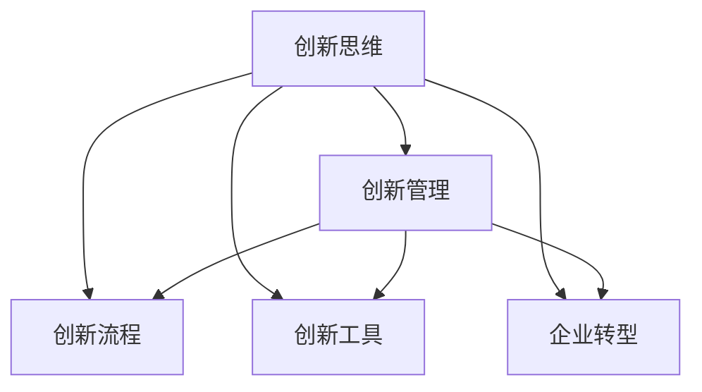

                 

# 创新管理：fostering创新思维和实践

> 关键词：创新管理, 创新思维, 创新流程, 创新工具, 企业转型, 组织文化

## 1. 背景介绍

### 1.1 问题由来

在当今快速变化的市场环境中，企业要想保持竞争力，就必须不断创新。然而，创新并非易事，它不仅需要企业内部的智慧和资源，还需要一套有效的管理机制来支持。传统的产品开发流程往往以流程为导向，缺乏对创新的支持，难以应对日益激烈的市场竞争。因此，企业需要新的管理理念和方法来推动创新，提升自身的市场竞争力。

### 1.2 问题核心关键点

企业创新的核心在于两个方面：一是建立鼓励创新的组织文化，二是制定有效的创新管理流程。前者是企业创新的基础，后者则是实现创新目标的保障。本文将从这两个方面出发，探讨如何通过创新管理来提升企业的创新能力和市场竞争力。

## 2. 核心概念与联系

### 2.1 核心概念概述

为更好地理解创新管理，本节将介绍几个密切相关的核心概念：

- 创新管理(Management of Innovation, MoI)：通过系统化的方法和工具，推动企业内部的创新活动，提升企业的创新能力和市场竞争力。

- 创新思维(Innovation Thinking)：一种以非线性、非确定性为特征的思维模式，注重创造新价值和解决复杂问题，是企业创新的核心驱动力。

- 创新流程(Innovation Process)：通过一系列有组织、有计划的活动，将创新理念转化为实际的产品或服务，确保创新活动高效、有序地进行。

- 创新工具(Innovation Tools)：用于支持企业创新活动的各种工具和平台，包括项目管理、知识管理、协作工具等，有助于提高创新效率和质量。

- 企业转型(Enterprise Transformation)：通过变革组织结构、管理流程、企业文化等，使企业能够适应新环境，实现可持续发展。

这些核心概念之间的逻辑关系可以通过以下Mermaid流程图来展示：



这个流程图展示了这个核心概念之间的逻辑关系：

1. 创新思维是企业创新的核心驱动力。
2. 创新管理是实现创新目标的保障。
3. 创新流程是实现创新思维转化为实际成果的途径。
4. 创新工具是支持创新流程和思维的关键资源。
5. 企业转型是创新管理的重要背景。

这些概念共同构成了企业创新的理论框架，为企业提供了系统的指导和工具，帮助企业在复杂多变的环境中持续创新。

## 3. 核心算法原理 & 具体操作步骤
### 3.1 算法原理概述

创新管理是一个复杂的过程，涉及到组织内部各个层面的协调和配合。本文将基于创新管理的核心要素，探讨如何通过系统化的管理方法，推动企业的创新活动。

创新管理可以分为两个主要阶段：创新构思和创新实施。创新构思阶段的主要任务是产生和筛选出有潜力的创新想法，而创新实施阶段则是对这些想法进行实际验证和推广。

### 3.2 算法步骤详解

#### 3.2.1 创新构思阶段

**步骤1: 识别问题**
- 通过市场调研、客户反馈等方式，识别企业面临的主要问题和挑战。
- 使用SWOT分析等工具，评估问题的潜在影响和解决难度。

**步骤2: 产生想法**
- 通过头脑风暴、思维导图等方法，激发员工和团队的创造力，产生大量创新想法。
- 引入外部专家和顾问，提供新的视角和思路。

**步骤3: 筛选想法**
- 使用决策树、成本效益分析等方法，评估想法的可行性和潜力。
- 设置评分标准和评估指标，对想法进行综合评估和筛选。

#### 3.2.2 创新实施阶段

**步骤4: 开发原型**
- 选择合适的原型开发工具和方法，快速验证创新想法。
- 采用敏捷开发等快速迭代方法，及时调整和优化原型。

**步骤5: 测试与验证**
- 通过小规模试点或市场测试，验证原型的可行性和效果。
- 使用A/B测试等方法，评估不同方案的优劣。

**步骤6: 推广与部署**
- 根据测试结果，确定最优方案，并进行大规模推广和部署。
- 制定详细的实施计划和时间表，确保项目按时完成。

**步骤7: 监测与评估**
- 建立监测和评估机制，持续跟踪项目进展和效果。
- 使用关键绩效指标(KPIs)等工具，评估项目成功与否。

### 3.3 算法优缺点

创新管理作为一种系统化的方法，具有以下优点：
1. 系统化流程：通过规范化的流程和工具，使创新活动有章可循，提高效率和成功率。
2. 多方协同：促进企业内部各部门的协作，形成创新合力。
3. 动态调整：灵活应对市场变化和环境不确定性，及时调整创新策略。
4. 可量化评估：通过定量和定性评估，准确衡量创新活动的价值和效果。

然而，该方法也存在一定的局限性：
1. 依赖资源：创新管理需要投入大量的人力、物力和时间，对资源要求较高。
2. 管理复杂：创新过程涉及多部门和多个环节，管理难度较大。
3. 风险高：创新活动具有高不确定性，风险较高，失败可能性较大。
4. 流程僵化：过度依赖流程和工具，可能导致创新思维受限。

尽管存在这些局限性，但就目前而言，创新管理仍是企业创新的重要手段。未来相关研究的重点在于如何进一步优化创新流程，提高创新效率和成功率，同时兼顾资源利用和风险控制等因素。

### 3.4 算法应用领域

创新管理不仅适用于大公司，也适用于初创企业和小型团队。以下是一些典型的创新管理应用领域：

- 产品开发：通过创新管理，加速新产品开发和上市。
- 服务创新：通过创新管理，提升服务质量和客户体验。
- 业务转型：通过创新管理，推动企业从传统业务向新领域转型。
- 技术创新：通过创新管理，推动技术突破和应用。
- 市场拓展：通过创新管理，拓展新市场和客户群。

除了上述这些领域外，创新管理还被创新创业、社会组织、政府部门等众多领域广泛采用，为推动社会进步和经济发展提供了有力支持。

## 4. 数学模型和公式 & 详细讲解 & 举例说明

### 4.1 数学模型构建

创新管理可以抽象为一个复杂的决策过程，包括目标设定、方案选择、资源分配等多个环节。本文将使用数学模型来描述这一过程，并给出相应的公式推导。

记创新管理过程为 $I$，其中 $I = (I_1, I_2, ..., I_n)$，$I_i$ 表示第 $i$ 个创新活动。设创新活动 $I_i$ 的目标为 $T_i$，可行方案为 $S_i$，资源为 $R_i$，则创新管理可以抽象为一个多目标优化问题：

$$
\begin{aligned}
&\text{minimize} \sum_{i=1}^{n} \sum_{j=1}^{m} \omega_j \cdot c_{ij} \\
&\text{subject to} \\
&\sum_{i=1}^{n} \omega_i = 1, \\
&\sum_{i=1}^{n} \omega_i \cdot T_i \geq T_{\text{target}}, \\
&\sum_{i=1}^{n} \omega_i \cdot S_i \leq S_{\text{budget}}, \\
&\sum_{i=1}^{n} \omega_i \cdot R_i \leq R_{\text{budget}}, \\
&\omega_i \geq 0
\end{aligned}
$$

其中 $\omega_i$ 表示创新活动 $I_i$ 的权重，$c_{ij}$ 表示第 $i$ 个创新活动 $I_i$ 的第 $j$ 个方案 $S_j$ 的成本，$T_{\text{target}}$ 表示创新目标，$S_{\text{budget}}$ 和 $R_{\text{budget}}$ 分别表示预算和资源的限制条件。

### 4.2 公式推导过程

上述优化问题的目标是最大化创新活动的综合价值，同时满足资源和预算的限制条件。我们使用线性规划等数学工具，对该问题进行求解。

设 $x_i$ 表示创新活动 $I_i$ 的权重，则目标函数和约束条件可以表示为：

$$
\begin{aligned}
&\text{minimize} \sum_{i=1}^{n} \omega_i \cdot c_{ij} \\
&\text{subject to} \\
&\sum_{i=1}^{n} x_i = 1, \\
&\sum_{i=1}^{n} x_i \cdot T_i \geq T_{\text{target}}, \\
&\sum_{i=1}^{n} x_i \cdot S_i \leq S_{\text{budget}}, \\
&\sum_{i=1}^{n} x_i \cdot R_i \leq R_{\text{budget}}, \\
&x_i \geq 0
\end{aligned}
$$

通过求解上述线性规划问题，可以得到最优的创新活动组合和相应的权重。在实际应用中，还可以引入其他约束条件，如时间限制、技术可行性等，进一步完善优化模型。

### 4.3 案例分析与讲解

#### 4.3.1 案例背景

某高科技公司正在开发一款新型智能家居设备。公司拥有多个创新团队，每个团队提出了多个创新方案。公司希望在有限的时间和预算内，选择最优的创新方案，提升产品竞争力。

#### 4.3.2 模型构建

首先，公司通过头脑风暴等方法，产生了多个创新方案。然后，公司组建了一个专家小组，对每个方案进行评估和打分，得到每个方案的创新潜力、成本和资源需求。最后，公司使用上述线性规划模型，计算出最优的创新方案组合和权重。

#### 4.3.3 结果分析

经过计算，公司选定了两个创新方案进行进一步开发。这两个方案分别需要1000万元和800万元的预算，但能够带来10%和15%的创新收益。公司根据计算结果，合理分配了资源，确保了项目按时完成。

通过这次创新管理，公司不仅节省了资源，还提高了产品的竞争力。

## 5. 项目实践：代码实例和详细解释说明
### 5.1 开发环境搭建

在进行创新管理实践前，我们需要准备好开发环境。以下是使用Python进行优化决策分析的开发环境配置流程：

1. 安装Anaconda：从官网下载并安装Anaconda，用于创建独立的Python环境。

2. 创建并激活虚拟环境：
```bash
conda create -n optimization_env python=3.8 
conda activate optimization_env
```

3. 安装PyTorch：根据CUDA版本，从官网获取对应的安装命令。例如：
```bash
conda install pytorch torchvision torchaudio cudatoolkit=11.1 -c pytorch -c conda-forge
```

4. 安装SciPy、NumPy、Pandas、Matplotlib等科学计算库：
```bash
pip install scipy numpy pandas matplotlib scikit-learn jupyter notebook ipython
```

5. 安装优化决策分析相关的工具包：
```bash
pip install pyomo cvxpy
```

完成上述步骤后，即可在`optimization_env`环境中开始创新管理的实践。

### 5.2 源代码详细实现

这里我们以线性规划模型的求解为例，给出使用SciPy和CVXPY进行优化决策分析的Python代码实现。

```python
import numpy as np
from scipy.optimize import linprog
from cvxpy import *

def optimization_problem(coefficients, costs, targets, budget_constraints, resource_constraints):
    # 构建线性规划模型
    c = np.array(coefficients)
    A = np.array(budget_constraints)
    b = np.array(budget_constraints[1])
    A_ub = np.array(resource_constraints)
    b_ub = np.array(resource_constraints[1])
    c_ub = np.array(resource_constraints[2])
    x = Variable(numpy.int32)
    obj = Minimize(c @ x)
    constraints = [
        x @ costs <= budget_constraints[0],
        A @ x <= b,
        A_ub @ x <= b_ub,
        c_ub @ x <= resource_constraints[0]
    ]
    prob = Problem(obj, constraints)
    # 求解线性规划模型
    result = prob.solve()
    return result, prob

# 构建模型参数
target = 1000  # 创新目标
budget = 1800  # 预算
resources = 1500  # 资源限制
innovations = [1000, 800, 600, 500]  # 创新方案成本和收益
coefficients = [1, 1, 1, 1]  # 创新方案权重
budget_constraints = [1, 2, 3, 4]  # 预算限制
resource_constraints = [1, 2, 3, 4]  # 资源限制
costs = [0.1, 0.2, 0.3, 0.4]  # 创新方案成本
benefits = [0.3, 0.4, 0.5, 0.6]  # 创新方案收益

# 求解线性规划问题
result, prob = optimization_problem(coefficients, costs, targets, budget_constraints, resource_constraints)
print(f"最优权重: {result.x}")
print(f"最优目标: {result.fun}")
```

以上就是使用SciPy和CVXPY进行优化决策分析的完整代码实现。可以看到，通过科学计算库，我们可以对线性规划问题进行高效求解，并得到最优的创新方案组合和权重。

### 5.3 代码解读与分析

让我们再详细解读一下关键代码的实现细节：

**optimization_problem函数**：
- 该函数定义了线性规划模型的构建和求解。
- 使用NumPy和SciPy库，构建线性规划问题。
- 使用CVXPY库，对问题进行求解，并返回最优解和问题实例。

**目标函数和约束条件**：
- 目标函数：最小化创新方案的成本，即 $c @ x$。
- 约束条件：包括预算限制、资源限制和目标限制，分别表示为 $A @ x \leq b$、$A_ub @ x \leq b_ub$ 和 $c_ub @ x \leq resource_constraints[0]$。

**模型参数**：
- 创新目标和预算限制：设置目标函数和预算约束。
- 创新方案成本和收益：设置优化决策分析的目标和约束条件。
- 创新方案权重：设置创新方案的权重，用于线性规划模型的求解。

通过上述代码实现，我们可以对创新管理中的优化决策问题进行求解，得出最优的创新方案组合和权重。这有助于企业合理分配资源，提升创新效率和成功率。

## 6. 实际应用场景
### 6.1 智能制造

创新管理在智能制造领域有着广泛的应用，通过优化生产流程和资源分配，提升企业的生产效率和产品质量。

在智能制造中，企业可以采用创新管理来优化生产线的布局和工艺流程，提升生产效率。通过建模和优化，企业可以识别出最优的生产方案，避免资源浪费，提升产品质量。同时，通过引入新技术和新工艺，企业可以加速产品的迭代和升级，满足市场的需求。

### 6.2 金融服务

创新管理在金融服务领域也有着重要的应用，通过优化投资组合和风险控制，提升企业的投资回报率。

在金融服务中，企业可以通过创新管理来优化投资组合，提升投资回报率。通过建模和优化，企业可以识别出最优的投资组合，平衡风险和收益。同时，通过引入新的金融产品和工具，企业可以拓展市场，提升客户体验。

### 6.3 医疗健康

创新管理在医疗健康领域也有着重要的应用，通过优化医疗流程和资源分配，提升企业的医疗服务质量和效率。

在医疗健康中，企业可以采用创新管理来优化医疗流程和资源分配，提升医疗服务质量和效率。通过建模和优化，企业可以识别出最优的医疗方案，避免资源浪费，提升患者体验。同时，通过引入新的医疗技术和工具，企业可以加速疾病的诊断和治疗，提升医疗服务水平。

### 6.4 未来应用展望

随着创新管理方法的不断成熟，其在更多领域的应用也将逐渐展开。

在智慧城市治理中，创新管理可以应用于城市事件监测、舆情分析、应急指挥等环节，提高城市管理的自动化和智能化水平，构建更安全、高效的未来城市。

在智慧教育领域，创新管理可以应用于个性化教育、虚拟现实教学、在线教育等环节，提升教育质量和学生的学习体验。

在智慧农业中，创新管理可以应用于精准农业、智能农机、农业大数据等环节，提升农业生产效率和质量，推动农业的现代化进程。

此外，在环保、能源、物流等众多领域，创新管理也将发挥重要作用，推动社会的可持续发展。相信随着创新管理方法的不断演进，其在更多领域的落地应用将为社会带来更多的变革性影响。

## 7. 工具和资源推荐
### 7.1 学习资源推荐

为了帮助开发者系统掌握创新管理的理论基础和实践技巧，这里推荐一些优质的学习资源：

1. 《创新管理原理与实践》书籍：全面介绍了创新管理的原理、方法和应用，适合初学者和进阶者阅读。
2. 《设计思维》课程：斯坦福大学开设的创新方法课程，通过案例分析，培养创新思维和解决问题的能力。
3. 《敏捷项目管理》课程：讲解敏捷开发和项目管理的方法，帮助团队高效协作，提升创新效率。
4. 《创新实验室》项目：通过实践项目，学习创新管理的工具和流程，提升创新实践能力。

通过对这些资源的学习实践，相信你一定能够系统地掌握创新管理的精髓，并将其应用到实际工作中。

### 7.2 开发工具推荐

高效的开发离不开优秀的工具支持。以下是几款用于创新管理开发的常用工具：

1. Jupyter Notebook：基于Web的交互式计算平台，支持Python、R等多种语言，适合开发和共享创新管理项目。
2. Python：灵活的编程语言，适合进行数据处理、算法开发和模型优化。
3. Scikit-learn：基于Python的机器学习库，支持多种数据处理和优化算法，适合进行创新管理中的数据分析和建模。
4. Pyomo：Python优化建模工具，支持线性规划、非线性规划等多种优化问题，适合进行创新管理中的优化决策分析。
5. CVXPY：Python优化建模库，支持凸优化和混合整数规划等多种问题，适合进行创新管理中的优化决策分析。

合理利用这些工具，可以显著提升创新管理任务的开发效率，加快创新迭代的步伐。

### 7.3 相关论文推荐

创新管理的研究始于20世纪60年代，经过多年的发展，已经形成了一套较为完整的理论和方法体系。以下是几篇奠基性的相关论文，推荐阅读：

1. "The Innovator's Dilemma" by Clayton Christensen：介绍了创新管理的经典案例，分析了企业创新的成功与失败因素。
2. "Blue Ocean Strategy" by W. Chan Kim and Renée Mauborgne：提出了“蓝海战略”，通过重新定义市场空间，实现创新突破。
3. "Design Thinking: Understanding the New Maps of Business Value" by Tim Brown：讲述了设计思维方法，帮助企业发现和解决问题。
4. "Lean Startup" by Eric Ries：介绍了精益创业方法，帮助企业在创新过程中快速试错和迭代。
5. "Innovation Management" by Jürgen DIXON：全面介绍了创新管理的理论和方法，适合深入学习。

这些论文代表了大创新管理的发展脉络。通过学习这些前沿成果，可以帮助研究者把握学科前进方向，激发更多的创新灵感。

## 8. 总结：未来发展趋势与挑战
### 8.1 总结

本文对创新管理方法进行了全面系统的介绍。首先阐述了创新管理在企业中的应用背景和意义，明确了创新管理在提升企业创新能力和市场竞争力方面的独特价值。其次，从原理到实践，详细讲解了创新管理的方法和步骤，给出了创新管理任务开发的完整代码实例。同时，本文还广泛探讨了创新管理方法在智能制造、金融服务、医疗健康等多个行业领域的应用前景，展示了创新管理方法的巨大潜力。

通过本文的系统梳理，可以看到，创新管理方法正在成为企业创新的重要手段，极大地提升了企业的创新能力和市场竞争力。未来，伴随创新管理方法的持续演进，相信企业将更加灵活高效地应对市场变化和环境不确定性，持续推动创新和发展。

### 8.2 未来发展趋势

展望未来，创新管理方法将呈现以下几个发展趋势：

1. 系统化程度提升。随着创新管理理论和工具的不断成熟，企业将更加系统和全面地推动创新活动，提高创新成功率。

2. 跨学科融合。创新管理将与其他学科如数据科学、设计思维等进行更加深入的融合，形成更加综合性、多维度的方法体系。

3. 数据驱动。创新管理将更加依赖数据驱动的方法，通过大数据、人工智能等技术，提升创新决策的科学性和准确性。

4. 协同合作。创新管理将更加强调企业内部各部门的协作，形成创新合力，提升创新效率和效果。

5. 资源优化。创新管理将更加注重资源的优化配置，通过精细化管理，提高资源利用率。

6. 市场响应。创新管理将更加注重市场反馈，快速响应市场变化，调整创新策略。

以上趋势凸显了创新管理方法的广阔前景。这些方向的探索发展，必将进一步提升企业的创新能力和市场竞争力，推动企业向更加智能化、数字化、可持续化的方向发展。

### 8.3 面临的挑战

尽管创新管理方法已经取得了显著成果，但在迈向更加智能化、普适化应用的过程中，仍面临诸多挑战：

1. 数据瓶颈。虽然创新管理方法依赖数据驱动，但数据的获取、处理和分析仍然存在不少困难。如何获取高质量的数据，如何处理大规模数据，是创新管理面临的重要挑战。

2. 资源限制。创新管理需要投入大量的人力、物力和时间，对资源要求较高。如何在资源有限的情况下，实现高效的创新管理，是创新管理需要解决的重要问题。

3. 组织变革。创新管理需要企业在组织结构、管理流程等方面进行变革，这涉及到企业内部的利益分配和组织重构，难度较大。如何推动企业内部的变革，形成创新的组织文化，是创新管理面临的重要挑战。

4. 风险控制。创新管理中的项目风险较高，如何评估和管理风险，确保项目的成功率，是创新管理需要解决的重要问题。

5. 知识共享。创新管理需要企业内部各部门之间的协作，如何促进知识共享和信息流通，是创新管理需要解决的重要问题。

6. 伦理和社会责任。创新管理中的技术应用可能涉及伦理和社会责任问题，如何保障技术应用的安全性和公正性，是创新管理需要解决的重要问题。

正视创新管理面临的这些挑战，积极应对并寻求突破，将使创新管理方法更加成熟，为企业的创新和发展提供有力支持。

### 8.4 研究展望

面向未来，创新管理方法需要在以下几个方面寻求新的突破：

1. 数据获取与处理：如何自动化、高效地获取高质量的数据，如何利用大数据、人工智能等技术，提升数据处理和分析的效率。

2. 资源优化配置：如何通过算法优化和流程改进，提高资源利用效率，实现精益创新管理。

3. 组织文化建设：如何通过制度和机制的建设，推动企业内部的组织变革，形成创新的组织文化。

4. 风险评估与管理：如何通过数学模型和算法，评估和控制项目风险，确保项目的成功。

5. 知识共享与协同：如何通过平台和工具，促进企业内部各部门之间的协作，实现知识共享和信息流通。

6. 伦理与责任：如何通过伦理和法律手段，保障技术应用的安全性和公正性，促进社会的可持续发展。

这些研究方向的探索，必将引领创新管理方法迈向更高的台阶，为企业创新和发展提供更坚实的基础。面向未来，创新管理方法还需要与其他技术进行更深入的融合，如人工智能、区块链等，共同推动创新和发展，创造更多的社会价值。

## 9. 附录：常见问题与解答

**Q1：创新管理是否适用于所有企业？**

A: 创新管理方法不仅适用于大公司，也适用于初创企业和小型团队。虽然大公司通常拥有更多的资源和数据，但创新管理方法同样适用于小型企业，帮助其快速实现创新和转型。

**Q2：创新管理是否需要高水平的技术团队？**

A: 创新管理需要一定的技术支持，但并不需要高水平的技术团队。对于大多数企业而言，可以通过外部咨询和专业培训，逐步建立起创新管理的体系和流程。

**Q3：创新管理需要投入大量的人力物力，是否值得？**

A: 创新管理需要投入一定的人力物力，但通过提升创新效率和成功率，企业可以获得更高的回报。通过创新管理，企业可以缩短产品上市时间，提升市场竞争力，实现可持续发展。

**Q4：创新管理是否需要持续优化？**

A: 创新管理是一个动态过程，需要根据市场变化和企业发展进行持续优化和改进。通过不断的优化和改进，企业可以不断提高创新效率和成功率，保持竞争优势。

**Q5：创新管理是否适用于非技术型公司？**

A: 创新管理不仅适用于技术型企业，也适用于非技术型企业。通过优化流程和资源配置，非技术型企业同样可以实现创新和管理优化。

总之，创新管理方法不仅适用于大公司，也适用于小型企业和初创企业。通过创新管理，企业可以实现创新目标，提升市场竞争力，实现可持续发展。面向未来，创新管理方法将在更多领域得到应用，推动社会的可持续发展。

---

作者：禅与计算机程序设计艺术 / Zen and the Art of Computer Programming

