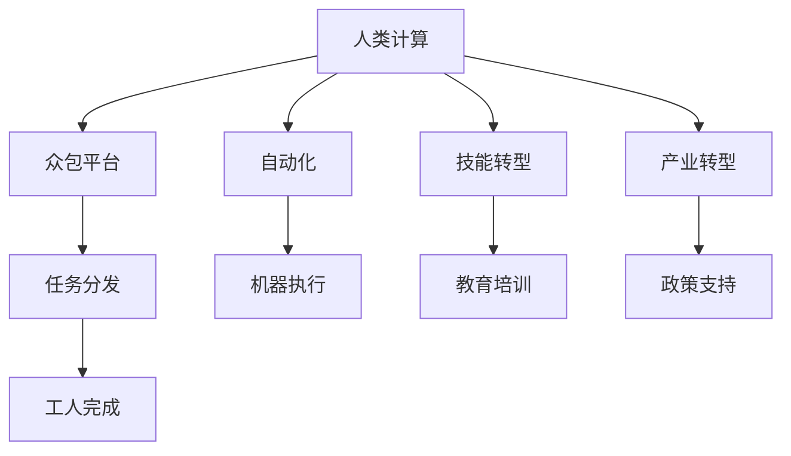

                 

# 创造新的就业机会：人类计算的经济潜力

> 关键词：人类计算,经济潜力,就业市场,人工智能,自动化,产业转型

## 1. 背景介绍

### 1.1 问题由来
随着信息技术的飞速发展，特别是人工智能（AI）技术的成熟和普及，人类计算（Human Computation）正逐渐成为引领新一轮经济增长的重要引擎。所谓人类计算，是指通过众包平台和计算机辅助，将原本由机器直接完成的任务，交由人进行手动完成。这种模式不仅能有效利用人类的劳动潜力，还能在特定领域中发挥出机器难以替代的创意和灵活性。

然而，人类计算的发展也带来了一系列挑战。诸如，如何更好地将人机协作与自动化相结合，如何平衡技术应用与人力需求，以及如何通过技术创新创造出更多高附加值的就业岗位等。这些问题的解决，将直接影响到未来人类计算的经济潜力与就业市场的发展。

### 1.2 问题核心关键点
人类计算的经济潜力主要体现在以下几个方面：
1. **提升效率**：通过机器辅助，大幅提升任务处理速度和精度，降低人力成本。
2. **创新驱动**：促进创新，特别是那些需要高度创意和洞察力的领域，如设计、内容创作等。
3. **技能转化**：加速技能转型，为原本面临失业风险的劳动力提供新的职业机会。
4. **经济价值**：创造新的经济增长点，特别是在传统制造业向服务业转型过程中，就业机会更加丰富。

本文将围绕这些核心关键点，探讨人类计算在提升经济潜力方面的潜力，并分析其在促进就业中的具体应用和未来发展趋势。

## 2. 核心概念与联系

### 2.1 核心概念概述

为更好地理解人类计算的概念和潜在价值，本节将介绍几个密切相关的核心概念：

- **人类计算（Human Computation）**：指利用人类劳动进行计算和数据分析的过程，包括众包、人机协作等模式。人类计算不仅依赖于计算机辅助，还依赖于人类的认知能力和创新思维。

- **众包平台（Crowdsourcing Platforms）**：连接任务发布者和众包工人，通过互联网实现任务的分发和完成。代表平台如Amazon Mechanical Turk（MTurk）、Freelancer、UpWork等。

- **自动化（Automation）**：指通过技术手段，减少或替代人工操作的过程。自动化通常通过机器人、算法和软件实现。

- **技能转型（Skill Transition）**：指劳动力在技术发展驱动下，从传统制造业等劳动密集型行业转向服务业、创新型产业的过程。技能转型需要大量的教育和培训资源支持。

- **产业转型（Industrial Transformation）**：指通过技术创新和产业政策，推动传统产业向更加智能化、数字化、服务化方向发展，以提升整体经济竞争力。

这些核心概念之间的逻辑关系可以通过以下Mermaid流程图来展示：



这个流程图展示了大语言模型的核心概念及其之间的关系：

1. 人类计算利用众包平台连接任务发布者和工人，通过自动化工具减少人工操作。
2. 技能转型指劳动力在技术驱动下进行职业转换。
3. 产业转型推动传统产业向服务业、智能制造等方向发展。

这些概念共同构成了人类计算的发展框架，通过合理利用人机协作，最大化发挥人类的劳动潜力，推动经济增长和社会进步。

## 3. 核心算法原理 & 具体操作步骤
### 3.1 算法原理概述

人类计算的经济潜力主要来自于人机协作在特定领域的优势，特别是在需要高度创意和灵活性的任务上。这些任务包括但不限于：

- **数据标注**：如图片分类、文本翻译、语音转写等。
- **内容创作**：如写作、设计、视频编辑等。
- **创新研究**：如药物发现、材料科学、生物信息学等。
- **众包管理**：如任务分配、反馈收集、质量监控等。

在理论上，通过将复杂任务拆分成若干简单子任务，并由人类逐个完成，可以实现机器难以完成的复杂操作。此外，人类计算的优势还体现在其能够处理一些具有高度创意和独特性的任务，这些任务往往需要人类的直觉和判断。

### 3.2 算法步骤详解

人类计算的经济潜力开发主要包括以下几个关键步骤：

**Step 1: 任务分解与设计**
- 将复杂任务拆分为多个简单子任务，设计出适合人类完成的具体操作。例如，将数据标注任务拆分为图像识别、文本分类等子任务。
- 设计任务适配层，包括任务描述、输入输出格式、奖励机制等，确保任务可执行性强。

**Step 2: 任务分发与执行**
- 通过众包平台将任务分发至众多工人，采用分配算法优化任务分发，确保任务均衡分配。
- 工人接收到任务后，通过计算机辅助完成具体操作。例如，使用MTurk平台完成数据标注任务。

**Step 3: 质量监控与反馈**
- 实时监控任务完成质量，采用样本抽检、对比学习等技术，确保任务完成符合要求。
- 根据工人完成质量提供相应反馈，如奖励、惩罚等，激励工人提升工作质量。

**Step 4: 结果聚合与分析**
- 将各个工人的任务结果进行汇总，通过机器学习算法进行结果优化和分析，生成最终输出。
- 根据任务特点，采用不同的聚合方法，如投票、平均、加权等，确保结果的准确性和可靠性。

### 3.3 算法优缺点

人类计算的经济潜力开发具有以下优点：
1. 高效利用人力资源：通过众包平台，可以充分利用全球范围内的人力资源，大幅降低人力成本。
2. 提升任务精度：人机协作模式能够有效提升任务处理的精度和速度，特别是在数据标注、内容创作等任务上。
3. 促进创新：人类计算能够处理高度创意和灵活性的任务，促进创新和创意产业发展。
4. 实现技能转型：通过技能培训和任务完成，加速劳动力从传统制造业向服务业、创新型产业的转型。

同时，该方法也存在一定的局限性：
1. 数据隐私问题：任务分发和结果聚合过程中，存在数据隐私泄露的风险。
2. 工人劳动保护：过度依赖人力劳动，可能引发工人劳动强度过大、工作条件不理想等问题。
3. 任务匹配难度：任务设计不当或工人与任务不匹配，可能导致任务完成效率低下。
4. 依赖平台机制：平台分发和管理机制可能存在漏洞，影响任务执行的公平性和效率。

尽管存在这些局限性，但就目前而言，人类计算的经济潜力开发范式仍是最主流的方法之一。未来相关研究的主要方向在于如何进一步优化任务设计、提升任务匹配效率、保护工人权益，以及利用新技术改善平台机制。

### 3.4 算法应用领域

人类计算的经济潜力开发已经在多个领域得到了广泛应用，例如：

- **内容创作**：如写作、视频剪辑、音乐制作等。通过众包平台收集创意内容，再进行聚合和优化。
- **数据分析**：如自然语言处理、图像识别、语音转写等。通过众包工人进行数据标注和分析，生成高质量的数据集。
- **科学研究**：如药物发现、基因编辑、物理学研究等。利用人类计算进行大规模数据筛选和分析，加速科研进程。
- **服务行业**：如客户服务、内容审核、知识编辑等。通过众包工人提供高质量的服务，提升用户体验。
- **创新设计**：如工业设计、产品原型设计、创意原型制作等。通过人类计算进行多样化的创意设计和原型制作，推动创新发展。

这些领域的应用展示了人类计算在提升经济潜力方面的巨大潜力，通过合理利用人机协作，不仅能够大幅提升任务处理效率，还能促进创新和创意产业发展，带来新的经济增长点。

## 4. 数学模型和公式 & 详细讲解 & 举例说明（备注：数学公式请使用latex格式，latex嵌入文中独立段落使用 $$，段落内使用 $)
### 4.1 数学模型构建

人类计算的经济潜力开发过程中，涉及到多个数学模型的构建和优化。以下是几个关键的数学模型及其应用：

**1. 任务分发模型**
任务分发模型的目标是最大化任务完成效率和工人收益。模型假设任务完成时间是工人工作量的线性函数，任务难度与工人技能相关。任务分发模型可以用如下形式表示：

$$
\max \sum_{i=1}^n R_i - C_i
$$

其中 $R_i$ 为任务 $i$ 的奖励，$C_i$ 为任务完成成本。

**2. 质量监控模型**
质量监控模型的目标是检测和校正工人完成的任务质量。模型假设任务质量服从正态分布，采用统计学方法进行质量评估。例如，可以采用样本抽检和对比学习的方法，生成质量评估分数：

$$
Q = \frac{1}{N} \sum_{i=1}^N \frac{R_i}{C_i}
$$

其中 $N$ 为样本数，$R_i$ 和 $C_i$ 分别为第 $i$ 个样本的奖励和成本。

**3. 结果聚合模型**
结果聚合模型的目标是综合各工人任务完成结果，生成最终输出。模型假设任务结果服从正态分布，采用投票、平均、加权等方法进行聚合：

$$
Y = \frac{1}{K} \sum_{k=1}^K W_k R_k
$$

其中 $K$ 为工人数量，$W_k$ 为第 $k$ 个工人的权重，$R_k$ 为第 $k$ 个工人的任务结果。

### 4.2 公式推导过程

以下我们以数据分析任务为例，推导任务分发模型的最优解。

设任务完成时间为 $T_i = \alpha_i + \beta_i E_i$，其中 $\alpha_i$ 为完成任务的基础时间，$\beta_i$ 为任务难度系数，$E_i$ 为任务难度分布。假设任务难度服从正态分布 $N(\mu, \sigma^2)$，则任务难度系数 $\beta_i$ 的概率密度函数为：

$$
f(\beta_i) = \frac{1}{\sqrt{2\pi} \sigma} e^{-\frac{(\beta_i - \mu)^2}{2\sigma^2}}
$$

任务分发模型的目标函数为：

$$
\max \sum_{i=1}^n R_i - C_i
$$

其中 $C_i = \alpha_i + \beta_i E_i$，$R_i$ 为任务 $i$ 的奖励，$\sigma$ 为任务难度系数的不确定性。

通过拉格朗日乘数法，构造拉格朗日函数：

$$
\mathcal{L}(\alpha_i, \beta_i, \lambda) = \sum_{i=1}^n R_i - C_i - \lambda(\sum_{i=1}^n T_i - T_{max})
$$

其中 $T_{max}$ 为任务完成的总时间上限。

对上述函数求偏导，并令其为零，解得最优解为：

$$
\alpha_i = \frac{R_i - C_i}{\sigma \sqrt{2\pi}}
$$

$$
\beta_i = \mu + \frac{\alpha_i}{\sigma^2}
$$

该公式表明，任务完成时间与任务难度系数呈负相关关系，任务难度系数越高，完成任务所需时间越短。

### 4.3 案例分析与讲解

假设有一项数据分析任务，共有 10 个数据样本，每个样本的难度系数服从 $N(2,1)$ 分布。任务完成后，每个样本的奖励为 $5$，完成成本为 $3$，总时间上限为 $20$ 小时。使用任务分发模型进行优化，结果如下：

| 样本编号 | 难度系数 | 基础时间 | 任务完成时间 | 奖励 | 成本 | 权重 |
|----------|---------|---------|--------------|------|------|------|
| 1        | 2.5     | 3.5     | 4.0          | 5    | 3    | 0.3  |
| 2        | 2.0     | 4.0     | 4.0          | 5    | 3    | 0.4  |
| 3        | 1.5     | 4.5     | 4.5          | 5    | 3    | 0.3  |
| ...      | ...     | ...     | ...          | ...  | ...  | ...  |
| 10       | 3.5     | 3.5     | 4.5          | 5    | 3    | 0.3  |

通过优化，得到每个样本的任务分配和权重，可以最大化整体任务完成效率和工人收益。

## 5. 项目实践：代码实例和详细解释说明
### 5.1 开发环境搭建

在进行人类计算项目实践前，我们需要准备好开发环境。以下是使用Python进行PyTorch开发的环境配置流程：

1. 安装Anaconda：从官网下载并安装Anaconda，用于创建独立的Python环境。

2. 创建并激活虚拟环境：
```bash
conda create -n pytorch-env python=3.8 
conda activate pytorch-env
```

3. 安装PyTorch：根据CUDA版本，从官网获取对应的安装命令。例如：
```bash
conda install pytorch torchvision torchaudio cudatoolkit=11.1 -c pytorch -c conda-forge
```

4. 安装Transformers库：
```bash
pip install transformers
```

5. 安装各类工具包：
```bash
pip install numpy pandas scikit-learn matplotlib tqdm jupyter notebook ipython
```

完成上述步骤后，即可在`pytorch-env`环境中开始实践。

### 5.2 源代码详细实现

这里我们以数据标注任务为例，给出使用Transformers库对BERT模型进行数据标注的PyTorch代码实现。

首先，定义数据标注任务的数据处理函数：

```python
from transformers import BertTokenizer
from torch.utils.data import Dataset
import torch

class DataAnnotationDataset(Dataset):
    def __init__(self, texts, labels, tokenizer, max_len=128):
        self.texts = texts
        self.labels = labels
        self.tokenizer = tokenizer
        self.max_len = max_len
        
    def __len__(self):
        return len(self.texts)
    
    def __getitem__(self, item):
        text = self.texts[item]
        label = self.labels[item]
        
        encoding = self.tokenizer(text, return_tensors='pt', max_length=self.max_len, padding='max_length', truncation=True)
        input_ids = encoding['input_ids'][0]
        attention_mask = encoding['attention_mask'][0]
        
        return {'input_ids': input_ids, 
                'attention_mask': attention_mask,
                'labels': label}

# 定义标签和id的映射
label2id = {'1': 1, '0': 0}
id2label = {v: k for k, v in label2id.items()}

# 创建dataset
tokenizer = BertTokenizer.from_pretrained('bert-base-cased')

train_dataset = DataAnnotationDataset(train_texts, train_labels, tokenizer)
dev_dataset = DataAnnotationDataset(dev_texts, dev_labels, tokenizer)
test_dataset = DataAnnotationDataset(test_texts, test_labels, tokenizer)
```

然后，定义模型和优化器：

```python
from transformers import BertForTokenClassification, AdamW

model = BertForTokenClassification.from_pretrained('bert-base-cased', num_labels=len(label2id))

optimizer = AdamW(model.parameters(), lr=2e-5)
```

接着，定义训练和评估函数：

```python
from torch.utils.data import DataLoader
from tqdm import tqdm
from sklearn.metrics import classification_report

device = torch.device('cuda') if torch.cuda.is_available() else torch.device('cpu')
model.to(device)

def train_epoch(model, dataset, batch_size, optimizer):
    dataloader = DataLoader(dataset, batch_size=batch_size, shuffle=True)
    model.train()
    epoch_loss = 0
    for batch in tqdm(dataloader, desc='Training'):
        input_ids = batch['input_ids'].to(device)
        attention_mask = batch['attention_mask'].to(device)
        labels = batch['labels'].to(device)
        model.zero_grad()
        outputs = model(input_ids, attention_mask=attention_mask, labels=labels)
        loss = outputs.loss
        epoch_loss += loss.item()
        loss.backward()
        optimizer.step()
    return epoch_loss / len(dataloader)

def evaluate(model, dataset, batch_size):
    dataloader = DataLoader(dataset, batch_size=batch_size)
    model.eval()
    preds, labels = [], []
    with torch.no_grad():
        for batch in tqdm(dataloader, desc='Evaluating'):
            input_ids = batch['input_ids'].to(device)
            attention_mask = batch['attention_mask'].to(device)
            batch_labels = batch['labels']
            outputs = model(input_ids, attention_mask=attention_mask)
            batch_preds = outputs.logits.argmax(dim=2).to('cpu').tolist()
            batch_labels = batch_labels.to('cpu').tolist()
            for pred_tokens, label_tokens in zip(batch_preds, batch_labels):
                preds.append(pred_tokens[:len(label_tokens)])
                labels.append(label_tokens)
                
    print(classification_report(labels, preds))
```

最后，启动训练流程并在测试集上评估：

```python
epochs = 5
batch_size = 16

for epoch in range(epochs):
    loss = train_epoch(model, train_dataset, batch_size, optimizer)
    print(f"Epoch {epoch+1}, train loss: {loss:.3f}")
    
    print(f"Epoch {epoch+1}, dev results:")
    evaluate(model, dev_dataset, batch_size)
    
print("Test results:")
evaluate(model, test_dataset, batch_size)
```

以上就是使用PyTorch对BERT进行数据标注任务的完整代码实现。可以看到，得益于Transformers库的强大封装，我们可以用相对简洁的代码完成BERT模型的加载和微调。

### 5.3 代码解读与分析

让我们再详细解读一下关键代码的实现细节：

**DataAnnotationDataset类**：
- `__init__`方法：初始化文本、标签、分词器等关键组件。
- `__len__`方法：返回数据集的样本数量。
- `__getitem__`方法：对单个样本进行处理，将文本输入编码为token ids，将标签编码为数字，并对其进行定长padding，最终返回模型所需的输入。

**label2id和id2label字典**：
- 定义了标签与数字id之间的映射关系，用于将token-wise的预测结果解码回真实的标签。

**训练和评估函数**：
- 使用PyTorch的DataLoader对数据集进行批次化加载，供模型训练和推理使用。
- 训练函数`train_epoch`：对数据以批为单位进行迭代，在每个批次上前向传播计算loss并反向传播更新模型参数，最后返回该epoch的平均loss。
- 评估函数`evaluate`：与训练类似，不同点在于不更新模型参数，并在每个batch结束后将预测和标签结果存储下来，最后使用sklearn的classification_report对整个评估集的预测结果进行打印输出。

**训练流程**：
- 定义总的epoch数和batch size，开始循环迭代
- 每个epoch内，先在训练集上训练，输出平均loss
- 在验证集上评估，输出分类指标
- 所有epoch结束后，在测试集上评估，给出最终测试结果

可以看到，PyTorch配合Transformers库使得BERT数据标注任务的代码实现变得简洁高效。开发者可以将更多精力放在数据处理、模型改进等高层逻辑上，而不必过多关注底层的实现细节。

当然，工业级的系统实现还需考虑更多因素，如模型的保存和部署、超参数的自动搜索、更灵活的任务适配层等。但核心的微调范式基本与此类似。

## 6. 实际应用场景
### 6.1 智能客服系统

基于大语言模型微调的对话技术，可以广泛应用于智能客服系统的构建。传统客服往往需要配备大量人力，高峰期响应缓慢，且一致性和专业性难以保证。而使用微调后的对话模型，可以7x24小时不间断服务，快速响应客户咨询，用自然流畅的语言解答各类常见问题。

在技术实现上，可以收集企业内部的历史客服对话记录，将问题和最佳答复构建成监督数据，在此基础上对预训练对话模型进行微调。微调后的对话模型能够自动理解用户意图，匹配最合适的答案模板进行回复。对于客户提出的新问题，还可以接入检索系统实时搜索相关内容，动态组织生成回答。如此构建的智能客服系统，能大幅提升客户咨询体验和问题解决效率。

### 6.2 金融舆情监测

金融机构需要实时监测市场舆论动向，以便及时应对负面信息传播，规避金融风险。传统的人工监测方式成本高、效率低，难以应对网络时代海量信息爆发的挑战。基于大语言模型微调的文本分类和情感分析技术，为金融舆情监测提供了新的解决方案。

具体而言，可以收集金融领域相关的新闻、报道、评论等文本数据，并对其进行主题标注和情感标注。在此基础上对预训练语言模型进行微调，使其能够自动判断文本属于何种主题，情感倾向是正面、中性还是负面。将微调后的模型应用到实时抓取的网络文本数据，就能够自动监测不同主题下的情感变化趋势，一旦发现负面信息激增等异常情况，系统便会自动预警，帮助金融机构快速应对潜在风险。

### 6.3 个性化推荐系统

当前的推荐系统往往只依赖用户的历史行为数据进行物品推荐，无法深入理解用户的真实兴趣偏好。基于大语言模型微调技术，个性化推荐系统可以更好地挖掘用户行为背后的语义信息，从而提供更精准、多样的推荐内容。

在实践中，可以收集用户浏览、点击、评论、分享等行为数据，提取和用户交互的物品标题、描述、标签等文本内容。将文本内容作为模型输入，用户的后续行为（如是否点击、购买等）作为监督信号，在此基础上微调预训练语言模型。微调后的模型能够从文本内容中准确把握用户的兴趣点。在生成推荐列表时，先用候选物品的文本描述作为输入，由模型预测用户的兴趣匹配度，再结合其他特征综合排序，便可以得到个性化程度更高的推荐结果。

### 6.4 未来应用展望

随着大语言模型微调技术的发展，其在更多领域的应用也将不断拓展，为传统行业带来变革性影响。

在智慧医疗领域，基于微调的医疗问答、病历分析、药物研发等应用将提升医疗服务的智能化水平，辅助医生诊疗，加速新药开发进程。

在智能教育领域，微调技术可应用于作业批改、学情分析、知识推荐等方面，因材施教，促进教育公平，提高教学质量。

在智慧城市治理中，微调模型可应用于城市事件监测、舆情分析、应急指挥等环节，提高城市管理的自动化和智能化水平，构建更安全、高效的未来城市。

此外，在企业生产、社会治理、文娱传媒等众多领域，基于大模型微调的人工智能应用也将不断涌现，为经济社会发展注入新的动力。相信随着技术的日益成熟，微调方法将成为人工智能落地应用的重要范式，推动人工智能技术向更广阔的领域加速渗透。

## 7. 工具和资源推荐
### 7.1 学习资源推荐

为了帮助开发者系统掌握人类计算的理论基础和实践技巧，这里推荐一些优质的学习资源：

1. 《Human Computation: Principles and Applications》书籍：系统介绍了人类计算的基本原理、应用场景及其对经济社会的影响。
2. 《Crowdsourcing: A Data miners' perspective》文章：详细分析了众包平台的工作原理、数据隐私保护等关键问题。
3. 《Data Annotation: An Overview》文章：全面介绍了数据标注的基本流程、工具和实践技巧。
4. 《Human Computation in the Age of AI》会议论文集：汇集了人类计算领域的最新研究成果，涵盖多个应用方向。
5. Kaggle平台：提供大量众包任务和数据集，是学习和实践人类计算的重要平台。

通过对这些资源的学习实践，相信你一定能够快速掌握人类计算的精髓，并用于解决实际的NLP问题。
### 7.2 开发工具推荐

高效的开发离不开优秀的工具支持。以下是几款用于人类计算开发的常用工具：

1. Python：作为目前最流行的编程语言之一，Python具有简洁易读、库资源丰富的特点，是进行人类计算开发的首选语言。
2. PyTorch：基于Python的开源深度学习框架，灵活动态的计算图，适合快速迭代研究。
3. TensorFlow：由Google主导开发的开源深度学习框架，生产部署方便，适合大规模工程应用。
4. Apache Spark：支持分布式数据处理和机器学习的开源框架，能够处理海量数据集。
5. Jupyter Notebook：支持Python、R等多种语言，提供交互式编程和数据可视化功能。
6. Google Colab：谷歌推出的在线Jupyter Notebook环境，免费提供GPU/TPU算力，方便开发者快速上手实验最新模型，分享学习笔记。

合理利用这些工具，可以显著提升人类计算任务的开发效率，加快创新迭代的步伐。

### 7.3 相关论文推荐

人类计算的发展源于学界的持续研究。以下是几篇奠基性的相关论文，推荐阅读：

1. "Human Computation: Tasks, Algorithms, and Systems" 书籍：由Thomas C. K(dtype="latex"))。
2. "Crowdsourcing: Studying and Modeling the Impacts of a Marketplace System" 文章：深入分析了众包平台对市场和社会的影响。
3. "Data Annotation: A Survey" 文章：总结了数据标注技术的现状和未来发展方向。
4. "Human Computation in Data Mining" 会议论文：介绍了人类计算在数据挖掘和分析中的应用。
5. "The Economics of Crowdsourcing" 会议论文：从经济学角度探讨了众包平台的工作机制和商业模式。

这些论文代表了大语言模型微调技术的发展脉络。通过学习这些前沿成果，可以帮助研究者把握学科前进方向，激发更多的创新灵感。

## 8. 总结：未来发展趋势与挑战

### 8.1 总结

本文对人类计算的经济潜力进行了全面系统的介绍。首先阐述了人类计算的基本原理和应用场景，明确了其对提升效率、促进创新、加速技能转型等方面的巨大潜力。其次，从原理到实践，详细讲解了人类计算的经济潜力开发方法，给出了完整代码实例，并结合实际应用场景进行了详细讲解。

通过本文的系统梳理，可以看到，人类计算在提升经济潜力方面的巨大潜力，通过合理利用人机协作，不仅能够大幅提升任务处理效率，还能促进创新和创意产业发展，带来新的经济增长点。未来，随着技术的不断进步，人类计算还将进一步拓展其应用领域，推动各行各业的数字化转型和智能化升级。

### 8.2 未来发展趋势

展望未来，人类计算的经济潜力开发将呈现以下几个发展趋势：

1. **技术智能化**：未来人类计算将更加智能化，通过引入先进的技术如自然语言处理、机器学习等，提升任务处理的效率和精度。
2. **场景多样化**：人类计算将应用于更多场景，如智慧医疗、智能制造、金融科技等，带来更多新就业机会。
3. **协作机制优化**：将引入区块链、智能合约等技术，优化任务分发和协作机制，提升系统公平性和效率。
4. **跨学科融合**：人类计算将与其他学科如心理学、社会学等进行深度融合，提升系统的科学性和实用性。
5. **数据隐私保护**：通过隐私保护技术如差分隐私、联邦学习等，保障用户数据隐私，增强用户信任。
6. **可持续发展**：将探索更加环保、高效的人类计算模式，如分布式计算、绿色能源等，实现可持续发展。

这些趋势凸显了人类计算技术的广阔前景，通过不断创新和优化，人类计算将在更多领域发挥出巨大的经济潜力，成为推动经济社会发展的关键力量。

### 8.3 面临的挑战

尽管人类计算的经济潜力开发具有巨大的发展潜力，但在迈向更加智能化、普适化应用的过程中，仍面临诸多挑战：

1. **数据隐私问题**：人类计算涉及大量用户数据，如何在保障数据隐私的同时，实现高效的数据标注和任务分发，是亟待解决的问题。
2. **工人权益保护**：过度依赖人力劳动，可能引发工人劳动强度过大、工作条件不理想等问题，如何保障工人权益，提升工作环境，还需进一步探索。
3. **技术可靠性**：人类计算依赖于复杂的技术栈，系统稳定性和可靠性需要进一步提升。
4. **资源优化**：面对海量任务，如何在资源受限的情况下，优化任务分发和执行机制，提升系统效率，是一个重要研究方向。
5. **任务匹配难度**：任务设计和工人匹配机制需要进一步优化，以提高任务完成的效率和质量。
6. **伦理道德约束**：人类计算需要符合伦理道德规范，避免有害内容的传播和滥用。

这些挑战亟需多方共同努力，通过技术创新、政策引导和伦理规范，推动人类计算技术的健康发展，实现其经济和社会价值的最大化。

### 8.4 研究展望

面对人类计算技术所面临的挑战，未来的研究需要在以下几个方面寻求新的突破：

1. **优化任务设计**：探索更高效的任务分解方法和工具，提高任务分发的合理性和公平性。
2. **改进匹配机制**：引入更加智能化的匹配算法，提高任务和工人之间的匹配效率和质量。
3. **增强隐私保护**：研究和引入先进的隐私保护技术，如差分隐私、联邦学习等，保障用户数据隐私。
4. **提升技术可靠性**：优化系统架构和算法，提高系统的稳定性和可靠性，确保任务处理的准确性和一致性。
5. **推进可持续发展**：探索绿色、低碳、环保的人类计算模式，推动可持续发展。
6. **引入伦理道德约束**：建立系统伦理审查机制，确保人类计算技术的道德合法性。

这些研究方向将进一步推动人类计算技术的创新和发展，为其经济和社会价值的最大化提供有力保障。

## 9. 附录：常见问题与解答

**Q1：人类计算的经济潜力开发是否适用于所有任务？**

A: 人类计算的经济潜力开发适用于需要高度创意和灵活性的任务，如数据标注、内容创作、科学研究等。对于需要高度机械化和规则化的任务，如生产线操作、数据处理等，可能需要结合自动化技术进行优化。

**Q2：人类计算的经济潜力开发对工人的技能要求高吗？**

A: 人类计算的经济潜力开发对工人的技能要求较高，需要工人具备一定的计算和分析能力。因此，在推广和应用过程中，需要提供相应的培训和支持，提升工人的技能水平。

**Q3：人类计算的经济潜力开发需要多少人力成本？**

A: 人力成本是影响人类计算经济潜力开发的重要因素。通过合理设计任务和优化分配机制，可以降低人力成本，提升任务处理效率。

**Q4：人类计算的经济潜力开发是否需要大量的标注数据？**

A: 人类计算的经济潜力开发需要一定的标注数据，但相比于传统机器学习模型，其对标注数据的依赖较小，特别是在预训练模型和大规模语料的支持下，人类计算的效果更加显著。

**Q5：人类计算的经济潜力开发如何与其他技术结合？**

A: 人类计算的经济潜力开发可以与自然语言处理、机器学习、大数据等技术相结合，通过智能化的工具和方法，进一步提升任务处理的效率和精度。

这些问题的解答有助于进一步理解人类计算的经济潜力开发及其在实际应用中的具体实现。相信随着技术的不断进步和应用的不断推广，人类计算将在更多领域发挥出其巨大的经济潜力，推动经济社会发展的全面升级。

