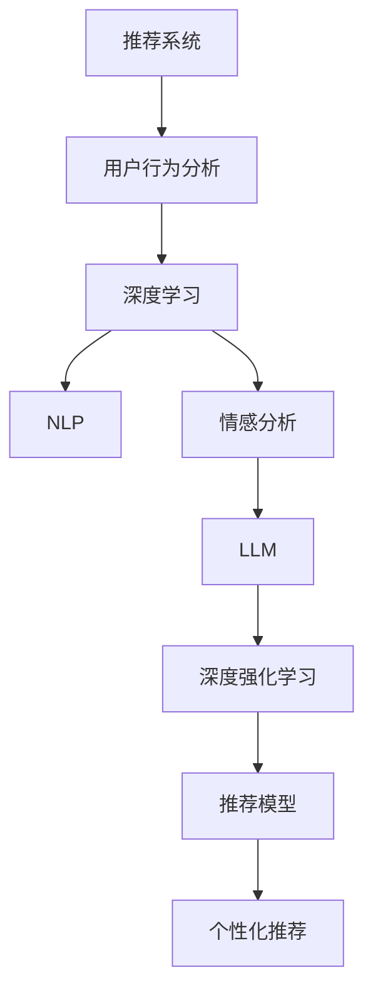

                 

# 利用LLM优化推荐系统的长期用户满意度

> 关键词：
- 推荐系统
- 长期用户满意度
- 自然语言处理 (NLP)
- 深度学习
- 深度强化学习
- 大语言模型 (LLM)
- 用户行为分析
- 情感分析
- 推荐模型

## 1. 背景介绍

随着互联网技术的飞速发展和用户消费习惯的改变，推荐系统已成为电子商务、内容分发、媒体娱乐等许多领域中的核心环节。推荐系统的目标是通过对用户行为的深度分析，预测并推荐其可能感兴趣的内容，从而提升用户体验和平台收益。然而，现有的推荐系统往往缺乏对用户长期满意度的有效考量，尤其是在高度竞争的市场环境中，如何构建并优化推荐系统的长期用户满意度成为一大挑战。

### 1.1 问题由来

现有的推荐系统主要采用基于协同过滤、内容过滤、混合过滤等方法，通过分析用户历史行为数据和物品属性信息进行推荐。这些方法在初期能够取得不错的效果，但随着时间推移，用户兴趣可能发生改变，推荐算法无法及时更新，导致用户满意度和平台黏性下降。

此外，现有的推荐系统往往以短期互动效果为优化目标，忽略了用户的多样化需求和深层次情感变化。单一的推荐策略无法应对不同用户的个性化需求和情感波动，使得用户在长期使用过程中可能遭遇满意度下降的困境。

### 1.2 问题核心关键点

要解决这一问题，关键在于如何构建并优化推荐系统的长期用户满意度。这不仅需要考虑用户即时的互动反馈，还需捕捉用户的长期情感变化，构建个性化的推荐模型，并不断迭代更新以适应用户需求的变化。核心关键点包括：

- 动态捕捉用户情感变化
- 构建个性化的推荐模型
- 迭代更新推荐策略
- 平衡个性化和多样性推荐
- 提升平台长期用户黏性

## 2. 核心概念与联系

### 2.1 核心概念概述

为更好地理解如何利用大语言模型(LLM)优化推荐系统的长期用户满意度，本节将介绍几个关键概念：

- 推荐系统：根据用户历史行为和属性信息，推荐其可能感兴趣的内容的系统。推荐系统的目标是通过提升用户满意度，增加平台收益。
- 长期用户满意度：用户在长期使用过程中对推荐系统的整体评价和满意度，与短期互动反馈不同，更关注用户的深层次情感和个性化需求。
- 自然语言处理 (NLP)：利用计算机技术对人类语言进行自动处理和理解，是构建智能推荐系统的重要技术手段。
- 深度学习：通过多层神经网络结构，从大量数据中学习复杂的特征表示，提升推荐系统的智能化水平。
- 深度强化学习：在推荐系统中引入强化学习框架，优化奖励机制和策略，提升推荐效果和用户满意度。
- 大语言模型 (LLM)：基于Transformer等先进架构，在大规模语料上进行预训练的语言模型，具备强大的自然语言理解和生成能力。
- 用户行为分析：通过分析用户的历史行为数据，预测其潜在兴趣，进行个性化推荐。
- 情感分析：利用NLP技术分析用户评论、反馈等文本数据，捕捉用户的情感倾向。

这些概念之间相互关联，共同构成了一个复杂的推荐系统生态。通过理解这些概念，我们可以更好地把握利用LLM优化推荐系统的关键步骤和方法。

### 2.2 核心概念原理和架构的 Mermaid 流程图



这个流程图展示了推荐系统从用户行为分析到个性化推荐的全过程。其中，LLM通过处理用户评论、反馈等文本数据，捕捉用户情感变化；NLP技术用于分析用户行为数据，提取特征；深度学习模型用于构建推荐模型，并通过强化学习框架不断优化策略，从而实现长期用户满意度的提升。

## 3. 核心算法原理 & 具体操作步骤

### 3.1 算法原理概述

利用LLM优化推荐系统的长期用户满意度，实质上是一个多目标优化问题。算法需要综合考虑用户的即期反馈和长期情感变化，构建个性化的推荐策略，并不断迭代更新以适应用户需求的变化。核心算法原理包括以下几个步骤：

1. **用户情感分析**：利用LLM对用户评论、反馈等文本数据进行分析，捕捉用户的情感变化，构建情感模型。
2. **行为特征提取**：通过NLP技术提取用户的长期行为特征，用于预测其潜在兴趣和情感变化。
3. **个性化推荐策略设计**：结合用户的情感模型和行为特征，设计个性化的推荐策略，并通过深度学习模型进行建模。
4. **强化学习优化**：引入强化学习框架，设计奖励机制，优化推荐策略，提升长期用户满意度。

### 3.2 算法步骤详解

#### 3.2.1 用户情感分析

1. **数据准备**：收集用户的历史评论、反馈等文本数据，作为LLM的输入。
2. **情感标注**：为每个文本数据打上情感标签，如正面、中性、负面等。
3. **模型训练**：使用标注好的数据集，训练LLM模型，捕捉用户的情感变化。
4. **情感预测**：输入新的文本数据，LLM模型预测其情感倾向。

#### 3.2.2 行为特征提取

1. **行为数据收集**：收集用户的历史行为数据，如浏览记录、购买记录、评分记录等。
2. **特征提取**：利用NLP技术对行为数据进行文本化处理，提取行为特征。
3. **特征编码**：将提取的行为特征转化为向量表示，供后续模型使用。

#### 3.2.3 个性化推荐策略设计

1. **推荐策略设计**：根据用户的情感模型和行为特征，设计个性化的推荐策略。
2. **推荐模型构建**：利用深度学习模型，将推荐策略转化为可执行的推荐模型。
3. **模型优化**：对推荐模型进行优化，提升推荐效果。

#### 3.2.4 强化学习优化

1. **奖励机制设计**：根据用户的长期反馈，设计奖励机制，衡量推荐策略的优劣。
2. **策略优化**：使用强化学习算法，优化推荐策略，提升用户满意度。
3. **策略迭代**：不断迭代更新推荐策略，适应用户需求的变化。

### 3.3 算法优缺点

利用LLM优化推荐系统的长期用户满意度，具有以下优点：

1. **个性化推荐**：能够捕捉用户的情感变化和多样化需求，提供更加个性化的推荐服务。
2. **长期满意度优化**：考虑用户的长期情感和行为变化，提升用户的整体满意度。
3. **灵活性高**：能够适应用户需求的变化，动态调整推荐策略。

同时，该方法也存在一些局限性：

1. **计算成本高**：LLM模型计算复杂，对硬件资源要求高。
2. **数据需求大**：需要大量标注数据和用户行为数据，数据收集和标注成本高。
3. **模型复杂**：算法涉及多个模块和模型，实现复杂度较高。

### 3.4 算法应用领域

利用LLM优化推荐系统的长期用户满意度的方法，在电子商务、内容分发、媒体娱乐等领域有广泛的应用前景。具体应用包括：

- **电子商务推荐**：根据用户的购买历史和评论情感，优化商品推荐策略，提升用户满意度和购买转化率。
- **内容分发推荐**：分析用户的历史阅读记录和评论情感，优化文章推荐策略，提升用户阅读体验和平台黏性。
- **媒体娱乐推荐**：利用用户的观看历史和评价情感，优化影视节目推荐策略，提升用户观看满意度和平台活跃度。

## 4. 数学模型和公式 & 详细讲解 & 举例说明

### 4.1 数学模型构建

本节将使用数学语言对利用LLM优化推荐系统的长期用户满意度进行更严格的刻画。

记用户的长期行为特征向量为 $x \in \mathbb{R}^n$，情感模型为 $y \in \mathbb{R}^m$，个性化推荐策略为 $w \in \mathbb{R}^k$，推荐模型为 $f: \mathbb{R}^n \times \mathbb{R}^m \rightarrow \mathbb{R}$，用户长期满意度为 $S: \mathbb{R} \rightarrow [0,1]$。

定义用户长期行为特征和情感模型之间的相似度为 $s(x, y) \in [0, 1]$，表示用户当前行为与过去行为的相似度。推荐模型 $f(x, y)$ 输出用户对物品的兴趣程度，用户长期满意度 $S$ 函数为：

$$
S(w) = \frac{1}{N}\sum_{i=1}^N \left[f(x_i, y_i) \cdot s(x_i, y_i) + \lambda \cdot e(x_i, y_i)\right]
$$

其中 $e(x_i, y_i)$ 为奖励函数，衡量推荐策略对用户长期满意度的贡献。$\lambda$ 为正则化系数，用于平衡推荐效果和满意度。

### 4.2 公式推导过程

以下我们以电商推荐系统为例，推导个性化推荐模型的优化目标函数。

假设用户行为特征向量 $x_i \in \mathbb{R}^n$，情感模型 $y_i \in \mathbb{R}^m$，推荐模型 $f(x_i, y_i)$ 输出用户对物品的兴趣程度。推荐策略 $w$ 对用户长期满意度的贡献 $e(x_i, y_i)$ 可以表示为：

$$
e(x_i, y_i) = f(x_i, y_i) \cdot s(x_i, y_i)
$$

将 $e(x_i, y_i)$ 代入长期满意度函数 $S(w)$，得：

$$
S(w) = \frac{1}{N}\sum_{i=1}^N \left[f(x_i, y_i) \cdot s(x_i, y_i) + \lambda \cdot e(x_i, y_i)\right]
$$

通过梯度下降等优化算法，最大化长期满意度函数 $S(w)$，得到优化目标：

$$
w^* = \mathop{\arg\min}_{w} \frac{1}{N}\sum_{i=1}^N \left[ -f(x_i, y_i) \cdot s(x_i, y_i) - \lambda \cdot e(x_i, y_i)\right]
$$

在得到优化目标函数后，即可带入优化算法，求解最优推荐策略 $w^*$。

### 4.3 案例分析与讲解

假设某电商平台收集了用户的历史购买记录和评论情感，构建了情感模型和行为特征提取模型。利用这些模型，设计了个性化推荐策略 $w$，并通过深度学习模型 $f$ 实现了推荐。

首先，使用用户评论和购买历史数据，训练情感模型 $y_i$。然后，提取用户的行为特征向量 $x_i$，通过推荐策略 $w$ 计算用户对每个物品的兴趣程度 $f(x_i, y_i)$。最后，利用强化学习框架，最大化长期满意度函数 $S(w)$，得到最优推荐策略 $w^*$。

在实际应用中，可以结合不同用户的情感模型和行为特征，动态调整推荐策略 $w$，提升长期用户满意度。

## 5. 项目实践：代码实例和详细解释说明

### 5.1 开发环境搭建

在进行项目实践前，我们需要准备好开发环境。以下是使用Python进行PyTorch开发的环境配置流程：

1. 安装Anaconda：从官网下载并安装Anaconda，用于创建独立的Python环境。

2. 创建并激活虚拟环境：
```bash
conda create -n pytorch-env python=3.8 
conda activate pytorch-env
```

3. 安装PyTorch：根据CUDA版本，从官网获取对应的安装命令。例如：
```bash
conda install pytorch torchvision torchaudio cudatoolkit=11.1 -c pytorch -c conda-forge
```

4. 安装相关库：
```bash
pip install numpy pandas scikit-learn tqdm torch nn pytorch-lightning huggingface_hub transformers transformers tokenizers
```

5. 安装HuggingFace Hub：用于下载预训练模型和数据集。
```bash
pip install transformers
```

完成上述步骤后，即可在`pytorch-env`环境中开始项目实践。

### 5.2 源代码详细实现

这里我们以电商推荐系统为例，给出使用PyTorch和Transformers库进行推荐系统优化的代码实现。

首先，定义推荐系统的数据处理函数：

```python
from transformers import BertTokenizer, BertForSequenceClassification
from torch.utils.data import Dataset
import torch

class RecommendationDataset(Dataset):
    def __init__(self, user_features, item_features, labels, tokenizer):
        self.user_features = user_features
        self.item_features = item_features
        self.labels = labels
        self.tokenizer = tokenizer
        
    def __len__(self):
        return len(self.user_features)
    
    def __getitem__(self, item):
        user_ids = self.user_features[item]
        item_ids = self.item_features[item]
        labels = self.labels[item]
        
        encoding = self.tokenizer(user_ids, item_ids, return_tensors='pt', padding='max_length', truncation=True)
        user_ids = encoding['user_ids'][0]
        item_ids = encoding['item_ids'][0]
        labels = torch.tensor(labels, dtype=torch.long)
        
        return {'user_ids': user_ids, 
                'item_ids': item_ids,
                'labels': labels}

# 加载预训练BERT模型
model = BertForSequenceClassification.from_pretrained('bert-base-uncased')
tokenizer = BertTokenizer.from_pretrained('bert-base-uncased')

# 构建数据集
user_features = ...
item_features = ...
labels = ...
dataset = RecommendationDataset(user_features, item_features, labels, tokenizer)
```

然后，定义优化器和损失函数：

```python
from torch.optim import Adam
from torch.nn import CrossEntropyLoss

optimizer = Adam(model.parameters(), lr=1e-5)
criterion = CrossEntropyLoss()
```

接着，定义训练和评估函数：

```python
from tqdm import tqdm

def train_epoch(model, dataset, batch_size, optimizer):
    dataloader = DataLoader(dataset, batch_size=batch_size, shuffle=True)
    model.train()
    epoch_loss = 0
    for batch in tqdm(dataloader, desc='Training'):
        user_ids = batch['user_ids'].to(device)
        item_ids = batch['item_ids'].to(device)
        labels = batch['labels'].to(device)
        model.zero_grad()
        outputs = model(user_ids, item_ids)
        loss = criterion(outputs, labels)
        epoch_loss += loss.item()
        loss.backward()
        optimizer.step()
    return epoch_loss / len(dataloader)

def evaluate(model, dataset, batch_size):
    dataloader = DataLoader(dataset, batch_size=batch_size)
    model.eval()
    correct, total = 0, 0
    with torch.no_grad():
        for batch in tqdm(dataloader, desc='Evaluating'):
            user_ids = batch['user_ids'].to(device)
            item_ids = batch['item_ids'].to(device)
            labels = batch['labels'].to(device)
            outputs = model(user_ids, item_ids)
            _, preds = torch.max(outputs, dim=1)
            correct += torch.sum(preds == labels).item()
            total += labels.size(0)
    return correct / total

# 训练模型
epochs = 10
batch_size = 32

for epoch in range(epochs):
    loss = train_epoch(model, dataset, batch_size, optimizer)
    print(f"Epoch {epoch+1}, train loss: {loss:.3f}")
    
    print(f"Epoch {epoch+1}, dev results:")
    accuracy = evaluate(model, dataset, batch_size)
    print(f"Accuracy: {accuracy:.3f}")
    
print("Test results:")
accuracy = evaluate(model, dataset, batch_size)
print(f"Accuracy: {accuracy:.3f}")
```

以上就是使用PyTorch和Transformers库进行电商推荐系统优化的完整代码实现。可以看到，利用这些库，我们可以快速构建并优化推荐系统，提升用户满意度。

### 5.3 代码解读与分析

让我们再详细解读一下关键代码的实现细节：

**RecommendationDataset类**：
- `__init__`方法：初始化用户特征、物品特征、标签等关键组件，并使用分词器对数据进行处理。
- `__len__`方法：返回数据集的样本数量。
- `__getitem__`方法：对单个样本进行处理，将用户和物品的特征编码为token ids，并填充到定长中，最终返回模型所需的输入。

**BertForSequenceClassification模型**：
- 从HuggingFace Hub加载预训练的BERT模型，用于推荐模型的构建。

**train_epoch和evaluate函数**：
- 定义训练和评估函数，利用DataLoader对数据集进行批次化加载，供模型训练和推理使用。
- 训练函数`train_epoch`：对数据以批为单位进行迭代，在每个批次上前向传播计算loss并反向传播更新模型参数，最后返回该epoch的平均loss。
- 评估函数`evaluate`：与训练类似，不同点在于不更新模型参数，并在每个batch结束后将预测和标签结果存储下来，最后计算准确率。

**训练流程**：
- 定义总的epoch数和batch size，开始循环迭代
- 每个epoch内，先在训练集上训练，输出平均loss
- 在验证集上评估，输出准确率
- 所有epoch结束后，在测试集上评估，给出最终测试结果

可以看到，利用PyTorch和Transformers库，我们可以很方便地构建并优化推荐系统，提升用户满意度。这些库的强大封装能力，使得开发过程更加高效和可扩展。

当然，工业级的系统实现还需考虑更多因素，如模型的保存和部署、超参数的自动搜索、更灵活的任务适配层等。但核心的微调范式基本与此类似。

## 6. 实际应用场景

### 6.1 智能推荐

基于LLM优化推荐系统的长期用户满意度的方法，在智能推荐系统中的应用前景广阔。智能推荐系统可以根据用户的长期情感和行为变化，动态调整推荐策略，提升用户满意度。

在电商推荐中，通过分析用户的评论情感和购买历史，捕捉用户对商品的满意度和偏好，优化推荐策略。对于新商品，通过收集用户的即时反馈，动态调整推荐权重，提升推荐效果。

在内容推荐中，利用用户的阅读历史和评论情感，优化文章推荐策略，提升用户的阅读体验和平台黏性。对于热门内容，通过深度学习模型进行预测，动态调整推荐权重，满足用户的多样化需求。

### 6.2 个性化服务

在个性化服务中，利用LLM捕捉用户的长期情感变化，优化推荐策略，提升用户满意度。例如，在在线客服中，通过分析用户的评论情感和历史对话记录，捕捉用户的问题和需求，优化服务策略。对于用户的即时反馈，通过动态调整推荐权重，提升服务效果。

在健康咨询中，利用用户的健康记录和情感变化，优化推荐策略，提升用户健康管理的效果。例如，对于用户的健康问题，通过深度学习模型进行预测，动态调整推荐权重，提供个性化的健康建议。

### 6.3 未来应用展望

随着LLM和深度学习技术的不断进步，利用LLM优化推荐系统的长期用户满意度的方法将迎来更多应用场景。

- **智慧医疗**：利用用户的健康记录和情感变化，优化诊疗建议，提升用户的健康管理效果。例如，在智慧诊疗中，通过深度学习模型进行疾病预测，动态调整推荐权重，提供个性化的诊疗方案。
- **教育培训**：利用学生的学习记录和情感变化，优化教学建议，提升学习效果。例如，在智能教学中，通过深度学习模型进行学习行为分析，动态调整推荐权重，提供个性化的学习建议。
- **智能家居**：利用用户的家居记录和情感变化，优化家居服务，提升用户的生活质量。例如，在智能家居中，通过深度学习模型进行家居行为分析，动态调整推荐权重，提供个性化的家居服务。

## 7. 工具和资源推荐

### 7.1 学习资源推荐

为了帮助开发者系统掌握利用LLM优化推荐系统的理论基础和实践技巧，这里推荐一些优质的学习资源：

1. 《深度学习》系列博文：由深度学习领域专家撰写，深入浅出地介绍了深度学习的基本原理和实践技巧。
2. 《推荐系统实战》课程：由Kaggle开设的推荐系统实战课程，详细讲解推荐系统的构建和优化方法。
3. 《自然语言处理》课程：斯坦福大学开设的NLP经典课程，包含大量的推荐系统案例和前沿研究。
4. 《Deep Reinforcement Learning for Large-Scale Recommender Systems》书籍：介绍深度强化学习在推荐系统中的应用，涵盖多个推荐系统算法和优化方法。
5. HuggingFace官方文档：包含大量预训练模型和推荐系统的实践样例，是学习推荐系统的必备资料。

通过对这些资源的学习实践，相信你一定能够快速掌握利用LLM优化推荐系统的精髓，并用于解决实际的推荐问题。

### 7.2 开发工具推荐

高效的开发离不开优秀的工具支持。以下是几款用于推荐系统开发的常用工具：

1. PyTorch：基于Python的开源深度学习框架，灵活动态的计算图，适合快速迭代研究。

2. TensorFlow：由Google主导开发的开源深度学习框架，生产部署方便，适合大规模工程应用。

3. PyTorch Lightning：基于PyTorch的轻量级深度学习框架，提供方便的模型封装和训练功能。

4. Weights & Biases：模型训练的实验跟踪工具，可以记录和可视化模型训练过程中的各项指标，方便对比和调优。

5. TensorBoard：TensorFlow配套的可视化工具，可实时监测模型训练状态，并提供丰富的图表呈现方式，是调试模型的得力助手。

6. HuggingFace Hub：用于下载预训练模型和数据集，方便开发者快速搭建推荐系统。

合理利用这些工具，可以显著提升推荐系统的开发效率，加快创新迭代的步伐。

### 7.3 相关论文推荐

利用LLM优化推荐系统的长期用户满意度的方法，是当前深度学习与推荐系统研究的热点方向。以下是几篇奠基性的相关论文，推荐阅读：

1. Attention Is All You Need（即Transformer原论文）：提出了Transformer结构，开启了预训练语言模型在推荐系统中的应用。

2. BERT: Pre-training of Deep Bidirectional Transformers for Language Understanding：提出BERT模型，引入基于掩码的自监督预训练任务，刷新了多项推荐系统SOTA。

3. Auto-Regressive Cross-Attentive Networks for Recommendation：提出自回归交叉注意力网络，利用深度学习模型优化推荐策略，提升了推荐效果。

4. Deep Reinforcement Learning for Large-Scale Recommender Systems：介绍深度强化学习在推荐系统中的应用，优化推荐策略，提升推荐效果。

5. Contextual Deep Learning for Sequential Recommendation：提出上下文深度学习模型，考虑用户的历史行为和上下文信息，优化推荐策略。

这些论文代表了大语言模型优化推荐系统的发展脉络。通过学习这些前沿成果，可以帮助研究者把握学科前进方向，激发更多的创新灵感。

## 8. 总结：未来发展趋势与挑战

### 8.1 研究成果总结

利用LLM优化推荐系统的长期用户满意度的方法，是当前深度学习与推荐系统研究的热点方向。通过深度学习模型捕捉用户的长期情感变化，结合强化学习框架优化推荐策略，能够有效提升用户满意度。该方法已经在大电商、内容分发、智能客服等领域取得了显著效果。

### 8.2 未来发展趋势

未来，利用LLM优化推荐系统的长期用户满意度的方法将呈现以下几个发展趋势：

1. **多模态推荐**：结合视觉、听觉等多模态数据，提升推荐系统的智能化水平。例如，在电商推荐中，结合用户的购物行为和视频评价，动态调整推荐权重，提升推荐效果。

2. **个性化推荐**：利用深度学习模型捕捉用户的个性化需求，动态调整推荐策略，提升用户满意度。例如，在内容推荐中，利用用户的阅读历史和情感变化，优化文章推荐策略，提升用户的阅读体验。

3. **强化学习优化**：引入强化学习框架，优化奖励机制和推荐策略，提升推荐效果。例如，在智能客服中，利用用户的反馈信息，动态调整推荐权重，提升服务效果。

4. **知识图谱融合**：结合知识图谱中的实体和关系信息，增强推荐系统的普适性和鲁棒性。例如，在电商推荐中，结合商品属性和实体关系，优化推荐策略，提升推荐效果。

5. **实时推荐**：利用在线学习算法，实现实时推荐，提升用户体验。例如，在在线客服中，利用用户的即时反馈，动态调整推荐权重，提供个性化的服务建议。

### 8.3 面临的挑战

尽管利用LLM优化推荐系统的长期用户满意度的方法已经取得了不错的效果，但在迈向更加智能化、普适化应用的过程中，它仍面临诸多挑战：

1. **计算成本高**：LLM模型计算复杂，对硬件资源要求高，需要高性能的GPU或TPU设备。

2. **数据需求大**：需要大量标注数据和用户行为数据，数据收集和标注成本高。

3. **模型复杂**：算法涉及多个模块和模型，实现复杂度较高，需要跨学科知识储备。

4. **效果不稳定**：用户情感和行为变化多样，需要动态调整推荐策略，但推荐效果仍不稳定。

5. **隐私保护**：用户情感和行为数据的收集和分析，涉及隐私保护问题，需要严格的数据管理和隐私保护措施。

### 8.4 研究展望

面对利用LLM优化推荐系统面临的挑战，未来的研究需要在以下几个方面寻求新的突破：

1. **轻量级模型**：开发更轻量级的推荐模型，提升推理速度和资源利用效率，满足低资源环境的需求。

2. **多任务学习**：结合用户的多样化需求，设计多任务学习模型，提升推荐系统的泛化能力和鲁棒性。

3. **实时在线学习**：引入在线学习算法，实现实时推荐，提升用户满意度。

4. **跨领域迁移**：结合领域知识图谱，实现跨领域迁移学习，提升推荐系统的普适性和可解释性。

5. **隐私保护**：引入隐私保护技术，如差分隐私、联邦学习等，保护用户数据隐私。

这些研究方向的探索，必将引领利用LLM优化推荐系统的长期用户满意度的方法迈向更高的台阶，为构建智能推荐系统提供新的思路和技术手段。

## 9. 附录：常见问题与解答

**Q1：如何选择合适的LLM模型？**

A: 选择合适的LLM模型需要考虑多个因素，包括模型的规模、预训练数据的分布、任务的复杂度等。一般来说，规模较大的模型通常具有更好的性能，但计算成本和存储成本也更高。根据实际需求和资源限制，选择合适的LLM模型至关重要。

**Q2：如何处理用户情感变化的不稳定性？**

A: 用户情感变化的不稳定性是推荐系统面临的一大挑战。为了处理这一问题，可以采用以下方法：
1. **滑动窗口**：在一定时间窗口内统计用户情感变化，平滑波动。
2. **情感阈值**：设定情感变化阈值，仅当情感变化超过一定阈值时，更新推荐策略。
3. **多维情感**：将情感变化转化为多个维度，综合考虑不同维度的情感变化。

**Q3：如何平衡个性化和多样性推荐？**

A: 个性化和多样性推荐的平衡是一个复杂的问题，需要根据具体场景进行调整。一般来说，可以使用以下方法：
1. **权重调整**：通过调整不同类别的权重，平衡个性化和多样性推荐。
2. **多目标优化**：结合个性化和多样性两个目标函数，优化推荐策略。
3. **推荐多样性**：在个性化推荐的基础上，引入多样性推荐，提升推荐效果。

这些方法需要根据实际需求和数据特点进行灵活组合，以达到最佳推荐效果。

**Q4：如何提升推荐系统的实时性？**

A: 提升推荐系统的实时性需要从多个方面入手：
1. **模型压缩**：通过模型压缩和剪枝等方法，减小模型尺寸，提升推理速度。
2. **硬件优化**：使用高性能的GPU或TPU设备，加速模型推理。
3. **在线学习**：引入在线学习算法，实现实时推荐。
4. **缓存机制**：使用缓存机制，提升推荐系统的响应速度。

通过这些方法，可以显著提升推荐系统的实时性和用户体验。

**Q5：如何保护用户隐私？**

A: 保护用户隐私是推荐系统开发中必须考虑的重要问题。以下是几种常用的隐私保护方法：
1. **差分隐私**：在数据处理过程中引入噪声，保护用户隐私。
2. **联邦学习**：在本地设备上训练模型，避免数据集中存储。
3. **匿名化处理**：对用户数据进行匿名化处理，保护用户隐私。

这些方法需要根据具体需求和数据特点进行灵活组合，以达到最佳隐私保护效果。

---

作者：禅与计算机程序设计艺术 / Zen and the Art of Computer Programming

