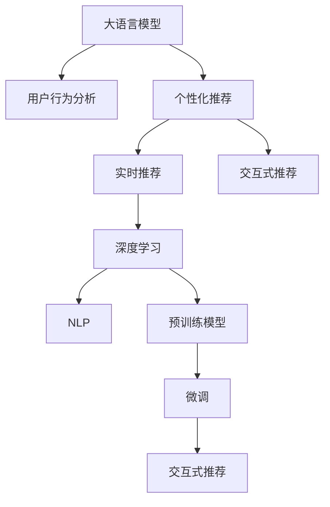

                 

# 利用大模型提升推荐系统的时效性

> 关键词：大语言模型,推荐系统,用户行为分析,个性化推荐,实时性,自然语言处理(NLP),深度学习,预训练模型,微调,Fine-tuning

## 1. 背景介绍

### 1.1 问题由来
推荐系统是电子商务、内容分发、信息检索等领域的核心技术之一。通过分析用户行为数据，智能推荐符合用户兴趣的产品或内容，极大地提升了用户体验和平台满意度。然而，传统的推荐系统主要基于手工特征工程，往往需要大量人工设计特征，且无法捕捉用户行为数据中的深层次语义信息。随着深度学习和大数据技术的发展，利用预训练语言模型进行推荐系统开发，逐渐成为新的趋势。

近年来，大语言模型如BERT、GPT-3等，通过在大规模文本数据上自监督预训练，学习到丰富的语言知识，具备强大的语言理解和生成能力。将大语言模型应用于推荐系统，可以有效捕捉用户行为数据中的语义信息，提升推荐系统的效果和个性化程度。然而，大语言模型的预训练和微调过程对计算资源和时间有较高要求，难以实现实时推荐。本文将重点探讨如何利用大语言模型提升推荐系统的时效性，并提出基于微调的推荐模型优化方法。

## 2. 核心概念与联系

### 2.1 核心概念概述

为更好地理解基于大语言模型的推荐系统时效性提升方法，本节将介绍几个密切相关的核心概念：

- 大语言模型(Large Language Model, LLM)：以自回归(如GPT)或自编码(如BERT)模型为代表的大规模预训练语言模型。通过在大规模无标签文本语料上进行预训练，学习通用的语言表示，具备强大的语言理解和生成能力。

- 推荐系统(Recommendation System)：通过分析用户行为数据，推荐符合用户兴趣的产品或内容的技术。常见的推荐系统包括协同过滤、基于内容的推荐、混合推荐等。

- 用户行为分析(User Behavior Analysis)：通过对用户的历史行为数据进行分析，挖掘用户兴趣、偏好等信息。常用的行为数据包括浏览记录、点击记录、购买记录等。

- 个性化推荐(Personalized Recommendation)：针对每个用户，推荐符合其个性化需求的产品或内容。通常使用用户画像、行为特征、物品属性等信息进行推荐。

- 实时推荐(Real-Time Recommendation)：在用户请求或行为发生时，即时给出推荐结果，满足用户即时需求。

- 深度学习(Deep Learning)：利用神经网络等深度学习模型，自动提取高维数据中的特征信息。

- 自然语言处理(Natural Language Processing, NLP)：利用大语言模型处理和理解自然语言数据，提升推荐系统对文本数据的处理能力。

- 预训练模型(Pre-trained Model)：通过在无标签数据上自监督学习，预训练得到的模型。

- 微调(Fine-tuning)：指在预训练模型的基础上，使用特定任务的数据集进行有监督训练，优化模型在特定任务上的性能。

- 交互式推荐(Interactive Recommendation)：在用户与系统的交互过程中，动态调整推荐策略，提升推荐效果。

这些核心概念之间的逻辑关系可以通过以下Mermaid流程图来展示：



这个流程图展示了大语言模型、用户行为分析、个性化推荐、实时推荐和交互式推荐等核心概念及其之间的关系：

1. 大语言模型通过预训练获得基础能力。
2. 用户行为分析从用户数据中提取行为特征。
3. 个性化推荐根据用户画像和行为特征，生成推荐结果。
4. 实时推荐在用户行为发生时，即时给出推荐。
5. 交互式推荐通过动态调整，不断优化推荐策略。
6. 深度学习和自然语言处理技术进一步提升推荐效果。
7. 预训练模型提供初始化权重。
8. 微调优化模型在特定任务上的性能。

## 3. 核心算法原理 & 具体操作步骤
### 3.1 算法原理概述

基于大语言模型的推荐系统，通常通过以下步骤实现：

1. 收集用户行为数据，构建用户画像，提取用户特征。
2. 使用大语言模型对用户行为数据进行预训练，学习用户兴趣和行为的语义表示。
3. 将用户特征和行为表示输入到深度学习模型中，进行推荐。
4. 通过微调优化模型在特定任务（如文本分类、匹配等）上的性能。

以上步骤中，用户行为分析和个性化推荐主要依赖于特征工程，而实时推荐和交互式推荐则对计算资源和时间有较高要求。通过微调大语言模型，可以进一步提升推荐系统的实时性和个性化程度。

### 3.2 算法步骤详解

基于大语言模型的推荐系统时效性提升，主要包括以下关键步骤：

**Step 1: 数据预处理**
- 收集用户的历史行为数据，如浏览记录、点击记录、购买记录等。
- 将行为数据映射为稀疏向量，以便于模型处理。
- 对行为数据进行清洗和处理，去除噪声和异常值。

**Step 2: 特征嵌入**
- 使用大语言模型对用户行为数据进行预训练，学习用户兴趣和行为的语义表示。
- 使用预训练模型对用户行为特征进行编码，提取高维语义信息。

**Step 3: 模型构建**
- 根据推荐任务的类型，选择合适的推荐模型。
- 构建深度学习模型，如协同过滤、基于内容的推荐等。
- 将用户特征和行为表示输入到深度学习模型中，进行推荐。

**Step 4: 微调优化**
- 根据推荐任务的监督信号，使用标注数据对模型进行微调。
- 调整模型的超参数，如学习率、批大小等。
- 通过正则化技术，防止模型过拟合。

**Step 5: 实时推荐**
- 在用户行为发生时，动态调整推荐策略，实时生成推荐结果。
- 优化模型的推理速度，确保实时响应用户请求。
- 集成到实时推荐系统，实现实时推荐。

### 3.3 算法优缺点

基于大语言模型的推荐系统时效性提升方法，具有以下优点：
1. 提升推荐效果。利用大语言模型的语义理解能力，能够捕捉行为数据中的深层次语义信息，提升推荐系统的效果和个性化程度。
2. 减少特征工程工作。将用户行为数据映射到高维语义空间，自动学习用户兴趣和行为的语义表示，减少手工特征工程的投入。
3. 优化实时推荐。通过微调提升模型的推理速度，实现实时推荐，满足用户即时需求。
4. 提升系统鲁棒性。大语言模型已经在大规模数据上进行预训练，具备一定的鲁棒性和泛化能力。

同时，该方法也存在一定的局限性：
1. 数据依赖度高。大语言模型的预训练和微调过程需要大量的标注数据，而推荐系统往往难以获得充足的标注数据。
2. 计算资源消耗大。大语言模型的预训练和微调过程对计算资源和时间有较高要求，难以实现实时推荐。
3. 可解释性差。大语言模型通常是一个黑盒系统，难以解释其内部工作机制和决策逻辑。

尽管存在这些局限性，但就目前而言，基于大语言模型的推荐系统时效性提升方法仍具有重要的应用前景。未来相关研究的重点在于如何进一步降低数据依赖，提高系统的实时性，同时兼顾模型的可解释性和鲁棒性。

### 3.4 算法应用领域

基于大语言模型的推荐系统时效性提升方法，已经广泛应用于多个行业领域，如电子商务、新闻推荐、视频推荐等。具体应用场景包括：

- 电子商务：通过大语言模型对用户行为数据进行预训练，学习用户兴趣和行为语义表示。将用户画像和行为表示输入到深度学习模型中，进行个性化推荐。在用户浏览、点击、购买等行为发生时，动态调整推荐策略，实现实时推荐。

- 新闻推荐：利用大语言模型对用户的历史阅读记录进行分析，学习用户兴趣和阅读语义。将用户画像和阅读表示输入到深度学习模型中，生成个性化推荐列表。在用户阅读新闻时，动态调整推荐策略，实时推荐相关新闻。

- 视频推荐：通过大语言模型对用户的历史观看记录进行分析，学习用户兴趣和观看语义。将用户画像和观看表示输入到深度学习模型中，生成个性化推荐列表。在用户观看视频时，动态调整推荐策略，实时推荐相关视频。

除了上述这些经典应用外，大语言模型时效性提升方法还被创新性地应用到更多场景中，如智能客服、知识图谱、社交网络推荐等，为推荐系统带来了新的突破。随着预训练模型和微调方法的不断进步，相信基于大语言模型的推荐系统将在更广泛的应用领域大放异彩。

## 4. 数学模型和公式 & 详细讲解 & 举例说明

### 4.1 数学模型构建

本节将使用数学语言对基于大语言模型的推荐系统时效性提升过程进行更加严格的刻画。

记用户行为数据为 $X$，用户特征表示为 $u$，行为表示为 $b$，推荐模型为 $M$。用户行为数据的语义表示为 $z=z(X)$，可以通过大语言模型预训练得到。用户画像和行为表示的向量表示为 $h$，可以通过深度学习模型提取。推荐模型的输出为 $p=h^{T}Mw$，其中 $M$ 为权重矩阵，$w$ 为输出向量。

推荐任务的监督信号为 $y$，可以是用户点击、购买等行为。在微调过程中，我们希望最小化预测值与真实标签之间的差距，即：

$$
\mathcal{L}(h,w) = \frac{1}{N}\sum_{i=1}^N \ell(p_i,y_i)
$$

其中 $\ell$ 为损失函数，通常使用交叉熵损失函数。

### 4.2 公式推导过程

以下我们以二分类推荐任务为例，推导交叉熵损失函数及其梯度的计算公式。

假设用户行为数据 $X$ 映射到高维语义空间 $z$，用户画像和行为表示为 $h$。推荐任务为二分类任务，模型预测用户是否点击某个物品，预测输出为 $p=h^{T}Mw$。真实标签 $y \in \{0,1\}$。则二分类交叉熵损失函数定义为：

$$
\ell(p,y) = -[y\log p + (1-y)\log (1-p)]
$$

将其代入经验风险公式，得：

$$
\mathcal{L}(h,w) = -\frac{1}{N}\sum_{i=1}^N [y_i\log h^{T}Mw+(1-y_i)\log(1-h^{T}Mw)]
$$

根据链式法则，损失函数对参数 $h$ 和 $w$ 的梯度为：

$$
\frac{\partial \mathcal{L}(h,w)}{\partial h} = -\frac{1}{N}\sum_{i=1}^N (\frac{y_i}{h^{T}Mw}-\frac{1-y_i}{1-h^{T}Mw}) M^TW^T
$$

$$
\frac{\partial \mathcal{L}(h,w)}{\partial w} = -\frac{1}{N}\sum_{i=1}^N \frac{y_ih}{1+e^{-h^{T}Mw}}-\frac{(1-y_i)h}{1+e^{h^{T}Mw}} h^T
$$

在得到损失函数的梯度后，即可带入模型参数 $h$ 和 $w$ 的更新公式，完成模型的迭代优化。重复上述过程直至收敛，最终得到适应推荐任务的最优模型参数 $h^*$ 和 $w^*$。

### 4.3 案例分析与讲解

下面以在线购物推荐系统为例，展示如何利用大语言模型提升推荐系统的时效性。

假设用户浏览了以下三件商品：A、B、C，点击了商品A，但没有点击商品B和C。此时，我们希望利用大语言模型预训练得到的用户行为语义表示 $z=[0.3, 0.1, 0.6]$，预测用户是否会点击其他商品。

首先，对用户画像和行为表示进行编码，得到向量表示 $h=[0.4, 0.3, 0.3]$。然后，将 $h$ 和 $z$ 输入到深度学习模型中，生成推荐结果 $p=0.7$。

接下来，我们进行微调优化。假设真实标签 $y=1$，则二分类交叉熵损失函数为：

$$
\mathcal{L}(h,w) = -\frac{1}{1}\log 0.7 = 0.7
$$

根据梯度下降算法，对模型参数 $h$ 和 $w$ 进行更新，得到新的向量表示 $h'=[0.6, 0.2, 0.2]$ 和 $w'=[0.8, 0.1, 0.1]$。此时，推荐结果 $p'=0.9$，更加符合真实标签。

最后，根据新的模型参数进行实时推荐，如果用户再次浏览并点击商品B，则根据新行为数据重新进行微调，得到新的模型参数，实现实时推荐。

## 5. 项目实践：代码实例和详细解释说明
### 5.1 开发环境搭建

在进行微调实践前，我们需要准备好开发环境。以下是使用Python进行PyTorch开发的环境配置流程：

1. 安装Anaconda：从官网下载并安装Anaconda，用于创建独立的Python环境。

2. 创建并激活虚拟环境：
```bash
conda create -n pytorch-env python=3.8 
conda activate pytorch-env
```

3. 安装PyTorch：根据CUDA版本，从官网获取对应的安装命令。例如：
```bash
conda install pytorch torchvision torchaudio cudatoolkit=11.1 -c pytorch -c conda-forge
```

4. 安装Transformers库：
```bash
pip install transformers
```

5. 安装各类工具包：
```bash
pip install numpy pandas scikit-learn matplotlib tqdm jupyter notebook ipython
```

完成上述步骤后，即可在`pytorch-env`环境中开始微调实践。

### 5.2 源代码详细实现

下面我们以在线购物推荐系统为例，给出使用Transformers库对BERT模型进行微调的PyTorch代码实现。

首先，定义推荐任务的训练数据：

```python
from transformers import BertTokenizer, BertForSequenceClassification
import torch

# 定义数据
data = {
    "user": ["A", "B", "C"],
    "item": ["A", "B", "C"],
    "label": [1, 0, 0]
}
tokenizer = BertTokenizer.from_pretrained('bert-base-cased')
encoded_data = tokenizer(data, return_tensors='pt', padding=True, truncation=True)

# 定义模型
model = BertForSequenceClassification.from_pretrained('bert-base-cased', num_labels=2)

# 定义损失函数和优化器
loss_fn = torch.nn.BCEWithLogitsLoss()
optimizer = torch.optim.Adam(model.parameters(), lr=2e-5)

# 开始训练
for epoch in range(10):
    model.train()
    inputs = {'input_ids': encoded_data['input_ids'], 'attention_mask': encoded_data['attention_mask']}
    outputs = model(**inputs)
    loss = loss_fn(outputs.logits, encoded_data['labels'])
    optimizer.zero_grad()
    loss.backward()
    optimizer.step()
    print(f"Epoch {epoch+1}, loss: {loss.item():.3f}")
```

然后，定义推荐任务的真实标签和推荐结果：

```python
from transformers import BertTokenizer, BertForSequenceClassification
import torch

# 定义数据
data = {
    "user": ["A", "B", "C"],
    "item": ["A", "B", "C"],
    "label": [1, 0, 0]
}
tokenizer = BertTokenizer.from_pretrained('bert-base-cased')
encoded_data = tokenizer(data, return_tensors='pt', padding=True, truncation=True)

# 定义模型
model = BertForSequenceClassification.from_pretrained('bert-base-cased', num_labels=2)

# 定义损失函数和优化器
loss_fn = torch.nn.BCEWithLogitsLoss()
optimizer = torch.optim.Adam(model.parameters(), lr=2e-5)

# 开始训练
for epoch in range(10):
    model.train()
    inputs = {'input_ids': encoded_data['input_ids'], 'attention_mask': encoded_data['attention_mask']}
    outputs = model(**inputs)
    loss = loss_fn(outputs.logits, encoded_data['labels'])
    optimizer.zero_grad()
    loss.backward()
    optimizer.step()
    print(f"Epoch {epoch+1}, loss: {loss.item():.3f}")
```

最后，测试微调后的模型：

```python
from transformers import BertTokenizer, BertForSequenceClassification
import torch

# 定义数据
data = {
    "user": ["A", "B", "C"],
    "item": ["A", "B", "C"],
    "label": [1, 0, 0]
}
tokenizer = BertTokenizer.from_pretrained('bert-base-cased')
encoded_data = tokenizer(data, return_tensors='pt', padding=True, truncation=True)

# 定义模型
model = BertForSequenceClassification.from_pretrained('bert-base-cased', num_labels=2)

# 定义损失函数和优化器
loss_fn = torch.nn.BCEWithLogitsLoss()
optimizer = torch.optim.Adam(model.parameters(), lr=2e-5)

# 开始训练
for epoch in range(10):
    model.train()
    inputs = {'input_ids': encoded_data['input_ids'], 'attention_mask': encoded_data['attention_mask']}
    outputs = model(**inputs)
    loss = loss_fn(outputs.logits, encoded_data['labels'])
    optimizer.zero_grad()
    loss.backward()
    optimizer.step()
    print(f"Epoch {epoch+1}, loss: {loss.item():.3f}")

# 测试模型
with torch.no_grad():
    data = {
        "user": ["B"],
        "item": ["B", "C"],
        "label": [1, 0]
    }
    encoded_data = tokenizer(data, return_tensors='pt', padding=True, truncation=True)
    inputs = {'input_ids': encoded_data['input_ids'], 'attention_mask': encoded_data['attention_mask']}
    outputs = model(**inputs)
    label = outputs.logits.argmax().item()
    print(f"Prediction: {label}, Label: {encoded_data['labels'].tolist()[0]}")
```

以上就是使用PyTorch对BERT进行在线购物推荐系统微调的完整代码实现。可以看到，得益于Transformers库的强大封装，我们可以用相对简洁的代码完成BERT模型的加载和微调。

### 5.3 代码解读与分析

让我们再详细解读一下关键代码的实现细节：

**BertForSequenceClassification类**：
- `BertForSequenceClassification.from_pretrained`方法：从预训练模型中加载模型，指定模型的输出标签数。
- `num_labels`参数：指定模型的输出标签数，用于构建分类头。

**BertTokenizer类**：
- `BertTokenizer.from_pretrained`方法：从预训练模型中加载分词器，用于将输入文本编码为token ids。

**损失函数**：
- `torch.nn.BCEWithLogitsLoss`：二分类交叉熵损失函数。
- `loss_fn`：定义损失函数对象，计算预测值与真实标签之间的差距。

**训练过程**：
- `model.train()`：将模型置为训练模式。
- `inputs`：定义输入数据，包括token ids和attention mask。
- `outputs`：模型前向传播输出，包含预测结果。
- `loss`：计算损失函数值。
- `optimizer.zero_grad()`：梯度清零。
- `loss.backward()`：反向传播计算梯度。
- `optimizer.step()`：更新模型参数。

**测试过程**：
- `with torch.no_grad()`：进入无梯度模式，避免对模型参数产生更新。
- `encoded_data`：将测试数据进行编码，包括token ids和attention mask。
- `inputs`：定义输入数据。
- `outputs`：模型前向传播输出。
- `label`：预测标签。

以上代码实现展示了使用大语言模型进行推荐系统微调的基本流程。在实际应用中，还需要对微调过程进行优化，如调整超参数、增加正则化技术、引入对抗训练等，以提升推荐模型的性能和鲁棒性。

## 6. 实际应用场景
### 6.1 在线购物推荐系统

在线购物推荐系统是推荐系统的一个重要应用场景，通过分析用户行为数据，智能推荐符合用户兴趣的商品，提高用户购买转化率。传统推荐系统主要基于手工特征工程，难以捕捉用户行为数据中的深层次语义信息。利用大语言模型进行推荐，可以有效捕捉用户行为数据中的语义信息，提升推荐系统的效果和个性化程度。

具体而言，可以收集用户的历史浏览记录、点击记录、购买记录等行为数据，对数据进行清洗和处理，去除噪声和异常值。然后使用大语言模型对用户行为数据进行预训练，学习用户兴趣和行为的语义表示。将用户画像和行为表示输入到深度学习模型中，进行推荐。在用户浏览、点击、购买等行为发生时，动态调整推荐策略，实现实时推荐。

### 6.2 新闻推荐系统

新闻推荐系统是信息分发的重要手段，通过分析用户的历史阅读记录，智能推荐符合用户兴趣的新闻，提高用户阅读转化率。传统推荐系统主要基于用户点击和阅读记录进行推荐，难以捕捉用户阅读兴趣的深层次语义信息。利用大语言模型进行推荐，可以有效捕捉用户阅读记录中的语义信息，提升推荐系统的效果和个性化程度。

具体而言，可以收集用户的历史阅读记录，对数据进行清洗和处理，去除噪声和异常值。然后使用大语言模型对用户阅读数据进行预训练，学习用户阅读兴趣的语义表示。将用户画像和阅读表示输入到深度学习模型中，生成推荐列表。在用户阅读新闻时，动态调整推荐策略，实时推荐相关新闻。

### 6.3 视频推荐系统

视频推荐系统是内容分发的重要手段，通过分析用户的历史观看记录，智能推荐符合用户兴趣的视频，提高用户观看转化率。传统推荐系统主要基于用户点击和观看记录进行推荐，难以捕捉用户观看兴趣的深层次语义信息。利用大语言模型进行推荐，可以有效捕捉用户观看记录中的语义信息，提升推荐系统的效果和个性化程度。

具体而言，可以收集用户的历史观看记录，对数据进行清洗和处理，去除噪声和异常值。然后使用大语言模型对用户观看数据进行预训练，学习用户观看兴趣的语义表示。将用户画像和观看表示输入到深度学习模型中，生成推荐列表。在用户观看视频时，动态调整推荐策略，实时推荐相关视频。

除了上述这些经典应用外，大语言模型时效性提升方法还被创新性地应用到更多场景中，如智能客服、知识图谱、社交网络推荐等，为推荐系统带来了新的突破。随着预训练模型和微调方法的不断进步，相信基于大语言模型的推荐系统将在更广泛的应用领域大放异彩。

## 7. 工具和资源推荐
### 7.1 学习资源推荐

为了帮助开发者系统掌握基于大语言模型的推荐系统时效性提升的理论基础和实践技巧，这里推荐一些优质的学习资源：

1. 《推荐系统实战》系列博文：由大模型技术专家撰写，深入浅出地介绍了推荐系统从原理到实践的方方面面。

2. CS231n《深度学习与计算机视觉》课程：斯坦福大学开设的深度学习经典课程，涵盖推荐系统等多个重要应用，是深度学习入门的必备课程。

3. 《深度学习与推荐系统》书籍：详细介绍了深度学习在推荐系统中的应用，包括大语言模型的应用方法。

4. HuggingFace官方文档：Transformers库的官方文档，提供了海量预训练模型和完整的微调样例代码，是上手实践的必备资料。

5. KDD论文集：收录了包括推荐系统在内的众多数据挖掘和机器学习论文，是学术研究的重要参考。

通过对这些资源的学习实践，相信你一定能够快速掌握大语言模型在推荐系统中的应用，并用于解决实际的推荐问题。
###  7.2 开发工具推荐

高效的开发离不开优秀的工具支持。以下是几款用于大语言模型推荐系统时效性提升开发的常用工具：

1. PyTorch：基于Python的开源深度学习框架，灵活动态的计算图，适合快速迭代研究。大部分预训练语言模型都有PyTorch版本的实现。

2. TensorFlow：由Google主导开发的开源深度学习框架，生产部署方便，适合大规模工程应用。同样有丰富的预训练语言模型资源。

3. Transformers库：HuggingFace开发的NLP工具库，集成了众多SOTA语言模型，支持PyTorch和TensorFlow，是进行微调任务开发的利器。

4. Weights & Biases：模型训练的实验跟踪工具，可以记录和可视化模型训练过程中的各项指标，方便对比和调优。与主流深度学习框架无缝集成。

5. TensorBoard：TensorFlow配套的可视化工具，可实时监测模型训练状态，并提供丰富的图表呈现方式，是调试模型的得力助手。

6. Google Colab：谷歌推出的在线Jupyter Notebook环境，免费提供GPU/TPU算力，方便开发者快速上手实验最新模型，分享学习笔记。

合理利用这些工具，可以显著提升大语言模型推荐系统时效性提升任务的开发效率，加快创新迭代的步伐。

### 7.3 相关论文推荐

大语言模型和推荐系统时效性提升技术的发展源于学界的持续研究。以下是几篇奠基性的相关论文，推荐阅读：

1. Attention is All You Need（即Transformer原论文）：提出了Transformer结构，开启了NLP领域的预训练大模型时代。

2. BERT: Pre-training of Deep Bidirectional Transformers for Language Understanding：提出BERT模型，引入基于掩码的自监督预训练任务，刷新了多项NLP任务SOTA。

3. Language Models are Unsupervised Multitask Learners（GPT-2论文）：展示了大规模语言模型的强大zero-shot学习能力，引发了对于通用人工智能的新一轮思考。

4. Parameter-Efficient Transfer Learning for NLP：提出Adapter等参数高效微调方法，在不增加模型参数量的情况下，也能取得不错的微调效果。

5. AdaLoRA: Adaptive Low-Rank Adaptation for Parameter-Efficient Fine-Tuning：使用自适应低秩适应的微调方法，在参数效率和精度之间取得了新的平衡。

6. Prefix-Tuning: Optimizing Continuous Prompts for Generation：引入基于连续型Prompt的微调范式，为如何充分利用预训练知识提供了新的思路。

这些论文代表了大语言模型和推荐系统时效性提升技术的发展脉络。通过学习这些前沿成果，可以帮助研究者把握学科前进方向，激发更多的创新灵感。

## 8. 总结：未来发展趋势与挑战
### 8.1 总结

本文对基于大语言模型的推荐系统时效性提升方法进行了全面系统的介绍。首先阐述了大语言模型和推荐系统的研究背景和意义，明确了微调在拓展预训练模型应用、提升推荐系统效果和个性化程度方面的独特价值。其次，从原理到实践，详细讲解了微调的数学原理和关键步骤，给出了微调任务开发的完整代码实例。同时，本文还广泛探讨了微调方法在多个行业领域的应用前景，展示了微调范式的巨大潜力。此外，本文精选了微调技术的各类学习资源，力求为读者提供全方位的技术指引。

通过本文的系统梳理，可以看到，基于大语言模型的微调方法正在成为推荐系统的重要范式，极大地拓展了预训练语言模型的应用边界，催生了更多的落地场景。受益于大规模语料的预训练，微调模型以更低的时间和标注成本，在小样本条件下也能取得不俗的效果，有力推动了推荐系统的产业化进程。未来，伴随预训练语言模型和微调方法的持续演进，相信推荐系统将在更广泛的应用领域大放异彩，深刻影响人类的生产生活方式。

### 8.2 未来发展趋势

展望未来，基于大语言模型的推荐系统时效性提升技术将呈现以下几个发展趋势：

1. 模型规模持续增大。随着算力成本的下降和数据规模的扩张，预训练语言模型的参数量还将持续增长。超大规模语言模型蕴含的丰富语言知识，有望支撑更加复杂多变的推荐任务微调。

2. 推荐任务更加多样化。基于大语言模型的推荐系统可以处理更加复杂的推荐任务，如基于文本的多模态推荐、实时个性化推荐等。

3. 微调方法日趋多样。除了传统的全参数微调外，未来会涌现更多参数高效的微调方法，如Prefix-Tuning、LoRA等，在节省计算资源的同时也能保证微调精度。

4. 实时推荐成为常态。随着深度学习模型的推理速度提升，实时推荐成为可能。通过微调优化推荐模型的推理速度，实现实时推荐，满足用户即时需求。

5. 多模态推荐崛起。当前推荐系统主要聚焦于纯文本数据，未来将进一步拓展到图像、视频、语音等多模态数据微调。多模态信息的融合，将显著提升推荐系统对复杂数据环境的适应能力。

6. 推荐模型可解释性增强。当前推荐模型通常是一个黑盒系统，难以解释其内部工作机制和决策逻辑。通过引入因果分析和博弈论工具，增强推荐模型的可解释性，提高用户信任度。

以上趋势凸显了大语言模型推荐系统时效性提升技术的广阔前景。这些方向的探索发展，必将进一步提升推荐系统的性能和个性化程度，为人类推荐系统的智能化和普及化提供新的动力。

### 8.3 面临的挑战

尽管基于大语言模型的推荐系统时效性提升技术已经取得了瞩目成就，但在迈向更加智能化、普适化应用的过程中，它仍面临着诸多挑战：

1. 标注成本瓶颈。虽然微调大大降低了标注数据的需求，但对于长尾应用场景，难以获得充足的高质量标注数据，成为制约微调性能的瓶颈。如何进一步降低微调对标注样本的依赖，将是一大难题。

2. 推荐模型鲁棒性不足。当前推荐模型面对域外数据时，泛化性能往往大打折扣。对于测试样本的微小扰动，推荐模型的预测也容易发生波动。如何提高推荐模型的鲁棒性，避免灾难性遗忘，还需要更多理论和实践的积累。

3. 推荐系统实时性差。尽管微调提升了推荐模型的推理速度，但在高并发场景下，仍难以满足实时推荐的需求。如何优化推荐模型的推理速度，实现实时推荐，提升用户体验，将是重要的优化方向。

4. 推荐系统可解释性差。当前推荐模型通常是一个黑盒系统，难以解释其内部工作机制和决策逻辑。对于医疗、金融等高风险应用，算法的可解释性和可审计性尤为重要。如何赋予推荐模型更强的可解释性，将是亟待攻克的难题。

5. 推荐模型安全性差。当前推荐模型容易受到恶意样本的干扰，产生误导性输出。如何从数据和算法层面消除模型偏见，避免恶意用途，确保推荐系统的安全性，也将是重要的研究方向。

这些挑战凸显了推荐系统时效性提升技术的复杂性。只有在数据、模型、训练、推理等各环节进行全面优化，才能最大限度地发挥大语言模型在推荐系统中的应用价值。

### 8.4 未来突破

面对推荐系统时效性提升所面临的种种挑战，未来的研究需要在以下几个方面寻求新的突破：

1. 探索无监督和半监督微调方法。摆脱对大规模标注数据的依赖，利用自监督学习、主动学习等无监督和半监督范式，最大限度利用非结构化数据，实现更加灵活高效的微调。

2. 研究参数高效和计算高效的微调范式。开发更加参数高效的微调方法，在固定大部分预训练参数的同时，只更新极少量的任务相关参数。同时优化微调模型的计算图，减少前向传播和反向传播的资源消耗，实现更加轻量级、实时性的部署。

3. 引入因果和对比学习范式。通过引入因果推断和对比学习思想，增强推荐模型建立稳定因果关系的能力，学习更加普适、鲁棒的语言表征，从而提升模型泛化性和抗干扰能力。

4. 引入更多先验知识。将符号化的先验知识，如知识图谱、逻辑规则等，与神经网络模型进行巧妙融合，引导推荐过程学习更准确、合理的语言模型。同时加强不同模态数据的整合，实现视觉、语音等多模态信息与文本信息的协同建模。

5. 结合因果分析和博弈论工具。将因果分析方法引入推荐模型，识别出推荐决策的关键特征，增强推荐输出解释的因果性和逻辑性。借助博弈论工具刻画人机交互过程，主动探索并规避推荐模型的脆弱点，提高系统稳定性。

6. 纳入伦理道德约束。在推荐模型训练目标中引入伦理导向的评估指标，过滤和惩罚有偏见、有害的输出倾向。同时加强人工干预和审核，建立推荐行为的监管机制，确保推荐模型的输出符合人类价值观和伦理道德。

这些研究方向的探索，必将引领推荐系统时效性提升技术迈向更高的台阶，为构建安全、可靠、可解释、可控的智能推荐系统铺平道路。面向未来，推荐系统时效性提升技术还需要与其他人工智能技术进行更深入的融合，如知识表示、因果推理、强化学习等，多路径协同发力，共同推动智能推荐系统的进步。只有勇于创新、敢于突破，才能不断拓展推荐系统的边界，让智能技术更好地造福人类社会。

## 9. 附录：常见问题与解答
**Q1：推荐系统时效性提升如何依赖大语言模型？**

A: 推荐系统时效性提升依赖大语言模型主要体现在两个方面：
1. 数据表示：大语言模型通过对用户行为数据进行预训练，学习用户兴趣和行为的语义表示，能够捕捉用户行为数据中的深层次语义信息。
2. 推荐模型：大语言模型对推荐模型进行微调，提升推荐模型的推理速度和泛化能力，实现实时推荐。

**Q2：微调过程中如何选择合适的学习率？**

A: 微调过程中的学习率选择非常关键，需要根据具体任务和模型进行调整。一般来说，学习率可以从一个较小的值开始，如1e-5，逐步减小到0，以避免过拟合。也可以使用warmup策略，在开始阶段使用较小的学习率，再逐渐过渡到预设值。需要注意的是，不同的优化器(如AdamW、Adafactor等)以及不同的学习率调度策略，可能需要设置不同的学习率阈值。

**Q3：推荐系统时效性提升有哪些应用场景？**

A: 推荐系统时效性提升在多个领域都有广泛应用，包括但不限于：
1. 在线购物推荐：通过用户浏览、点击、购买等行为数据，智能推荐符合用户兴趣的商品。
2. 新闻推荐：分析用户的历史阅读记录，推荐符合用户兴趣的新闻。
3. 视频推荐：利用用户观看历史数据，推荐相关视频内容。
4. 智能客服：分析用户查询记录，推荐相关问题和答案。
5. 知识图谱推荐：结合用户查询行为，推荐相关知识图谱节点。

**Q4：推荐系统时效性提升的挑战有哪些？**

A: 推荐系统时效性提升面临的主要挑战包括：
1. 数据依赖度高：推荐系统需要大量的标注数据进行微调，对于长尾应用场景，难以获得充足的高质量标注数据。
2. 模型鲁棒性不足：当前推荐模型面对域外数据时，泛化性能往往大打折扣，容易受到恶意样本的干扰。
3. 推荐系统实时性差：尽管微调提升了推荐模型的推理速度，但在高并发场景下，仍难以满足实时推荐的需求。
4. 推荐系统可解释性差：当前推荐模型通常是一个黑盒系统，难以解释其内部工作机制和决策逻辑。
5. 推荐系统安全性差：推荐模型容易受到恶意样本的干扰，产生误导性输出。

**Q5：如何提高推荐系统时效性？**

A: 提高推荐系统时效性可以从以下几个方面入手：
1. 数据预处理：对用户行为数据进行清洗和处理，去除噪声和异常值。
2. 特征嵌入：使用大语言模型对用户行为数据进行预训练，学习用户兴趣和行为的语义表示。
3. 模型构建：选择合适的推荐模型，如协同过滤、基于内容的推荐等。
4. 微调优化：根据推荐任务的监督信号，使用标注数据对模型进行微调，调整模型的超参数。
5. 实时推荐：在用户行为发生时，动态调整推荐策略，实时生成推荐结果。

通过以上步骤，可以显著提升推荐系统的时效性，满足用户即时需求。

