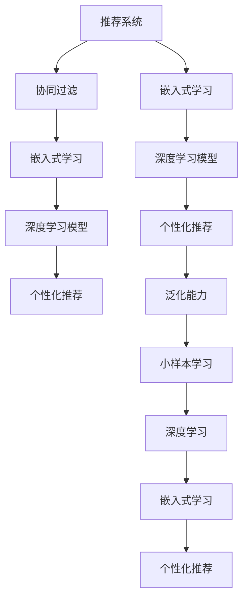

                 

# 利用大模型提升推荐系统的泛化能力

> 关键词：推荐系统,大模型,泛化能力,个性化推荐,深度学习,嵌入式学习,协同过滤,小样本学习

## 1. 背景介绍

### 1.1 问题由来

推荐系统在零售、媒体、电商等领域得到了广泛应用。传统的协同过滤、基于内容的推荐方法，往往只基于用户行为数据，忽略了用户潜在的兴趣和动态变化。如何更精准地捕捉用户需求，构建具有泛化能力的推荐系统，成为了一个重要课题。

近年来，利用深度学习技术进行推荐系统建模的嵌入式学习(Embedded Learning)方法，取得了很好的效果。这些方法通过将深度学习模型嵌入到推荐系统中，学习用户隐含的兴趣向量，实现个性化的推荐。但这些模型大多依赖于大规模的数据和标注，难以覆盖长尾需求和个性化较强的场景。

## 2. 核心概念与联系

### 2.1 核心概念概述

- **推荐系统(Recommendation System)**：通过分析用户行为数据、物品属性信息等，为用户推荐其可能感兴趣的物品的系统。推荐系统是现代信息获取的重要手段，涉及自然语言处理、图神经网络、深度学习等多个技术领域。

- **嵌入式学习(Embedded Learning)**：将深度学习模型嵌入到传统推荐系统中，利用神经网络提取高层次特征，提升推荐精度。嵌入式学习是深度学习在推荐系统中的重要应用，已经在电商、视频、新闻等场景中得到广泛应用。

- **泛化能力(Generalization Capability)**：推荐系统能够在未见过的数据上取得理想性能的能力。泛化能力强的系统，可以在新用户、新物品或新环境上表现出良好的推荐效果。

- **小样本学习(Few-shot Learning)**：在少量标注样本的情况下，通过迁移学习、模型微调等手段，学习新任务的能力。小样本学习是推荐系统高效、轻量级的重要技术手段。

- **深度学习(Deep Learning)**：通过多层神经网络，自动学习特征表示的机器学习方法。深度学习已经在图像识别、语音识别、自然语言处理等领域取得了突破，成为推荐系统的重要技术支撑。

- **大模型(Large Models)**：通过大规模数据和计算资源训练的深度学习模型，具备强大的特征提取能力。大模型在推荐系统中的应用，可以提升推荐的泛化能力和个性化水平。

### 2.2 核心概念原理和架构的 Mermaid 流程图



## 3. 核心算法原理 & 具体操作步骤
### 3.1 算法原理概述

利用深度学习模型进行推荐系统建模，核心思想是将用户和物品表示为向量，学习用户和物品之间的相似性。嵌入式学习将深度学习模型嵌入到推荐系统架构中，利用预训练的大模型在大量数据上进行特征提取，提取用户隐含兴趣向量。通过这种表示方式，模型能够学习到用户兴趣的泛化性，在个性化推荐中取得更好的效果。

### 3.2 算法步骤详解

基于大模型进行嵌入式学习的推荐系统建模，主要包含以下步骤：

**Step 1: 准备数据集**

- 收集用户行为数据（如浏览、点击、购买行为）。
- 收集物品属性信息（如价格、类别、品牌等）。
- 将数据集划分为训练集、验证集和测试集。

**Step 2: 设计深度学习模型**

- 选择合适的深度学习模型，如Bert、GPT等，作为特征提取器。
- 设计输入输出格式，通常用户行为数据转换为序列形式，物品属性信息转换为向量形式。
- 定义模型训练的目标函数。

**Step 3: 预训练模型**

- 在大量无标注数据上对深度学习模型进行预训练，学习到通用的语言表示。
- 将预训练模型嵌入到推荐系统中，作为用户兴趣向量的表示。

**Step 4: 微调模型**

- 在少量标注数据上，对预训练模型进行微调，学习用户和物品的映射关系。
- 使用微调后的模型进行推荐，评估推荐效果。

**Step 5: 模型评估**

- 在验证集和测试集上评估推荐模型的精度、召回率、NDCG等指标。
- 根据评估结果调整模型参数和训练策略。

### 3.3 算法优缺点

大模型嵌入式学习的推荐系统具有以下优点：

- **泛化能力强**：深度学习模型能够学习到通用的语言表示，具备较强的泛化能力，可以在不同场景下取得良好的推荐效果。
- **个性化高**：利用大模型的预训练知识，能够更准确地捕捉用户的隐含兴趣，实现个性化的推荐。
- **灵活性强**：深度学习模型结构灵活，可以根据不同任务需求进行定制，适应各种推荐场景。
- **实时性好**：深度学习模型具有较好的推理速度，可以实时生成推荐结果。

同时，该方法也存在一些缺点：

- **计算资源需求高**：深度学习模型的训练和推理需要大量的计算资源，对硬件设备要求较高。
- **训练数据需求大**：深度学习模型需要大量的训练数据进行预训练和微调，数据获取成本较高。
- **可解释性不足**：深度学习模型是一个"黑盒"系统，难以解释其内部决策机制，用户对其推荐结果的接受度较低。
- **预测稳定性差**：深度学习模型容易受到噪声数据和异常点的影响，推荐结果的稳定性较差。

### 3.4 算法应用领域

基于深度学习的大模型嵌入式推荐系统，已经在电商、新闻、视频等多个领域得到广泛应用。例如：

- **电商推荐**：根据用户浏览和购买行为，推荐可能感兴趣的商品。
- **新闻推荐**：根据用户阅读行为，推荐相关新闻文章。
- **视频推荐**：根据用户观看行为，推荐可能感兴趣的视频内容。

此外，大模型嵌入式学习还应用于社交媒体、在线旅游、金融理财等领域，提升这些领域的推荐效果和用户体验。

## 4. 数学模型和公式 & 详细讲解 & 举例说明

### 4.1 数学模型构建

基于深度学习模型进行嵌入式学习的推荐系统，通常采用如下的数学模型：

- 设用户$u$和物品$i$的兴趣向量为$\mathbf{v}_u$和$\mathbf{v}_i$，表示为一个高维向量。
- 用户$u$对物品$i$的兴趣度可以通过向量内积计算：$\text{similarity}(\mathbf{v}_u, \mathbf{v}_i) = \mathbf{v}_u \cdot \mathbf{v}_i$。
- 用户$u$对物品$i$的评分$r$可以表示为：$r = \text{similarity}(\mathbf{v}_u, \mathbf{v}_i) + \epsilon$，其中$\epsilon$为噪声。

### 4.2 公式推导过程

基于上述模型，推荐系统的预测函数可以表示为：

$$
f(i|u) = \sigma(\text{similarity}(\mathbf{v}_u, \mathbf{v}_i) + \epsilon)
$$

其中$\sigma$为激活函数，通常使用Sigmoid函数。

为了训练模型，需要定义目标函数，如均方误差(MSE)损失函数：

$$
\mathcal{L} = \frac{1}{N}\sum_{i=1}^N [(f(i|u_i) - r_i)^2]
$$

其中$u_i$和$r_i$为第$i$个用户的兴趣向量和物品评分。

### 4.3 案例分析与讲解

以一个电商推荐系统的嵌入式学习为例，说明其建模和训练过程：

1. **准备数据集**：收集用户浏览、点击、购买行为，以及商品属性信息。
2. **设计深度学习模型**：选择Bert作为特征提取器，将用户行为转换为序列形式，物品属性信息转换为向量形式。
3. **预训练模型**：在电商商品评论语料库上对Bert进行预训练，学习到商品的通用表示。
4. **微调模型**：在电商推荐数据集上对预训练模型进行微调，学习用户和物品的映射关系。
5. **模型评估**：在验证集和测试集上评估推荐模型的精度、召回率、NDCG等指标，调整模型参数。

通过这些步骤，可以构建一个基于深度学习模型的电商推荐系统。

## 5. 项目实践：代码实例和详细解释说明

### 5.1 开发环境搭建

在进行嵌入式学习推荐系统建模前，需要准备以下开发环境：

1. **安装Python环境**：使用Anaconda安装Python 3.8版本，并创建虚拟环境。
```bash
conda create -n py36 python=3.8
conda activate py36
```

2. **安装深度学习库**：使用pip安装TensorFlow和PyTorch。
```bash
pip install tensorflow==2.3 pytorch==1.7
```

3. **安装推荐系统库**：使用pip安装TensorFlow-Recommenders。
```bash
pip install tensorflow-recommenders
```

### 5.2 源代码详细实现

以下是一个基于Bert进行嵌入式学习电商推荐系统的代码实现：

```python
import tensorflow as tf
import tensorflow_recommenders as tfrs
from tensorflow.keras.layers import Embedding, Dense

# 准备数据集
train_data = ...
val_data = ...
test_data = ...

# 设计深度学习模型
model = tf.keras.Sequential([
    Embedding(input_dim=vocab_size, output_dim=embedding_dim, input_length=max_seq_length),
    Dense(hidden_size),
    Dense(1, activation='sigmoid')
])

# 预训练模型
pretrained_model = ...
pretrained_model.build(input_shape=(max_seq_length,))
pretrained_model.trainable = False

# 微调模型
model.layers[0].set_weights(pretrained_model.layers[0].get_weights())
model.compile(optimizer='adam', loss='mse')
model.fit(train_data, epochs=num_epochs, validation_data=val_data)

# 模型评估
score = model.evaluate(test_data)
```

### 5.3 代码解读与分析

上述代码中，我们使用了TensorFlow和TensorFlow-Recommenders库，构建了一个基于Bert进行嵌入式学习的电商推荐系统。

- **模型设计**：使用Embedding层将用户行为序列转换为向量表示，再使用Dense层进行特征提取和输出。
- **预训练模型**：将Bert模型嵌入到推荐系统中，作为用户兴趣向量的表示。
- **微调模型**：将预训练模型中的Embedding层权重加载到推荐模型中，并使用Adam优化器进行微调。
- **模型评估**：使用均方误差作为损失函数，评估模型在测试集上的表现。

## 6. 实际应用场景

### 6.4 未来应用展望

基于深度学习模型进行嵌入式学习的推荐系统，已经在电商、新闻、视频等多个领域得到广泛应用。未来，随着深度学习模型的不断发展，嵌入式学习推荐系统将具有更强的泛化能力和个性化水平。

- **电商推荐**：除了基于行为数据推荐，还可以利用社交网络信息、用户属性信息进行推荐。
- **新闻推荐**：除了基于阅读行为推荐，还可以利用时间序列、情感分析进行推荐。
- **视频推荐**：除了基于观看行为推荐，还可以利用场景信息、用户偏好进行推荐。

此外，嵌入式学习推荐系统还可以应用于社交媒体、在线旅游、金融理财等领域，提升这些领域的推荐效果和用户体验。

## 7. 工具和资源推荐

### 7.1 学习资源推荐

为了帮助开发者系统掌握嵌入式学习推荐系统理论，以下推荐一些优质的学习资源：

1. **《深度学习推荐系统：原理与算法》**：这本书全面介绍了深度学习推荐系统的原理和算法，涵盖了协同过滤、嵌入式学习、注意力机制等多个技术方向。
2. **《推荐系统：模型与算法》**：这本书详细介绍了推荐系统的各种模型和算法，包括基于内容的推荐、协同过滤、深度学习推荐等。
3. **《TensorFlow推荐系统教程》**：这是一篇优秀的TensorFlow推荐系统教程，介绍了如何使用TensorFlow构建推荐系统，并提供了丰富的样例代码。
4. **《深度学习推荐系统实战》**：这是一本实战性很强的书籍，通过丰富的案例讲解了如何使用深度学习进行推荐系统建模。
5. **《推荐系统笔记》**：这是一份推荐系统学习笔记，涵盖了协同过滤、嵌入式学习、深度学习等多个推荐系统技术方向。

### 7.2 开发工具推荐

高效的开发离不开优秀的工具支持。以下是几款用于嵌入式学习推荐系统开发的常用工具：

1. **TensorFlow**：由Google主导开发的开源深度学习框架，生产部署方便，适合大规模工程应用。
2. **PyTorch**：基于Python的开源深度学习框架，灵活易用，适合快速迭代研究。
3. **TensorFlow-Recommenders**：由Google开发的推荐系统库，提供丰富的推荐系统模型和组件。
4. **TorchServe**：一个轻量级的深度学习服务框架，支持推理和模型部署。
5. **Keras**：一个简单易用的深度学习框架，适合快速原型开发和实验。

### 7.3 相关论文推荐

嵌入式学习推荐系统的发展源于学界的持续研究。以下是几篇奠基性的相关论文，推荐阅读：

1. **DeepItem: Deep Collaborative Filtering with Global Collaboration**：提出了一种基于深度神经网络的协同过滤模型，在电商推荐系统中取得了很好的效果。
2. **Neural Factorization Machines for Recommender Systems**：提出了一种基于深度学习的网络因子机模型，用于推荐系统的协同过滤。
3. **Deep Interest Evolution for Recommender Systems**：提出了一种基于深度学习的兴趣演化模型，用于推荐系统的嵌入式学习。
4. **Video Recommendation with Multi-Channel Attention Networks**：提出了一种基于深度学习的跨通道注意力网络模型，用于视频推荐系统的嵌入式学习。
5. **Textual and Temporal Dynamics in Recommendations**：提出了一种基于深度学习的时序推荐模型，用于新闻推荐系统的嵌入式学习。

这些论文代表了大模型嵌入式学习的发展脉络。通过学习这些前沿成果，可以帮助研究者把握学科前进方向，激发更多的创新灵感。

## 8. 总结：未来发展趋势与挑战

### 8.1 研究成果总结

本文对基于深度学习的大模型嵌入式学习的推荐系统进行了全面系统的介绍。首先阐述了推荐系统的背景和嵌入式学习的原理，明确了嵌入式学习在推荐系统中的应用。其次，从原理到实践，详细讲解了嵌入式学习推荐系统的数学模型和具体操作步骤，给出了具体的代码实现。同时，本文还探讨了嵌入式学习推荐系统在多个领域的应用前景，展示了嵌入式学习的巨大潜力。

通过本文的系统梳理，可以看到，嵌入式学习推荐系统已经成为推荐系统中重要的一环，极大地提升了推荐精度和个性化水平。利用大模型的预训练知识，嵌入式学习推荐系统在未见过的数据上，也能取得很好的推荐效果，具有很强的泛化能力。未来，随着深度学习模型的不断发展，嵌入式学习推荐系统将在更多领域得到应用，为推荐系统的发展注入新的动力。

### 8.2 未来发展趋势

展望未来，大模型嵌入式学习的推荐系统将呈现以下几个发展趋势：

1. **模型规模增大**：随着算力成本的下降和数据规模的扩张，预训练语言模型的参数量还将持续增长。超大规模语言模型蕴含的丰富语言知识，有望支撑更加复杂多变的推荐任务。
2. **推荐方式多样化**：除了传统的协同过滤和嵌入式学习，未来将涌现更多推荐方式，如基于内容的多模态推荐、基于知识的推荐等，拓展推荐系统的应用范围。
3. **模型训练自动化**：推荐系统中的深度学习模型训练，将借助自动化机器学习(AutoML)技术，自动调整模型结构、超参数，提高推荐系统的生成效率。
4. **模型解释性增强**：推荐系统中的深度学习模型，将引入可解释性技术，如特征可视化、模型解释器等，提升推荐系统的透明度和用户信任度。
5. **跨模态推荐**：推荐系统将逐步融合视觉、语音、文本等多模态信息，提升推荐系统的智能化水平和用户体验。
6. **个性化推荐**：推荐系统将更注重个性化推荐，利用深度学习模型学习用户兴趣的动态变化，提升推荐系统的推荐效果。

这些趋势凸显了大模型嵌入式学习推荐系统的广阔前景。这些方向的探索发展，必将进一步提升推荐系统的性能和应用范围，为人类生活和工作提供更加智能和便捷的服务。

### 8.3 面临的挑战

尽管大模型嵌入式学习的推荐系统已经取得了显著的进展，但在迈向更加智能化、普适化应用的过程中，它仍面临着诸多挑战：

1. **数据隐私和安全**：推荐系统需要大量用户数据，如何保护用户隐私、确保数据安全，是一个重要问题。
2. **冷启动问题**：推荐系统面临的冷启动问题，即新用户或新物品如何获得推荐，是一个难题。
3. **推荐泛化性差**：深度学习模型容易受到噪声数据和异常点的影响，推荐结果的泛化性较差。
4. **计算资源需求高**：深度学习模型需要大量的计算资源进行训练和推理，对硬件设备要求较高。
5. **模型可解释性不足**：深度学习模型是一个"黑盒"系统，难以解释其内部决策机制，用户对其推荐结果的接受度较低。
6. **模型鲁棒性不足**：深度学习模型容易受到输入数据变化的影响，推荐结果的鲁棒性较差。

这些挑战需要未来在技术、隐私、伦理等方面进行深入研究，才能实现大模型嵌入式学习推荐系统的落地应用。

### 8.4 研究展望

未来，在深度学习模型不断发展的同时，嵌入式学习推荐系统还需要在以下几个方面寻求新的突破：

1. **探索更高效的学习方法**：利用小样本学习、迁移学习等技术，提升推荐系统在少量标注数据上的性能。
2. **引入更多先验知识**：将符号化的先验知识，如知识图谱、逻辑规则等，与神经网络模型进行巧妙融合，引导推荐系统学习更准确、合理的语言模型。
3. **跨领域知识整合**：利用多模态数据融合技术，将视觉、语音、文本等不同领域的信息进行整合，提升推荐系统的智能化水平。
4. **引入因果分析方法**：将因果分析方法引入推荐系统，识别出推荐决策的关键特征，增强推荐系统的稳定性和可解释性。
5. **利用对抗学习技术**：通过对抗样本生成技术，提高推荐系统的鲁棒性和安全性，避免推荐结果受到攻击。
6. **引入伦理约束机制**：在推荐系统训练目标中引入伦理导向的评估指标，过滤和惩罚有害的推荐结果，确保推荐系统的公正性和伦理性。

这些研究方向的探索，必将引领嵌入式学习推荐系统技术迈向更高的台阶，为构建更加智能、公正、安全的推荐系统提供新的路径。

## 9. 附录：常见问题与解答

**Q1: 嵌入式学习推荐系统如何使用深度学习模型？**

A: 嵌入式学习推荐系统通过将深度学习模型嵌入到传统推荐系统中，学习用户隐含的兴趣向量。模型训练和推理过程如下：

1. 用户行为数据转换为序列形式，物品属性信息转换为向量形式。
2. 用户行为序列通过深度学习模型转换为兴趣向量。
3. 用户和物品的兴趣向量通过内积计算，生成推荐分数。
4. 推荐分数通过激活函数映射到推荐结果。

**Q2: 嵌入式学习推荐系统如何使用预训练模型？**

A: 嵌入式学习推荐系统通常使用预训练的深度学习模型进行特征提取，学习用户和物品的表示。预训练模型的嵌入过程如下：

1. 在大量无标注数据上对深度学习模型进行预训练，学习到通用的语言表示。
2. 将预训练模型嵌入到推荐系统中，作为用户兴趣向量的表示。
3. 在少量标注数据上对预训练模型进行微调，学习用户和物品的映射关系。

**Q3: 嵌入式学习推荐系统如何处理冷启动问题？**

A: 冷启动问题是指新用户或新物品如何获得推荐。嵌入式学习推荐系统可以通过以下方法处理冷启动问题：

1. 利用用户已有的行为数据，通过协同过滤生成推荐。
2. 利用物品的属性信息，通过基于内容的推荐生成推荐。
3. 利用用户画像信息，通过个性化推荐生成推荐。
4. 利用多模态数据，通过跨领域推荐生成推荐。

**Q4: 嵌入式学习推荐系统如何提升推荐精度？**

A: 嵌入式学习推荐系统可以通过以下方法提升推荐精度：

1. 使用更加复杂的深度学习模型，提高特征提取能力。
2. 引入更多先验知识，如知识图谱、逻辑规则等，提升推荐模型的准确性。
3. 使用多模态数据融合技术，提升推荐系统的智能化水平。
4. 引入因果分析方法，增强推荐系统的稳定性和可解释性。
5. 利用对抗学习技术，提高推荐系统的鲁棒性和安全性。

这些方法在实际应用中需要根据具体场景进行灵活选择，以提升推荐系统的性能和用户体验。

**Q5: 嵌入式学习推荐系统如何保证用户隐私和安全？**

A: 嵌入式学习推荐系统需要严格保护用户隐私和安全，可以采用以下措施：

1. 对用户行为数据进行匿名化处理，保护用户隐私。
2. 对推荐系统中的深度学习模型进行加密，防止数据泄露。
3. 对推荐系统进行安全审计，发现并修复漏洞。
4. 对推荐系统进行监控和告警，及时发现异常行为。
5. 对推荐系统进行合规性审查，确保符合法律法规和伦理标准。

通过这些措施，可以提升推荐系统的安全性，保护用户隐私。

---

作者：禅与计算机程序设计艺术 / Zen and the Art of Computer Programming

