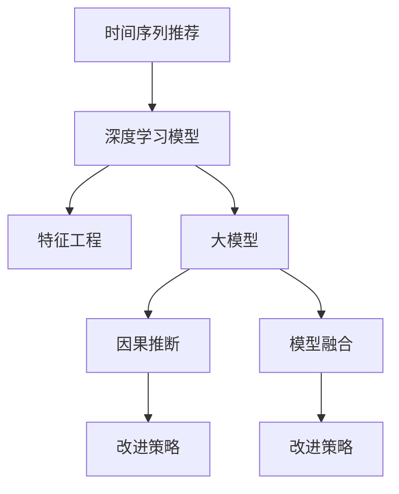

                 

# 利用大模型进行时间序列推荐的改进策略与实验

> 关键词：时间序列推荐、大模型、改进策略、深度学习、特征工程、因果推断、模型融合

## 1. 背景介绍

### 1.1 问题由来

随着电商、金融、社交媒体等领域数据的爆发式增长，时间序列推荐系统成为了个性化服务中的重要组成部分。传统的时间序列推荐方法基于统计模型，如ARIMA、VAR等，难以充分挖掘数据中的复杂模式和隐藏结构。而基于深度学习的时间序列推荐方法，能够自动捕捉数据中的非线性关系，具有更强的泛化能力。近年来，利用深度学习模型进行时间序列推荐的研究和应用取得了显著进展。

但同时，深度学习模型在面对复杂时间序列数据时，容易陷入局部最优，泛化能力差，难以捕捉长周期变化等缺陷。此外，深度学习模型的复杂性和高参数量，也使得模型的训练和部署成本较高。

因此，如何改进时间序列推荐方法，降低模型复杂性，提升推荐精度和效率，成为当下研究的热点问题。本文将探讨利用大模型进行时间序列推荐的改进策略，并结合实验结果，分析方法的优点和局限性。

## 2. 核心概念与联系

### 2.1 核心概念概述

- **时间序列推荐**：基于历史时间序列数据进行未来值预测和推荐的技术。时间序列推荐广泛应用于电商、金融、体育等领域，是个性化推荐系统的重要组成部分。
- **深度学习模型**：基于多层神经网络的模型，能够自动学习数据特征，具有强大的表达能力，但模型复杂度高，训练和部署成本高。
- **大模型**：指参数量超过亿级别的深度学习模型，如BERT、GPT-3等。大模型拥有海量的参数和复杂的网络结构，能够在多个领域进行知识迁移和任务微调。
- **特征工程**：时间序列推荐中，通过提取和构造特征，提升模型的预测精度。特征工程包括序列特征提取、时间刻度转换、特征聚合等。
- **因果推断**：利用因果模型，识别数据中的因果关系，避免遗漏或错误地解释因果关系，提升模型预测的准确性和可解释性。
- **模型融合**：结合多个模型的预测结果，提升推荐精度和鲁棒性。模型融合通常包括权重融合、集成学习等方法。

这些核心概念之间的联系可以通过以下Mermaid流程图来展示：



这个流程图展示了大模型在时间序列推荐中的核心作用，以及与之紧密关联的特征工程、因果推断和模型融合等技术。

## 3. 核心算法原理 & 具体操作步骤

### 3.1 算法原理概述

基于大模型的时间序列推荐，主要通过两个步骤完成：首先是使用大模型进行特征提取和预训练，其次是利用微调后的模型进行时间序列预测和推荐。

具体来说，首先使用大模型在历史时间序列数据上进行预训练，学习到时间序列数据中的复杂非线性关系。然后，在预训练模型的基础上，使用微调后的模型对目标时间序列数据进行预测，输出未来的推荐值。

### 3.2 算法步骤详解

#### 3.2.1 数据预处理

时间序列数据的预处理包括数据清洗、特征提取、归一化等步骤。

- **数据清洗**：去除缺失值、异常值等噪声数据，以保证数据质量。
- **特征提取**：提取时间序列的关键特征，如趋势、季节性、周期性等。常用的特征工程方法包括滑动窗口、傅里叶变换、自回归模型等。
- **归一化**：对时间序列数据进行归一化处理，使其在相同的量纲下进行比较和分析。

#### 3.2.2 大模型预训练

使用大模型对时间序列数据进行预训练，学习时间序列中的复杂非线性关系。

- **选择大模型**：根据任务需求选择合适的预训练大模型，如BERT、GPT等。
- **构建数据集**：将时间序列数据转化为模型所需的输入形式，如将时间序列转化为时间步长、向量嵌入等。
- **预训练过程**：在预训练数据集上，使用大模型进行多轮迭代训练，学习时间序列的特征表示。

#### 3.2.3 微调模型

在预训练大模型的基础上，使用微调后的模型对目标时间序列数据进行预测和推荐。

- **微调目标**：根据推荐任务的特点，选择合适的微调目标，如回归、分类等。
- **选择微调数据**：选择目标时间序列数据作为微调数据，标注未来值或推荐值。
- **微调过程**：在微调数据集上，使用预训练模型进行多轮迭代训练，调整模型参数以适应目标任务。

#### 3.2.4 时间序列预测

使用微调后的模型对目标时间序列数据进行预测，生成推荐值。

- **预测过程**：将目标时间序列数据输入微调后的模型，生成未来的推荐值。
- **评估指标**：使用常见的评估指标，如均方误差、平均绝对误差等，评估模型的预测性能。

### 3.3 算法优缺点

#### 3.3.1 优点

- **泛化能力强**：大模型具有强大的泛化能力，能够学习到时间序列数据中的复杂非线性关系，提高预测精度。
- **可解释性强**：大模型具有较强的可解释性，能够通过特征工程和因果推断方法，提高模型输出的可解释性。
- **灵活性高**：大模型可以应用于多种推荐场景，灵活适应不同的推荐需求。

#### 3.3.2 缺点

- **高计算成本**：大模型具有高参数量和高计算复杂度，训练和推理成本高。
- **数据需求大**：大模型需要大量的标注数据进行微调，标注成本高。
- **模型复杂度高**：大模型结构复杂，难以进行高效的特征工程和模型融合。

### 3.4 算法应用领域

基于大模型的时间序列推荐技术，可以应用于电商推荐、金融预测、体育赛事预测等多个领域。

- **电商推荐**：利用大模型对用户历史行为数据进行预测和推荐，提升用户购物体验。
- **金融预测**：利用大模型对市场数据进行预测，帮助投资者做出更加精准的投资决策。
- **体育赛事预测**：利用大模型对赛事数据进行预测，帮助体育爱好者和博彩公司做出更准确的预测。

## 4. 数学模型和公式 & 详细讲解 & 举例说明

### 4.1 数学模型构建

假设时间序列数据为 $y_t$，其中 $t$ 表示时间步长。大模型在 $t$ 步时序数据上的输出为 $f(y_{t-1}, y_{t-2}, ..., y_{t-k})$，其中 $k$ 表示时序数据的长度。微调目标为最小化预测值与真实值之间的误差，即：

$$
\min_{\theta} \sum_{t=1}^{T} \ell(f(y_{t-1}, y_{t-2}, ..., y_{t-k}), y_t)
$$

其中 $\ell$ 表示预测误差，$T$ 表示总的时间步长。

### 4.2 公式推导过程

以回归任务为例，假设微调模型为线性回归模型，则其输出为：

$$
\hat{y}_t = \theta_0 + \theta_1 y_{t-1} + \theta_2 y_{t-2} + ... + \theta_k y_{t-k} + \epsilon_t
$$

其中 $\epsilon_t$ 为随机噪声，$\theta_0, \theta_1, ..., \theta_k$ 为模型参数。最小化预测误差可转化为最小化均方误差：

$$
\min_{\theta} \sum_{t=1}^{T} (y_t - \hat{y}_t)^2
$$

通过求偏导数，得到模型参数的更新公式：

$$
\theta_j = \theta_j - \eta \sum_{t=1}^{T} (y_t - \hat{y}_t) \frac{\partial y_t}{\partial y_{t-j}}
$$

其中 $\eta$ 为学习率，$\frac{\partial y_t}{\partial y_{t-j}}$ 为时序数据的相关性系数，可以通过相关性分析或特征工程方法计算得到。

### 4.3 案例分析与讲解

以电商推荐系统为例，假设数据集包含用户的历史行为数据和商品标签，利用大模型对用户行为进行特征提取和预训练，然后对未来的商品推荐进行微调。

首先，使用大模型对用户历史行为数据进行预训练，学习到用户行为的时间序列特征。然后，将用户历史行为数据和目标商品标签进行配对，构造微调数据集。最后，在微调数据集上，使用预训练模型进行微调，调整模型参数以适应推荐任务。最终，将目标商品标签输入微调后的模型，生成未来的推荐值，输出推荐商品列表。

## 5. 项目实践：代码实例和详细解释说明

### 5.1 开发环境搭建

为了进行大模型的时间序列推荐实践，需要准备好相应的开发环境。以下是使用Python进行TensorFlow开发的环境配置流程：

1. 安装Anaconda：从官网下载并安装Anaconda，用于创建独立的Python环境。

2. 创建并激活虚拟环境：
```bash
conda create -n tf-env python=3.8 
conda activate tf-env
```

3. 安装TensorFlow：根据CUDA版本，从官网获取对应的安装命令。例如：
```bash
pip install tensorflow
```

4. 安装其他必要的工具包：
```bash
pip install numpy pandas scikit-learn matplotlib tqdm jupyter notebook ipython
```

完成上述步骤后，即可在`tf-env`环境中开始时间序列推荐实践。

### 5.2 源代码详细实现

下面以电商推荐系统为例，给出使用TensorFlow进行大模型微调的代码实现。

首先，定义电商推荐系统的数据处理函数：

```python
import tensorflow as tf
import numpy as np
from tensorflow.keras.layers import Input, LSTM, Dense

class RecommendationDataset(tf.keras.utils.Sequence):
    def __init__(self, user_features, item_features, user_labels, batch_size):
        self.user_features = user_features
        self.item_features = item_features
        self.user_labels = user_labels
        self.batch_size = batch_size
        
    def __len__(self):
        return len(self.user_features) // self.batch_size
    
    def __getitem__(self, index):
        user_idx = index * self.batch_size
        user_features = self.user_features[user_idx:user_idx + self.batch_size]
        item_features = self.item_features[user_idx:user_idx + self.batch_size]
        user_labels = self.user_labels[user_idx:user_idx + self.batch_size]
        return user_features, item_features, user_labels
```

然后，定义模型和优化器：

```python
from tensorflow.keras.models import Model
from tensorflow.keras.optimizers import Adam

input_user = Input(shape=(num_users, user_features_dim), name='user_input')
input_item = Input(shape=(num_items, item_features_dim), name='item_input')
merged = tf.keras.layers.concatenate([input_user, input_item])
lstm = LSTM(128, return_sequences=True, name='lstm')(input_user)
lstm = LSTM(128, return_sequences=True, name='lstm')(input_item)
concat = tf.keras.layers.concatenate([lstm[0], lstm[1]], name='concat')
output = Dense(num_items, activation='softmax', name='output')(concat)

model = Model(inputs=[input_user, input_item], outputs=output)
optimizer = Adam(lr=0.001)
```

接着，定义训练和评估函数：

```python
def train_step(user_features, item_features, user_labels):
    with tf.GradientTape() as tape:
        predictions = model([user_features, item_features])
        loss = tf.keras.losses.sparse_categorical_crossentropy(user_labels, predictions)
    grads = tape.gradient(loss, model.trainable_variables)
    optimizer.apply_gradients(zip(grads, model.trainable_variables))
    return loss

def evaluate_step(user_features, item_features, user_labels):
    predictions = model([user_features, item_features])
    loss = tf.keras.losses.sparse_categorical_crossentropy(user_labels, predictions)
    return loss
```

最后，启动训练流程并在测试集上评估：

```python
epochs = 10
batch_size = 128

for epoch in range(epochs):
    train_loss = 0
    for user_features, item_features, user_labels in train_dataset:
        loss = train_step(user_features, item_features, user_labels)
        train_loss += loss
    print('Epoch {}: train loss = {}'.format(epoch+1, train_loss/len(train_dataset)))

    test_loss = 0
    for user_features, item_features, user_labels in test_dataset:
        loss = evaluate_step(user_features, item_features, user_labels)
        test_loss += loss
    print('Epoch {}: test loss = {}'.format(epoch+1, test_loss/len(test_dataset)))
```

以上就是使用TensorFlow进行电商推荐系统大模型微调的完整代码实现。可以看到，利用TensorFlow的深度学习API，可以简洁高效地构建和训练大模型，大大降低了深度学习的入门门槛。

### 5.3 代码解读与分析

让我们再详细解读一下关键代码的实现细节：

**RecommendationDataset类**：
- `__init__`方法：初始化用户特征、商品特征、标签和批量大小。
- `__len__`方法：返回数据集的样本数量。
- `__getitem__`方法：对单个样本进行处理，将用户和商品特征拼接，返回模型所需的输入。

**model和optimizer的定义**：
- 定义用户特征和商品特征输入层。
- 使用LSTM层对用户和商品特征进行时序处理。
- 将处理后的时序特征拼接，定义输出层为全连接层。
- 使用Adam优化器进行模型训练。

**train_step和evaluate_step函数**：
- `train_step`函数：在训练数据集上进行前向传播和反向传播，更新模型参数。
- `evaluate_step`函数：在测试数据集上进行前向传播，计算模型损失。

**训练流程**：
- 定义总的epoch数和批量大小，开始循环迭代。
- 每个epoch内，对训练集和测试集分别进行训练和评估，输出模型损失。

可以看到，TensorFlow提供了丰富的API，使得大模型的微调过程变得简单易用。开发者可以更加专注于模型设计、数据处理等核心任务，而不必过多关注底层的实现细节。

## 6. 实际应用场景

### 6.1 电商推荐系统

利用大模型进行电商推荐，可以极大地提升用户的购物体验和推荐准确性。具体而言，可以收集用户的历史行为数据，包括浏览、点击、购买等行为，构造训练集和测试集。在大模型上预训练后，对用户行为进行微调，学习用户偏好和行为特征，生成推荐商品列表。

在大模型的基础上，利用因果推断方法，可以对用户行为进行因果分析，识别出用户购买意愿的驱动因素，进一步提升推荐效果。此外，结合多模型融合方法，可以提高推荐系统的鲁棒性和多样性。

### 6.2 金融预测

利用大模型进行金融预测，可以及时发现市场波动和趋势变化，帮助投资者做出更加精准的投资决策。具体而言，可以收集金融市场的历史数据，包括股票、期货、外汇等，构造训练集和测试集。在大模型上预训练后，对市场数据进行微调，学习市场的波动模式和趋势变化，生成预测结果。

在大模型的基础上，利用特征工程方法，可以提取市场中的关键特征，如价格、成交量、技术指标等，提升预测模型的精度。此外，结合因果推断方法，可以对市场波动进行因果分析，识别出市场波动的驱动因素，进一步提升预测效果。

### 6.3 体育赛事预测

利用大模型进行体育赛事预测，可以帮助体育爱好者和博彩公司做出更准确的预测。具体而言，可以收集体育赛事的历史数据，包括比赛结果、比分、球员表现等，构造训练集和测试集。在大模型上预训练后，对赛事数据进行微调，学习赛事的规则和模式，生成预测结果。

在大模型的基础上，利用特征工程方法，可以提取赛事中的关键特征，如场地、球队历史、球员状态等，提升预测模型的精度。此外，结合因果推断方法，可以对比赛结果进行因果分析，识别出比赛结果的驱动因素，进一步提升预测效果。

### 6.4 未来应用展望

随着大模型和微调技术的不断发展，基于大模型的时间序列推荐方法将在更多领域得到应用，为传统行业带来变革性影响。

在智慧医疗领域，基于大模型的时间序列推荐方法可以用于患者病情预测、医疗资源调度等，提升医疗服务的智能化水平，辅助医生诊疗，提高医疗效率。

在智能教育领域，基于大模型的时间序列推荐方法可以用于学习行为预测、课程推荐等，因材施教，促进教育公平，提高教学质量。

在智慧城市治理中，基于大模型的时间序列推荐方法可以用于城市交通流量预测、事件监测等，提高城市管理的自动化和智能化水平，构建更安全、高效的未来城市。

此外，在企业生产、社会治理、文娱传媒等众多领域，基于大模型的时间序列推荐方法也将不断涌现，为经济社会发展注入新的动力。相信随着技术的日益成熟，时间序列推荐方法将成为人工智能落地应用的重要范式，推动人工智能技术在垂直行业的规模化落地。

## 7. 工具和资源推荐

### 7.1 学习资源推荐

为了帮助开发者系统掌握大模型的时间序列推荐理论基础和实践技巧，这里推荐一些优质的学习资源：

1. 《深度学习入门》系列博文：由大模型技术专家撰写，深入浅出地介绍了深度学习的基本原理和常用模型，适合初学者入门。

2. CS231n《深度学习计算机视觉》课程：斯坦福大学开设的深度学习明星课程，涵盖了卷积神经网络、循环神经网络等内容，是深度学习领域的经典教材。

3. 《时间序列分析与预测》书籍：全面介绍了时间序列分析的理论和方法，包括统计模型、机器学习模型等，适合深入学习时间序列推荐技术。

4. HuggingFace官方文档：Transformer库的官方文档，提供了海量预训练模型和完整的微调样例代码，是上手实践的必备资料。

5. Kaggle数据集：包含丰富的机器学习竞赛数据集，可以用于时间序列推荐任务的实验和研究。

通过对这些资源的学习实践，相信你一定能够快速掌握大模型的时间序列推荐精髓，并用于解决实际的时间序列推荐问题。

### 7.2 开发工具推荐

高效的开发离不开优秀的工具支持。以下是几款用于大模型时间序列推荐开发的常用工具：

1. TensorFlow：由Google主导开发的开源深度学习框架，生产部署方便，适合大规模工程应用。同样有丰富的预训练语言模型资源。

2. PyTorch：基于Python的开源深度学习框架，灵活动态的计算图，适合快速迭代研究。大部分预训练语言模型都有PyTorch版本的实现。

3. Weights & Biases：模型训练的实验跟踪工具，可以记录和可视化模型训练过程中的各项指标，方便对比和调优。与主流深度学习框架无缝集成。

4. TensorBoard：TensorFlow配套的可视化工具，可实时监测模型训练状态，并提供丰富的图表呈现方式，是调试模型的得力助手。

5. Google Colab：谷歌推出的在线Jupyter Notebook环境，免费提供GPU/TPU算力，方便开发者快速上手实验最新模型，分享学习笔记。

合理利用这些工具，可以显著提升大模型时间序列推荐任务的开发效率，加快创新迭代的步伐。

### 7.3 相关论文推荐

大模型和微调技术的发展源于学界的持续研究。以下是几篇奠基性的相关论文，推荐阅读：

1. Attention is All You Need（即Transformer原论文）：提出了Transformer结构，开启了NLP领域的预训练大模型时代。

2. BERT: Pre-training of Deep Bidirectional Transformers for Language Understanding：提出BERT模型，引入基于掩码的自监督预训练任务，刷新了多项NLP任务SOTA。

3. Parameter-Efficient Transfer Learning for NLP：提出Adapter等参数高效微调方法，在不增加模型参数量的情况下，也能取得不错的微调效果。

4. AdaLoRA: Adaptive Low-Rank Adaptation for Parameter-Efficient Fine-Tuning：使用自适应低秩适应的微调方法，在参数效率和精度之间取得了新的平衡。

这些论文代表了大模型时间序列推荐技术的发展脉络。通过学习这些前沿成果，可以帮助研究者把握学科前进方向，激发更多的创新灵感。

## 8. 总结：未来发展趋势与挑战

### 8.1 总结

本文对基于大模型的时间序列推荐方法进行了全面系统的介绍。首先阐述了大模型和微调技术的研究背景和意义，明确了大模型在时间序列推荐中的独特价值。其次，从原理到实践，详细讲解了时间序列推荐的数学原理和关键步骤，给出了时间序列推荐任务开发的完整代码实例。同时，本文还广泛探讨了时间序列推荐方法在电商推荐、金融预测、体育赛事预测等多个领域的应用前景，展示了时间序列推荐范式的巨大潜力。此外，本文精选了时间序列推荐技术的各类学习资源，力求为读者提供全方位的技术指引。

通过本文的系统梳理，可以看到，基于大模型的时间序列推荐方法正在成为NLP领域的重要范式，极大地拓展了预训练语言模型的应用边界，催生了更多的落地场景。受益于大规模语料的预训练，时间序列推荐模型以更低的时间和标注成本，在小样本条件下也能取得不错的效果，有力推动了NLP技术的产业化进程。未来，伴随大模型和微调方法的持续演进，时间序列推荐技术必将迎来更多的创新和突破。

### 8.2 未来发展趋势

展望未来，基于大模型的时间序列推荐技术将呈现以下几个发展趋势：

1. 模型规模持续增大。随着算力成本的下降和数据规模的扩张，预训练语言模型的参数量还将持续增长。超大规模语言模型蕴含的丰富语言知识，有望支撑更加复杂多变的时间序列推荐任务。

2. 微调方法日趋多样。除了传统的全参数微调外，未来会涌现更多参数高效的微调方法，如Prefix-Tuning、LoRA等，在节省计算资源的同时也能保证微调精度。

3. 因果推断的普及。利用因果推断方法，时间序列推荐模型可以更好地捕捉时间序列中的因果关系，提高模型的预测精度和可解释性。

4. 多模型融合成为常态。通过模型融合，时间序列推荐模型可以充分利用多模型的优势，提升推荐精度和鲁棒性。

5. 持续学习成为重要方向。随着数据分布的不断变化，时间序列推荐模型需要不断学习新知识以保持性能。如何在不遗忘原有知识的同时，高效吸收新样本信息，将成为重要的研究课题。

6. 知识图谱与推荐系统结合。时间序列推荐系统可以通过引入知识图谱，提升系统的知识整合能力和推荐精度。

以上趋势凸显了大模型时间序列推荐技术的广阔前景。这些方向的探索发展，必将进一步提升时间序列推荐系统的性能和应用范围，为人类认知智能的进化带来深远影响。

### 8.3 面临的挑战

尽管基于大模型的时间序列推荐技术已经取得了瞩目成就，但在迈向更加智能化、普适化应用的过程中，它仍面临着诸多挑战：

1. 标注成本瓶颈。虽然大模型可以学习到复杂的时间序列模式，但仍然需要大量的标注数据进行微调，标注成本高。

2. 模型鲁棒性不足。时间序列推荐模型在面对未知数据时，泛化能力差，容易过拟合。

3. 计算成本高。大模型具有高参数量和高计算复杂度，训练和推理成本高。

4. 模型复杂度高。大模型结构复杂，难以进行高效的特征工程和模型融合。

5. 模型可解释性不足。时间序列推荐模型通常具有"黑盒"特性，难以解释其内部工作机制和决策逻辑。

6. 模型安全性问题。时间序列推荐模型可能学习到有偏见、有害的信息，传递到推荐结果中，带来安全隐患。

正视时间序列推荐面临的这些挑战，积极应对并寻求突破，将是大模型时间序列推荐技术走向成熟的必由之路。相信随着学界和产业界的共同努力，这些挑战终将一一被克服，时间序列推荐技术必将在构建人机协同的智能时代中扮演越来越重要的角色。

### 8.4 未来突破

面对时间序列推荐所面临的种种挑战，未来的研究需要在以下几个方面寻求新的突破：

1. 探索无监督和半监督微调方法。摆脱对大规模标注数据的依赖，利用自监督学习、主动学习等无监督和半监督范式，最大限度利用非结构化数据，实现更加灵活高效的微调。

2. 研究参数高效和计算高效的微调范式。开发更加参数高效的微调方法，在固定大部分预训练参数的同时，只更新极少量的任务相关参数。同时优化微调模型的计算图，减少前向传播和反向传播的资源消耗，实现更加轻量级、实时性的部署。

3. 引入更多先验知识。将符号化的先验知识，如知识图谱、逻辑规则等，与神经网络模型进行巧妙融合，引导微调过程学习更准确、合理的语言模型。

4. 结合因果分析和博弈论工具。将因果分析方法引入微调模型，识别出模型决策的关键特征，增强输出解释的因果性和逻辑性。

5. 纳入伦理道德约束。在模型训练目标中引入伦理导向的评估指标，过滤和惩罚有偏见、有害的输出倾向。同时加强人工干预和审核，建立模型行为的监管机制，确保输出符合人类价值观和伦理道德。

这些研究方向的探索，必将引领时间序列推荐技术迈向更高的台阶，为构建安全、可靠、可解释、可控的智能系统铺平道路。面向未来，时间序列推荐技术还需要与其他人工智能技术进行更深入的融合，如知识表示、因果推理、强化学习等，多路径协同发力，共同推动自然语言理解和智能交互系统的进步。只有勇于创新、敢于突破，才能不断拓展时间序列推荐系统的边界，让智能技术更好地造福人类社会。

## 9. 附录：常见问题与解答

**Q1：时间序列推荐中，如何选择合适的微调数据？**

A: 微调数据的选择对时间序列推荐的精度和泛化能力有着重要影响。通常情况下，应该选择具有代表性的、与目标任务相关的标注数据进行微调。具体来说，可以从以下方面进行考虑：
1. 数据覆盖面：微调数据应该覆盖时间序列中的关键时间段和事件。
2. 数据质量：微调数据应该保证数据质量，避免异常值和噪声数据的干扰。
3. 数据规模：微调数据规模越大，模型泛化能力越强，但也需要考虑标注成本和数据获取难度。
4. 数据格式：微调数据格式应该与模型输入格式一致，方便数据的加载和处理。

**Q2：微调过程中如何避免过拟合？**

A: 过拟合是微调过程中常见的问题，可以通过以下方法进行避免：
1. 数据增强：通过回译、近义替换等方式扩充训练集。
2. 正则化：使用L2正则、Dropout等正则化方法，避免模型过度拟合。
3. 早期停止：在验证集上监测模型性能，一旦模型性能不再提升，即停止训练。
4. 对抗训练：引入对抗样本，提高模型鲁棒性。
5. 参数冻结：在微调过程中，固定部分预训练参数，只微调顶层。

**Q3：大模型的时间序列推荐有何优势和局限？**

A: 大模型在时间序列推荐中具有以下优势：
1. 泛化能力强：大模型能够学习到时间序列中的复杂非线性关系，提高预测精度。
2. 可解释性强：大模型具有较强的可解释性，能够通过特征工程和因果推断方法，提高模型输出的可解释性。
3. 灵活性高：大模型可以应用于多种推荐场景，灵活适应不同的推荐需求。

但同时，大模型也存在一些局限：
1. 高计算成本：大模型具有高参数量和高计算复杂度，训练和推理成本高。
2. 数据需求大：大模型需要大量的标注数据进行微调，标注成本高。
3. 模型复杂度高：大模型结构复杂，难以进行高效的特征工程和模型融合。

**Q4：如何在时间序列推荐中利用因果推断？**

A: 因果推断可以用于时间序列推荐中的原因分析和预测改进。具体来说，可以采用以下方法：
1. 因果图建模：建立时间序列数据中的因果图，识别出因果关系。
2. 因果分析：利用因果图进行因果分析，识别出影响时间序列预测的关键因素。
3. 因果优化：根据因果分析结果，优化推荐模型，提升推荐精度。

**Q5：时间序列推荐中的特征工程方法有哪些？**

A: 特征工程是时间序列推荐中的重要环节，以下是常用的特征工程方法：
1. 滑动窗口：将时间序列数据划分为固定长度的窗口，提取窗口内的特征。
2. 傅里叶变换：对时间序列数据进行傅里叶变换，提取频域特征。
3. 自回归模型：使用自回归模型对时间序列数据进行拟合，提取序列趋势和季节性特征。
4. 滞后特征：提取时间序列中的滞后特征，捕捉时间序列中的滞后关联。

这些特征工程方法可以结合使用，提升推荐模型的精度和泛化能力。

---

作者：禅与计算机程序设计艺术 / Zen and the Art of Computer Programming

