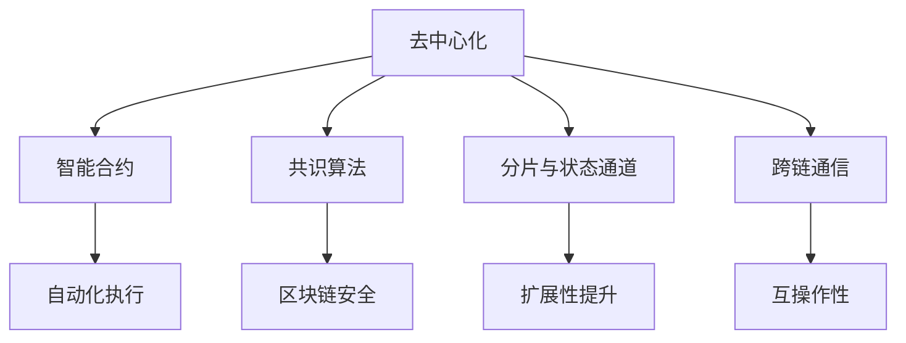

                 

## 1. 背景介绍

区块链作为一种分布式账本技术，因其去中心化、透明、不可篡改等特性，成为金融、供应链、医疗、政府等众多领域的重要应用基础。然而，当前的区块链技术仍然面临性能瓶颈、扩展性不足、交易成本高昂等问题。利用区块链的技术优势，对其进行创新和优化，成为推动区块链应用的普及和落地的关键。

区块链创新的目标是，在保证去中心化和安全性的前提下，提升区块链的扩展性、性能、可用性和灵活性，以适应不同领域的具体需求。本文将详细介绍区块链创新的核心概念、关键技术和应用实践，希望能为区块链技术的未来发展提供参考。

## 2. 核心概念与联系

### 2.1 核心概念概述

区块链创新的核心概念包括以下几个关键点：

- **去中心化(Decentralization)**：区块链通过去中心化的共识机制，消除了中心化的单点故障，提高了系统的健壮性和安全性。

- **智能合约(Smart Contracts)**：基于区块链的脚本编程语言，可以在区块链上自动执行、验证和执行合约条款，降低了交易成本，提高了效率。

- **共识算法(Consensus Algorithms)**：区块链中用于维护账本一致性的算法，如PoW、PoS、DPoS等，是区块链技术的基础。

- **分片(Sharding)和状态通道(States Channels)**：这些技术通过将区块链网络分成多个部分，以解决区块链扩展性的问题。

- **跨链通信(Inter-Blockchain Communication)**：不同区块链网络之间的信息交换和资产互操作，是区块链发展的趋势。

- **共识算法(Consensus Algorithms)**：区块链中用于维护账本一致性的算法，如PoW、PoS、DPoS等，是区块链技术的基础。

这些核心概念之间的逻辑关系可以通过以下Mermaid流程图来展示：



这个流程图展示了一个典型的区块链架构，各个组件相互支撑，共同构成了区块链技术的核心。

## 3. 核心算法原理 & 具体操作步骤

### 3.1 算法原理概述

区块链创新的核心算法原理主要包括以下几个方面：

- **共识算法改进**：通过改进传统共识算法，提升区块链的扩展性和安全性。如PoS、DPoS等共识算法，通过减少工作量证明（PoW）的计算量，提高了共识的速度和安全性。

- **分片技术**：通过将区块链网络划分成多个子链，以并行处理交易，提升系统的扩展性。

- **状态通道**：通过在区块链上创建一个双向支付通道，进行链下交易，以减少链上交易的数量，降低交易成本。

- **跨链协议**：通过设计统一的跨链通信协议，实现不同区块链网络之间的互操作。

- **侧链技术**：通过在主链之外创建子链，进行特定的业务处理，以提升系统的灵活性和效率。

这些算法和技术的优化，将从根本上提升区块链的技术性能和实用性，推动区块链技术的普及和应用。

### 3.2 算法步骤详解

区块链创新的操作步骤主要包括以下几个环节：

1. **需求分析**：根据具体应用场景，分析区块链的性能瓶颈和需求痛点，确定创新的方向和目标。
2. **算法选择**：选择合适的算法和技术，如共识算法改进、分片、状态通道等，以满足性能和安全性需求。
3. **系统设计**：根据选择的算法和技术，进行系统的架构设计和模块划分，确定具体的实现方案。
4. **实现与测试**：按照设计方案，实现系统的各个组件，进行全面的测试，确保系统的稳定性和可靠性。
5. **部署与应用**：将系统部署到实际环境中，进行业务测试，根据反馈进行调整和优化。

这些步骤在实际操作中需要根据具体需求和情况灵活应用，确保区块链创新的高效和成功。

### 3.3 算法优缺点

区块链创新的算法具有以下优点：

- **扩展性提升**：通过分片、状态通道等技术，极大地提升了区块链的扩展性，能够处理更多的交易和用户。

- **安全性增强**：通过改进共识算法，提升了系统的安全性，降低了攻击的风险。

- **交易成本降低**：通过侧链、状态通道等技术，减少了链上交易的数量，降低了交易成本。

- **系统灵活性提高**：通过跨链通信、侧链等技术，提高了系统的灵活性，能够适应不同业务需求。

同时，这些算法也存在一些缺点：

- **技术复杂性高**：改进和创新往往需要较高的技术水平和丰富的经验，实现和维护成本较高。

- **兼容性问题**：不同区块链之间的互操作性仍然存在挑战，需要统一的标准和协议。

- **生态系统风险**：创新的区块链系统可能面临新的安全威胁和攻击，需要不断进行技术更新和防御。

- **用户接受度**：用户对新系统的接受度和使用习惯，需要时间和教育来培养。

### 3.4 算法应用领域

区块链创新的算法在多个领域具有广泛的应用前景：

- **金融领域**：在金融领域，区块链创新的技术可以提升交易速度和安全性，降低交易成本，支持去中心化的金融应用。

- **供应链管理**：在供应链管理中，区块链创新可以提供透明的溯源和交易记录，提升供应链的效率和可信度。

- **医疗健康**：在医疗健康领域，区块链创新可以提供患者数据的隐私保护和共享，支持医疗记录的互操作性。

- **政府服务**：在政府服务中，区块链创新可以提升公共服务的透明度和效率，支持政府数据的公开和共享。

- **物联网**：在物联网中，区块链创新可以提供设备间的数据互操作性和可信性，支持智能合约和自动化的物联网应用。

这些应用领域展示了区块链创新技术的广泛适用性和巨大潜力。

## 4. 数学模型和公式 & 详细讲解 & 举例说明

### 4.1 数学模型构建

区块链创新的数学模型构建主要包括以下几个方面：

- **共识算法模型**：如PoW、PoS等共识算法，通过数学模型描述其工作原理和安全性。
- **分片技术模型**：通过数学模型描述分片技术的处理机制和效果。
- **状态通道模型**：通过数学模型描述状态通道的交易处理和安全性。
- **跨链通信模型**：通过数学模型描述跨链通信的协议和机制。

这些数学模型能够帮助我们深入理解区块链技术的内部机制，并进行优化和改进。

### 4.2 公式推导过程

以下以PoS共识算法为例，推导其数学模型和公式。

假设当前区块的哈希值是 $H$，下一个区块的哈希值为 $H'$。在PoS算法中，下一个区块的创建者是从持有一定数量的代币的用户中随机选出，其概率与持有代币的数量成正比。设用户 $i$ 持有 $t_i$ 个代币，总代币量为 $T$，则用户 $i$ 被选为下一个区块创建者的概率为 $p_i$。

根据PoS算法的规则，用户 $i$ 被选为下一个区块创建者的概率为：

$$
p_i = \frac{t_i}{\sum_{j=1}^N t_j}
$$

其中 $N$ 为系统总用户数。

在实际计算中，为了防止恶意用户通过增加代币数量来提高被选中的概率，通常需要设置一个最小代币持有量阈值 $k$，只有持有量超过 $k$ 的用户才能参与随机选择。

根据上述规则，用户 $i$ 被选为下一个区块创建者的期望概率为：

$$
E[p_i] = \frac{1}{1 + \frac{T - k}{t_i}}
$$

通过这个公式，可以计算出每个用户被选为区块创建者的期望概率，从而实现去中心化的共识机制。

### 4.3 案例分析与讲解

以比特币网络为例，分析PoS算法的应用和效果。

比特币网络采用了PoW共识算法，存在计算量大的问题。通过将PoW算法改进为PoS算法，可以显著降低共识过程的计算量，提升网络性能。

假设一个用户 $i$ 持有 $10$ 个比特币，比特币总数量为 $2100$ 万，最小代币持有量 $k$ 为 $1$，则用户 $i$ 被选为下一个区块创建者的期望概率为：

$$
E[p_i] = \frac{1}{1 + \frac{2100 \times 10^8 - 1}{10^8}} \approx 0.5\%
$$

由于每个区块需要随机选择多个用户，因此整个网络的共识速度得到了显著提升。同时，由于共识过程的计算量大幅减少，网络的总能耗也得到了大幅降低。

## 5. 项目实践：代码实例和详细解释说明

### 5.1 开发环境搭建

在进行区块链创新的实践前，我们需要准备好开发环境。以下是使用Python进行Hyperledger Fabric开发的配置流程：

1. 安装Hyperledger Fabric：从官网下载并安装Hyperledger Fabric SDK和相关工具，如Composer CLI、Fabric CA等。

2. 创建Fabric网络：使用Composer CLI创建Fabric网络，包括通道、组织、用户、区块链等组件。

3. 设计合约：使用JavaScript编写智能合约代码，定义交易和操作的逻辑。

4. 部署和测试：将智能合约部署到Fabric网络，进行全面的测试，确保系统的正确性和安全性。

完成上述步骤后，即可在Fabric网络上进行区块链创新实践。

### 5.2 源代码详细实现

以下是使用Python进行Hyperledger Fabric开发的示例代码，实现一个简单的智能合约，支持多用户之间的信任关系管理。

```python
# 定义智能合约代码
class TrustManagementContract:
    def __init__(self):
        self.users = {}

    def addUser(self, user_id, public_key):
        self.users[user_id] = public_key

    def getUserPublicKey(self, user_id):
        return self.users.get(user_id)

    def listUsers(self):
        return list(self.users.keys())

# 在Fabric网络中部署智能合约
def deployContract(fabric, contract):
    fabric = Contract.deployContract(fabric, contract)
    return fabric
```

在这个示例中，我们定义了一个TrustManagementContract智能合约，用于管理用户之间的信任关系。合约包含了添加用户、获取用户公钥、列出用户等功能。通过Composer CLI，可以将智能合约打包成Fabric镜像，并部署到Fabric网络中进行测试和应用。

### 5.3 代码解读与分析

让我们再详细解读一下关键代码的实现细节：

**TrustManagementContract类**：
- `__init__`方法：初始化智能合约，创建一个空的字典，用于存储用户信息。
- `addUser`方法：添加用户，将用户ID和公钥存储到字典中。
- `getUserPublicKey`方法：根据用户ID获取用户公钥。
- `listUsers`方法：列出所有用户ID。

**deployContract函数**：
- `deployContract`方法：使用Composer CLI将智能合约部署到Fabric网络，生成镜像文件。
- `Contract.deployContract`方法：将智能合约镜像部署到Fabric网络中的通道和组织。

这些代码展示了智能合约的基本结构和功能，是Hyperledger Fabric开发的典型示例。

### 5.4 运行结果展示

在Fabric网络上运行上述智能合约，可以通过Composer CLI进行测试和验证。以下是使用Composer CLI进行测试的示例：

```bash
composer network --file network.json
composer network --file network.json --telescope -e 0.0.0.0 -p 7051
composer contract install -a -i -p 0.0.0.0 -p 0.0.0.0
composer contract query -c
```

在测试过程中，我们可以添加用户、获取用户公钥、列出用户等，验证智能合约的功能是否正确。

## 6. 实际应用场景

### 6.4 未来应用展望

区块链创新的技术在多个领域具有广泛的应用前景：

- **金融领域**：在金融领域，区块链创新的技术可以提升交易速度和安全性，降低交易成本，支持去中心化的金融应用。

- **供应链管理**：在供应链管理中，区块链创新可以提供透明的溯源和交易记录，提升供应链的效率和可信度。

- **医疗健康**：在医疗健康领域，区块链创新可以提供患者数据的隐私保护和共享，支持医疗记录的互操作性。

- **政府服务**：在政府服务中，区块链创新可以提升公共服务的透明度和效率，支持政府数据的公开和共享。

- **物联网**：在物联网中，区块链创新可以提供设备间的数据互操作性和可信性，支持智能合约和自动化的物联网应用。

这些应用领域展示了区块链创新技术的广泛适用性和巨大潜力。

## 7. 工具和资源推荐

### 7.1 学习资源推荐

为了帮助开发者系统掌握区块链创新的理论基础和实践技巧，这里推荐一些优质的学习资源：

1. **《Hyperledger Fabric 2.0 权威指南》**：详细介绍了Hyperledger Fabric 2.0的技术架构和实现细节，适合深入理解区块链网络的结构和功能。

2. **《Blockchain Basics with Ethereum》**：一本介绍以太坊区块链基础的入门书籍，涵盖以太坊智能合约、交易处理等核心内容。

3. **《Blockchain Architecture Patterns》**：介绍区块链架构模式的设计和实现，适合对区块链架构有深入研究需求的技术人员。

4. **Hyperledger官方文档**：Hyperledger Fabric官方文档，提供了详尽的开发指南和API参考，是Hyperledger Fabric开发的必备资料。

5. **Ethereum官方文档**：以太坊官方文档，提供了完整的以太坊智能合约开发和测试工具，适合开发以太坊区块链应用。

通过对这些资源的学习实践，相信你一定能够快速掌握区块链创新的精髓，并用于解决实际的区块链问题。

### 7.2 开发工具推荐

高效的开发离不开优秀的工具支持。以下是几款用于区块链创新开发的常用工具：

1. **Hyperledger Fabric SDK**：Hyperledger Fabric官方提供的开发工具包，支持Hyperledger Fabric网络的开发和管理。

2. **Composer CLI**：Composer CLI是Composer官方提供的命令行工具，支持智能合约的打包、部署、查询等操作。

3. **Node.js**：Node.js是Hyperledger Fabric和Ethereum等区块链平台的常用开发环境，支持JavaScript编程。

4. **Remix IDE**：Remix IDE是Ethereum智能合约的开发环境，支持智能合约的编写、测试和调试。

5. **Truffle Suite**：Truffle Suite是Ethereum智能合约的开发工具，支持智能合约的打包、部署和测试。

6. **MythX Security Platform**：MythX Security Platform提供智能合约的漏洞扫描和安全分析，帮助开发者识别和修复合约中的漏洞。

合理利用这些工具，可以显著提升区块链创新的开发效率，加快创新迭代的步伐。

### 7.3 相关论文推荐

区块链创新的研究源于学界的持续研究。以下是几篇奠基性的相关论文，推荐阅读：

1. **《Bitcoin: A Peer-to-Peer Electronic Cash System》**：比特币白皮书，提出了区块链的基本概念和设计思路。

2. **《A Decentralized Peer-to-Peer Digital Cash System》**：比特币改进版，进一步完善了区块链的共识机制和网络设计。

3. **《Ethereum: A Secure Platform for Decentralized Applications》**：以太坊白皮书，提出了智能合约和区块链平台的设计理念。

4. **《Smart Contracts: Secure Decentralized Applications》**：智能合约综述，介绍了智能合约的基本概念和技术实现。

5. **《Blockchain Technology and Its Applications in Finance》**：区块链在金融领域的应用综述，介绍了区块链在金融领域的各种应用场景。

6. **《Blockchain Protocols and Consensus Algorithms》**：区块链协议和共识算法综述，介绍了区块链的共识算法和网络协议设计。

这些论文代表了大数据区块链技术的发展脉络。通过学习这些前沿成果，可以帮助研究者把握学科前进方向，激发更多的创新灵感。

## 8. 总结：未来发展趋势与挑战

### 8.1 总结

本文对区块链创新的核心概念、关键技术和应用实践进行了全面系统的介绍。首先介绍了区块链创新的背景和意义，明确了创新在提升区块链性能和实用性的重要作用。其次，从原理到实践，详细讲解了共识算法改进、分片技术、智能合约等关键技术，给出了区块链创新任务开发的完整代码实例。同时，本文还广泛探讨了区块链创新在金融、供应链、医疗、政府等众多领域的应用前景，展示了区块链创新的广阔应用场景。此外，本文精选了区块链创新技术的各类学习资源，力求为读者提供全方位的技术指引。

通过本文的系统梳理，可以看到，区块链创新技术的快速发展，正在改变传统金融、供应链、政府服务等行业的运作方式，推动这些领域向更加智能化、高效化和去中心化的方向演进。未来，伴随区块链技术的不断成熟和普及，必将在更多行业和领域中发挥越来越重要的作用。

### 8.2 未来发展趋势

展望未来，区块链创新技术将呈现以下几个发展趋势：

1. **扩展性提升**：通过分片、状态通道等技术，区块链的扩展性将得到显著提升，能够处理更多的交易和用户。

2. **安全性增强**：通过改进共识算法和设计更完善的智能合约，区块链的安全性将进一步增强，降低攻击的风险。

3. **交易成本降低**：通过侧链、状态通道等技术，区块链的交易成本将大幅降低，提升系统的实用性和用户接受度。

4. **系统灵活性提高**：通过跨链通信、侧链等技术，区块链的系统灵活性将进一步提高，能够适应不同业务需求。

5. **生态系统完善**：区块链创新的生态系统将逐步完善，形成更成熟、稳定的技术平台和应用场景。

以上趋势凸显了区块链创新技术的广阔前景。这些方向的探索发展，必将进一步推动区块链技术的普及和应用，构建更加智能、可靠、安全的技术生态。

### 8.3 面临的挑战

尽管区块链创新技术已经取得了显著进展，但在迈向更加智能化、普适化应用的过程中，它仍面临诸多挑战：

1. **技术复杂性高**：区块链创新的技术实现和优化往往需要较高的技术水平和丰富的经验，实现和维护成本较高。

2. **兼容性问题**：不同区块链之间的互操作性仍然存在挑战，需要统一的标准和协议。

3. **生态系统风险**：区块链创新的系统可能面临新的安全威胁和攻击，需要不断进行技术更新和防御。

4. **用户接受度**：用户对新系统的接受度和使用习惯，需要时间和教育来培养。

5. **性能瓶颈**：尽管区块链的扩展性有所提升，但在高并发和高吞吐量场景下，仍然面临性能瓶颈。

6. **隐私保护**：区块链的透明性可能导致敏感信息的泄露，需要设计和实现隐私保护机制。

7. **标准化和规范**：区块链创新的技术标准和规范尚不完善，需要更多的标准化工作来推动技术的普及和应用。

这些挑战凸显了区块链创新技术在实际应用中仍然存在的困难和问题。未来，需要在技术、标准、生态等多方面进行持续改进和优化，才能进一步推动区块链技术的发展和普及。

### 8.4 研究展望

面对区块链创新所面临的诸多挑战，未来的研究需要在以下几个方面寻求新的突破：

1. **算法和架构优化**：改进和优化共识算法、分片技术等基础架构，提升区块链的扩展性、性能和安全性。

2. **跨链通信协议**：设计和实现统一的跨链通信协议，实现不同区块链网络之间的互操作。

3. **隐私保护机制**：设计和实现隐私保护机制，保障敏感信息的隐私和安全。

4. **标准化和规范化**：制定和推广区块链技术的标准和规范，推动技术的普及和应用。

5. **用户教育和普及**：通过教育和技术培训，提升用户对区块链创新技术的接受度和使用习惯。

6. **生态系统建设**：推动区块链创新技术的生态系统建设，形成更成熟、稳定的技术平台和应用场景。

7. **新兴应用探索**：探索区块链创新技术在更多领域的应用，如物联网、社交网络等，推动技术的多样化和普及。

这些研究方向的探索，必将引领区块链创新技术迈向更高的台阶，为构建更加智能、可靠、安全的技术生态铺平道路。面向未来，区块链创新技术需要与其他人工智能技术进行更深入的融合，如区块链和人工智能的结合，共同推动技术的创新和应用。只有勇于创新、敢于突破，才能不断拓展区块链技术的边界，让区块链创新技术更好地造福人类社会。

## 9. 附录：常见问题与解答

**Q1：区块链创新是否适用于所有业务场景？**

A: 区块链创新技术适用于许多具有共识、透明、不可篡改需求的业务场景，如金融、供应链、医疗、政府等。但对于一些特定领域，如传统制造业、农业等，可能存在数据规模小、数据种类繁多等问题，不适合区块链技术。需要根据具体场景和需求，进行技术选择和优化。

**Q2：如何进行区块链网络的扩展？**

A: 区块链网络可以通过分片、状态通道等技术进行扩展。分片技术将区块链网络划分成多个子链，以并行处理交易。状态通道在区块链上创建一个双向支付通道，进行链下交易，以减少链上交易的数量，降低交易成本。

**Q3：区块链创新面临哪些技术挑战？**

A: 区块链创新面临的技术挑战包括技术复杂性高、兼容性问题、性能瓶颈、隐私保护等。需要不断进行技术改进和优化，推动区块链技术的成熟和普及。

**Q4：如何进行区块链创新的验证和测试？**

A: 区块链创新的验证和测试可以通过Composer CLI、Hyperledger Fabric等工具进行。可以进行智能合约的部署、查询、测试等操作，验证智能合约的功能是否正确。

**Q5：如何保护区块链数据隐私？**

A: 区块链数据的隐私保护可以通过数据加密、匿名化、权限控制等技术实现。可以在区块链上创建匿名标识，进行去标识化处理，保障数据的隐私和安全。

总之，区块链创新技术正在逐步成为各行各业的基础设施，为构建去中心化、透明、高效的系统提供了新的可能。通过持续的技术创新和优化，区块链创新技术必将迎来更加广阔的应用前景，推动各行业向更加智能、可靠、高效的方向发展。

---

作者：禅与计算机程序设计艺术 / Zen and the Art of Computer Programming

