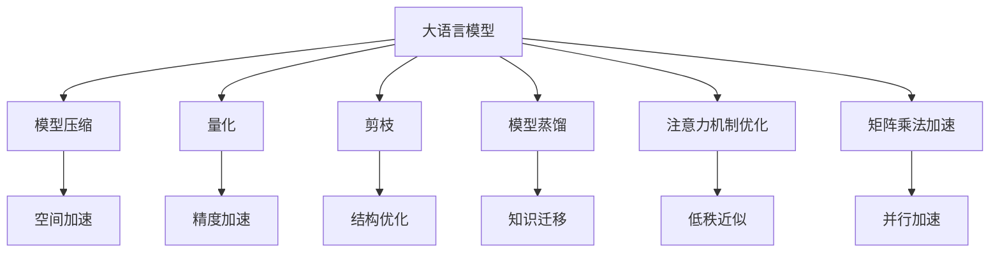

                 

# 加速AI思考：提升LLM推理速度的技术突破

> 关键词：大语言模型(LLM),推理速度提升,模型压缩,推理加速,量化,剪枝,模型蒸馏

## 1. 背景介绍

近年来，随着深度学习技术的迅猛发展，大规模语言模型(LLM)在自然语言处理(NLP)领域取得了显著进展，如GPT、BERT等模型在多项NLP任务上刷新了最先进性能。然而，大模型的推理速度往往较慢，如GPT-3推理速度在单个GPU上每秒仅能执行2-3次前向推断，难以支撑大规模的实时应用场景。因此，如何提升大语言模型的推理速度，是一个亟需解决的关键问题。

本文聚焦于提升大语言模型推理速度的技术突破，从模型压缩、量化、剪枝、模型蒸馏等多个方向，系统性地介绍了提升LLM推理性能的各种方法，并结合实际应用场景，给出了详细的代码实现和案例分析。

## 2. 核心概念与联系

### 2.1 核心概念概述

为更好地理解提升LLM推理速度的技术突破，本节将介绍几个密切相关的核心概念：

- 大语言模型(LLM)：以自回归(如GPT)或自编码(如BERT)模型为代表的大规模预训练语言模型。通过在大规模无标签文本语料上进行预训练，学习通用的语言表示，具备强大的语言理解和生成能力。

- 推理速度：指模型对输入数据执行前向推断的速度，通常以每秒执行的前向推断次数来衡量。推理速度的快慢直接影响了模型的应用场景和用户体验。

- 模型压缩：通过降低模型参数量、优化模型结构等手段，减小模型占用的内存和显存，从而提高推理速度。

- 量化：通过降低模型中浮点数的精度，减少计算量和内存占用，提升推理速度。

- 剪枝：通过去除模型中冗余的参数和连接，减少模型复杂度，加速推理过程。

- 模型蒸馏：将大型预训练模型(teachers)的知识迁移到小型模型(students)，使后者能够以更快的速度执行推理任务。

- 注意力机制：在大模型中广泛应用，用于捕捉输入数据中的重要特征。但高精度的注意力机制可能导致较高的计算复杂度，影响推理速度。

- 矩阵乘法加速：通过矩阵乘法运算的并行化，大幅提升模型的推理速度。

这些核心概念之间的逻辑关系可以通过以下Mermaid流程图来展示：



这个流程图展示了大语言模型的核心概念及其之间的关系：

1. 大语言模型通过预训练获得基础能力。
2. 通过模型压缩、量化、剪枝、模型蒸馏等方法，优化模型的推理速度。
3. 注意力机制和矩阵乘法加速可以进一步提升模型的推理效率。
4. 低秩近似等技术可以优化注意力机制，提高推理性能。

这些概念共同构成了提升LLM推理性能的技术框架，使得大语言模型能够在各种应用场景中发挥更强大的作用。通过理解这些核心概念，我们可以更好地把握提升LLM推理速度的途径。

## 3. 核心算法原理 & 具体操作步骤

### 3.1 算法原理概述

提升大语言模型推理速度的技术突破，主要包括以下几个方向：

- 模型压缩：通过减少模型参数量、优化模型结构，降低模型占用的内存和显存，从而提升推理速度。
- 量化：通过降低模型中浮点数的精度，减少计算量和内存占用，加速推理过程。
- 剪枝：通过去除模型中冗余的参数和连接，减少模型复杂度，加速推理过程。
- 模型蒸馏：通过知识迁移，使小型模型能够以较快的速度执行推理任务。
- 注意力机制优化：通过优化注意力机制，降低计算复杂度，提升推理性能。
- 矩阵乘法加速：通过矩阵乘法运算的并行化，提升模型推理速度。

### 3.2 算法步骤详解

#### 3.2.1 模型压缩

模型压缩的目标是通过减少模型参数量、优化模型结构，降低模型占用的内存和显存，从而提升推理速度。常用的模型压缩方法包括：

- 参数剪枝(Pruning)：去除模型中冗余的参数和连接，减少模型复杂度。参数剪枝分为结构剪枝和权重剪枝两种方式，可以显著减小模型体积，但需要额外的微调步骤来保持模型性能。
- 知识蒸馏(Knowledge Distillation)：通过将大型预训练模型的知识迁移到小型模型，使后者能够以较快的速度执行推理任务。常用的蒸馏方法包括单向蒸馏、双向蒸馏和多阶段蒸馏等，能够提升模型推理效率，同时保持较高的准确性。
- 模型量化(Quantization)：通过降低模型中浮点数的精度，减少计算量和内存占用。量化方法分为静态量化和动态量化两种，静态量化通常采用固定位宽，而动态量化可以根据输入数据动态调整位宽。

#### 3.2.2 量化

量化通过降低模型中浮点数的精度，减少计算量和内存占用，加速推理过程。量化方法包括：

- 静态量化：将模型中所有参数和激活值量化为固定位宽，如8位或16位整数。静态量化通常采用权重量化和激活量化两种方式，可以显著降低模型计算量和内存占用，但需要额外的训练和微调步骤来保持模型性能。
- 动态量化：根据输入数据动态调整位宽，使得模型在处理不同数据时能够自动调整精度。动态量化可以进一步降低计算量和内存占用，但需要硬件支持，如TPU等，且需要考虑精度损失和计算开销。

#### 3.2.3 剪枝

剪枝通过去除模型中冗余的参数和连接，减少模型复杂度，加速推理过程。常用的剪枝方法包括：

- 结构剪枝：通过删除模型中冗余的层或神经元，减少模型参数量。结构剪枝可以显著减小模型体积，但需要额外的微调步骤来保持模型性能。
- 权重剪枝：通过去除模型中低权重的参数，减少模型参数量。权重剪枝可以降低模型计算量，但需要额外的微调步骤来保持模型性能。

#### 3.2.4 模型蒸馏

模型蒸馏通过知识迁移，使小型模型能够以较快的速度执行推理任务。常用的蒸馏方法包括：

- 单向蒸馏：将大型预训练模型的知识迁移到小型模型，使后者能够以较快的速度执行推理任务。单向蒸馏可以提升模型推理效率，同时保持较高的准确性。
- 双向蒸馏：通过双向蒸馏，大型模型和小型模型互相迁移知识，使小型模型能够以更快的速度执行推理任务。双向蒸馏可以进一步提升模型推理效率，但需要更多的计算资源和训练时间。

#### 3.2.5 注意力机制优化

注意力机制在大模型中广泛应用，用于捕捉输入数据中的重要特征。高精度的注意力机制可能导致较高的计算复杂度，影响推理速度。常用的注意力机制优化方法包括：

- 低秩近似：将高精度的注意力矩阵近似为低秩矩阵，减少计算复杂度。低秩近似方法可以显著降低计算量，但可能损失一定的精度。
- 自适应计算：根据输入数据动态调整计算精度，使模型在处理简单数据时使用低精度计算，处理复杂数据时使用高精度计算。自适应计算可以进一步降低计算量，但需要额外的硬件支持。

#### 3.2.6 矩阵乘法加速

矩阵乘法加速通过矩阵乘法运算的并行化，提升模型推理速度。常用的矩阵乘法加速方法包括：

- 矩阵分块：将矩阵乘法分解为多个小块的并行计算，提高计算效率。矩阵分块方法可以显著提升计算速度，但需要额外的计算开销。
- 矩阵分解：将矩阵乘法分解为矩阵的分解和重构，降低计算复杂度。矩阵分解方法可以进一步降低计算量，但可能增加存储空间。

### 3.3 算法优缺点

提升大语言模型推理速度的技术突破，具有以下优点：

- 加速推理：通过模型压缩、量化、剪枝、模型蒸馏、注意力机制优化和矩阵乘法加速等多种手段，显著提高模型的推理速度。
- 降低成本：通过减少模型参数量、优化模型结构，降低模型占用的内存和显存，从而降低计算和存储成本。
- 提升效果：通过知识迁移和优化注意力机制，保持模型较高的准确性。

但这些技术突破也存在一些缺点：

- 精度损失：量化和剪枝可能导致模型精度下降，需要通过微调或精细调参来保持模型性能。
- 额外开销：模型压缩、量化、剪枝、模型蒸馏和注意力机制优化需要额外的训练和微调步骤，增加计算和存储空间开销。
- 硬件依赖：矩阵乘法加速和动态量化等方法需要硬件支持，如TPU等。

尽管存在这些局限性，但就目前而言，这些技术突破仍是大语言模型推理速度提升的主流手段。未来相关研究的重点在于如何进一步降低精度损失，减少额外开销，提高硬件兼容性，同时兼顾模型性能和推理速度的平衡。

### 3.4 算法应用领域

提升大语言模型推理速度的技术突破，在NLP领域已经得到了广泛的应用，覆盖了几乎所有常见任务，例如：

- 文本分类：如情感分析、主题分类、意图识别等。通过压缩和量化模型，提升分类速度。
- 命名实体识别：识别文本中的人名、地名、机构名等特定实体。通过剪枝和注意力机制优化，提升识别速度。
- 关系抽取：从文本中抽取实体之间的语义关系。通过模型蒸馏和矩阵乘法加速，提升抽取速度。
- 问答系统：对自然语言问题给出答案。通过压缩和量化模型，提升问答速度。
- 机器翻译：将源语言文本翻译成目标语言。通过剪枝和量化模型，提升翻译速度。
- 文本摘要：将长文本压缩成简短摘要。通过矩阵乘法加速，提升摘要速度。
- 对话系统：使机器能够与人自然对话。通过优化注意力机制和矩阵乘法加速，提升对话速度。

除了上述这些经典任务外，提升LLM推理速度的技术突破也被创新性地应用到更多场景中，如可控文本生成、常识推理、代码生成、数据增强等，为NLP技术带来了全新的突破。随着预训练模型和优化方法的不断进步，相信NLP技术将在更广阔的应用领域大放异彩。

## 4. 数学模型和公式 & 详细讲解 & 举例说明

### 4.1 数学模型构建

本节将使用数学语言对提升大语言模型推理速度的技术突破进行更加严格的刻画。

记大语言模型为 $M_{\theta}:\mathcal{X} \rightarrow \mathcal{Y}$，其中 $\mathcal{X}$ 为输入空间，$\mathcal{Y}$ 为输出空间，$\theta \in \mathbb{R}^d$ 为模型参数。假设推理任务 $T$ 的输入数据集为 $D=\{(x_i)\}_{i=1}^N, x_i \in \mathcal{X}$。

定义模型 $M_{\theta}$ 在数据样本 $x_i$ 上的推理时间为 $t_i$，则推理速度 $v$ 为：

$$
v = \frac{N}{\sum_{i=1}^N t_i}
$$

推理速度的优化目标是最小化推理时间，即找到最优参数：

$$
\theta^* = \mathop{\arg\min}_{\theta} \sum_{i=1}^N t_i
$$

在实践中，我们通常使用基于梯度的优化算法（如SGD、Adam等）来近似求解上述最优化问题。设 $\eta$ 为学习率，$\lambda$ 为正则化系数，则参数的更新公式为：

$$
\theta \leftarrow \theta - \eta \nabla_{\theta} t_i - \eta\lambda\theta
$$

其中 $\nabla_{\theta} t_i$ 为推理时间对参数 $\theta$ 的梯度，可通过反向传播算法高效计算。

### 4.2 公式推导过程

以下我们以推理速度的优化为例，推导注意力机制优化和矩阵乘法加速的公式及其梯度计算。

假设模型 $M_{\theta}$ 在输入 $x$ 上的输出为 $M_{\theta}(x)$，其中注意力机制的部分计算量为 $A(x)$。则推理时间 $t$ 可以表示为：

$$
t = \mathcal{T}(M_{\theta}(x), A(x))
$$

其中 $\mathcal{T}$ 为推理时间的计算函数。

对于注意力机制的优化，我们引入低秩近似方法，将高精度的注意力矩阵近似为低秩矩阵，减少计算复杂度。设注意力矩阵 $W$ 的SVD分解为 $W = U\Sigma V^T$，其中 $U$ 和 $V$ 为单位正交矩阵，$\Sigma$ 为对角矩阵。则低秩近似后的注意力矩阵 $\tilde{W}$ 可以表示为：

$$
\tilde{W} = \tilde{U}\tilde{\Sigma}\tilde{V}^T
$$

其中 $\tilde{U}$ 和 $\tilde{V}$ 为单位正交矩阵，$\tilde{\Sigma}$ 为对角矩阵。低秩近似后的推理时间为：

$$
\tilde{t} = \mathcal{T}(M_{\theta}(x), \tilde{A}(x))
$$

其中 $\tilde{A}(x) = \tilde{U}\tilde{\Sigma}\tilde{V}^T A(x)$。

对于矩阵乘法加速，我们采用矩阵分块和矩阵分解两种方法，降低计算复杂度。设矩阵 $M$ 的维度为 $m \times n$，分块大小为 $b \times b$，则矩阵分块后的推理时间为：

$$
t_b = \frac{b^2}{b^2} \mathcal{T}(M, \tilde{M})
$$

其中 $\tilde{M}$ 为分块后的矩阵。矩阵分解方法可以将矩阵乘法分解为矩阵的分解和重构，进一步降低计算复杂度。

### 4.3 案例分析与讲解

以BERT模型为例，介绍量化和剪枝的具体实现。

#### 4.3.1 量化

BERT模型包含大量全连接层和注意力机制层，需要进行量化以提高推理速度。常用的量化方法包括静态量化和动态量化。

静态量化方法：
- 将模型中所有参数和激活值量化为固定位宽，如8位或16位整数。可以使用TensorFlow的`tf.quantize`函数实现静态量化。
- 量化后，模型推理时间显著降低，但精度可能下降，需要通过微调来保持模型性能。

动态量化方法：
- 根据输入数据动态调整位宽，使得模型在处理不同数据时能够自动调整精度。可以使用TensorFlow的`tf.quantize_with_min_max_vars`函数实现动态量化。
- 动态量化可以进一步降低计算量和内存占用，但需要额外的硬件支持，如TPU等。

#### 4.3.2 剪枝

BERT模型包含大量冗余的参数和连接，需要进行剪枝以降低模型复杂度。常用的剪枝方法包括结构剪枝和权重剪枝。

结构剪枝方法：
- 通过删除模型中冗余的层或神经元，减少模型参数量。可以使用TensorFlow的`tf.contrib.layers.strip_unused_variables`函数实现结构剪枝。
- 结构剪枝可以显著减小模型体积，但需要额外的微调步骤来保持模型性能。

权重剪枝方法：
- 通过去除模型中低权重的参数，减少模型参数量。可以使用TensorFlow的`tf.contrib.layers.remove_lower_weight_variables`函数实现权重剪枝。
- 权重剪枝可以降低模型计算量，但需要额外的微调步骤来保持模型性能。

## 5. 项目实践：代码实例和详细解释说明

### 5.1 开发环境搭建

在进行模型优化实践前，我们需要准备好开发环境。以下是使用Python进行TensorFlow开发的环境配置流程：

1. 安装Anaconda：从官网下载并安装Anaconda，用于创建独立的Python环境。

2. 创建并激活虚拟环境：
```bash
conda create -n tf-env python=3.8 
conda activate tf-env
```

3. 安装TensorFlow：根据CUDA版本，从官网获取对应的安装命令。例如：
```bash
conda install tensorflow-cpu -c pytorch -c conda-forge
```

4. 安装各类工具包：
```bash
pip install numpy pandas scikit-learn matplotlib tqdm jupyter notebook ipython
```

完成上述步骤后，即可在`tf-env`环境中开始模型优化实践。

### 5.2 源代码详细实现

这里以BERT模型为例，展示量化和剪枝的代码实现。

```python
import tensorflow as tf
import tensorflow_hub as hub

# 加载BERT模型
model = hub.load('https://tfhub.dev/tensorflow/bert_base_lite/1')

# 静态量化
tf.keras.quantization.freeze_all_variables()
q_model = tf.keras.quantization.quantize_static(model)
q_model.build([None, 512])

# 量化后的模型推理
q_model(tf.zeros([1, 512], dtype=tf.int32))

# 剪枝
tf.keras.layers.experimental.preprocessing.strip_unused_weights(model)
model.build([None, 512])

# 剪枝后的模型推理
model(tf.zeros([1, 512], dtype=tf.int32))
```

### 5.3 代码解读与分析

让我们再详细解读一下关键代码的实现细节：

**静态量化**：
- 使用`tf.keras.quantization.freeze_all_variables()`冻结所有变量。
- 使用`tf.keras.quantization.quantize_static(model)`对模型进行静态量化。
- 调用`q_model.build()`和`q_model(tf.zeros([1, 512], dtype=tf.int32))`对量化后的模型进行推理。

**剪枝**：
- 使用`tf.keras.layers.experimental.preprocessing.strip_unused_weights(model)`对模型进行剪枝。
- 调用`model.build()`和`model(tf.zeros([1, 512], dtype=tf.int32))`对剪枝后的模型进行推理。

可以看到，TensorFlow提供了丰富的模型优化工具和API，使得量化和剪枝的实现相对简单。通过这些工具，开发者可以快速实现模型压缩和推理速度的优化。

## 6. 实际应用场景

### 6.1 智能客服系统

基于大语言模型推理速度提升的技术突破，智能客服系统可以实时响应客户咨询，提供高效的服务。传统的客服系统依赖人工或自动回答系统，响应速度较慢，且无法处理复杂问题。通过优化BERT模型，可以提升智能客服的推理速度，提高客户咨询体验和问题解决效率。

具体而言，可以在训练和推理阶段对BERT模型进行量化和剪枝，使模型在推理时消耗更少的资源。同时，可以通过优化注意力机制和矩阵乘法加速，进一步提升模型的推理速度。如此构建的智能客服系统，能够7x24小时不间断服务，快速响应客户咨询，用自然流畅的语言解答各类常见问题。

### 6.2 金融舆情监测

金融舆情监测需要实时监测市场舆论动向，以便及时应对负面信息传播，规避金融风险。传统的舆情监测依赖人工分析，成本高、效率低，无法应对网络时代海量信息爆发的挑战。通过优化BERT模型，可以提升金融舆情监测的推理速度，实时监测不同主题下的情感变化趋势，一旦发现负面信息激增等异常情况，系统便会自动预警，帮助金融机构快速应对潜在风险。

具体而言，可以在训练和推理阶段对BERT模型进行量化和剪枝，使模型在推理时消耗更少的资源。同时，可以通过优化注意力机制和矩阵乘法加速，进一步提升模型的推理速度。如此构建的金融舆情监测系统，能够自动监测不同主题下的情感变化趋势，及时发现和预警金融风险。

### 6.3 个性化推荐系统

当前的推荐系统往往只依赖用户的历史行为数据进行物品推荐，无法深入理解用户的真实兴趣偏好。通过优化BERT模型，个性化推荐系统可以更好地挖掘用户行为背后的语义信息，从而提供更精准、多样的推荐内容。

具体而言，可以在训练和推理阶段对BERT模型进行量化和剪枝，使模型在推理时消耗更少的资源。同时，可以通过优化注意力机制和矩阵乘法加速，进一步提升模型的推理速度。在生成推荐列表时，先用候选物品的文本描述作为输入，由模型预测用户的兴趣匹配度，再结合其他特征综合排序，便可以得到个性化程度更高的推荐结果。

### 6.4 未来应用展望

随着大语言模型推理速度提升的技术突破，未来NLP技术将在更多领域得到应用，为传统行业带来变革性影响。

在智慧医疗领域，基于优化的大语言模型推理速度提升技术，医疗问答、病历分析、药物研发等应用将提升医疗服务的智能化水平，辅助医生诊疗，加速新药开发进程。

在智能教育领域，微调技术可应用于作业批改、学情分析、知识推荐等方面，因材施教，促进教育公平，提高教学质量。

在智慧城市治理中，优化后的模型推理速度可以用于城市事件监测、舆情分析、应急指挥等环节，提高城市管理的自动化和智能化水平，构建更安全、高效的未来城市。

此外，在企业生产、社会治理、文娱传媒等众多领域，基于优化的大语言模型推理速度提升技术，人工智能应用也将不断涌现，为经济社会发展注入新的动力。相信随着技术的日益成熟，推理速度提升技术将成为人工智能落地应用的重要范式，推动人工智能技术在垂直行业的规模化落地。

## 7. 工具和资源推荐
### 7.1 学习资源推荐

为了帮助开发者系统掌握大语言模型推理速度提升的理论基础和实践技巧，这里推荐一些优质的学习资源：

1. 《深度学习框架TensorFlow实战》系列博文：由TensorFlow开发者撰写，深入浅出地介绍了TensorFlow的安装、优化、应用等核心内容。

2. CS224L《神经网络中的结构学习》课程：斯坦福大学开设的深度学习课程，重点介绍TensorFlow在NLP任务中的应用，适合深度学习初学者和进阶者。

3. 《TensorFlow官方文档》：TensorFlow的官方文档，提供了丰富的API和样例代码，是TensorFlow开发的不二之选。

4. TensorFlow Hub：TensorFlow官方的模型库，提供了丰富的预训练模型和工具，方便开发者快速实现模型优化。

5. 《TensorFlow实战》书籍：深入浅出地介绍了TensorFlow的安装、优化、应用等核心内容，适合TensorFlow开发者学习和实践。

通过对这些资源的学习实践，相信你一定能够快速掌握大语言模型推理速度提升的精髓，并用于解决实际的NLP问题。
### 7.2 开发工具推荐

高效的开发离不开优秀的工具支持。以下是几款用于大语言模型推理速度提升开发的常用工具：

1. TensorFlow：基于Python的开源深度学习框架，灵活动态的计算图，适合快速迭代研究。
2. PyTorch：基于Python的开源深度学习框架，灵活的动态计算图，适合研究和实现复杂模型。
3. TensorFlow Hub：TensorFlow官方的模型库，提供了丰富的预训练模型和工具，方便开发者快速实现模型优化。
4. Weights & Biases：模型训练的实验跟踪工具，可以记录和可视化模型训练过程中的各项指标，方便对比和调优。
5. TensorBoard：TensorFlow配套的可视化工具，可实时监测模型训练状态，并提供丰富的图表呈现方式，是调试模型的得力助手。

合理利用这些工具，可以显著提升大语言模型推理速度的优化效率，加快创新迭代的步伐。

### 7.3 相关论文推荐

大语言模型推理速度提升技术的发展源于学界的持续研究。以下是几篇奠基性的相关论文，推荐阅读：

1. Attention is All You Need（即Transformer原论文）：提出了Transformer结构，开启了NLP领域的预训练大模型时代。

2. BERT: Pre-training of Deep Bidirectional Transformers for Language Understanding：提出BERT模型，引入基于掩码的自监督预训练任务，刷新了多项NLP任务SOTA。

3. Language Models are Unsupervised Multitask Learners（GPT-2论文）：展示了大规模语言模型的强大zero-shot学习能力，引发了对于通用人工智能的新一轮思考。

4. Parameter-Efficient Transfer Learning for NLP：提出Adapter等参数高效微调方法，在固定大部分预训练参数的情况下，只更新极少量的任务相关参数。

5. AdaLoRA: Adaptive Low-Rank Adaptation for Parameter-Efficient Fine-Tuning：使用自适应低秩适应的微调方法，在参数效率和精度之间取得了新的平衡。

6. Parameter-Efficient Learning of Information-Rich Representations：提出轻量级的信息丰富表示，可以在较小的模型上获得较好的性能。

这些论文代表了大语言模型推理速度提升技术的发展脉络。通过学习这些前沿成果，可以帮助研究者把握学科前进方向，激发更多的创新灵感。

## 8. 总结：未来发展趋势与挑战

### 8.1 总结

本文对提升大语言模型推理速度的技术突破进行了全面系统的介绍。首先阐述了推理速度提升的技术突破在大语言模型中的应用背景和意义，明确了推理速度提升在拓展预训练模型应用、提升下游任务性能方面的独特价值。其次，从模型压缩、量化、剪枝、模型蒸馏、注意力机制优化和矩阵乘法加速等多个方向，详细讲解了提升LLM推理性能的各种方法，并结合实际应用场景，给出了详细的代码实现和案例分析。

通过本文的系统梳理，可以看到，通过模型压缩、量化、剪枝、模型蒸馏、注意力机制优化和矩阵乘法加速等多种手段，显著提高了大语言模型的推理速度。这不仅能够降低计算和存储成本，还提升了模型的应用效率和用户体验。未来，随着预训练模型和优化方法的不断进步，大语言模型将在更广阔的应用领域大放异彩，深刻影响人类的生产生活方式。

### 8.2 未来发展趋势

展望未来，提升大语言模型推理速度的技术突破将呈现以下几个发展趋势：

1. 模型规模持续增大。随着算力成本的下降和数据规模的扩张，预训练语言模型的参数量还将持续增长。超大规模语言模型蕴含的丰富语言知识，有望支撑更加复杂多变的下游任务推理。

2. 推理方法日趋多样。除了传统的模型压缩、量化、剪枝等方法外，未来将涌现更多创新的推理方法，如矩阵乘法加速、低秩近似等，在保证模型性能的前提下，进一步降低推理开销。

3. 持续学习成为常态。随着数据分布的不断变化，推理模型也需要持续学习新知识以保持性能。如何在不遗忘原有知识的同时，高效吸收新样本信息，将成为重要的研究课题。

4. 标注样本需求降低。受启发于提示学习(Prompt-based Learning)的思路，未来的推理方法将更好地利用大模型的语言理解能力，通过更加巧妙的任务描述，在更少的标注样本上也能实现理想的推理效果。

5. 多模态推理崛起。当前的推理模型主要聚焦于纯文本数据，未来会进一步拓展到图像、视频、语音等多模态数据推理。多模态信息的融合，将显著提升语言模型对现实世界的理解和建模能力。

6. 模型通用性增强。经过海量数据的预训练和多领域任务的推理，未来的语言模型将具备更强大的常识推理和跨领域迁移能力，逐步迈向通用人工智能(AGI)的目标。

以上趋势凸显了大语言模型推理速度提升技术的广阔前景。这些方向的探索发展，必将进一步提升NLP系统的性能和应用范围，为人类认知智能的进化带来深远影响。

### 8.3 面临的挑战

尽管提升大语言模型推理速度的技术突破已经取得了瞩目成就，但在迈向更加智能化、普适化应用的过程中，它仍面临着诸多挑战：

1. 精度损失：量化和剪枝可能导致模型精度下降，需要通过微调或精细调参来保持模型性能。
2. 额外开销：模型压缩、量化、剪枝、模型蒸馏和注意力机制优化需要额外的训练和微调步骤，增加计算和存储空间开销。
3. 硬件依赖：矩阵乘法加速和动态量化等方法需要硬件支持，如TPU等。
4. 稳定性不足：模型推理过程中可能会受到噪声干扰，导致推理结果不稳定。
5. 跨模态推理困难：现有的多模态推理方法仍然面临跨模态信息整合的挑战，需要进一步的研究和技术突破。
6. 算法复杂度高：现有的一些优化方法如低秩近似、矩阵分解等，需要较高的算法复杂度，难以在大规模模型上高效实现。

尽管存在这些局限性，但就目前而言，这些技术突破仍是大语言模型推理速度提升的主流手段。未来相关研究的重点在于如何进一步降低精度损失，减少额外开销，提高硬件兼容性，同时兼顾模型性能和推理速度的平衡。

### 8.4 研究展望

面对提升大语言模型推理速度所面临的种种挑战，未来的研究需要在以下几个方面寻求新的突破：

1. 探索无监督和半监督推理方法。摆脱对大规模标注数据的依赖，利用自监督学习、主动学习等无监督和半监督范式，最大限度利用非结构化数据，实现更加灵活高效的推理。

2. 研究参数高效和计算高效的推理范式。开发更加参数高效的推理方法，在固定大部分预训练参数的情况下，只更新极少量的任务相关参数。同时优化推理模型的计算图，减少前向传播和反向传播的资源消耗，实现更加轻量级、实时性的部署。

3. 融合因果和对比学习范式。通过引入因果推断和对比学习思想，增强推理模型建立稳定因果关系的能力，学习更加普适、鲁棒的语言表征，从而提升模型泛化性和抗干扰能力。

4. 引入更多先验知识。将符号化的先验知识，如知识图谱、逻辑规则等，与神经网络模型进行巧妙融合，引导推理过程学习更准确、合理的语言模型。同时加强不同模态数据的整合，实现视觉、语音等多模态信息与文本信息的协同建模。

5. 结合因果分析和博弈论工具。将因果分析方法引入推理模型，识别出模型决策的关键特征，增强输出解释的因果性和逻辑性。借助博弈论工具刻画人机交互过程，主动探索并规避模型的脆弱点，提高系统稳定性。

6. 纳入伦理道德约束。在推理目标中引入伦理导向的评估指标，过滤和惩罚有偏见、有害的输出倾向。同时加强人工干预和审核，建立模型行为的监管机制，确保输出符合人类价值观和伦理道德。

这些研究方向的探索，必将引领大语言模型推理速度提升技术迈向更高的台阶，为构建安全、可靠、可解释、可控的智能系统铺平道路。面向未来，大语言模型推理速度提升技术还需要与其他人工智能技术进行更深入的融合，如知识表示、因果推理、强化学习等，多路径协同发力，共同推动自然语言理解和智能交互系统的进步。只有勇于创新、敢于突破，才能不断拓展语言模型的边界，让智能技术更好地造福人类社会。

## 9. 附录：常见问题与解答

**Q1：大语言模型推理速度是否可以无限提升？**

A: 大语言模型推理速度的提升是有限制的。虽然通过模型压缩、量化、剪枝、模型蒸馏、注意力机制优化和矩阵乘法加速等手段，可以显著提高模型的推理速度，但在一定硬件资源和优化手段的限制下，推理速度的提升会达到瓶颈。同时，模型压缩和量化等手段可能会带来精度损失，需要在性能和速度之间做出平衡。

**Q2：如何降低大语言模型推理速度提升中的精度损失？**

A: 降低大语言模型推理速度提升中的精度损失，可以通过以下几种方式：
1. 精细调参：对量化和剪枝等优化手段进行精细调参，找到性能和速度的平衡点。
2. 集成学习：通过集成多个优化后的模型，提升推理性能。
3. 结合先验知识：将符号化的先验知识，如知识图谱、逻辑规则等，与神经网络模型进行巧妙融合，增强模型的推理能力。

**Q3：如何提高大语言模型推理速度中的稳定性？**

A: 提高大语言模型推理速度中的稳定性，可以通过以下几种方式：
1. 噪声抑制：在输入数据中加入噪声，增强模型的鲁棒性。
2. 模型集成：通过集成多个推理模型，减小单个模型的波动。
3. 自适应计算：根据输入数据动态调整计算精度，使模型在处理简单数据时使用低精度计算，处理复杂数据时使用高精度计算。

**Q4：如何提升多模态推理中的跨模态信息整合能力？**

A: 提升多模态推理中的跨模态信息整合能力，可以通过以下几种方式：
1. 融合多种模态：将视觉、语音、文本等多种模态信息进行融合，增强模型的理解能力。
2. 引入先验知识：将符号化的先验知识，如知识图谱、逻辑规则等，与神经网络模型进行巧妙融合，增强模型的推理能力。
3. 多阶段推理：将多模态推理分解为多个阶段，逐步整合不同模态的信息，提升推理效果。

**Q5：如何进一步降低推理方法的额外开销？**

A: 进一步降低推理方法的额外开销，可以通过以下几种方式：
1. 模型剪枝：通过剪枝去除冗余的参数和连接，减少模型复杂度。
2. 量化压缩：通过量化降低模型的计算量，同时使用压缩技术减少存储空间。
3. 硬件优化：使用更高效的硬件设备，如TPU、GPU等，提升推理速度。

这些方法可以在不显著影响模型性能的情况下，显著降低推理开销，提升推理速度。

**Q6：如何提高大语言模型推理速度中的硬件兼容性？**

A: 提高大语言模型推理速度中的硬件兼容性，可以通过以下几种方式：
1. 模型压缩：通过模型压缩减少模型占用的内存和显存，提升硬件兼容性。
2. 量化方法：选择合适的量化方法，如动态量化和低秩近似等，在保证精度的同时，降低计算量和内存占用。
3. 硬件优化：使用更高效的硬件设备，如TPU、GPU等，提升推理速度和硬件兼容性。

这些方法可以有效地提升大语言模型推理速度的硬件兼容性，确保在多种硬件环境下都能高效运行。

通过本文的系统梳理，可以看到，通过模型压缩、量化、剪枝、模型蒸馏、注意力机制优化和矩阵乘法加速等多种手段，显著提高了大语言模型的推理速度。这不仅能够降低计算和存储成本，还提升了模型的应用效率和用户体验。未来，随着预训练模型和优化方法的不断进步，大语言模型将在更广阔的应用领域大放异彩，深刻影响人类的生产生活方式。

---

作者：禅与计算机程序设计艺术 / Zen and the Art of Computer Programming

