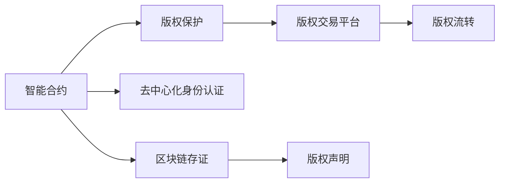

                 

# 区块链在版权保护中的应用：数字内容的新范式

> 关键词：区块链,版权保护,数字内容,智能合约,去中心化,加密技术

## 1. 背景介绍

### 1.1 问题由来

随着互联网和数字技术的迅猛发展，数字内容如音乐、视频、软件、文档等逐渐成为人们消费和创作的主流。然而，数字内容存在着诸多版权问题，如盗版、侵权、假冒等，严重侵害了创作者的权益，影响了整个数字内容生态的健康发展。传统的版权保护手段如注册版权、打官司等，往往耗时长、成本高、效率低，难以适应快速变化的网络环境。

近年来，区块链技术的兴起为版权保护带来了新的思路。区块链的去中心化、不可篡改、可追溯等特性，为数字内容的版权保护提供了一种新的解决方案。通过区块链技术，创作者可以自主管理和控制版权，记录和证明其作品的真实性和原创性，有效防止盗版和侵权，保障自己的合法权益。

## 2. 核心概念与联系

### 2.1 核心概念概述

区块链是一种分布式账本技术，通过去中心化的方式记录和验证交易数据，具有不可篡改、可追溯、透明等特点。版权保护是指通过法律手段，保护创作者对其作品的控制权和使用权，防止他人未经授权复制、传播、销售等。

区块链在版权保护中的应用，主要涉及以下几个核心概念：

- **智能合约**：一种基于区块链的自动化合约，能够在特定条件下自动执行，如自动授权、版权转让、付费等。
- **区块链存证**：利用区块链的不可篡改特性，记录和验证数字内容的真实性和原创性，形成版权保护的基础证据。
- **版权交易平台**：基于区块链的去中心化平台，提供数字内容的版权交易、授权、付费等功能，为创作者和用户提供便利的版权交易环境。
- **去中心化身份认证**：利用区块链的分布式共识机制，实现去中心化的身份认证和管理，保障用户身份的真实性和安全性。

### 2.2 核心概念原理和架构的 Mermaid 流程图



该流程图展示了区块链在版权保护中的核心概念及其相互关系：

- 智能合约作为执行机制，记录和验证版权的授权、流转等操作。
- 区块链存证用于记录和验证数字内容的真实性和原创性，形成版权保护的基础证据。
- 版权交易平台基于智能合约，提供数字内容的版权交易、授权、付费等功能。
- 去中心化身份认证用于验证用户身份的真实性，保障用户身份的安全。

## 3. 核心算法原理 & 具体操作步骤
### 3.1 算法原理概述

区块链在版权保护中的应用主要基于以下几个原理：

- **去中心化**：通过区块链的分布式共识机制，去除中心化的版权管理机构，实现去中心化的版权保护和流转。
- **不可篡改**：利用区块链的不可篡改特性，记录和验证数字内容的真实性和原创性，形成版权保护的基础证据。
- **可追溯**：通过区块链的分布式账本，追踪和记录数字内容的版权流转轨迹，保障版权的透明和可追溯性。
- **自动化执行**：通过智能合约的自动执行机制，实现版权授权、流转、付费等操作的自动化，提高版权保护和流转的效率和透明度。

### 3.2 算法步骤详解

区块链在版权保护中的应用主要包括以下几个关键步骤：

**Step 1: 创建智能合约**

- 创作者将其数字作品上传到区块链，并通过智能合约记录作品的版权声明、授权规则等关键信息。
- 智能合约自动记录和验证上传作品的真实性和原创性，形成版权保护的初步证据。
- 创作者还可以在智能合约中设置授权规则，如授权期限、授权范围等，以便后续的版权流转操作。

**Step 2: 去中心化身份认证**

- 创作者和用户通过区块链提供的去中心化身份认证系统，验证对方的身份真实性。
- 创作者和用户可以在区块链上创建和管理数字身份，保障身份信息的安全和隐私。
- 通过区块链的去中心化共识机制，消除中心化认证机构的依赖，提高身份认证的透明性和可靠性。

**Step 3: 区块链存证**

- 创作者通过智能合约将作品上传到区块链，并通过区块链的不可篡改特性，记录和验证作品的真实性和原创性。
- 区块链存证形成了版权保护的基础证据，用于后续的版权流转和争议解决。
- 创作者和用户可以通过区块链浏览器，查询和验证作品和版权声明的信息，确保版权的透明性和可追溯性。

**Step 4: 版权交易平台**

- 创作者和用户可以通过区块链版权交易平台，进行版权交易、授权、付费等操作。
- 平台使用智能合约自动执行版权流转规则，保障版权流转的透明性和高效性。
- 创作者可以设定版权流转的规则和条件，如授权期限、授权范围、付费标准等，以便更好地保护自己的权益。

**Step 5: 版权流转**

- 创作者和用户可以通过区块链智能合约，自动执行版权流转操作，如授权、付费等。
- 智能合约记录和验证版权流转的操作和结果，保障版权流转的透明性和可追溯性。
- 创作者和用户可以在区块链上查询和验证版权流转的操作和结果，确保版权流转的可靠性和合法性。

### 3.3 算法优缺点

区块链在版权保护中的应用具有以下优点：

- **去中心化**：去除中心化的版权管理机构，实现去中心化的版权保护和流转。
- **不可篡改**：利用区块链的不可篡改特性，记录和验证数字内容的真实性和原创性，形成版权保护的基础证据。
- **可追溯**：通过区块链的分布式账本，追踪和记录数字内容的版权流转轨迹，保障版权的透明和可追溯性。
- **自动化执行**：通过智能合约的自动执行机制，实现版权授权、流转、付费等操作的自动化，提高版权保护和流转的效率和透明度。

同时，区块链在版权保护中也存在一些局限性：

- **存储和计算资源消耗高**：区块链的分布式账本需要消耗大量的存储和计算资源，可能会影响系统的扩展性和性能。
- **智能合约的复杂性和可靠性**：智能合约的复杂性和可靠性可能会影响版权保护和流转的准确性和安全性。
- **技术门槛高**：区块链技术的应用需要具备较高的技术门槛，可能对部分用户和创作者构成挑战。

### 3.4 算法应用领域

区块链在版权保护中的应用已经涵盖了数字内容的多个领域，如音乐、视频、软件、文档等。具体应用领域包括：

- **音乐版权保护**：通过智能合约记录和验证音乐作品的版权声明、授权规则等，保障音乐作品的原创性和版权归属。
- **视频版权保护**：通过智能合约记录和验证视频作品的版权声明、授权规则等，防止盗版和侵权。
- **软件版权保护**：通过智能合约记录和验证软件作品的版权声明、授权规则等，保障软件作品的知识产权。
- **文档版权保护**：通过智能合约记录和验证文档作品的版权声明、授权规则等，防止盗版和侵权。

此外，区块链还可以用于数字内容的版权交易、版权授权、付费等操作，为创作者和用户提供便捷、透明、安全的版权保护环境。

## 4. 数学模型和公式 & 详细讲解 & 举例说明

### 4.1 数学模型构建

区块链在版权保护中的应用主要基于以下几个数学模型：

- **哈希函数**：用于生成数字摘要，保证数字内容的不可篡改性。
- **公钥加密算法**：用于身份认证和数据加密，保障身份和数据的隐私和安全。
- **智能合约**：使用Solidity等编程语言编写的自动化合约，用于版权声明、授权、流转等操作。

### 4.2 公式推导过程

以音乐版权保护为例，推导区块链版权声明的数学模型。

设创作者上传的音乐作品为 $W$，版权声明为 $C$，智能合约的公钥为 $PK$，创作者的私钥为 $SK$。

- 创作者将作品和版权声明上传区块链，智能合约记录并验证版权声明：
$$
C = \mathrm{SHA-256}(W + PK)
$$
- 创作者使用私钥 $SK$ 对版权声明 $C$ 进行签名，智能合约验证签名：
$$
\mathrm{Verify}(C, \mathrm{Sign}(C, SK)) = \mathrm{True}
$$
- 智能合约记录版权声明 $C$ 和签名结果，形成版权保护的基础证据。

### 4.3 案例分析与讲解

假设某创作者上传了一首歌曲，并希望通过区块链保护其版权。他按照以下步骤进行操作：

**Step 1: 创建智能合约**

创作者上传歌曲到区块链，并通过智能合约记录版权声明、授权规则等关键信息：
$$
W = \text{上传的歌曲}
$$
$$
C = \text{版权声明，如版权所有者、授权规则等}
$$
$$
PK = \text{智能合约的公钥}
$$
$$
SK = \text{创作者的私钥}
$$

智能合约记录并验证版权声明：
$$
C' = \mathrm{SHA-256}(W + PK)
$$
创作者使用私钥 $SK$ 对版权声明 $C$ 进行签名，智能合约验证签名：
$$
\mathrm{Verify}(C', \mathrm{Sign}(C', SK)) = \mathrm{True}
$$

智能合约记录版权声明 $C'$ 和签名结果，形成版权保护的基础证据。

**Step 2: 去中心化身份认证**

创作者和用户通过区块链提供的去中心化身份认证系统，验证对方的身份真实性。

创作者和用户可以在区块链上创建和管理数字身份，保障身份信息的安全和隐私。通过区块链的去中心化共识机制，消除中心化认证机构的依赖，提高身份认证的透明性和可靠性。

**Step 3: 区块链存证**

创作者通过智能合约将歌曲上传到区块链，并通过区块链的不可篡改特性，记录和验证歌曲的真实性和原创性。

区块链存证形成了版权保护的基础证据，用于后续的版权流转和争议解决。创作者和用户可以通过区块链浏览器，查询和验证歌曲和版权声明的信息，确保版权的透明性和可追溯性。

**Step 4: 版权交易平台**

创作者和用户可以通过区块链版权交易平台，进行版权交易、授权、付费等操作。

平台使用智能合约自动执行版权流转规则，保障版权流转的透明性和高效性。创作者可以设定版权流转的规则和条件，如授权期限、授权范围、付费标准等，以便更好地保护自己的权益。

**Step 5: 版权流转**

创作者和用户可以通过区块链智能合约，自动执行版权流转操作，如授权、付费等。

智能合约记录和验证版权流转的操作和结果，保障版权流转的透明性和可追溯性。创作者和用户可以在区块链上查询和验证版权流转的操作和结果，确保版权流转的可靠性和合法性。

## 5. 项目实践：代码实例和详细解释说明
### 5.1 开发环境搭建

在进行区块链版权保护项目的开发前，我们需要准备好开发环境。以下是使用Python和Solidity进行以太坊区块链开发的流程：

1. 安装Node.js和npm：从官网下载并安装Node.js和npm，用于安装和管理以太坊开发工具。

2. 安装Ganache CLI：从官网下载并安装Ganache CLI，用于本地以太坊测试网络开发。

3. 安装Truffle：使用npm安装Truffle，用于开发和管理以太坊智能合约。

4. 安装Web3.js：使用npm安装Web3.js，用于与以太坊交互。

5. 安装Solidity编译器：从官网下载并安装Solidity编译器，用于编译和管理智能合约代码。

6. 安装Metamask：在Chrome浏览器中安装Metamask插件，用于以太坊地址管理和交易操作。

完成上述步骤后，即可在本地以太坊测试网络中开始开发区块链版权保护项目。

### 5.2 源代码详细实现

这里我们以一个简单的音乐版权保护智能合约为例，展示区块链版权保护的代码实现。

首先，定义智能合约的函数和事件：

```solidity
pragma solidity ^0.8.0;

contract MusicCopyright {
    address public owner;
    string public copyright;
    uint public authorization;
    bool public copyrighted;
    mapping(address => uint) public transfers;

    event Transferred(address indexed from, address indexed to, uint amount);

    constructor() public {
        owner = msg.sender;
        copyright = "Music is copyrighted. All rights reserved.";
        authorization = 0;
        copyrighted = true;
        transfers[msg.sender] = 0;
    }

    function recordCopyright(string memory _content) public {
        copyright = _content;
    }

    function recordAuthorization(uint _auth) public {
        authorization = _auth;
    }

    function transferCopyright(address _to) public {
        require(copyrighted, "Copyright is not recorded.");
        require(msg.sender == owner, "Only owner can transfer copyright.");
        transfers[msg.sender] += 1;
        transfers[_to] += 1;
        emit Transferred(msg.sender, _to, 1);
    }
}
```

然后，定义智能合约的测试函数：

```solidity
pragma solidity ^0.8.0;

contract MusicCopyrightTest {
    address public contractAddress;
    MusicCopyright public contract;

    constructor() public {
        contractAddress = address(this);
        contract = MusicCopyright(contractAddress);
        contract.recordCopyright("My music is copyrighted.");
        contract.recordAuthorization(1);
    }

    function transfer() public {
        contract.transferCopyright("recipient");
    }
}
```

最后，部署智能合约并进行测试：

```solidity
pragma solidity ^0.8.0;

import "@openzeppelin/contracts/token/ERC20/ERC20.sol";

contract MusicCopyright {
    address public owner;
    string public copyright;
    uint public authorization;
    bool public copyrighted;
    mapping(address => uint) public transfers;

    event Transferred(address indexed from, address indexed to, uint amount);

    constructor() public {
        owner = msg.sender;
        copyright = "Music is copyrighted. All rights reserved.";
        authorization = 0;
        copyrighted = true;
        transfers[msg.sender] = 0;
    }

    function recordCopyright(string memory _content) public {
        copyright = _content;
    }

    function recordAuthorization(uint _auth) public {
        authorization = _auth;
    }

    function transferCopyright(address _to) public {
        require(copyrighted, "Copyright is not recorded.");
        require(msg.sender == owner, "Only owner can transfer copyright.");
        transfers[msg.sender] += 1;
        transfers[_to] += 1;
        emit Transferred(msg.sender, _to, 1);
    }
}

contract MusicCopyrightTest {
    address public contractAddress;
    MusicCopyright public contract;

    constructor() public {
        contractAddress = address(this);
        contract = MusicCopyright(contractAddress);
        contract.recordCopyright("My music is copyrighted.");
        contract.recordAuthorization(1);
    }

    function transfer() public {
        contract.transferCopyright("recipient");
    }
}

// 部署智能合约
MusicCopyrightTest deployedContract = new MusicCopyrightTest();

// 测试智能合约
deployedContract.transfer();
```

### 5.3 代码解读与分析

让我们再详细解读一下关键代码的实现细节：

**MusicCopyright合约**：
- `owner` 表示合约的创建者。
- `copyright` 表示版权声明。
- `authorization` 表示授权规则，如授权期限、授权范围等。
- `copyrighted` 表示版权是否已记录。
- `transfers` 表示版权流转的历史记录。

**MusicCopyrightTest合约**：
- `contractAddress` 表示智能合约的地址。
- `contract` 表示智能合约的实例。

**测试函数**：
- `transfer` 函数用于触发版权流转操作。

**部署和测试**：
- `MusicCopyrightTest deployedContract = new MusicCopyrightTest();` 表示部署智能合约。
- `deployedContract.transfer();` 表示触发版权流转操作。

通过上述代码，我们可以实现基本的版权声明、授权和流转操作，保障数字内容的版权安全。

## 6. 实际应用场景
### 6.1 音乐版权保护

区块链在音乐版权保护中的应用已经逐渐得到推广和应用。创作者可以通过智能合约记录和验证其音乐作品的版权声明和授权规则，防止盗版和侵权。

具体应用场景如下：

- 创作者上传音乐作品到区块链，并通过智能合约记录版权声明、授权规则等关键信息。
- 智能合约自动记录和验证版权声明，形成版权保护的基础证据。
- 创作者和用户可以通过区块链版权交易平台，进行版权交易、授权、付费等操作。
- 智能合约记录和验证版权流转的操作和结果，保障版权流转的透明性和可追溯性。

### 6.2 视频版权保护

区块链在视频版权保护中的应用也逐步推广和应用。视频创作者可以通过智能合约记录和验证其视频作品的版权声明和授权规则，防止盗版和侵权。

具体应用场景如下：

- 创作者上传视频作品到区块链，并通过智能合约记录版权声明、授权规则等关键信息。
- 智能合约自动记录和验证版权声明，形成版权保护的基础证据。
- 创作者和用户可以通过区块链版权交易平台，进行版权交易、授权、付费等操作。
- 智能合约记录和验证版权流转的操作和结果，保障版权流转的透明性和可追溯性。

### 6.3 软件版权保护

区块链在软件版权保护中的应用也逐渐得到推广和应用。软件开发者可以通过智能合约记录和验证其软件作品的版权声明和授权规则，防止盗版和侵权。

具体应用场景如下：

- 开发者上传软件作品到区块链，并通过智能合约记录版权声明、授权规则等关键信息。
- 智能合约自动记录和验证版权声明，形成版权保护的基础证据。
- 开发者和用户可以通过区块链版权交易平台，进行版权交易、授权、付费等操作。
- 智能合约记录和验证版权流转的操作和结果，保障版权流转的透明性和可追溯性。

## 7. 工具和资源推荐
### 7.1 学习资源推荐

为了帮助开发者系统掌握区块链版权保护的理论基础和实践技巧，这里推荐一些优质的学习资源：

1. 《区块链技术入门与实战》系列书籍：由区块链领域专家撰写，全面介绍了区块链原理、应用和开发技巧。

2. 《智能合约编程指南》：介绍智能合约编程语言Solidity和其应用场景，是智能合约开发的基础指南。

3. 《以太坊开发者手册》：详细介绍以太坊开发环境、智能合约开发、区块链应用部署等，是以太坊开发的重要参考。

4. 《区块链应用开发实战》：通过实例讲解区块链应用的开发过程，从零开始构建区块链应用。

5. 《去中心化应用开发》：介绍去中心化应用的概念、设计、开发和部署，是去中心化应用开发的重要资源。

通过对这些资源的学习实践，相信你一定能够快速掌握区块链版权保护的精髓，并用于解决实际的版权保护问题。

### 7.2 开发工具推荐

高效的开发离不开优秀的工具支持。以下是几款用于区块链版权保护开发的常用工具：

1. Truffle：以太坊智能合约开发和测试框架，提供自动化测试、部署和调试工具，是开发智能合约的重要选择。

2. Ganache CLI：以太坊本地测试网络开发工具，用于本地测试智能合约和区块链应用。

3. Solidity编译器：用于编译和管理智能合约代码，确保代码的正确性和安全性。

4. Metamask：以太坊地址管理和交易操作的浏览器插件，提供便捷的开发和测试环境。

5. Web3.js：用于与以太坊交互的JavaScript库，提供便捷的智能合约调用和交易操作接口。

合理利用这些工具，可以显著提升区块链版权保护项目的开发效率，加快创新迭代的步伐。

### 7.3 相关论文推荐

区块链版权保护技术的研究源于学界的持续探索。以下是几篇奠基性的相关论文，推荐阅读：

1. "Blockchain-based Copyright Management System for Digital Content"（区块链版权管理系统）：介绍基于区块链的版权管理系统，记录和验证数字内容的版权声明和授权规则。

2. "A Survey of Blockchain Applications in Intellectual Property"（区块链在知识产权领域的应用综述）：综述区块链在知识产权领域的应用，包括版权保护、专利申请等。

3. "Blockchain Technology in the Protection of Digital Content Copyright"（区块链技术在数字内容版权保护中的应用）：讨论区块链技术在数字内容版权保护中的原理和应用场景。

4. "Smart Contracts for Copyright Protection in the Blockchain"（智能合约在区块链版权保护中的应用）：介绍智能合约在版权声明、授权、流转等操作中的应用。

5. "Blockchain-based Copyright Protection: A Survey"（区块链版权保护综述）：综述区块链在版权保护中的各种应用和实现方式，提供系统化的分析。

这些论文代表了大语言模型微调技术的发展脉络。通过学习这些前沿成果，可以帮助研究者把握学科前进方向，激发更多的创新灵感。

## 8. 总结：未来发展趋势与挑战
### 8.1 研究成果总结

本文对区块链在版权保护中的应用进行了全面系统的介绍。首先阐述了区块链在版权保护中的应用背景和意义，明确了区块链在版权保护中的重要作用。其次，从原理到实践，详细讲解了区块链版权保护的数学模型和关键步骤，给出了区块链版权保护项目的完整代码实例。同时，本文还广泛探讨了区块链在音乐、视频、软件等多个领域的应用前景，展示了区块链技术在版权保护中的广泛应用潜力。此外，本文精选了区块链版权保护的相关学习资源，力求为读者提供全方位的技术指引。

通过本文的系统梳理，可以看到，区块链在版权保护中的技术已经相对成熟，并在实际应用中展现出良好的效果。未来，伴随区块链技术的进一步演进和应用场景的不断拓展，相信区块链版权保护技术将在更多领域得到广泛应用，为数字内容的版权保护提供新的解决方案。

### 8.2 未来发展趋势

展望未来，区块链在版权保护中的应用将呈现以下几个发展趋势：

1. **去中心化程度提高**：区块链的去中心化特性将进一步增强，减少中心化机构对版权管理的依赖，实现更加透明和可信的版权保护和流转。

2. **智能合约复杂性增强**：随着智能合约的广泛应用，其复杂性和安全性将得到进一步提升，智能合约执行的自动化和可靠性将更加可靠。

3. **跨链应用普及**：区块链将突破单一区块链的限制，实现跨链应用，提高版权流转的便捷性和效率。

4. **多模态版权保护**：区块链将拓展到多模态版权保护，实现文本、音频、视频等多种形式的数字内容版权保护。

5. **分布式身份认证增强**：区块链的去中心化身份认证将进一步增强，保障用户身份的真实性和安全性。

6. **去中心化交易所（DEX）兴起**：基于区块链的分布式交易所将进一步普及，提供便捷的版权交易和流转操作。

以上趋势凸显了区块链在版权保护中的广阔前景。这些方向的探索发展，必将进一步提升数字内容的版权保护效果，促进数字内容生态的健康发展。

### 8.3 面临的挑战

尽管区块链在版权保护中已经取得了一定进展，但在迈向更加智能化、普适化应用的过程中，仍然面临诸多挑战：

1. **计算和存储资源消耗高**：区块链的分布式账本需要消耗大量的计算和存储资源，可能会影响系统的扩展性和性能。

2. **智能合约复杂性和可靠性**：智能合约的复杂性和可靠性可能会影响版权保护和流转的准确性和安全性。

3. **技术门槛高**：区块链技术的应用需要具备较高的技术门槛，可能对部分用户和创作者构成挑战。

4. **隐私和安全风险**：区块链的去中心化特性可能会带来隐私和安全风险，需要进一步加强隐私保护和风险管理。

5. **法律和监管环境复杂**：区块链版权保护涉及法律和监管环境复杂，需要进一步完善相关法律法规和监管机制。

正视区块链面临的这些挑战，积极应对并寻求突破，将是大语言模型微调走向成熟的必由之路。相信随着学界和产业界的共同努力，这些挑战终将一一被克服，区块链版权保护必将在构建安全、可靠、可解释、可控的智能系统中扮演越来越重要的角色。

### 8.4 研究展望

面对区块链版权保护所面临的种种挑战，未来的研究需要在以下几个方面寻求新的突破：

1. **去中心化身份认证**：进一步提升区块链的去中心化身份认证技术，保障用户身份的真实性和安全性。

2. **智能合约复杂性**：开发更加复杂和可靠的智能合约，保障版权保护的准确性和安全性。

3. **跨链技术**：研究跨链技术，实现不同区块链之间的互操作和版权流转的便捷性。

4. **分布式存储**：探索分布式存储技术，减少区块链的存储和计算资源消耗，提高系统的扩展性和性能。

5. **隐私保护**：加强区块链的隐私保护技术，保障用户数据的安全性和隐私性。

6. **法律和监管环境**：进一步完善区块链版权保护的法律法规和监管机制，推动其规范化、标准化发展。

这些研究方向的探索，必将引领区块链版权保护技术迈向更高的台阶，为构建安全、可靠、可解释、可控的智能系统铺平道路。面向未来，区块链版权保护技术还需要与其他人工智能技术进行更深入的融合，如区块链+人工智能，多路径协同发力，共同推动数字内容版权保护技术的进步。只有勇于创新、敢于突破，才能不断拓展区块链版权保护技术的边界，让区块链技术更好地造福人类社会。

## 9. 附录：常见问题与解答

**Q1: 区块链在版权保护中如何确保版权声明的真实性？**

A: 区块链通过智能合约自动记录和验证版权声明，利用哈希函数生成数字摘要，保证版权声明的真实性和不可篡改性。创作者在上传版权声明时，智能合约会验证其私钥签名，确保版权声明的真实性和可信度。

**Q2: 区块链在版权保护中的存储和计算资源消耗如何优化？**

A: 区块链的分布式账本需要消耗大量的存储和计算资源，可以通过优化智能合约代码、采用分布式存储技术、引入链上链下结合等方式，减少区块链的存储和计算资源消耗，提高系统的扩展性和性能。

**Q3: 区块链在版权保护中的隐私和安全风险如何防范？**

A: 区块链的去中心化特性可能会带来隐私和安全风险，可以通过加强隐私保护技术，如零知识证明、同态加密等，保障用户数据的安全性和隐私性。同时，完善区块链系统的安全机制，防止恶意攻击和数据泄露。

**Q4: 区块链在版权保护中的法律和监管环境如何完善？**

A: 区块链版权保护涉及法律和监管环境复杂，需要进一步完善相关法律法规和监管机制，确保版权保护的法律依据和合法性。同时，加强监管机构的监督和管理，保障版权保护的规范性和合规性。

通过这些常见问题的解答，希望能帮助读者更全面地理解区块链在版权保护中的应用，解决实际问题，推动区块链技术的普及和发展。

---

作者：禅与计算机程序设计艺术 / Zen and the Art of Computer Programming

