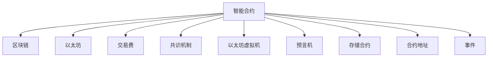

                 

## 1. 背景介绍

### 1.1 问题由来
随着区块链技术的兴起，智能合约作为去中心化应用（DApp）的核心，在金融、供应链、物联网等多个领域大放异彩。智能合约是一种自动执行、不可篡改的代码合约，可以确保交易安全、透明、可信。然而，由于区块链的存储和计算资源有限，传统智能合约的执行效率和可扩展性不足，难以满足实际应用的需求。

### 1.2 问题核心关键点
智能合约的核心在于通过代码实现合同条款，自动执行和监控合约的执行状态。为了提升执行效率和可扩展性，智能合约需要引入新的计算范式和算法，从而优化资源消耗和代码设计。同时，智能合约的设计和实现也需要在安全性、可靠性、去中心化等方面进行深入研究。

### 1.3 问题研究意义
研究智能合约的设计和实现方法，对于构建高效、安全、可扩展的区块链应用具有重要意义：

1. 提高执行效率：通过优化算法和计算模型，提升智能合约的执行速度和可扩展性，以适应更复杂的应用场景。
2. 确保安全性：通过区块链的不可篡改特性，智能合约能够提供更高的交易安全性和抗攻击能力。
3. 降低信任成本：智能合约自动执行和监控，减少了中心化信任中介的需求，降低了交易成本。
4. 促进去中心化：智能合约设计强调去中心化，确保所有用户平等地参与和享受系统服务。
5. 加速创新应用：智能合约为开发者提供了高效的工具和框架，促进了区块链应用的快速迭代和创新。

## 2. 核心概念与联系

### 2.1 核心概念概述

为更好地理解智能合约的实现机制，本节将介绍几个密切相关的核心概念：

- 智能合约（Smart Contract）：一种自动执行、不可篡改的代码合约，部署在区块链上，用于执行和监控合约条款。

- 区块链（Blockchain）：一种分布式账本技术，通过加密和共识算法确保数据的透明和不可篡改性。

- 以太坊（Ethereum）：目前最流行的区块链平台，提供智能合约的支持。

- 交易费（Gas）：区块链交易的成本单位，用于支付网络上的计算和存储资源。

- 共识机制（Consensus Mechanism）：确保区块链网络上的所有节点达成一致的算法，如PoW、PoS等。

- 以太坊虚拟机（EVM）：以太坊的执行环境，用于解释和运行智能合约的代码。

- 预言机（Oracle）：将外部数据引入智能合约的接口，用于增强合约的功能和可靠性。

- 存储合约（Storage Contract）：智能合约中的状态存储区，用于持久化数据。

- 合约地址（Contract Address）：智能合约在区块链上的唯一标识。

- 事件（Event）：智能合约运行时触发的事件，用于记录合约状态变化。

这些核心概念之间的逻辑关系可以通过以下Mermaid流程图来展示：



这个流程图展示了大语言模型的核心概念及其之间的关系：

1. 智能合约通过区块链平台部署和执行。
2. 以太坊作为主要的智能合约平台，提供了执行环境和虚拟机的支持。
3. 交易费用于支付网络资源。
4. 共识机制确保网络共识。
5. 预言机用于连接智能合约和外部数据。
6. 存储合约用于持久化合约状态。
7. 合约地址唯一标识智能合约。
8. 事件用于记录合约状态变化。

这些概念共同构成了智能合约的实现框架，使其能够在区块链网络上高效、安全地运行。通过理解这些核心概念，我们可以更好地把握智能合约的工作原理和优化方向。

## 3. 核心算法原理 & 具体操作步骤
### 3.1 算法原理概述

智能合约的实现主要依赖于区块链平台提供的虚拟机环境（如EVM）和共识算法，以确保代码的执行和数据的验证。智能合约的执行过程分为以下几个步骤：

1. 编写和部署智能合约代码。
2. 触发智能合约的事件。
3. 调用智能合约的函数。
4. 执行智能合约的代码。
5. 记录智能合约的事件。

形式化地，假设智能合约为 $C$，其函数为 $f$，函数调用参数为 $args$，则智能合约的执行过程可以表示为：

$$
C.f(args) \rightarrow [f,\, args] \rightarrow [O,\, R]
$$

其中 $O$ 为执行结果，$R$ 为记录的事件。

智能合约的执行过程是一个自动化的状态转换过程，即从初始状态 $S_0$ 到目标状态 $S_f$ 的转变。在这个过程中，智能合约需要确保：

- 状态转换的不可篡改性。
- 状态转换的可验证性。
- 状态转换的透明性。

这些性质确保了智能合约的执行安全性和可靠性。

### 3.2 算法步骤详解

智能合约的实现主要分为以下几个关键步骤：

**Step 1: 编写智能合约代码**

智能合约的代码编写是一个复杂且需要深入理解区块链技术的过程。开发者需要熟悉区块链平台的编程语言（如Solidity），掌握其核心概念和设计模式，编写高质量的智能合约代码。

**Step 2: 部署智能合约**

智能合约的部署是将代码发布到区块链网络上的过程。不同的区块链平台有不同的部署方法，但总体流程包括：

1. 编写部署脚本，包含智能合约的ABI接口和代码。
2. 调用区块链平台提供的部署接口，将智能合约代码上传至区块链网络。
3. 验证智能合约的代码，确保其符合网络标准和安全要求。

**Step 3: 触发智能合约事件**

智能合约的触发是指通过调用智能合约的函数来执行合约代码。在触发过程中，智能合约会执行一系列的逻辑判断和状态转换，从而实现合约的执行目标。

**Step 4: 调用智能合约函数**

智能合约的函数调用是指通过链上账户调用智能合约的过程。调用函数时，需要传递函数的参数和调用者账户的权限。

**Step 5: 执行智能合约代码**

智能合约的执行过程包括对函数参数的验证、代码逻辑的执行、状态的更新和结果的返回。在这个过程中，智能合约需要确保执行的安全性和可靠性。

**Step 6: 记录智能合约事件**

智能合约的事件记录是通过链上事件的方式，记录合约状态的变化过程。事件记录是智能合约可扩展性的重要组成部分，也是监控和审计的关键手段。

### 3.3 算法优缺点

智能合约的实现方法具有以下优点：

1. 自动化执行：智能合约通过代码实现合约条款，自动执行和监控，减少人为干预。
2. 安全性高：通过区块链的不可篡改特性，智能合约提供了较高的安全性和抗攻击能力。
3. 透明性：智能合约的执行过程和结果透明公开，所有用户都可以进行审计和验证。
4. 可扩展性：智能合约的执行过程可以根据需要调整和优化，提升执行效率和可扩展性。

同时，该方法也存在一定的局限性：

1. 编写难度大：智能合约的编写需要深入理解区块链技术，存在较高的技术门槛。
2. 资源消耗高：智能合约的执行和状态存储需要消耗区块链的计算和存储资源，资源成本较高。
3. 安全性依赖共识算法：智能合约的安全性依赖区块链的共识算法，共识算法的安全性和效率直接影响智能合约的安全性和可靠性。
4. 可扩展性受限：智能合约的可扩展性受到区块链平台的技术限制，可能需要额外的设计优化。
5. 隐私性问题：智能合约的透明性可能带来隐私泄露的问题，需要采取额外的隐私保护措施。

尽管存在这些局限性，但就目前而言，智能合约仍是大规模去中心化应用的核心范式。未来相关研究的重点在于如何进一步优化智能合约的编写和部署方法，提高其安全性和可扩展性，同时兼顾可解释性和隐私性等因素。

### 3.4 算法应用领域

智能合约在区块链领域已经得到了广泛的应用，覆盖了金融、供应链、物联网等多个领域，例如：

- 金融交易：智能合约可以实现自动化的金融交易，减少中间环节和人为干预，提高交易效率和安全性。
- 供应链管理：智能合约用于管理供应链的物流、支付和结算等环节，提高供应链的透明度和可信度。
- 物联网设备管理：智能合约用于管理物联网设备的访问控制和权限分配，确保设备安全和可靠运行。
- 数字资产管理：智能合约用于管理数字资产的发行、交易和清算，确保资产的透明和安全。
- 智能投票系统：智能合约用于管理投票过程的公正性和透明性，确保投票结果的真实和有效。

除了上述这些经典应用外，智能合约还被创新性地应用到更多场景中，如去中心化金融（DeFi）、社交网络治理、去中心化身份认证等，为区块链技术带来了全新的突破。随着智能合约技术的不断进步，相信其在区块链领域的应用将会越来越广泛。

## 4. 数学模型和公式 & 详细讲解  
### 4.1 数学模型构建

智能合约的实现过程可以抽象为一个状态转换模型，每个状态对应一个智能合约的状态数据，每个状态转换对应一个函数调用。假设智能合约的状态为 $S$，状态转换函数为 $F$，函数调用参数为 $args$，则智能合约的状态转换过程可以表示为：

$$
S_{i+1} = F(S_i,\, args)
$$

其中 $S_i$ 为状态，$S_{i+1}$ 为状态转换后的新状态。

在状态转换过程中，智能合约需要验证函数的参数和执行逻辑，确保状态的合法性。通常，智能合约的状态转换过程可以通过以下步骤进行建模：

1. 状态初始化：将智能合约的初始状态数据赋值给 $S_0$。
2. 函数调用过程：当合约被调用时，将函数参数 $args$ 和当前状态 $S_i$ 传递给状态转换函数 $F$，计算新状态 $S_{i+1}$。
3. 状态更新：将新状态 $S_{i+1}$ 更新为当前状态 $S_i$，继续执行下一个函数调用。

智能合约的状态转换过程可以通过数学模型进行建模，如下：

$$
S_i = (S_{i-1},\, F(S_{i-1},\, args_i),\, O_i)
$$

其中 $S_i$ 为状态，$F$ 为状态转换函数，$S_{i-1}$ 为上一个状态，$args_i$ 为函数参数，$O_i$ 为执行结果。

### 4.2 公式推导过程

以下我们以一个简单的金融交易智能合约为例，推导其状态转换模型。

假设智能合约用于管理A和B之间的资金转移，初始状态 $S_0 = (A,\, B,\, amount,\, status)$，其中 $A$ 和 $B$ 为参与方，$amount$ 为转移金额，$status$ 为转移状态。假设函数 $F$ 用于执行资金转移操作，其参数为 $(to,\, amount)$，执行结果为 $(amount,\, status)$。

状态转换过程可以表示为：

$$
S_1 = F(S_0,\, (B,\, 100))
$$

$$
S_2 = F(S_1,\, (A,\, -100))
$$

$$
S_3 = F(S_2,\, (A,\, 0))
$$

其中，$S_1$ 表示资金从B转移到A的过程，$S_2$ 表示资金从A转移到B的过程，$S_3$ 表示资金转移完成后的状态。

通过以上状态转换模型，可以清晰地表示智能合约的执行过程和结果。在实际应用中，状态转换模型还可以扩展到更复杂的场景，如多个参与方、多笔资金转移等。

### 4.3 案例分析与讲解

以下我们将通过一个具体的智能合约案例，详细分析其状态转换过程和执行结果。

假设我们设计一个智能合约，用于管理公司股东的股份转让。初始状态为 $S_0 = (company,\, shareholders,\, holdings,\, transfers,\, status)$，其中 $company$ 为公司名称，$shareholders$ 为股东名单，$holdings$ 为每个股东的持股数量，$transfers$ 为已批准的股份转让记录，$status$ 为合同状态。

函数 $F$ 用于执行股份转让操作，其参数为 $(to,\, amount)$，执行结果为 $(holdings,\, transfers,\, status)$。具体步骤如下：

1. 初始化：将合同状态设置为未批准状态。

2. 函数调用：当股东 $A$ 提出转让申请时，调用函数 $F$ 将 $A$ 的持股数量减少 $amount$，并将申请添加到 $transfers$ 列表中，状态更新为 $S_1$。

3. 审核过程：当股东 $B$ 对转让申请进行审核时，将申请状态设置为“待审核”。

4. 审核通过：当审核通过时，将申请状态设置为“已批准”，并执行转让操作，将 $B$ 的持股数量增加 $amount$，状态更新为 $S_2$。

5. 完成转让：当转让完成后，将申请状态设置为“已完成”，状态更新为 $S_3$。

通过以上状态转换模型，可以清晰地表示智能合约的执行过程和结果。在实际应用中，状态转换模型还可以扩展到更复杂的场景，如多个股东的转让、股份价格变动等。

## 5. 项目实践：代码实例和详细解释说明
### 5.1 开发环境搭建

在进行智能合约开发前，我们需要准备好开发环境。以下是使用Solidity进行智能合约开发的環境配置流程：

1. 安装Truffle Suite：从官网下载并安装Truffle Suite，用于开发、测试和部署智能合约。

2. 安装Node.js和npm：安装Node.js和npm，用于开发环境和打包部署。

3. 安装OpenZeppelin：通过npm安装OpenZeppelin库，用于编写安全的智能合约。

4. 安装Ethers.js：通过npm安装Ethers.js库，用于与以太坊网络交互。

5. 安装Ganache：通过npm安装Ganache，用于本地测试和调试智能合约。

完成上述步骤后，即可在Truffle环境中开始智能合约开发。

### 5.2 源代码详细实现

下面我们以一个简单的智能合约为例，给出使用Solidity编写的智能合约代码。

```solidity
pragma solidity ^0.8.0;

import "@openzeppelin/contracts/access/Ownable.sol";
import "@openzeppelin/contracts/math/SafeMath.sol";

contract OwnershipTransfer is SafeMath, Ownable {
    uint256 public totalSupply = 100;
    uint256 public balance[address[]] = [0];
    
    event Transfer(address indexed from, address indexed to, uint256 amount);
    
    constructor() {
        totalSupply = SafeMath.add(totalSupply, 1);
        for (uint256 i = 0; i < address.length; i++) {
            balance[address[i]] = SafeMath.sub(totalSupply, 1);
        }
    }
    
    function transfer(address receiver, uint256 amount) public {
        require(balance[msg.sender] >= amount);
        require(address(receiver) != address(0));
        uint256 senderAmount = balance[msg.sender];
        uint256 receiverAmount = balance[receiver];
        balance[msg.sender] = SafeMath.sub(balance[msg.sender], amount);
        balance[receiver] = SafeMath.add(balance[receiver], amount);
        emit Transfer(msg.sender, receiver, amount);
    }
}
```

这个智能合约实现了简单的股权转让功能。主要包括：

- 初始化：将总股数设置为100，每个股东的持股数量为99。
- 转账：当股东 $A$ 提出转让申请时，将 $A$ 的持股数量减少 $amount$，并将 $B$ 的持股数量增加 $amount$。
- 事件记录：每次转账时记录转账者的信息、接收者的信息和转让的金额。

### 5.3 代码解读与分析

让我们再详细解读一下关键代码的实现细节：

**pragma solidity**：指定Solidity版本。

**import**：导入OpenZeppelin库和Solidity数学库。

**contract OwnershipTransfer**：定义智能合约。

**uint256 public totalSupply**：声明总股数。

**uint256 public balance[address[]]**：声明每个股东的持股数量。

**event Transfer(address indexed from, address indexed to, uint256 amount)**：声明事件记录。

**constructor**：初始化函数，将总股数设置为100，每个股东的持股数量为99。

**function transfer**：转账函数，接收转账者和接收者的地址以及转账金额。

**require**：条件判断，确保转账金额不超过转账者的持股数量。

**uint256 senderAmount**：计算转账者的持股数量。

**uint256 receiverAmount**：计算接收者的持股数量。

**balance[msg.sender]**：更新转账者的持股数量。

**balance[receiver]**：更新接收者的持股数量。

**emit Transfer**：记录转账事件。

通过以上代码实现，可以清晰地理解智能合约的实现逻辑和状态转换过程。在实际应用中，智能合约的实现可能更加复杂，需要考虑多股东的转让、股票价格变动等因素。

## 6. 实际应用场景
### 6.1 金融交易

智能合约在金融交易中的应用已经较为成熟，涵盖股票、债券、期货等多个领域。智能合约通过自动执行和监控合约条款，提升交易效率和安全性。

在股票交易中，智能合约用于自动执行股票买卖操作，通过程序化交易策略实现更高的交易效率和精度。同时，智能合约还可以用于记录和验证交易记录，确保交易的透明和可信。

在债券交易中，智能合约用于管理债券的发行、结算和支付等环节，确保债券的合法性和安全性。智能合约可以自动执行债券的发行和分配，记录交易记录，提高交易的透明度和可追溯性。

在期货交易中，智能合约用于管理期货合约的执行和结算，确保合约的合法性和安全性。智能合约可以自动执行期货合约的执行，记录交易记录，确保交易的透明和可信。

### 6.2 供应链管理

智能合约在供应链管理中的应用越来越广泛，涵盖物流、支付和结算等多个环节。智能合约通过自动执行和监控合约条款，提升供应链的透明度和可信度。

在物流管理中，智能合约用于管理物流的运输、仓储和配送等环节，确保物流的透明和可信。智能合约可以自动执行物流操作，记录物流记录，提高物流的透明度和可追溯性。

在支付管理中，智能合约用于管理供应链的支付和结算等环节，确保支付的合法性和安全性。智能合约可以自动执行支付操作，记录支付记录，确保支付的透明和可信。

在结算管理中，智能合约用于管理供应链的结算和清算等环节，确保结算的合法性和安全性。智能合约可以自动执行结算操作，记录结算记录，提高结算的透明度和可追溯性。

### 6.3 数字资产管理

智能合约在数字资产管理中的应用也在不断扩展，涵盖数字货币、NFT等多个领域。智能合约通过自动执行和监控合约条款，提升资产的透明和可信度。

在数字货币管理中，智能合约用于管理数字货币的发行、交易和清算等环节，确保数字货币的合法性和安全性。智能合约可以自动执行数字货币的交易，记录交易记录，确保交易的透明和可信。

在NFT管理中，智能合约用于管理数字资产的发行、交易和验证等环节，确保数字资产的合法性和安全性。智能合约可以自动执行数字资产的验证和交易，记录交易记录，确保交易的透明和可信。

### 6.4 未来应用展望

随着智能合约技术的不断进步，其应用范围将进一步扩展，为区块链技术带来新的突破。

在智能合约的下一阶段，将会进一步提升智能合约的执行效率和可扩展性，使其能够适应更复杂的应用场景。同时，智能合约的安全性和可靠性也将得到进一步提升，确保其能够在实际应用中稳定运行。

此外，智能合约的隐私保护和可解释性也将得到重视，使其能够更好地应用于现实世界中的敏感数据和智能决策。智能合约的跨链互操作性也将得到提升，使其能够跨不同的区块链平台运行，实现更加广泛的跨链应用。

## 7. 工具和资源推荐
### 7.1 学习资源推荐

为了帮助开发者系统掌握智能合约的设计和实现方法，这里推荐一些优质的学习资源：

1. Solidity官方文档：Solidity官方文档提供了完整的语言规范和开发指南，是学习智能合约开发的基础。

2. Truffle官方文档：Truffle官方文档提供了完整的开发、测试和部署工具链，是智能合约开发的重要支持。

3. OpenZeppelin官方文档：OpenZeppelin官方文档提供了大量的安全工具和模板，确保智能合约的安全性。

4. ConsenSys《智能合约安全白皮书》：ConsenSys发布了智能合约安全白皮书，提供了全面的安全防护建议。

5. Ethereum官方教程：Ethereum官方教程提供了从基础到高级的智能合约开发教程，帮助开发者快速上手。

6. CryptoZombies游戏：CryptoZombies是一款交互式游戏，通过编写智能合约来获取以太币，帮助开发者在实践中学习智能合约。

通过对这些资源的学习实践，相信你一定能够快速掌握智能合约的设计和实现方法，并用于解决实际的智能合约问题。

### 7.2 开发工具推荐

高效的开发离不开优秀的工具支持。以下是几款用于智能合约开发的常用工具：

1. Truffle Suite：Truffle Suite是智能合约开发、测试和部署的首选工具，提供了丰富的开发环境和开发工具。

2. Remix IDE：Remix IDE是一款交互式的智能合约开发平台，支持Solidity和Vyper等语言。

3. MetaMask：MetaMask是一款以太坊钱包，支持智能合约的部署和测试。

4. Ethers.js：Ethers.js是一个以太坊生态的JavaScript库，支持以太坊网络的交互和智能合约的调用。

5. Ganache：Ganache是一款本地的以太坊测试网络，支持智能合约的开发和测试。

6. Remix CLI：Remix CLI是一款智能合约开发的命令行工具，支持智能合约的部署和测试。

合理利用这些工具，可以显著提升智能合约开发和测试的效率，加快创新迭代的步伐。

### 7.3 相关论文推荐

智能合约技术的发展源于学界的持续研究。以下是几篇奠基性的相关论文，推荐阅读：

1. "Smart Contracts: Scripts for Blockchains"（Smart Contracts: Scripts for Blockchains）：由Nick Szabo撰写，提出了智能合约的概念和基本框架。

2. "Ethereum Yellow Paper"（Ethereum Yellow Paper）：由Vitalik Buterin撰写，详细介绍了以太坊的智能合约机制和应用。

3. "EthereuM: Secure Block-Chain-Based Cryptocurrency"（EthereuM: Secure Block-Chain-Based Cryptocurrency）：由Nick Szabo撰写，介绍了以太坊的智能合约机制和应用。

4. "Ethereum Developer's Guide"（Ethereum Developer's Guide）：由ethereum.org发布，提供了智能合约开发的详细指南。

5. "Secure Smart Contracts: Design and Analysis"（Secure Smart Contracts: Design and Analysis）：由OpenZeppelin发布，提供了智能合约的安全设计和分析方法。

这些论文代表了大语言模型微调技术的发展脉络。通过学习这些前沿成果，可以帮助研究者把握学科前进方向，激发更多的创新灵感。

## 8. 总结：未来发展趋势与挑战

### 8.1 总结

本文对智能合约的设计和实现方法进行了全面系统的介绍。首先阐述了智能合约的背景和意义，明确了智能合约在区块链应用中的核心地位。其次，从原理到实践，详细讲解了智能合约的数学模型和关键步骤，给出了智能合约开发的完整代码实例。同时，本文还广泛探讨了智能合约在金融交易、供应链管理、数字资产管理等众多领域的应用前景，展示了智能合约的巨大潜力。此外，本文精选了智能合约技术的学习资源，力求为读者提供全方位的技术指引。

通过本文的系统梳理，可以看到，智能合约作为区块链应用的核心，在去中心化领域发挥着越来越重要的作用。其自动化执行和监控特性，大大提升了区块链应用的效率和安全性。智能合约的实现需要深入理解区块链技术和设计模式，也需要不断优化和改进。未来，伴随智能合约技术的持续演进，相信其在区块链领域的应用将会越来越广泛。

### 8.2 未来发展趋势

展望未来，智能合约技术将呈现以下几个发展趋势：

1. 执行效率提升：通过优化算法和计算模型，提升智能合约的执行速度和可扩展性，以适应更复杂的应用场景。

2. 安全性和可靠性提升：通过区块链的共识算法和智能合约的设计优化，提升智能合约的安全性和可靠性。

3. 隐私保护增强：通过引入隐私保护技术和隐私计算方法，确保智能合约的隐私安全。

4. 跨链互操作性提升：通过跨链协议和技术，实现智能合约在多个区块链平台之间的互操作性。

5. 可解释性和透明性提升：通过引入可解释性技术和透明机制，增强智能合约的可解释性和透明性。

6. 可扩展性和可定制性提升：通过引入插件和模块化设计，提升智能合约的可扩展性和可定制性。

这些趋势凸显了智能合约技术的广阔前景。这些方向的探索发展，必将进一步提升智能合约的执行效率和安全性，拓展其应用范围。

### 8.3 面临的挑战

尽管智能合约技术已经取得了瞩目成就，但在迈向更加智能化、普适化应用的过程中，它仍面临着诸多挑战：

1. 技术门槛高：智能合约的编写和实现需要深入理解区块链技术和设计模式，存在较高的技术门槛。

2. 资源消耗高：智能合约的执行和状态存储需要消耗区块链的计算和存储资源，资源成本较高。

3. 安全性依赖共识算法：智能合约的安全性依赖区块链的共识算法，共识算法的安全性和效率直接影响智能合约的安全性和可靠性。

4. 隐私保护问题：智能合约的透明性可能带来隐私泄露的问题，需要采取额外的隐私保护措施。

5. 跨链互操作性问题：不同区块链平台之间的互操作性问题，是智能合约应用的一大挑战。

6. 智能合约的可扩展性问题：智能合约的可扩展性受到区块链平台的技术限制，可能需要额外的设计优化。

尽管存在这些挑战，但智能合约技术在区块链领域的应用前景仍然广阔。未来相关研究的重点在于如何进一步优化智能合约的编写和部署方法，提高其安全性和可扩展性，同时兼顾可解释性和隐私性等因素。

### 8.4 研究展望

面对智能合约面临的种种挑战，未来的研究需要在以下几个方面寻求新的突破：

1. 探索更高效的智能合约执行算法：开发更高效的算法和计算模型，提升智能合约的执行效率和可扩展性。

2. 研究更安全的智能合约设计方法：开发更安全的智能合约设计方法，确保智能合约的安全性和可靠性。

3. 引入隐私保护技术和隐私计算方法：引入隐私保护技术和隐私计算方法，确保智能合约的隐私安全。

4. 实现跨链互操作性：通过跨链协议和技术，实现智能合约在多个区块链平台之间的互操作性。

5. 提高智能合约的可解释性和透明性：引入可解释性技术和透明机制，增强智能合约的可解释性和透明性。

6. 研究智能合约的可扩展性和可定制性：通过引入插件和模块化设计，提升智能合约的可扩展性和可定制性。

这些研究方向的探索，必将引领智能合约技术迈向更高的台阶，为区块链应用带来新的突破。面向未来，智能合约技术还需要与其他人工智能技术进行更深入的融合，如知识表示、因果推理、强化学习等，多路径协同发力，共同推动智能合约技术的进步。

## 9. 附录：常见问题与解答

**Q1：智能合约的安全性如何保障？**

A: 智能合约的安全性主要依赖于区块链的共识算法和智能合约的设计优化。区块链的共识算法如PoW、PoS等可以确保网络的安全性和可靠性，智能合约的设计优化如代码审查、安全工具的使用等可以进一步提升智能合约的安全性。

**Q2：智能合约的编写难度大吗？**

A: 智能合约的编写需要深入理解区块链技术和设计模式，存在较高的技术门槛。然而，随着OpenZeppelin等安全工具的普及，智能合约的编写难度正在逐步降低。

**Q3：智能合约的资源消耗如何优化？**

A: 智能合约的资源消耗可以通过优化算法和计算模型，使用混合精度计算，优化状态存储等方法进行优化。同时，智能合约的设计也需要考虑资源的合理使用。

**Q4：智能合约的可扩展性问题如何解决？**

A: 智能合约的可扩展性可以通过引入插件和模块化设计，提高其可扩展性和可定制性。同时，智能合约的设计也需要考虑可扩展性的优化。

**Q5：智能合约的隐私保护问题如何解决？**

A: 智能合约的隐私保护可以通过引入隐私保护技术和隐私计算方法，确保智能合约的隐私安全。同时，智能合约的设计也需要考虑隐私保护的需求。

通过以上常见问题的解答，可以看到，智能合约的实现和应用仍然存在不少挑战。开发者需要在技术、设计、资源等方面进行全面优化和改进，才能更好地应对实际应用中的问题。总之，智能合约的实现需要开发者根据具体应用场景，不断迭代和优化，方能得到理想的效果。

---

作者：禅与计算机程序设计艺术 / Zen and the Art of Computer Programming

