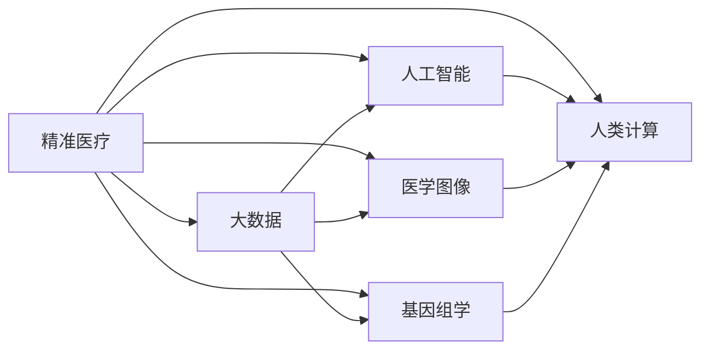

                 

# 医疗保健的未来：人类计算助力精准医疗

> 关键词：精准医疗,人类计算,大数据,AI,机器学习,医学图像,基因组学,可穿戴设备

## 1. 背景介绍

### 1.1 问题由来
人类计算技术在医疗领域的应用，正开启一个崭新的时代。它利用强大的数据分析、机器学习和AI技术，深入挖掘和整合海量医学数据，以期为精准医疗、疾病诊断、个性化治疗等提供更加科学、可靠、高效的解决方案。

目前，医疗行业面临多重挑战：人口老龄化、疾病谱变化、医疗资源不均等等。这些问题要求我们必须更加高效、精准地使用有限的医疗资源，提供个性化的医疗服务。大数据、人工智能等技术的兴起，为解决这些问题提供了新的路径。

### 1.2 问题核心关键点
精准医疗，又称为个体化医疗，是利用先进技术手段，对个体的基因、环境和生活方式等因素进行分析，为患者量身定制最合适的治疗方案，从而实现疾病的早期诊断、精准治疗和高效管理。它涉及基因组学、医学影像、生物信息学、人工智能等多个领域，是人类计算在医疗保健领域的重要应用。

人类计算在精准医疗中的应用主要包括以下几个关键点：

- 数据采集与整合：利用可穿戴设备、基因测序、医学影像等技术，采集患者多维度的健康数据。
- 数据分析与建模：采用机器学习、深度学习等算法，对采集到的数据进行统计分析、特征提取和模式识别，建立疾病预测与诊断模型。
- 智能决策支持：通过人工智能技术，实现智能化的疾病诊断和治疗决策，辅助医生进行精准医疗。
- 实时监控与干预：利用实时数据分析技术，实现疾病的动态监控和早期干预，提升治疗效果。

### 1.3 问题研究意义
精准医疗是人类计算技术在医疗领域的重要应用，具有深远的社会和经济意义：

- 提升医疗效率：精准医疗通过个性化的治疗方案，能够有效减少医疗资源的浪费，提升医疗服务的质量和效率。
- 改善患者体验：精准医疗能够实现疾病的早期发现和高效管理，显著改善患者的治疗体验和生活质量。
- 促进医学进步：精准医疗依托大数据和人工智能技术，推动医学知识的积累和疾病研究的深入，促进医学科学的进步。
- 激发创新发展：精准医疗作为医疗行业的创新点，促进了医疗器械、药品研发等领域的发展，推动了医疗行业的整体进步。

## 2. 核心概念与联系

### 2.1 核心概念概述

要深入理解人类计算在精准医疗中的应用，首先需要明确以下几个核心概念：

- 精准医疗（Precision Medicine）：利用基因组学、医学影像、大数据等技术手段，为个体提供个性化、定制化的医疗方案。
- 人类计算（Human Computation）：利用人类的智能和经验，结合计算技术，解决复杂问题。
- 大数据（Big Data）：大规模、多样化的数据集合，可以从中发现数据间的潜在规律和关系。
- 人工智能（AI）：通过算法和计算模型，使计算机系统具备智能，能够进行自主学习、决策和优化。
- 医学图像（Medical Imaging）：利用图像技术获取人体内部信息，如CT、MRI、X光等。
- 基因组学（Genomics）：研究生物体基因序列及其功能，应用于疾病诊断和治疗。

这些核心概念之间相互关联，共同构成了人类计算在精准医疗中的重要框架。

### 2.2 核心概念原理和架构的 Mermaid 流程图



该图展示了精准医疗中各核心概念之间的联系：

- 精准医疗基于大数据、AI、医学图像、基因组学等技术，构建个体化的医疗方案。
- 人类计算作为精准医疗的重要组成部分，利用人类的智能和经验，辅助AI模型进行决策和优化。

## 3. 核心算法原理 & 具体操作步骤

### 3.1 算法原理概述

人类计算在精准医疗中的应用，主要通过以下两个层面实现：

1. **数据采集与整合**：利用可穿戴设备、基因测序、医学影像等技术，采集患者的生理数据和基因信息。
2. **数据分析与建模**：采用机器学习、深度学习等算法，对采集到的数据进行统计分析、特征提取和模式识别，建立疾病预测与诊断模型。

本文将重点介绍机器学习在精准医疗中的应用。

### 3.2 算法步骤详解

以基于机器学习（特别是深度学习）的疾病预测与诊断模型为例，介绍人类计算在精准医疗中的具体操作步骤：

1. **数据收集**：收集患者的生理数据（如心率、血压、血糖等）、基因数据、医学影像数据等。这些数据可以通过可穿戴设备、基因测序仪、医学影像设备等采集获得。
   
2. **数据预处理**：对收集到的原始数据进行清洗、归一化和标准化处理。去除异常值和噪声，将数据转换为适合机器学习算法处理的格式。

3. **特征提取**：从清洗后的数据中提取有意义的特征。这些特征可以是数值型、时间序列型、图像型等不同类型的数据。

4. **模型训练**：选择合适的机器学习算法（如随机森林、支持向量机、卷积神经网络、循环神经网络等），在标注数据上训练模型。通过交叉验证等技术选择最佳模型。

5. **模型评估**：在验证集上评估模型的性能，如准确率、召回率、F1分数等。根据评估结果调整模型参数。

6. **模型部署**：将训练好的模型部署到实际应用场景中，进行实时数据输入和预测输出。

7. **结果解释**：对模型输出结果进行解释和可视化，帮助医生理解模型决策过程和结果。

### 3.3 算法优缺点

基于机器学习的精准医疗模型具有以下优点：

- 数据驱动：能够从海量数据中发现潜在的规律和关系，提供客观的决策依据。
- 个性化定制：能够根据个体的生理特征和基因信息，提供个性化的医疗方案。
- 实时预测：利用在线数据分析技术，实现实时预测和干预，提升治疗效果。

同时，也存在以下缺点：

- 数据隐私：采集和存储患者的生理数据和基因信息，需要严格遵守数据隐私保护法规。
- 模型复杂：深度学习模型通常结构复杂，难以解释和调试。
- 数据质量：模型的效果很大程度上取决于数据的质量和多样性，数据不足或噪声影响较大时，模型性能可能受损。
- 资源消耗：深度学习模型通常需要较大的计算资源和存储空间，硬件成本较高。

### 3.4 算法应用领域

基于机器学习的精准医疗模型，已经在多个领域取得了显著的应用成果：

1. **疾病预测与诊断**：利用医学影像、基因数据等预测和诊断疾病。如癌症、糖尿病、心血管疾病等。
2. **治疗方案优化**：根据患者的基因信息和生理特征，推荐最合适的治疗方案。如靶向药物治疗、基因编辑等。
3. **治疗效果监测**：实时监测治疗效果，及时调整治疗方案。如肿瘤放疗效果监测。
4. **药物研发**：通过分析药物与基因的相互作用，加速新药研发过程。
5. **个性化健康管理**：根据用户的生理和基因信息，提供个性化的健康管理方案。

## 4. 数学模型和公式 & 详细讲解

### 4.1 数学模型构建

在精准医疗中，常用的机器学习模型包括分类模型、回归模型、序列模型等。这里以基于深度学习的卷积神经网络（CNN）为例，介绍疾病预测与诊断模型的数学模型构建过程。

假设我们要利用医学影像数据预测肿瘤的良恶性。设输入为医学影像 $X$，输出为肿瘤良恶性标签 $y$。其中 $X \in \mathbb{R}^{W \times H \times C}$，$y \in \{0,1\}$。

模型的数学模型可以表示为：

$$
\hat{y} = \sigma(W \cdot X + b)
$$

其中 $W$ 为卷积核权重，$b$ 为偏置项，$\sigma$ 为激活函数。

### 4.2 公式推导过程

1. **卷积层**：
   $$
   Z_{ij} = X_{ij} \ast W_{kj} + b_k
   $$

2. **池化层**：
   $$
   Z'_{i'} = \max(Z_{i'}) \quad \text{for } 1 \leq i' \leq n
   $$

3. **全连接层**：
   $$
   \hat{y} = \sigma(W \cdot Z' + b)
   $$

其中 $W$ 和 $b$ 为可训练参数，$\ast$ 为卷积操作，$\max$ 为池化操作，$\cdot$ 为矩阵乘法，$\sigma$ 为激活函数。

### 4.3 案例分析与讲解

以癌症诊断为例，介绍基于深度学习的精准医疗模型构建过程。

1. **数据准备**：
   - 收集患者的医学影像数据，如X光、CT、MRI等。
   - 将医学影像数据预处理为适合CNN处理的格式。

2. **模型设计**：
   - 设计卷积神经网络模型，包括卷积层、池化层、全连接层等。
   - 设置模型超参数，如卷积核大小、池化大小、全连接层数等。

3. **模型训练**：
   - 在标注数据集上训练模型，使用交叉熵损失函数进行优化。
   - 定期在验证集上评估模型性能，调整超参数。

4. **模型评估**：
   - 在测试集上评估模型的预测性能，计算准确率、召回率、F1分数等指标。
   - 分析模型在不同类型影像上的表现，进行结果解释。

## 5. 项目实践：代码实例和详细解释说明

### 5.1 开发环境搭建

为了搭建深度学习模型进行疾病预测，需要以下开发环境：

1. **安装Python**：Python是深度学习开发的主要语言，可以从官网下载并安装。

2. **安装PyTorch**：PyTorch是深度学习的主流框架之一，使用pip安装即可。

3. **安装相关库**：安装numpy、scikit-learn、tensorboard等常用的Python库。

4. **安装GPU支持**：如果您的设备支持GPU，安装CUDA和cuDNN，用于加速模型训练。

### 5.2 源代码详细实现

以下是一个基于PyTorch的肿瘤分类模型的代码实现：

```python
import torch
import torch.nn as nn
import torch.optim as optim
from torchvision import datasets, transforms

# 定义卷积神经网络模型
class Net(nn.Module):
    def __init__(self):
        super(Net, self).__init__()
        self.conv1 = nn.Conv2d(1, 16, 3, 1, 1)
        self.conv2 = nn.Conv2d(16, 32, 3, 1, 1)
        self.pool = nn.MaxPool2d(2, 2)
        self.fc1 = nn.Linear(32 * 12 * 12, 128)
        self.fc2 = nn.Linear(128, 2)
        self.relu = nn.ReLU()
        self.softmax = nn.Softmax(dim=1)
    
    def forward(self, x):
        x = self.relu(self.conv1(x))
        x = self.pool(x)
        x = self.relu(self.conv2(x))
        x = self.pool(x)
        x = x.view(-1, 32 * 12 * 12)
        x = self.relu(self.fc1(x))
        x = self.fc2(x)
        x = self.softmax(x)
        return x

# 数据准备
transform = transforms.Compose([transforms.ToTensor(), transforms.Normalize((0.5,), (0.5,))])
train_dataset = datasets.MNIST(root='./data', train=True, transform=transform, download=True)
test_dataset = datasets.MNIST(root='./data', train=False, transform=transform, download=True)

# 模型训练
model = Net()
criterion = nn.CrossEntropyLoss()
optimizer = optim.Adam(model.parameters(), lr=0.001)

for epoch in range(10):
    for idx, (img, label) in enumerate(train_loader):
        img = img.to(device)
        label = label.to(device)
        
        outputs = model(img)
        loss = criterion(outputs, label)
        
        optimizer.zero_grad()
        loss.backward()
        optimizer.step()
        
        if idx % 100 == 0:
            print(f'Epoch [{epoch+1}/{10}], Step [{idx+1}/{60*10}], Loss: {loss.item():.4f}')

# 模型评估
correct = 0
total = 0
with torch.no_grad():
    for img, label in test_loader:
        img = img.to(device)
        label = label.to(device)
        
        outputs = model(img)
        _, predicted = torch.max(outputs.data, 1)
        total += label.size(0)
        correct += (predicted == label).sum().item()

print(f'Accuracy of the network on the 10000 test images: {100 * correct / total:.2f}%')
```

### 5.3 代码解读与分析

1. **数据准备**：
   - 使用`transforms`模块对原始数据进行预处理，包括转换为Tensor格式和标准化。
   - 加载训练集和测试集。

2. **模型设计**：
   - 定义卷积神经网络模型Net，包括卷积层、池化层、全连接层等。
   - 使用`nn`模块定义激活函数、损失函数和优化器。

3. **模型训练**：
   - 在训练集上循环迭代，前向传播计算输出和损失，反向传播更新参数。
   - 定期打印训练损失。

4. **模型评估**：
   - 在测试集上计算模型的准确率。

## 6. 实际应用场景

### 6.1 智能诊疗系统

智能诊疗系统是基于深度学习技术的医疗辅助工具，能够提供疾病诊断、治疗方案推荐、风险预测等综合服务。它利用患者的多维健康数据，结合机器学习算法，实现精准医疗。

1. **疾病诊断**：
   - 通过医学影像、基因数据等，利用深度学习模型预测疾病类型和严重程度。
   - 辅助医生进行初步诊断，减少误诊和漏诊。

2. **治疗方案推荐**：
   - 根据患者的生理特征和基因信息，推荐个性化的治疗方案。
   - 提供靶向药物治疗、基因编辑等精准治疗选项。

3. **风险预测**：
   - 通过分析患者的历史数据，预测未来疾病风险。
   - 实现早期干预和个性化健康管理。

### 6.2 远程医疗平台

远程医疗平台通过互联网连接医生和患者，提供远程诊断、咨询和监控服务。利用深度学习模型，平台能够实现快速、高效的疾病诊断和预测。

1. **远程诊断**：
   - 通过可穿戴设备收集患者的生理数据，利用深度学习模型进行实时分析和预测。
   - 辅助医生进行远程诊断，提升诊疗效率。

2. **远程咨询**：
   - 通过智能问答系统，解答患者的常见问题，提供个性化健康建议。
   - 通过自然语言处理技术，实现语音识别和语义理解。

3. **远程监控**：
   - 利用可穿戴设备实时监测患者的生理数据，生成健康报告。
   - 根据监测结果，及时调整治疗方案，实现动态管理。

### 6.3 个性化健康管理

个性化健康管理是基于深度学习技术的健康管理工具，能够根据用户的生理和基因信息，提供个性化的健康建议和管理方案。

1. **健康监测**：
   - 通过可穿戴设备实时监测用户的生理参数（如心率、血压等）。
   - 利用深度学习模型分析数据，生成健康报告。

2. **健康预警**：
   - 通过深度学习模型，预测用户的健康风险。
   - 实现早期预警和干预，提升用户的健康水平。

3. **个性化建议**：
   - 根据用户的基因信息，推荐个性化的饮食、运动和生活习惯。
   - 提供健康管理方案，提升用户的健康水平。

## 7. 工具和资源推荐

### 7.1 学习资源推荐

为了帮助开发者系统掌握深度学习在精准医疗中的应用，这里推荐一些优质的学习资源：

1. **《深度学习基础》课程**：由斯坦福大学开设的深度学习入门课程，系统讲解深度学习的基础概念和算法。

2. **《TensorFlow深度学习》书籍**：TensorFlow官方文档，详细介绍了深度学习的原理和应用。

3. **Kaggle医疗数据集**：Kaggle平台上丰富的医疗数据集，包括癌症、糖尿病、心血管疾病等，适合进行深度学习实践。

4. **Coursera《机器学习》课程**：Coursera上的机器学习课程，由斯坦福大学教授讲解，涵盖了机器学习的基本概念和算法。

5. **GitHub深度学习项目**：GitHub上丰富的深度学习项目和代码，可以快速学习深度学习在医疗领域的应用。

### 7.2 开发工具推荐

高效的开发离不开优秀的工具支持。以下是几款用于深度学习开发的常用工具：

1. **PyTorch**：深度学习的主流框架之一，使用灵活，易于迭代研究。

2. **TensorFlow**：由Google主导的深度学习框架，适合大规模工程应用。

3. **Keras**：基于Python的高层API，简单易用，适合快速搭建深度学习模型。

4. **Jupyter Notebook**：在线交互式开发环境，支持Python代码的快速迭代和调试。

5. **GitHub**：代码版本控制系统，便于版本管理和协作开发。

### 7.3 相关论文推荐

深度学习在精准医疗中的应用，得益于学界的持续研究。以下是几篇奠基性的相关论文，推荐阅读：

1. **《深度学习在医学影像中的应用》**：介绍深度学习在医学影像中的广泛应用，如乳腺癌、肺癌、心脏病等。

2. **《基于深度学习的疾病预测模型》**：提出深度学习模型在疾病预测中的应用，如肿瘤分类、心血管疾病预测等。

3. **《个性化健康管理的深度学习模型》**：介绍深度学习在个性化健康管理中的应用，如饮食推荐、运动指导等。

4. **《基于深度学习的远程医疗系统》**：介绍深度学习在远程医疗中的应用，如远程诊断、咨询和监控等。

这些论文代表了大数据和人工智能在精准医疗中的重要应用，为研究和实践提供了重要的理论基础。

## 8. 总结：未来发展趋势与挑战

### 8.1 研究成果总结

本文对深度学习在精准医疗中的应用进行了全面系统的介绍。重点介绍了数据采集与整合、数据分析与建模、智能决策支持等核心概念和操作步骤，并通过代码实例展示了模型构建和评估的详细流程。

### 8.2 未来发展趋势

展望未来，深度学习在精准医疗中的应用将呈现以下几个趋势：

1. **模型复杂度提升**：随着深度学习模型的不断发展，模型的复杂度和表现能力将不断提升，能够更好地处理多维度和异构化的健康数据。

2. **个性化健康管理普及**：随着深度学习模型的普及，个性化健康管理将成为越来越多人的选择，推动健康管理行业的快速发展。

3. **跨模态融合**：未来的深度学习模型将更加注重多模态数据（如医学影像、基因数据、生理数据等）的整合，实现全面、深入的健康管理。

4. **实时预测与干预**：利用实时数据分析技术，深度学习模型将实现对疾病的动态监测和早期干预，提升治疗效果。

5. **智能医疗助手**：深度学习技术将进一步融入智能医疗助手中，实现病历管理、药品推荐、健康咨询等功能，提升医疗服务的智能化水平。

### 8.3 面临的挑战

尽管深度学习在精准医疗中的应用取得了显著成果，但在迈向更加智能化、普适化应用的过程中，仍面临诸多挑战：

1. **数据隐私保护**：采集和存储患者的生理数据和基因信息，需要严格遵守数据隐私保护法规。如何在保护隐私的同时，利用数据进行精准医疗，是一大挑战。

2. **数据质量和多样性**：模型的效果很大程度上取决于数据的质量和多样性。如何采集到高质量、多样化的大数据，是实现精准医疗的关键。

3. **模型复杂性和解释性**：深度学习模型通常结构复杂，难以解释和调试。如何在保证模型效果的同时，增强模型的可解释性和可控性，是一个重要的研究方向。

4. **计算资源限制**：深度学习模型通常需要较大的计算资源和存储空间，硬件成本较高。如何优化模型结构和资源利用，降低计算成本，是一大挑战。

5. **算法鲁棒性**：深度学习模型面对噪声、异常值等干扰时，鲁棒性较差。如何在复杂多变的实际应用场景中，提高模型的鲁棒性，是实现精准医疗的重要保障。

### 8.4 研究展望

未来的研究需要在以下几个方面寻求新的突破：

1. **无监督学习与半监督学习**：探索无需大量标注数据的深度学习模型，利用无监督学习、半监督学习等方法，最大化数据利用率。

2. **跨模态数据融合**：研究多模态数据融合技术，实现医学影像、基因数据、生理数据等多维数据的整合，提升健康管理的全面性和准确性。

3. **可解释性增强**：开发更易于解释和调试的深度学习模型，增强模型的可解释性和可控性。

4. **模型优化与资源利用**：优化深度学习模型的结构和资源利用，降低计算成本，提高模型效率。

5. **跨学科合作**：加强与医学、生物、工程等学科的合作，推动深度学习技术与医学知识的结合，推动精准医疗的全面发展。

这些研究方向的探索，必将引领深度学习在精准医疗中的应用进入新的高度，为人类健康事业带来深远影响。

## 9. 附录：常见问题与解答

**Q1：深度学习在精准医疗中的应用主要有哪些？**

A: 深度学习在精准医疗中的应用主要包括：

1. **疾病预测与诊断**：利用医学影像、基因数据等预测和诊断疾病。
2. **治疗方案优化**：根据患者的基因信息和生理特征，推荐个性化的治疗方案。
3. **治疗效果监测**：实时监测治疗效果，及时调整治疗方案。
4. **药物研发**：通过分析药物与基因的相互作用，加速新药研发过程。
5. **个性化健康管理**：根据用户的生理和基因信息，提供个性化的健康建议和管理方案。

**Q2：如何保护深度学习模型在精准医疗中的应用中的数据隐私？**

A: 深度学习模型在精准医疗中的应用，需要严格保护患者数据的隐私。以下是一些保护措施：

1. **数据匿名化**：在数据处理过程中，去除敏感信息，如姓名、身份证号等。
2. **差分隐私**：在数据发布时，添加噪声，防止攻击者通过数据分析出具体个体信息。
3. **访问控制**：严格控制数据访问权限，确保只有授权人员能够访问敏感数据。
4. **加密存储**：在数据存储过程中，采用加密技术保护数据安全。
5. **合规管理**：严格遵守相关法律法规，如HIPAA、GDPR等，确保数据处理的合规性。

**Q3：深度学习模型在精准医疗中的应用存在哪些挑战？**

A: 深度学习模型在精准医疗中的应用，面临以下挑战：

1. **数据隐私**：采集和存储患者的生理数据和基因信息，需要严格遵守数据隐私保护法规。
2. **数据质量**：模型的效果很大程度上取决于数据的质量和多样性。
3. **模型复杂性**：深度学习模型通常结构复杂，难以解释和调试。
4. **计算资源限制**：深度学习模型通常需要较大的计算资源和存储空间。
5. **模型鲁棒性**：面对噪声、异常值等干扰时，鲁棒性较差。

**Q4：如何提高深度学习模型在精准医疗中的应用效率？**

A: 提高深度学习模型在精准医疗中的应用效率，可以采取以下措施：

1. **模型压缩**：采用模型压缩技术，如剪枝、量化、蒸馏等，减少模型参数量，降低计算成本。
2. **分布式训练**：利用分布式训练技术，加快模型训练速度，提高计算效率。
3. **数据增强**：利用数据增强技术，增加训练数据的多样性，提高模型的泛化能力。
4. **硬件优化**：采用GPU、TPU等高性能计算设备，提高模型训练和推理速度。
5. **算法优化**：优化算法和模型结构，提高模型的计算效率和鲁棒性。

**Q5：深度学习在精准医疗中的应用前景如何？**

A: 深度学习在精准医疗中的应用前景非常广阔。未来，随着技术的不断进步，深度学习将会在以下几个方面发挥更大作用：

1. **疾病预测与诊断**：深度学习模型能够从海量数据中发现潜在的规律和关系，提供客观的诊断依据。
2. **治疗方案优化**：根据患者的基因信息和生理特征，推荐个性化的治疗方案。
3. **治疗效果监测**：利用实时数据分析技术，实现动态监测和早期干预。
4. **药物研发**：通过分析药物与基因的相互作用，加速新药研发过程。
5. **个性化健康管理**：根据用户的基因信息，提供个性化的健康建议和管理方案。

相信随着深度学习技术的不断发展，精准医疗将迎来更加广阔的发展前景。

---

作者：禅与计算机程序设计艺术 / Zen and the Art of Computer Programming

