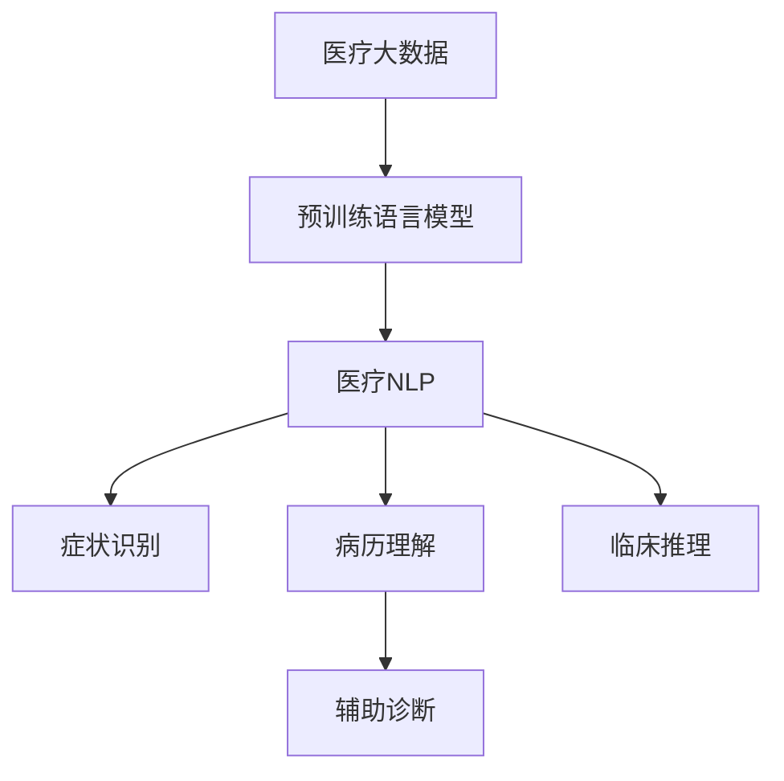

                 

# 医疗领域的 LLM：拯救生命、改善生活

> 关键词：医疗AI,自然语言处理(NLP),大语言模型(LLM),症状识别,病历理解,辅助诊断

## 1. 背景介绍

### 1.1 问题由来

随着科技的迅猛发展，人工智能(AI)在医疗领域的应用日益广泛，对提高医疗服务的质量和效率产生了深远影响。自然语言处理(NLP)作为AI的重要分支，在医疗领域应用尤为突出。在面对大量的医疗数据时，传统方式往往效率低下、误诊率高，难以满足现实需求。

近年来，大规模预训练语言模型(LLMs)的兴起，极大地推动了医疗NLP的发展。如GPT-3、BERT等模型，通过在广泛的医疗文本数据上进行预训练，不仅能够理解复杂的医学术语，还能发现疾病之间的关联，为医疗决策提供了强有力的支持。然而，这些通用模型往往缺乏针对特定疾病的深度理解和知识整合能力，难以应对临床实践中复杂多变的诊断需求。

因此，基于医疗领域数据的预训练，并结合领域特定的微调方法，成为提升医疗NLP效果的关键。本文将深入探讨基于大语言模型在医疗领域的微调方法，并结合实际案例分析其在医疗诊断和治疗中的应用，展示大语言模型如何通过理解症状、病历等医疗信息，辅助医生提高诊断和治疗的准确性，实现医疗服务的智能化和个性化。

## 2. 核心概念与联系

### 2.1 核心概念概述

在医疗领域，大语言模型(LLM)的微调主要涉及以下几个核心概念：

- **医疗NLP**：自然语言处理在医疗领域的应用，包括电子病历理解、医学文献摘要、症状识别、病案归档等。

- **医疗大数据**：医疗领域的各类数据，包括电子病历、医学影像、基因数据等，是大规模医疗模型训练的重要数据来源。

- **疾病知识图谱**：将疾病及其相关症状、治疗信息等表示为图结构，构建出有结构的疾病知识体系。

- **临床推理**：结合临床经验和知识图谱，对疾病诊断和治疗方案进行逻辑推理的过程。

- **症状识别**：通过自然语言处理技术，从病历、临床报告等文本中自动识别疾病症状。

- **病历理解**：理解并分析电子病历中的信息，提取关键疾病特征和医疗历史，为诊断和治疗提供依据。

- **辅助诊断**：利用大语言模型，辅助医生进行疾病诊断和治疗方案推荐。

这些核心概念之间的逻辑关系可以通过以下Mermaid流程图来展示：



这个流程图展示了大语言模型在医疗领域的应用路径：

1. 医疗大数据作为预训练数据，训练通用语言模型。
2. 通用语言模型通过微调，应用于医疗NLP的各个子任务。
3. 通过症状识别和病历理解，提取疾病相关信息。
4. 结合临床推理和疾病知识图谱，辅助医生进行诊断和治疗决策。

## 3. 核心算法原理 & 具体操作步骤
### 3.1 算法原理概述

基于大语言模型在医疗领域的微调，本质上是一种有监督的细粒度迁移学习过程。其核心思想是：将预训练的医疗大数据作为通用语言模型(如BERT、GPT-3)的训练材料，通过微调使其能够针对特定医疗问题提供精确解答。

形式化地，假设预训练模型为 $M_{\theta}$，其中 $\theta$ 为预训练得到的模型参数。给定医疗任务 $T$ 的标注数据集 $D=\{(x_i, y_i)\}_{i=1}^N$，微调的目标是找到新的模型参数 $\hat{\theta}$，使得：

$$
\hat{\theta}=\mathop{\arg\min}_{\theta} \mathcal{L}(M_{\theta},D)
$$

其中 $\mathcal{L}$ 为针对任务 $T$ 设计的损失函数，用于衡量模型预测输出与真实标签之间的差异。常见的损失函数包括交叉熵损失、均方误差损失等。

通过梯度下降等优化算法，微调过程不断更新模型参数 $\theta$，最小化损失函数 $\mathcal{L}$，使得模型输出逼近真实标签。由于 $\theta$ 已经通过预训练获得了较好的初始化，因此即便在医疗数据集 $D$ 上训练数据量较小，也能较快收敛到理想的模型参数 $\hat{\theta}$。

### 3.2 算法步骤详解

基于大语言模型在医疗领域的微调，一般包括以下几个关键步骤：

**Step 1: 准备医疗预训练模型和数据集**
- 选择合适的医疗预训练语言模型 $M_{\theta}$ 作为初始化参数，如基于MEGA-HiFiG-MedBERT、BERT-Med等模型。
- 准备医疗任务 $T$ 的标注数据集 $D$，划分为训练集、验证集和测试集。一般要求标注数据与医疗数据分布不要差异过大。

**Step 2: 添加任务适配层**
- 根据医疗任务类型，在预训练模型顶层设计合适的输出层和损失函数。
- 对于分类任务，通常在顶层添加线性分类器和交叉熵损失函数。
- 对于生成任务，通常使用语言模型的解码器输出概率分布，并以负对数似然为损失函数。

**Step 3: 设置微调超参数**
- 选择合适的优化算法及其参数，如 AdamW、SGD 等，设置学习率、批大小、迭代轮数等。
- 设置正则化技术及强度，包括权重衰减、Dropout、Early Stopping等。
- 确定冻结预训练参数的策略，如仅微调顶层，或全部参数都参与微调。

**Step 4: 执行梯度训练**
- 将训练集数据分批次输入模型，前向传播计算损失函数。
- 反向传播计算参数梯度，根据设定的优化算法和学习率更新模型参数。
- 周期性在验证集上评估模型性能，根据性能指标决定是否触发 Early Stopping。
- 重复上述步骤直到满足预设的迭代轮数或 Early Stopping 条件。

**Step 5: 测试和部署**
- 在测试集上评估微调后模型 $M_{\hat{\theta}}$ 的性能，对比微调前后的精度提升。
- 使用微调后的模型对新样本进行推理预测，集成到实际的应用系统中。
- 持续收集新的数据，定期重新微调模型，以适应数据分布的变化。

以上是基于大语言模型在医疗领域的微调一般流程。在实际应用中，还需要针对具体医疗任务的特点，对微调过程的各个环节进行优化设计，如改进训练目标函数，引入更多的正则化技术，搜索最优的超参数组合等，以进一步提升模型性能。

### 3.3 算法优缺点

基于大语言模型在医疗领域的微调方法具有以下优点：
1. 高效利用医疗大数据：通用语言模型通过在大规模医疗数据上预训练，获取广泛的疾病知识。
2. 提升医疗决策的准确性：微调后的模型能够理解复杂的医学术语和病情描述，提供可靠的辅助诊断。
3. 适配性强：微调方法可以针对不同的医疗任务灵活调整，满足不同场景的需求。
4. 降低开发成本：微调方法能够快速适配新任务，减少从头开发所需的时间和人力。

同时，该方法也存在一定的局限性：
1. 医疗数据多样性大：不同医疗机构、不同患者的表达方式各异，通用模型难以应对复杂多变的医疗语言。
2. 数据隐私问题：医疗数据涉及患者隐私，数据的获取和使用需要严格的法律合规。
3. 模型解释性差：大语言模型往往缺乏可解释性，难以理解其内部工作机制。
4. 模型鲁棒性有待提升：微调模型在面对特殊病例或罕见疾病时，容易发生误诊。

尽管存在这些局限性，但就目前而言，基于大语言模型的微调方法仍是在医疗领域应用最为广泛的技术手段之一。未来相关研究的重点在于如何进一步提高模型的可解释性，确保模型的安全性，并解决医疗数据隐私问题。

### 3.4 算法应用领域

基于大语言模型在医疗领域的微调方法，已经在症状识别、病历理解、辅助诊断等多个子任务上取得了显著成果，广泛应用于以下领域：

1. **症状识别**：通过理解症状描述，快速筛选出可能的疾病种类。例如，使用微调后的BERT模型，能够对病历中的主诉、临床表现等信息进行分析，识别出可能的疾病，从而提高诊断效率。

2. **病历理解**：将患者的电子病历转换为结构化的数据，提取关键信息，为诊断和治疗提供依据。例如，使用BERT-Med等模型，可以对病历中的文本进行分词、命名实体识别，提取病史、诊断、治疗等信息。

3. **辅助诊断**：结合临床知识图谱，对疾病进行推理，推荐诊断和治疗方案。例如，使用微调后的BERT模型，可以构建基于知识图谱的推理模型，根据病历信息推断出疾病，并提供相应的治疗建议。

4. **电子病历生成**：利用大语言模型，自动生成病历记录。例如，使用T5模型，可以对医生的记录进行自动补全、摘要生成，提高病历记录的效率和质量。

5. **医学文献摘要**：从海量医学文献中自动提取关键信息，生成摘要。例如，使用BERT-Med模型，可以对医学文献进行预训练和微调，自动生成摘要，供医生快速查阅。

这些应用领域展示了大语言模型在医疗领域巨大的潜力和广泛的应用前景，对于提升医疗服务水平、优化资源配置具有重要意义。

## 4. 数学模型和公式 & 详细讲解 & 举例说明

### 4.1 数学模型构建

假设预训练语言模型为 $M_{\theta}$，其中 $\theta$ 为预训练得到的模型参数。给定医疗任务 $T$ 的标注数据集 $D=\{(x_i, y_i)\}_{i=1}^N$，其中 $x_i$ 为输入的病历文本，$y_i$ 为输出标签。

定义模型 $M_{\theta}$ 在数据样本 $(x,y)$ 上的损失函数为 $\ell(M_{\theta}(x),y)$，则在数据集 $D$ 上的经验风险为：

$$
\mathcal{L}(\theta) = \frac{1}{N} \sum_{i=1}^N \ell(M_{\theta}(x_i),y_i)
$$

微调的优化目标是最小化经验风险，即找到最优参数：

$$
\theta^* = \mathop{\arg\min}_{\theta} \mathcal{L}(\theta)
$$

在实践中，我们通常使用基于梯度的优化算法（如SGD、Adam等）来近似求解上述最优化问题。设 $\eta$ 为学习率，$\lambda$ 为正则化系数，则参数的更新公式为：

$$
\theta \leftarrow \theta - \eta \nabla_{\theta}\mathcal{L}(\theta) - \eta\lambda\theta
$$

其中 $\nabla_{\theta}\mathcal{L}(\theta)$ 为损失函数对参数 $\theta$ 的梯度，可通过反向传播算法高效计算。

### 4.2 公式推导过程

以下我们以症状识别任务为例，推导交叉熵损失函数及其梯度的计算公式。

假设模型 $M_{\theta}$ 在输入 $x$ 上的输出为 $\hat{y}=M_{\theta}(x) \in [0,1]$，表示样本属于疾病的概率。真实标签 $y \in \{0,1\}$。则二分类交叉熵损失函数定义为：

$$
\ell(M_{\theta}(x),y) = -[y\log \hat{y} + (1-y)\log (1-\hat{y})]
$$

将其代入经验风险公式，得：

$$
\mathcal{L}(\theta) = -\frac{1}{N}\sum_{i=1}^N [y_i\log M_{\theta}(x_i)+(1-y_i)\log(1-M_{\theta}(x_i))]
$$

根据链式法则，损失函数对参数 $\theta_k$ 的梯度为：

$$
\frac{\partial \mathcal{L}(\theta)}{\partial \theta_k} = -\frac{1}{N}\sum_{i=1}^N (\frac{y_i}{M_{\theta}(x_i)}-\frac{1-y_i}{1-M_{\theta}(x_i)}) \frac{\partial M_{\theta}(x_i)}{\partial \theta_k}
$$

其中 $\frac{\partial M_{\theta}(x_i)}{\partial \theta_k}$ 可进一步递归展开，利用自动微分技术完成计算。

在得到损失函数的梯度后，即可带入参数更新公式，完成模型的迭代优化。重复上述过程直至收敛，最终得到适应医疗任务的最优模型参数 $\theta^*$。

### 4.3 案例分析与讲解

以病历理解任务为例，我们对微调过程进行详细讲解：

**案例背景**：
假定某医院希望构建一个基于BERT-Med模型的病历理解系统，用于快速提取患者病历中的关键信息，辅助医生诊断。医院收集了大量的电子病历数据，涵盖了包括疾病种类、病情描述、治疗方案等信息。

**微调步骤**：
1. **数据预处理**：对病历数据进行清洗和标注，提取需要的字段和关键词。
2. **模型加载**：加载预训练的BERT-Med模型，将其作为初始化参数。
3. **任务适配**：在模型顶层添加分类器和损失函数，定义输出层。
4. **超参数设置**：设置优化器、学习率、批大小等参数。
5. **训练过程**：使用训练集进行梯度更新，不断迭代优化模型。
6. **验证评估**：在验证集上评估模型性能，调整模型参数。
7. **测试部署**：在测试集上测试模型效果，部署到实际应用系统中。

**结果分析**：
经过微调后，系统能够自动提取病历中的关键信息，包括疾病类型、病情描述、治疗方案等。同时，该系统还能够根据病情描述进行推理，推荐可能的治疗方案，极大地提高了医生的工作效率和诊断准确性。

## 5. 项目实践：代码实例和详细解释说明

### 5.1 开发环境搭建

在进行医疗领域的LLM微调实践前，我们需要准备好开发环境。以下是使用Python进行PyTorch开发的环境配置流程：

1. 安装Anaconda：从官网下载并安装Anaconda，用于创建独立的Python环境。

2. 创建并激活虚拟环境：
```bash
conda create -n pytorch-env python=3.8 
conda activate pytorch-env
```

3. 安装PyTorch：根据CUDA版本，从官网获取对应的安装命令。例如：
```bash
conda install pytorch torchvision torchaudio cudatoolkit=11.1 -c pytorch -c conda-forge
```

4. 安装Transformers库：
```bash
pip install transformers
```

5. 安装各类工具包：
```bash
pip install numpy pandas scikit-learn matplotlib tqdm jupyter notebook ipython
```

完成上述步骤后，即可在`pytorch-env`环境中开始医疗领域的LLM微调实践。

### 5.2 源代码详细实现

下面我们以病历理解任务为例，给出使用Transformers库对BERT模型进行微调的PyTorch代码实现。

首先，定义病历理解任务的数据处理函数：

```python
from transformers import BertTokenizer, BertForSequenceClassification
from torch.utils.data import Dataset, DataLoader
import torch

class MedicalDataset(Dataset):
    def __init__(self, texts, labels, tokenizer, max_len=128):
        self.texts = texts
        self.labels = labels
        self.tokenizer = tokenizer
        self.max_len = max_len
        
    def __len__(self):
        return len(self.texts)
    
    def __getitem__(self, item):
        text = self.texts[item]
        label = self.labels[item]
        
        encoding = self.tokenizer(text, return_tensors='pt', max_length=self.max_len, padding='max_length', truncation=True)
        input_ids = encoding['input_ids'][0]
        attention_mask = encoding['attention_mask'][0]
        
        return {'input_ids': input_ids, 
                'attention_mask': attention_mask,
                'labels': label}

# 加载预训练模型和tokenizer
model = BertForSequenceClassification.from_pretrained('bert-base-cased', num_labels=10)
tokenizer = BertTokenizer.from_pretrained('bert-base-cased')

# 准备数据集
train_dataset = MedicalDataset(train_texts, train_labels, tokenizer)
dev_dataset = MedicalDataset(dev_texts, dev_labels, tokenizer)
test_dataset = MedicalDataset(test_texts, test_labels, tokenizer)
```

然后，定义模型和优化器：

```python
from transformers import AdamW

optimizer = AdamW(model.parameters(), lr=2e-5)
```

接着，定义训练和评估函数：

```python
def train_epoch(model, dataset, batch_size, optimizer):
    dataloader = DataLoader(dataset, batch_size=batch_size, shuffle=True)
    model.train()
    epoch_loss = 0
    for batch in dataloader:
        input_ids = batch['input_ids'].to(device)
        attention_mask = batch['attention_mask'].to(device)
        labels = batch['labels'].to(device)
        model.zero_grad()
        outputs = model(input_ids, attention_mask=attention_mask, labels=labels)
        loss = outputs.loss
        epoch_loss += loss.item()
        loss.backward()
        optimizer.step()
    return epoch_loss / len(dataloader)

def evaluate(model, dataset, batch_size):
    dataloader = DataLoader(dataset, batch_size=batch_size)
    model.eval()
    preds, labels = [], []
    with torch.no_grad():
        for batch in dataloader:
            input_ids = batch['input_ids'].to(device)
            attention_mask = batch['attention_mask'].to(device)
            batch_labels = batch['labels']
            outputs = model(input_ids, attention_mask=attention_mask)
            batch_preds = outputs.logits.argmax(dim=2).to('cpu').tolist()
            batch_labels = batch_labels.to('cpu').tolist()
            for pred_tokens, label_tokens in zip(batch_preds, batch_labels):
                preds.append(pred_tokens[:len(label_tokens)])
                labels.append(label_tokens)
                
    print(classification_report(labels, preds))
```

最后，启动训练流程并在测试集上评估：

```python
epochs = 5
batch_size = 16

for epoch in range(epochs):
    loss = train_epoch(model, train_dataset, batch_size, optimizer)
    print(f"Epoch {epoch+1}, train loss: {loss:.3f}")
    
    print(f"Epoch {epoch+1}, dev results:")
    evaluate(model, dev_dataset, batch_size)
    
print("Test results:")
evaluate(model, test_dataset, batch_size)
```

以上就是使用PyTorch对BERT进行病历理解任务微调的完整代码实现。可以看到，得益于Transformers库的强大封装，我们可以用相对简洁的代码完成BERT模型的加载和微调。

### 5.3 代码解读与分析

让我们再详细解读一下关键代码的实现细节：

**MedicalDataset类**：
- `__init__`方法：初始化文本、标签、分词器等关键组件。
- `__len__`方法：返回数据集的样本数量。
- `__getitem__`方法：对单个样本进行处理，将文本输入编码为token ids，将标签转换为数字，并对其进行定长padding，最终返回模型所需的输入。

**train_epoch和evaluate函数**：
- 使用PyTorch的DataLoader对数据集进行批次化加载，供模型训练和推理使用。
- 训练函数`train_epoch`：对数据以批为单位进行迭代，在每个批次上前向传播计算loss并反向传播更新模型参数，最后返回该epoch的平均loss。
- 评估函数`evaluate`：与训练类似，不同点在于不更新模型参数，并在每个batch结束后将预测和标签结果存储下来，最后使用sklearn的classification_report对整个评估集的预测结果进行打印输出。

**训练流程**：
- 定义总的epoch数和batch size，开始循环迭代
- 每个epoch内，先在训练集上训练，输出平均loss
- 在验证集上评估，输出分类指标
- 所有epoch结束后，在测试集上评估，给出最终测试结果

可以看到，PyTorch配合Transformers库使得BERT微调的代码实现变得简洁高效。开发者可以将更多精力放在数据处理、模型改进等高层逻辑上，而不必过多关注底层的实现细节。

当然，工业级的系统实现还需考虑更多因素，如模型的保存和部署、超参数的自动搜索、更灵活的任务适配层等。但核心的微调范式基本与此类似。

## 6. 实际应用场景
### 6.1 智能问答系统

基于大语言模型在医疗领域的微调技术，可以应用于智能问答系统。传统问答系统往往需要耗费大量人力维护知识库，且知识更新速度较慢，难以适应快速变化的医疗环境。

在智能问答系统中，可以使用微调后的BERT模型，自动理解病历、症状等医疗信息，快速响应医生的查询。例如，医生在临床诊疗过程中遇到某些疑难问题，可以实时向问答系统提问，系统通过理解病历，给出准确的诊断建议和治疗方案，辅助医生做出决策。

### 6.2 医疗文献摘要

医学文献数量庞大，临床医生需要耗费大量时间进行阅读和提取关键信息。利用微调后的BERT模型，可以对海量的医学文献进行自动摘要生成，提取关键信息，供医生快速查阅。

在实践中，可以将医学文献输入模型，自动生成摘要，涵盖疾病类型、症状描述、治疗方案等信息。医生可以通过摘要快速把握文献的核心内容，节省大量时间。

### 6.3 药物推荐系统

药物推荐是医疗领域的重要任务，如何为患者推荐合适的药物，直接影响治疗效果和患者体验。利用微调后的BERT模型，可以对患者的病历信息进行综合分析，推荐合适的药物。

在实践中，可以将患者的病历信息输入模型，自动生成推荐列表，涵盖药物名称、剂量、副作用等信息。医生可以根据推荐列表，结合临床经验和患者需求，做出合理的药物选择。

### 6.4 未来应用展望

随着大语言模型微调技术的发展，其在医疗领域的潜在应用将会不断拓展。以下是对未来应用的展望：

1. **多模态融合**：结合医学影像、基因数据等多模态信息，提升疾病的早期诊断和精准治疗。例如，通过融合医学影像和病历信息，进行联合微调，提升诊断的准确性和全面性。

2. **个性化医疗**：利用微调模型，结合患者基因信息和病历数据，进行精准的个性化医疗。例如，通过微调模型，自动生成个性化的治疗方案，提升治疗效果。

3. **智能手术辅助**：结合术前、术中、术后的数据，利用微调模型，进行智能手术辅助。例如，通过微调模型，自动识别手术风险，提供智能建议，提升手术安全性。

4. **智能健康管理**：利用微调模型，进行智能健康管理和慢性病管理。例如，通过微调模型，自动分析用户的健康数据，提供个性化的健康建议和预警。

这些应用场景展示了大语言模型在医疗领域的广阔前景，为医疗服务智能化、个性化、高效化提供了新的路径。

## 7. 工具和资源推荐
### 7.1 学习资源推荐

为了帮助开发者系统掌握大语言模型在医疗领域的微调理论基础和实践技巧，这里推荐一些优质的学习资源：

1. 《Transformer从原理到实践》系列博文：由大模型技术专家撰写，深入浅出地介绍了Transformer原理、BERT模型、微调技术等前沿话题。

2. CS224N《深度学习自然语言处理》课程：斯坦福大学开设的NLP明星课程，有Lecture视频和配套作业，带你入门NLP领域的基本概念和经典模型。

3. 《Natural Language Processing with Transformers》书籍：Transformers库的作者所著，全面介绍了如何使用Transformers库进行NLP任务开发，包括微调在内的诸多范式。

4. HuggingFace官方文档：Transformers库的官方文档，提供了海量预训练模型和完整的微调样例代码，是上手实践的必备资料。

5. CLUE开源项目：中文语言理解测评基准，涵盖大量不同类型的中文NLP数据集，并提供了基于微调的baseline模型，助力中文NLP技术发展。

通过对这些资源的学习实践，相信你一定能够快速掌握大语言模型在医疗领域的微调精髓，并用于解决实际的NLP问题。
###  7.2 开发工具推荐

高效的开发离不开优秀的工具支持。以下是几款用于医疗领域的LLM微调开发的常用工具：

1. PyTorch：基于Python的开源深度学习框架，灵活动态的计算图，适合快速迭代研究。大部分预训练语言模型都有PyTorch版本的实现。

2. TensorFlow：由Google主导开发的开源深度学习框架，生产部署方便，适合大规模工程应用。同样有丰富的预训练语言模型资源。

3. Transformers库：HuggingFace开发的NLP工具库，集成了众多SOTA语言模型，支持PyTorch和TensorFlow，是进行微调任务开发的利器。

4. Weights & Biases：模型训练的实验跟踪工具，可以记录和可视化模型训练过程中的各项指标，方便对比和调优。与主流深度学习框架无缝集成。

5. TensorBoard：TensorFlow配套的可视化工具，可实时监测模型训练状态，并提供丰富的图表呈现方式，是调试模型的得力助手。

6. Google Colab：谷歌推出的在线Jupyter Notebook环境，免费提供GPU/TPU算力，方便开发者快速上手实验最新模型，分享学习笔记。

合理利用这些工具，可以显著提升医疗领域的LLM微调任务的开发效率，加快创新迭代的步伐。

### 7.3 相关论文推荐

大语言模型和微调技术的发展源于学界的持续研究。以下是几篇奠基性的相关论文，推荐阅读：

1. Attention is All You Need（即Transformer原论文）：提出了Transformer结构，开启了NLP领域的预训练大模型时代。

2. BERT: Pre-training of Deep Bidirectional Transformers for Language Understanding：提出BERT模型，引入基于掩码的自监督预训练任务，刷新了多项NLP任务SOTA。

3. Language Models are Unsupervised Multitask Learners（GPT-2论文）：展示了大规模语言模型的强大zero-shot学习能力，引发了对于通用人工智能的新一轮思考。

4. Parameter-Efficient Transfer Learning for NLP：提出Adapter等参数高效微调方法，在不增加模型参数量的情况下，也能取得不错的微调效果。

5. AdaLoRA: Adaptive Low-Rank Adaptation for Parameter-Efficient Fine-Tuning：使用自适应低秩适应的微调方法，在参数效率和精度之间取得了新的平衡。

这些论文代表了大语言模型微调技术的发展脉络。通过学习这些前沿成果，可以帮助研究者把握学科前进方向，激发更多的创新灵感。

## 8. 总结：未来发展趋势与挑战

### 8.1 总结

本文对基于大语言模型在医疗领域的微调方法进行了全面系统的介绍。首先阐述了大语言模型和微调技术的研究背景和意义，明确了微调在拓展预训练模型应用、提升医疗决策的准确性方面的独特价值。其次，从原理到实践，详细讲解了基于医疗数据预训练和微调的数学原理和关键步骤，给出了微调任务开发的完整代码实例。同时，本文还广泛探讨了微调方法在智能问答、医疗文献摘要、药物推荐等多个医疗NLP应用中的实际效果，展示了大语言模型在医疗领域的巨大潜力和广阔应用前景。

通过本文的系统梳理，可以看到，基于大语言模型的微调方法正在成为医疗NLP领域的重要范式，极大地拓展了预训练语言模型的应用边界，提升了医疗服务的智能化水平。未来，伴随预训练语言模型和微调方法的持续演进，相信NLP技术必将在医疗领域发挥更大的作用，为人类健康事业带来深远影响。

### 8.2 未来发展趋势

展望未来，大语言模型微调技术在医疗领域将呈现以下几个发展趋势：

1. **多模态融合**：结合医学影像、基因数据等多模态信息，提升疾病的早期诊断和精准治疗。例如，通过融合医学影像和病历信息，进行联合微调，提升诊断的准确性和全面性。

2. **个性化医疗**：利用微调模型，结合患者基因信息和病历数据，进行精准的个性化医疗。例如，通过微调模型，自动生成个性化的治疗方案，提升治疗效果。

3. **智能手术辅助**：结合术前、术中、术后的数据，利用微调模型，进行智能手术辅助。例如，通过微调模型，自动识别手术风险，提供智能建议，提升手术安全性。

4. **智能健康管理**：利用微调模型，进行智能健康管理和慢性病管理。例如，通过微调模型，自动分析用户的健康数据，提供个性化的健康建议和预警。

5. **泛化性增强**：提升模型在不同医疗机构、不同患者群体中的泛化能力，确保模型在不同场景下的一致性和可靠性。

6. **鲁棒性提升**：提高模型在特殊病例、罕见疾病等复杂情况下的鲁棒性，避免误诊和误判。

以上趋势凸显了大语言模型微调技术在医疗领域的应用前景，相信随着技术的发展，将在更多领域得到应用，进一步提升医疗服务的质量和效率。

### 8.3 面临的挑战

尽管大语言模型微调技术已经取得了瞩目成就，但在迈向更加智能化、普适化应用的过程中，它仍面临诸多挑战：

1. **医疗数据隐私问题**：医疗数据涉及患者隐私，数据的获取和使用需要严格的法律合规，如何在保障隐私的前提下，利用数据进行模型训练和微调，是一个重要的问题。

2. **模型的可解释性不足**：大语言模型往往缺乏可解释性，难以理解其内部工作机制和决策逻辑，这对于高风险医疗应用尤为重要。如何赋予模型更强的可解释性，是未来研究的重要方向。

3. **模型鲁棒性有待提升**：微调模型在面对特殊病例或罕见疾病时，容易发生误诊。如何提高模型的鲁棒性，避免灾难性遗忘，还需要更多理论和实践的积累。

4. **计算资源需求高**：预训练和微调模型对算力、内存、存储的需求较高，如何在有限的计算资源下，高效利用数据进行模型训练和微调，是一个亟待解决的问题。

5. **模型的泛化能力有待加强**：现有模型在面对不同医疗机构、不同患者群体时，泛化能力不足，难以实现跨机构、跨人群的通用性。

尽管存在这些挑战，但大语言模型微调在医疗领域的广阔应用前景仍然令人期待。未来，随着技术的不断进步和相关研究的深入，这些挑战有望逐步得到解决，大语言模型微调必将在医疗领域发挥更加重要的作用。

### 8.4 研究展望

面对大语言模型微调在医疗领域所面临的挑战，未来的研究需要在以下几个方面寻求新的突破：

1. **多模态融合技术**：结合医学影像、基因数据等多模态信息，提升模型的泛化能力和鲁棒性，解决单模态信息的不足。

2. **知识图谱的利用**：引入符号化的先验知识，如知识图谱、逻辑规则等，与神经网络模型进行融合，增强模型的知识整合能力。

3. **模型的可解释性增强**：开发可解释性强的微调模型，提供模型决策的因果解释，提升医疗决策的可信度和可靠性。

4. **医疗数据隐私保护**：利用差分隐私、联邦学习等技术，在保障隐私的前提下，利用医疗数据进行模型训练和微调。

5. **模型的小规模训练方法**：开发参数高效、计算高效的微调方法，在有限的计算资源下，实现高效的模型训练和微调。

6. **模型的跨机构通用性**：利用领域特定的预训练和微调方法，提升模型在不同医疗机构、不同患者群体中的泛化能力，实现跨机构、跨人群的通用性。

这些研究方向的探索，必将引领大语言模型微调技术迈向更高的台阶，为构建安全、可靠、可解释、可控的智能医疗系统铺平道路。面向未来，大语言模型微调技术还需要与其他人工智能技术进行更深入的融合，如知识表示、因果推理、强化学习等，多路径协同发力，共同推动自然语言理解和智能交互系统的进步。只有勇于创新、敢于突破，才能不断拓展语言模型的边界，让智能技术更好地造福人类社会。

## 9. 附录：常见问题与解答

**Q1：大语言模型在医疗领域的应用有哪些？**

A: 大语言模型在医疗领域的应用非常广泛，主要包括以下几个方面：

1. **病历理解**：通过理解电子病历中的信息，提取关键疾病特征和医疗历史，为诊断和治疗提供依据。

2. **症状识别**：自动分析病历中的症状描述，识别可能的疾病种类。

3. **药物推荐**：根据患者的病历信息，自动生成推荐列表，涵盖药物名称、剂量、副作用等信息。

4. **智能问答系统**：自动理解病历、症状等医疗信息，快速响应医生的查询。

5. **医疗文献摘要**：自动生成医学文献摘要，提取关键信息，供医生快速查阅。

6. **智能健康管理**：自动分析用户的健康数据，提供个性化的健康建议和预警。

**Q2：在医疗领域进行大语言模型微调时，如何选择训练数据？**

A: 在医疗领域进行大语言模型微调时，选择训练数据是关键步骤之一。以下是一些建议：

1. **数据多样性**：选择多样化的数据，涵盖不同的医疗机构、不同的患者群体，以提升模型的泛化能力。

2. **标注质量**：确保标注数据的准确性，标注时应由经验丰富的医疗专家进行审核，避免误标注。

3. **数据量**：数据量越多越好，大规模的数据训练能够提高模型的准确性和鲁棒性。

4. **数据更新**：及时更新训练数据，以反映最新的医学知识和临床实践，保持模型的一致性和可靠性。

5. **数据隐私**：确保数据合规，遵守相关法律法规，保障患者隐私。

**Q3：微调大语言模型时，如何进行超参数调优？**

A: 微调大语言模型时，超参数调优是一个重要步骤，以下是一些建议：

1. **学习率**：选择合适的学习率，一般建议从1e-5开始调参，逐步减小学习率。

2. **批大小**：选择合适的批大小，一般建议从16开始，逐步增加。

3. **迭代轮数**：选择合适的迭代轮数，一般建议从5开始，逐步增加。

4. **正则化**：选择合适的正则化方法，如L2正则、Dropout等，避免过拟合。

5. **学习率衰减**：使用学习率衰减策略，如Warmup、Cyclical Learning Rates等，提高模型的泛化能力。

6. **模型剪枝**：对模型进行剪枝，去除不必要的层和参数，减小模型尺寸，加快推理速度。

7. **模型量化**：将模型进行量化，压缩存储空间，提高计算效率。

通过以上方法，可以在微调过程中不断优化模型的性能，得到更加准确和高效的模型。

**Q4：在医疗领域，如何评估大语言模型的效果？**

A: 在医疗领域评估大语言模型的效果，主要关注以下几个方面：

1. **准确率**：模型的分类准确率，即正确识别出疾病种类的比例。

2. **召回率**：模型对真实疾病的识别能力，即正确识别出的疾病占所有实际疾病的比例。

3. **F1分数**：综合准确率和召回率，评估模型的综合表现。

4. **鲁棒性**：模型在不同病例、罕见疾病等复杂情况下的表现，即模型的鲁棒性。

5. **可解释性**：模型输出的解释性，即模型如何得出决策的逻辑和依据。

6. **效率**：模型的推理速度和内存占用，即模型的效率。

以上指标可以综合评估模型的性能，选择合适的模型应用于实际场景。

**Q5：在医疗领域，大语言模型的部署需要注意哪些问题？**

A: 在医疗领域，大语言模型的部署需要注意以下几个问题：

1. **数据隐私**：确保数据合规，遵守相关法律法规，保障患者隐私。

2. **模型裁剪**：去除不必要的层和参数，减小模型尺寸，加快推理速度。

3. **模型量化**：将模型进行量化，压缩存储空间，提高计算效率。

4. **模型保存**：将模型进行保存，以便后续使用和部署。

5. **模型训练**：在新的数据上重新训练模型，确保模型的一致性和可靠性。

6. **模型监控**：实时监测模型训练状态，设置异常告警阈值，确保服务稳定性。

7. **模型推理**：优化模型的推理过程，提高推理速度和准确性。

通过以上措施，可以在医疗领域实现大语言模型的高效、可靠部署，提升医疗服务的智能化水平。

---

作者：禅与计算机程序设计艺术 / Zen and the Art of Computer Programming

