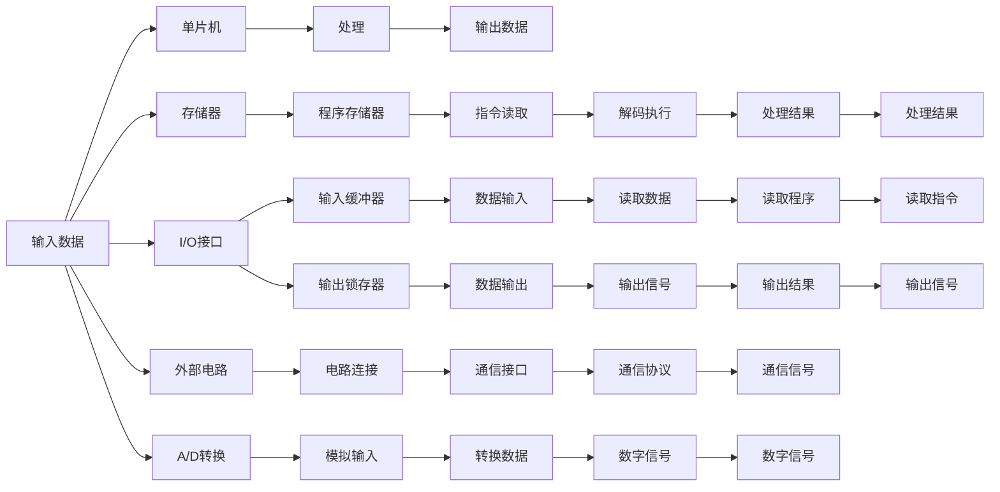

                 

# 单片机入门：微控制器应用

> 关键词：单片机,微控制器,嵌入式系统,实时控制,数字信号处理

## 1. 背景介绍

在现代计算机体系中，微控制器（Microcontroller Unit, 简称MCU）已经成为了嵌入式系统领域的重要组成部分。作为一种集成度高、性能优、成本低的处理器，微控制器广泛应用于家电、汽车、工业控制、医疗设备等多个领域。其核心的单片机技术，正是本文介绍的主要内容。

### 1.1 问题的由来
单片机，又称为嵌入式微控制器，是一种集成了CPU、存储器、输入输出接口等功能于一体的集成电路芯片。它通过片内程序存储器，可以独立执行特定的任务，而不需要依赖外部处理器。这一特性使得单片机在嵌入式系统领域有着广泛的应用。

然而，单片机技术入门门槛相对较高，对于初学者来说，理解其内部架构、工作原理以及编程方法都是不小的挑战。此外，单片机应用领域广泛，涉及的知识也相当丰富，从硬件电路设计到软件编程，都需要一定的专业背景。

## 2. 核心概念与联系

### 2.1 核心概念概述
为了更好地理解单片机技术，本节将介绍几个关键概念：

- **单片机**：一个集成在一块硅片上的完整的微处理器系统，包括CPU、存储器、输入输出接口等功能。
- **嵌入式系统**：一种由软件和硬件组成的，能够独立完成特定任务的系统。
- **实时控制**：系统能够在规定的时间内响应用户请求，处理数据的特性。
- **数字信号处理**：处理数字信号的技术，广泛应用于音频、图像、传感器等数据处理。

这些概念构成了单片机应用的基础。为了更好地理解这些概念，我们还需要了解单片机的工作原理和架构。

### 2.2 核心概念原理和架构的 Mermaid 流程图



这个图展示了单片机从输入到输出的处理过程。输入数据首先经过存储器、I/O接口，最终到达单片机的CPU进行运算处理。处理结果再经过输出接口和外部电路，最终生成输出数据。

### 2.3 核心概念之间的联系

- **单片机**：作为嵌入式系统的核心，单片机提供了数据处理、实时控制等关键功能。
- **嵌入式系统**：结合单片机和外围硬件，形成一个独立完成特定任务的系统。
- **实时控制**：单片机通过快速响应输入数据，实现对外部环境的变化做出即时反应。
- **数字信号处理**：单片机中的数字信号处理模块，可以对传感器、A/D转换等输入的数字信号进行处理，得到有用的信息。

这些概念相互联系，构成了单片机应用的完整框架。

## 3. 核心算法原理 & 具体操作步骤

### 3.1 算法原理概述

单片机编程的本质是一种基于寄存器的编程方式。寄存器是单片机内部用于存储数据的特殊存储单元，通过读写寄存器，可以实现对单片机硬件的控制和数据处理。单片机的编程流程通常包括以下几个关键步骤：

1. 初始化寄存器，配置硬件电路。
2. 读取输入数据，执行数据处理。
3. 生成输出数据，控制输出接口。

### 3.2 算法步骤详解

以一个简单的单片机应用为例，我们将介绍如何通过寄存器编程实现一个计时器。

#### 3.2.1 初始化寄存器
在开始计时前，需要先初始化单片机中的定时器寄存器，配置定时器的时钟频率和计时模式。

例如，对于MSP430单片机，可以通过写入 `TMISR` 和 `TMSR` 寄存器，设置定时器的工作模式和时间单位。

```c
// 初始化定时器
void initTimer() {
    // 设置定时器模式为12位定时器
    TMSR0 = 0x12; // 模式0，时钟为内部时钟
    // 设置定时器为向上计数模式
    TMISR0 = 0x00; // 模式1，向上计数
    // 设置定时器周期
    TCNT1 = 0x01; // 周期为1秒
}
```

#### 3.2.2 读取输入数据
定时器会周期性地生成中断信号，单片机在每次中断时会读取当前时间计数器的值。

```c
// 读取当前时间
void readTime() {
    TCNT1_L = TCR1_L; // 读取低8位
    TCNT1_H = TCR1_H; // 读取高8位
}
```

#### 3.2.3 生成输出数据
当读取到当前时间时，可以将其与预设的时间值进行比较，判断是否达到计时要求，并进行相应的处理。

```c
// 判断是否达到计时要求
void checkTime() {
    int current_time = (TCNT1_H << 8) | TCNT1_L;
    if (current_time >= target_time) {
        // 计时达到要求，执行相应处理
        doSomething();
    }
}
```

### 3.3 算法优缺点

单片机编程的主要优点在于其硬件电路和软件编程的紧密结合。寄存器编程的方式可以直接控制硬件电路，提高了系统的实时性和可靠性。然而，寄存器编程也需要对单片机的硬件结构和寄存器特性有较深入的了解，对于初学者来说，入门门槛较高。此外，单片机的编程方式相对固定，灵活性相对有限，适用于特定的应用场景。

### 3.4 算法应用领域

单片机编程广泛应用于嵌入式系统领域，例如：

- **家电控制**：单片机可以用于控制家电设备的开关、温度调节等功能。
- **汽车电子**：单片机可以用于汽车的发动机控制、传感器数据处理等功能。
- **工业控制**：单片机可以用于工业设备的控制、数据采集和处理等。
- **医疗设备**：单片机可以用于医疗设备的数据处理和实时控制。

## 4. 数学模型和公式 & 详细讲解 & 举例说明

### 4.1 数学模型构建

单片机编程不需要复杂的数学模型，但可以通过数学模型来理解和计算单片机中的数据处理过程。以下是一个简单的数学模型，用于描述单片机中定时器的计数过程。

假设单片机的定时器时钟频率为 $f_{\text{clock}}$，定时器周期为 $T_{\text{period}}$，定时器每秒产生的计数次数为 $N$。则有：

$$
N = \frac{f_{\text{clock}}}{T_{\text{period}}}
$$

### 4.2 公式推导过程

根据上式，可以推导出定时器的周期与计数次数之间的关系。当定时器周期为1秒时，计数次数 $N$ 等于单片机时钟频率。假设单片机的时钟频率为 $f_{\text{clock}}=1\text{MHz}$，则有：

$$
N = \frac{f_{\text{clock}}}{T_{\text{period}}} = \frac{1\text{MHz}}{T_{\text{period}}}
$$

### 4.3 案例分析与讲解

假设我们需要设置一个计时器，计时周期为2秒。在单片机中，可以通过设置定时器的计数寄存器来实现。

```c
// 初始化定时器，周期为2秒
void initTimer() {
    // 设置定时器模式为12位定时器
    TMSR0 = 0x12; // 模式0，时钟为内部时钟
    // 设置定时器为向上计数模式
    TMISR0 = 0x00; // 模式1，向上计数
    // 设置定时器周期
    TCNT1 = 0x01; // 周期为1秒
}

// 读取当前时间
void readTime() {
    TCNT1_L = TCR1_L; // 读取低8位
    TCNT1_H = TCR1_H; // 读取高8位
}

// 判断是否达到计时要求
void checkTime() {
    int current_time = (TCNT1_H << 8) | TCNT1_L;
    if (current_time >= target_time) {
        // 计时达到要求，执行相应处理
        doSomething();
    }
}
```

## 5. 项目实践：代码实例和详细解释说明

### 5.1 开发环境搭建

在开始单片机编程前，需要搭建好开发环境。以MSP430单片机为例，搭建开发环境的步骤如下：

1. 安装Keil MDK或IAR等IDE工具。
2. 下载单片机的固件程序，如CCS（Code Composer Studio）或IAR IDE等。
3. 配置I/O口，设置时钟频率，连接外围电路等。
4. 编写并测试程序代码。

### 5.2 源代码详细实现

以下是一个简单的单片机程序，用于实现一个数字时钟。程序通过读取晶振频率和定时器周期，实现对时间的精确计数和显示。

```c
// 初始化单片机时钟频率
void initClock() {
    // 设置时钟频率为8MHz
    BCR = 0x14;
    DCO = 0x00;
    DCO = 0x8f;
}

// 初始化定时器
void initTimer() {
    // 设置定时器模式为12位定时器
    TMSR0 = 0x12; // 模式0，时钟为内部时钟
    // 设置定时器为向上计数模式
    TMISR0 = 0x00; // 模式1，向上计数
    // 设置定时器周期
    TCNT1 = 0x01; // 周期为1秒
}

// 读取当前时间
void readTime() {
    TCNT1_L = TCR1_L; // 读取低8位
    TCNT1_H = TCR1_H; // 读取高8位
}

// 判断是否达到计时要求
void checkTime() {
    int current_time = (TCNT1_H << 8) | TCNT1_L;
    if (current_time >= target_time) {
        // 计时达到要求，执行相应处理
        doSomething();
    }
}

int main() {
    // 初始化单片机时钟频率
    initClock();

    // 初始化定时器
    initTimer();

    // 主循环，读取时间并显示
    while (1) {
        // 读取当前时间
        int current_time = readTime();

        // 将时间转化为小时、分钟、秒
        int hours = current_time / 3600;
        int minutes = (current_time % 3600) / 60;
        int seconds = current_time % 60;

        // 显示时间
        display(hours, minutes, seconds);

        // 延迟1秒
        delay(1000);
    }
}
```

### 5.3 代码解读与分析

该程序实现了单片机中定时器的计数功能，并输出当前时间。程序的核心代码如下：

1. `initClock()`函数用于初始化单片机时钟频率，将时钟频率设置为8MHz。
2. `initTimer()`函数用于初始化定时器，将定时器设置为向上计数模式，周期为1秒。
3. `readTime()`函数用于读取当前定时器的计数器值。
4. `checkTime()`函数用于判断当前时间是否达到设定的时间要求，并进行相应的处理。
5. `main()`函数用于主循环，读取当前时间并显示。

## 6. 实际应用场景

### 6.1 数字时钟

数字时钟是最简单的单片机应用之一。单片机可以通过读取晶振频率和定时器周期，实现对时间的精确计数和显示。数字时钟广泛应用于家电、汽车等领域，为用户提供方便的时间显示功能。

### 6.2 温度传感器

单片机可以与温度传感器连接，实现对环境的温度监测。程序可以通过读取传感器的电压值，转换为温度数据，并显示在屏幕上。温度传感器在医疗、工业等领域有着广泛的应用，帮助人们实时监测环境温度。

### 6.3 电机控制

单片机可以通过PWM控制电机转速，实现对电机的精确控制。电机控制广泛应用于机器人、无人机等领域，是实现自主移动和智能控制的基础。

### 6.4 未来应用展望

随着单片机技术的不断发展，其应用领域也将不断扩展。未来，单片机将更多地应用于物联网、人工智能等领域，推动智能设备的普及和发展。例如，智能家居设备、智能穿戴设备等，都可以通过单片机来实现。

## 7. 工具和资源推荐

### 7.1 学习资源推荐

为了帮助初学者系统掌握单片机技术，以下是一些优质的学习资源：

1. 《单片机入门教程》：适合初学者入门的教材，涵盖了单片机编程、硬件电路设计等方面的知识。
2. 《嵌入式系统设计》：详细介绍嵌入式系统原理和设计方法，帮助理解单片机在嵌入式系统中的作用。
3. 《C语言编程》：C语言是单片机编程的基础，掌握C语言编程技巧，可以帮助更好地理解单片机编程。

### 7.2 开发工具推荐

以下是一些常用的单片机开发工具：

1. Keil MDK：Keil MDK是Keil公司推出的IDE工具，支持多种单片机和编译器，适合初学者和专业开发者使用。
2. IAR IDE：IAR IDE是IAR公司推出的IDE工具，支持多种单片机和操作系统，适合专业开发者使用。
3. Keil uVision：Keil uVision是Keil公司推出的实时操作系统开发工具，支持多种实时操作系统，适合嵌入式系统开发。

### 7.3 相关论文推荐

单片机技术的发展离不开学界的持续研究。以下是几篇具有代表性的相关论文，推荐阅读：

1. "Single-chip microcontrollers: A survey and their future directions"（单片机综述及其未来方向）：这篇文章综述了单片机技术的发展历程和未来方向，适合了解单片机技术的整体框架。
2. "Design and implementation of a single-chip microcontroller for low power applications"（低功耗单片机设计及实现）：这篇文章介绍了低功耗单片机的设计及实现方法，适合了解单片机在低功耗领域的应用。
3. "A survey of recent advances in microcontroller programming"（单片机编程的最新进展综述）：这篇文章综述了单片机编程的最新进展，适合了解单片机编程的最新技术。

## 8. 总结：未来发展趋势与挑战

### 8.1 研究成果总结

单片机技术作为嵌入式系统的重要组成部分，已经广泛应用于各个领域。通过单片机编程，可以实现对硬件电路的精确控制和数据处理，实现各种实时控制和数字信号处理应用。单片机技术的普及和发展，推动了嵌入式系统的广泛应用，促进了物联网、人工智能等领域的发展。

### 8.2 未来发展趋势

未来，单片机技术将朝着以下几个方向发展：

1. 高性能单片机：随着计算能力的提升，高性能单片机将越来越多地应用于高计算要求的应用领域，如人工智能、物联网等。
2. 低功耗单片机：低功耗单片机将成为物联网等应用的主要方向，实现设备的长时间待机和高效能管理。
3. 多芯片系统（MCU-on-Module）：多芯片系统将通过将多个单片机集成在一个模块中，实现更复杂、更高效的系统设计。
4. 单片机编程自动化：自动化编程工具将帮助开发者更快、更准确地编写单片机程序，提升开发效率。

### 8.3 面临的挑战

单片机技术在不断发展的同时，也面临一些挑战：

1. 硬件复杂度增加：随着单片机功能的增加，硬件设计难度也相应增加。如何设计高效、稳定的硬件电路，仍然是单片机设计中的一个重要问题。
2. 编程难度增加：单片机编程需要掌握硬件电路和编程语言两方面的知识，对于初学者来说，入门难度较大。
3. 实时性要求提高：单片机应用对实时性要求较高，如何在保证实时性的同时，提升系统性能，仍然是单片机设计中的一个重要问题。
4. 系统安全性问题：单片机系统容易受到攻击和干扰，如何保障系统的安全性，仍然是一个重要挑战。

### 8.4 研究展望

未来，单片机技术需要在以下几个方面进行深入研究：

1. 自动化编程工具：开发更加智能、高效的单片机编程工具，提升开发效率。
2. 低功耗设计：研究低功耗单片机设计方法，降低功耗，延长设备寿命。
3. 硬件设计优化：研究高效、稳定的硬件设计方法，提升单片机性能和稳定性。
4. 安全防护技术：研究单片机系统的安全防护技术，保障系统的安全性。

单片机技术作为嵌入式系统的核心，将会在未来的物联网、人工智能等领域发挥重要作用。通过不断探索和优化，单片机技术必将为人们带来更多便捷、高效、安全的智能应用。

## 9. 附录：常见问题与解答

**Q1: 单片机编程难在哪里？**

A: 单片机编程的难点在于需要同时掌握硬件电路和编程语言两方面的知识。初学者需要花一定时间理解单片机的硬件结构，同时还需要掌握C语言等编程语言。

**Q2: 单片机编程有哪些常用工具？**

A: 常用的单片机开发工具包括Keil MDK、IAR IDE、Keil uVision等。这些工具提供了完善的编译、调试、仿真等功能，可以帮助开发者更快、更准确地编写单片机程序。

**Q3: 单片机应用领域有哪些？**

A: 单片机广泛应用于家电控制、汽车电子、工业控制、医疗设备等多个领域。随着技术的不断发展，单片机的应用领域也将不断扩展。

通过本文的系统梳理，可以看到，单片机技术在嵌入式系统领域有着广泛的应用。掌握单片机技术，对于开发智能设备、实现自主控制等方面具有重要意义。随着技术的不断进步，单片机技术必将迎来更多的创新和突破，推动嵌入式系统的广泛应用。

作者：禅与计算机程序设计艺术 / Zen and the Art of Computer Programming

