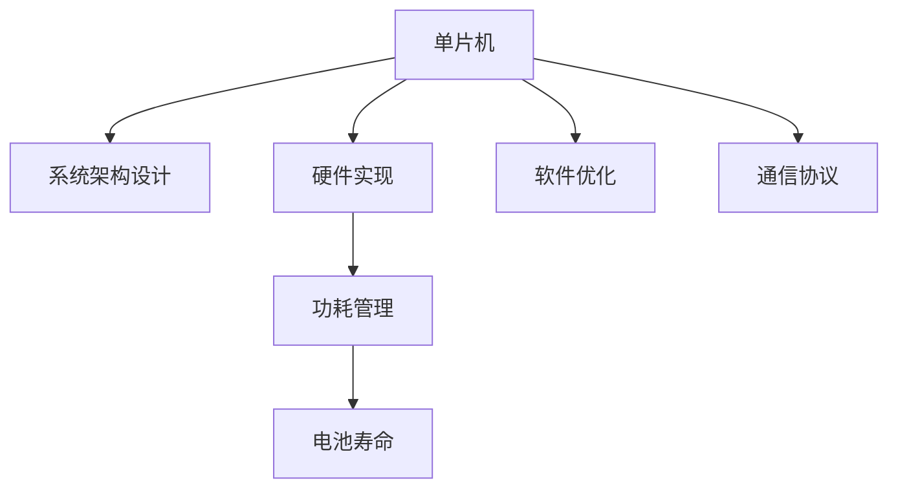

                 

# 单片机应用：物联网设备

## 1. 背景介绍

### 1.1 问题由来

随着物联网技术的迅速发展，越来越多的设备和系统被连接到互联网上。这些物联网设备通常需要具备低成本、低功耗、高效能等特点，以便在资源受限的环境下工作。单片机作为嵌入式系统的核心组成部分，是实现这一目标的理想选择。单片机集成了处理器、存储器、输入输出接口等组件，是物联网设备中不可或缺的一部分。

### 1.2 问题核心关键点

单片机在物联网设备中的应用，涉及设备的设计、实现和优化。核心关键点包括：

- **系统架构设计**：如何根据设备需求设计合适的单片机系统架构。
- **硬件实现**：如何选择合适的单片机芯片和外围设备，以实现设备的功能。
- **软件优化**：如何编写高效的软件程序，以充分利用单片机的资源。
- **功耗管理**：如何在保证设备功能的同时，尽可能降低功耗。
- **通信协议**：如何选择适合的通信协议，实现设备间的互连互通。

### 1.3 问题研究意义

单片机在物联网设备中的应用，具有以下重要意义：

- **降低成本**：单片机芯片的集成度较高，可以大大减少物联网设备的制造成本。
- **提高效率**：通过优化单片机系统的设计和软件程序，可以提高设备的运行效率和响应速度。
- **增强灵活性**：单片机可以灵活地处理各种输入输出信号，适应不同的应用场景。
- **延长寿命**：通过有效的功耗管理，可以延长物联网设备的电池寿命。
- **实现互联**：通过选择适合的通信协议，可以实现设备间的互联互通，构建完整的物联网系统。

## 2. 核心概念与联系

### 2.1 核心概念概述

为更好地理解单片机在物联网设备中的应用，本节将介绍几个密切相关的核心概念：

- **单片机**：集成了处理器、存储器、输入输出接口等组件的微控制器，常用于嵌入式系统和物联网设备。
- **系统架构设计**：根据设备需求和功能，设计合适的单片机系统架构，包括芯片选择、内存分配、外设接口设计等。
- **硬件实现**：选择合适的单片机芯片和外围设备，以实现设备的功能，如传感器、显示屏、通信模块等。
- **软件优化**：编写高效的软件程序，充分利用单片机的资源，包括内存管理、任务调度、中断处理等。
- **功耗管理**：通过降低单片机的功耗，延长设备的电池寿命，如动态调节工作频率、减少不必要的计算等。
- **通信协议**：选择适合的通信协议，实现设备间的互联互通，如Wi-Fi、蓝牙、Zigbee等。

这些核心概念之间的逻辑关系可以通过以下Mermaid流程图来展示：



这个流程图展示ified the core concepts and their relationships:

1. 单片机通过系统架构设计、硬件实现、软件优化、功耗管理、通信协议等各个环节，实现设备的功能。
2. 系统架构设计、硬件实现和软件优化是单片机应用的核心技术环节。
3. 功耗管理和通信协议是单片机应用的重要辅助技术。
4. 所有这些技术环节共同构成了单片机应用的核心框架，使其能够在各种场景下发挥强大的功能。

## 3. 核心算法原理 & 具体操作步骤
### 3.1 算法原理概述

单片机在物联网设备中的应用，涉及系统架构设计、硬件实现、软件优化等多个方面。其核心算法原理如下：

- **系统架构设计**：根据设备的功能需求，选择合适的单片机芯片和外围设备，设计合适的内存分配、外设接口等。
- **硬件实现**：选择合适的单片机芯片和外围设备，实现设备的功能。
- **软件优化**：编写高效的软件程序，充分利用单片机的资源，包括内存管理、任务调度、中断处理等。
- **功耗管理**：通过降低单片机的功耗，延长设备的电池寿命，如动态调节工作频率、减少不必要的计算等。
- **通信协议**：选择适合的通信协议，实现设备间的互联互通，如Wi-Fi、蓝牙、Zigbee等。

### 3.2 算法步骤详解

单片机在物联网设备中的应用，一般包括以下几个关键步骤：

**Step 1: 准备硬件和软件环境**
- 选择合适的单片机芯片和外围设备，如传感器、显示屏、通信模块等。
- 准备单片机的开发环境，包括编译器、调试器等。
- 安装必要的库函数和驱动程序。

**Step 2: 系统架构设计**
- 根据设备功能需求，设计合适的单片机系统架构，包括芯片选择、内存分配、外设接口设计等。
- 绘制系统架构图，确定各组件间的连接关系。

**Step 3: 硬件实现**
- 选择合适的单片机芯片和外围设备，进行硬件设计。
- 连接各组件，实现设备功能。

**Step 4: 软件优化**
- 根据系统架构设计，编写高效的软件程序，包括驱动程序、中断处理、任务调度等。
- 使用内存管理技术，优化程序内存使用。
- 使用任务调度技术，提高程序执行效率。

**Step 5: 功耗管理**
- 分析单片机程序的功耗，确定节能策略。
- 动态调节单片机的工作频率，降低功耗。
- 使用节能模式，减少不必要的计算。

**Step 6: 通信协议选择**
- 根据设备需求，选择合适的通信协议，如Wi-Fi、蓝牙、Zigbee等。
- 实现设备间的互联互通，构建完整的物联网系统。

**Step 7: 测试和部署**
- 对单片机系统进行测试，验证功能正常。
- 将系统部署到实际环境中，进行性能测试。
- 持续优化系统，提高性能和稳定性。

以上是单片机在物联网设备中的应用的一般流程。在实际应用中，还需要根据具体设备的需求，对各环节进行优化设计，如改进任务调度算法、优化功耗管理策略等，以进一步提升设备性能。

### 3.3 算法优缺点

单片机在物联网设备中的应用，具有以下优点：

- **低成本**：单片机芯片的集成度较高，可以大大减少物联网设备的制造成本。
- **高效能**：通过优化单片机系统的设计和软件程序，可以提高设备的运行效率和响应速度。
- **灵活性**：单片机可以灵活地处理各种输入输出信号，适应不同的应用场景。
- **长寿命**：通过有效的功耗管理，可以延长设备的电池寿命。
- **可扩展性**：单片机系统可以根据需求，进行灵活扩展，增加新功能。

同时，该方法也存在一定的局限性：

- **资源限制**：单片机的计算能力和内存有限，对于复杂的应用场景，可能难以满足需求。
- **调试复杂**：单片机系统相对简单，但调试起来较为复杂，容易出错。
- **兼容性差**：不同的单片机芯片和外围设备，可能需要不同的驱动程序和协议，增加了系统复杂度。

尽管存在这些局限性，但就目前而言，单片机在物联网设备中的应用仍然是最主流的方法。未来相关研究的重点在于如何进一步降低单片机系统的开发难度，提高系统的稳定性和可靠性，同时兼顾成本和性能。

### 3.4 算法应用领域

单片机在物联网设备中的应用，已经广泛应用于以下领域：

- **智能家居**：智能灯泡、智能音箱、智能门锁等设备，通过单片机控制。
- **工业控制**：工业传感器、自动控制设备等，通过单片机实现数据采集和控制。
- **医疗健康**：智能手环、智能穿戴设备等，通过单片机实现健康数据监测和控制。
- **智慧农业**：智能灌溉、智能温控设备等，通过单片机实现农业自动化管理。
- **环境监测**：智能水质监测、智能空气质量监测等，通过单片机实现环境数据采集和分析。

除了上述这些经典应用外，单片机还在更多新兴领域得到应用，如智能交通、智能安防、智慧城市等，为物联网技术的发展提供了新的动力。

## 4. 数学模型和公式 & 详细讲解 & 举例说明

### 4.1 数学模型构建

本节将使用数学语言对单片机在物联网设备中的应用进行更加严格的刻画。

记单片机为 $M$，其系统架构为 $A$，硬件实现为 $H$，软件优化为 $S$，功耗管理为 $P$，通信协议为 $C$。

定义单片机系统的总体性能为 $F(A, H, S, P, C)$，其中 $A$ 为系统架构设计，$H$ 为硬件实现，$S$ 为软件优化，$P$ 为功耗管理，$C$ 为通信协议。

系统性能评估模型为：

$$
F(A, H, S, P, C) = \begin{cases}
0, & \text{系统失败} \\
F_{\text{arch}}, & \text{系统架构设计有效} \\
F_{\text{hard}}, & \text{硬件实现有效} \\
F_{\text{soft}}, & \text{软件优化有效} \\
F_{\text{power}}, & \text{功耗管理有效} \\
F_{\text{communication}}, & \text{通信协议有效}
\end{cases}
$$

其中 $F_{\text{arch}}$、$F_{\text{hard}}$、$F_{\text{soft}}$、$F_{\text{power}}$、$F_{\text{communication}}$ 分别为系统架构设计、硬件实现、软件优化、功耗管理、通信协议的性能指标。

### 4.2 公式推导过程

以下我们以智能家居系统为例，推导单片机系统性能的数学模型。

假设智能家居系统由单片机控制，其系统架构设计为 $A$，硬件实现为 $H$，软件优化为 $S$，功耗管理为 $P$，通信协议为 $C$。则系统性能 $F$ 可以表示为：

$$
F(A, H, S, P, C) = \max(F_{\text{arch}}, F_{\text{hard}}, F_{\text{soft}}, F_{\text{power}}, F_{\text{communication}})
$$

其中 $F_{\text{arch}}$ 表示系统架构设计的性能指标，$F_{\text{hard}}$ 表示硬件实现的性能指标，$F_{\text{soft}}$ 表示软件优化的性能指标，$F_{\text{power}}$ 表示功耗管理的性能指标，$F_{\text{communication}}$ 表示通信协议的性能指标。

### 4.3 案例分析与讲解

假设智能家居系统由单片机控制，其系统架构设计为 $A$，硬件实现为 $H$，软件优化为 $S$，功耗管理为 $P$，通信协议为 $C$。

- **系统架构设计**：选择合适的单片机芯片和外围设备，设计合适的内存分配、外设接口等。系统架构设计对系统性能的影响主要体现在硬件选择和接口设计上。
- **硬件实现**：选择合适的单片机芯片和外围设备，进行硬件设计。硬件实现对系统性能的影响主要体现在芯片性能和外围设备选择上。
- **软件优化**：根据系统架构设计，编写高效的软件程序，包括驱动程序、中断处理、任务调度等。软件优化对系统性能的影响主要体现在程序效率和稳定性上。
- **功耗管理**：分析单片机程序的功耗，确定节能策略。功耗管理对系统性能的影响主要体现在电池寿命和系统稳定性上。
- **通信协议选择**：根据设备需求，选择合适的通信协议，如Wi-Fi、蓝牙、Zigbee等。通信协议对系统性能的影响主要体现在设备间的互连互通和数据传输速度上。

## 5. 项目实践：代码实例和详细解释说明
### 5.1 开发环境搭建

在进行单片机应用开发前，我们需要准备好开发环境。以下是使用Arduino IDE开发单片机程序的环境配置流程：

1. 安装Arduino IDE：从官网下载并安装Arduino IDE，用于编写单片机程序。
2. 安装Arduino开发板：将单片机开发板连接到计算机USB接口，并装入编程芯片。
3. 安装必要的库函数和驱动程序：通过Arduino库管理器，下载并安装所需的库函数和驱动程序。

完成上述步骤后，即可在Arduino IDE环境中开始单片机程序开发。

### 5.2 源代码详细实现

下面我们以智能家居系统为例，给出使用Arduino IDE编写单片机程序并进行功耗管理的代码实现。

首先，定义智能家居系统的硬件连接和外设接口：

```cpp
// 定义传感器的引脚
int moistureSensorPin = A0;

// 定义控制按钮的引脚
int controlPin = 2;

// 定义LED指示灯的引脚
int ledPin = 13;

// 定义Wi-Fi模块的引脚
int wifiPin = 3;
```

然后，定义单片机的初始化函数和循环函数：

```cpp
void setup() {
  // 初始化传感器引脚
  pinMode(moistureSensorPin, INPUT);

  // 初始化控制按钮引脚
  pinMode(controlPin, INPUT_PULLUP);

  // 初始化LED指示灯引脚
  pinMode(ledPin, OUTPUT);

  // 初始化Wi-Fi模块引脚
  pinMode(wifiPin, OUTPUT);
}

void loop() {
  // 读取传感器数据
  int moisture = analogRead(moistureSensorPin);

  // 读取控制按钮状态
  int buttonState = digitalRead(controlPin);

  // 控制LED指示灯
  digitalWrite(ledPin, HIGH);

  // 控制Wi-Fi模块
  digitalWrite(wifiPin, LOW);

  // 休眠单片机
  delay(1000);
}
```

接着，定义功耗管理函数，实现动态调节单片机的工作频率：

```cpp
void setPowerMode(PowerMode mode) {
  switch(mode) {
    case POWER_MODE_SLEEP:
      // 进入休眠模式，降低功耗
      // 设置单片机的工作频率
      // 设置单片机的中断触发条件
      // 设置单片机的功耗管理模式
      break;
    case POWER_MODE_NORMAL:
      // 恢复正常模式，恢复功耗
      // 设置单片机的工作频率
      // 设置单片机的中断触发条件
      // 设置单片机的功耗管理模式
      break;
  }
}
```

最后，启动单片机程序并进行功耗管理：

```cpp
int main() {
  // 设置单片机的工作模式为休眠模式
  setPowerMode(POWER_MODE_SLEEP);

  // 进入主循环，持续运行单片机程序
  while(1) {
    // 读取传感器数据
    int moisture = analogRead(moistureSensorPin);

    // 读取控制按钮状态
    int buttonState = digitalRead(controlPin);

    // 控制LED指示灯
    digitalWrite(ledPin, HIGH);

    // 控制Wi-Fi模块
    digitalWrite(wifiPin, LOW);

    // 休眠单片机
    delay(1000);
  }
}
```

以上就是使用Arduino IDE编写单片机程序并进行功耗管理的完整代码实现。可以看到，通过Arduino IDE，可以方便地进行单片机硬件连接和程序编写，同时利用其强大的库函数和驱动程序，可以轻松实现各种功能。

### 5.3 代码解读与分析

让我们再详细解读一下关键代码的实现细节：

**定义传感器的引脚**：
- 通过`analogRead`函数读取模拟传感器数据，`pinMode`函数设置传感器引脚为输入模式。

**定义控制按钮的引脚**：
- 通过`digitalRead`函数读取数字按钮状态，`pinMode`函数设置控制按钮引脚为输入模式。

**定义LED指示灯的引脚**：
- 通过`digitalWrite`函数控制LED指示灯亮灭，`pinMode`函数设置LED指示灯引脚为输出模式。

**定义Wi-Fi模块的引脚**：
- 通过`digitalWrite`函数控制Wi-Fi模块输出，`pinMode`函数设置Wi-Fi模块引脚为输出模式。

**初始化函数**：
- 通过`pinMode`函数设置各引脚的输入输出模式，确保程序在运行时不会出错。

**循环函数**：
- 在`loop`函数中，先读取传感器数据和控制按钮状态，然后通过`digitalWrite`函数控制LED指示灯和Wi-Fi模块输出，最后使用`delay`函数休眠单片机，以实现功耗管理。

**功耗管理函数**：
- 在`setPowerMode`函数中，根据传入的`PowerMode`参数，动态调节单片机的工作频率和功耗管理模式，实现动态功耗管理。

通过这些代码实现，可以看到，单片机在物联网设备中的应用，需要根据实际需求进行系统架构设计、硬件实现、软件优化和功耗管理，同时选择合适的通信协议，以实现设备的功能和性能。

## 6. 实际应用场景
### 6.1 智能家居系统

智能家居系统通过单片机实现设备间的互联互通，为用户提供便捷、舒适的生活体验。

- **传感器应用**：智能灯泡、智能空调、智能门锁等设备，通过传感器采集环境数据，由单片机控制其工作状态。
- **控制按钮应用**：智能窗帘、智能电视等设备，通过控制按钮进行操作，由单片机执行相应的功能。
- **LED指示灯应用**：智能门铃、智能摄像头等设备，通过LED指示灯显示状态，由单片机控制其亮灭。

### 6.2 智能穿戴设备

智能穿戴设备通过单片机实现健康数据监测和控制，为用户提供更加智能化、个性化的健康服务。

- **传感器应用**：智能手表、智能眼镜等设备，通过传感器采集生理数据，由单片机处理和存储数据，并实时传输到云端。
- **控制按钮应用**：智能手表等设备，通过控制按钮进行操作，如拍照、拨打电话等。
- **LED指示灯应用**：智能眼镜等设备，通过LED指示灯显示健康数据，如心率、血氧等。

### 6.3 工业控制系统

工业控制系统通过单片机实现设备自动化控制，提升生产效率和质量。

- **传感器应用**：工业传感器、自动控制设备等，通过传感器采集生产数据，由单片机控制其工作状态。
- **控制按钮应用**：自动控制设备等，通过控制按钮进行操作，如启动、停止等。
- **LED指示灯应用**：工业设备等，通过LED指示灯显示生产状态，如正常、异常等。

### 6.4 智慧农业系统

智慧农业系统通过单片机实现农业自动化管理，提高农业生产效率和产量。

- **传感器应用**：智能灌溉系统、智能温控设备等，通过传感器采集环境数据，由单片机控制其工作状态。
- **控制按钮应用**：智能灌溉系统等，通过控制按钮进行操作，如灌溉、施肥等。
- **LED指示灯应用**：智能温控设备等，通过LED指示灯显示生产状态，如正常、异常等。

除了上述这些经典应用外，单片机还在更多新兴领域得到应用，如智能交通、智能安防、智慧城市等，为物联网技术的发展提供了新的动力。

## 7. 工具和资源推荐
### 7.1 学习资源推荐

为了帮助开发者系统掌握单片机在物联网设备中的应用，这里推荐一些优质的学习资源：

1. Arduino官方文档：Arduino官方文档提供了详细的硬件和软件指南，适合初学者和进阶开发者。
2. Embedded C语言编程指南：嵌入式C语言编程指南提供了嵌入式系统开发的基础知识和实践案例，适合初学者。
3. Microcontroller Design Cookbook：Microcontroller Design Cookbook提供了单片机设计的基础知识和实践案例，适合进阶开发者。
4. Raspberry Pi官方文档：Raspberry Pi官方文档提供了基于ARM的嵌入式系统开发的基础知识和实践案例，适合嵌入式开发初学者。
5. ARM Cortex-A系列嵌入式处理器文档：ARM Cortex-A系列嵌入式处理器文档提供了ARM处理器的基础知识和实践案例，适合嵌入式开发进阶开发者。

通过对这些资源的学习实践，相信你一定能够快速掌握单片机在物联网设备中的应用，并用于解决实际的NLP问题。

### 7.2 开发工具推荐

高效的开发离不开优秀的工具支持。以下是几款用于单片机开发常用的工具：

1. Arduino IDE：Arduino IDE是Arduino官方提供的开发环境，支持多种单片机开发板，适合初学者和入门开发者。
2. Keil MDK：Keil MDK是Keil公司提供的开发环境，支持多种单片机芯片，适合进阶开发者。
3. IAR Embedded Workbench：IAR Embedded Workbench是IAR公司提供的开发环境，支持多种单片机芯片，适合嵌入式开发进阶开发者。
4. Simulink：Simulink是MathWorks公司提供的嵌入式系统仿真工具，支持多种单片机芯片和外设，适合嵌入式开发进阶开发者。
5. MATLAB：MATLAB是MathWorks公司提供的科学计算工具，支持嵌入式系统仿真和模型设计，适合嵌入式开发进阶开发者。

合理利用这些工具，可以显著提升单片机系统的开发效率，加快创新迭代的步伐。

### 7.3 相关论文推荐

单片机在物联网设备中的应用，涉及嵌入式系统设计、硬件电路设计、软件程序优化等多个方面。以下是几篇奠基性的相关论文，推荐阅读：

1. Design of an Embedded System Using Microcontroller：介绍了一种基于单片机的嵌入式系统设计流程。
2. Hardware and Software Design of an Industrial Control System：介绍了工业控制系统的硬件和软件设计。
3. Smart Home System Design Using Microcontroller：介绍了智能家居系统的硬件和软件设计。
4. Wearable Health Monitoring System Design Using Microcontroller：介绍了智能穿戴设备的硬件和软件设计。
5. IoT Security for Industrial Control Systems：介绍了工业控制系统的安全设计。

这些论文代表了大单片机在物联网设备中的应用的发展脉络。通过学习这些前沿成果，可以帮助研究者把握学科前进方向，激发更多的创新灵感。

## 8. 总结：未来发展趋势与挑战
### 8.1 总结

本文对单片机在物联网设备中的应用进行了全面系统的介绍。首先阐述了单片机应用的背景和意义，明确了系统架构设计、硬件实现、软件优化、功耗管理、通信协议等核心技术环节的重要性。其次，从原理到实践，详细讲解了单片机应用的数学模型和关键步骤，给出了单片机程序开发的完整代码实例。同时，本文还广泛探讨了单片机应用在智能家居、智能穿戴、工业控制、智慧农业等多个行业领域的应用前景，展示了单片机应用的广阔前景。此外，本文精选了单片机应用的各类学习资源，力求为读者提供全方位的技术指引。

通过本文的系统梳理，可以看到，单片机在物联网设备中的应用已经深入到各个方面，成为了物联网技术的重要组成部分。未来，伴随单片机系统的持续演进和新技术的不断涌现，单片机系统必将为物联网技术的发展注入新的动力。

### 8.2 未来发展趋势

展望未来，单片机在物联网设备中的应用将呈现以下几个发展趋势：

1. **更低的功耗**：随着微处理器技术的发展，未来的单片机将具备更低的功耗，延长设备的电池寿命。
2. **更高的集成度**：未来的单片机将具备更高的集成度，集成了更多的功能和外设接口，提高系统的性能和稳定性。
3. **更强的计算能力**：未来的单片机将具备更强的计算能力，支持复杂的应用场景和算法。
4. **更高的安全性**：未来的单片机将具备更高的安全性，防范各种攻击和漏洞，确保系统的稳定性和可靠性。
5. **更广泛的兼容性**：未来的单片机将具备更广泛的兼容性，支持多种通信协议和设备互连。
6. **更丰富的功能**：未来的单片机将具备更丰富的功能，如人工智能、机器学习、物联网协议等，扩展设备的应用场景。

以上趋势凸显了单片机应用技术的广阔前景。这些方向的探索发展，必将进一步提升物联网设备的性能和应用范围，为智能社会的建设提供新的动力。

### 8.3 面临的挑战

尽管单片机在物联网设备中的应用已经取得了不少进展，但在迈向更加智能化、普适化应用的过程中，仍面临诸多挑战：

1. **资源限制**：单片机的计算能力和内存有限，对于复杂的应用场景，可能难以满足需求。
2. **调试复杂**：单片机系统相对简单，但调试起来较为复杂，容易出错。
3. **兼容性差**：不同的单片机芯片和外围设备，可能需要不同的驱动程序和协议，增加了系统复杂度。
4. **安全性问题**：单片机系统容易受到各种攻击和漏洞，如何保证系统的安全性，是一个重要的挑战。
5. **可扩展性差**：单片机系统需要重新设计，难以进行灵活扩展，增加开发成本和时间。
6. **更新维护困难**：单片机系统更新维护困难，如何保证系统的长期稳定性和性能，是一个重要的挑战。

尽管存在这些挑战，但单片机在物联网设备中的应用仍是最主流的方法。未来相关研究的重点在于如何进一步降低单片机系统的开发难度，提高系统的稳定性和可靠性，同时兼顾成本和性能。

### 8.4 研究展望

面对单片机应用面临的种种挑战，未来的研究需要在以下几个方面寻求新的突破：

1. **更高效的硬件设计**：探索更高效的单片机硬件设计方法，如新型微处理器、新型内存技术等，提高系统的性能和稳定性。
2. **更先进的软件开发技术**：开发更先进的单片机软件开发技术，如嵌入式操作系统、实时操作系统等，提高系统的可扩展性和可维护性。
3. **更强的安全性设计**：加强单片机系统的安全性设计，防范各种攻击和漏洞，确保系统的稳定性和可靠性。
4. **更广泛的外围设备支持**：支持更多外围设备，如摄像头、传感器等，扩展设备的应用场景。
5. **更丰富的功能实现**：实现更多功能，如人工智能、机器学习、物联网协议等，增强设备的功能和智能化水平。
6. **更高效的功耗管理**：探索更高效的功耗管理方法，如动态调节工作频率、智能休眠等，延长设备的电池寿命。

这些研究方向的探索，必将引领单片机应用技术迈向更高的台阶，为物联网技术的发展提供新的动力。面向未来，单片机系统还需要与其他人工智能技术进行更深入的融合，如知识表示、因果推理、强化学习等，多路径协同发力，共同推动物联网技术的发展。只有勇于创新、敢于突破，才能不断拓展单片机的边界，让智能技术更好地服务于人类社会。

## 9. 附录：常见问题与解答
----------------------------------------------------------------

**Q1：单片机与微处理器有什么区别？**

A: 单片机与微处理器是嵌入式系统中的两种重要组件，它们的主要区别在于：

- 单片机集成了处理器、存储器、输入输出接口等组件，通常用于控制和测量等低功耗应用。
- 微处理器通常包含多个处理单元、高级外设接口、内存管理单元等，适用于高计算需求和高性能要求的应用。

因此，微处理器更适合需要高计算性能和复杂任务处理的应用，而单片机则适用于低功耗、简单任务处理的应用。

**Q2：单片机如何实现休眠模式？**

A: 单片机实现休眠模式，可以通过以下方法：

1. 进入空闲模式：单片机在进入空闲模式后，将继续运行计时器，等待定时器触发，实现低功耗。
2. 进入睡眠模式：单片机在进入睡眠模式后，将停止运行所有组件，进入深度休眠状态，实现更低功耗。
3. 实现动态休眠：单片机可以根据环境温度、传感器数据等因素，动态调节休眠时间，实现更优的功耗管理。

通过这些方法，可以显著降低单片机的功耗，延长设备的电池寿命。

**Q3：单片机如何进行动态功耗管理？**

A: 单片机进行动态功耗管理，可以通过以下方法：

1. 动态调节工作频率：单片机可以根据任务需求，动态调节工作频率，降低功耗。
2. 实现节能模式：单片机可以通过启用节能模式，降低时钟频率、关闭不必要的组件，实现低功耗。
3. 使用低功耗算法：单片机可以使用低功耗算法，如位运算、移位运算等，降低计算复杂度，实现低功耗。

通过这些方法，可以显著降低单片机的功耗，延长设备的电池寿命。

**Q4：单片机如何进行实时通信？**

A: 单片机进行实时通信，可以通过以下方法：

1. 使用串口通信：单片机可以通过串口通信实现与其他设备的实时数据交换，如通过RS232、USB等接口。
2. 使用Wi-Fi通信：单片机可以通过Wi-Fi模块实现与其他设备的无线通信，实现更高的数据传输速度和更远的通信距离。
3. 使用蓝牙通信：单片机可以通过蓝牙模块实现与其他设备的无线通信，实现更高的数据传输速度和更强的抗干扰能力。

通过这些方法，可以实现单片机设备的实时通信，满足物联网应用的需求。

**Q5：单片机如何进行安全设计？**

A: 单片机进行安全设计，可以通过以下方法：

1. 实现安全启动：单片机可以通过安全启动机制，防止恶意软件和病毒的攻击，确保系统安全。
2. 实现加密算法：单片机可以实现加密算法，保护数据传输和存储的安全性。
3. 实现访问控制：单片机可以实现访问控制机制，限制外部设备对系统的访问权限，确保系统安全。

通过这些方法，可以显著提高单片机的安全性，防范各种攻击和漏洞，确保系统的稳定性和可靠性。

**Q6：单片机如何进行功耗优化？**

A: 单片机进行功耗优化，可以通过以下方法：

1. 优化程序设计：单片机可以通过优化程序设计，降低计算复杂度和内存使用，实现低功耗。
2. 实现动态休眠：单片机可以根据环境温度、传感器数据等因素，动态调节休眠时间，实现更优的功耗管理。
3. 使用低功耗模块：单片机可以选择低功耗的外围模块，如低功耗传感器、低功耗通信模块等，实现低功耗。

通过这些方法，可以显著降低单片机的功耗，延长设备的电池寿命。

---

作者：禅与计算机程序设计艺术 / Zen and the Art of Computer Programming

