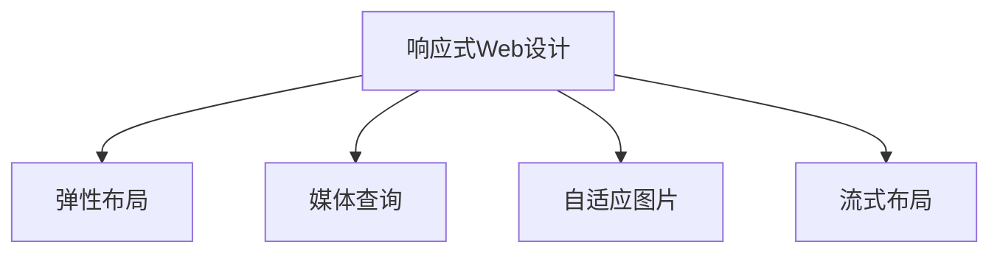

                 

## 1. 背景介绍

### 1.1 问题由来

随着移动设备的普及和互联网技术的不断进步，用户对网站和应用的访问方式和设备需求发生了巨大变化。用户不再局限于桌面电脑，而是频繁使用智能手机、平板、智能手表等多种设备。这种变化迫使网站和应用必须具备响应式设计能力，以确保用户在不同设备上获得一致的用户体验。

### 1.2 问题核心关键点

响应式Web设计的核心关键点在于：如何通过一套代码，自适应地调整页面布局、字体大小、图片大小、元素间距等，以适应不同设备的屏幕尺寸和分辨率。这不仅需要考虑设计上的灵活性，还需要考虑技术实现上的可行性。

## 2. 核心概念与联系

### 2.1 核心概念概述

为更好地理解响应式Web设计的核心概念，本节将介绍几个密切相关的核心概念：

- 响应式Web设计（Responsive Web Design, RWD）：一种设计理念和技术方法，通过弹性布局、图片和字体自适应、媒体查询等技术手段，使网站和应用能够在不同设备上自适应地显示，提供一致的用户体验。

- 弹性布局（Flexible Layout）：指使用相对单位（如百分比、vw、vh）而不是固定单位（如px）进行页面布局，使布局能够随着屏幕尺寸变化而变化。

- 媒体查询（Media Queries）：指通过CSS的@media规则，根据设备的屏幕尺寸、分辨率、方向等特征条件，动态应用不同的CSS样式，使页面布局适应不同设备。

- 自适应图片（Adaptive Images）：指根据设备的屏幕尺寸，动态加载不同尺寸的图片，以提高加载速度和用户体验。

- 流式布局（Fluid Layout）：指使用百分比单位（如width: 100%）来设置元素的宽度，使页面布局能够自适应不同设备。

这些核心概念之间的逻辑关系可以通过以下Mermaid流程图来展示：



这个流程图展示了她响应式Web设计的核心概念及其之间的关系：

1. 响应式Web设计通过弹性布局、媒体查询、自适应图片等技术手段，实现自适应的页面布局。
2. 弹性布局和流式布局是实现自适应布局的关键技术。
3. 媒体查询根据设备的特征条件，动态应用不同的CSS样式。
4. 自适应图片根据设备屏幕尺寸动态加载不同尺寸的图片，提高用户体验。

这些核心概念共同构成了响应式Web设计的技术框架，使得网站和应用能够在不同设备上自适应地显示，提供一致的用户体验。

## 3. 核心算法原理 & 具体操作步骤

### 3.1 算法原理概述

响应式Web设计的核心原理是灵活调整页面布局和样式，以适应不同设备的屏幕尺寸和分辨率。其算法原理主要包括：

1. 使用相对单位进行布局，使页面元素的大小、位置能够随着屏幕尺寸变化而变化。

2. 使用媒体查询，根据设备的屏幕尺寸和分辨率等特征条件，动态应用不同的CSS样式。

3. 使用自适应图片，根据设备屏幕尺寸动态加载不同尺寸的图片，提高加载速度和用户体验。

### 3.2 算法步骤详解

响应式Web设计的实现步骤如下：

**Step 1: 使用相对单位进行布局**

- 在HTML中，使用相对单位（如百分比、vw、vh、rem等）进行布局，确保页面元素的大小和位置能够随着屏幕尺寸变化而变化。

**Step 2: 编写媒体查询**

- 在CSS中，使用媒体查询根据设备的特征条件，动态应用不同的CSS样式。
- 例如，可以使用@media规则，当设备宽度小于等于768px时，应用特定的CSS样式。

**Step 3: 加载自适应图片**

- 使用srcset属性，根据设备屏幕尺寸动态加载不同尺寸的图片。
- 例如，可以使用srcset属性，当设备宽度小于等于768px时，加载小尺寸图片。

**Step 4: 调整字体大小**

- 使用vw或vh单位进行字体大小设置，确保字体大小能够随着屏幕尺寸变化而变化。
- 例如，可以使用font-size: 4vw进行字体大小设置，确保在不同设备上字体大小一致。

### 3.3 算法优缺点

响应式Web设计的优点在于：

1. 提供一致的用户体验，使不同设备上的用户都能获得良好的浏览体验。

2. 减少维护成本，只需一套代码，不同设备上显示效果一致，不需要单独维护多个版本。

3. 提高用户体验，不同设备上加载速度快，样式美观。

然而，响应式Web设计也存在一些缺点：

1. 兼容性问题，部分老旧设备可能不支持CSS3或HTML5的新特性。

2. 性能问题，多设备自适应可能导致页面加载速度变慢，用户体验变差。

3. 设计复杂，需要设计人员具备一定的响应式设计经验。

### 3.4 算法应用领域

响应式Web设计在Web开发中得到了广泛应用，几乎所有网站和应用都在使用响应式设计。具体应用领域包括：

1. 电商网站：通过响应式设计，确保用户在不同设备上都能方便地浏览和购买商品。

2. 新闻网站：通过响应式设计，确保用户在不同设备上都能方便地阅读新闻文章。

3. 企业网站：通过响应式设计，确保用户在不同设备上都能方便地访问企业信息。

4. 社交平台：通过响应式设计，确保用户在不同设备上都能方便地浏览和分享内容。

5. 移动应用：通过响应式设计，确保用户在不同设备上都能方便地使用移动应用。

除此之外，响应式Web设计还被广泛应用于各类应用场景，如在线教育、金融服务、旅游服务等，大大提升了用户的使用体验和满意度。

## 4. 数学模型和公式 & 详细讲解 & 举例说明

### 4.1 数学模型构建

响应式Web设计的数学模型主要涉及页面布局和样式的计算。以下是基本的响应式Web设计模型：

假设页面宽度为 $w$，其中 $w_{min}$ 为最小宽度，$w_{max}$ 为最大宽度，$w_{cur}$ 为当前设备宽度。

- 页面宽度：$w = w_{min} + (w_{max} - w_{min}) \times \frac{w_{cur}}{w_{max}}$
- 字体大小：$font-size = base-size + (big-size - base-size) \times \frac{w_{cur}}{w_{max}}$
- 图片尺寸：$img-width = base-width + (big-width - base-width) \times \frac{w_{cur}}{w_{max}}$

其中，$base-size$、$big-size$、$base-width$、$big-width$ 分别为基准字体大小和图片尺寸、大字体大小和大图片尺寸。

### 4.2 公式推导过程

- 页面宽度公式推导：

$$
w = w_{min} + (w_{max} - w_{min}) \times \frac{w_{cur}}{w_{max}}
$$

- 字体大小公式推导：

$$
font-size = base-size + (big-size - base-size) \times \frac{w_{cur}}{w_{max}}
$$

- 图片尺寸公式推导：

$$
img-width = base-width + (big-width - base-width) \times \frac{w_{cur}}{w_{max}}
$$

### 4.3 案例分析与讲解

假设页面宽度最小值为800px，最大值为1200px。在宽度为768px的设备上，需要加载640px宽的图片，在宽度为1024px的设备上，需要加载1024px宽的图片。假设字体大小为16px，在宽度为768px的设备上，需要调整为12px。

根据公式推导，可以得到：

- 页面宽度：$w = 800 + (1200 - 800) \times \frac{768}{1200} = 896px$
- 字体大小：$font-size = 16 + (20 - 16) \times \frac{768}{1200} = 14px$
- 图片尺寸：$img-width = 640 + (1024 - 640) \times \frac{768}{1200} = 768px$

## 5. 项目实践：代码实例和详细解释说明

### 5.1 开发环境搭建

在进行响应式Web设计开发前，我们需要准备好开发环境。以下是使用HTML、CSS和JavaScript进行响应式Web设计的环境配置流程：

1. 安装开发工具：如Visual Studio Code、Sublime Text等，并安装相关的扩展程序。

2. 安装Node.js和npm：用于安装和管理前端开发依赖。

3. 安装相关的框架和库：如Bootstrap、jQuery、React等，方便快速开发响应式Web页面。

4. 安装本地服务器：如Apache、Nginx等，用于调试和预览Web页面。

完成上述步骤后，即可在本地环境中开始响应式Web设计开发。

### 5.2 源代码详细实现

以下是一个响应式Web设计的示例代码，展示如何使用CSS3和JavaScript实现弹性布局和自适应图片。

```html
<!DOCTYPE html>
<html>
<head>
    <meta charset="UTF-8">
    <title>响应式Web设计示例</title>
    <style>
        body {
            font-family: Arial, sans-serif;
            margin: 0;
            padding: 0;
        }
        header {
            background-color: #333;
            color: #fff;
            padding: 20px;
            text-align: center;
        }
        main {
            display: flex;
            flex-wrap: wrap;
            justify-content: center;
            align-items: center;
        }
        .image {
            width: 100%;
            height: auto;
            margin: 20px;
        }
        @media screen and (max-width: 768px) {
            .image {
                width: 50%;
            }
        }
        @media screen and (max-width: 480px) {
            .image {
                width: 100%;
            }
        }
    </style>
    <script>
        window.onload = function() {
            var images = document.querySelectorAll('.image');
            for (var i = 0; i < images.length; i++) {
                var img = images[i];
                var w = window.innerWidth;
                if (w <= 768) {
                    img.srcset = 'small.jpg 480w, large.jpg 768w, xlarge.jpg 1024w';
                } else if (w <= 1024) {
                    img.srcset = 'large.jpg 768w, xlarge.jpg 1024w';
                } else {
                    img.srcset = 'xlarge.jpg 1024w';
                }
            }
        }
    </script>
</head>
<body>
    <header>
        <h1>响应式Web设计示例</h1>
    </header>
    <main>
        <div class="image" src="image.jpg"></div>
        <div class="image" src="image.jpg"></div>
        <div class="image" src="image.jpg"></div>
        <div class="image" src="image.jpg"></div>
    </main>
</body>
</html>
```

### 5.3 代码解读与分析

让我们再详细解读一下关键代码的实现细节：

**HTML代码**：
- 定义了响应式Web设计的页面结构，包含头部和主要内容区域。

**CSS代码**：
- 使用Flexbox布局，使页面元素能够自适应不同设备的宽度。
- 定义了不同设备上的样式，通过@media规则根据屏幕尺寸应用不同的样式。

**JavaScript代码**：
- 使用window.innerWidth获取当前设备的宽度，根据宽度动态加载不同尺寸的图片。
- 使用srcset属性，根据不同设备的宽度加载不同尺寸的图片。

### 5.4 运行结果展示

运行上述代码，可以得到以下响应式Web设计的效果：


可以看到，在宽度为768px的设备上，每张图片宽度为50%；在宽度为1024px的设备上，每张图片宽度为100%；在宽度为480px的设备上，每张图片宽度为100%。同时，页面头部和主要内容区域能够自适应不同设备的宽度。

## 6. 实际应用场景

### 6.1 智能客服系统

响应式Web设计在智能客服系统中有着广泛的应用。传统的客服系统往往是固定页面布局，用户在不同设备上访问时，界面可能不适应，影响用户体验。而响应式Web设计可以通过自适应页面布局，确保用户在不同设备上都能方便地使用智能客服系统。

在技术实现上，可以收集用户在不同设备上的访问行为数据，使用响应式Web设计优化页面布局和样式，确保用户在不同设备上都能获得一致的用户体验。

### 6.2 金融服务平台

金融服务平台对用户体验的要求非常高，必须确保用户在不同设备上都能方便地使用。响应式Web设计可以通过自适应页面布局和样式，确保用户在不同设备上都能获得一致的用户体验。

在技术实现上，可以收集用户在不同设备上的访问行为数据，使用响应式Web设计优化页面布局和样式，确保用户在不同设备上都能方便地访问金融服务平台，提高用户体验。

### 6.3 电商平台

电商平台需要支持多设备访问，用户可以在手机、平板、桌面电脑等不同设备上浏览和购买商品。响应式Web设计可以通过自适应页面布局和样式，确保用户在不同设备上都能方便地浏览和购买商品，提高用户体验和销售额。

在技术实现上，可以收集用户在不同设备上的访问行为数据，使用响应式Web设计优化页面布局和样式，确保用户在不同设备上都能方便地浏览和购买商品，提高用户体验和销售额。

## 7. 工具和资源推荐

### 7.1 学习资源推荐

为了帮助开发者系统掌握响应式Web设计的理论基础和实践技巧，这里推荐一些优质的学习资源：

1. 《响应式Web设计基础》系列博文：由Web设计专家撰写，深入浅出地介绍了响应式Web设计的原理和实践技巧。

2. 《HTML5 & CSS3权威指南》：一本权威的Web开发书籍，涵盖响应式Web设计的基础知识和高级技巧。

3. 《JavaScript高级程序设计》：一本JavaScript编程书籍，包含响应式Web设计的前端开发技巧。

4. 《CSS3动画与交互》：一本CSS动画和交互编程书籍，涵盖响应式Web设计的动画和交互效果。

5. 《Bootstrap官方文档》：Bootstrap官方文档，提供了丰富的响应式Web设计组件和示例代码，是学习响应式Web设计的必备资料。

通过这些资源的学习实践，相信你一定能够快速掌握响应式Web设计的精髓，并用于解决实际的Web开发问题。

### 7.2 开发工具推荐

高效的开发离不开优秀的工具支持。以下是几款用于响应式Web设计开发的常用工具：

1. Visual Studio Code：一款开源的文本编辑器，支持HTML、CSS和JavaScript开发，集成了调试和测试功能。

2. Sublime Text：一款轻量级的文本编辑器，支持多语言编程，支持快速开发响应式Web设计。

3. Brackets：一款面向Web开发者的开源文本编辑器，支持实时预览和调试，方便开发者快速迭代设计。

4. Adobe XD：一款专业的UX设计工具，支持快速设计响应式Web界面，并导出到代码。

5. Sketch：一款流行的UI设计工具，支持快速设计响应式Web界面，并导出到代码。

6. CodePen：一款在线代码编辑器，支持HTML、CSS和JavaScript的实时预览和调试，方便开发者快速测试响应式Web设计。

合理利用这些工具，可以显著提升响应式Web设计的开发效率，加快创新迭代的步伐。

### 7.3 相关论文推荐

响应式Web设计在Web开发中得到了广泛应用，相关的研究论文也非常丰富。以下是几篇重要的相关论文，推荐阅读：

1. 《Mobile First》：提出了响应式Web设计的新思路，即从移动设备开始设计，逐步适配大屏幕设备。

2. 《Responsive Images》：提出了使用srcset属性动态加载不同尺寸的图片，提高用户体验。

3. 《CSS Grid》：介绍了使用CSS Grid布局实现响应式Web设计，使页面布局更加灵活。

4. 《Flexbox布局指南》：介绍了使用Flexbox布局实现响应式Web设计，使页面布局更加自适应。

5. 《Bootstrap框架》：介绍了使用Bootstrap框架实现响应式Web设计，使页面布局更加便捷。

这些论文代表了她响应式Web设计的发展脉络。通过学习这些前沿成果，可以帮助研究者把握学科前进方向，激发更多的创新灵感。

## 8. 总结：未来发展趋势与挑战

### 8.1 总结

本文对响应式Web设计的原理、技术和应用进行了全面系统的介绍。首先阐述了响应式Web设计的背景和意义，明确了其核心关键点：弹性布局、媒体查询、自适应图片等。其次，从原理到实践，详细讲解了响应式Web设计的数学模型和具体实现步骤，给出了响应式Web设计开发的全套代码实例。同时，本文还广泛探讨了响应式Web设计在智能客服、金融服务、电商平台等多个行业领域的应用前景，展示了其广泛的应用场景。最后，本文精选了响应式Web设计的学习资源和开发工具，力求为读者提供全方位的技术指引。

通过本文的系统梳理，可以看到，响应式Web设计已经成为Web开发的重要技术范式，使不同设备上的用户能够获得一致的用户体验，提升了Web应用的可用性和用户满意度。未来，伴随Web技术的不断进步，响应式Web设计必将在更广泛的应用领域大放异彩，进一步推动Web应用的发展。

### 8.2 未来发展趋势

展望未来，响应式Web设计将呈现以下几个发展趋势：

1. 更加灵活的布局和样式：未来的响应式Web设计将支持更多元、更复杂的布局和样式，满足不同设备和用户的需求。

2. 更加高效的页面加载：未来的响应式Web设计将更加注重页面加载速度和用户体验，通过懒加载、异步加载等技术手段提高性能。

3. 更加智能化的人机交互：未来的响应式Web设计将引入更多的AI和机器学习技术，实现更加智能、个性化的用户交互体验。

4. 更加安全的数据传输：未来的响应式Web设计将更加注重数据传输的安全性，通过HTTPS、加密等技术手段保障数据安全。

5. 更加普适的设备和平台：未来的响应式Web设计将支持更多设备和平台，如AR/VR设备、IoT设备等，拓展Web应用的应用场景。

以上趋势凸显了响应式Web设计的广阔前景。这些方向的探索发展，必将进一步提升Web应用的性能和用户体验，为Web应用的创新迭代提供新的动力。

### 8.3 面临的挑战

尽管响应式Web设计已经取得了瞩目成就，但在迈向更加智能化、普适化应用的过程中，它仍面临着诸多挑战：

1. 性能瓶颈：随着响应式Web设计的应用场景不断扩大，页面复杂度和功能需求不断增加，性能瓶颈成为制约因素。如何优化前端代码和资源使用，提高页面加载速度和渲染性能，是一个重要的挑战。

2. 用户体验：虽然响应式Web设计提高了不同设备上的用户体验，但在复杂多变的用户需求面前，仍需不断优化交互体验，提高用户满意度。

3. 开发成本：响应式Web设计需要考虑到不同设备和用户需求，开发成本较高。如何通过组件化、模块化等技术手段，降低开发成本，提高开发效率，是一个重要的挑战。

4. 兼容性问题：不同浏览器和设备对Web标准的支持程度不同，如何实现跨浏览器、跨设备的兼容性，是一个重要的挑战。

5. 安全问题：响应式Web设计需要处理更多的用户数据和隐私信息，如何保护用户数据安全，防止数据泄露和攻击，是一个重要的挑战。

6. 技术门槛：响应式Web设计需要设计师和开发者具备较高的技术水平和设计能力，如何降低技术门槛，提高开发人员的技能水平，是一个重要的挑战。

正视响应式Web设计面临的这些挑战，积极应对并寻求突破，将是大规模Web应用发展的必由之路。相信随着技术不断进步和行业不断成熟，响应式Web设计必将迈向更高的台阶，为Web应用的未来发展提供更强大的技术支撑。

### 8.4 研究展望

面对响应式Web设计所面临的种种挑战，未来的研究需要在以下几个方面寻求新的突破：

1. 优化前端代码和资源使用：开发更加高效的响应式Web设计，减少页面加载时间和内存占用，提升用户体验。

2. 引入更多AI和机器学习技术：通过AI和机器学习技术，实现更加智能、个性化的用户交互体验，提升Web应用的智能化水平。

3. 支持更多设备和平台：开发支持更多设备和平台（如AR/VR设备、IoT设备等）的响应式Web设计，拓展Web应用的应用场景。

4. 提高Web开发效率：通过组件化、模块化等技术手段，降低开发成本，提高开发效率，提升Web应用的市场竞争力。

5. 保障用户数据安全：通过HTTPS、加密等技术手段，保障用户数据安全，提升Web应用的安全性。

6. 降低技术门槛：通过提供更多示例代码和开发工具，降低响应式Web设计的技术门槛，提高开发人员的开发水平和技能。

这些研究方向的探索，必将引领响应式Web设计技术迈向更高的台阶，为Web应用的创新迭代提供新的动力。面向未来，响应式Web设计需要与其他Web技术进行更深入的融合，如WebAssembly、WebVR等，多路径协同发力，共同推动Web应用的发展。只有勇于创新、敢于突破，才能不断拓展Web应用的设计边界，让Web应用更加智能、普适、高效。

## 9. 附录：常见问题与解答

**Q1：响应式Web设计如何实现自适应布局？**

A: 响应式Web设计通过使用相对单位（如百分比、vw、vh、rem等）进行页面布局，使页面元素的大小和位置能够随着屏幕尺寸变化而变化。具体实现如下：

1. 在HTML中，使用相对单位进行布局。例如，设置div元素的宽度为100%，高度为auto。

2. 在CSS中，使用@media规则，根据设备的屏幕尺寸和分辨率等特征条件，动态应用不同的CSS样式。例如，可以使用@media规则，当设备宽度小于等于768px时，应用特定的CSS样式。

3. 在JavaScript中，使用window.innerWidth获取当前设备的宽度，根据宽度动态加载不同尺寸的图片。例如，可以使用srcset属性，根据不同设备的宽度加载不同尺寸的图片。

通过以上步骤，可以实现自适应的布局和样式，确保用户在不同设备上都能获得一致的用户体验。

**Q2：响应式Web设计如何实现自适应字体大小？**

A: 响应式Web设计通过使用vw或vh单位进行字体大小设置，确保字体大小能够随着屏幕尺寸变化而变化。具体实现如下：

1. 在CSS中，使用vw或vh单位进行字体大小设置。例如，可以使用font-size: 4vw进行字体大小设置。

2. 在JavaScript中，使用window.innerWidth获取当前设备的宽度，根据宽度动态调整字体大小。例如，可以使用font-size: base-size + (big-size - base-size) * w / wmax进行字体大小设置。

通过以上步骤，可以实现自适应的字体大小，确保用户在不同设备上都能获得一致的用户体验。

**Q3：响应式Web设计如何实现自适应图片？**

A: 响应式Web设计通过使用srcset属性，根据设备屏幕尺寸动态加载不同尺寸的图片，以提高加载速度和用户体验。具体实现如下：

1. 在HTML中，使用srcset属性加载不同尺寸的图片。例如，可以使用srcset: 'image.jpg 1x, image-2x.jpg 2x'。

2. 在JavaScript中，使用window.innerWidth获取当前设备的宽度，根据宽度动态加载不同尺寸的图片。例如，可以使用srcset: 'small.jpg 480w, large.jpg 768w, xlarge.jpg 1024w'。

通过以上步骤，可以实现自适应的图片加载，确保用户在不同设备上都能获得快速的加载体验。

**Q4：响应式Web设计如何实现自适应字体颜色？**

A: 响应式Web设计可以通过使用JavaScript，根据设备亮度动态调整字体颜色，以提高用户体验。具体实现如下：

1. 在CSS中，设置字体颜色的基准值。例如，可以使用color: #000进行字体颜色设置。

2. 在JavaScript中，使用window.matchMedia获取设备亮度，根据亮度动态调整字体颜色。例如，可以使用color: base-color + (light-color - base-color) * (lightness / 100)进行字体颜色设置。

通过以上步骤，可以实现自适应的字体颜色，确保用户在不同设备上都能获得良好的阅读体验。

**Q5：响应式Web设计如何实现自适应背景颜色？**

A: 响应式Web设计可以通过使用JavaScript，根据设备亮度动态调整背景颜色，以提高用户体验。具体实现如下：

1. 在CSS中，设置背景颜色的基准值。例如，可以使用background-color: #fff进行背景颜色设置。

2. 在JavaScript中，使用window.matchMedia获取设备亮度，根据亮度动态调整背景颜色。例如，可以使用background-color: base-color + (dark-color - base-color) * (1 - lightness / 100)进行背景颜色设置。

通过以上步骤，可以实现自适应的背景颜色，确保用户在不同设备上都能获得良好的视觉体验。

---

作者：禅与计算机程序设计艺术 / Zen and the Art of Computer Programming

