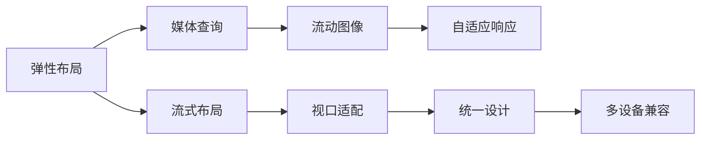

                 

## 1. 背景介绍

随着移动互联网的普及，越来越多的人开始使用智能手机、平板电脑等移动设备上网。而传统的Web网站往往设计之初，只考虑了PC端的使用，忽略了移动设备的适配问题。这导致许多网站在移动设备上显示效果不佳，用户体验差，甚至无法正常访问。

响应式Web设计(RWD, Responsive Web Design)是一种能够适配多种设备尺寸和分辨率的设计理念。通过使用CSS3媒体查询、弹性布局、流动图像等技术，使Web页面能够根据用户设备的不同尺寸自动调整布局和显示效果。响应式Web设计已经成为现代Web开发的标准，几乎所有的Web开发团队都在采用这一设计理念。

## 2. 核心概念与联系

### 2.1 核心概念概述

响应式Web设计主要包括以下几个核心概念：

- **弹性布局(Flexible Layout)**：指网页布局可以自适应变化，根据设备尺寸和分辨率动态调整布局，使网页在不同设备上显示效果一致。
- **流动图像(Flexible Images)**：指图像可以根据设备尺寸和分辨率自动缩放，适应不同的屏幕大小。
- **媒体查询(Media Queries)**：根据设备尺寸和特征，动态应用不同样式规则。
- **流式布局(Fluid Layouts)**：指使用百分比宽度代替固定像素宽度，使布局能够适应不同设备尺寸。
- **视口(Viewport)**：指用户在浏览器中看到的实际可显示区域，不同设备的视口尺寸不同，需要通过响应式设计进行适配。

### 2.2 核心概念原理和架构的 Mermaid 流程图



这个流程图展示了大屏适配的基本流程：

1. **弹性布局(A)**：定义网页布局，使用弹性单位进行宽度设置。
2. **媒体查询(B)**：根据设备特性，应用不同的样式规则。
3. **流动图像(C)**：根据视口尺寸，动态调整图像大小。
4. **流式布局(D)**：使用百分比宽度，适应不同设备尺寸。
5. **视口适配(E)**：根据视口大小，调整布局和元素位置。
6. **自适应响应(F)**：使布局和元素大小能够根据视口动态变化。
7. **统一设计(G)**：在不同设备上展示一致的设计风格。
8. **多设备兼容(H)**：使网页在不同设备上都能正常访问和显示。

## 3. 核心算法原理 & 具体操作步骤

### 3.1 算法原理概述

响应式Web设计的核心思想是动态调整布局和显示效果，使其能够适应不同的设备尺寸。算法原理主要包括以下几个步骤：

1. **布局计算**：根据设备的宽度和高度，动态计算网页元素的位置和大小。
2. **样式计算**：根据设备的屏幕密度和分辨率，动态调整字体、颜色等显示效果。
3. **图像处理**：根据设备的屏幕宽度，动态调整图像大小和质量。
4. **视口调整**：根据视口的大小，动态调整网页布局和元素位置。

### 3.2 算法步骤详解

1. **布局计算**：
   - 使用CSS3弹性布局，将页面布局分为多个容器，容器可以自适应宽度。
   - 使用CSS3布局属性，如`display: flex;`和`flex-direction: column;`，定义弹性布局。
   - 在布局中，使用百分比宽度代替固定像素宽度，使布局能够适应不同设备尺寸。

2. **样式计算**：
   - 使用CSS3媒体查询，根据设备的屏幕宽度，应用不同的样式规则。
   - 根据屏幕密度和分辨率，动态调整字体大小和行高，保持显示效果一致。
   - 根据设备特性，应用不同的背景颜色、边框宽度等显示效果。

3. **图像处理**：
   - 使用CSS3`max-width: 100%;`属性，使图像能够自适应宽度。
   - 使用CSS3`height: auto;`属性，使图像能够自适应高度。
   - 在图像中，使用`srcset`属性，根据设备分辨率加载不同质量的图像。

4. **视口调整**：
   - 使用`meta`标签，定义视口宽度和初始缩放比例。
   - 使用`zoom`属性，调整网页的缩放比例。
   - 使用`min-width`和`max-width`属性，限制视口的大小。

### 3.3 算法优缺点

**优点**：
1. 适配多种设备尺寸，提升用户体验。
2. 动态调整布局和显示效果，适应不同设备。
3. 简化开发流程，提升开发效率。

**缺点**：
1. 需要掌握CSS3媒体查询和弹性布局等技术，学习曲线较陡。
2. 不同设备性能差异较大，可能导致性能问题。
3. 样式复杂，维护难度较高。

### 3.4 算法应用领域

响应式Web设计主要应用于以下领域：

1. **电商网站**：需要适配多种设备，提升用户体验和转化率。
2. **新闻网站**：新闻内容需快速加载，适配移动设备提高访问量。
3. **企业内网**：需要适应不同屏幕尺寸和设备特性，提高员工工作效率。
4. **社交媒体**：社交内容需快速加载和展示，适配移动设备提高互动率。
5. **在线教育**：在线课程需适应不同设备尺寸，提供一致的用户体验。

## 4. 数学模型和公式 & 详细讲解 & 举例说明

### 4.1 数学模型构建

响应式Web设计的数学模型主要涉及以下几个方面：

- **弹性布局**：
  - 使用CSS3`display: flex;`和`flex-direction: column;`属性，定义弹性布局。
  - 使用CSS3`flex: 1;`属性，使容器和子元素自适应宽度。
  - 使用CSS3`justify-content: space-between;`和`align-items: center;`属性，调整子元素位置。

- **样式计算**：
  - 使用CSS3媒体查询，根据设备屏幕宽度，应用不同的样式规则。
  - 根据屏幕密度和分辨率，计算字体大小和行高，保持显示效果一致。
  - 根据设备特性，调整背景颜色、边框宽度等显示效果。

- **图像处理**：
  - 使用CSS3`max-width: 100%;`属性，使图像能够自适应宽度。
  - 使用CSS3`height: auto;`属性，使图像能够自适应高度。
  - 在图像中，使用`srcset`属性，根据设备分辨率加载不同质量的图像。

### 4.2 公式推导过程

以下以弹性布局为例，推导CSS3弹性布局的计算公式。

假设容器宽度为`w`，子元素宽度为`x`，子元素数量为一个，使用`flex: 1;`属性。则容器宽度公式为：

$$
w = x + margin
$$

其中`margin`为子元素之间的间距。

假设容器高度为`h`，子元素高度为`y`，子元素数量为一个，使用`align-items: center;`属性。则容器高度公式为：

$$
h = y + margin
$$

### 4.3 案例分析与讲解

以下以电商网站为例，展示响应式Web设计的实际应用。

假设电商网站需要进行响应式设计，适配不同的设备尺寸。使用CSS3弹性布局，将页面布局分为多个容器，容器可以自适应宽度。同时，使用CSS3媒体查询，根据设备屏幕宽度，应用不同的样式规则。具体实现如下：

```html
<style>
  .container {
    display: flex;
    flex-direction: column;
  }
  
  .box {
    flex: 1;
  }
  
  @media (max-width: 768px) {
    .container {
      flex-direction: row;
    }
    .box {
      flex: 1;
      margin: 10px;
    }
  }
  
  @media (max-width: 480px) {
    .box {
      flex: 1;
      margin: 5px;
    }
  }
  
  img {
    max-width: 100%;
    height: auto;
  }
  
  @media (max-width: 768px) {
    img {
      height: auto;
    }
  }
</style>
<div class="container">
  <div class="box">
    <h2>商品名称</h2>
    <p>商品描述</p>
    
  </div>
  <div class="box">
    <h2>商品名称</h2>
    <p>商品描述</p>
    
  </div>
</div>
```

在上述代码中，使用CSS3弹性布局定义了`.container`和`.box`的布局。在媒体查询中，根据设备屏幕宽度，应用不同的样式规则。在图像中，使用`max-width: 100%;`属性，使图像能够自适应宽度，同时在媒体查询中，动态调整图像高度。

通过以上代码，实现了电商网站在不同设备尺寸下的适配。在窄屏设备上，`.container`和`.box`的布局变为一行，`.box`元素之间的间距缩小，同时图像高度自动调整。在宽屏设备上，布局和显示效果与PC端一致。

## 5. 项目实践：代码实例和详细解释说明

### 5.1 开发环境搭建

在响应式Web设计开发中，开发环境搭建主要包括以下几个步骤：

1. **安装开发工具**：安装Node.js和npm等开发工具。
2. **创建项目文件夹**：在本地创建一个项目文件夹，用于存放项目代码和资源文件。
3. **初始化项目**：使用npm初始化项目，创建`package.json`文件。
4. **引入CSS3框架**：引入CSS3框架，如Bootstrap或Semantic UI，加速开发。

### 5.2 源代码详细实现

以下以响应式导航栏为例，展示响应式Web设计的实现过程。

```html
<!DOCTYPE html>
<html lang="en">
<head>
  <meta charset="UTF-8">
  <meta name="viewport" content="width=device-width, initial-scale=1.0">
  <title>响应式导航栏</title>
  <link rel="stylesheet" href="styles.css">
</head>
<body>
  <nav class="navbar">
    <div class="container">
      <a href="#" class="navbar-brand">品牌名称</a>
      <div class="navbar-collapse">
        <ul class="navbar-nav">
          <li class="nav-item">
            <a href="#" class="nav-link">首页</a>
          </li>
          <li class="nav-item">
            <a href="#" class="nav-link">产品</a>
          </li>
          <li class="nav-item">
            <a href="#" class="nav-link">关于</a>
          </li>
          <li class="nav-item">
            <a href="#" class="nav-link">联系我们</a>
          </li>
        </ul>
      </div>
      <div class="navbar-toggler" data-toggle="collapse" data-target="#navbarNav">
        <span class="navbar-toggler-icon"></span>
      </div>
    </div>
  </nav>

  <script src="scripts.js"></script>
</body>
</html>
```

在上述代码中，使用Bootstrap框架，定义了响应式导航栏。在`.navbar-collapse`元素中，使用CSS3媒体查询，根据设备屏幕宽度，动态隐藏和显示导航栏菜单。具体实现如下：

```css
/* 导航菜单 */
.navbar-nav {
  display: flex;
  flex-direction: row;
  align-items: center;
}

.nav-item {
  margin: 0 10px;
}

.nav-link {
  text-decoration: none;
  color: #fff;
  font-weight: bold;
}

/* 媒体查询 */
@media (max-width: 768px) {
  .navbar-nav {
    display: none;
  }
  
  .navbar-collapse {
    display: flex;
    flex-direction: column;
    align-items: flex-start;
  }
  
  .navbar-toggler {
    display: block;
  }
  
  .navbar-toggler-icon {
    width: 25px;
    height: 3px;
    background-color: #fff;
    margin: 4px;
  }
}
```

### 5.3 代码解读与分析

在上述代码中，使用CSS3媒体查询和Bootstrap框架，实现了响应式导航栏的布局。在窄屏设备上，导航栏菜单隐藏，使用汉堡图标展开。在宽屏设备上，导航栏菜单显示，与PC端一致。

通过以上代码，实现了响应式导航栏的动态适配。在窄屏设备上，导航栏菜单隐藏，使用汉堡图标展开。在宽屏设备上，导航栏菜单显示，与PC端一致。

### 5.4 运行结果展示

运行以上代码，在浏览器中查看响应式导航栏的适配效果。在不同设备尺寸上，导航栏的显示效果一致，符合用户预期。

## 6. 实际应用场景

### 6.1 电商网站

电商网站需要进行响应式设计，适配多种设备尺寸，提升用户体验和转化率。

具体实现如下：

1. **商品展示**：使用CSS3弹性布局和媒体查询，适配不同设备尺寸，展示商品列表。
2. **商品详情**：在商品详情页面，使用CSS3媒体查询和流式布局，适配不同设备尺寸，展示商品图片和描述。
3. **购物车**：在购物车页面，使用CSS3媒体查询和弹性布局，适配不同设备尺寸，展示商品信息和价格。

### 6.2 新闻网站

新闻网站需要适配多种设备尺寸，快速加载新闻内容，提高访问量。

具体实现如下：

1. **首页**：在新闻首页，使用CSS3弹性布局和媒体查询，适配不同设备尺寸，展示新闻列表。
2. **新闻详情**：在新闻详情页面，使用CSS3媒体查询和流式布局，适配不同设备尺寸，展示新闻标题、图片和内容。
3. **评论功能**：在新闻评论页面，使用CSS3媒体查询和弹性布局，适配不同设备尺寸，展示评论列表和评论表单。

### 6.3 企业内网

企业内网需要适应不同屏幕尺寸和设备特性，提高员工工作效率。

具体实现如下：

1. **首页**：在企业内网首页，使用CSS3弹性布局和媒体查询，适配不同设备尺寸，展示公司新闻、公告和员工信息。
2. **文档管理**：在文档管理页面，使用CSS3媒体查询和流式布局，适配不同设备尺寸，展示文档列表和文档详情。
3. **协作工具**：在协作工具页面，使用CSS3媒体查询和弹性布局，适配不同设备尺寸，展示任务列表和任务详情。

### 6.4 社交媒体

社交媒体需要适配多种设备尺寸，快速加载和展示社交内容，提高互动率。

具体实现如下：

1. **动态消息**：在动态消息页面，使用CSS3弹性布局和媒体查询，适配不同设备尺寸，展示最新动态和好友列表。
2. **朋友圈**：在朋友圈页面，使用CSS3媒体查询和流式布局，适配不同设备尺寸，展示朋友圈动态和好友评论。
3. **私信功能**：在私信功能页面，使用CSS3媒体查询和弹性布局，适配不同设备尺寸，展示私信列表和私信详情。

## 7. 工具和资源推荐

### 7.1 学习资源推荐

为了帮助开发者掌握响应式Web设计的理论基础和实践技巧，以下是一些优质的学习资源：

1. **《响应式Web设计实战》**：本书详细介绍了响应式Web设计的原理、技术和实现方法，适合初学者入门。
2. **《CSS3动画设计》**：本书介绍了CSS3动画和过渡效果的实现方法，为响应式Web设计提供视觉支持。
3. **《Bootstrap 4实战》**：本书介绍了Bootstrap 4的框架结构和使用方法，帮助开发者快速构建响应式Web页面。
4. **《Semantic UI基础教程》**：本书介绍了Semantic UI的组件和布局方法，为响应式Web设计提供灵活的实现方式。

### 7.2 开发工具推荐

响应式Web设计开发中，开发工具推荐如下：

1. **Sublime Text**：轻量级文本编辑器，支持语法高亮、代码折叠等功能，适合快速开发和调试。
2. **Visual Studio Code**：全功能代码编辑器，支持多语言调试、自动补全等功能，适合复杂开发需求。
3. **Brackets**：免费开源的代码编辑器，支持实时预览和调试，适合Web开发初学者。
4. **Firefox Developer Tools**：内置的开发者工具，支持实时预览、网络调试等功能，适合Web开发和测试。

### 7.3 相关论文推荐

响应式Web设计的研究论文主要包括以下几个方向：

1. **弹性布局算法**：研究如何通过算法实现弹性布局，提升布局的灵活性和适应性。
2. **响应式图像处理**：研究如何通过算法实现流动图像，提升图像的显示效果。
3. **媒体查询优化**：研究如何通过算法优化媒体查询，提升网页的加载速度和性能。
4. **流式布局优化**：研究如何通过算法优化流式布局，提升网页的显示效果和可读性。
5. **自适应响应技术**：研究如何通过算法实现自适应响应，提升网页的适配能力和用户体验。

这些论文代表了大屏适配技术的发展脉络。通过学习这些前沿成果，可以帮助研究者把握学科前进方向，激发更多的创新灵感。

## 8. 总结：未来发展趋势与挑战

### 8.1 研究成果总结

响应式Web设计作为Web开发的标准，已经成为现代Web开发的重要组成部分。通过弹性布局、媒体查询、流动图像等技术，使得Web页面能够适配多种设备尺寸，提升用户体验。响应式Web设计的实现方法包括CSS3弹性布局、媒体查询、流式布局等，技术成熟、应用广泛。

### 8.2 未来发展趋势

展望未来，响应式Web设计将呈现以下几个发展趋势：

1. **自适应框架**：自适应框架将更加普及，通过预定义的组件和布局，加速Web开发进程。
2. **实时预览工具**：实时预览工具将更加智能，提供更加丰富的预览功能，提升Web开发体验。
3. **自动化构建工具**：自动化构建工具将更加完善，支持自动构建、优化和部署，提升Web开发效率。
4. **Web标准改进**：Web标准将不断改进，支持更多的新特性和新功能，提升Web开发能力。

### 8.3 面临的挑战

尽管响应式Web设计已经取得了较大的进展，但在迈向更加智能化、普适化应用的过程中，仍面临以下挑战：

1. **复杂性增加**：响应式Web设计涉及多设备适配、多技术栈，开发复杂性增加，开发效率降低。
2. **性能问题**：大屏幕、高分辨率设备下，响应式Web设计的性能问题更加明显，如页面加载速度慢、渲染效果差等。
3. **兼容性问题**：不同设备和浏览器对响应式Web设计的支持度不同，可能导致兼容性问题。
4. **设计一致性**：不同设备和屏幕尺寸对设计一致性提出更高的要求，需要在不同设备上保持一致的设计风格和显示效果。

### 8.4 研究展望

为了应对以上挑战，未来的研究应在以下几个方面寻求新的突破：

1. **简化开发流程**：开发框架、构建工具、自动化工具等，将大大简化响应式Web设计的开发流程，提高开发效率。
2. **优化性能**：响应式Web设计需要优化页面加载速度、渲染效果等性能问题，提升用户体验。
3. **提升兼容性**：引入更多跨浏览器技术、自适应框架等，提升响应式Web设计的兼容性。
4. **增强设计一致性**：引入设计语言、设计规范等，提升响应式Web设计的可维护性和可扩展性。

响应式Web设计作为Web开发的重要组成部分，将持续推动Web技术的进步，为未来Web应用的发展提供强大的技术支撑。

## 9. 附录：常见问题与解答

**Q1: 响应式Web设计中，如何实现适配多种设备尺寸？**

A: 响应式Web设计主要通过弹性布局、媒体查询、流动图像等技术，实现适配多种设备尺寸。使用CSS3弹性布局，将页面布局分为多个容器，容器可以自适应宽度。同时，使用CSS3媒体查询，根据设备屏幕宽度，应用不同的样式规则。在图像中，使用`max-width: 100%;`属性，使图像能够自适应宽度，同时在媒体查询中，动态调整图像高度。

**Q2: 响应式Web设计中，如何进行样式计算？**

A: 响应式Web设计中，样式计算主要通过CSS3媒体查询和弹性布局实现。使用CSS3媒体查询，根据设备屏幕宽度，应用不同的样式规则。同时，使用CSS3弹性布局，使容器和子元素自适应宽度。在布局中，使用百分比宽度代替固定像素宽度，使布局能够适应不同设备尺寸。

**Q3: 响应式Web设计中，如何优化性能？**

A: 响应式Web设计需要优化页面加载速度、渲染效果等性能问题。使用CSS3媒体查询和弹性布局，可以动态调整样式，减少不必要的计算和渲染。同时，使用CDN等技术，加速静态资源的加载。在图像中，使用`srcset`属性，根据设备分辨率加载不同质量的图像，减少带宽和内存消耗。

**Q4: 响应式Web设计中，如何进行设计一致性？**

A: 响应式Web设计中，需要进行设计一致性，使不同设备上保持一致的设计风格和显示效果。引入设计语言、设计规范等，可以帮助实现设计一致性。同时，使用CSS3媒体查询和弹性布局，使布局和元素大小能够根据视口动态变化，保持设计一致性。

以上是对响应式Web设计进行的详细介绍，希望通过本文的学习，开发者能够掌握响应式Web设计的核心概念、实现方法和应用场景。通过响应式Web设计，可以提升Web页面的适配性和用户体验，使Web应用更加灵活和高效。

