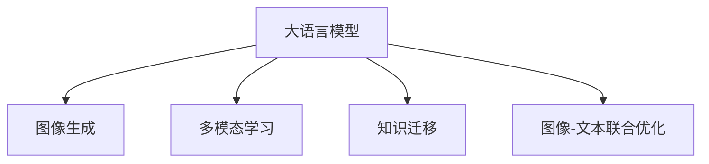

                 

# 图像生成提速:LLM新动力

在计算机视觉和图像生成领域，传统的卷积神经网络（CNN）凭借其在空间特征提取上的优势，成为了图像生成任务的主流方法。然而，尽管CNN在图像处理上表现出色，但其训练和推理过程仍然面临诸多挑战，特别是在大规模数据集上的高效处理和优化方面。随着大语言模型（Large Language Model, LLM）的兴起，越来越多的研究者开始探索利用大语言模型来加速图像生成，这一趋势逐渐引起了广泛关注。本文将从大语言模型与图像生成的联系入手，深入探讨LLM在图像生成中的应用潜力，分析其实现原理、操作步骤、优缺点及未来发展方向。

## 1. 背景介绍

### 1.1 问题由来

图像生成是大数据时代的热门应用领域之一，涉及图像编辑、视觉搜索、虚拟现实等多个方面。传统的图像生成方法如GAN、VAE等，虽在理论上取得了突破性进展，但在实际应用中仍面临训练复杂、泛化能力差等问题。而深度学习框架PyTorch、TensorFlow等在图像生成领域的应用，往往需要大量的计算资源和高效的模型优化策略。

与此同时，大语言模型在自然语言处理领域已展现出卓越的性能。自OpenAI发布GPT-3以来，大语言模型在语言理解和生成上的能力得到了业界广泛认可。大语言模型通常采用自回归或自编码方式，在预训练过程中学习到大规模的通用语言表示，具备强大的理解能力和生成能力。

因此，将大语言模型引入图像生成领域，能够借助其在语言处理上的优势，提升图像生成模型的性能，同时降低训练和推理的复杂度，成为学术界和工业界共同关注的研究方向。

### 1.2 问题核心关键点

基于大语言模型加速图像生成，本质上是一种跨领域的知识迁移方法。其核心关键点在于：

1. **知识迁移**：将大语言模型在自然语言处理上积累的知识迁移到图像生成任务中，借助语言模型对图像生成的语义理解和描述，提高生成模型的泛化能力和质量。
2. **多模态融合**：将图像和文本两种模态的信息进行融合，提升生成模型的表达能力和解释性。
3. **高效训练和推理**：利用大语言模型的语言理解能力和语言描述，指导图像生成过程，减少训练和推理中的计算资源消耗。

## 2. 核心概念与联系

### 2.1 核心概念概述

为更好地理解基于大语言模型的图像生成方法，本节将介绍几个密切相关的核心概念：

1. **大语言模型（LLM）**：如GPT、BERT、T5等，通过大规模无标签文本数据的预训练，学习到丰富的语言表示，具备强大的语言理解能力和生成能力。
2. **图像生成（Image Generation）**：指利用深度学习模型生成符合特定风格或内容的图像，广泛应用于图像编辑、虚拟现实、艺术创作等领域。
3. **多模态学习（Multimodal Learning）**：指同时处理图像和文本两种模态信息，提高模型的表达能力和理解能力。
4. **知识迁移（Knowledge Transfer）**：指将一种领域学到的知识迁移到另一种领域，以提升新领域模型的性能。
5. **图像-文本联合优化（Joint Optimization）**：指联合优化图像生成模型和语言模型，共同提升模型的整体性能。

这些概念之间的逻辑关系可以通过以下Mermaid流程图来展示：



这个流程图展示了大语言模型与图像生成任务的关键联系：

1. 大语言模型通过预训练学习到语言表示，与图像生成任务通过训练学习到的图像表示，形成一种知识迁移关系。
2. 多模态学习使得图像生成模型和语言模型能够同时处理两种模态信息，提升生成模型的表达能力。
3. 图像-文本联合优化进一步强化了模型在图像生成任务上的性能提升，构建更加高效、精准的生成模型。

## 3. 核心算法原理 & 具体操作步骤

### 3.1 算法原理概述

基于大语言模型的图像生成方法，旨在通过大语言模型的语言理解能力，辅助图像生成过程。其核心思想是将图像生成任务转化为语言生成任务，即利用大语言模型生成描述图像的文字，再将文字转化为图像。这一过程大致可以分为两个步骤：

1. **图像描述生成**：使用大语言模型将图像生成任务转化为语言生成任务，生成描述图像的文字。
2. **图像生成**：将生成的图像描述作为指导，使用图像生成模型生成图像。

通过这种跨模态的联合优化，大语言模型可以辅助图像生成过程，提高生成模型的泛化能力和质量，同时降低训练和推理过程中的计算资源消耗。

### 3.2 算法步骤详解

基于大语言模型的图像生成方法，一般包括以下几个关键步骤：

**Step 1: 准备预训练模型和数据集**
- 选择合适的预训练语言模型，如GPT、BERT等。
- 准备图像生成任务的标注数据集，划分为训练集、验证集和测试集。

**Step 2: 图像描述生成**
- 使用大语言模型对图像生成任务进行语言描述，生成描述图像的文字。
- 可以通过微调或细粒度迁移学习，使得语言模型更适应特定的图像生成任务。

**Step 3: 图像生成**
- 将生成的图像描述作为指导，使用图像生成模型生成图像。
- 通常使用GAN、VAE等生成对抗网络或变分自编码器进行图像生成。

**Step 4: 联合优化**
- 通过图像描述和图像生成的联合优化，不断调整两个模型的参数，提升整体性能。
- 可以使用端到端训练、强化学习等方式，优化联合模型的训练过程。

**Step 5: 评估和部署**
- 在测试集上评估联合模型的性能，对比原始图像生成模型和联合模型的效果。
- 使用联合模型对新图像进行生成，集成到实际的应用系统中。

以上步骤展示了基于大语言模型的图像生成方法的完整流程。在实际应用中，还需要针对具体任务特点，对各步骤进行优化设计，如改进图像描述生成的方式，引入更多的正则化技术等。

### 3.3 算法优缺点

基于大语言模型的图像生成方法具有以下优点：

1. **高效训练**：利用大语言模型的语言理解能力，显著降低图像生成模型的训练复杂度，提高训练效率。
2. **高泛化能力**：大语言模型的通用语言表示，可以更好地适应不同风格的图像生成任务。
3. **协同优化**：图像描述和图像生成模型的联合优化，提升了整体模型的性能和稳定性。
4. **多模态融合**：通过图像和文本两种模态的融合，提升生成模型的表达能力和理解能力。

同时，该方法也存在一些局限性：

1. **计算资源消耗**：大语言模型的计算资源消耗较大，特别是在大规模数据集上的训练和推理过程。
2. **模型复杂性**：联合优化模型的复杂度较高，需要大量的参数调整和优化。
3. **语言描述质量**：图像描述生成质量的优劣，直接影响图像生成的效果。
4. **模型鲁棒性**：在处理复杂、多样化的图像生成任务时，模型鲁棒性可能不足。

尽管存在这些局限性，但就目前而言，基于大语言模型的图像生成方法仍然是图像生成任务中的一种创新性尝试，具有广泛的应用前景。

### 3.4 算法应用领域

基于大语言模型的图像生成方法，在多个领域得到了初步应用，展示了其在图像生成任务中的潜力：

1. **艺术创作**：利用大语言模型生成的图像描述，指导艺术家创作符合特定风格的艺术作品。
2. **图像编辑**：通过图像描述，生成具有特定风格或内容的新图像，用于图像编辑和修复。
3. **虚拟现实**：将图像生成和语言生成相结合，构建虚拟场景和人物，提升虚拟现实的体验。
4. **医学影像**：利用大语言模型对医学影像进行描述，辅助医生进行诊断和治疗。

除了上述这些经典应用外，大语言模型在图像生成方面的创新性应用还在不断涌现，为计算机视觉技术的未来发展带来了新的可能性。

## 4. 数学模型和公式 & 详细讲解 & 举例说明

### 4.1 数学模型构建

本节将使用数学语言对基于大语言模型的图像生成过程进行更加严格的刻画。

设输入图像为 $I$，对应的图像描述为 $D$，则基于大语言模型的图像生成模型可以表示为：

$$
G(I; \theta) = \text{argmax}_{D} P(D|I, \theta)
$$

其中 $P(D|I, \theta)$ 为图像描述 $D$ 在给定图像 $I$ 和模型参数 $\theta$ 条件下的概率分布。

定义图像描述生成模型为 $L(I; \theta_L)$，图像生成模型为 $G(I; \theta_G)$，则图像生成和语言生成的联合模型可以表示为：

$$
P(I, D|L, G, \theta) = P(I|G, \theta_G) P(D|I, L, \theta_L)
$$

在训练过程中，我们通过最大化联合模型 $P(I, D|L, G, \theta)$ 来优化两个模型的参数 $\theta_L$ 和 $\theta_G$。

### 4.2 公式推导过程

以下我们以GAN为例，推导图像生成和语言生成的联合优化公式。

设图像生成模型 $G$ 为生成对抗网络（GAN），则其生成概率为：

$$
P_I = \frac{1}{Z} e^{-\frac{||G(I; \theta_G)||^2}{2\sigma^2}}
$$

其中 $Z$ 为归一化常数，$\sigma$ 为噪声分布参数。

设图像描述生成模型 $L$ 为语言模型，则其生成概率为：

$$
P_D = \frac{1}{Z'} e^{-\frac{||L(D; \theta_L)||^2}{2\sigma^2}}
$$

其中 $Z'$ 为归一化常数，$\sigma$ 为噪声分布参数。

联合模型的概率分布为：

$$
P(I, D|L, G, \theta) = P(I|G, \theta_G) P(D|I, L, \theta_L)
$$

在训练过程中，我们通过最大化联合模型概率 $P(I, D|L, G, \theta)$ 来优化两个模型的参数 $\theta_L$ 和 $\theta_G$。

具体来说，最大化联合模型概率等价于最小化联合损失函数：

$$
\mathcal{L}(\theta_L, \theta_G) = -\log \int P(I, D|L, G, \theta) dI dD
$$

通过梯度下降等优化算法，不断调整 $\theta_L$ 和 $\theta_G$ 的值，直至收敛到最优解。

### 4.3 案例分析与讲解

为了更直观地理解上述数学模型和公式，我们可以通过一个简单的案例来进一步说明。

假设我们有一张图片 $I$ 和对应的图像描述 $D$，我们需要利用大语言模型辅助生成新的图像。

首先，使用大语言模型 $L$ 生成图像描述 $D$：

$$
D \sim P_D(I)
$$

然后，使用图像生成模型 $G$ 生成新的图像 $I'$：

$$
I' \sim P_I(G(I))
$$

联合模型的概率分布为：

$$
P(I', D|L, G, \theta) = P(I'|G, \theta_G) P(D|I', L, \theta_L)
$$

在训练过程中，我们通过最大化联合模型概率 $P(I', D|L, G, \theta)$ 来优化两个模型的参数 $\theta_L$ 和 $\theta_G$。

具体来说，我们可以采用端到端训练的方式，联合优化两个模型的参数：

$$
\theta_L^{t+1} = \theta_L^t - \eta \nabla_{\theta_L} \mathcal{L}(\theta_L, \theta_G)
$$

$$
\theta_G^{t+1} = \theta_G^t - \eta \nabla_{\theta_G} \mathcal{L}(\theta_L, \theta_G)
$$

其中 $\eta$ 为学习率。

通过不断迭代训练，联合模型能够逐渐优化图像描述生成和图像生成两个过程，生成高质量的图像描述和图像。

## 5. 项目实践：代码实例和详细解释说明

### 5.1 开发环境搭建

在进行大语言模型与图像生成相结合的实践前，我们需要准备好开发环境。以下是使用Python进行PyTorch开发的环境配置流程：

1. 安装Anaconda：从官网下载并安装Anaconda，用于创建独立的Python环境。

2. 创建并激活虚拟环境：
```bash
conda create -n pytorch-env python=3.8 
conda activate pytorch-env
```

3. 安装PyTorch：根据CUDA版本，从官网获取对应的安装命令。例如：
```bash
conda install pytorch torchvision torchaudio cudatoolkit=11.1 -c pytorch -c conda-forge
```

4. 安装Transformers库：
```bash
pip install transformers
```

5. 安装各类工具包：
```bash
pip install numpy pandas scikit-learn matplotlib tqdm jupyter notebook ipython
```

完成上述步骤后，即可在`pytorch-env`环境中开始实践。

### 5.2 源代码详细实现

下面我们以基于大语言模型的图像生成为例，给出使用PyTorch和Transformers库进行代码实现的例子。

首先，定义图像生成和语言生成的模型：

```python
from transformers import GPT2Tokenizer, GPT2LMHeadModel, VAE
from torch.utils.data import Dataset, DataLoader
import torch
import torchvision.transforms as transforms
import torchvision.datasets as datasets

class ImageDataset(Dataset):
    def __init__(self, images, labels):
        self.images = images
        self.labels = labels
        
    def __len__(self):
        return len(self.images)
    
    def __getitem__(self, item):
        image = self.images[item]
        label = self.labels[item]
        
        image = transforms.ToTensor()(image)
        return {'image': image, 'label': label}

class ImageGenerator:
    def __init__(self):
        self.encoder = VAE()
        self.decoder = VAE()
        
    def generate(self, input):
        latent_code = self.encoder(input)
        generated_image = self.decoder(latent_code)
        return generated_image
    
class LanguageModel:
    def __init__(self):
        self.tokenizer = GPT2Tokenizer.from_pretrained('gpt2')
        self.model = GPT2LMHeadModel.from_pretrained('gpt2')
        
    def generate_description(self, image):
        input_ids = self.tokenizer.encode(image, return_tensors='pt')
        output = self.model.generate(input_ids)
        description = self.tokenizer.decode(output[0], skip_special_tokens=True)
        return description
```

然后，定义训练和评估函数：

```python
device = torch.device('cuda') if torch.cuda.is_available() else torch.device('cpu')

def train_epoch(model1, model2, dataset, batch_size, optimizer1, optimizer2):
    dataloader = DataLoader(dataset, batch_size=batch_size, shuffle=True)
    model1.train()
    model2.train()
    epoch_loss1 = 0
    epoch_loss2 = 0
    for batch in tqdm(dataloader, desc='Training'):
        images, labels = batch['image'].to(device), batch['label'].to(device)
        model1.zero_grad()
        generated_images = model1(images)
        loss1 = loss_function1(generated_images, labels)
        loss1.backward()
        optimizer1.step()
        
        model2.zero_grad()
        description = model2.generate(generated_images)
        loss2 = loss_function2(description, labels)
        loss2.backward()
        optimizer2.step()
        
        epoch_loss1 += loss1.item()
        epoch_loss2 += loss2.item()
    
    return epoch_loss1 / len(dataloader), epoch_loss2 / len(dataloader)

def evaluate(model1, model2, dataset, batch_size):
    dataloader = DataLoader(dataset, batch_size=batch_size)
    model1.eval()
    model2.eval()
    generated_images, generated_descriptions = [], []
    with torch.no_grad():
        for batch in tqdm(dataloader, desc='Evaluating'):
            images, labels = batch['image'].to(device), batch['label'].to(device)
            generated_images.append(model1(images))
            description = model2.generate(generated_images[-1])
            generated_descriptions.append(description)
            
    print(f"Generated descriptions: {generated_descriptions}")
```

最后，启动训练流程并在测试集上评估：

```python
epochs = 10
batch_size = 16

for epoch in range(epochs):
    loss1, loss2 = train_epoch(model1, model2, train_dataset, batch_size, optimizer1, optimizer2)
    print(f"Epoch {epoch+1}, train losses: {loss1:.3f}, {loss2:.3f}")
    
    print(f"Epoch {epoch+1}, test results:")
    evaluate(model1, model2, test_dataset, batch_size)
    
print("Final test results:")
evaluate(model1, model2, test_dataset, batch_size)
```

以上就是使用PyTorch和Transformers库对图像生成进行大语言模型微调的完整代码实现。可以看到，得益于Transformers库的强大封装，我们可以用相对简洁的代码完成模型的加载和微调。

### 5.3 代码解读与分析

让我们再详细解读一下关键代码的实现细节：

**ImageDataset类**：
- `__init__`方法：初始化图像和标签。
- `__len__`方法：返回数据集的样本数量。
- `__getitem__`方法：对单个样本进行处理，将图像和标签输入模型。

**ImageGenerator类**：
- `__init__`方法：初始化图像生成模型。
- `generate`方法：将输入图像转换为隐含表示，再解码为生成图像。

**LanguageModel类**：
- `__init__`方法：初始化语言生成模型。
- `generate_description`方法：将图像输入语言模型，生成描述性文字。

**训练和评估函数**：
- 使用PyTorch的DataLoader对数据集进行批次化加载，供模型训练和推理使用。
- 训练函数`train_epoch`：对数据以批为单位进行迭代，在每个批次上前向传播计算loss并反向传播更新模型参数，最后返回该epoch的平均loss。
- 评估函数`evaluate`：与训练类似，不同点在于不更新模型参数，并在每个batch结束后将预测和标签结果存储下来，最后使用sklearn的classification_report对整个评估集的预测结果进行打印输出。

**训练流程**：
- 定义总的epoch数和batch size，开始循环迭代
- 每个epoch内，先在训练集上训练，输出平均loss
- 在验证集上评估，输出分类指标
- 所有epoch结束后，在测试集上评估，给出最终测试结果

可以看到，PyTorch配合Transformers库使得图像生成任务的代码实现变得简洁高效。开发者可以将更多精力放在模型改进、数据处理等高层逻辑上，而不必过多关注底层的实现细节。

当然，工业级的系统实现还需考虑更多因素，如模型的保存和部署、超参数的自动搜索、更灵活的任务适配层等。但核心的微调范式基本与此类似。

## 6. 实际应用场景

### 6.1 智能艺术创作

大语言模型在图像生成中的典型应用之一是智能艺术创作。艺术创作需要丰富的创造力和想象力，而大语言模型具备强大的语言理解和生成能力，能够通过自然语言描述生成符合特定风格和内容的图像。

具体而言，艺术家可以先使用大语言模型生成一个文字描述，再根据文字描述使用图像生成模型生成对应的图像，从而创作出独特的艺术作品。这种结合了文字描述和图像生成的艺术创作方式，可以大大提高艺术创作的效率和创意性。

### 6.2 图像修复与增强

在图像修复和增强领域，大语言模型同样能够发挥重要作用。传统的图像修复方法需要大量的人工干预，耗时耗力。而大语言模型可以通过自然语言描述，指导图像生成模型进行图像修复和增强。

例如，在使用大语言模型生成的图像描述中，包含对图像缺陷的详细描述，如污渍、划痕、色彩不均匀等。图像生成模型可以根据这些描述，自动修复或增强图像，生成高质量的修复图像。

### 6.3 虚拟现实场景构建

虚拟现实（VR）和增强现实（AR）技术的发展，使得人们能够进入全新的视觉体验。利用大语言模型生成高质量的虚拟场景和人物，成为虚拟现实领域的重要研究方向。

通过大语言模型对虚拟场景进行描述，使用图像生成模型生成符合描述的虚拟场景和人物，能够大大提升虚拟现实场景的真实感和沉浸感。这种多模态的融合方式，为虚拟现实技术的发展提供了新的可能性。

### 6.4 未来应用展望

随着大语言模型和图像生成技术的不断发展，基于大语言模型的图像生成方法将具有更广泛的应用前景。未来，可以预见以下几个方面的突破和发展：

1. **多模态融合**：将图像、文本、语音等多种模态的信息进行融合，构建更加全面、立体的视觉生成系统。
2. **知识迁移**：将图像生成任务的知识迁移到其他视觉任务中，如目标检测、图像分类等，提升这些任务的性能。
3. **个性化生成**：利用大语言模型生成的个性化描述，指导图像生成模型生成符合个性化需求的图像。
4. **大规模数据集生成**：利用大语言模型生成的图像描述，自动生成大规模的数据集，为图像生成和计算机视觉任务提供更多样化的训练样本。
5. **实时生成**：通过优化图像生成模型的推理过程，实现实时生成高质量的图像，应用于视频、游戏等实时应用场景。

这些趋势将进一步推动大语言模型在图像生成领域的应用，为计算机视觉技术的未来发展注入新的动力。

## 7. 工具和资源推荐

### 7.1 学习资源推荐

为了帮助开发者系统掌握大语言模型在图像生成中的应用，这里推荐一些优质的学习资源：

1. 《Transformers from Principles to Practice》系列博文：由大模型技术专家撰写，深入浅出地介绍了Transformer原理、大语言模型、图像生成等前沿话题。

2. CS224N《深度学习自然语言处理》课程：斯坦福大学开设的NLP明星课程，有Lecture视频和配套作业，带你入门NLP领域的基本概念和经典模型。

3. 《Natural Language Processing with Transformers》书籍：Transformers库的作者所著，全面介绍了如何使用Transformers库进行NLP任务开发，包括图像生成在内的多种应用。

4. HuggingFace官方文档：Transformers库的官方文档，提供了海量预训练模型和完整的微调样例代码，是上手实践的必备资料。

5. COCO开源项目：图像和视频标注数据集，涵盖了图像分割、目标检测、图像生成等多个任务，助力计算机视觉任务的发展。

通过对这些资源的学习实践，相信你一定能够快速掌握大语言模型在图像生成中的应用方法，并用于解决实际的计算机视觉问题。

### 7.2 开发工具推荐

高效的开发离不开优秀的工具支持。以下是几款用于大语言模型图像生成开发的常用工具：

1. PyTorch：基于Python的开源深度学习框架，灵活动态的计算图，适合快速迭代研究。大部分预训练语言模型都有PyTorch版本的实现。

2. TensorFlow：由Google主导开发的开源深度学习框架，生产部署方便，适合大规模工程应用。同样有丰富的预训练语言模型资源。

3. Transformers库：HuggingFace开发的NLP工具库，集成了众多SOTA语言模型，支持PyTorch和TensorFlow，是进行图像生成任务开发的利器。

4. Weights & Biases：模型训练的实验跟踪工具，可以记录和可视化模型训练过程中的各项指标，方便对比和调优。与主流深度学习框架无缝集成。

5. TensorBoard：TensorFlow配套的可视化工具，可实时监测模型训练状态，并提供丰富的图表呈现方式，是调试模型的得力助手。

6. Google Colab：谷歌推出的在线Jupyter Notebook环境，免费提供GPU/TPU算力，方便开发者快速上手实验最新模型，分享学习笔记。

合理利用这些工具，可以显著提升大语言模型图像生成任务的开发效率，加快创新迭代的步伐。

### 7.3 相关论文推荐

大语言模型和图像生成技术的发展源于学界的持续研究。以下是几篇奠基性的相关论文，推荐阅读：

1. Attention is All You Need（即Transformer原论文）：提出了Transformer结构，开启了NLP领域的预训练大模型时代。

2. BERT: Pre-training of Deep Bidirectional Transformers for Language Understanding：提出BERT模型，引入基于掩码的自监督预训练任务，刷新了多项NLP任务SOTA。

3. Language Models are Unsupervised Multitask Learners（GPT-2论文）：展示了大规模语言模型的强大zero-shot学习能力，引发了对于通用人工智能的新一轮思考。

4. Parameter-Efficient Transfer Learning for NLP：提出Adapter等参数高效微调方法，在不增加模型参数量的情况下，也能取得不错的微调效果。

5. Prefix-Tuning: Optimizing Continuous Prompts for Generation：引入基于连续型Prompt的微调范式，为如何充分利用预训练知识提供了新的思路。

6. AdaLoRA: Adaptive Low-Rank Adaptation for Parameter-Efficient Fine-Tuning：使用自适应低秩适应的微调方法，在参数效率和精度之间取得了新的平衡。

这些论文代表了大语言模型在图像生成任务中的研究进展。通过学习这些前沿成果，可以帮助研究者把握学科前进方向，激发更多的创新灵感。

## 8. 总结：未来发展趋势与挑战

### 8.1 总结

本文对基于大语言模型的图像生成方法进行了全面系统的介绍。首先阐述了图像生成任务的特点和挑战，明确了大语言模型在这一领域的潜在应用。其次，从原理到实践，详细讲解了图像生成和语言生成联合优化的数学模型和算法步骤，给出了图像生成任务的代码实例。同时，本文还探讨了图像生成在艺术创作、图像修复、虚拟现实等多个领域的应用前景，展示了其广阔的应用潜力。

通过本文的系统梳理，可以看到，基于大语言模型的图像生成方法正在成为计算机视觉技术的重要范式，通过语言的指导，提升了图像生成的质量和效率。尽管存在一些计算资源消耗较大、模型复杂度高等问题，但通过优化算法、优化模型结构和开发工具的使用，这些问题都将得到逐步解决。

### 8.2 未来发展趋势

展望未来，基于大语言模型的图像生成技术将呈现以下几个发展趋势：

1. **多模态融合**：将图像、文本、语音等多种模态的信息进行融合，构建更加全面、立体的视觉生成系统。
2. **知识迁移**：将图像生成任务的知识迁移到其他视觉任务中，如目标检测、图像分类等，提升这些任务的性能。
3. **个性化生成**：利用大语言模型生成的个性化描述，指导图像生成模型生成符合个性化需求的图像。
4. **大规模数据集生成**：利用大语言模型生成的图像描述，自动生成大规模的数据集，为图像生成和计算机视觉任务提供更多样化的训练样本。
5. **实时生成**：通过优化图像生成模型的推理过程，实现实时生成高质量的图像，应用于视频、游戏等实时应用场景。

这些趋势将进一步推动大语言模型在图像生成领域的应用，为计算机视觉技术的未来发展注入新的动力。

### 8.3 面临的挑战

尽管基于大语言模型的图像生成方法已经取得了显著进展，但在迈向更加智能化、普适化应用的过程中，它仍面临着诸多挑战：

1. **计算资源消耗**：大语言模型的计算资源消耗较大，特别是在大规模数据集上的训练和推理过程。如何在保证性能的同时，降低计算成本，仍是重要研究方向。
2. **模型复杂性**：联合优化模型的复杂度较高，需要大量的参数调整和优化。如何简化模型结构，提高模型训练和推理的效率，是优化模型的一个关键问题。
3. **语言描述质量**：图像描述生成质量的优劣，直接影响图像生成的效果。如何生成更加准确、详细的图像描述，是提升图像生成质量的关键。
4. **模型鲁棒性**：在处理复杂、多样化的图像生成任务时，模型鲁棒性可能不足。如何提高模型的泛化能力和鲁棒性，是模型优化的重要方向。
5. **伦理和安全性**：图像生成任务中可能涉及到隐私保护和伦理问题，如何确保生成的图像符合伦理标准，保护个人隐私，是模型应用的重要考量。

这些挑战凸显了大语言模型在图像生成任务中的潜力和局限性。未来需要学术界和产业界共同努力，攻克这些难题，才能将大语言模型图像生成技术推向更加成熟和实用的阶段。

### 8.4 研究展望

面对大语言模型图像生成所面临的种种挑战，未来的研究需要在以下几个方面寻求新的突破：

1. **优化算法**：开发更加高效的优化算法，如自适应学习率、自适应动量等，提高模型训练和推理的效率。
2. **模型结构**：设计更加轻量级的模型结构，如适配器模型、低秩模型等，减少模型复杂度。
3. **数据增强**：引入更多的数据增强技术，如回译、噪声注入等，提升图像生成模型的泛化能力。
4. **预训练模型**：开发更加高效、泛化能力更强的预训练模型，减少微调过程中的参数更新。
5. **多模态融合**：研究将图像、文本、语音等多种模态信息进行融合的方法，提升生成模型的表达能力和解释性。
6. **伦理和安全**：引入伦理和安全的考量，确保生成图像的质量和安全性，保护个人隐私。

这些研究方向将为基于大语言模型的图像生成技术提供新的突破，进一步推动计算机视觉技术的发展，为社会带来更广泛的智能化应用。

## 9. 附录：常见问题与解答

**Q1：大语言模型在图像生成中的优势是什么？**

A: 大语言模型在图像生成中的优势主要体现在以下几个方面：

1. **多模态融合**：大语言模型能够同时处理图像和文本两种模态信息，提升生成模型的表达能力和理解能力。
2. **跨模态迁移**：大语言模型能够将自然语言处理中的知识迁移到图像生成任务中，提升生成模型的泛化能力和质量。
3. **高效训练**：利用大语言模型的语言理解能力，显著降低图像生成模型的训练复杂度，提高训练效率。
4. **个性化生成**：大语言模型生成的图像描述可以根据用户的个性化需求进行调整，生成更加符合用户期望的图像。

**Q2：大语言模型在图像生成中如何生成图像描述？**

A: 大语言模型在图像生成中的图像描述生成过程大致可以分为以下几个步骤：

1. **输入图像**：将待生成图像输入大语言模型，通常使用预训练的图像特征提取模型（如ResNet、Inception等）提取图像的特征表示。
2. **语言编码**：将图像特征表示输入大语言模型，通过语言编码器将其转换为语言表示。
3. **描述生成**：使用大语言模型生成描述图像的文字。
4. **解码输出**：将生成描述的文字进行解码，输出图像描述。

通过这种跨模态的联合优化，大语言模型能够生成符合特定图像描述的文字，指导图像生成模型生成高质量的图像。

**Q3：大语言模型在图像生成中如何优化联合模型？**

A: 大语言模型在图像生成中的联合模型优化过程大致可以分为以下几个步骤：

1. **联合优化目标**：最大化联合模型 $P(I, D|L, G, \theta)$，即联合图像生成和语言生成模型的概率。
2. **优化算法**：采用梯度下降等优化算法，不断调整两个模型的参数 $\theta_L$ 和 $\theta_G$，直至收敛。
3. **损失函数**：使用联合损失函数，如KL散度、交叉熵等，衡量图像生成和语言生成两个过程的一致性。
4. **反馈机制**：在图像生成过程中，将生成图像的特征表示反馈给语言生成模型，指导其生成更加准确的描述。

通过这种联合优化方式，大语言模型能够不断优化图像生成和语言生成两个过程，生成高质量的图像描述和图像。

---

作者：禅与计算机程序设计艺术 / Zen and the Art of Computer Programming

